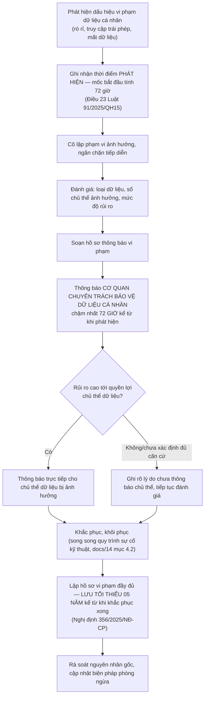

# Chính sách bảo mật

**Hệ thống quản lý dữ liệu số hóa Văn Miếu — Quốc Tử Giám** — phiên bản 1.0.0, cập nhật 12/08/2026. Tài liệu liên quan: [`docs/01-thuyet-minh-ky-thuat.md`](docs/01-thuyet-minh-ky-thuat.md) (Chương 9 — An toàn thông tin và bảo vệ dữ liệu cá nhân) · [`docs/14-van-hanh-va-ban-giao.md`](docs/14-van-hanh-va-ban-giao.md) (Mục 4 — SLA sự cố) · [`docs/16-van-de-da-biet.md`](docs/16-van-de-da-biet.md) · [`CONTRIBUTING.md`](CONTRIBUTING.md).

---

## 1. Phạm vi

Chính sách này áp dụng cho mã nguồn và tài liệu trong kho này — ứng dụng quản lý dữ liệu số hóa cho Trung tâm Hoạt động Văn hóa Khoa học Văn Miếu — Quốc Tử Giám. Tính đến phiên bản 1.0.0, đây là **bản trình diễn/dự thầu**: lớp dịch vụ là giả lập trong trình duyệt, chưa có máy chủ API hay cơ sở dữ liệu thật đang vận hành (xem `docs/16-van-de-da-biet.md` mục 2.1) — vì vậy chính sách này gồm hai phần: **(A)** quy trình báo cáo lỗ hổng áp dụng ngay từ bản trình diễn (rủi ro chủ yếu ở mã nguồn phía client và các phụ thuộc), và **(B)** cam kết bảo mật và quy trình sự cố sẽ có hiệu lực đầy đủ khi hệ thống vận hành chính thức với dữ liệu thật.

Phạm vi **không bao gồm**: hạ tầng máy chủ/mạng do đơn vị vận hành hạ tầng (Trung tâm dữ liệu Thành phố hoặc nhà cung cấp dịch vụ đám mây được chọn) trực tiếp quản lý — báo cáo về hạ tầng đó gửi theo kênh của đơn vị vận hành tương ứng.

---

## 2. Báo cáo lỗ hổng bảo mật

### 2.1. Kênh báo cáo

Không báo cáo lỗ hổng bảo mật qua kênh công khai (issue tracker công khai, mạng xã hội). Gửi báo cáo qua:

| Kênh | Thông tin |
|---|---|
| Đầu mối kỹ thuật của nhà thầu | **Đơn vị điền** — địa chỉ thư điện tử bảo mật riêng (khuyến nghị dạng `security@<tên-miền>`), thiết lập trước khi bàn giao |
| Đầu mối kỹ thuật của Trung tâm | **Đơn vị điền** — cán bộ đầu mối kỹ thuật theo `docs/13-ke-hoach-quan-ly-du-an.md` mục 2.2 |
| Khóa mã hóa cho báo cáo nhạy cảm (khuyến nghị) | **Đơn vị điền** — khóa PGP công khai nếu đơn vị có |

### 2.2. Thông tin cần cung cấp

Để xử lý nhanh, báo cáo nên gồm: mô tả lỗ hổng và tác động ước tính; các bước tái hiện; phiên bản/commit bị ảnh hưởng; bằng chứng (ảnh chụp màn hình, log — **không kèm dữ liệu cá nhân hoặc dữ liệu di sản nhạy cảm thật** trong báo cáo); thông tin liên hệ để phản hồi. Người báo cáo có thể báo cáo ẩn danh nhưng khi đó nhóm xử lý không phản hồi trực tiếp được.

### 2.3. Cam kết thời gian phản hồi

| Mốc | Thời gian |
|---|---|
| Xác nhận đã nhận báo cáo | ≤ 2 ngày làm việc |
| Đánh giá mức độ nghiêm trọng ban đầu | ≤ 5 ngày làm việc |
| Khắc phục — mức Nghiêm trọng/Cao | Theo SLA sự cố tại `docs/14-van-hanh-va-ban-giao.md` mục 4.1 (tiếp nhận ≤ 1–4 giờ, khắc phục ≤ 4 giờ–1 ngày làm việc) khi hệ thống đã vận hành chính thức; ở giai đoạn bản trình diễn, khắc phục trong đợt phát triển gần nhất, không quá 10 ngày làm việc |
| Khắc phục — mức Trung bình/Thấp | Theo đợt cập nhật định kỳ |
| Thông báo cho người báo cáo khi đã khắc phục | Trong vòng 2 ngày làm việc sau khi khắc phục xong |

---

## 3. Quy trình xử lý sự cố dữ liệu cá nhân theo Luật Bảo vệ dữ liệu cá nhân 91/2025/QH15

Trung tâm là **Bên Kiểm soát dữ liệu cá nhân** đối với hệ thống này và **không thuộc diện miễn trừ** của Nghị định 356/2025/NĐ-CP (các miễn trừ chỉ dành cho hộ kinh doanh, doanh nghiệp siêu nhỏ/nhỏ/khởi nghiệp — xem `docs/01-thuyet-minh-ky-thuat.md` Chương 9.7). Vì vậy mọi sự cố liên quan dữ liệu cá nhân (tài khoản người dùng nội bộ, nhật ký gắn danh tính, hoặc dữ liệu cá nhân trong tư liệu số hóa như ảnh chân dung, gia phả) tuân theo quy trình dưới đây.

### 3.1. Quy trình 72 giờ

### 3.2. Nội dung hồ sơ thông báo vi phạm

Tối thiểu: thời điểm phát hiện và thời điểm xảy ra (nếu xác định được); mô tả bản chất vi phạm; loại và số lượng dữ liệu cá nhân bị ảnh hưởng; hậu quả có thể xảy ra; biện pháp đã và sẽ thực hiện để khắc phục và giảm thiểu; thông tin đầu mối liên hệ (DPO — cán bộ bảo vệ dữ liệu cá nhân của Trung tâm, chỉ định theo Điều 33 khoản 2 Luật 91/2025/QH15). Mẫu hồ sơ cụ thể tham chiếu Nghị định 356/2025/NĐ-CP *(số hiệu mẫu và điều khoản chi tiết: cần đối chiếu nguyên văn trước khi ban hành chính thức)*.

### 3.3. Lưu hồ sơ vi phạm

Toàn bộ hồ sơ vi phạm — kể cả các vi phạm đã đánh giá là rủi ro thấp và không phải thông báo chủ thể dữ liệu — được lưu **tối thiểu 05 năm kể từ ngày khắc phục xong**, tách biệt khỏi nhật ký hệ thống thông thường (nhật ký hệ thống có thời hạn lưu riêng theo cấp độ an toàn thông tin — Chương 9.6, `docs/01-thuyet-minh-ky-thuat.md`). Hồ sơ này phục vụ thanh tra, kiểm tra của cơ quan chuyên trách và là căn cứ rà soát nguyên nhân gốc nội bộ.

### 3.4. Quan hệ với đánh giá tác động xử lý dữ liệu cá nhân (DPIA)

Sự cố phát hiện qua quy trình này được đối chiếu ngược lại với hồ sơ đánh giá tác động xử lý dữ liệu cá nhân đã lập trong 60 ngày kể từ ngày đầu tiên xử lý (Điều 21 Luật 91/2025/QH15) — nếu sự cố phát sinh từ một rủi ro chưa được nhận diện trong DPIA, hồ sơ DPIA phải được cập nhật (Điều 22 cùng luật).

---

## 4. Nguyên tắc công bố có trách nhiệm

- Người báo cáo được đề nghị **giữ kín thông tin lỗ hổng** cho tới khi bản vá được phát hành hoặc theo thời hạn thống nhất giữa hai bên (khuyến nghị tối đa 90 ngày kể từ ngày xác nhận, có thể gia hạn nếu mức độ phức tạp cần thêm thời gian).
- Nhóm xử lý không truy cứu trách nhiệm người báo cáo nếu việc phát hiện lỗ hổng thực hiện thiện chí, không khai thác dữ liệu thật, không gây gián đoạn dịch vụ, và tuân theo kênh báo cáo tại Mục 2.
- Không công bố chi tiết kỹ thuật của lỗ hổng liên quan dữ liệu di sản hoặc dữ liệu cá nhân ra công khai trước khi đã khắc phục và thông báo đầy đủ theo Mục 3 (nếu áp dụng).
- Sau khi khắc phục, nhóm xử lý ghi nhận đóng góp của người báo cáo (nếu người báo cáo đồng ý được nêu tên) trong nhật ký thay đổi nội bộ.

---

## 5. Cam kết an toàn của sản phẩm

Các cam kết dưới đây trích từ thiết kế an toàn thông tin đầy đủ tại `docs/01-thuyet-minh-ky-thuat.md` Chương 9 — áp dụng đầy đủ khi hệ thống vận hành chính thức; trạng thái hiện tại ở bản trình diễn xem `docs/16-van-de-da-biet.md`.

| Cam kết | Nội dung |
|---|---|
| **Mã hóa khi lưu** | Toàn bộ tệp gốc và cơ sở dữ liệu siêu dữ liệu mã hóa AES-256; khóa mã hóa quản lý tách biệt khỏi hạ tầng lưu trữ, có quy trình luân chuyển khóa |
| **Mã hóa khi truyền** | TLS 1.2 trở lên cho mọi kết nối người dùng–hệ thống; kênh riêng hoặc xác thực hai chiều cho kết nối tới nền tảng tích hợp, chia sẻ dữ liệu của Thành phố |
| **Phân quyền** | RBAC kết hợp ABAC (vai trò × phạm vi bộ sưu tập/khu vực dữ liệu); nguyên tắc bốn mắt — người duyệt không trùng người phụ trách hoặc người tải lên, chặn ở tầng dịch vụ chứ không chỉ ẩn nút giao diện |
| **Xác thực** | Đăng nhập bắt buộc cho mọi màn nghiệp vụ; xác thực hai yếu tố bắt buộc cho vai trò Quản trị và Phê duyệt; tối thiểu hai tài khoản quản trị độc lập, không dùng chung |
| **Nhật ký bất biến** | Chỉ ghi thêm, không sửa không xóa kể cả bởi tài khoản quản trị; chuỗi băm liên kết giữa các bản ghi để phát hiện can thiệp; ghi tối thiểu sáu trường (thời điểm, người thực hiện, hành động, đối tượng, địa chỉ IP, kết quả); tách sự kiện an toàn thông tin khỏi sự kiện nội dung; cảnh báo bất thường tự động |
| **Bảo vệ dữ liệu số hóa giá trị cao** | Dấu chìm động trên bản xem trước công khai; liên kết tải bản gốc có thời hạn; nhật ký tải xuống riêng biệt với nhật ký nội dung; chống sao chép trái phép và bán dữ liệu thô theo Điều 86 khoản 4 Nghị định 308/2025/NĐ-CP |
| **Tách môi trường** | Môi trường phát triển, kiểm thử, vận hành tách biệt hạ tầng và thông tin xác thực; **không dùng dữ liệu thật cho môi trường kiểm thử** |
| **Dữ liệu không rời lãnh thổ** | Hệ thống đặt tại hạ tầng trong nước; tài nguyên tĩnh đóng gói nội bộ; không gọi dịch vụ nào ngoài lãnh thổ khi vận hành |
| **Kiểm thử an toàn trước nghiệm thu** | Quét lỗ hổng, kiểm thử xâm nhập, kiểm thử phân quyền, kiểm thử tính bất biến nhật ký — báo cáo và biên bản khắc phục là điều kiện qua cổng TRR (`docs/13-ke-hoach-quan-ly-du-an.md` mục 4.4) |

---

*Chính sách này rà soát lại khi Luật An ninh mạng số 116/2025/QH15 có hiệu lực (01/7/2026) và khi có văn bản hướng dẫn thay thế Nghị định 85/2016/NĐ-CP — xem trạng thái "Chờ văn bản hướng dẫn" tại màn Tuân thủ & quản trị dữ liệu.*
