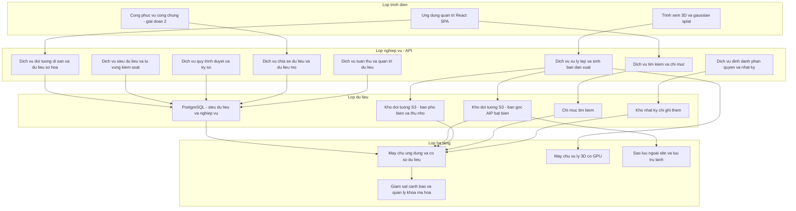
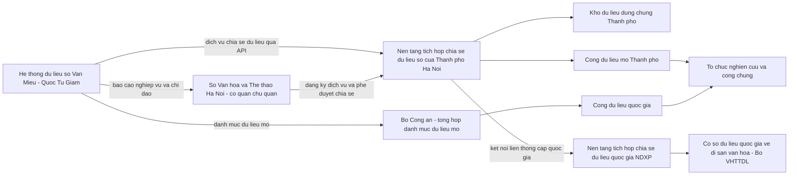
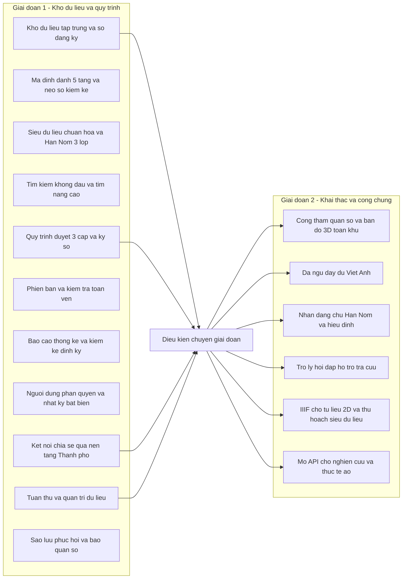

# THUYẾT MINH KỸ THUẬT
## Phần mềm quản lý và lưu trữ dữ liệu số — Di tích quốc gia đặc biệt Văn Miếu — Quốc Tử Giám

*Chủ đầu tư: Trung tâm Hoạt động Văn hóa Khoa học Văn Miếu — Quốc Tử Giám (đơn vị sự nghiệp công lập thuộc Sở Văn hóa và Thể thao Hà Nội).*
*Tài liệu số: 01 — Thuyết minh kỹ thuật. Phiên bản dự thảo 08/2026.*

> **Quy ước trích dẫn của tài liệu này.** Mọi số hiệu, ngày ban hành và số điều được viện dẫn dưới đây đều đã được đối chiếu với văn bản gốc (Công báo Chính phủ, cổng thông tin của cơ quan ban hành) trong quá trình lập hồ sơ. Những nội dung chưa đối chiếu được nguyên văn được đánh dấu rõ bằng cụm **"(cần đối chiếu nguyên văn trước khi nộp)"** và được tổng hợp lại thành danh mục kiểm tra ở cuối tài liệu. Nhà thầu chủ trương thà ghi nhận một khoảng trống còn hơn viện dẫn một điều khoản không kiểm chứng được.

---

## MỤC LỤC

**PHẦN I — CĂN CỨ VÀ BỐI CẢNH**
1. Căn cứ pháp lý và tiêu chuẩn áp dụng
2. Hiện trạng và sự cần thiết đầu tư
3. Mục tiêu, phạm vi và đối tượng sử dụng

**PHẦN II — YÊU CẦU VÀ THIẾT KẾ**
4. Yêu cầu chức năng
5. Yêu cầu phi chức năng
6. Kiến trúc giải pháp
7. Thiết kế dữ liệu
8. Thiết kế giao diện

**PHẦN III — AN TOÀN, HẠ TẦNG, TRIỂN KHAI**
9. An toàn thông tin và bảo vệ dữ liệu cá nhân
10. Hạ tầng tối thiểu
11. Sao lưu, phục hồi và vận hành liên tục
12. Kế hoạch triển khai
13. Đào tạo và chuyển giao
14. Bảo hành, bảo trì và hỗ trợ

**PHẦN IV — LỘ TRÌNH, CHI PHÍ, RỦI RO**
15. Lộ trình hai giai đoạn
16. Ước lượng chi phí vận hành
17. Phân tích rủi ro và biện pháp giảm thiểu
18. Cam kết của nhà thầu

**PHỤ LỤC PL1–PL9** · **DANH MỤC CẦN ĐỐI CHIẾU TRƯỚC KHI NỘP**

---

# PHẦN I — CĂN CỨ VÀ BỐI CẢNH

## Chương 1. Căn cứ pháp lý và tiêu chuẩn áp dụng

### 1.1. Bối cảnh chỉ đạo — vì sao dự án này được đặt ra vào năm 2026

Di tích Văn Miếu — Quốc Tử Giám được xếp hạng **Di tích quốc gia đặc biệt** theo **Quyết định số 548/QĐ-TTg ngày 10/5/2012** của Thủ tướng Chính phủ. Trong quần thể di tích, **82 bia Tiến sĩ** ghi danh các khoa thi từ năm 1442 đến năm 1779 đã được UNESCO ghi danh là **Di sản tư liệu thế giới khu vực châu Á — Thái Bình Dương (2010)** và **Di sản tư liệu thế giới cấp toàn cầu (2011)**. Đây đồng thời là hai danh hiệu đặt di tích vào **nhóm ưu tiên cao nhất** của các chương trình số hóa quốc gia:

| Văn bản chỉ đạo | Chỉ tiêu liên quan trực tiếp |
|---|---|
| **Quyết định 2026/QĐ-TTg ngày 02/12/2021** — Chương trình số hóa Di sản văn hóa Việt Nam giai đoạn 2021–2030 | *"100% các di sản văn hóa vật thể, phi vật thể và di sản tư liệu được UNESCO ghi danh; 100% các di tích quốc gia đặc biệt được số hóa và ứng dụng trên các nền tảng số"* đến năm 2030. Văn Miếu — Quốc Tử Giám thuộc **cả hai** nhóm chỉ tiêu này. *(Tình trạng hiệu lực của Quyết định: cần đối chiếu nguyên văn trước khi nộp — không tìm thấy văn bản bãi bỏ, thay thế.)* |
| **Quyết định 611/QĐ-TTg ngày 04/4/2026** — Đề án chuyển đổi số trong lĩnh vực văn hóa đến năm 2030, tầm nhìn đến năm 2045 | *"100% các loại hình di sản văn hóa đã số hóa được chuẩn hóa dữ liệu theo khung chuẩn quốc gia"*; *"80% di sản văn hóa số công có mã định danh số để xác lập quyền sở hữu, kiểm soát khai thác"*. *(Lưu ý ghi kèm năm khi trích dẫn: có một Quyết định 611/QĐ-TTg khác ngày 08/7/2024 thuộc lĩnh vực môi trường. Quan hệ giữa QĐ 611/QĐ-TTg (2026) và QĐ 2026/QĐ-TTg (2021) — thay thế hay song song — cần đối chiếu nguyên văn trước khi nộp.)* |

Hệ quả cho hồ sơ: dự án **không phải là một sáng kiến tự phát của đơn vị**, mà là bước triển khai cụ thể một chỉ tiêu đã được Thủ tướng Chính phủ giao. Toàn bộ thiết kế trong tài liệu này được neo vào hai mốc đó: **dữ liệu số hóa phải chuẩn hóa được** và **mỗi đối tượng di sản phải có mã định danh số bền vững** (xem Chương 7, mục 7.3).

### 1.2. Nhóm 1 — Pháp luật về di sản văn hóa

| Văn bản | Hiệu lực | Điều khoản áp dụng trực tiếp vào phần mềm |
|---|---|---|
| **Luật Di sản văn hóa số 45/2024/QH15** (thông qua 23/11/2024; 9 chương, 95 điều) | 01/7/2025 (Điều 94 khoản 1); thay Luật 28/2001/QH10 và Luật 32/2009/QH12 | **Điều 85** — Cơ sở dữ liệu quốc gia về di sản văn hóa và chuyển đổi số: Bộ VHTTDL xây dựng, quản lý, vận hành, cập nhật (kh.3); cơ quan, tổ chức, cá nhân xây dựng CSDL **theo phân cấp**, bảo đảm **tích hợp, kết nối, liên thông** với CSDL quốc gia (kh.4). **Điều 23** — Kiểm kê di tích và Danh mục kiểm kê. **Điều 33** — Nhiệm vụ của tổ chức được giao quản lý, sử dụng di tích (gồm ứng dụng khoa học công nghệ và chế độ thông tin báo cáo). **Điều 57 khoản 1 điểm đ** — di sản tư liệu phải được **chuyển dạng số, cập nhật, sao lưu** trên hệ thống CSDL quốc gia. **Chương IV (Điều 53–63)** — chế định riêng về di sản tư liệu. **Điều 88** — sử dụng, khai thác di sản văn hóa và các trường hợp hạn chế khai thác. |
| **Nghị định 308/2025/NĐ-CP ngày 28/11/2025** quy định chi tiết và biện pháp thi hành Luật Di sản văn hóa | 15/01/2026 | **Chương VIII — Chuyển đổi số trong lĩnh vực di sản văn hóa (Điều 85–89)**. **Điều 85 NĐ** — nguyên tắc: không gây tổn hại tính toàn vẹn, nguyên gốc; dữ liệu số phải **phản ánh chính xác** nội dung, đặc điểm, giá trị di sản theo tiêu chuẩn phù hợp; **ưu tiên mã nguồn mở, phần mềm trong nước**. **Điều 86 NĐ** — CSDL quốc gia do Bộ VHTTDL làm chủ quản; nghĩa vụ tích hợp, liên thông và **chống sao chép dữ liệu trái phép hoặc bán dữ liệu thô**. **Điều 87 NĐ** — việc chuyển đổi văn bản giấy sang thông điệp dữ liệu đối với **di tích quốc gia đặc biệt** phải có **ý kiến bằng văn bản của Bộ VHTTDL**. **Điều 88 NĐ** — quản trị dữ liệu, quy chuẩn cấu trúc dữ liệu trao đổi, hội đồng kiểm định độc lập chất lượng dữ liệu số. **Điều 89 NĐ** — kiểm duyệt nội dung trước khi đưa lên môi trường mạng. |
| **Thông tư 04/2025/TT-BVHTTDL ngày 13/5/2025** | 01/7/2025 | Kiểm kê di sản văn hóa và công bố Danh mục kiểm kê; thêm, di dời, thay đổi hiện vật trong di tích; di sản văn hóa hạn chế khai thác; **hướng dẫn khai thác, sử dụng CSDL quốc gia về di sản văn hóa**. |
| **Thông tư 05/2025/TT-BVHTTDL ngày 13/5/2025** | 01/7/2025 | Nhiệm vụ chuyên môn về **tư liệu hóa**, nghiên cứu, sưu tầm; chế độ báo cáo của Sở VHTTDL/Sở VH&TT về Bộ trước ngày 01/3 hằng năm. |
| **Thông tư 06/2025/TT-BVHTTDL ngày 13/5/2025** | 01/7/2025 | Bảo quản, tu bổ, phục hồi di tích và định mức kinh tế — kỹ thuật; là nguồn dữ liệu đầu vào cho hồ sơ can thiệp/trùng tu gắn với từng đối tượng di sản trong hệ thống. |

> **Lưu ý kỹ thuật khi trích dẫn:** dải số điều 85–89 tồn tại **cả trong Luật 45/2024 lẫn trong Nghị định 308/2025** với nội dung khác nhau. Toàn bộ tài liệu này luôn ghi rõ "Điều X Luật 45/2024" hoặc "Điều X NĐ 308/2025".
>
> Tính đến thời điểm lập hồ sơ, **chưa có thông tư hoặc quyết định riêng của Bộ VHTTDL ban hành đặc tả kỹ thuật metadata, lược đồ dữ liệu hay định dạng tệp số hóa** cho hiện vật/di tích; Điều 85 NĐ 308/2025 mới giao nhiệm vụ *xây dựng các bộ tiêu chuẩn dữ liệu số*. Vì vậy giải pháp áp dụng chuẩn quốc tế đã được Việt Nam chấp nhận (TCVN 7980-1:2024, TCVN 7980-2:2024) làm nền, đồng thời **thiết kế sẵn lớp ánh xạ** để tuân thủ ngay khi bộ tiêu chuẩn ngành được ban hành (xem Chương 7, mục 7.5).

### 1.3. Nhóm 2 — Pháp luật về dữ liệu, kết nối và chia sẻ dữ liệu

| Văn bản | Hiệu lực | Điều khoản áp dụng |
|---|---|---|
| **Luật Dữ liệu số 60/2024/QH15** (thông qua 30/11/2024) | 01/7/2025 | Điều 11 thu thập, tạo lập dữ liệu (bao gồm **số hóa giấy tờ, tài liệu**); Điều 12 chất lượng dữ liệu; Điều 13 phân loại; Điều 14 lưu trữ; Điều 15 quản trị; Điều 16 truy cập, truy xuất; **Điều 17 kết nối, chia sẻ, điều phối dữ liệu**; **Điều 21 công khai dữ liệu**; Điều 27 bảo vệ dữ liệu; Điều 28 tiêu chuẩn kỹ thuật. |
| **Nghị định 165/2025/NĐ-CP ngày 30/6/2025** | 01/7/2025 | Điều 3–4 dữ liệu quan trọng, dữ liệu cốt lõi; **Điều 5** lưu trữ (chủ sở hữu quy định thời hạn lưu trữ cụ thể; cơ quan nhà nước phải ban hành quy trình kỹ thuật lưu trữ); **Điều 10 công khai dữ liệu mở** (công bố danh mục dữ liệu mở và gửi Bộ Công an để tổng hợp, đăng trên Cổng dữ liệu quốc gia); Điều 11 mã hóa; Điều 14 quản trị chất lượng; **Điều 15 và Điều 17 đánh giá rủi ro hằng năm**; Điều 25 đồng bộ với CSDL tổng hợp quốc gia. |
| **Nghị định 278/2025/NĐ-CP ngày 22/10/2025** về kết nối, chia sẻ dữ liệu bắt buộc giữa các cơ quan thuộc hệ thống chính trị | Từ ngày ký 22/10/2025 | Điều 2 đối tượng áp dụng; **Điều 7 phương thức kết nối**; **Điều 8 danh mục cơ sở dữ liệu bắt buộc kết nối**; **Điều 13 giám sát** (yêu cầu *liên tục, công khai và có truy vết*); **Điều 14 kiểm toán dữ liệu**; Điều 15 xếp hạng cơ sở dữ liệu; Điều 16 chi phí chia sẻ; Điều 21 trách nhiệm của địa phương; **Điều 23 bãi bỏ Nghị định 47/2020/NĐ-CP**; **Điều 24 chuyển tiếp — hoàn thành kết nối, chia sẻ dữ liệu trước 31/12/2026**. |
| **Luật Chuyển đổi số số 148/2025/QH15 ngày 11/12/2025** | *(cần đối chiếu nguyên văn ngày hiệu lực và điều khoản áp dụng trước khi nộp)* | Văn bản luật nền của giai đoạn 2026 trở đi; hồ sơ viện dẫn ở cấp tên văn bản, chưa viện dẫn số điều. |

> **Ghi chú bắt buộc về hiệu lực:** **Nghị định 47/2020/NĐ-CP đã bị bãi bỏ** bởi Điều 23 Nghị định 278/2025/NĐ-CP. Toàn bộ thiết kế, giao diện và tài liệu của hồ sơ này **không viện dẫn Nghị định 47/2020** và **không sử dụng các thuật ngữ phái sinh của văn bản đó**. Cơ chế chia sẻ dữ liệu được mô tả theo đúng khái niệm của Nghị định 278/2025: *kết nối qua nền tảng tích hợp, chia sẻ dữ liệu*, *điều phối dữ liệu*, *đồng bộ*, *công khai dữ liệu mở*.

### 1.4. Nhóm 3 — Kiến trúc số quốc gia và quy định của thành phố Hà Nội

| Văn bản | Ngày | Nội dung ràng buộc dự án |
|---|---|---|
| **Quyết định 3090/QĐ-BKHCN** — Khung kiến trúc tổng thể quốc gia số | 08/10/2025 | Khung kiến trúc đang được UBND TP Hà Nội viện dẫn làm căn cứ tại thời điểm 2026. Hồ sơ tuân thủ khung này, **không** viện dẫn các phiên bản Khung Chính phủ điện tử/Chính phủ số trước đó. |
| **Quyết định 2439/QĐ-TTg** — Khung kiến trúc dữ liệu quốc gia; Khung quản trị, quản lý dữ liệu quốc gia; **Từ điển dữ liệu dùng chung phiên bản 1.0** | 04/11/2025 | Căn cứ để chuẩn hóa từ điển dữ liệu và mô hình quản trị dữ liệu của hệ thống (Chương 7). |
| **Quyết định 2906/QĐ-UBND** UBND TP Hà Nội — **Khung kiến trúc số thành phố Hà Nội, phiên bản 1.0** | 08/6/2026 | Điều 2.1: **Sở Khoa học và Công nghệ là đầu mối thẩm định việc tuân thủ Khung kiến trúc số** đối với dự án, kế hoạch thuê dịch vụ công nghệ thông tin **sử dụng vốn ngân sách**. Điều 3.1 thay thế Quyết định 4097/QĐ-UBND ngày 06/9/2021. → Hồ sơ này **cam kết tuân thủ Khung kiến trúc số TP Hà Nội 1.0** và chấp nhận thẩm định của Sở KH&CN trước khi triển khai (xem Chương 12 và Chương 18). |
| **Quyết định 85/2025/QĐ-UBND** UBND TP Hà Nội — Quy chế quản lý, khai thác, sử dụng hạ tầng Trung tâm Dữ liệu và cơ sở dữ liệu thành phố | 27/12/2025, hiệu lực 06/01/2026 | **Điều 7 khoản 3 (nguyên văn):** *"Các cơ quan, đơn vị phải thực hiện kết nối, chia sẻ dữ liệu số với các hệ thống thông tin, cơ sở dữ liệu dùng chung của Thành phố thông qua nền tảng tích hợp, chia sẻ dữ liệu số của Thành phố, đảm bảo tuân thủ các tiêu chuẩn kỹ thuật và quy định về an toàn thông tin theo Nghị định 278/2025/NĐ-CP ngày 22/10/2025 của Chính phủ."* Đây là **căn cứ trực tiếp và cụ thể nhất** cho thiết kế tích hợp tại Chương 6. |
| **Quyết định 5918/QĐ-UBND** UBND TP Hà Nội — Quy chế quản lý, vận hành, khai thác Nền tảng tích hợp, chia sẻ dữ liệu (LGSP) thành phố | 27/11/2025 | LGSP thành phố do **Sở Khoa học và Công nghệ** chủ trì; hệ thống của Trung tâm đăng ký dịch vụ chia sẻ và tuân thủ quy chế này. |
| **Quyết định 6536/QĐ-UBND** — bổ sung Danh mục dữ liệu mở thành phố | 22/12/2024 | Căn cứ đăng ký bổ sung các bộ dữ liệu mở về di sản vào danh mục thành phố. |
| **Luật Thủ đô số 39/2024/QH15**, Điều 23 | — | Phát triển khoa học công nghệ, đổi mới sáng tạo, chuyển đổi số; xác định công nghệ số, công nghệ thông tin — truyền thông là lĩnh vực trọng điểm của Thủ đô. |

### 1.5. Nhóm 4 — Bảo vệ dữ liệu cá nhân

| Văn bản | Hiệu lực | Nội dung áp dụng |
|---|---|---|
| **Luật Bảo vệ dữ liệu cá nhân số 91/2025/QH15** (thông qua 26/6/2025; 5 chương, 39 điều) | 01/01/2026 | Điều 4 quyền của chủ thể dữ liệu; Điều 8 xử lý vi phạm; Điều 9 sự đồng ý; **Điều 16 công khai dữ liệu cá nhân**; **Điều 19 các trường hợp xử lý không cần sự đồng ý** (điểm c: *phục vụ hoạt động của cơ quan nhà nước, hoạt động quản lý nhà nước theo quy định của pháp luật*); **Điều 21 hồ sơ đánh giá tác động xử lý dữ liệu cá nhân — gửi cơ quan chuyên trách trong 60 ngày kể từ ngày đầu tiên xử lý**; Điều 22 cập nhật hồ sơ; **Điều 23 thông báo vi phạm chậm nhất 72 giờ kể từ khi phát hiện**; Điều 25 quản lý người lao động; Điều 32 dữ liệu từ ghi âm, ghi hình tại nơi công cộng; **Điều 33 khoản 2 — trách nhiệm chỉ định bộ phận, nhân sự bảo vệ dữ liệu cá nhân hoặc thuê dịch vụ**. |
| **Nghị định 356/2025/NĐ-CP ngày 31/12/2025** (5 chương, 42 điều, phụ lục 10 biểu mẫu) | 01/01/2026; **thay thế toàn bộ Nghị định 13/2023/NĐ-CP** | Danh mục dữ liệu cá nhân cơ bản và nhạy cảm; thời hạn thực hiện quyền chủ thể dữ liệu **phản hồi 02 ngày làm việc, thực hiện 10/15/20 ngày** tùy loại yêu cầu; **Mẫu số 10** hồ sơ đánh giá tác động xử lý dữ liệu cá nhân, **Mẫu số 09** hồ sơ đánh giá tác động chuyển dữ liệu xuyên biên giới; điều kiện năng lực nhân sự bảo vệ dữ liệu cá nhân; lưu **hồ sơ vi phạm tối thiểu 05 năm** sau khi khắc phục. *(Số điều cụ thể của các quy định về thời hạn và về danh mục dữ liệu nhạy cảm: cần đối chiếu nguyên văn trước khi nộp — tài liệu này chỉ viện dẫn ở cấp tên nghị định và con số thời hạn.)* |
| ~~Nghị định 13/2023/NĐ-CP~~ | **Hết hiệu lực 01/01/2026** | **Không viện dẫn trong bất kỳ tài liệu nào của hồ sơ.** |

**Định vị pháp lý của chủ đầu tư — điểm phải nói rõ trong hồ sơ:** Trung tâm Hoạt động Văn hóa Khoa học Văn Miếu — Quốc Tử Giám là **đơn vị sự nghiệp công lập thuộc Sở Văn hóa và Thể thao Hà Nội**. Hệ quả kép:

1. **Về kết nối, chia sẻ dữ liệu:** Điều 2 Nghị định 278/2025/NĐ-CP liệt kê các bộ, cơ quan ngang bộ, UBND các cấp… mà **không liệt kê riêng đơn vị sự nghiệp công lập**. Vì vậy hồ sơ diễn đạt chính xác: Trung tâm **thực hiện nghĩa vụ kết nối, chia sẻ dữ liệu thông qua Sở Văn hóa và Thể thao Hà Nội / UBND thành phố Hà Nội**, đúng vai đơn vị trực thuộc, không tự nhận tư cách chủ thể trực tiếp của Nghị định.
2. **Về bảo vệ dữ liệu cá nhân:** ngược lại, Điều 33 khoản 2 Luật 91/2025/QH15 áp dụng cho **mọi cơ quan, tổ chức**, và các miễn trừ tại Nghị định 356/2025/NĐ-CP chỉ dành cho hộ kinh doanh, doanh nghiệp siêu nhỏ, doanh nghiệp nhỏ và doanh nghiệp khởi nghiệp. **Đơn vị sự nghiệp công lập không thuộc diện miễn trừ.** Hệ thống vì vậy phải hỗ trợ đầy đủ nghiệp vụ DPO, DPIA và quy trình thông báo vi phạm 72 giờ (Chương 9). Có nguồn dẫn Điều 21 khoản 6 Luật 91/2025 về việc *"cơ quan nhà nước có thẩm quyền không phải thực hiện quy định về đánh giá tác động xử lý dữ liệu cá nhân"*; **nội dung này cần đối chiếu nguyên văn trước khi nộp**, và trong mọi trường hợp hồ sơ **không dựa vào miễn trừ đó** — phương án thiết kế vẫn thực hiện đầy đủ DPIA để bảo đảm an toàn pháp lý.

### 1.6. Nhóm 5 — An toàn thông tin, an ninh mạng

| Văn bản | Hiệu lực | Ghi chú áp dụng |
|---|---|---|
| **Luật An ninh mạng số 116/2025/QH15 ngày 10/12/2025** (8 chương, 45 điều) | **01/7/2026**; hợp nhất và thay thế Luật An toàn thông tin mạng 86/2015/QH13 và Luật An ninh mạng 24/2018/QH14; chuyển tiếp 12 tháng | Phân loại hệ thống thông tin theo **5 cấp độ**; yêu cầu lưu trữ dữ liệu tại Việt Nam. *(Số điều cụ thể: cần đối chiếu nguyên văn trước khi nộp — tài liệu này không viện dẫn số điều của Luật 116/2025.)* Hai luật cũ chỉ được nhắc ở đây để ghi nhận quan hệ thay thế, **không dùng làm căn cứ áp dụng**. |
| **Nghị định 85/2016/NĐ-CP** về bảo đảm an toàn hệ thống thông tin theo cấp độ và **Thông tư 12/2022/TT-BTTTT** | 01/7/2016 / 01/10/2022 | Hồ sơ đề xuất cấp độ (tổng quan hệ thống + thuyết minh cấp độ + phương án bảo đảm an toàn); **Điều 9 khoản 1 Thông tư 12/2022 dẫn chiếu bắt buộc TCVN 11930:2017**. *(Trạng thái hiệu lực của hai văn bản này sau ngày 01/7/2026: cần đối chiếu nguyên văn trước khi nộp — nghị định thay thế do Bộ Công an chủ trì đang ở giai đoạn dự thảo tại thời điểm lập hồ sơ.)* |
| **TCVN 11930:2017** — Yêu cầu cơ bản về an toàn hệ thống thông tin theo cấp độ | — | Nguồn con số **thời hạn lưu nhật ký hệ thống theo cấp độ** áp dụng cho hệ thống này (xem Chương 9, mục 9.6). |
| **TCVN 14423:2025** — an ninh mạng cho hệ thống thông tin quan trọng, gồm giám sát và ghi nhật ký hệ thống | — | Áp dụng ở mức khuyến nghị. |
| **Thông tư 47/2026/TT-BCA ngày 12/5/2026** — quy chuẩn kỹ thuật quốc gia về an ninh mạng đối với hệ thống thông tin lưu trữ tài liệu điện tử trong cơ quan Đảng, Nhà nước | 2026 | Phạm vi rất sát với hệ thống này. **Cần đối chiếu nguyên văn trước khi nộp** và rà soát bổ sung danh mục biện pháp kỹ thuật tương ứng. |
| **Nghị định 53/2022/NĐ-CP** (thời hạn lưu nhật ký 12 tháng) | — | **Không áp dụng cho dự án này**: phạm vi điều chỉnh là doanh nghiệp cung cấp dịch vụ trên mạng viễn thông, mạng Internet, không phải đơn vị sự nghiệp công lập. Hồ sơ **không** dùng con số 12 tháng của văn bản này làm cam kết. |

### 1.7. Nhóm 6 — Giao dịch điện tử và lưu trữ số

| Văn bản | Hiệu lực | Điều khoản áp dụng |
|---|---|---|
| **Luật Giao dịch điện tử số 20/2023/QH15** | 01/7/2024 | Điều 8–11 giá trị pháp lý của thông điệp dữ liệu (bản gốc, giá trị chứng cứ); **Điều 12 chuyển đổi văn bản giấy sang thông điệp dữ liệu** — yêu cầu bảo đảm toàn vẹn, có **ký hiệu riêng xác nhận đã được chuyển đổi** và **chữ ký số của cơ quan thực hiện chuyển đổi**; Điều 13 lưu trữ thông điệp dữ liệu; Điều 22–24 chữ ký số **chuyên dùng công vụ**. |
| **Nghị định 137/2024/NĐ-CP ngày 23/10/2024** | 23/10/2024 | Chương II hướng dẫn Điều 12: hệ thống thực hiện chuyển đổi **phải có chức năng ký số**. Đây là căn cứ cho nghiệp vụ CN-05.5 và CN-06.4 (Chương 4). |
| **Nghị định 23/2025/NĐ-CP** về chữ ký điện tử và dịch vụ tin cậy (4 chương, 48 điều) | 10/4/2025 | Áp dụng cho phần chữ ký điện tử công cộng; loại trừ chữ ký số chuyên dùng công vụ. |
| **Luật Lưu trữ số 33/2024/QH15** (thông qua 21/6/2024; 8 chương, 65 điều) | 01/7/2025; thay Luật Lưu trữ 2011 | Áp dụng ở cấp tên văn bản. *(Số điều về tài liệu lưu trữ số, kho lưu trữ số: cần đối chiếu nguyên văn trước khi nộp — tài liệu này không viện dẫn số điều.)* |
| **Nghị định 113/2025/NĐ-CP ngày 03/6/2025** | 21/7/2025 | Quy định chi tiết một số điều của Luật Lưu trữ. |
| **Thông tư 05/2025/TT-BNV ngày 14/5/2025** — nghiệp vụ lưu trữ tài liệu lưu trữ số | 01/7/2025 | **Nguồn chuẩn Việt Nam khả dụng nhất về định dạng số hóa**: tài liệu giấy → PDF/A hai lớp, 200 dpi với tài liệu hành chính và 300 dpi với bản đồ, bản vẽ, độ sâu màu ≥ 24 bit; ảnh và phim âm bản → JPEG/PDF/TIFF/PNG ≥ 200 dpi; cấu trúc gói **SIP/AIP/DIP** kèm metadata gồm mã định danh, thời hạn bảo quản, tiêu đề, ngôn ngữ, từ khóa, mức độ tiếp cận, chữ ký số. **Toàn bộ thông số này cần đối chiếu nguyên văn trước khi nộp** (hiện lấy từ bản tóm tắt). Dự án áp dụng mức **cao hơn** thông tư đối với tư liệu Hán Nôm và hiện vật (xem Chương 7, mục 7.6). |
| **Thông tư 06/2025/TT-BNV ngày 15/5/2025** | 01/7/2025 | Quy định chi tiết một số điều của Luật Lưu trữ (8 chương, 44 điều, 16 phụ lục). |

### 1.8. Nhóm 7 — Tiêu chuẩn quốc gia và tiêu chuẩn quốc tế chuyên ngành

| Tiêu chuẩn | Vai trò trong giải pháp |
|---|---|
| **TCVN 7980-1:2024** (ISO 15836-1:2017) và **TCVN 7980-2:2024** (ISO 15836-2:2019) — Bộ yếu tố siêu dữ liệu Dublin Core | **Chuẩn siêu dữ liệu lõi của hệ thống.** Điểm quan trọng của hồ sơ: Dublin Core **đã là tiêu chuẩn quốc gia Việt Nam**, thay thế TCVN 7980:2015 — giải pháp viện dẫn TCVN chứ không chỉ viện dẫn chuẩn nước ngoài. |
| **ISO 14721 — OAIS** (Open Archival Information System) | Mô hình tham chiếu cho toàn bộ vòng đời SIP → AIP → DIP (Chương 7, Chương 11). |
| **PREMIS** — siêu dữ liệu bảo quản | Sự kiện bảo quản, tác nhân, fixity SHA-256 (Chương 7, Chương 9). |
| **ISO 21127 — CIDOC-CRM** | Mô hình quan hệ hướng sự kiện giữa đối tượng di sản vật lý và bản đại diện số (Chương 7, mục 7.4). |
| **LIDO, VRA Core, TEI** | Trao đổi dữ liệu bảo tàng; mô tả tư liệu thị giác; mã hóa văn bản Hán Nôm. |
| **IIIF Image API / Presentation API** | Phân phối ảnh tư liệu độ phân giải cao, phóng to sâu, nhúng liên thông (giai đoạn 2). |
| **OAI-PMH** | Giao thức thu hoạch siêu dữ liệu phục vụ liên thông thư viện, viện nghiên cứu. |
| **glTF/GLB (Khronos), 3D Tiles (OGC), E57 (ASTM E2807), PLY** | Định dạng mở cho dữ liệu 3D, đám mây điểm và phân phối web. |
| **RightsStatements.org** | Bộ phát biểu quyền chuẩn hóa gắn cho từng bản ghi dữ liệu số. |
| **EDTF (ISO 8601-2)** | Chuẩn hóa niên đại không chắc chắn, khoảng niên đại, thế kỷ (Chương 7, mục 7.7). |
| **WCAG 2.1 mức AA** | Cam kết trợ năng của giao diện (Chương 5, Chương 8). |
| **Getty AAT, TGN, Iconclass** | Bộ từ vựng kiểm soát cho loại hình, chất liệu, địa danh, chủ đề biểu tượng. |

> **Về danh mục tiêu chuẩn kỹ thuật bắt buộc áp dụng trong hoạt động ứng dụng công nghệ thông tin của cơ quan nhà nước:** trạng thái hiệu lực năm 2026 của Thông tư 39/2017/TT-BTTTT **cần đối chiếu nguyên văn trước khi nộp**. Hồ sơ vì vậy không viện dẫn thông tư này làm căn cứ, mà cam kết rà soát và tuân thủ danh mục tiêu chuẩn kỹ thuật hiện hành tại thời điểm ký hợp đồng (Chương 18).

### 1.9. Nhóm 8 — Đầu tư, quản lý chi phí công nghệ thông tin

Nhóm văn bản về quản lý đầu tư ứng dụng công nghệ thông tin sử dụng ngân sách nhà nước, lập đề cương và dự toán chi tiết, định mức chi phí phần mềm **cần được chủ đầu tư và nhà thầu đối chiếu số hiệu, trạng thái hiệu lực tại thời điểm lập hồ sơ** trước khi ghi vào phần căn cứ của quyết định phê duyệt. Tài liệu kỹ thuật này **không viện dẫn số hiệu cụ thể của nhóm văn bản đó** để tránh trích dẫn văn bản đã được sửa đổi, thay thế. *(Cần đối chiếu nguyên văn trước khi nộp.)*

---

## Chương 2. Hiện trạng và sự cần thiết đầu tư

### 2.1. Khối lượng tư liệu và mức độ số hóa hiện nay

Quần thể di tích Văn Miếu — Quốc Tử Giám gồm ba bộ phận: **Hồ Văn**, **Vườn Giám** và **khu nội tự**, tổng diện tích hơn 54.000 m², chia thành năm khu theo trục thần đạo từ ngoài vào: Tứ trụ (nghi môn) → Văn Miếu Môn → Đại Trung Môn → Khuê Văn Các → Đại Thành Môn → Điện Đại Thành → nhà Thái Học. Nguồn tư liệu cần quản lý trải trên toàn bộ năm loại đối tượng di sản:

| Loại đối tượng | Ví dụ tại di tích | Đặc điểm gây khó cho quản lý bằng phương pháp thủ công |
|---|---|---|
| Khuôn viên và không gian | Hồ Văn, Vườn Giám, giếng Thiên Quang, sân bia, các khu Nhập Đạo — Thành Đạt — Đại Thành — Thái Học | Dữ liệu không gian dung lượng rất lớn (gaussian splat, đám mây điểm), không có công cụ tra cứu, chỉ nằm trên ổ cứng của đơn vị thi công |
| Công trình kiến trúc | Khuê Văn Các (dựng năm 1805, thời Gia Long, do Tổng trấn Bắc Thành Nguyễn Văn Thành cho xây), Văn Miếu Môn, Đại Trung Môn, Đại Thành Môn, nhà Bái Đường, nhà Thái Học (phục dựng 1999–2000), 8 nhà bia | Hồ sơ bản vẽ, ảnh hiện trạng, mô hình 3D nằm rời rạc theo từng đợt tu bổ; không truy được lịch sử can thiệp |
| Hiện vật | 82 bia Tiến sĩ và 82 rùa đá đội bia; tượng thờ Khổng Tử tại Điện Đại Thành; tượng đồng Chu Văn An tại nhà Thái Học; chuông Bích Ung đúc năm 1768; khánh đá; đồ tế khí | Số kiểm kê hiện vật nằm ở sổ giấy, **không neo được với tệp số hóa**; một hiện vật có nhiều dạng dữ liệu số (mô hình 3D, ảnh, bản dập) nhưng không có cách liên kết |
| Tài liệu và di sản tư liệu | Sắc phong, bản dập văn bia, *Đại Việt lịch triều đăng khoa lục*, chiếu dụ, gia phả | Chữ Hán Nôm chưa có bản phiên âm — dịch nghĩa số hóa; không tra cứu được toàn văn; nguy cơ hư hại vật lý cao nhất trong toàn bộ kho |
| Tư liệu nghe nhìn | Ảnh tư liệu lịch sử, phim tư liệu, bản thu thuyết minh song ngữ | Thiếu siêu dữ liệu bản quyền, không rõ điều kiện sử dụng, không phục vụ lại được cho truyền thông |

### 2.2. Sáu vấn đề của hiện trạng

1. **Dữ liệu phân tán theo đợt, theo người, theo ổ cứng.** Kết quả mỗi đợt số hóa nằm ở phương tiện lưu trữ riêng, không có kho tập trung, không có danh mục thống nhất. Khi cán bộ phụ trách thay đổi, tri thức về vị trí tệp mất theo.
2. **Không tra cứu được.** Không có công cụ tìm theo tên hiện vật, theo niên đại, theo khu vực, theo loại tư liệu; càng không tìm được toàn văn nội dung tư liệu Hán Nôm.
3. **Không neo được dữ liệu số vào hồ sơ hiện vật gốc.** Đây là khiếm khuyết nghiệp vụ nặng nhất: một tệp mô hình 3D không cho biết nó là bản đại diện số của hiện vật mang **số kiểm kê** nào trong sổ của Trung tâm, dẫn tới không đối chiếu được khi kiểm kê định kỳ theo Điều 23 Luật Di sản văn hóa 45/2024.
4. **Rủi ro mất mát và hư hỏng âm thầm.** Không có mã kiểm tra toàn vẹn (checksum), không có lịch kiểm tra định kỳ, không có quy tắc sao lưu ba bản. Một tệp hỏng bit có thể nằm im nhiều năm cho đến khi cần dùng mới phát hiện — lúc đó bản gốc vật lý có thể đã xuống cấp thêm.
5. **Không chia sẻ được theo đúng quy định.** Nghĩa vụ kết nối, chia sẻ dữ liệu qua nền tảng tích hợp, chia sẻ dữ liệu của Thành phố (Điều 7 khoản 3 Quyết định 85/2025/QĐ-UBND) và nghĩa vụ tích hợp, liên thông với Cơ sở dữ liệu quốc gia về di sản văn hóa (Điều 85 khoản 4 Luật 45/2024, Điều 86 khoản 4 NĐ 308/2025) hiện chưa có phương tiện kỹ thuật để thực hiện.
6. **Không có quy trình phê duyệt và lưu vết.** Nội dung về di tích quốc gia đặc biệt được đưa lên môi trường mạng mà không qua bước kiểm duyệt có lưu vết, trong khi Điều 89 NĐ 308/2025 yêu cầu kiểm duyệt nội dung trước khi đưa lên mạng, và Điều 13 NĐ 278/2025 yêu cầu giám sát *"liên tục, công khai và có truy vết"*.

### 2.3. Mốc thời gian ràng buộc

| Mốc | Căn cứ | Hệ quả nếu chậm |
|---|---|---|
| **31/12/2026** — hoàn thành kết nối, chia sẻ dữ liệu | Điều 24 Nghị định 278/2025/NĐ-CP | Đơn vị chủ quản (Sở VH&TT Hà Nội) không hoàn thành nghĩa vụ đúng hạn ở phần dữ liệu di sản |
| **01/7/2026** — Luật An ninh mạng 116/2025/QH15 có hiệu lực | Luật 116/2025/QH15 | Hệ thống mới phải được thiết kế theo khung phân loại 5 cấp độ ngay từ đầu, không chờ hoàn thiện rồi mới xác định cấp độ |
| **Từ 01/01/2026** — nghĩa vụ bảo vệ dữ liệu cá nhân | Luật 91/2025/QH15 và NĐ 356/2025/NĐ-CP | Mọi hệ thống có tài khoản người dùng, nhật ký gắn danh tính, tư liệu chứa thông tin cá nhân đều phát sinh nghĩa vụ ngay khi vận hành |
| **2030** — 100% di tích quốc gia đặc biệt được số hóa | Quyết định 2026/QĐ-TTg | Không có kho dữ liệu và quy trình chuẩn thì khối lượng số hóa các năm sau không tích lũy được |

### 2.4. Sự cần thiết — phát biểu ngắn gọn

Dự án là **hạ tầng dữ liệu**, không phải một website trưng bày. Ba việc phải làm được và hiện chưa làm được: **giữ được dữ liệu** (toàn vẹn, có bản sao, có bản gốc bất biến), **tra cứu được dữ liệu** (theo đối tượng di sản, theo nội dung, theo niên đại), **chia sẻ được dữ liệu** (đúng quy trình, đúng thẩm quyền, có lưu vết). Cổng phục vụ công chúng, đa ngữ đầy đủ và các ứng dụng thông minh hóa là **hệ quả** của ba việc trên và được đưa vào giai đoạn 2 — không đảo thứ tự.

---

## Chương 3. Mục tiêu, phạm vi và đối tượng sử dụng

### 3.1. Mục tiêu tổng quát

Xây dựng hệ thống phần mềm quản lý và lưu trữ dữ liệu số của Di tích quốc gia đặc biệt Văn Miếu — Quốc Tử Giám, bảo đảm dữ liệu số hóa di sản được **tạo lập có chuẩn, lưu trữ an toàn dài hạn, tra cứu thuận tiện, phê duyệt có trách nhiệm và chia sẻ đúng quy định pháp luật**, phục vụ trực tiếp chỉ tiêu số hóa 100% di tích quốc gia đặc biệt đến năm 2030 và chỉ tiêu chuẩn hóa dữ liệu, cấp mã định danh số theo Quyết định 611/QĐ-TTg (2026).

### 3.2. Mục tiêu cụ thể có chỉ tiêu đo được

| Mã | Mục tiêu cụ thể | Chỉ tiêu nghiệm thu |
|---|---|---|
| MT-01 | Thiết lập kho dữ liệu số tập trung, thống nhất | 100% dữ liệu số hóa hiện có của Trung tâm được nhập vào hệ thống, mỗi bản ghi có **mã định danh bền vững** và **mã kiểm tra toàn vẹn SHA-256** |
| MT-02 | Neo dữ liệu số vào hồ sơ hiện vật gốc | 100% bản ghi thuộc nhóm hiện vật và tài liệu có trường **số kiểm kê** hoặc mã khuyết giá trị tường minh kèm lý do |
| MT-03 | Chuẩn hóa siêu dữ liệu | 100% bản ghi đạt bộ trường bắt buộc theo hồ sơ siêu dữ liệu tại Chương 7; ánh xạ được sang TCVN 7980-1:2024 |
| MT-04 | Bảo đảm tra cứu | Tìm kiếm trả kết quả trong ≤ 2 giây với kho 50.000 bản ghi; tìm được cả khi gõ **không dấu**; tìm trên tối thiểu 8 trường nội dung |
| MT-05 | Quy trình phê duyệt có trách nhiệm | 100% lượt xuất bản đi qua quy trình ba cấp có ý kiến duyệt; hệ thống **chặn** trường hợp người duyệt trùng người phụ trách bản ghi |
| MT-06 | Bảo quản dài hạn | Kiểm tra toàn vẹn định kỳ đạt tỷ lệ ≥ 99,9% tệp hợp lệ; có bản sao theo quy tắc ba bản — hai loại phương tiện — một nơi khác |
| MT-07 | Sẵn sàng kết nối, chia sẻ | Cung cấp API và hồ sơ kỹ thuật đủ điều kiện đăng ký dịch vụ chia sẻ trên nền tảng tích hợp, chia sẻ dữ liệu của Thành phố; sẵn sàng trước mốc **31/12/2026** |
| MT-08 | Bảo đảm an toàn thông tin và dữ liệu cá nhân | Hoàn thành hồ sơ đề xuất cấp độ an toàn hệ thống thông tin; hoàn thành hồ sơ đánh giá tác động xử lý dữ liệu cá nhân trong **60 ngày** kể từ ngày đầu tiên xử lý |
| MT-09 | Chuyển giao năng lực | 100% cán bộ nghiệp vụ được đào tạo theo vai trò; bàn giao đầy đủ mã nguồn, tài liệu và dữ liệu theo định dạng mở |

### 3.3. Phạm vi giai đoạn 1 — cái gì làm

- Kho dữ liệu số tập trung cho **cả năm loại đối tượng di sản** và **tám dạng dữ liệu số** (Chương 7, mục 7.1).
- Sổ đăng ký dữ liệu số hóa, hệ thống **mã định danh 5 tầng**, neo với số kiểm kê hiện vật gốc.
- Nhập dữ liệu đơn lẻ và theo lô; kiểm tra định dạng, độ phân giải, tính checksum ngay tại điểm vào.
- Siêu dữ liệu theo hồ sơ chuẩn hóa; tư liệu Hán Nôm nhập ba lớp nguyên văn — phiên âm — dịch nghĩa.
- Tìm kiếm cơ bản và nâng cao, không phân biệt dấu, lọc kết hợp, lưu bộ lọc.
- Quy trình duyệt ba cấp có trả lại, từ chối, gỡ xuất bản; ký số khi xuất bản.
- Phiên bản hóa và kiểm tra toàn vẹn định kỳ.
- Bộ sưu tập, phát biểu quyền, mức độ truy cập.
- Báo cáo — thống kê, xuất Excel và PDF.
- Kiểm kê định kỳ, đối chiếu số kiểm kê hiện vật gốc.
- Quản lý đợt số hóa, nhà thầu, thiết bị quét.
- Người dùng, phân quyền RBAC kết hợp ABAC, đăng nhập một lần, xác thực hai yếu tố cho tài khoản quản trị, nhật ký chỉ ghi thêm.
- Dịch vụ chia sẻ dữ liệu và hồ sơ kỹ thuật kết nối nền tảng của Thành phố; công bố dữ liệu mở.
- Phân hệ tuân thủ và quản trị dữ liệu (sổ đăng ký tuân thủ, hồ sơ cấp độ, DPIA, yêu cầu chủ thể dữ liệu, sự cố 72 giờ, đánh giá rủi ro hằng năm, kiểm toán dữ liệu).
- Sao lưu, phục hồi, quản trị hệ thống.
- Khung đa ngữ ở tầng dữ liệu và tầng chuỗi giao diện (đã tách sẵn, chưa dịch đầy đủ).

### 3.4. Phạm vi giai đoạn 2 — cái gì KHÔNG làm ở giai đoạn 1

Hồ sơ nêu rõ để hội đồng không phải suy đoán:

- **Cổng thông tin phục vụ công chúng và cổng tham quan số** (bản đồ số 3D toàn khu, điểm tham quan, thuyết minh đa phương tiện cho khách).
- **Đa ngữ đầy đủ** (dịch toàn bộ giao diện và siêu dữ liệu sang tiếng Anh, mở rộng ngôn ngữ khác).
- **Nhận dạng ký tự Hán Nôm (OCR/HTR)** và công cụ hiệu đính bán tự động.
- **Trợ lý hỏi đáp dựa trên trí tuệ nhân tạo** phục vụ tra cứu nội bộ.
- **IIIF Image API và Presentation API**, thực tế ảo và thực tế tăng cường.
- **Mở API cho cộng đồng nghiên cứu ngoài khu vực nhà nước.**

> **Nguyên tắc độc lập giai đoạn:** hệ thống giai đoạn 1 **vận hành và nghiệm thu độc lập**, không phụ thuộc việc giai đoạn 2 có được bố trí vốn hay không. Kiến trúc dữ liệu giai đoạn 1 đã thiết kế sẵn trường đa ngữ, trường kết quả nhận dạng ký tự và bảng quan hệ đối tượng, nên khi triển khai giai đoạn 2 **không phải chuyển đổi lại dữ liệu**.

### 3.5. Đối tượng sử dụng và nhu cầu chính

| Nhóm người dùng | Vai trò hệ thống | Nhu cầu chính | Số lượng dự kiến |
|---|---|---|---|
| Chuyên viên số hóa | Kỹ thuật số hóa | Tải lên theo lô, kiểm tra chất lượng, sinh bản dẫn xuất | Đơn vị điền |
| Biên tập viên tư liệu | Biên tập | Nhập siêu dữ liệu, nhập nguyên văn — phiên âm — dịch nghĩa Hán Nôm | Đơn vị điền |
| Chuyên gia thẩm định nội dung | Thẩm định (song thẩm với tư liệu Hán Nôm) | Xác nhận tính chính xác của thông tin di sản trước khi xuất bản | Đơn vị điền |
| Trưởng phòng chuyên môn | Phê duyệt | Duyệt, trả lại bổ sung, từ chối kèm ý kiến | Đơn vị điền |
| Ban Giám đốc | Phê duyệt cấp cao, xem báo cáo | Báo cáo tiến độ, tồn đọng, ký duyệt xuất bản và chia sẻ | 2–3 |
| Cán bộ bảo quản số | Bảo quản số *(vai trò mới)* | Theo dõi fixity, sao lưu, chiến lược định dạng | 1 |
| Cán bộ đầu mối dữ liệu | Đầu mối chia sẻ | Tiếp nhận, xử lý yêu cầu chia sẻ; theo dõi hạn xử lý | 1 |
| Quản trị hệ thống | Quản trị | Tài khoản, phân quyền, khóa API, nhật ký, sao lưu | 1 kiêm nhiệm |
| Nhân sự bảo vệ dữ liệu cá nhân | DPO | DPIA, yêu cầu chủ thể dữ liệu, thông báo vi phạm 72 giờ | 1 kiêm nhiệm |
| Sở VH&TT Hà Nội, cơ quan nhà nước khác | Bên khai thác qua kết nối | Nhận dữ liệu qua nền tảng tích hợp, chia sẻ dữ liệu của Thành phố | — |
| Tổ chức nghiên cứu, công chúng | Bên khai thác dữ liệu mở | Khai thác dữ liệu mở theo giấy phép công bố | — |

---

# PHẦN II — YÊU CẦU VÀ THIẾT KẾ

## Chương 4. Yêu cầu chức năng

### 4.0. Cách đọc chương này

Yêu cầu chức năng được đánh mã **CN-xx.y**: `xx` là nhóm chức năng (15 nhóm, phủ đủ 14 nhóm bắt buộc của hồ sơ mời thầu và bổ sung một nhóm về tuân thủ), `y` là yêu cầu thành phần. Cột **GĐ** ghi giai đoạn thực hiện. Cột **Tiêu chí nghiệm thu** là điều kiện có thể kiểm chứng được bằng thao tác trực tiếp trên hệ thống tại buổi nghiệm thu — không dùng các diễn đạt định tính như "thuận tiện", "nhanh chóng".

**Quy ước thuật ngữ áp dụng toàn hồ sơ:** trong tiếng Việt, từ bao trùm là **"dữ liệu số hóa"** (không dùng từ "tài sản" để tránh nhầm với tài sản công theo nghĩa kế toán); trong mã nguồn và API giữ thuật ngữ `asset`. Mỗi bản ghi dữ liệu số hóa gắn với một **đối tượng di sản** có thật (xem hai trục phân loại tại Chương 7, mục 7.1).

### 4.1. CN-01 — Danh mục và sổ đăng ký dữ liệu số hóa

| Mã | Yêu cầu | Tác nhân | Tiêu chí nghiệm thu | GĐ |
|---|---|---|---|---|
| CN-01.1 | Lập và quản lý **sổ đăng ký đối tượng di sản** theo năm loại: khuôn viên và không gian, công trình kiến trúc, hiện vật, tài liệu và di sản tư liệu, tư liệu nghe nhìn | Biên tập, Quản trị | Tạo được bản ghi ở cả 5 loại; mỗi bản ghi được cấp mã định danh bền vững tầng 1 dạng `VM-<OC>-<NNNNN>`; mã không bao giờ được cấp lại kể cả khi bản ghi bị thu hồi | 1 |
| CN-01.2 | Lập và quản lý **sổ đăng ký bản ghi dữ liệu số** theo tám dạng: mô hình 3D, gaussian splat, đám mây điểm, bản vẽ kỹ thuật, ảnh số, văn bản số, video, âm thanh | Kỹ thuật số hóa | Một đối tượng có thể có nhiều bản ghi dữ liệu số thuộc nhiều dạng khác nhau; mã tầng 2 dạng `…-<NNNNN>.<DF><nn>` phân biệt được các đợt số hóa cùng dạng | 1 |
| CN-01.3 | **Neo bản ghi số với hồ sơ hiện vật gốc**: trường `so_kiem_ke`, `so_dang_ky`, `ma_ho_so_di_tich`, `pid_quoc_gia` là các trường riêng, không trộn vào mã hệ thống | Biên tập | Bắt buộc có giá trị hoặc mã khuyết giá trị kèm lý do với nhóm hiện vật và tài liệu; xuất được báo cáo đối chiếu mã số nội bộ ↔ số kiểm kê | 1 |
| CN-01.4 | Hiển thị **hồ sơ đối tượng di sản 360°**: gom toàn bộ bản đại diện số, tư liệu liên quan, lịch sử can thiệp, thuyết minh về một trang duy nhất | Mọi vai trò có quyền xem | Mở hồ sơ Khuê Văn Các thấy đủ mô hình 3D, gaussian splat, đám mây điểm, bản vẽ, ảnh tư liệu và các tư liệu nhắc tới công trình, phân nhóm theo quan hệ | 1 |
| CN-01.5 | Ghi nhận **xếp hạng và danh hiệu** của đối tượng (di tích quốc gia đặc biệt, bảo vật quốc gia, ghi danh UNESCO) như trường có cấu trúc | Biên tập | Trường xếp hạng có nguồn dẫn là số hiệu và ngày văn bản; bộ lọc theo danh hiệu hoạt động | 1 |
| CN-01.6 | Trạng thái **"đã gỡ, thu hồi"** thay cho xóa vĩnh viễn | Phê duyệt, Quản trị | Bản ghi bị gỡ vẫn giữ mã, giữ lịch sử, có lý do gỡ; không xuất hiện trên kênh công khai | 1 |

### 4.2. CN-02 — Siêu dữ liệu

| Mã | Yêu cầu | Tác nhân | Tiêu chí nghiệm thu | GĐ |
|---|---|---|---|---|
| CN-02.1 | Bộ trường lõi dùng chung ánh xạ được sang **Dublin Core theo TCVN 7980-1:2024** | Biên tập | Xuất một bản ghi ra định dạng Dublin Core hợp lệ; bảng ánh xạ đầy đủ tại Phụ lục PL3 | 1 |
| CN-02.2 | Bộ trường mở rộng riêng theo từng dạng dữ liệu số (tham số quét 3D, tham số huấn luyện splat, thông số quét ảnh, mã hóa video, âm thanh) | Kỹ thuật số hóa | Form nhập đổi trường theo dạng dữ liệu; trường bắt buộc của từng dạng được kiểm tra khi lưu | 1 |
| CN-02.3 | **Tư liệu Hán Nôm ba lớp**: nguyên văn chữ Hán/Nôm dạng Unicode, phiên âm Hán Việt, dịch nghĩa tiếng Việt; ghi rõ người dịch và người thẩm định | Biên tập, Thẩm định | Nhập và hiển thị được cả ba lớp; không cho phép chuyển sang bước duyệt nếu thiếu lớp bắt buộc; hiển thị đúng chữ Hán Nôm trên trình duyệt chuẩn | 1 |
| CN-02.4 | **Niên đại hai lớp**: giá trị chuẩn hóa theo EDTF dùng để lọc và sắp xếp, cộng với chuỗi hiển thị giữ nguyên can chi, niên hiệu; cộng với mức độ tin cậy | Biên tập | Lọc theo khoảng năm cho kết quả đúng với các giá trị `1484`, `1484?`, `1484~`, `18XX`, `1740/1786`; chuỗi hiển thị không bị hệ thống tự sửa | 1 |
| CN-02.5 | **Bộ từ vựng kiểm soát** thay cho thẻ tự do, ánh xạ tới Getty AAT, TGN và Iconclass | Quản trị danh mục | Không cho nhập giá trị ngoài từ vựng ở các trường có kiểm soát; quản trị thêm mới có kiểm duyệt | 1 |
| CN-02.6 | **Bộ mã khuyết giá trị**: `KHONG_AP_DUNG`, `CHUA_XAC_DINH`, `KHONG_RO`, `CHUA_NHAP`, `HAN_CHE`; mỗi lần dùng `CHUA_XAC_DINH` hoặc `KHONG_RO` phải kèm ghi chú nguồn tra cứu | Biên tập | Không lưu được bản ghi có trường bắt buộc bỏ trống; giao diện hiển thị *"— Chưa xác định"* thay vì ô trắng; nhập lô tự gán ô trống thành `CHUA_NHAP` và báo cáo số ô đã gán | 1 |
| CN-02.7 | **Chỉ số phần trăm độ đầy đủ hồ sơ** tính đúng: loại `KHONG_AP_DUNG` khỏi mẫu số, tính `KHONG_RO` và `HAN_CHE` là đã xử lý, tính `CHUA_XAC_DINH` và `CHUA_NHAP` là còn thiếu | Hệ thống | Chỉ số hiển thị trên màn Báo cáo và màn Kiểm kê; kiểm chứng bằng một bộ mẫu tính tay | 1 |
| CN-02.8 | Trường đa ngữ ở tầng dữ liệu cho tiêu đề, mô tả, thuyết minh | Biên tập | Cấu trúc dữ liệu có sẵn khóa ngôn ngữ; nhập tiếng Anh không phải đổi lược đồ | 1 (khung) / 2 (nội dung) |

### 4.3. CN-03 — Nhập dữ liệu và kiểm soát chất lượng đầu vào

| Mã | Yêu cầu | Tác nhân | Tiêu chí nghiệm thu | GĐ |
|---|---|---|---|---|
| CN-03.1 | Tải lên đơn lẻ, kéo thả nhiều tệp, hiển thị tiến trình từng tệp, tiếp tục được khi mạng gián đoạn | Kỹ thuật số hóa | Tải tệp ≥ 5 GB thành công; ngắt mạng giữa chừng và tiếp tục không phải tải lại từ đầu | 1 |
| CN-03.2 | **Nhập theo lô bằng tệp Excel** kèm mẫu tải về; ghép tệp với dòng siêu dữ liệu theo mã bản ghi | Kỹ thuật số hóa | Xem trước hiển thị đúng số dòng hợp lệ, số dòng lỗi, số ô tự gán mã khuyết; số tệp đã chọn khớp số dòng báo cáo | 1 |
| CN-03.3 | **Kiểm tra chất lượng tự động tại điểm vào**: định dạng, độ phân giải, độ sâu màu, kích thước tối thiểu theo từng dạng dữ liệu | Hệ thống | Tệp không đạt bị chặn kèm thông báo nêu rõ tiêu chí không đạt; ví dụ ảnh tư liệu dưới ngưỡng dpi bị từ chối | 1 |
| CN-03.4 | **Tính checksum SHA-256 ngay khi nhận tệp**, lưu cùng thời điểm, thiết bị và người thực hiện thành một sự kiện PREMIS | Hệ thống | Mỗi tệp có giá trị SHA-256 hiển thị trên hồ sơ; tải lại tệp và đối chiếu cho kết quả trùng khớp | 1 |
| CN-03.5 | Trạng thái **"cần số hóa lại"** khi không đạt kiểm tra chất lượng, quay lại hàng đợi kèm lý do | Kỹ thuật số hóa | Chuyển trạng thái và hiển thị trong hàng đợi việc cần làm | 1 |
| CN-03.6 | Vô hiệu hóa công thức động và liên kết ngoài trong tệp Excel nhập vào; quét mã độc trước khi đưa vào kho | Hệ thống | Bảng xem trước hiển thị dòng trạng thái đã quét; tệp Excel có công thức chỉ nhập giá trị tĩnh | 1 |
| CN-03.7 | Cảnh báo khi tổng dung lượng hàng đợi cộng dung lượng đã dùng vượt ngưỡng cấu hình | Hệ thống | Hiện cảnh báo tại ngưỡng cấu hình được, mặc định 90% hạn mức | 1 |
| CN-03.8 | Xác nhận trước khi xóa khỏi hàng đợi với tệp đã xử lý một phần | Kỹ thuật số hóa | Hộp thoại xác nhận xuất hiện đúng điều kiện; tệp lỗi xóa thẳng không cần xác nhận | 1 |

### 4.4. CN-04 — Tìm kiếm và khai thác

| Mã | Yêu cầu | Tác nhân | Tiêu chí nghiệm thu | GĐ |
|---|---|---|---|---|
| CN-04.1 | Tìm kiếm cơ bản **không phân biệt dấu theo cả hai chiều** và không phân biệt hoa thường | Mọi vai trò | Gõ `khue van cac` và gõ `Khuê Văn Các` đều trả về cùng tập kết quả | 1 |
| CN-04.2 | Tìm trên tối thiểu tám trường: tên, mã, mô tả, bộ sưu tập, vị trí, người phụ trách, niên đại, định dạng | Mọi vai trò | Gõ `Hán Nôm`, `Vườn bia`, tên cán bộ đều ra kết quả | 1 |
| CN-04.3 | Ô tìm kiếm chấp nhận **mã đầy đủ lẫn mã rút gọn**, bỏ qua dấu `-` và `.` | Mọi vai trò | Gõ `vmct00007` tìm được `VM-CT-00007` | 1 |
| CN-04.4 | Tìm kiếm nâng cao: lọc kết hợp theo loại đối tượng, dạng dữ liệu, trạng thái, bộ sưu tập, khoảng niên đại, mức truy cập, người phụ trách | Mọi vai trò | Áp đồng thời ≥ 4 điều kiện cho kết quả đúng; hiển thị chip điều kiện đang áp dụng và nút xóa từng chip | 1 |
| CN-04.5 | **Lưu bộ lọc** thành truy vấn dùng lại và chia sẻ được trong nội bộ | Biên tập, Phê duyệt | Lưu, đặt tên, mở lại cho kết quả nhất quán | 1 |
| CN-04.6 | Tìm theo **can chi ↔ dương lịch**: nhập "Nhâm Tuất" tìm được các bản ghi năm 1442 và ngược lại | Biên tập | Bảng quy đổi can chi tích hợp; kiểm chứng bằng ≥ 5 khoa thi có bia | 1 |
| CN-04.7 | Tìm toàn văn nội dung tư liệu đã nhập ba lớp Hán Nôm | Biên tập | Tìm được cụm từ trong phần dịch nghĩa và phần phiên âm | 1 |
| CN-04.8 | Tìm toàn văn trên **kết quả nhận dạng ký tự Hán Nôm** | Biên tập | — | 2 |
| CN-04.9 | Xuất kết quả tìm kiếm ra Excel kèm cột siêu dữ liệu đã chọn | Biên tập, Phê duyệt | Tệp xuất mở được, số dòng khớp số kết quả | 1 |

### 4.5. CN-05 — Quy trình duyệt và xuất bản

| Mã | Yêu cầu | Tác nhân | Tiêu chí nghiệm thu | GĐ |
|---|---|---|---|---|
| CN-05.1 | Quy trình **ba cấp**: chuyên viên trình → thẩm định nội dung chuyên môn → lãnh đạo duyệt xuất bản | Toàn bộ vai trò nghiệp vụ | Chuyển trạng thái đúng thứ tự; không bỏ qua bước | 1 |
| CN-05.2 | **Nguyên tắc bốn mắt**: hệ thống chặn khi người duyệt trùng người phụ trách hoặc người tải lên bản ghi | Hệ thống | Nút duyệt bị vô hiệu hóa kèm giải thích khi trùng người; thử nghiệm với tài khoản cụ thể | 1 |
| CN-05.3 | Đầy đủ các hành động: **Duyệt, Trả lại bổ sung, Từ chối, Gỡ xuất bản**; trả lại và từ chối bắt buộc nhập lý do | Phê duyệt | Bấm Trả lại bổ sung phải nhập lý do mới lưu được; bản ghi quay về đúng người phụ trách kèm thông báo | 1 |
| CN-05.4 | **Song thẩm với tư liệu Hán Nôm**: người dịch và người thẩm định phải là hai tài khoản khác nhau | Hệ thống | Không cho phép cùng một tài khoản đảm nhiệm cả hai vai trên một bản ghi | 1 |
| CN-05.5 | **Ký số khi xuất bản** gắn với người xuất bản và thời điểm, theo Điều 12 Luật Giao dịch điện tử 20/2023/QH15 và Chương II Nghị định 137/2024/NĐ-CP | Phê duyệt | Bản ghi đã xuất bản hiển thị dấu hiệu đã ký số kèm tên và thời điểm; kiểm tra được tính toàn vẹn | 1 |
| CN-05.6 | Bước **xin ý kiến bằng văn bản của Bộ VHTTDL** trong quy trình chuyển đổi văn bản giấy sang thông điệp dữ liệu đối với di tích quốc gia đặc biệt, theo Điều 87 NĐ 308/2025 | Phê duyệt, Ban Giám đốc | Quy trình có bước riêng ghi nhận số văn bản, ngày, nội dung ý kiến; bản ghi không xuất bản được khi bước này chưa hoàn thành và thuộc diện bắt buộc | 1 |
| CN-05.7 | **Kiểm duyệt nội dung trước khi đưa lên môi trường mạng** theo Điều 89 NĐ 308/2025, có lưu vết người kiểm duyệt | Thẩm định, Phê duyệt | Nhật ký ghi rõ ai kiểm duyệt, thời điểm, kết quả | 1 |
| CN-05.8 | Hàng đợi việc cần làm theo vai trò, có hạn xử lý và cảnh báo quá hạn | Mọi vai trò nghiệp vụ | Hiển thị số việc chờ và số việc quá hạn đúng thực tế dữ liệu | 1 |

### 4.6. CN-06 — Phiên bản và toàn vẹn dữ liệu

| Mã | Yêu cầu | Tác nhân | Tiêu chí nghiệm thu | GĐ |
|---|---|---|---|---|
| CN-06.1 | **Bản gốc bất biến**: không cho phép ghi đè hoặc xóa bản gốc đã qua kiểm tra chất lượng | Hệ thống | Thử ghi đè bị từ chối; mọi lần số hóa lại hoặc hiệu đính sinh phiên bản mới `….v<n>` | 1 |
| CN-06.2 | Lịch sử phiên bản đầy đủ: ai sửa, khi nào, vì sao; so sánh hai phiên bản; khôi phục về phiên bản trước | Biên tập, Quản trị | Mở tab phiên bản thấy đủ lịch sử; khôi phục tạo phiên bản mới chứ không xóa lịch sử | 1 |
| CN-06.3 | **Kiểm tra toàn vẹn định kỳ** đối chiếu lại SHA-256, ghi kết quả thành sự kiện PREMIS, cảnh báo khi phát hiện sai khác | Hệ thống, Bảo quản số | Chạy được theo lịch và chạy được theo yêu cầu; báo cáo tỷ lệ tệp hợp lệ; mô phỏng một tệp hỏng thì hệ thống phát hiện và cảnh báo | 1 |
| CN-06.4 | Ghi nhận **ký hiệu riêng xác nhận đã chuyển đổi** và chữ ký số của cơ quan chuyển đổi đối với bản số hóa từ văn bản giấy | Hệ thống | Bản số hóa hiển thị đủ hai dấu hiệu theo Điều 12 Luật 20/2023/QH15 | 1 |
| CN-06.5 | Quản lý bốn vai trò tệp dẫn xuất `master`, `web`, `raw`, `thumb` theo mã tầng 4 | Hệ thống | Bảng tệp phân biệt rõ vai trò; tải xuống chọn được bản gốc hoặc bản phổ biến theo quyền | 1 |
| CN-06.6 | Nhật ký ở mức trường: ghi lại trường nào bị sửa, giá trị cũ và mới | Hệ thống | Xem được lịch sử thay đổi của một trường siêu dữ liệu cụ thể | 1 |

### 4.7. CN-07 — Bộ sưu tập, phân loại, quyền sử dụng và mức truy cập

| Mã | Yêu cầu | Tác nhân | Tiêu chí nghiệm thu | GĐ |
|---|---|---|---|---|
| CN-07.1 | Tạo, sửa bộ sưu tập; một bản ghi thuộc nhiều bộ sưu tập; bộ sưu tập có người phụ trách | Biên tập, Quản trị | Số lượng và dung lượng hiển thị trên thẻ bộ sưu tập **bằng đúng** số bản ghi mở ra bên trong | 1 |
| CN-07.2 | **Phát biểu quyền theo từng bản ghi** dựa trên khung RightsStatements.org, kèm ghi chú nguồn gốc pháp lý | Biên tập | Trường bắt buộc; không xuất bản được nếu chưa có phát biểu quyền | 1 |
| CN-07.3 | **Mức truy cập** ba bậc: công khai, phục vụ nghiên cứu có điều kiện, nội bộ | Phê duyệt | Bản ghi mức nội bộ không xuất hiện trên kênh công khai và trên API dữ liệu mở | 1 |
| CN-07.4 | Đánh dấu **dữ liệu hạn chế công bố** theo Điều 88 Luật 45/2024 và mã khuyết giá trị `HAN_CHE` cho từng trường | Phê duyệt | Trường gắn `HAN_CHE` bị loại khỏi phản hồi API công khai nhưng vẫn trả về trên API nội bộ | 1 |
| CN-07.5 | Đánh dấu bản ghi **có chứa dữ liệu cá nhân** (ảnh chân dung, gia phả, tài liệu nêu tên người còn sống) | Biên tập, DPO | Bản ghi có dấu hiệu này phải qua bước rà soát che thông tin trước khi công khai | 1 |
| CN-07.6 | Chống tải xuống trái phép dữ liệu 3D giá trị cao: bản xem trước có đóng dấu chìm động, liên kết tải có thời hạn, ghi nhật ký từng lượt tải bản gốc | Hệ thống | Liên kết hết hạn không dùng lại được; nhật ký ghi rõ người tải, bản tải, thời điểm | 1 |

### 4.8. CN-08 — Báo cáo và thống kê

| Mã | Yêu cầu | Tác nhân | Tiêu chí nghiệm thu | GĐ |
|---|---|---|---|---|
| CN-08.1 | Bộ báo cáo định kỳ: tiến độ số hóa theo tháng, cơ cấu theo loại đối tượng và dạng dữ liệu, tồn đọng theo phòng và theo người, lượt khai thác qua API | Ban Giám đốc, Phê duyệt | Bốn biểu đồ hiển thị đúng dữ liệu; đổi khoảng thời gian thì số liệu đổi theo | 1 |
| CN-08.2 | Báo cáo **độ đầy đủ hồ sơ** và **chất lượng dữ liệu** theo bộ mã khuyết giá trị | Ban Giám đốc, Bảo quản số | Hiển thị tỷ lệ phần trăm và danh sách bản ghi cần bổ sung, tách riêng "chưa nhập" với "chưa xác định" | 1 |
| CN-08.3 | Báo cáo **bảo quản số**: tỷ lệ tệp có checksum hợp lệ, tuổi bản sao lưu mới nhất, lần diễn tập phục hồi gần nhất | Bảo quản số | Ba chỉ số hiển thị trên màn báo cáo và khớp với dữ liệu vận hành | 1 |
| CN-08.4 | **Xuất Excel và PDF** có logo, tiêu đề đơn vị, kỳ báo cáo, chỗ ký của lãnh đạo | Ban Giám đốc | Tệp xuất mở được, định dạng đúng mẫu, số liệu khớp màn hình | 1 |
| CN-08.5 | Báo cáo động: người dùng tự chọn trường, điều kiện lọc và cách nhóm | Phê duyệt, Quản trị | Tạo được một báo cáo mới không cần can thiệp của nhà thầu | 1 |
| CN-08.6 | Báo cáo phục vụ chế độ thông tin báo cáo lên Sở VH&TT theo Điều 33 Luật 45/2024 | Ban Giám đốc | Xuất được bộ số liệu theo biểu mẫu do Trung tâm cung cấp | 1 |

### 4.9. CN-09 — Kiểm kê định kỳ

| Mã | Yêu cầu | Tác nhân | Tiêu chí nghiệm thu | GĐ |
|---|---|---|---|---|
| CN-09.1 | Lập **đợt kiểm kê** có kỳ hạn, phạm vi, danh sách phân công | Ban Giám đốc, Quản trị | Tạo đợt, gán người, theo dõi tiến độ theo phần trăm | 1 |
| CN-09.2 | **Đối chiếu số kiểm kê hiện vật gốc với bản ghi dữ liệu số**, phát hiện ba loại lệch: hiện vật chưa có dữ liệu số, dữ liệu số chưa neo hiện vật, sai lệch thông tin | Biên tập, Bảo quản số | Xuất được danh sách ba loại lệch; căn cứ Điều 23 Luật 45/2024 về kiểm kê di tích | 1 |
| CN-09.3 | Ghi nhận kết quả kiểm kê, lập **biên bản** và xuất báo cáo gửi cơ quan chủ quản | Phê duyệt | Biên bản xuất ra PDF có đủ thành phần ký | 1 |
| CN-09.4 | Đánh dấu bản ghi **cần số hóa lại** khi hiện vật đã trùng tu hoặc thay đổi hiện trạng | Bảo quản số | Chuyển trạng thái và đưa vào kế hoạch đợt số hóa kế tiếp | 1 |

### 4.10. CN-10 — Quản lý đợt số hóa, nhà thầu và thiết bị

| Mã | Yêu cầu | Tác nhân | Tiêu chí nghiệm thu | GĐ |
|---|---|---|---|---|
| CN-10.1 | Quản lý **đợt số hóa** theo mã tầng 5 `VM-DS-<YYYY>-<nn>`: phạm vi, khối lượng cam kết, tiến độ, nghiệm thu | Quản trị, Ban Giám đốc | Mở một đợt thấy toàn bộ bản ghi sinh ra từ đợt đó và tiến độ theo phần trăm | 1 |
| CN-10.2 | Gắn đợt số hóa với **nhà thầu, hợp đồng, phụ lục nghiệm thu** | Quản trị | Truy được từ một bản ghi dữ liệu số ngược về hợp đồng và biên bản nghiệm thu | 1 |
| CN-10.3 | Quản lý **thiết bị quét** và **lịch hiệu chuẩn**: chủng loại, số hiệu, ngày hiệu chuẩn gần nhất, hạn hiệu chuẩn | Kỹ thuật số hóa | Cảnh báo khi thiết bị quá hạn hiệu chuẩn được dùng để tạo dữ liệu mới | 1 |
| CN-10.4 | Lưu **tham số kỹ thuật của đợt quét** làm bằng chứng chất lượng: độ phân giải bề mặt, sai số căn chỉnh, số ảnh đầu vào, phần mềm và phiên bản thuật toán | Kỹ thuật số hóa | Các trường này hiển thị trên hồ sơ bản ghi và xuất được trong báo cáo nghiệm thu | 1 |
| CN-10.5 | Nghiệm thu theo đợt: đối chiếu khối lượng cam kết với khối lượng đạt kiểm tra chất lượng | Phê duyệt | Báo cáo nghiệm thu tự sinh, nêu rõ số bản ghi đạt, không đạt và lý do | 1 |

### 4.11. CN-11 — Kết nối và chia sẻ dữ liệu

| Mã | Yêu cầu | Tác nhân | Tiêu chí nghiệm thu | GĐ |
|---|---|---|---|---|
| CN-11.1 | Cung cấp **dịch vụ chia sẻ dữ liệu dạng API** để đăng ký kết nối qua **nền tảng tích hợp, chia sẻ dữ liệu số của thành phố Hà Nội**, đúng Điều 7 khoản 3 Quyết định 85/2025/QĐ-UBND và Điều 7 Nghị định 278/2025/NĐ-CP | Quản trị, Đầu mối chia sẻ | Có tài liệu mô tả API; gọi thử thành công từ môi trường kiểm thử; hồ sơ đăng ký dịch vụ đủ điều kiện nộp Sở KH&CN | 1 |
| CN-11.2 | Sẵn sàng **tích hợp, kết nối, liên thông với Cơ sở dữ liệu quốc gia về di sản văn hóa** theo Điều 85 khoản 4 Luật 45/2024 và Điều 86 khoản 4 NĐ 308/2025, khi Bộ VHTTDL công bố đặc tả kết nối | Quản trị | Lớp ánh xạ dữ liệu tách riêng, thay đổi đặc tả không phải sửa lõi hệ thống | 1 (sẵn sàng) |
| CN-11.3 | **Công khai dữ liệu mở**: lập danh mục dữ liệu mở, gắn giấy phép sử dụng, công bố và gửi danh mục theo Điều 10 Nghị định 165/2025/NĐ-CP để tổng hợp, đăng trên Cổng dữ liệu quốc gia | Đầu mối chia sẻ, Ban Giám đốc | Màn danh mục dữ liệu mở có đủ trường: bộ dữ liệu, phân loại công khai hoặc có điều kiện hoặc không công khai, giấy phép, kênh công bố, ngày gửi | 1 |
| CN-11.4 | Quản lý **yêu cầu chia sẻ dữ liệu** của cơ quan, tổ chức: tiếp nhận, số văn bản đề nghị, người được giao, **hạn xử lý**, cảnh báo quá hạn, hành động Duyệt — Từ chối — Yêu cầu bổ sung, phạm vi và thời hạn hiệu lực, thu hồi quyền truy cập | Đầu mối chia sẻ, Phê duyệt | Mỗi yêu cầu có hạn xử lý và trạng thái; thao tác duyệt, từ chối, thu hồi đều ghi nhật ký kèm lý do | 1 |
| CN-11.5 | **Phân tách đúng quan hệ hành chính**: mục quan hệ với cơ quan chủ quản (Sở VH&TT Hà Nội) tách khỏi mục yêu cầu chia sẻ từ cơ quan, tổ chức ngoài | Hệ thống | Giao diện không xếp cơ quan chủ quản vào nhóm "cơ quan khác" | 1 |
| CN-11.6 | **Quản lý khóa xác thực API**: tên, phạm vi, ngày tạo, hạn dùng, lần dùng gần nhất, thu hồi có lý do; khóa mới hiển thị đầy đủ đúng một lần | Quản trị | Tạo, xem, thu hồi khóa; khóa hết hạn bị từ chối truy cập | 1 |
| CN-11.7 | **Giới hạn tốc độ gọi API** theo đầu mối tiêu thụ; danh sách bên tiêu thụ và lưu lượng | Quản trị | Vượt ngưỡng bị chặn và ghi nhật ký; xem được biểu đồ lưu lượng theo bên tiêu thụ | 1 |
| CN-11.8 | Cam kết mức độ dịch vụ xử lý yêu cầu chia sẻ: tiếp nhận trong 01 ngày làm việc, phản hồi trong 05 ngày làm việc, dữ liệu mở phục vụ tự động ngay | Đầu mối chia sẻ | Hệ thống đếm ngược và cảnh báo theo đúng ngưỡng cấu hình | 1 |
| CN-11.9 | Giao thức **OAI-PMH** phục vụ thu hoạch siêu dữ liệu của thư viện, viện nghiên cứu | Quản trị | Bản ghi OAI-PMH mẫu hợp lệ (Phụ lục PL4) | 2 |
| CN-11.10 | Tắt một kênh kết nối bắt buộc phải qua xác nhận có nhập lý do và ghi nhật ký riêng | Quản trị | Không tắt được chỉ bằng một thao tác; nhật ký ghi lý do và người thực hiện | 1 |

### 4.12. CN-12 — Người dùng, phân quyền và nhật ký

| Mã | Yêu cầu | Tác nhân | Tiêu chí nghiệm thu | GĐ |
|---|---|---|---|---|
| CN-12.1 | **Màn đăng nhập bắt buộc**, ưu tiên đăng nhập một lần bằng tài khoản cơ quan; xác thực hai yếu tố bắt buộc với vai trò Quản trị và Phê duyệt | Mọi vai trò | Không truy cập được bất kỳ màn nghiệp vụ nào khi chưa có phiên hợp lệ | 1 |
| CN-12.2 | Vòng đời tài khoản đầy đủ: mời qua thư điện tử công vụ, kích hoạt có thời hạn, khóa, mở khóa, đặt lại mật khẩu, thu hồi quyền, hết hạn tài khoản | Quản trị | Thực hiện đủ các thao tác trên một tài khoản thử nghiệm | 1 |
| CN-12.3 | **Phân quyền theo vai trò kết hợp phạm vi dữ liệu**: ma trận vai trò × phân hệ × quyền (xem, tạo và sửa, duyệt, xuất bản, xóa, quản trị), cộng phạm vi bộ sưu tập hoặc khu vực | Quản trị | Người vai trò Chỉ xem không thấy nút thao tác; người có phạm vi giới hạn chỉ thấy dữ liệu trong phạm vi | 1 |
| CN-12.4 | **Ủy quyền khi vắng mặt** có thời hạn và ghi nhật ký | Phê duyệt, Quản trị | Ủy quyền tự hết hiệu lực đúng hạn | 1 |
| CN-12.5 | Quản lý phiên đăng nhập: xem thiết bị đang đăng nhập, buộc đăng xuất; quản trị buộc đăng xuất phiên người khác kèm lý do | Mọi vai trò, Quản trị | Buộc đăng xuất làm mất hiệu lực phiên ngay lập tức | 1 |
| CN-12.6 | Chính sách mật khẩu và khóa tài khoản cấu hình được: độ dài, thành phần ký tự, thời hạn đổi, số lần sai trước khi khóa | Quản trị | Cấu hình có hiệu lực ngay với lần đăng nhập kế tiếp | 1 |
| CN-12.7 | **Nhật ký chỉ ghi thêm, không sửa, không xóa**, có chuỗi băm liên kết để phát hiện can thiệp; kể cả tài khoản quản trị cũng không xóa được | Hệ thống | Thử sửa hoặc xóa một dòng nhật ký bị từ chối; kiểm tra chuỗi băm phát hiện được thay đổi | 1 |
| CN-12.8 | Nhật ký ghi tối thiểu: thời điểm, người thực hiện, hành động, đối tượng, địa chỉ IP, kết quả thành công hoặc thất bại | Hệ thống | Đủ sáu trường; lọc theo từng trường | 1 |
| CN-12.9 | Lọc nhật ký theo người, hành động, khoảng thời gian; tách riêng **sự kiện an toàn thông tin**; cảnh báo bất thường (đăng nhập sai liên tiếp, truy cập ngoài giờ, xuất dữ liệu khối lượng lớn) | Quản trị | Bộ lọc và cảnh báo hoạt động đúng trên dữ liệu thử | 1 |
| CN-12.10 | **Xuất nhật ký** phục vụ thanh tra, kiểm tra; bản thân việc xuất cũng được ghi nhật ký | Quản trị | Tệp xuất hợp lệ; xuất hiện dòng nhật ký mới ghi nhận hành vi xuất | 1 |
| CN-12.11 | Hiển thị **chính sách thời hạn lưu nhật ký** ngay trên giao diện, gắn với cấp độ an toàn hệ thống thông tin được phê duyệt | Quản trị | Nhãn chính sách khớp với hồ sơ cấp độ (xem Chương 9, mục 9.6) | 1 |
| CN-12.12 | Phân biệt rõ **"người thực hiện"** trên nhật ký với **"cán bộ phụ trách"** trên hồ sơ bản ghi | Hệ thống | Hai nhãn khác nhau trên giao diện; ngày cập nhật của bản ghi khớp dòng nhật ký gần nhất | 1 |

### 4.13. CN-13 — Đa ngữ

| Mã | Yêu cầu | Tác nhân | Tiêu chí nghiệm thu | GĐ |
|---|---|---|---|---|
| CN-13.1 | Toàn bộ chuỗi giao diện tách khỏi mã nguồn thành tệp tài nguyên ngôn ngữ | Nhà thầu | Thêm một ngôn ngữ mới không phải sửa mã giao diện | 1 |
| CN-13.2 | Siêu dữ liệu lưu theo khóa ngôn ngữ; ghi nhận ngôn ngữ của từng giá trị theo ISO 639 | Biên tập | Một bản ghi có tiêu đề tiếng Việt và tiếng Anh song song | 1 (cấu trúc) |
| CN-13.3 | Giao diện tiếng Anh đầy đủ và nút chuyển ngôn ngữ | Mọi vai trò | — | 2 |
| CN-13.4 | Bản dịch tiếng Anh cho mô tả và thuyết minh của bản ghi công khai | Biên tập | — | 2 |

### 4.14. CN-14 — Sao lưu, phục hồi và quản trị hệ thống

| Mã | Yêu cầu | Tác nhân | Tiêu chí nghiệm thu | GĐ |
|---|---|---|---|---|
| CN-14.1 | Sao lưu tự động theo lịch, sao lưu thủ công có hiển thị tiến trình và kết quả | Quản trị | Bấm sao lưu thủ công thấy tiến trình và thời điểm sao lưu gần nhất | 1 |
| CN-14.2 | Danh sách **điểm khôi phục** kèm trạng thái kiểm tra toàn vẹn | Quản trị, Bảo quản số | Mỗi điểm khôi phục có dung lượng, loại, trạng thái đã xác minh | 1 |
| CN-14.3 | Quy trình khôi phục nhiều bước có cảnh báo mất dữ liệu sau mốc thời gian và yêu cầu nhập chuỗi xác nhận | Quản trị | Không khôi phục được chỉ bằng một thao tác | 1 |
| CN-14.4 | Nhật ký riêng cho sao lưu và khôi phục, ghi cả lần chạy thất bại | Hệ thống | Hiển thị lịch sử đầy đủ | 1 |
| CN-14.5 | Cấu hình hệ thống: hạn mức dung lượng, ngưỡng cảnh báo, tham số kiểm tra chất lượng đầu vào, tần suất kiểm tra toàn vẹn | Quản trị | Đổi tham số có hiệu lực không cần can thiệp của nhà thầu | 1 |

*Chi tiết chính sách và quy trình của nhóm CN-14 nằm ở tài liệu riêng `02-quy-trinh-bao-quan-sao-luu.md`; Chương 11 của tài liệu này chỉ tóm tắt.*

### 4.15. CN-15 — Tuân thủ và quản trị dữ liệu

| Mã | Yêu cầu | Tác nhân | Tiêu chí nghiệm thu | GĐ |
|---|---|---|---|---|
| CN-15.1 | **Sổ đăng ký tuân thủ** tám trường: văn bản, điều khoản, yêu cầu, trạng thái, chứng cứ, người chịu trách nhiệm, ngày rà soát, ngày rà soát kế tiếp | DPO, Quản trị | Không lưu được trạng thái "Đạt" khi ô chứng cứ trống — hệ thống tự hạ xuống "Chưa đối chiếu"; có trạng thái "Chờ văn bản hướng dẫn"; cảnh báo đỏ khi quá hạn rà soát; xuất PDF và Excel | 1 |
| CN-15.2 | Hồ sơ **cấp độ an toàn hệ thống thông tin**: cấp độ đề xuất, cấp phê duyệt, ngày phê duyệt, phương án bảo đảm, ngày rà soát lại | Quản trị | Hiển thị đủ trường; gắn với chính sách thời hạn lưu nhật ký | 1 |
| CN-15.3 | Hồ sơ **đánh giá tác động xử lý dữ liệu cá nhân**: trạng thái, mốc **60 ngày** kể từ ngày đầu tiên xử lý, ngày gửi cơ quan chuyên trách, tệp đính kèm theo Mẫu số 10 Nghị định 356/2025/NĐ-CP; nhắc cập nhật định kỳ | DPO | Đồng hồ đếm ngược tới mốc 60 ngày; cảnh báo khi còn dưới 15 ngày | 1 |
| CN-15.4 | **Yêu cầu của chủ thể dữ liệu**: tiếp nhận, đồng hồ **02 ngày làm việc** để phản hồi và **10, 15 hoặc 20 ngày** để thực hiện tùy loại yêu cầu; ghi nhận gia hạn | DPO | Bốn loại yêu cầu có ngưỡng thời gian khác nhau, cảnh báo trước hạn | 1 |
| CN-15.5 | **Sự cố và vi phạm dữ liệu**: mốc **72 giờ kể từ khi phát hiện** để thông báo cơ quan chuyên trách; lưu hồ sơ vi phạm tối thiểu 05 năm sau khi khắc phục | DPO, Quản trị | Đồng hồ 72 giờ chạy từ thời điểm phát hiện; hồ sơ không bị xóa trước hạn 05 năm | 1 |
| CN-15.6 | **Đánh giá rủi ro dữ liệu hằng năm** theo Điều 15 và Điều 17 Nghị định 165/2025/NĐ-CP | Quản trị, Ban Giám đốc | Có kỳ đánh giá, loại rủi ro, biện pháp, người ký | 1 |
| CN-15.7 | **Kiểm toán và giám sát dữ liệu** theo Điều 13 và Điều 14 Nghị định 278/2025/NĐ-CP: đối chiếu tính đầy đủ, chính xác, kịp thời; lưu kết quả kiểm toán | Quản trị | Xuất được báo cáo kiểm toán kỳ | 1 |
| CN-15.8 | **Vòng đời và thời hạn lưu trữ** theo loại dữ liệu, theo Điều 5 Nghị định 165/2025/NĐ-CP | Bảo quản số | Mỗi loại dữ liệu có thời hạn lưu và lịch rà soát | 1 |
| CN-15.9 | Hiển thị **mốc tuân thủ 31/12/2026** (Điều 24 Nghị định 278/2025/NĐ-CP) như một hạn chót có đếm ngược | Ban Giám đốc | Mốc hiển thị trên màn tuân thủ | 1 |

---

## Chương 5. Yêu cầu phi chức năng

### 5.1. Hiệu năng

| Mã | Chỉ tiêu | Giá trị cam kết | Cách kiểm chứng |
|---|---|---|---|
| PCN-01 | Thời gian phản hồi tra cứu, lọc danh sách | ≤ 2 giây với kho 50.000 bản ghi ở mức 50 người dùng đồng thời | Kịch bản kiểm thử tải, báo cáo phân vị 95 |
| PCN-02 | Thời gian mở hồ sơ chi tiết một bản ghi | ≤ 1,5 giây (chưa tính tải mô hình 3D) | Như trên |
| PCN-03 | Thời gian hiển thị khung hình đầu tiên của mô hình 3D bản phổ biến web | ≤ 5 giây trên đường truyền 20 Mbps | Đo trên máy trạm nghiệm thu |
| PCN-04 | Tải dữ liệu không gian lớn (gaussian splat, đám mây điểm) | Phân mảnh theo mức chi tiết, tải lũy tiến; không tải nguyên khối | Quan sát lưu lượng khi mở một cảnh lớn |
| PCN-05 | Số người dùng đồng thời | Tối thiểu 50 người dùng nghiệp vụ đồng thời, thiết kế mở rộng tới 200 | Kiểm thử tải |
| PCN-06 | Tải lên tệp lớn | Hỗ trợ tệp đơn ≥ 5 GB, tải nhiều phần, tiếp tục được sau gián đoạn | Kiểm thử trực tiếp |

### 5.2. Khả năng mở rộng và dự phòng tăng trưởng

Hệ thống thiết kế cho quy mô mục tiêu **50.000 bản ghi dữ liệu số và 20 TB dung lượng** trong vòng đời 5 năm, với ba cơ chế: tách lưu trữ tệp khỏi cơ sở dữ liệu quan hệ (kho đối tượng mở rộng theo dung lượng, cơ sở dữ liệu mở rộng theo số bản ghi); chỉ mục tìm kiếm tách riêng, mở rộng ngang; xử lý tệp nặng chạy theo hàng đợi tác vụ, thêm nút xử lý khi cần. Dự báo tăng trưởng dung lượng theo năm được tính bằng công thức vật lý cho từng loại tệp (Phụ lục PL5) nhân với khối lượng số hóa kế hoạch — **không ước lượng theo cảm tính**.

### 5.3. Tính sẵn sàng và liên tục

| Chỉ tiêu | Cam kết |
|---|---|
| Thời gian hoạt động trong giờ hành chính | ≥ 99,5% theo tháng, không tính thời gian bảo trì đã thông báo trước |
| Cửa sổ bảo trì định kỳ | Thông báo trước tối thiểu 03 ngày làm việc, thực hiện ngoài giờ hành chính |
| Mục tiêu điểm khôi phục (RPO) | ≤ 24 giờ |
| Mục tiêu thời gian khôi phục (RTO) | ≤ 4 giờ |
| Diễn tập phục hồi | Tối thiểu 01 lần/năm, có biên bản |

### 5.4. Tương thích, trợ năng và thiết bị

- **Trình duyệt:** hai phiên bản mới nhất của Chrome, Edge, Firefox, Safari. Không yêu cầu cài đặt phần mềm bổ trợ hay trình cắm.
- **Độ rộng màn hình:** bố cục hoạt động đúng từ **1024 px** trở lên; có điểm ngắt tại 1280 px và 1024 px; không khóa cuộn trang. Máy chiếu hội trường ở độ phân giải 1024 px phải hiển thị đủ nội dung.
- **Trợ năng:** cam kết **WCAG 2.1 mức AA** — tỷ lệ tương phản chữ thường tối thiểu 4,5:1; mọi chức năng thao tác được bằng bàn phím; hộp thoại có bẫy tiêu điểm và đóng bằng phím Esc; nút chỉ có biểu tượng phải có nhãn cho trình đọc màn hình; trang khai báo ngôn ngữ. Kế hoạch kiểm thử trợ năng nằm trong Chương 12.
- **Ngôn ngữ hiển thị:** tiếng Việt đầy đủ ở giai đoạn 1; hiển thị đúng chữ Hán Nôm bằng phông chữ hỗ trợ khối Unicode mở rộng, nhúng cục bộ.

### 5.5. Không phụ thuộc dịch vụ ngoài lãnh thổ

Toàn bộ tài nguyên tĩnh — phông chữ, biểu tượng, thư viện giao diện, thư viện hiển thị 3D — **được đóng gói và phục vụ từ chính hệ thống**, không gọi ra bất kỳ dịch vụ nào trên Internet khi vận hành. Hệ thống chạy được hoàn toàn trong mạng nội bộ hoặc mạng chuyên dùng của cơ quan nhà nước. Không có thành phần nào truyền dữ liệu di sản ra khỏi lãnh thổ Việt Nam. Đây vừa là yêu cầu an toàn thông tin, vừa là điều kiện để hệ thống hoạt động khi triển khai trong môi trường tách biệt Internet.

### 5.6. Khả năng bảo trì và chống khóa nhà cung cấp

| Mã | Yêu cầu |
|---|---|
| PCN-10 | Mã nguồn có tài liệu, tuân thủ quy ước đặt tên thống nhất, có kiểm thử tự động cho các luồng nghiệp vụ trọng yếu |
| PCN-11 | **Ưu tiên thành phần mã nguồn mở và phần mềm trong nước**, đúng nguyên tắc tại Điều 85 Nghị định 308/2025/NĐ-CP; mọi thành phần có phí bản quyền phải được kê khai rõ trong Chương 16 |
| PCN-12 | **Xuất toàn bộ dữ liệu và siêu dữ liệu theo chuẩn mở** bất kỳ lúc nào: siêu dữ liệu theo Dublin Core và JSON, tệp gốc theo cấu trúc thư mục có kèm bảng kê checksum, nhật ký theo định dạng văn bản thuần |
| PCN-13 | Không sử dụng định dạng lưu trữ độc quyền cho bản gốc; không khóa dữ liệu trong cơ sở dữ liệu độc quyền |
| PCN-14 | Bàn giao đầy đủ mã nguồn, kịch bản triển khai, tài liệu kiến trúc; chủ đầu tư có toàn quyền sửa đổi và thuê đơn vị khác bảo trì |
| PCN-15 | Cấu hình vận hành tách khỏi mã nguồn; nâng cấp không mất cấu hình và dữ liệu |

### 5.7. Yêu cầu về chất lượng nội dung di sản

Đây là nhóm yêu cầu phi chức năng **đặc thù của dự án di sản** và được đặt ngang hàng với các nhóm kỹ thuật:

1. **Nhà thầu không tự quyết định thông tin di sản.** Niên đại, vị trí, tên gọi chính thức, quan hệ hiện vật đều do cán bộ chuyên môn của Trung tâm cung cấp và ký xác nhận. Nhà thầu chịu trách nhiệm về cấu trúc dữ liệu và công cụ, không chịu trách nhiệm thay về nội dung khoa học — nhưng **phải thiết kế hệ thống buộc mọi bản ghi đi qua bước xác nhận chuyên môn** trước khi xuất bản.
2. **Dữ liệu số phải phản ánh chính xác nội dung, đặc điểm, giá trị di sản** — nguyên tắc tại Điều 85 Nghị định 308/2025/NĐ-CP được chuyển thành ràng buộc kỹ thuật: trường bắt buộc, bộ từ vựng kiểm soát, song thẩm với tư liệu Hán Nôm, mã khuyết giá trị thay cho phỏng đoán.
3. **Không suy đoán để lấp chỗ trống.** Khi chưa xác định được thông tin, hệ thống ghi `CHUA_XAC_DINH` kèm ghi chú đã tra cứu nguồn nào — tuyệt đối không gán giá trị mặc định theo bộ sưu tập cho từng hiện vật.
4. **Toàn vẹn và nguyên gốc không bị tổn hại**: bản gốc bất biến, mọi can thiệp sinh phiên bản mới, mọi thao tác có lưu vết.

---

## Chương 6. Kiến trúc giải pháp

### 6.1. Nguyên tắc kiến trúc

| # | Nguyên tắc | Căn cứ |
|---|---|---|
| 1 | **Tự chủ hạ tầng (self-host)** — hệ thống cài đặt trên hạ tầng do cơ quan nhà nước quản lý, không phụ thuộc dịch vụ đám mây nước ngoài | Yêu cầu lưu trữ dữ liệu tại Việt Nam; yêu cầu vận hành trong mạng nội bộ |
| 2 | **Ưu tiên mã nguồn mở và phần mềm trong nước** | Điều 85 Nghị định 308/2025/NĐ-CP |
| 3 | **Tách lưu trữ tệp khỏi cơ sở dữ liệu** — siêu dữ liệu ở cơ sở dữ liệu quan hệ, tệp ở kho đối tượng | Quy mô dữ liệu 3D và không gian rất lớn; cho phép mở rộng độc lập |
| 4 | **Bản gốc bất biến, tách ba lớp gói tin SIP — AIP — DIP** | Mô hình OAIS ISO 14721 |
| 5 | **Giao diện lập trình mở, chuẩn hóa** — mọi chức năng nghiệp vụ đều qua API, giao diện web chỉ là một bên tiêu thụ | Điều kiện để kết nối nền tảng chia sẻ dữ liệu của Thành phố |
| 6 | **Kết nối ra ngoài đi qua nền tảng tích hợp, chia sẻ dữ liệu của Thành phố**, không kết nối trực tiếp ngang hàng | Điều 7 khoản 3 Quyết định 85/2025/QĐ-UBND; Điều 7 Nghị định 278/2025/NĐ-CP |
| 7 | **Nhật ký chỉ ghi thêm, tách kho** | Điều 13 Nghị định 278/2025/NĐ-CP về giám sát có truy vết |

### 6.2. Công nghệ sử dụng và lý do chọn

| Thành phần | Lựa chọn | Lý do |
|---|---|---|
| Giao diện quản trị | **React** dạng ứng dụng một trang, biên dịch bằng công cụ dựng hiện đại | Hệ sinh thái mã nguồn mở trưởng thành, nhân lực trong nước dồi dào, kết xuất tĩnh nên phục vụ được từ máy chủ nội bộ; đã có bản dựng thực tế của dự án |
| Hiển thị 3D và không gian | **three.js** với glTF/GLB; thư viện hiển thị gaussian splat mã nguồn mở | Chuẩn mở của Khronos; chạy trực tiếp trên trình duyệt, không cần cài phần mềm |
| Dịch vụ ứng dụng | API dạng REST, kiến trúc mô-đun theo miền nghiệp vụ, hiện thực bằng **PHP** trên khung nền **Laravel** (phiên bản còn trong thời hạn hỗ trợ chính thức tại thời điểm triển khai) | Dễ tách dịch vụ khi mở rộng; dễ mô tả bằng đặc tả OpenAPI để đăng ký chia sẻ dữ liệu. Ngôn ngữ và khung nền mã nguồn mở, giấy phép tự do, self-host được trên đúng cấu hình tại Chương 10; nhân lực trong nước dồi dào nên rủi ro chuyển giao vận hành sau bàn giao thấp; có tiền lệ trực tiếp trong ngành di sản — Omeka S và Drupal, hai nền tảng quản trị/xuất bản dữ liệu bảo tàng, thư viện dùng rộng rãi trên thế giới, đều viết bằng PHP. Lý do chọn đầy đủ và các phương án đã loại: [ADR-0018](adr/0018-php-laravel-cho-lop-dich-vu-ung-dung.md) |
| Xử lý tệp nặng và bảo quản | Tiến trình xử lý nền (worker) tách khỏi dịch vụ API, gọi công cụ dòng lệnh mã nguồn mở chuyên dụng cho ảnh, video, mô hình 3D | Tác vụ sinh bản dẫn xuất và kiểm tra toàn vẹn định kỳ chạy hàng giờ, không thể nằm trong vòng đời một request; tách ra cho phép chọn công cụ tốt nhất cho từng định dạng và mở rộng riêng máy chủ GPU (ADR-0018, ranh giới #3) |
| Cơ sở dữ liệu | **PostgreSQL** | Mã nguồn mở, giấy phép tự do, hỗ trợ tìm kiếm toàn văn, kiểu dữ liệu JSON cho siêu dữ liệu mở rộng, kiểu dữ liệu không gian khi cần |
| Kho tệp | **Kho đối tượng tương thích giao thức S3**, triển khai tại chỗ | Chuẩn giao thức phổ biến nhất cho tệp lớn; cho phép đổi nhà cung cấp mà không sửa mã; hỗ trợ chế độ chỉ ghi một lần cho bản gốc |
| Chỉ mục tìm kiếm | Máy tìm kiếm mã nguồn mở có bộ phân tích tiếng Việt (OpenSearch hoặc tương đương) | Tìm không dấu, tìm toàn văn, lọc kết hợp nhiều mặt |
| Hàng đợi xử lý | Hàng đợi tác vụ mã nguồn mở | Xử lý tệp nặng bất đồng bộ, không chặn giao diện |
| Định danh và xác thực | Máy chủ định danh mã nguồn mở hỗ trợ OpenID Connect, kết nối đăng nhập một lần của cơ quan | Đáp ứng yêu cầu đăng nhập một lần và xác thực hai yếu tố mà không tự viết lại phần nhạy cảm |
| Giám sát | Bộ giám sát chỉ số và cảnh báo mã nguồn mở | Phục vụ cam kết mức độ sẵn sàng và yêu cầu giám sát liên tục |

### 6.3. Sơ đồ kiến trúc bốn lớp

**Giải thích ngắn từng lớp.** Lớp trình diễn không chứa logic nghiệp vụ, chỉ gọi API. Lớp nghiệp vụ chia theo tám nhóm dịch vụ tương ứng các nhóm chức năng ở Chương 4, cho phép tách riêng thành dịch vụ độc lập khi tải tăng mà không phải viết lại. Lớp dữ liệu tách rõ **hai kho đối tượng**: kho bản gốc đặt ở chế độ chỉ ghi một lần và không cho xóa, kho bản phổ biến có thể sinh lại bất cứ lúc nào từ bản gốc — mất kho bản phổ biến không phải là mất dữ liệu. Kho nhật ký tách riêng để bảo đảm tính chỉ ghi thêm ngay cả khi cơ sở dữ liệu nghiệp vụ bị can thiệp.

### 6.4. Sơ đồ luồng tích hợp và chia sẻ dữ liệu

**Bốn điểm cần nói rõ khi bảo vệ hồ sơ:**

1. **Trung tâm không kết nối thẳng ra cấp quốc gia.** Là đơn vị sự nghiệp công lập thuộc Sở, Trung tâm thực hiện nghĩa vụ kết nối, chia sẻ **thông qua Sở Văn hóa và Thể thao Hà Nội và nền tảng tích hợp, chia sẻ dữ liệu số của Thành phố**, đúng Điều 7 khoản 3 Quyết định 85/2025/QĐ-UBND. Đây là điểm mà nhiều hồ sơ diễn đạt sai tư cách chủ thể.
2. **Nhánh cơ sở dữ liệu quốc gia về di sản văn hóa** do Bộ VHTTDL làm chủ quản (Điều 86 Nghị định 308/2025). Hệ thống chuẩn bị sẵn lớp ánh xạ và cam kết kết nối khi Bộ công bố đặc tả kỹ thuật; không tự phát minh cấu trúc trao đổi.
3. **Nhánh danh mục dữ liệu mở** đi theo Điều 10 Nghị định 165/2025/NĐ-CP: công bố danh mục và gửi Bộ Công an để tổng hợp, đăng trên Cổng dữ liệu quốc gia. Đây là nhánh nhiều hồ sơ bỏ sót.
4. **Mốc hoàn thành 31/12/2026** theo Điều 24 Nghị định 278/2025/NĐ-CP là cam kết tiến độ của hạng mục kết nối, được đưa vào kế hoạch triển khai ở Chương 12.

### 6.5. Kiến trúc lưu trữ ba tầng cho tệp lớn

| Tầng | Nội dung | Phương tiện | Đặc điểm truy cập |
|---|---|---|---|
| **Tầng nóng — bản phổ biến** | Bản tối ưu cho web, ảnh thu nhỏ, mảnh dữ liệu 3D theo mức chi tiết | Ổ thể rắn trên kho đối tượng chính | Truy cập thường xuyên, có thể sinh lại từ bản gốc |
| **Tầng ấm — bản gốc đang khai thác** | Bản gốc của dữ liệu đang trong chu kỳ biên tập, thẩm định | Kho đối tượng chính, chế độ chỉ ghi một lần | Truy cập thưa, không được sửa |
| **Tầng lạnh — lưu trữ dài hạn** | Gói lưu trữ AIP hoàn chỉnh kèm siêu dữ liệu bảo quản | Bản sao ngoài site: kho đối tượng lớp lưu trữ hoặc băng từ | Truy cập hiếm, phục vụ khôi phục và bảo quản |

Nguyên tắc phân bổ: **bản gốc không bao giờ chỉ tồn tại ở một tầng**; bản phổ biến luôn có thể tái sinh; dung lượng công bố trong hồ sơ phải nêu rõ đang nói tới tầng nào để tránh hiểu nhầm giữa dung lượng bản phân phối và dung lượng bản gốc.

### 6.6. Phân phối dữ liệu 3D và không gian

Dữ liệu 3D và gaussian splat là hạng mục chiếm phần lớn dung lượng và cũng là giá trị khác biệt của hệ thống. Nguyên tắc phân phối: **không tải nguyên khối**. Mô hình lưới được sinh nhiều mức chi tiết và nén hình học; cảnh không gian lớn được chia mảnh theo cấu trúc phân cấp để tải lũy tiến theo tầm nhìn. Máy chủ có bộ xử lý đồ họa chỉ phục vụ khâu **xử lý và sinh bản dẫn xuất**; khâu hiển thị chạy trên máy trạm người dùng qua trình duyệt, không phát sinh chi phí máy chủ theo số người xem.

Về rủi ro định dạng: **gaussian splat chưa có chuẩn quốc tế chính thức** do công nghệ mới được công bố năm 2023. Hệ thống xử lý minh bạch rủi ro này — xem Chương 7, mục 7.8.

---

## Chương 7. Thiết kế dữ liệu

### 7.1. Hai trục phân loại — nền tảng của toàn bộ mô hình dữ liệu

Thiết kế dữ liệu của hệ thống dựa trên một quyết định gốc: **tách bạch đối tượng di sản có thật với sản phẩm số hóa của nó**. Cách phân loại một trục thường gặp (trộn lẫn "3D", "Splat", "Tài liệu", "Ảnh" vào cùng một trường "loại") không trả lời được câu hỏi nghiệp vụ cơ bản nhất — *"một công trình hiện có mấy dạng dữ liệu số?"* — vì Khuê Văn Các đồng thời có mô hình 3D, có gaussian splat, có đám mây điểm, có bản vẽ kỹ thuật và có ảnh tư liệu.

**Trục 1 — Loại đối tượng di sản** (`objectClass`): đối tượng có thật được số hóa.

| Mã | Nhãn tiếng Việt | Phạm vi | Ví dụ tại Văn Miếu — Quốc Tử Giám |
|---|---|---|---|
| `precinct` | **Khuôn viên và không gian** | phân khu, sân, vườn, hồ, giếng | Hồ Văn, Vườn Giám, giếng Thiên Quang, sân bia, khu Nhập Đạo, khu Thành Đạt, khu Đại Thành, khu Thái Học |
| `structure` | **Công trình kiến trúc** | công trình, hạng mục xây dựng | Khuê Văn Các, Văn Miếu Môn, Đại Trung Môn, Đại Thành Môn, nhà Thái Học, nhà Bái Đường, các nhà bia |
| `artifact` | **Hiện vật** | hiện vật theo Luật Di sản văn hóa, phân loại sâu thành di vật, cổ vật, bảo vật quốc gia | Bia Tiến sĩ, rùa đá đội bia, tượng thờ, chuông Bích Ung, khánh đá, đồ tế khí |
| `document` | **Tài liệu và di sản tư liệu** | di sản tư liệu theo Chương IV Luật 45/2024 | Sắc phong, bản dập văn bia, đăng khoa lục, chiếu dụ, gia phả |
| `av` | **Tư liệu nghe nhìn** | ảnh, phim, bản thu | Ảnh tư liệu lịch sử, phim tư liệu, bản thu thuyết minh |

**Trục 2 — Dạng dữ liệu số** (`digitalForm`): sản phẩm số hóa được tạo ra.

`mesh3d` mô hình 3D (GLB, OBJ) · `splat` gaussian splat · `pointcloud` đám mây điểm (E57, PLY) · `drawing` bản vẽ kỹ thuật (DWG, PDF) · `image` ảnh số (TIFF, JPEG) · `text` văn bản số (PDF/A, TIFF đa trang) · `video` video (ProRes, MP4) · `audio` âm thanh (WAV, MP3).

**Ba lý do bảo vệ cách tách hai trục trước hội đồng:** *(một)* trả lời được câu hỏi nghiệp vụ về số dạng dữ liệu của một đối tượng; *(hai)* đúng mô hình **CIDOC-CRM (ISO 21127)** — đối tượng vật lý là E22 Man-Made Object, bản đại diện số gắn qua quan hệ P138 has representation, hai thực thể khác nhau; *(ba)* khớp trực tiếp với cấu trúc thông tin của bộ wireframe hồ sơ thầu: "Không gian 3D" ứng với khuôn viên, "Dữ liệu kỹ thuật công trình" ứng với công trình, "Nội dung di sản" ứng với hiện vật và tài liệu.

**Hệ quả ở tầng dữ liệu:** hai bảng thực thể tách rời — bảng đối tượng di sản (`physical_object`) và bảng bản ghi dữ liệu số (`digital_record`) — nối với nhau bằng bảng quan hệ nhiều — nhiều có kiểu quan hệ tường minh (mục 7.4). **Hệ quả ở tầng giao diện:** bộ lọc tách thành hai hàng chip độc lập thay vì một hàng trộn lẫn.

### 7.2. Sơ đồ thực thể chính

| Thực thể | Vai trò | Khóa và quan hệ chính |
|---|---|---|
| `physical_object` | Đối tượng di sản có thật | Khóa `VM-<OC>-<NNNNN>`; trường song song `so_kiem_ke`, `so_dang_ky`, `ma_ho_so_di_tich`, `pid_quoc_gia`; quan hệ `partOf` tự tham chiếu tạo cây toàn khu → phân khu → công trình |
| `digital_record` | Bản ghi dữ liệu số hóa | Khóa `…-<NNNNN>.<DF><nn>`; thuộc một `physical_object`; có nhiều `version` |
| `version` | Phiên bản của bản ghi | `….v<n>`; phiên bản gốc bất biến |
| `file_object` | Tệp thuộc một phiên bản | `…#<role>` với vai trò `master`, `web`, `raw`, `thumb`; mỗi tệp có checksum SHA-256, định dạng, dung lượng |
| `relation` | Quan hệ giữa các thực thể | Kiểu quan hệ theo ba nhóm ở mục 7.4 |
| `metadata_value` | Giá trị siêu dữ liệu | Có khóa ngôn ngữ; có thể mang **mã khuyết giá trị** thay vì giá trị thật |
| `preservation_event` | Sự kiện bảo quản theo PREMIS | Loại sự kiện, thời điểm, tác nhân, kết quả, chi tiết kỹ thuật |
| `digitization_batch` | Đợt số hóa | `VM-DS-<YYYY>-<nn>`; gắn nhà thầu, hợp đồng, thiết bị, nghiệm thu |
| `device` | Thiết bị quét | Chủng loại, số hiệu, lịch hiệu chuẩn |
| `collection` | Bộ sưu tập | Quan hệ nhiều — nhiều với `digital_record` |
| `rights_statement` | Phát biểu quyền | Theo khung RightsStatements.org; gắn mức truy cập |
| `user`, `role`, `permission`, `scope` | Định danh và phân quyền | Vai trò kết hợp phạm vi dữ liệu |
| `audit_log` | Nhật ký chỉ ghi thêm | Chuỗi băm liên kết, kho tách riêng |
| `compliance_item` | Mục sổ đăng ký tuân thủ | Tám trường theo CN-15.1 |

Sơ đồ thực thể — quan hệ đầy đủ và từ điển dữ liệu chi tiết nằm ở tài liệu riêng của bộ hồ sơ (Phụ lục PL3 và PL4).

### 7.3. Hệ thống mã định danh năm tầng

**Bốn nguyên tắc bắt buộc:**

1. **Bền vững, không tái sử dụng.** Số đã cấp không bao giờ được cấp lại, kể cả khi bản ghi bị gỡ. Bản ghi gỡ giữ nguyên mã ở trạng thái "đã thu hồi".
2. **Không mã hóa thuộc tính khả biến vào mã.** Tuyệt đối không nhét vị trí, phân khu, trạng thái hay người phụ trách vào mã định danh. *Lý do thực chứng: chính đợt rà soát chuẩn bị hồ sơ này đã phải hiệu đính bốn bản ghi ghi sai vị trí hiện vật. Nếu vị trí nằm trong mã thì sửa vị trí đồng nghĩa đổi mã — phá vỡ mọi liên kết và mọi trích dẫn đã phát hành.* Vị trí là **siêu dữ liệu**, không phải khóa.
3. **Tách định danh nội bộ khỏi số kiểm kê gốc.** Mã hệ thống không thay thế số kiểm kê, số đăng ký hiện vật của Trung tâm — hai trường riêng, neo với nhau, phục vụ nghĩa vụ kiểm kê theo Điều 23 Luật Di sản văn hóa 45/2024.
4. **Độ dài cố định, chữ hoa, sắp xếp đúng thứ tự tự nhiên.** Phân tách bằng dấu `-` giữa các cấp và dấu `.` giữa các nhánh.

**Cấu trúc năm tầng:**

| Tầng | Cú pháp | Ví dụ | Ghi chú |
|---|---|---|---|
| 1. Đối tượng di sản | `VM-<OC>-<NNNNN>` | `VM-CT-00007` (Khuê Văn Các) | Định danh bền vững; `OC` là loại đối tượng; số năm chữ số cấp tự động |
| 2. Bản ghi dữ liệu số | `…-<NNNNN>.<DF><nn>` | `VM-CT-00007.SPL01` | `DF` là dạng dữ liệu; `nn` phân biệt các đợt số hóa cùng dạng |
| 3. Phiên bản | `….v<n>` | `VM-CT-00007.SPL01.v2` | Tái xử lý hoặc hiệu đính; bản gốc `v1` bất biến |
| 4. Tệp dẫn xuất | `…#<role>` | `VM-CT-00007.SPL01.v2#master` | Vai trò `master`, `web`, `raw`, `thumb` |
| 5. Đợt số hóa | `VM-DS-<YYYY>-<nn>` | `VM-DS-2026-03` | Gắn nhà thầu, thiết bị, hợp đồng, nghiệm thu |

**Mã loại đối tượng (`OC`, hai ký tự):** `KV` khuôn viên và không gian · `CT` công trình kiến trúc · `HV` hiện vật · `TL` tài liệu và di sản tư liệu · `NN` tư liệu nghe nhìn · `DT` điểm tham quan (thực thể riêng có tọa độ, loại điểm, trạng thái hiển thị — phục vụ cổng tham quan số ở giai đoạn 2).

**Mã dạng dữ liệu số (`DF`, ba ký tự):** `M3D` mô hình 3D · `SPL` gaussian splat · `PCL` đám mây điểm · `DWG` bản vẽ kỹ thuật · `IMG` ảnh số · `TXT` văn bản số · `VID` video · `AUD` âm thanh.

> **Móc pháp lý của hệ thống mã định danh.** Quyết định 611/QĐ-TTg ngày 04/4/2026 đặt chỉ tiêu *"80% di sản văn hóa số công có mã định danh số để xác lập quyền sở hữu, kiểm soát khai thác"*. Hệ thống mã năm tầng nêu trên là phương án đáp ứng trực tiếp chỉ tiêu đó — mỗi đối tượng di sản và mỗi bản ghi dữ liệu số đều có định danh bền vững, phân biệt được cấp đối tượng với cấp phiên bản và cấp tệp. Thông tư 05/2025/TT-BNV cũng yêu cầu trường mã định danh trong siêu dữ liệu của gói SIP, AIP, DIP *(cần đối chiếu nguyên văn trước khi nộp)*. Trên lộ trình, hệ thống dự kiến đăng ký định danh bền vững quốc tế theo cơ chế ARK hoặc Handle để phục vụ trích dẫn học thuật.

**Quy tắc trình bày trên giao diện:** danh sách hiển thị mã rút gọn `VM-CT-00007` kèm nhãn dạng dữ liệu; hồ sơ chi tiết hiển thị mã đầy đủ. Ô tìm kiếm chấp nhận cả mã đầy đủ lẫn mã rút gọn, không phân biệt hoa thường, bỏ qua dấu `-` và `.`.

### 7.4. Ba nhóm quan hệ giữa đối tượng di sản và dữ liệu số

Một đối tượng di sản vừa tồn tại dưới nhiều dạng dữ liệu số của chính nó, vừa được nhắc tới trong nhiều tư liệu độc lập khác. **Gộp chung hai tình huống này sẽ đếm sai số lượng và sai cả chủ thể quyền** — vì tư liệu độc lập có hồ sơ, niên đại và bản quyền riêng. Hệ thống vì vậy phân biệt ba nhóm quan hệ:

**Nhóm 1 — Bản đại diện số của chính đối tượng** (CIDOC-CRM P138 has representation)

| Mã quan hệ | Nhãn tiếng Việt | Ví dụ với Khuê Văn Các |
|---|---|---|
| `hasRepresentation` | Bản đại diện số | Mô hình 3D, gaussian splat, đám mây điểm E57 |
| `hasDrawing` | Hồ sơ bản vẽ | Mặt bằng, mặt đứng, mặt cắt |
| `hasConditionPhoto` | Ảnh hiện trạng | Ảnh khảo sát phục vụ bảo quản |
| `hasRubbing` | Bản dập | Bản dập văn bia, áp dụng với đối tượng là bia |

**Nhóm 2 — Đối tượng là chủ đề của một tư liệu độc lập** (tư liệu có hồ sơ, niên đại và bản quyền riêng)

| Mã quan hệ | Nhãn tiếng Việt | CIDOC-CRM | Ví dụ |
|---|---|---|---|
| `depictedIn` | Được khắc họa trong | P62 depicts | Ảnh tư liệu thập niên 1940 chụp Khuê Văn Các |
| `mentionedIn` | Được nhắc đến trong | P67 refers to | Văn bia, đăng khoa lục có nội dung nhắc tới |
| `subjectOf` | Là chủ đề của | P129 is about | Bản thu thuyết minh, phim tư liệu về công trình |

**Nhóm 3 — Quan hệ cấu trúc và kỹ thuật**

- `partOf` — **Thuộc về** (CIDOC-CRM P46 is composed of): Khuê Văn Các thuộc khu thứ hai; giếng Thiên Quang thuộc khu thứ ba. Chính quan hệ này dựng nên **cây phân cấp toàn khu → phân khu → công trình và điểm tham quan** phục vụ bản đồ số ở giai đoạn 2.
- `derivedFrom` — **Dẫn xuất từ**: bản tối ưu web dẫn xuất từ bản gốc. Đây là quan hệ kỹ thuật, không phải quan hệ di sản, và **không tính vào số lượng tư liệu** khi thống kê.

**Giá trị nghiệp vụ trực tiếp:** ba nhóm quan hệ này là điều kiện để trả lời câu hỏi mà cấu trúc dữ liệu phẳng không trả lời được — *"cho tôi tất cả tư liệu liên quan đến Khuê Văn Các"* — và là cơ sở kỹ thuật của màn **Hồ sơ đối tượng di sản** (Chương 8).

### 7.5. Ánh xạ siêu dữ liệu sang chuẩn quốc gia và quốc tế

Siêu dữ liệu nội bộ được thiết kế **giàu hơn** mức tối thiểu của Dublin Core, đồng thời **ánh xạ được không mất mát** sang các chuẩn trao đổi. Bảng ánh xạ rút gọn:

| Trường nội bộ | TCVN 7980-1:2024 / Dublin Core | LIDO | CIDOC-CRM | PREMIS |
|---|---|---|---|---|
| Mã định danh | `dc:identifier` | `lidoRecID` | E42 Identifier | Object identifier |
| Tên gọi | `dc:title` | `titleWrap` | E41 Appellation | — |
| Loại hình đối tượng | `dc:type` | `objectWorkTypeWrap` (Getty AAT) | E55 Type | — |
| Niên đại chuẩn hóa | `dc:date` | `eventDate` | E52 Time-Span | — |
| Vị trí hiện tại | `dc:coverage` | `repositoryWrap` | E53 Place, P55 | — |
| Chủ đề, từ khóa | `dc:subject` | `subjectWrap` (AAT, Iconclass) | E55 Type | — |
| Mô tả | `dc:description` | `objectDescriptionSet` | E62 String | — |
| Quan hệ | `dc:relation` | `relatedWorksWrap` | P138, P62, P67, P129, P46 | — |
| Cơ quan quản lý | `dc:publisher` | `repositorySet` | E74 Group | — |
| Phát biểu quyền | `dc:rights` | `rightsWorkWrap` | — | Rights statement |
| Ngôn ngữ | `dc:language` (ISO 639) | — | — | — |
| Định dạng | `dc:format` | — | — | Format, PRONOM |
| Checksum SHA-256 | — | — | — | Fixity |
| Sự kiện số hóa, tác nhân | — | `eventWrap` | E12, E11, E39 | Event, Agent |
| Phiên bản | — | — | — | Object version |

**Điểm cần nhấn mạnh trong hồ sơ:** Dublin Core **đã là tiêu chuẩn quốc gia Việt Nam** — **TCVN 7980-1:2024** (tương đương ISO 15836-1:2017, mười lăm yếu tố cốt lõi) và **TCVN 7980-2:2024** (tương đương ISO 15836-2:2019, thuộc tính và phân lớp DCMI), thay thế TCVN 7980:2015. Giải pháp vì vậy **viện dẫn tiêu chuẩn quốc gia**, không chỉ viện dẫn chuẩn nước ngoài. Đây là điểm khác biệt so với cách trình bày thường gặp trong hồ sơ thầu cùng loại.

Với tư liệu Hán Nôm, ngoài ánh xạ trên, hệ thống lưu ba lớp nội dung (nguyên văn Unicode, phiên âm Hán Việt, dịch nghĩa) theo tinh thần **TEI**, kèm trường ghi văn tự gốc theo ISO 15924 và trường niên hiệu, triều đại.

### 7.6. Chuẩn số hóa và định dạng

| Loại dữ liệu | Bản gốc lưu trữ (master) | Bản phổ biến (web) | Ghi chú |
|---|---|---|---|
| Tài liệu giấy, sắc phong, sách cổ | TIFF không nén ≥ 600 dpi, độ sâu màu ≥ 24 bit; kèm PDF/A hai lớp | JPEG hoặc JPEG2000 nhiều mức phân giải | Mức 600 dpi **cao hơn** mức tối thiểu 200 dpi cho tài liệu hành chính tại Thông tư 05/2025/TT-BNV, do đây là di sản tư liệu cần đọc được từng nét chữ *(thông số của Thông tư cần đối chiếu nguyên văn trước khi nộp)* |
| Bản dập văn bia | TIFF không nén ≥ 600 dpi | JPEG2000 | Như trên |
| Bản vẽ kỹ thuật | DWG gốc kèm PDF/A ≥ 300 dpi | PDF | Mức 300 dpi theo quy định đối với bản đồ, bản vẽ |
| Ảnh tư liệu | TIFF không nén, ≥ 600 dpi với bản gốc phim hoặc kính; ≥ 300 dpi với ảnh giấy | JPEG | Ghi rõ vật liệu mang ảnh gốc |
| Mô hình 3D | Dự án gốc của phần mềm quét kèm lưới độ phân giải đầy đủ ở định dạng mở | GLB theo glTF 2.0, nhiều mức chi tiết | Ghi độ phân giải bề mặt, số tam giác, sai số căn chỉnh |
| Đám mây điểm | E57 (ASTM E2807) hoặc PLY | Mảnh dữ liệu theo 3D Tiles | Ghi hệ tọa độ tham chiếu |
| Gaussian splat | Xem mục 7.8 | Tệp splat phân mảnh | Không coi là định dạng lưu trữ dài hạn |
| Video | ProRes hoặc định dạng gốc của thiết bị | MP4 H.264 | Ghi độ phân giải, tốc độ khung hình, mã hóa |
| Âm thanh | WAV 48 kHz, 16 bit trở lên | MP3 hoặc AAC | Kèm phụ đề và kịch bản nếu có |

Cơ sở tính toán dung lượng cho từng loại tệp (ví dụ WAV 48 kHz 16 bit hai kênh khoảng 11,5 MB mỗi phút; ProRes 422 HQ độ phân giải 4K khoảng 5,3 GB mỗi phút; TIFF 600 dpi khổ A4 khoảng 100 MB mỗi trang) nằm ở Phụ lục PL5 và là cơ sở duy nhất để lập dự báo dung lượng ở Chương 10 — **không ước lượng bằng cảm tính**.

### 7.7. Xử lý trường thiếu thông tin — nguyên tắc "không có ô trống"

Mọi trường trong hồ sơ **hoặc có giá trị xác định, hoặc mang một mã khuyết giá trị tường minh**. Ô trống là mơ hồ: không phân biệt được "chưa ai nhập" với "đã nghiên cứu và kết luận không thể biết", trong khi hai tình huống đó đòi hỏi hành động trái ngược nhau.

| Mã | Nhãn hiển thị | Ngữ nghĩa | Ví dụ tại Văn Miếu |
|---|---|---|---|
| `KHONG_AP_DUNG` | Không áp dụng | Trường không có nghĩa với loại đối tượng này | "Số trang" của mô hình 3D |
| `CHUA_XAC_DINH` | Chưa xác định | Có giá trị thật nhưng chưa nghiên cứu, xác minh được — **là việc cần làm** | Niên đại chính xác của khánh đá, hiện mới xác định được là hiện vật thời Nguyễn |
| `KHONG_RO` | Không rõ, khuyết danh | Đã tra cứu, kết luận không thể biết — **hồ sơ đã hoàn chỉnh** | Tác giả ảnh tư liệu thời Pháp thuộc |
| `CHUA_NHAP` | Chưa nhập liệu | Có ở hồ sơ giấy, chưa nhập vào hệ thống — **là việc cần làm** | Trong đợt chuyển đổi dữ liệu ban đầu |
| `HAN_CHE` | Hạn chế công bố | Có giá trị nhưng không công bố vì lý do bảo mật hoặc dữ liệu cá nhân | Vị trí chi tiết hiện vật quý; thông tin cá nhân trong gia phả |

**Mỗi mã kéo theo hành vi hệ thống khác nhau:**

| Mã | Hàng đợi công việc | Tính vào chỉ số độ đầy đủ hồ sơ | API công khai |
|---|---|---|---|
| `KHONG_AP_DUNG` | Không | **Loại khỏi mẫu số** | Bỏ phần tử |
| `CHUA_XAC_DINH` | Hàng đợi nghiên cứu, thẩm định | Tính là **thiếu** | Xuất giá trị chuẩn hóa |
| `KHONG_RO` | Không | Tính là **đã xử lý** | Xuất giá trị chuẩn hóa |
| `CHUA_NHAP` | Hàng đợi nhập liệu | Tính là **thiếu** | Bỏ phần tử |
| `HAN_CHE` | Không | Tính là **đã xử lý** | **Bỏ phần tử**; API nội bộ vẫn trả giá trị |

Nhờ cách tách này, chỉ số **phần trăm độ đầy đủ hồ sơ** mới trung thực: mẫu số loại trừ trường không áp dụng, và một hồ sơ ghi "Không rõ" đúng cách không bị trừ điểm chất lượng.

**Bốn quy tắc kèm theo:** *(một)* trường bắt buộc phải có giá trị hoặc mã khuyết kèm lý do, không cho lưu khi bỏ trống; *(hai)* mỗi lần dùng `CHUA_XAC_DINH` hoặc `KHONG_RO` phải ghi chú đã tra cứu nguồn nào, kết luận ra sao, để lần sau không phải tra lại; *(ba)* niên đại dùng chuẩn **EDTF (ISO 8601-2)** — `1484` chắc chắn, `1484?` nghi vấn, `1484~` xấp xỉ, `18XX` thế kỷ 19, `1740/1786` khoảng, `unknown` — trong khi trường hiển thị giữ nguyên văn can chi và niên hiệu cho người đọc; *(bốn)* nhập theo lô từ Excel, ô trống **không** được nhập thành rỗng mà mặc định thành `CHUA_NHAP` và đưa vào hàng đợi nhập liệu, báo cáo rõ số ô đã tự gán ngay ở bước xem trước.

### 7.8. Chính sách với định dạng chưa chuẩn hóa — gaussian splat

Công nghệ 3D Gaussian Splatting được công bố năm 2023 và **chưa có chuẩn hóa chính thức của ISO hoặc OGC**. Đây là rủi ro lỗi thời định dạng có thật, và hồ sơ nêu minh bạch thay vì che giấu. Chính sách xử lý gồm bốn điểm:

1. **Không coi tệp splat là bản lưu trữ dài hạn.** Nó chỉ là bản phân phối.
2. **Luôn xuất kèm bản dẫn xuất bảo hiểm** ở định dạng đám mây điểm mở PLY hoặc E57 — có thể hiển thị lại bằng phần mềm khác trong tương lai.
3. **Lưu toàn bộ ảnh nguồn và tham số huấn luyện** (phần mềm, phiên bản thuật toán, số ảnh đầu vào, tham số) để tái tạo lại mô hình nếu công cụ hiện tại ngừng được hỗ trợ.
4. **Đưa vào lịch rà soát định dạng định kỳ**, xử lý như một rủi ro bảo quản có theo dõi — chi tiết ở tài liệu `02-quy-trinh-bao-quan-sao-luu.md`.

### 7.9. Chính sách vòng đời và lưu trữ dài hạn

Vòng đời dữ liệu tuân theo mô hình **OAIS (ISO 14721)** với ba gói tin tách bạch: **SIP** khi tiếp nhận từ hiện trường, **AIP** là bản lưu trữ dài hạn bất biến kèm đầy đủ siêu dữ liệu bảo quản, **DIP** là bản phái sinh phục vụ truy cập. Việc tách bạch bảo đảm các thao tác biên tập, nén, tối ưu cho web **không bao giờ chạm tới bản gốc** — nguyên tắc cốt lõi để giữ giá trị chứng cứ lịch sử của tư liệu Hán Nôm và mô hình hiện vật gốc. Thời hạn lưu trữ theo từng loại dữ liệu và quy trình kỹ thuật lưu trữ được ban hành theo Điều 5 Nghị định 165/2025/NĐ-CP; kế hoạch chuyển đổi định dạng khi phát hiện rủi ro lỗi thời nằm trong tài liệu bảo quản.

---

## Chương 8. Thiết kế giao diện

### 8.1. Nguyên tắc thiết kế

1. **Một nguồn số liệu duy nhất.** Mọi con số hiển thị trên giao diện — tổng số bản ghi, số liệu quy trình, số lượng và dung lượng bộ sưu tập — đều **tính trực tiếp từ dữ liệu**, không có số ghi cứng. Bấm vào một ô chỉ số phải mở ra đúng tập bản ghi mà con số đó đại diện.
2. **Không có ô trống.** Trường thiếu thông tin hiển thị bằng nhãn in nghiêng, màu nhạt, ví dụ *"— Chưa xác định"*, để người xem phân biệt được "đã xử lý, không rõ" với "quên nhập".
3. **Trung thực về phạm vi.** Chức năng thuộc giai đoạn 2 gắn nhãn rõ, không dựng nút không hoạt động.
4. **Trợ năng là yêu cầu, không phải tùy chọn.** Tương phản đạt WCAG 2.1 mức AA; thao tác được bằng bàn phím; nhãn cho trình đọc màn hình.
5. **Ưu tiên máy trạm nghiệp vụ nhưng không vỡ ở 1024 px.**

### 8.2. Bản đồ màn hình

Danh sách dưới đây khớp với bộ màn hình đã thống nhất của ứng dụng. Nhóm A là các màn hiện có được sửa nền; nhóm B là màn mới; nhóm C là nâng cấp chức năng trên màn sẵn có.

| Mã | Màn hình | Nhóm | Nội dung chính | GĐ |
|---|---|---|---|---|
| M-01 | **Tổng quan** | A | Chỉ số kho, quy trình số hóa theo trạng thái, việc cần làm theo vai trò, cảnh báo tuân thủ và bảo quản | 1 |
| M-02 | **Dữ liệu số hóa** | A | Danh sách bản ghi, **hai hàng chip lọc độc lập** theo loại đối tượng và dạng dữ liệu, tìm kiếm không dấu, lưu bộ lọc | 1 |
| M-03 | **Chi tiết bản ghi dữ liệu số** | A + C | Trình xem theo dạng dữ liệu (3D, gaussian splat, ảnh, văn bản, video, âm thanh); tab siêu dữ liệu, tab tệp có checksum và trạng thái toàn vẹn, tab phiên bản, tab quan hệ, tab nhật ký; phát biểu quyền và mức truy cập; dấu hiệu chứa dữ liệu cá nhân; dấu hiệu đã ký số; nút Duyệt, Trả lại bổ sung, Từ chối, Gỡ xuất bản | 1 |
| M-04 | **Nhập dữ liệu** | A + C | Tải lên đơn lẻ và theo lô; bảng xem trước nêu rõ dòng hợp lệ, dòng lỗi, số ô tự gán mã khuyết; kiểm tra chất lượng đầu vào; checksum ngay tại điểm vào | 1 |
| M-05 | **Bộ sưu tập** và **Chi tiết bộ sưu tập** | A | Thẻ bộ sưu tập với số lượng và dung lượng **tính từ dữ liệu**; người phụ trách; chế độ hiển thị | 1 |
| M-06 | **Người dùng và phân quyền** | A | Danh sách tài khoản kèm trạng thái, xác thực hai yếu tố, thao tác trên từng dòng | 1 |
| M-07 | **Nhật ký hoạt động** | A | Danh sách nhật ký cơ bản, liên kết tới bản ghi liên quan | 1 |
| M-08 | **Kết nối và chia sẻ** | A + C | Kênh kết nối tới nền tảng tích hợp, chia sẻ dữ liệu của Thành phố; dịch vụ chia sẻ; **mục quan hệ với cơ quan chủ quản tách khỏi mục yêu cầu từ cơ quan, tổ chức ngoài**; yêu cầu chia sẻ có hạn xử lý và các nút Duyệt, Từ chối, Yêu cầu bổ sung, Thu hồi; mốc 31/12/2026 | 1 |
| M-09 | **Đăng nhập và đăng ký** | B1 | Đăng nhập một lần ưu tiên; mật khẩu kèm bước mã một lần; đăng ký chuyển trạng thái chờ phê duyệt | 1 |
| M-10 | **Báo cáo và thống kê** | B2 | Bốn biểu đồ chính, chỉ số độ đầy đủ hồ sơ, chỉ số bảo quản; nút Xuất Excel và Xuất PDF | 1 |
| M-11 | **Kiểm kê định kỳ** | B3 | Đợt kiểm kê, phân công, đối chiếu số kiểm kê hiện vật gốc, biên bản, báo cáo | 1 |
| M-12 | **Chi tiết người dùng và ma trận phân quyền** | B4 | Ma trận vai trò × phân hệ × quyền; phạm vi bộ sưu tập dạng chọn nhiều; vòng đời tài khoản; lịch sử phân quyền | 1 |
| M-13 | **Quản lý khóa API** | B5 | Tên, phạm vi, hạn dùng, lần dùng gần nhất; hiển thị khóa mới đúng một lần; thu hồi có lý do | 1 |
| M-14 | **Nhật ký nâng cao** | B6 | Bộ lọc theo người, hành động, thời gian; địa chỉ IP và kết quả; tab sự kiện an toàn thông tin; dấu hiệu chuỗi băm; xuất có ghi nhật ký; nhãn chính sách thời hạn lưu theo cấp độ | 1 |
| M-15 | **Sao lưu và khôi phục** | B7 | Thẻ RPO và RTO; lịch sao lưu; điểm khôi phục kèm trạng thái toàn vẹn; quy trình khôi phục nhiều bước; chỉ số bảo quản | 1 |
| M-16 | **Tuân thủ và quản trị dữ liệu** | B8 | Sổ đăng ký tuân thủ tám trường và các tab: hồ sơ cấp độ an toàn, DPIA, yêu cầu chủ thể dữ liệu, sự cố 72 giờ, danh mục dữ liệu mở, đánh giá rủi ro hằng năm, kiểm toán dữ liệu | 1 |
| M-17 | **Hồ sơ đối tượng di sản** | B9 | Trang tổng hợp 360° cho **một đối tượng vật lý**: thông tin đối tượng gồm tên, loại, vị trí, niên đại, **số kiểm kê hiện vật gốc**, xếp hạng và ghi danh; **bản đại diện số** nhóm theo dạng dữ liệu; **xuất hiện trong tư liệu khác** nhóm theo quan hệ; lịch sử can thiệp và trùng tu; thuyết minh đa ngữ | 1 |

Màn **M-17** là câu trả lời trực tiếp cho câu hỏi nghiệp vụ *"cho tôi tất cả tư liệu liên quan đến Khuê Văn Các"* và là màn nên dùng làm điểm nhấn khi trình bày, thay cho việc mở một bản ghi đơn lẻ.

### 8.3. Sơ đồ điều hướng

Thanh điều hướng chia ba nhóm theo quyền: **Nghiệp vụ** (Tổng quan, Dữ liệu số hóa, Hồ sơ đối tượng di sản, Nhập dữ liệu, Bộ sưu tập, Kiểm kê, Báo cáo) · **Chia sẻ** (Kết nối và chia sẻ, Quản lý khóa API) · **Quản trị** (Người dùng và phân quyền, Nhật ký, Sao lưu và khôi phục, Tuân thủ và quản trị dữ liệu, Cấu hình hệ thống). Mục ngoài quyền của người đăng nhập **bị ẩn hẳn**, không chỉ vô hiệu hóa. Đường dẫn chính: Tổng quan → Dữ liệu số hóa → Chi tiết bản ghi → Hồ sơ đối tượng di sản, và ngược lại từ Hồ sơ đối tượng mở về từng bản ghi dữ liệu số.

### 8.4. Đối chiếu với bộ wireframe của hồ sơ mời thầu

Bộ wireframe gồm bảy hình (Hình 3.5-1 đến Hình 3.5-7) tương ứng các trường hợp sử dụng UC-01 đến UC-06 và màn Dashboard. Bảng đối chiếu ba chiều **wireframe × màn hình ứng dụng × căn cứ pháp lý × chuẩn quốc tế** được trình bày đầy đủ ở tài liệu riêng `03-ma-tran-truy-vet.md` của bộ hồ sơ; tài liệu này không lặp lại. Điểm cần lưu ý: nhóm wireframe về bản đồ số 3D và điểm tham quan (UC-01, UC-03) thuộc **giai đoạn 2**, nhưng **cấu trúc dữ liệu phục vụ chúng đã được thiết kế ngay ở giai đoạn 1** — thực thể điểm tham quan mã `DT`, quan hệ `partOf` dựng cây phân khu, tọa độ và trạng thái hiển thị.

### 8.5. Quy tắc trợ năng và tương phản màu

| Yêu cầu | Mức áp dụng |
|---|---|
| Tỷ lệ tương phản chữ thường và chữ phụ trên nền | ≥ 4,5:1 — áp dụng cho cả tiêu đề cột bảng, chữ phụ, chữ giữ chỗ trong ô nhập |
| Tỷ lệ tương phản chữ lớn và thành phần giao diện | ≥ 3:1 |
| Điều hướng bằng bàn phím | Mọi hàng bảng có thể chọn được bằng bàn phím; mọi mục thực đơn có liên kết thật; thứ tự tiêu điểm hợp lý |
| Hộp thoại | Bẫy tiêu điểm khi mở, trả tiêu điểm khi đóng, đóng được bằng phím Esc |
| Nút chỉ có biểu tượng | Bắt buộc có nhãn cho trình đọc màn hình |
| Khai báo ngôn ngữ trang | Bắt buộc, phục vụ trình đọc màn hình đọc đúng tiếng Việt |
| Không dùng màu làm phương tiện truyền đạt duy nhất | Trạng thái luôn kèm chữ, không chỉ kèm chấm màu |
| Điểm ngắt bố cục | 1280 px và 1024 px; không khóa cuộn trang |

### 8.6. Giao diện tiếng Anh

Giai đoạn 1 hoàn tất phần **hạ tầng đa ngữ**: toàn bộ chuỗi giao diện tách khỏi mã nguồn thành tệp tài nguyên ngôn ngữ, cấu trúc siêu dữ liệu có khóa ngôn ngữ. Giai đoạn 2 bổ sung bản dịch đầy đủ và nút chuyển ngôn ngữ. Cách làm này bảo đảm khi bố trí được vốn giai đoạn 2, **không phải chuyển đổi lại dữ liệu và không phải viết lại giao diện** — chỉ bổ sung nội dung dịch.

---

# PHẦN III — AN TOÀN, HẠ TẦNG, TRIỂN KHAI

## Chương 9. An toàn thông tin và bảo vệ dữ liệu cá nhân

### 9.1. Đề xuất cấp độ an toàn hệ thống thông tin

**Kiến nghị: cấp độ 2.** Lập luận:

| Tiêu chí xem xét | Đánh giá với hệ thống này |
|---|---|
| Phạm vi phục vụ | Hệ thống thông tin **nội bộ của một đơn vị sự nghiệp công lập**, phục vụ hoạt động chuyên môn của Trung tâm; không phải hệ thống phục vụ trực tiếp người dân trên diện rộng |
| Loại thông tin xử lý | Dữ liệu số hóa di sản văn hóa và siêu dữ liệu chuyên môn. **Không** xử lý thông tin thuộc phạm vi bí mật nhà nước (theo hiểu biết tại thời điểm lập hồ sơ) |
| Quy mô dữ liệu cá nhân | Chủ yếu là dữ liệu cá nhân của cán bộ, viên chức sử dụng hệ thống — quy mô nhỏ, không phải hoạt động xử lý dữ liệu cá nhân diện rộng |
| Hậu quả khi bị xâm phạm | Ảnh hưởng tới hoạt động chuyên môn của đơn vị và tới giá trị tư liệu; không gây gián đoạn dịch vụ công thiết yếu |

**Điều kiện cân nhắc nâng lên cấp độ 3** — hồ sơ nêu trước để chủ đầu tư chủ động:

1. Khi hệ thống mở cổng phục vụ công chúng ở giai đoạn 2 và **xử lý dữ liệu cá nhân của người dùng bên ngoài trên diện rộng**;
2. Khi có hạng mục dữ liệu thuộc **danh mục bí mật nhà nước ngành văn hóa** — điểm này *cần đối chiếu với hồ sơ khoa học di tích và quy định hiện hành của Bộ VHTTDL trước khi nộp*;
3. Khi cơ quan có thẩm quyền phê duyệt hồ sơ đề xuất cấp độ kết luận ở mức cao hơn.

**Nguyên tắc thiết kế:** kiến trúc an toàn được xây dựng **theo mức cấp độ 3** ở các biện pháp có chi phí biên thấp (nhật ký, mã hóa, phân quyền, xác thực hai yếu tố), để việc nâng cấp độ về sau **không phải thiết kế lại hệ thống**, chỉ phải bổ sung thủ tục và một số biện pháp hạ tầng.

**Thủ tục:** nhà thầu lập **hồ sơ đề xuất cấp độ an toàn hệ thống thông tin** gồm tổng quan hệ thống, thuyết minh cấp độ và phương án bảo đảm an toàn theo Nghị định 85/2016/NĐ-CP và Thông tư 12/2022/TT-BTTTT, trình cấp có thẩm quyền phê duyệt trước khi đưa hệ thống vào vận hành chính thức. *(Trạng thái hiệu lực của Nghị định 85/2016/NĐ-CP và Thông tư 12/2022/TT-BTTTT sau ngày 01/7/2026, khi Luật An ninh mạng 116/2025/QH15 có hiệu lực, cần đối chiếu nguyên văn trước khi nộp; nhà thầu cam kết cập nhật hồ sơ theo văn bản hướng dẫn hiện hành tại thời điểm trình duyệt.)*

### 9.2. Xác thực và quản lý truy cập

| Biện pháp | Mô tả |
|---|---|
| Đăng nhập bắt buộc | Không có màn nghiệp vụ nào truy cập được khi chưa có phiên hợp lệ |
| Đăng nhập một lần | Ưu tiên kết nối hệ thống định danh của cơ quan qua OpenID Connect |
| Xác thực hai yếu tố | **Bắt buộc** với vai trò Quản trị và Phê duyệt; tùy chọn bật cho các vai trò khác |
| Chính sách mật khẩu | Cấu hình được độ dài, thành phần ký tự, thời hạn đổi, số mật khẩu cũ không dùng lại |
| Khóa tài khoản | Khóa tạm sau số lần đăng nhập sai cấu hình được; thông báo lỗi chung, không tiết lộ tài khoản có tồn tại hay không |
| Quản lý phiên | Xem và buộc đăng xuất thiết bị; quản trị buộc đăng xuất phiên người khác kèm lý do và ghi nhật ký |
| Phân quyền | **RBAC kết hợp ABAC**: vai trò xác định nhóm quyền, phạm vi bộ sưu tập hoặc khu vực xác định dữ liệu cụ thể được thao tác |
| Nguyên tắc bốn mắt | Người duyệt không được trùng người phụ trách hoặc người tải lên bản ghi; hệ thống chặn ở tầng dịch vụ chứ không chỉ ẩn nút trên giao diện |
| Tài khoản quản trị | Không dùng chung; tối thiểu hai tài khoản quản trị để tránh phụ thuộc một người; thao tác cấp quyền quản trị yêu cầu xác nhận kép |

### 9.3. Bảo vệ dữ liệu khi lưu và khi truyền

- **Mã hóa khi lưu:** toàn bộ tệp gốc và cơ sở dữ liệu siêu dữ liệu được mã hóa theo thuật toán AES-256; khóa mã hóa quản lý tách biệt khỏi hạ tầng lưu trữ, có quy trình luân chuyển khóa và phân quyền tiếp cận khóa.
- **Mã hóa khi truyền:** TLS phiên bản 1.2 trở lên cho mọi kết nối giữa người dùng và hệ thống; kênh riêng hoặc xác thực hai chiều cho kết nối tới nền tảng tích hợp, chia sẻ dữ liệu của Thành phố.
- **Tách môi trường:** môi trường phát triển, kiểm thử và vận hành tách biệt về hạ tầng, dữ liệu và thông tin xác thực. **Không dùng dữ liệu thật cho môi trường kiểm thử.** Môi trường không phải vận hành hiển thị dải cảnh báo trên giao diện để tránh nhầm lẫn.
- **Giới hạn tốc độ và chống lạm dụng** ở lớp API công bố dữ liệu mở.

### 9.4. Bảo vệ dữ liệu số hóa giá trị cao

| Biện pháp | Áp dụng |
|---|---|
| Đóng dấu chìm động | Bản xem trước công khai mang dấu chìm gồm mã bản ghi, tên người tải và thời điểm |
| Liên kết tải có thời hạn | Bản gốc chỉ tải qua liên kết cấp phát có hạn sử dụng, hết hạn không dùng lại được |
| Nhật ký tải xuống riêng | Ghi rõ ai tải bản nào, thời điểm, mục đích; bản gốc và bản phổ biến ghi nhật ký tách biệt |
| Kiểm soát theo trạng thái | Bản ghi chưa xuất bản không cho tải bản gốc; chỉ vai trò được phân quyền mới tải được |
| Chống sao chép trái phép và bán dữ liệu thô | Là yêu cầu tại Điều 86 khoản 4 Nghị định 308/2025/NĐ-CP; thực hiện bằng tổ hợp các biện pháp trên cộng điều khoản trong phát biểu quyền và điều kiện sử dụng |

### 9.5. Nhật ký và khả năng truy vết

Nhật ký là **chứng cứ pháp lý** của hệ thống nhà nước, vì vậy được thiết kế ở mức cao hơn mức tối thiểu:

1. **Chỉ ghi thêm, không sửa, không xóa** — kể cả bởi tài khoản quản trị; kho nhật ký tách riêng khỏi cơ sở dữ liệu nghiệp vụ.
2. **Chuỗi băm liên kết** giữa các bản ghi nhật ký để phát hiện can thiệp; giao diện hiển thị mã băm rút gọn từng dòng.
3. **Ghi tối thiểu sáu trường:** thời điểm, người thực hiện, hành động, đối tượng, địa chỉ IP, kết quả thành công hay thất bại.
4. **Tách sự kiện an toàn thông tin** (đăng nhập, đổi quyền, khóa tài khoản, thay đổi cấu hình kết nối, tạo và thu hồi khóa API) khỏi sự kiện nội dung.
5. **Cảnh báo bất thường:** đăng nhập sai liên tiếp, truy cập ngoài giờ hành chính, xuất dữ liệu khối lượng lớn.
6. **Xuất nhật ký** phục vụ thanh tra, kiểm tra — và bản thân hành vi xuất cũng được ghi nhật ký.
7. **Phân biệt "người thực hiện" với "cán bộ phụ trách"** — hai khái niệm khác nhau, không được trộn.

Thiết kế này đáp ứng trực tiếp yêu cầu giám sát *"liên tục, công khai và có truy vết"* tại Điều 13 Nghị định 278/2025/NĐ-CP.

### 9.6. Thời hạn lưu nhật ký — theo cấp độ an toàn, không theo một con số chung

Đây là điểm mà nhiều hồ sơ ghi sai. **Không có một con số bắt buộc chung cho mọi hệ thống.** Con số 12 tháng thường được viện dẫn nằm ở Nghị định 53/2022/NĐ-CP nhưng **phạm vi điều chỉnh là doanh nghiệp cung cấp dịch vụ trên mạng viễn thông, mạng Internet**, không áp dụng cho đơn vị sự nghiệp công lập.

Chuỗi căn cứ đúng cho hệ thống này là: **Nghị định 85/2016/NĐ-CP** (phân loại cấp độ) → **Thông tư 12/2022/TT-BTTTT, Điều 9 khoản 1** (dẫn chiếu bắt buộc tiêu chuẩn quốc gia) → **TCVN 11930:2017** (con số cụ thể theo cấp độ):

| Cấp độ an toàn | Yêu cầu về nhật ký hệ thống theo TCVN 11930:2017 |
|---|---|
| Cấp độ 1 | Chỉ yêu cầu ghi nhật ký, không quy định thời hạn lưu tối thiểu |
| **Cấp độ 2** | Lưu nhật ký hệ thống trong khoảng thời gian **tối thiểu 01 tháng** |
| Cấp độ 3 | Lưu nhật ký hệ thống trong khoảng thời gian **tối thiểu 03 tháng** |
| Cấp độ 4 | Lưu nhật ký hệ thống trong khoảng thời gian **tối thiểu 06 tháng** |
| Cấp độ 5 | Lưu nhật ký hệ thống trong khoảng thời gian **tối thiểu 12 tháng** |

**Cam kết của giải pháp:** hệ thống cấu hình được thời hạn lưu nhật ký và **mặc định đặt ở mức 12 tháng** — cao hơn mức tối thiểu của cấp độ 2 và cấp độ 3 — đồng thời hiển thị nhãn chính sách ngay trên màn Nhật ký để cán bộ vận hành biết mức đang áp dụng. Khi cấp độ an toàn được phê duyệt chính thức, tham số này được rà soát lại cho khớp. Riêng **hồ sơ vi phạm dữ liệu cá nhân lưu tối thiểu 05 năm** kể từ khi khắc phục xong, theo Nghị định 356/2025/NĐ-CP.

### 9.7. Bảo vệ dữ liệu cá nhân

**Định vị:** Trung tâm là **Bên Kiểm soát dữ liệu cá nhân** đối với hệ thống này, và **không thuộc bất kỳ diện miễn trừ nào** của Nghị định 356/2025/NĐ-CP — các miễn trừ chỉ dành cho hộ kinh doanh, doanh nghiệp siêu nhỏ, doanh nghiệp nhỏ và doanh nghiệp khởi nghiệp.

**Ba loại dữ liệu cá nhân phát sinh trong hệ thống:**

| Loại | Ví dụ | Căn cứ xử lý |
|---|---|---|
| Tài khoản và hồ sơ người dùng nội bộ | Họ tên, thư điện tử công vụ, vai trò, lịch sử đăng nhập | Điều 19 khoản 1 điểm c Luật 91/2025 (phục vụ hoạt động của cơ quan nhà nước) và điểm d (thực hiện thỏa thuận); Điều 25 về quản lý người lao động. Khuyến nghị dùng **thư điện tử công vụ** thay cho thư cá nhân để thu hẹp phạm vi dữ liệu |
| Nhật ký gắn danh tính | Nhật ký thao tác có tên tài khoản, địa chỉ IP | Là dữ liệu cá nhân; ghi rõ mục đích ghi nhật ký, thời hạn lưu và cơ chế xóa trong chính sách nội bộ, thông báo cho người dùng nội bộ |
| Dữ liệu cá nhân trong tư liệu số hóa | Ảnh chân dung, gia phả, tư liệu nêu tên người còn sống | Chi phối bởi **Điều 16** về công khai dữ liệu cá nhân và **Điều 32** với hình ảnh ghi tại nơi công cộng |

**Điểm rủi ro phải nêu thẳng:** trong Luật 91/2025/QH15 và Nghị định 356/2025/NĐ-CP **không tìm thấy miễn trừ minh thị cho lưu trữ lịch sử, nghiên cứu khoa học hay dữ liệu của người đã mất** *(cần đối chiếu nguyên văn Điều 19 và các điều liên quan trước khi nộp)*. Giải pháp xử lý rủi ro này bằng bốn biện pháp kỹ thuật và quy trình: *(một)* gắn dấu hiệu "chứa dữ liệu cá nhân" cho bản ghi ngay ở khâu biên tập; *(hai)* bắt buộc bước **rà soát và che thông tin** của người còn sống trước khi công khai; *(ba)* mã khuyết giá trị `HAN_CHE` loại trường nhạy cảm khỏi API công khai nhưng vẫn giữ trên API nội bộ; *(bốn)* cơ chế tiếp nhận và xử lý yêu cầu gỡ hoặc hạn chế theo đúng thời hạn luật định.

**Bốn nghĩa vụ chuyển thành chức năng hệ thống:**

| Nghĩa vụ | Căn cứ | Hiện thực trong hệ thống |
|---|---|---|
| Chỉ định bộ phận, nhân sự bảo vệ dữ liệu cá nhân hoặc thuê dịch vụ | Điều 33 khoản 2 Luật 91/2025 | Vai trò DPO trong ma trận phân quyền; màn Tuân thủ ghi nhận quyết định chỉ định, điều kiện năng lực và hồ sơ đào tạo |
| Lập và gửi hồ sơ đánh giá tác động xử lý dữ liệu cá nhân trong **60 ngày** kể từ ngày đầu tiên xử lý | Điều 21 Luật 91/2025; Mẫu số 10 Nghị định 356/2025 | Tab DPIA có đồng hồ đếm ngược, tệp đính kèm, ngày gửi, lịch cập nhật định kỳ; kèm sơ đồ luồng dữ liệu của hệ thống |
| Thực hiện quyền chủ thể dữ liệu: **phản hồi 02 ngày làm việc**, thực hiện **10, 15 hoặc 20 ngày** tùy loại | Nghị định 356/2025 | Tab Yêu cầu chủ thể dữ liệu, đồng hồ theo từng loại, ghi nhận gia hạn |
| Thông báo vi phạm chậm nhất **72 giờ kể từ khi phát hiện** | Điều 23 Luật 91/2025 | Tab Sự cố, đồng hồ 72 giờ tính từ thời điểm phát hiện, nhật ký thông báo, danh sách cơ quan đã báo cáo, lưu hồ sơ ≥ 05 năm |

**Về khả năng miễn trừ đánh giá tác động cho cơ quan nhà nước:** có nguồn dẫn Điều 21 khoản 6 Luật 91/2025 theo hướng cơ quan nhà nước có thẩm quyền không phải thực hiện đánh giá tác động. *Nội dung này cần đối chiếu nguyên văn trước khi nộp*, và trong mọi trường hợp **hồ sơ không dựa vào miễn trừ đó**: cụm từ "cơ quan nhà nước có thẩm quyền" không đương nhiên bao gồm đơn vị sự nghiệp công lập, nên phương án an toàn là **vẫn thực hiện đầy đủ DPIA**.

### 9.8. Kiểm thử an toàn trước nghiệm thu

Trước khi nghiệm thu, nhà thầu thực hiện và bàn giao kết quả: rà soát cấu hình theo danh mục biện pháp tương ứng cấp độ được phê duyệt; quét lỗ hổng ứng dụng và hạ tầng; **kiểm thử xâm nhập** ở mức ứng dụng, có báo cáo phát hiện và biên bản khắc phục; kiểm thử phân quyền theo từng vai trò để chứng minh không vượt quyền; kiểm thử luồng nhật ký bảo đảm không sửa, không xóa được. Chi phí kiểm thử xâm nhập được kê riêng ở Chương 16.

---

## Chương 10. Hạ tầng tối thiểu

### 10.1. Cấu hình máy chủ

| Thành phần | Cấu hình tối thiểu | Cấu hình khuyến nghị | Ghi chú |
|---|---|---|---|
| Máy chủ ứng dụng | 8 vCPU / 16 GB RAM / 200 GB SSD | 16 vCPU / 32 GB RAM / 400 GB SSD | Chạy dịch vụ API và phục vụ giao diện tĩnh; nên có 2 nút để chịu lỗi |
| Máy chủ cơ sở dữ liệu | 8 vCPU / 32 GB RAM / 500 GB SSD | 16 vCPU / 64 GB RAM / 1 TB SSD | PostgreSQL; cần ổ thể rắn cho chỉ số và ghi nhật ký giao dịch |
| Máy chủ chỉ mục tìm kiếm | 4 vCPU / 16 GB RAM / 200 GB SSD | 8 vCPU / 32 GB RAM / 400 GB SSD | Có thể chạy chung máy chủ ứng dụng ở quy mô ban đầu |
| Máy chủ xử lý 3D và gaussian splat | 8 vCPU / 32 GB RAM / GPU chuyên dụng ≥ 16 GB bộ nhớ đồ họa | 16 vCPU / 64 GB RAM / GPU ≥ 24 GB bộ nhớ đồ họa | **Chỉ phục vụ khâu xử lý và sinh bản dẫn xuất**, không phục vụ hiển thị; hiển thị chạy trên máy trạm người dùng |
| Kho đối tượng — tầng nóng và ấm | Dung lượng năm 1 theo dự báo (mục 10.3) × hệ số dự phòng 1,5 | Như tối thiểu, có khả năng mở rộng trực tuyến | Kho tương thích giao thức S3, hỗ trợ chế độ chỉ ghi một lần cho bản gốc |
| Kho lưu trữ lạnh và sao lưu | ≥ 2 lần dung lượng tầng nóng | Như tối thiểu, đặt ở địa điểm khác | Kho đối tượng lớp lưu trữ hoặc băng từ |
| Đường truyền | ≥ 100 Mbps đối xứng cho máy chủ | ≥ 300 Mbps | Cần cho tải lên tệp lớn từ hiện trường và đồng bộ sao lưu |
| Máy trạm nghiệp vụ xem 3D | 4 nhân / 16 GB RAM / GPU rời ≥ 4 GB / màn hình ≥ 1920×1080 | 8 nhân / 32 GB RAM / GPU rời ≥ 8 GB | Bố trí tối thiểu 2 máy cho tổ số hóa và biên tập |

### 10.2. Phương án đặt hệ thống

| Phương án | Ưu điểm | Nhược điểm | Khuyến nghị |
|---|---|---|---|
| **A. Đặt tại Trung tâm dữ liệu thành phố Hà Nội** | Đúng chủ trương tập trung hạ tầng; thuận lợi kết nối nền tảng tích hợp, chia sẻ dữ liệu của Thành phố theo Quyết định 85/2025/QĐ-UBND; an toàn thông tin do đơn vị chuyên trách bảo đảm; không phải đầu tư phòng máy | Phụ thuộc thủ tục cấp phát tài nguyên và lịch của đơn vị vận hành; hạn chế trong việc tự lắp thiết bị có bộ xử lý đồ họa chuyên dụng | **Khuyến nghị chọn** cho toàn bộ hạng mục ứng dụng, cơ sở dữ liệu và kho đối tượng |
| **B. Thuê dịch vụ điện toán đám mây trong nước** | Triển khai nhanh, co giãn theo nhu cầu, dễ bổ sung tài nguyên đồ họa | Chi phí thường xuyên kéo dài; phải rà soát điều kiện an toàn thông tin và điều khoản dữ liệu; vẫn phải kết nối qua nền tảng của Thành phố | Dùng **bổ trợ** cho khâu xử lý 3D theo đợt hoặc cho môi trường kiểm thử |
| **C. Đặt tại chỗ ở Trung tâm** | Chủ động hoàn toàn | Đơn vị phải tự bảo đảm điện, làm mát, an ninh vật lý, trực vận hành — không phù hợp năng lực nhân sự hiện có | Không khuyến nghị |

Trong mọi phương án, **dữ liệu không rời lãnh thổ Việt Nam** và bản sao lưu ngoài site đặt tại địa điểm do cơ quan nhà nước quản lý.

### 10.3. Dự báo tăng trưởng dung lượng năm năm

Dung lượng **không được ước lượng bằng cảm tính**. Cách tính: với mỗi loại tệp, áp công thức dung lượng vật lý ở Phụ lục PL5 nhân với khối lượng số hóa theo kế hoạch từng năm, cộng hệ số cho bản dẫn xuất và hệ số dự phòng.

| Hạng mục | Cơ sở tính | Đơn vị điền |
|---|---|---|
| Khối lượng số hóa kế hoạch từng năm theo loại đối tượng và dạng dữ liệu | Kế hoạch số hóa của Trung tâm, gắn chỉ tiêu Quyết định 2026/QĐ-TTg | Đơn vị điền |
| Dung lượng bản gốc phát sinh mỗi năm | Khối lượng × công thức PL5 | Tính từ dòng trên |
| Dung lượng bản dẫn xuất | Hệ số khoảng 15–25% dung lượng bản gốc tùy tỷ trọng dữ liệu 3D | Tính từ dòng trên |
| Dung lượng cần cho tầng nóng và ấm | Bản gốc đang khai thác cộng bản dẫn xuất, nhân hệ số dự phòng 1,5 | Tính từ các dòng trên |
| Dung lượng cần cho lưu trữ lạnh và sao lưu | ≥ 2 lần tầng nóng theo quy tắc ba bản sao | Tính từ dòng trên |
| Tổng dung lượng lũy kế sau 5 năm | Cộng dồn | Tính từ các dòng trên |

Bảng này được điền cùng chủ đầu tư ngay ở giai đoạn khảo sát và trở thành căn cứ cho cả Chương 16 về chi phí lưu trữ tăng thêm hằng năm.

### 10.4. Yêu cầu vận hành hạ tầng

- Giám sát chỉ số hệ thống và cảnh báo tự động qua thư điện tử hoặc kênh nhắn tin nội bộ khi vượt ngưỡng dung lượng, tải, độ trễ hoặc khi tác vụ nền thất bại.
- Đồng hồ hệ thống đồng bộ với nguồn thời gian chuẩn — điều kiện để nhật ký có giá trị đối chiếu.
- Sao lưu cấu hình hạ tầng cùng với sao lưu dữ liệu.
- Quy trình vá lỗi bảo mật định kỳ cho hệ điều hành và các thành phần nền, có cửa sổ bảo trì được thông báo trước.

---

## Chương 11. Sao lưu, phục hồi và vận hành liên tục

> **Chương này chỉ tóm tắt cam kết và các con số then chốt. Toàn bộ chính sách, quy trình chi tiết, sơ đồ luồng, bảng tần suất kiểm tra toàn vẹn, bảng lịch sao lưu, bốn kịch bản thảm họa, bảng phân công trách nhiệm và bộ chỉ số giám sát nằm ở tài liệu riêng của bộ hồ sơ: `02-quy-trinh-bao-quan-sao-luu.md`. Tài liệu này không lặp lại nội dung đó.**

### 11.1. Các con số cam kết

| Chỉ tiêu | Cam kết |
|---|---|
| Mục tiêu điểm khôi phục (RPO) | ≤ 24 giờ |
| Mục tiêu thời gian khôi phục (RTO) | ≤ 4 giờ |
| Quy tắc sao lưu | **Ba bản sao — hai loại phương tiện — một bản ở địa điểm khác** |
| Sao lưu tự động | Hằng ngày ngoài giờ làm việc; sao lưu đầy đủ theo tuần, sao lưu gia tăng theo ngày |
| Kiểm tra toàn vẹn dữ liệu | Định kỳ theo lịch, đối chiếu lại mã băm SHA-256, ghi kết quả thành sự kiện bảo quản |
| Diễn tập phục hồi | Tối thiểu 01 lần/năm, **có biên bản** |
| Kiểm tra khả năng khôi phục của bản sao | Mỗi bản sao lưu có trạng thái đã xác minh trước khi được coi là điểm khôi phục hợp lệ |

### 11.2. Bốn kịch bản đã có phương án

Bốn tình huống được lập kịch bản và diễn tập: **mất điện hoặc mất máy chủ**, **hỏng thiết bị lưu trữ**, **sự cố tại trung tâm dữ liệu**, **mã độc tống tiền**. Với mã độc tống tiền, tuyến phòng thủ chính là **bản gốc ở chế độ chỉ ghi một lần, không xóa được** cộng với bản sao ngoài site tách mạng — bảo đảm dù hệ thống bị mã hóa thì bản gốc AIP vẫn nguyên vẹn.

### 11.3. Điểm khác biệt giữa "sao lưu" và "bảo quản số"

Hồ sơ phân biệt rõ hai khái niệm mà nhiều đề xuất gộp làm một: **sao lưu** bảo vệ trước sự cố hạ tầng trong ngắn hạn; **bảo quản số** bảo vệ trước hư hỏng âm thầm, lỗi thời định dạng và mất tri thức trong dài hạn. Hệ thống thực hiện cả hai: sao lưu theo lịch, và bảo quản số theo mô hình OAIS với gói AIP bất biến, kiểm tra toàn vẹn định kỳ, sự kiện bảo quản theo PREMIS, lịch rà soát định dạng và vai trò **cán bộ bảo quản số** được định danh trong ma trận phân quyền.

---

## Chương 12. Kế hoạch triển khai

### 12.1. Các giai đoạn công việc

| GĐ | Hạng mục | Nội dung chính | Sản phẩm bàn giao |
|---|---|---|---|
| **1** | Khởi động và khảo sát | Thành lập tổ dự án hai bên; khảo sát hiện trạng dữ liệu và hạ tầng; **thống nhất danh mục đối tượng di sản và số kiểm kê hiện vật gốc**; điền bảng dự báo dung lượng; chốt cấp độ an toàn đề xuất | Báo cáo khảo sát; danh mục đối tượng có xác nhận của cán bộ chuyên môn |
| **2** | Thiết kế chi tiết | Thiết kế cơ sở dữ liệu và từ điển dữ liệu; thiết kế giao diện chi tiết; đặc tả API; hồ sơ đề xuất cấp độ an toàn; hồ sơ tuân thủ Khung kiến trúc số thành phố Hà Nội | Tài liệu thiết kế; đặc tả OpenAPI; hồ sơ trình thẩm định |
| **3** | Phát triển đợt 1 | Kho dữ liệu, sổ đăng ký, mã định danh, siêu dữ liệu, nhập liệu, kiểm tra chất lượng, checksum, tìm kiếm | Bản dựng kiểm thử nội bộ đợt 1 |
| **4** | Phát triển đợt 2 | Quy trình duyệt, ký số, phiên bản, bộ sưu tập, quyền và mức truy cập, hồ sơ đối tượng di sản | Bản dựng kiểm thử nội bộ đợt 2 |
| **5** | Phát triển đợt 3 | Báo cáo, kiểm kê, đợt số hóa và thiết bị, người dùng và phân quyền, nhật ký nâng cao, sao lưu và khôi phục, tuân thủ và quản trị dữ liệu | Bản dựng kiểm thử nội bộ đợt 3 |
| **6** | Kết nối và chia sẻ | Dịch vụ chia sẻ dữ liệu, khóa API, danh mục dữ liệu mở; **hồ sơ đăng ký kết nối nền tảng tích hợp, chia sẻ dữ liệu của Thành phố** | Hồ sơ đăng ký kết nối; biên bản kết nối thử |
| **7** | Chuyển đổi và làm sạch dữ liệu | Chuẩn hóa dữ liệu hiện có; **rà soát và hiệu đính thông tin di sản cùng cán bộ chuyên môn**; gán mã khuyết giá trị cho ô thiếu; nhập vào hệ thống theo lô | Báo cáo chuyển đổi; danh sách trường còn thiếu theo hàng đợi |
| **8** | Kiểm thử | Kiểm thử đơn vị và tích hợp; kiểm thử hiệu năng theo chỉ tiêu Chương 5; kiểm thử an toàn và kiểm thử xâm nhập; **kiểm thử trợ năng WCAG 2.1 AA** | Báo cáo kiểm thử và biên bản khắc phục |
| **9** | Nghiệm thu người dùng | Kiểm thử theo kịch bản nghiệp vụ do Trung tâm chủ trì, có ký biên bản từng kịch bản | Biên bản nghiệm thu người dùng |
| **10** | Đào tạo và vận hành thử | Đào tạo theo vai trò; vận hành thử có hỗ trợ tại chỗ | Biên bản đào tạo; nhật ký vận hành thử |
| **11** | Nghiệm thu và bàn giao | Nghiệm thu tổng thể; bàn giao mã nguồn, tài liệu, dữ liệu | Biên bản nghiệm thu; bộ hồ sơ bàn giao |

Sơ đồ tiến độ theo tuần dạng thanh ngang được lập ở bước ký hợp đồng, với các mốc phụ thuộc rõ ràng; **mốc bắt buộc: hoàn thành hạng mục kết nối, chia sẻ trước 31/12/2026** theo Điều 24 Nghị định 278/2025/NĐ-CP.

### 12.2. Hạng mục chuyển đổi và làm sạch dữ liệu — nói rõ vì đây là chỗ hay bị bỏ sót

Đây là hạng mục nhà thầu thường bỏ qua và chủ đầu tư thường phải gánh. Hồ sơ này tách thành công việc riêng có sản phẩm bàn giao riêng, gồm bốn bước:

1. **Kiểm kê nguồn dữ liệu hiện có**: liệt kê toàn bộ ổ cứng, thư mục, đĩa lưu trữ của các đợt số hóa trước; lập bảng đối chiếu tệp với đối tượng di sản.
2. **Rà soát và hiệu đính thông tin di sản cùng cán bộ chuyên môn của Trung tâm**: niên đại, vị trí, tên gọi chính thức, quan hệ hiện vật. **Nhà thầu không tự đặt thông tin di sản**; mỗi bản ghi có người của Trung tâm ký xác nhận.
3. **Gán mã khuyết giá trị** cho các trường thiếu, kèm ghi chú đã tra cứu nguồn nào — thay vì để trống hoặc suy đoán.
4. **Nhập theo lô và đối soát**: sau khi nhập, chạy báo cáo đối chiếu số lượng, dung lượng và checksum giữa nguồn và hệ thống; chênh lệch phải giải thích được từng dòng.

### 12.3. Kiểm thử

| Loại kiểm thử | Phạm vi | Tiêu chí đạt |
|---|---|---|
| Kiểm thử đơn vị | Các dịch vụ nghiệp vụ trọng yếu | Có bộ kiểm thử tự động chạy được trên máy chủ tích hợp |
| Kiểm thử tích hợp | Luồng từ tải lên đến xuất bản; luồng chia sẻ dữ liệu | Chạy hết kịch bản, không lỗi chặn |
| Kiểm thử hiệu năng | Theo chỉ tiêu PCN-01 đến PCN-06 | Đạt ngưỡng ở phân vị 95 |
| Kiểm thử an toàn | Quét lỗ hổng, kiểm thử xâm nhập, kiểm thử phân quyền, kiểm thử tính bất biến của nhật ký | Không còn lỗ hổng mức cao và nghiêm trọng |
| Kiểm thử trợ năng | WCAG 2.1 mức AA | Không còn lỗi mức A và AA trên các màn chính |
| Kiểm thử chuyển đổi dữ liệu | Đối soát số lượng, dung lượng, checksum | Chênh lệch bằng không hoặc giải thích được từng trường hợp |
| Nghiệm thu người dùng | Kịch bản nghiệp vụ theo từng vai trò | Có biên bản ký của người dùng đại diện từng vai trò |

### 12.4. Tổ chức thực hiện

Tổ dự án gồm đại diện hai bên. Phía Trung tâm cần **ít nhất một cán bộ chuyên môn di sản** làm đầu mối xác nhận nội dung và **một cán bộ đầu mối kỹ thuật**. Phía nhà thầu bố trí quản trị dự án, kiến trúc sư giải pháp, nhóm phát triển, chuyên gia dữ liệu di sản và chuyên gia an toàn thông tin. Họp tiến độ định kỳ hằng tuần, có biên bản; mọi thay đổi phạm vi phải lập phiếu thay đổi có xác nhận hai bên.

---

## Chương 13. Đào tạo và chuyển giao

### 13.1. Kế hoạch đào tạo theo vai trò

| Lớp | Đối tượng | Thời lượng | Nội dung trọng tâm |
|---|---|---|---|
| Lớp 1 | Chuyên viên số hóa, kỹ thuật | 02 buổi | Tải lên đơn lẻ và theo lô; tiêu chuẩn chất lượng đầu vào; xử lý tệp lỗi; quản lý đợt số hóa và thiết bị |
| Lớp 2 | Biên tập viên tư liệu | 03 buổi | Bộ trường siêu dữ liệu; từ vựng kiểm soát; **ba lớp Hán Nôm**; niên đại hai lớp và chuẩn EDTF; **cách dùng đúng bộ mã khuyết giá trị**; quan hệ đối tượng và dữ liệu số |
| Lớp 3 | Trưởng phòng, Ban Giám đốc | 01 buổi | Quy trình duyệt ba cấp; trả lại bổ sung và từ chối; ký số khi xuất bản; đọc báo cáo và xuất báo cáo |
| Lớp 4 | Quản trị hệ thống | 02 buổi | Tài khoản và phân quyền; khóa API; nhật ký và cảnh báo; sao lưu và khôi phục; cấu hình hệ thống |
| Lớp 5 | Cán bộ đầu mối dữ liệu và nhân sự bảo vệ dữ liệu cá nhân | 01 buổi | Xử lý yêu cầu chia sẻ và thời hạn; sổ đăng ký tuân thủ; DPIA; yêu cầu chủ thể dữ liệu; quy trình thông báo vi phạm 72 giờ |
| Lớp 6 | Cán bộ bảo quản số | 01 buổi | Kiểm tra toàn vẹn; điểm khôi phục; chỉ số bảo quản; lịch rà soát định dạng |

Mỗi lớp có tài liệu riêng, bài thực hành trên dữ liệu thật của Trung tâm và bài kiểm tra cuối lớp. Số lượng học viên từng lớp do chủ đầu tư xác định (đơn vị điền).

### 13.2. Tài liệu bàn giao

| # | Tài liệu | Nội dung |
|---|---|---|
| 1 | Hướng dẫn sử dụng **theo từng vai trò** | Sáu bản tương ứng sáu nhóm người dùng, có ảnh chụp màn hình thao tác |
| 2 | Tài liệu quản trị hệ thống | Cài đặt, cấu hình, sao lưu, khôi phục, xử lý sự cố thường gặp |
| 3 | Tài liệu kiến trúc và thiết kế kỹ thuật | Kiến trúc, mô hình dữ liệu, từ điển dữ liệu, quy tắc mã định danh |
| 4 | Tài liệu mô tả API | Đặc tả OpenAPI kèm ví dụ gọi thử; bản ghi mẫu cho thu hoạch siêu dữ liệu |
| 5 | Mã nguồn đầy đủ | Kèm lịch sử phiên bản, kịch bản dựng và kịch bản triển khai |
| 6 | Bộ kiểm thử tự động | Chạy được độc lập |
| 7 | Video hướng dẫn | Các thao tác chính theo từng vai trò |
| 8 | Dự thảo quy chế quản lý, khai thác dữ liệu | Để Trung tâm hoàn thiện và ban hành |

### 13.3. Cam kết chuyển giao

Nhà thầu cam kết **chuyển giao đầy đủ mã nguồn và toàn bộ quyền sở hữu dữ liệu cho chủ đầu tư**; chủ đầu tư có toàn quyền sửa đổi, mở rộng, hoặc thuê đơn vị khác bảo trì mà không cần sự đồng ý của nhà thầu. Không có thành phần nào bị khóa bằng cơ chế cấp phép của nhà thầu. Trong **tháng đầu tiên sau nghiệm thu**, nhà thầu bố trí hỗ trợ tại chỗ theo lịch thống nhất với chủ đầu tư để xử lý vướng mắc phát sinh khi vận hành thực tế.

---

## Chương 14. Bảo hành, bảo trì và hỗ trợ

### 14.1. Bảo hành

Thời hạn bảo hành **tối thiểu 12 tháng** kể từ ngày ký biên bản nghiệm thu tổng thể. Phạm vi bảo hành gồm: khắc phục lỗi phần mềm; hiệu chỉnh sai lệch so với tài liệu thiết kế đã được phê duyệt; xử lý lỗ hổng an toàn thông tin phát hiện trong thời gian bảo hành; cập nhật khi thành phần nền mã nguồn mở có bản vá bảo mật quan trọng. Không thuộc phạm vi bảo hành: yêu cầu phát sinh mới ngoài phạm vi đã ký; sự cố do thay đổi hạ tầng hoặc thao tác sai của người vận hành đã được đào tạo.

### 14.2. Mức độ dịch vụ hỗ trợ

| Mức sự cố | Định nghĩa | Thời gian tiếp nhận | Thời gian khắc phục |
|---|---|---|---|
| **Nghiêm trọng** | Hệ thống dừng hoạt động; mất hoặc hỏng dữ liệu; lộ lọt dữ liệu | ≤ 1 giờ | ≤ 4 giờ |
| **Cao** | Chức năng chính không dùng được (tải lên, duyệt, xuất bản, chia sẻ dữ liệu) | ≤ 4 giờ | ≤ 1 ngày làm việc |
| **Trung bình** | Lỗi cục bộ, có phương án thay thế tạm thời | ≤ 1 ngày làm việc | ≤ 5 ngày làm việc |
| **Thấp** | Lỗi hiển thị, đề nghị cải thiện nhỏ | ≤ 2 ngày làm việc | Theo đợt cập nhật định kỳ |

Kênh tiếp nhận: đường dây nóng, thư điện tử và hệ thống ghi nhận yêu cầu hỗ trợ có mã phiếu để chủ đầu tư theo dõi được tiến độ xử lý. Nhà thầu bố trí nhân sự trực trong giờ hành chính và nhân sự trực sự cố nghiêm trọng ngoài giờ. Báo cáo tổng hợp tình hình hỗ trợ gửi chủ đầu tư định kỳ hằng quý.

### 14.3. Bảo trì sau bảo hành

Sau thời gian bảo hành, chủ đầu tư có thể ký hợp đồng bảo trì hằng năm. Nội dung bảo trì: theo dõi và vá lỗi bảo mật của các thành phần nền; hỗ trợ vận hành và xử lý sự cố theo mức độ dịch vụ nêu trên; hiệu chỉnh nhỏ; hỗ trợ khi có thay đổi quy định pháp luật ảnh hưởng tới cấu hình tuân thủ; **hỗ trợ điều chỉnh lớp ánh xạ dữ liệu khi Bộ VHTTDL công bố bộ tiêu chuẩn dữ liệu số ngành**. Chi phí bảo trì năm được tính theo tỷ lệ phần trăm giá trị phần mềm và ghi ở Chương 16 để chủ đầu tư chủ động bố trí dự toán.

---

# PHẦN IV — LỘ TRÌNH, CHI PHÍ, RỦI RO

## Chương 15. Lộ trình hai giai đoạn

### 15.1. Sơ đồ lộ trình

### 15.2. So sánh hai giai đoạn

| | **Giai đoạn 1** | **Giai đoạn 2** |
|---|---|---|
| Trọng tâm | Kho dữ liệu số, quy trình duyệt, kết nối và chia sẻ | Khai thác, phục vụ công chúng, thông minh hóa |
| Người dùng chính | Cán bộ Trung tâm, cơ quan nhà nước | Khách tham quan, nhà nghiên cứu, công chúng |
| Chức năng | Danh mục, mã định danh, siêu dữ liệu, nhập liệu, tìm kiếm, duyệt ba cấp, phiên bản và toàn vẹn, bộ sưu tập, báo cáo, kiểm kê, đợt số hóa, người dùng và phân quyền, nhật ký, chia sẻ dữ liệu, dữ liệu mở, tuân thủ, sao lưu | Cổng tham quan số, bản đồ 3D toàn khu, đa ngữ đầy đủ, nhận dạng chữ Hán Nôm, trợ lý hỏi đáp, IIIF, thu hoạch siêu dữ liệu, mở API cho nghiên cứu, thực tế ảo và thực tế tăng cường |
| Đầu ra | Hệ thống nghiệm thu, dữ liệu đã chuyển đổi và chuẩn hóa, hồ sơ kết nối hoàn tất | Mở rộng phạm vi khai thác theo nhu cầu |
| Mốc ràng buộc | Hoàn thành kết nối, chia sẻ **trước 31/12/2026** | Theo kế hoạch bố trí vốn |

### 15.3. Điều kiện chuyển giai đoạn

Giai đoạn 2 chỉ khởi động khi hội đủ bốn điều kiện: *(một)* giai đoạn 1 đã nghiệm thu và vận hành ổn định tối thiểu ba tháng; *(hai)* dữ liệu đã chuyển đổi đạt ngưỡng độ đầy đủ hồ sơ do chủ đầu tư đặt ra; *(ba)* hạng mục kết nối, chia sẻ đã hoàn thành và được cơ quan chủ quản xác nhận; *(bốn)* có nguồn vốn được bố trí.

### 15.4. Tính độc lập của giai đoạn 1 — điểm cần nhấn mạnh

Giai đoạn 1 **là một hệ thống hoàn chỉnh, dùng được ngay cả khi giai đoạn 2 không bao giờ được bố trí vốn**. Nó tự nó giải quyết trọn vẹn ba vấn đề gốc đã nêu ở Chương 2: giữ được dữ liệu, tra cứu được dữ liệu, chia sẻ được dữ liệu. Đồng thời, ba quyết định thiết kế ở giai đoạn 1 khiến giai đoạn 2 **không phải làm lại từ đầu**: cấu trúc siêu dữ liệu đã có khóa ngôn ngữ (sẵn sàng cho đa ngữ), thực thể điểm tham quan và quan hệ `partOf` đã có (sẵn sàng cho bản đồ số và cây phân khu), trường kết quả nhận dạng ký tự đã có trong lược đồ tư liệu Hán Nôm (sẵn sàng cho nhận dạng chữ và tìm toàn văn).

---

## Chương 16. Ước lượng chi phí vận hành

> **Nguyên tắc trình bày.** Chương này cung cấp **cấu trúc bảng chi phí và cơ sở tính**, không đưa ra con số tiền. Đơn giá phụ thuộc phương án đặt hệ thống được chọn (Chương 10, mục 10.2), khối lượng số hóa theo kế hoạch của Trung tâm và mặt bằng giá tại thời điểm lập dự toán. Cột **"Đơn vị điền"** dành cho chủ đầu tư và nhà thầu cùng điền ở bước lập dự toán chi tiết. **Việc đưa con số ước đoán vào đây sẽ tạo ra một dự toán không có căn cứ** — hồ sơ chủ trương không làm như vậy.

### 16.1. Chi phí thường xuyên hằng năm

| # | Khoản mục | Cơ sở tính | Đơn vị tính | Số lượng/năm — **đơn vị điền** | Đơn giá — **đơn vị điền** | Thành tiền — **đơn vị điền** |
|---|---|---|---|---|---|---|
| 1 | Thuê hạ tầng máy chủ ứng dụng và cơ sở dữ liệu, hoặc khấu hao thiết bị | Cấu hình tại mục 10.1; phương án đặt hệ thống tại mục 10.2 | Máy chủ · tháng | | | |
| 2 | Thuê tài nguyên xử lý có bộ xử lý đồ họa | Chỉ tính theo đợt xử lý dữ liệu 3D, không chạy thường trực | Giờ máy · năm | | | |
| 3 | **Lưu trữ tầng nóng và tầng ấm** | Dự báo dung lượng tại mục 10.3 | TB · tháng | | | |
| 4 | **Lưu trữ lạnh và sao lưu ngoài site** | ≥ 2 lần dung lượng tầng nóng | TB · tháng | | | |
| 5 | Băng thông và truyền dữ liệu | Lưu lượng tải lên từ hiện trường và lưu lượng khai thác | Mbps hoặc TB · tháng | | | |
| 6 | **Bản quyền phần mềm nền** | Xem bảng 16.2 — phần lớn là mã nguồn mở | Gói · năm | | | |
| 7 | Chứng thư số cho tên miền và chữ ký số | Theo quy định về chữ ký số chuyên dùng công vụ | Chứng thư · năm | | | |
| 8 | Bảo trì và hỗ trợ sau bảo hành | Tỷ lệ phần trăm giá trị phần mềm; thông lệ 10–15%/năm | Gói · năm | | | |
| 9 | **Nhân sự vận hành của Trung tâm** | Đề xuất tối thiểu: 01 quản trị hệ thống kiêm nhiệm + 01 cán bộ đầu mối dữ liệu; kiêm nhiệm vai trò bảo vệ dữ liệu cá nhân và bảo quản số | Người · năm | | | |
| 10 | Đào tạo bổ sung và đào tạo lại khi thay đổi nhân sự | 01 đợt/năm | Lớp · năm | | | |
| 11 | Kiểm thử an toàn định kỳ và rà soát tuân thủ | 01 lần/năm | Lần · năm | | | |
| 12 | Diễn tập phục hồi | 01 lần/năm, có biên bản | Lần · năm | | | |
| | **Tổng chi phí thường xuyên năm** | | | | | |

### 16.2. Minh bạch bản quyền phần mềm nền — chống chi phí ẩn

| Thành phần | Loại giấy phép | Có phí hằng năm? |
|---|---|---|
| Thư viện giao diện React và hệ sinh thái dựng ứng dụng | Mã nguồn mở, giấy phép tự do | Không |
| Thư viện hiển thị 3D và gaussian splat | Mã nguồn mở | Không |
| PostgreSQL | Mã nguồn mở | Không |
| Kho đối tượng tương thích giao thức S3 (bản tự triển khai) | Mã nguồn mở | Không — trừ khi chọn dịch vụ thuê |
| Máy tìm kiếm và chỉ mục | Mã nguồn mở | Không |
| Hàng đợi tác vụ, bộ giám sát | Mã nguồn mở | Không |
| Máy chủ định danh hỗ trợ OpenID Connect | Mã nguồn mở | Không |
| Hệ điều hành máy chủ | Mã nguồn mở; nếu chọn bản có hỗ trợ thương mại thì phát sinh phí | Tùy lựa chọn — **đơn vị điền** |
| Chứng thư số | Theo quy định hiện hành | Có — **đơn vị điền** |
| Dịch vụ hạ tầng (nếu thuê) | Theo hợp đồng | Có — **đơn vị điền** |

Lựa chọn ưu tiên mã nguồn mở này thực hiện đúng nguyên tắc tại **Điều 85 Nghị định 308/2025/NĐ-CP** về ưu tiên mã nguồn mở và phần mềm trong nước, đồng thời loại bỏ rủi ro chi phí cấp phép tăng đột biến sau vài năm vận hành.

### 16.3. Tổng chi phí sở hữu năm năm

| Năm | Chi phí hạ tầng | Chi phí lưu trữ tăng thêm | Bảo trì và hỗ trợ | Nhân sự vận hành | Khác | **Cộng năm** |
|---|---|---|---|---|---|---|
| Năm 1 (trong bảo hành) | Đơn vị điền | Đơn vị điền | Không phát sinh | Đơn vị điền | Đơn vị điền | Đơn vị điền |
| Năm 2 | Đơn vị điền | Đơn vị điền | Đơn vị điền | Đơn vị điền | Đơn vị điền | Đơn vị điền |
| Năm 3 | Đơn vị điền | Đơn vị điền | Đơn vị điền | Đơn vị điền | Đơn vị điền | Đơn vị điền |
| Năm 4 | Đơn vị điền | Đơn vị điền | Đơn vị điền | Đơn vị điền | Đơn vị điền | Đơn vị điền |
| Năm 5 | Đơn vị điền | Đơn vị điền | Đơn vị điền | Đơn vị điền | Đơn vị điền | Đơn vị điền |
| **Tổng 5 năm** | | | | | | |

**Lưu ý khi điền:** chi phí lưu trữ là khoản **tăng dần theo năm** vì dữ liệu chỉ cộng thêm chứ không giảm; đây là khoản mà chủ đầu tư hay bị bất ngờ ở năm thứ ba trở đi. Cột này phải lấy trực tiếp từ bảng dự báo dung lượng ở mục 10.3, không ước lượng riêng.

---

## Chương 17. Phân tích rủi ro và biện pháp giảm thiểu

| # | Rủi ro | Nhóm | Khả năng | Tác động | Biện pháp giảm thiểu | Chịu trách nhiệm |
|---|---|---|---|---|---|---|
| R-01 | **Dữ liệu di sản bị gán sai thông tin** (niên đại, vị trí, tên gọi, can chi) | Dữ liệu, uy tín | Trung bình | **Rất cao** — mất uy tín chuyên môn toàn bộ hệ thống | Nhà thầu **không tự đặt thông tin di sản**; mọi bản ghi qua bước thẩm định của cán bộ chuyên môn Trung tâm và có ký xác nhận; song thẩm với tư liệu Hán Nôm; dùng mã khuyết giá trị thay cho suy đoán; phụ lục đối chiếu nguồn cho danh mục ban đầu | Trung tâm chủ trì nội dung, nhà thầu bảo đảm quy trình |
| R-02 | Số liệu hiển thị mâu thuẫn giữa các màn hình | Kỹ thuật | Thấp | Cao | Mọi con số tính từ một nguồn dữ liệu duy nhất, không có số ghi cứng; kiểm thử đối soát trong bộ kiểm thử tự động | Nhà thầu |
| R-03 | **Chậm mốc kết nối, chia sẻ 31/12/2026** | Tiến độ, pháp lý | Trung bình | Cao | Đưa hạng mục kết nối lên sớm trong kế hoạch triển khai; chuẩn bị hồ sơ đăng ký ngay sau bước thiết kế; phối hợp Sở KH&CN và Sở VH&TT từ đầu | Trung tâm và nhà thầu |
| R-04 | Chưa được phê duyệt cấp độ an toàn trước khi vận hành | Pháp lý | Trung bình | Cao | Lập hồ sơ đề xuất cấp độ ngay ở bước thiết kế; thiết kế theo mức cao hơn để không phải sửa khi cấp độ được nâng | Nhà thầu lập, Trung tâm trình duyệt |
| R-05 | Thay đổi văn bản quy phạm pháp luật trong quá trình triển khai | Pháp lý | **Cao** | Trung bình | Sổ đăng ký tuân thủ có trạng thái "Chờ văn bản hướng dẫn" và ngày rà soát kế tiếp; lớp ánh xạ dữ liệu tách riêng; cam kết cập nhật cấu hình tuân thủ trong thời gian bảo hành | Nhà thầu và DPO |
| R-06 | Bộ tiêu chuẩn dữ liệu số ngành do Bộ VHTTDL ban hành khác với thiết kế | Kỹ thuật, pháp lý | Trung bình | Trung bình | Không tự phát minh cấu trúc trao đổi; tách lớp ánh xạ; dùng chuẩn quốc gia TCVN 7980 làm nền để dễ ánh xạ | Nhà thầu |
| R-07 | **Hư hỏng dữ liệu âm thầm** hoặc mất bản gốc | Dữ liệu | Thấp | **Rất cao** | Checksum tại điểm vào, kiểm tra toàn vẹn định kỳ, bản gốc chế độ chỉ ghi một lần, quy tắc ba bản sao, diễn tập phục hồi hằng năm | Cán bộ bảo quản số |
| R-08 | Mã độc tống tiền | An toàn | Trung bình | **Rất cao** | Bản gốc không xóa được, bản sao ngoài site tách mạng, phân quyền tối thiểu, giám sát bất thường, kịch bản ứng phó đã diễn tập | Quản trị hệ thống |
| R-09 | **Lộ lọt dữ liệu cá nhân** trong tư liệu công bố | Pháp lý | Trung bình | Cao | Dấu hiệu chứa dữ liệu cá nhân; bước rà soát che thông tin trước khi công khai; mã `HAN_CHE` loại trường khỏi API công khai; quy trình 72 giờ và quy trình xử lý yêu cầu chủ thể dữ liệu | DPO |
| R-10 | Tải xuống trái phép dữ liệu 3D giá trị cao | Dữ liệu, tài sản | Trung bình | Cao | Dấu chìm động, liên kết có thời hạn, nhật ký tải riêng, kiểm soát theo trạng thái và vai trò | Quản trị hệ thống |
| R-11 | **Dữ liệu hiện có không đủ chất lượng để chuyển đổi** | Dữ liệu | Cao | Trung bình | Tách hạng mục chuyển đổi và làm sạch thành công việc riêng có sản phẩm bàn giao; gán mã khuyết giá trị và đưa vào hàng đợi thay vì chặn tiến độ | Trung tâm và nhà thầu |
| R-12 | Thiếu nhân sự vận hành, hoặc nhân sự thay đổi | Nhân sự | Cao | Trung bình | Đào tạo theo vai trò có tài liệu và video; tối thiểu hai tài khoản quản trị; tài liệu quản trị đầy đủ; đào tạo lại hằng năm trong dự toán | Trung tâm |
| R-13 | Phụ thuộc nhà thầu sau nghiệm thu | Vận hành | Trung bình | Cao | Bàn giao mã nguồn và quyền sở hữu; ưu tiên mã nguồn mở; xuất dữ liệu theo chuẩn mở bất kỳ lúc nào; cấu hình tách khỏi mã nguồn | Nhà thầu |
| R-14 | **Định dạng gaussian splat lỗi thời** | Kỹ thuật, bảo quản | Trung bình | Trung bình | Không coi splat là bản lưu trữ; luôn xuất kèm bản đám mây điểm mở; lưu ảnh nguồn và tham số huấn luyện; lịch rà soát định dạng | Cán bộ bảo quản số |
| R-15 | Chi phí lưu trữ tăng vượt dự toán từ năm thứ ba | Tài chính | Trung bình | Trung bình | Dự báo dung lượng theo công thức vật lý ngay từ khảo sát; phân tầng lưu trữ nóng, ấm, lạnh; rà soát vòng đời và thời hạn lưu theo Điều 5 Nghị định 165/2025/NĐ-CP | Trung tâm |

---

## Chương 18. Cam kết của nhà thầu

Nhà thầu cam kết trước chủ đầu tư và hội đồng các nội dung sau:

**Về chất lượng và tiến độ**

1. Thực hiện đầy đủ phạm vi giai đoạn 1 đã mô tả tại Chương 3, đạt toàn bộ tiêu chí nghiệm thu của các yêu cầu chức năng CN-01 đến CN-15 và các chỉ tiêu phi chức năng PCN-01 đến PCN-15.
2. Bảo đảm tiến độ theo kế hoạch tại Chương 12, trong đó **hạng mục kết nối, chia sẻ dữ liệu hoàn thành trước 31/12/2026** theo Điều 24 Nghị định 278/2025/NĐ-CP.
3. Bảo hành tối thiểu 12 tháng và tuân thủ mức độ dịch vụ hỗ trợ tại Chương 14.

**Về tuân thủ pháp luật và kiến trúc**

4. **Cam kết tuân thủ Khung kiến trúc số thành phố Hà Nội phiên bản 1.0** (Quyết định 2906/QĐ-UBND ngày 08/6/2026) và chấp hành việc thẩm định tuân thủ của Sở Khoa học và Công nghệ đối với dự án sử dụng vốn ngân sách; tuân thủ Khung kiến trúc tổng thể quốc gia số (Quyết định 3090/QĐ-BKHCN ngày 08/10/2025) và Khung kiến trúc dữ liệu quốc gia (Quyết định 2439/QĐ-TTg ngày 04/11/2025).
5. Thực hiện kết nối, chia sẻ dữ liệu **qua nền tảng tích hợp, chia sẻ dữ liệu số của Thành phố**, đúng Điều 7 khoản 3 Quyết định 85/2025/QĐ-UBND và quy chế vận hành nền tảng theo Quyết định 5918/QĐ-UBND ngày 27/11/2025.
6. Rà soát và cập nhật hồ sơ tuân thủ theo văn bản quy phạm pháp luật hiện hành **tại thời điểm ký hợp đồng và tại thời điểm nghiệm thu**; không viện dẫn văn bản đã hết hiệu lực trong bất kỳ tài liệu hay giao diện nào của sản phẩm.
7. Lập hồ sơ đề xuất cấp độ an toàn hệ thống thông tin và hỗ trợ chủ đầu tư hoàn tất thủ tục phê duyệt trước khi hệ thống vận hành chính thức.

**Về bảo mật và dữ liệu**

8. **Dữ liệu không rời lãnh thổ Việt Nam.** Hệ thống đặt tại hạ tầng trong nước; toàn bộ tài nguyên tĩnh đóng gói nội bộ; không gọi dịch vụ nào ngoài lãnh thổ khi vận hành.
9. **Không sử dụng dữ liệu di sản của Trung tâm cho bất kỳ mục đích nào khác** ngoài phạm vi hợp đồng — không dùng để trưng bày năng lực, không dùng để huấn luyện mô hình, không chuyển cho bên thứ ba dưới mọi hình thức.
10. Nhân sự nhà thầu tiếp cận dữ liệu thật ở mức tối thiểu cần thiết, có cam kết bảo mật bằng văn bản; môi trường kiểm thử không dùng dữ liệu thật.
11. Hỗ trợ chủ đầu tư thực hiện nghĩa vụ bảo vệ dữ liệu cá nhân: xây dựng sơ đồ luồng dữ liệu phục vụ hồ sơ đánh giá tác động, cấu hình các quy trình theo mốc 60 ngày, 72 giờ và các thời hạn thực hiện quyền chủ thể dữ liệu.

**Về chuyển giao và chống phụ thuộc**

12. **Chuyển giao đầy đủ mã nguồn** kèm lịch sử phiên bản, kịch bản dựng và triển khai, bộ kiểm thử tự động; chủ đầu tư có toàn quyền sửa đổi, mở rộng và thuê đơn vị khác bảo trì.
13. **Toàn bộ dữ liệu và siêu dữ liệu thuộc quyền sở hữu của chủ đầu tư**, xuất được theo chuẩn mở bất kỳ lúc nào, không có định dạng độc quyền và không có cơ chế khóa dữ liệu.
14. Kê khai minh bạch mọi thành phần có phí bản quyền; ưu tiên mã nguồn mở và phần mềm trong nước theo Điều 85 Nghị định 308/2025/NĐ-CP.
15. Hỗ trợ sau bảo hành theo hợp đồng bảo trì, bao gồm hỗ trợ điều chỉnh lớp ánh xạ dữ liệu khi Bộ VHTTDL công bố bộ tiêu chuẩn dữ liệu số ngành và khi quy định pháp luật thay đổi.

**Về nội dung di sản**

16. Nhà thầu **không tự quyết định thông tin di sản**. Mọi thông tin về niên đại, vị trí, tên gọi chính thức, quan hệ hiện vật đều do cán bộ chuyên môn của Trung tâm cung cấp và xác nhận. Nhà thầu chịu trách nhiệm thiết kế hệ thống buộc mọi bản ghi đi qua bước xác nhận chuyên môn trước khi xuất bản, và chịu trách nhiệm về tính chính xác của việc nhập liệu so với hồ sơ được cung cấp.

---

## PHỤ LỤC

| Mã | Tên phụ lục | Trạng thái |
|---|---|---|
| **PL1** | **Ma trận đáp ứng yêu cầu** — đối chiếu từng dòng yêu cầu của hồ sơ mời thầu với mã CN, mục và trang của thuyết minh này | Lập khi có bản hồ sơ mời thầu chính thức; bảng khung đã sẵn sàng |
| **PL2** | Ma trận phân quyền chi tiết theo vai trò × phân hệ × quyền × phạm vi dữ liệu | Bảng đầy đủ kèm bốn quy tắc phân tách nhiệm vụ tại [ADR-0017](adr/0017-ma-tran-phan-quyen-mot-nguon-va-quy-tac-phan-tach-nhiem-vu.md); mô hình bảng dữ liệu tại `07-mo-hinh-du-lieu.md` mục 5.8; truy vết use case tại `03-ma-tran-truy-vet.md` |
| **PL3** | Từ điển dữ liệu và bảng ánh xạ siêu dữ liệu nội bộ ↔ TCVN 7980-1:2024 ↔ LIDO ↔ CIDOC-CRM ↔ PREMIS | Bảng rút gọn tại Chương 7 mục 7.5; bản đầy đủ ở tài liệu thiết kế dữ liệu |
| **PL4** | Tài liệu mô tả API và bản ghi mẫu phục vụ thu hoạch siêu dữ liệu | Tài liệu riêng của bộ hồ sơ |
| **PL5** | **Cơ sở tính toán dung lượng** — công thức cho từng loại tệp | Tài liệu riêng; là căn cứ duy nhất cho dự báo dung lượng tại Chương 10 và chi phí lưu trữ tại Chương 16 |
| **PL6** | Bộ ảnh chụp màn hình đầy đủ theo bản đồ màn hình M-01 đến M-17 | Kèm bản dựng ứng dụng |
| **PL7** | Dự thảo quy chế quản lý, khai thác dữ liệu số hóa di sản để Trung tâm ban hành | Tài liệu riêng |
| **PL8** | **Danh mục thông tin di sản đã đối chiếu và nguồn** — cả phần đã xác minh đúng lẫn phần đã hiệu đính | Tài liệu riêng; là lá chắn cho rủi ro R-01 |
| **PL9** | Hồ sơ năng lực, nhân sự chủ chốt, hợp đồng tương tự | Theo mẫu hồ sơ mời thầu |

Các tài liệu khác của bộ hồ sơ có liên quan trực tiếp và **không được lặp lại trong tài liệu này**: `02-quy-trinh-bao-quan-sao-luu.md` (bảo quản số, sao lưu, phục hồi, ứng phó thảm họa) và `03-ma-tran-truy-vet.md` (ma trận truy vết wireframe × màn hình × căn cứ pháp lý × chuẩn quốc tế).

---

# DANH MỤC CẦN ĐỐI CHIẾU TRƯỚC KHI NỘP

> Danh sách này tập hợp **toàn bộ** các điểm mà tài liệu đã đánh dấu "(cần đối chiếu nguyên văn trước khi nộp)". Mỗi mục nêu rõ **phải kiểm tra cái gì** và **kiểm tra ở đâu**. Việc rà soát nên hoàn tất trước khi in hồ sơ; mục nào không đối chiếu được thì **gỡ khỏi tài liệu**, không được để nguyên.

| # | Mục | Nội dung cần đối chiếu | Nơi xuất hiện | Nguồn tra cứu đề xuất |
|---|---|---|---|---|
| 1 | **QĐ 2026/QĐ-TTg (02/12/2021)** | Trạng thái hiệu lực hiện hành — không tìm thấy văn bản bãi bỏ, thay thế nhưng chưa xác nhận được nhãn hiệu lực chính thức | Ch.1 mục 1.1; Ch.10 mục 10.3 | Lược đồ văn bản trên cổng tra cứu pháp luật; chinhphu.vn |
| 2 | **QĐ 611/QĐ-TTg (04/4/2026)** | Điều khoản thi hành — quan hệ với QĐ 2026/QĐ-TTg (2021) là thay thế hay song song. **Bắt buộc ghi kèm năm khi trích dẫn** vì có QĐ 611/QĐ-TTg khác ngày 08/7/2024 về môi trường | Ch.1 mục 1.1; Ch.7 mục 7.3 | Công báo Chính phủ |
| 3 | **Luật Chuyển đổi số 148/2025/QH15** | Ngày hiệu lực và các điều khoản áp dụng cho dự án. Tài liệu hiện chỉ viện dẫn ở cấp tên văn bản, chưa viện dẫn số điều | Ch.1 mục 1.3 | Công báo Chính phủ |
| 4 | **NĐ 356/2025/NĐ-CP** | Số điều cụ thể của: quy định thời hạn thực hiện quyền chủ thể dữ liệu (02 ngày làm việc; 10, 15, 20 ngày); danh mục dữ liệu cá nhân cơ bản và nhạy cảm; quy định lưu hồ sơ vi phạm 05 năm. **Các con số đã dùng là từ nguồn phân tích, chưa đối chiếu nguyên văn công báo** | Ch.1 mục 1.5; Ch.9 mục 9.6, 9.7 | Công báo Chính phủ; bản PDF hoặc DOCX gốc |
| 5 | **Luật BVDLCN 91/2025/QH15 — Điều 21 khoản 6** | Có hay không miễn trừ đánh giá tác động cho "cơ quan nhà nước có thẩm quyền", và cụm từ đó có bao gồm đơn vị sự nghiệp công lập không. **Hồ sơ hiện KHÔNG dựa vào miễn trừ này** — vẫn thực hiện đầy đủ DPIA | Ch.1 mục 1.5; Ch.9 mục 9.7 | Công báo Chính phủ |
| 6 | **Luật BVDLCN 91/2025/QH15 — Điều 19** | Điểm đ và các điểm cuối của khoản 1: có căn cứ nào cho lưu trữ lịch sử, nghiên cứu khoa học, hoặc dữ liệu người đã mất hay không | Ch.9 mục 9.7 | Công báo Chính phủ; đối chiếu thêm Luật Lưu trữ 33/2024 |
| 7 | **Luật An ninh mạng 116/2025/QH15** | Số điều cụ thể về phân loại 5 cấp độ, lưu trữ dữ liệu tại Việt Nam, chuyển tiếp. **Tài liệu hiện không viện dẫn số điều** — nếu cần viện dẫn thì phải tra trước | Ch.1 mục 1.6 | Công báo Chính phủ |
| 8 | **NĐ 85/2016/NĐ-CP và TT 12/2022/TT-BTTTT** | Trạng thái hiệu lực sau 01/7/2026 khi Luật ANM 116/2025 có hiệu lực; nghị định thay thế do Bộ Công an chủ trì đã ban hành chưa | Ch.1 mục 1.6; Ch.9 mục 9.1, 9.6 | Công báo Chính phủ; bocongan.gov.vn |
| 9 | **TT 47/2026/TT-BCA (12/5/2026)** | Toàn văn quy chuẩn kỹ thuật quốc gia về an ninh mạng đối với hệ thống thông tin lưu trữ tài liệu điện tử trong cơ quan Đảng, Nhà nước — **phạm vi rất sát hệ thống này**, cần rà soát bổ sung danh mục biện pháp | Ch.1 mục 1.6 | bocongan.gov.vn; Công báo |
| 10 | **Luật Lưu trữ 33/2024/QH15** | Số điều về tài liệu lưu trữ số, số hóa tài liệu lưu trữ, kho lưu trữ số. **Tài liệu hiện không viện dẫn số điều** | Ch.1 mục 1.7 | Công báo Chính phủ |
| 11 | **TT 05/2025/TT-BNV (14/5/2025)** | Toàn bộ thông số định dạng số hóa: PDF/A hai lớp, 200 dpi và 300 dpi, độ sâu màu ≥ 24 bit, ảnh ≥ 200 dpi, cấu trúc gói SIP/AIP/DIP và danh mục metadata. **Hiện lấy từ bản tóm tắt**. Đồng thời xác nhận điều khoản bãi bỏ TT 02/2019/TT-BNV | Ch.1 mục 1.7; Ch.7 mục 7.3, 7.6 | Công báo Chính phủ; bản PDF gốc |
| 12 | **Danh mục tiêu chuẩn kỹ thuật ứng dụng CNTT của cơ quan nhà nước** | Trạng thái hiệu lực năm 2026 của Thông tư 39/2017/TT-BTTTT và có văn bản thay thế hay không. **Tài liệu hiện không viện dẫn thông tư này** | Ch.1 mục 1.8 | Công báo Chính phủ |
| 13 | **Nhóm văn bản về đầu tư, quản lý chi phí CNTT** | Số hiệu và trạng thái hiệu lực của các văn bản về quản lý đầu tư ứng dụng CNTT dùng ngân sách, lập đề cương và dự toán chi tiết, định mức chi phí phần mềm. **Tài liệu hiện không viện dẫn số hiệu cụ thể** | Ch.1 mục 1.9 | Công báo Chính phủ |
| 14 | **Danh mục bí mật nhà nước ngành văn hóa** | Hồ sơ khoa học di tích hoặc hạng mục dữ liệu nào của Trung tâm có thuộc danh mục hay không — **quyết định trực tiếp việc chọn cấp độ 2 hay cấp độ 3** | Ch.9 mục 9.1 | Hồ sơ khoa học di tích; quy định hiện hành của Bộ VHTTDL; ý kiến cơ quan chuyên trách |
| 15 | **Ba nhóm thông tin di sản chưa đủ chắc** | Niên đại chính xác của khánh đá (mới xác định "thời Nguyễn"); cách gọi chính thức của nhà bia trong hồ sơ xếp hạng di tích; số kiểm kê, số đăng ký hiện vật gốc để neo với mã định danh | Ch.2 mục 2.1; Ch.7 mục 7.3, 7.7 | **Hồ sơ khoa học di tích và sổ kiểm kê của Trung tâm** |
| 16 | **Đặc tả kết nối CSDL quốc gia về di sản văn hóa** | Bộ tiêu chuẩn dữ liệu số ngành và quy chuẩn cấu trúc dữ liệu trao đổi theo Điều 88 NĐ 308/2025 — đã ban hành chưa. Nếu chưa, giữ nguyên cách trình bày "sẵn sàng kết nối khi Bộ công bố đặc tả" | Ch.1 mục 1.2; Ch.4 CN-11.2; Ch.6 mục 6.4 | bvhttdl.gov.vn; Cục Di sản văn hóa |

### Ba việc nên làm cùng chủ đầu tư trước khi nộp

1. **Đề nghị Trung tâm cung cấp hồ sơ khoa học di tích kèm Quyết định 548/QĐ-TTg** và cử một cán bộ chuyên môn **ký xác nhận danh mục đối tượng di sản** dùng trong hồ sơ. Việc này vừa loại bỏ rủi ro R-01, vừa là bằng chứng phối hợp với chủ đầu tư.
2. **Điền bảng dự báo dung lượng (Chương 10, mục 10.3)** và bảng chi phí (Chương 16) cùng chủ đầu tư — hai bảng này là nơi hội đồng hỏi kỹ nhất và cũng là nơi không được ước đoán.
3. **Xin ý kiến sơ bộ của Sở Khoa học và Công nghệ Hà Nội** về hồ sơ tuân thủ Khung kiến trúc số thành phố phiên bản 1.0 và về thủ tục đăng ký dịch vụ trên nền tảng tích hợp, chia sẻ dữ liệu của Thành phố, trước mốc 31/12/2026.

---

*Hết tài liệu 01 — Thuyết minh kỹ thuật.*
