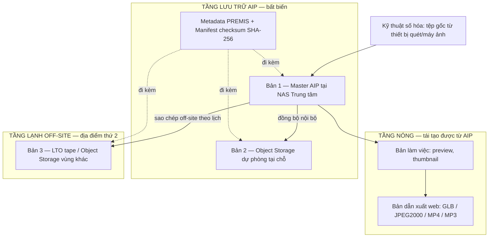
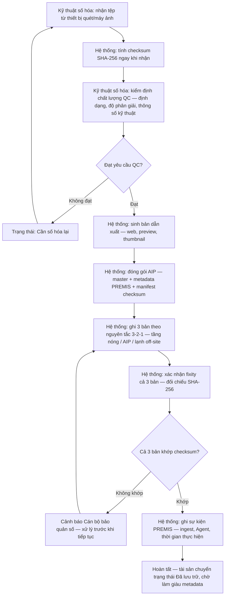
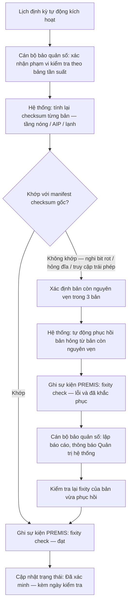
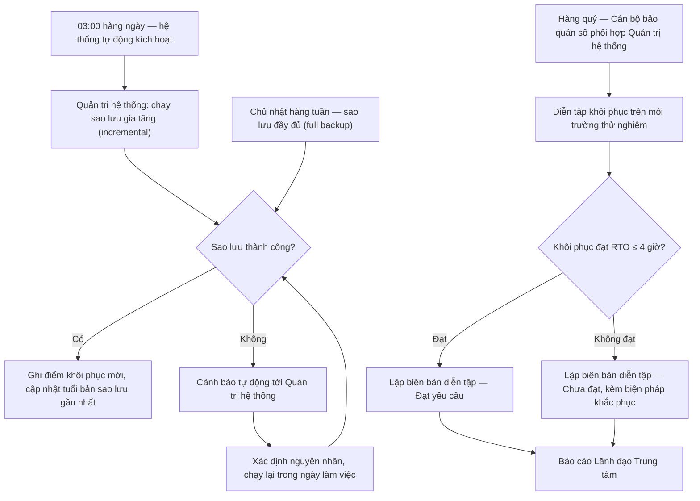
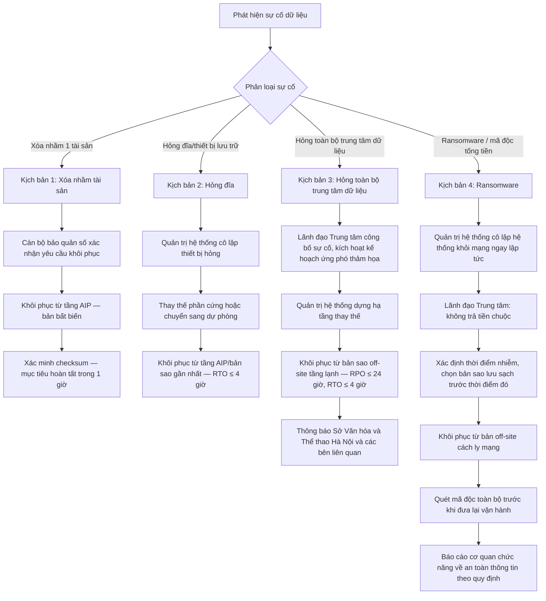

# Quy trình bảo quản và sao lưu dữ liệu số hóa di sản

**Hệ thống quản lý dữ liệu số Văn Miếu — Quốc Tử Giám** · Tài liệu số hiệu `02` · Phụ lục kỹ thuật hồ sơ dự thầu

---

## 1. Mục đích, phạm vi, căn cứ

### 1.1. Mục đích

Quy định thống nhất, bắt buộc áp dụng cho toàn bộ vòng đời dữ liệu số hóa di sản tại Trung tâm Hoạt động Văn hóa Khoa học Văn Miếu — Quốc Tử Giám (sau đây gọi tắt là "Trung tâm"), nhằm bảo đảm ba mục tiêu không thể thỏa hiệp đối với dữ liệu số của một di tích quốc gia đặc biệt kiêm Di sản tư liệu thế giới:

1. **Không mất dữ liệu** — không một tài sản số nào chỉ tồn tại ở một bản, một nơi lưu trữ.
2. **Không mất toàn vẹn dữ liệu** — mọi hư hỏng âm thầm (bit rot), thao tác nhầm hoặc tấn công đều được phát hiện và khắc phục trong thời gian xác định.
3. **Khôi phục được trong thời gian cam kết** — mọi sự cố, từ xóa nhầm một tệp đến mất toàn bộ trung tâm dữ liệu, đều có quy trình khôi phục cụ thể, có người chịu trách nhiệm, có số giờ cam kết.

### 1.2. Phạm vi áp dụng

Áp dụng cho toàn bộ tài sản số phát sinh từ pipeline số hóa của hệ thống: **Scan 3D** (mesh/photogrammetry), **Gaussian Splat**, **Tài liệu số hóa** (sắc phong, bản dập, sách Hán Nôm, văn bản hành chính), **Ảnh tư liệu** và **Media** (audio/video thuyết minh) — kể từ thời điểm tệp được thu nhận vào hệ thống (ingest) cho đến khi lưu trữ dài hạn, kiểm tra định kỳ và (nếu cần) khôi phục.

Tài liệu này **không** bao gồm quy trình bảo quản vật lý hiện vật gốc (bảo quản đá, giấy, gỗ...) — thuộc nghiệp vụ bảo tàng học riêng của Trung tâm, chỉ liên quan gián tiếp qua trường "tình trạng bảo quản hiện vật gốc" trong metadata.

**Đối tượng áp dụng:** Cán bộ bảo quản số, Quản trị hệ thống, Kỹ thuật số hóa, cán bộ Phê duyệt, Lãnh đạo Trung tâm, và đơn vị vận hành hạ tầng (nếu thuê ngoài).

### 1.3. Căn cứ chuẩn quốc tế

| Chuẩn | Vai trò áp dụng trong quy trình này |
|---|---|
| **OAIS — ISO 14721** (Open Archival Information System) | Khung tham chiếu tách bạch SIP (gói tin nhận vào) / AIP (gói tin lưu trữ dài hạn, bất biến) / DIP (gói tin phân phối) — là xương sống của Mục 3 |
| **PREMIS** (Preservation Metadata: Implementation Strategies) | Chuẩn ghi sự kiện bảo quản (ingest, kiểm tra toàn vẹn, di trú định dạng) gắn Agent + thời gian — áp dụng xuyên suốt Mục 3–4 |
| **NDSA Levels of Digital Preservation** (National Digital Stewardship Alliance) | Khung 4 mức tự đánh giá theo 5 khía cạnh (Storage, Integrity, Security, Metadata, Content) — dùng làm thước đo mục tiêu tại Mục 10 |
| **Quy tắc 3-2-1** | Tối thiểu 3 bản dữ liệu, trên 2 loại phương tiện lưu trữ khác nhau, 1 bản đặt tại địa điểm khác — nền tảng kiến trúc lưu trữ tại Mục 2 |

### 1.4. Căn cứ pháp lý Việt Nam

- **Luật Di sản văn hóa số 45/2024/QH15** (hiệu lực 01/7/2025) — nghĩa vụ bảo quản, kiểm kê tư liệu di sản.
- **Luật Dữ liệu số 60/2024/QH15** — nguyên tắc quản lý, bảo vệ, lưu trữ dữ liệu số của cơ quan nhà nước.
- **Nghị định 85/2016/NĐ-CP** — phân loại cấp độ an toàn hệ thống thông tin, làm căn cứ xác định yêu cầu lưu nhật ký. *(Lưu ý cập nhật pháp lý: **Luật An ninh mạng số 116/2025/QH15** — hiệu lực 01/7/2026 — hợp nhất và thay thế Luật An toàn thông tin mạng 86/2015/QH13 và Luật An ninh mạng 24/2018/QH14; tại thời điểm lập hồ sơ, nghị định thay thế hướng dẫn phân loại cấp độ chưa được ban hành, do đó tài liệu tiếp tục áp dụng NĐ 85/2016 và TCVN 11930:2017 làm chuẩn kỹ thuật, đồng thời cam kết rà soát lại khi văn bản thay thế có hiệu lực.)*
- **Thông tư 12/2022/TT-BTTTT** (Điều 9, khoản 1) — dẫn chiếu bắt buộc áp dụng **TCVN 11930:2017** theo cấp độ an toàn hệ thống đã được phê duyệt. TCVN 11930:2017 quy định thời hạn lưu **nhật ký hệ thống** tối thiểu theo cấp độ: **cấp độ 2 ≥ 01 tháng, cấp độ 3 ≥ 03 tháng, cấp độ 4 ≥ 06 tháng, cấp độ 5 ≥ 12 tháng** (cấp độ 1 không quy định thời hạn tối thiểu). Đây là quy định cho **nhật ký an toàn thông tin** (đăng nhập, đổi quyền, truy cập) — khác với **sự kiện PREMIS** ghi lịch sử vòng đời tài sản số, vốn cần lưu **vĩnh viễn** cùng AIP (xem ghi chú Mục 3.3).
- **Quyết định 548/QĐ-TTg ngày 10/5/2012** — xếp hạng Văn Miếu — Quốc Tử Giám là Di tích quốc gia đặc biệt.
- **UNESCO ghi danh Di sản tư liệu thế giới**: 82 bia Tiến sĩ được ghi danh cấp khu vực châu Á — Thái Bình Dương tháng 3/2010 và cấp toàn cầu tháng 7/2011 — là căn cứ trực tiếp cho việc áp dụng mức bảo quản nghiêm ngặt nhất trong toàn bộ danh mục tài sản số.

> **Ghi chú phạm vi:** Nghị định 53/2022/NĐ-CP (12/24 tháng lưu dữ liệu) chỉ áp dụng cho doanh nghiệp viễn thông/Internet, không áp dụng cho đơn vị sự nghiệp công lập như Trung tâm — tài liệu này không dùng con số đó làm căn cứ.

---

## 2. Kiến trúc lưu trữ "3 bản — 2 loại phương tiện — 1 nơi khác"

### 2.1. Nguyên tắc nền tảng

**Bản gốc (master) không bao giờ bị ghi đè hoặc xóa trực tiếp.** Mọi lần số hóa lại, chỉnh sửa, phục chế đều tạo ra một **phiên bản mới** (v1, v2, v3...), lưu song song với lịch sử đầy đủ (ai sửa, khi nào, vì sao); phiên bản cũ chuyển sang trạng thái lưu trữ, không bị xóa. Việc xóa vĩnh viễn chỉ áp dụng cho trạng thái "Đã gỡ/thu hồi" (deaccession) với lý do pháp lý, và vẫn giữ lại log sự kiện.

### 2.2. Ba tầng lưu trữ

| Tầng | Nội dung lưu | Hạ tầng | Vai trò quản lý | Đặc điểm |
|---|---|---|---|---|
| **Tầng nóng** (Hot) | Bản làm việc (proxy/preview) + bản dẫn xuất phân phối web (GLB, JPEG2000, MP4/H.264, MP3) | Máy chủ ứng dụng + SSD/NAS hiệu năng cao tại Trung tâm | Kỹ thuật số hóa / Biên tập | Truy cập thường xuyên, độ trễ thấp; **có thể tái tạo lại từ AIP** nếu mất — không tính vào 3 bản của quy tắc 3-2-1 |
| **Tầng lưu trữ AIP** (Archival) | Bản gốc master **bất biến** (TIFF không nén, E57/PLY, ProRes 422 HQ, WAV) + metadata PREMIS + manifest checksum | NAS/Object Storage **tách biệt vật lý** với hệ ứng dụng, có RAID, versioning bật sẵn | Cán bộ bảo quản số | Ghi một lần, chỉ đọc sau khi qua QC; mọi sửa đổi tạo bản ghi phiên bản mới |
| **Tầng lạnh off-site** (Cold) | Bản sao đầy đủ của AIP | LTO tape hoặc Object Storage tại **địa điểm địa lý thứ hai** (khác tòa nhà/khác khu vực với Trung tâm) | Quản trị hệ thống | Cách ly mạng một phần (immutable/gần air-gapped) — chống ransomware lan từ hệ thống chính |

### 2.3. Cụ thể hóa quy tắc 3-2-1 cho bản gốc (AIP)

| Bản | Vị trí | Loại phương tiện |
|---|---|---|
| Bản 1 (chính) | Tầng AIP — NAS/Object Storage tại Trung tâm | Ổ đĩa mạng (NAS) |
| Bản 2 (dự phòng tại chỗ) | Tầng AIP — bản sao đồng bộ, hệ thống lưu trữ khác | Object Storage (công nghệ khác Bản 1) |
| Bản 3 (off-site) | Tầng lạnh — địa điểm địa lý thứ 2 | LTO tape hoặc Object Storage vùng khác |

→ Đạt đủ điều kiện: **3 bản**, **2 loại phương tiện** (NAS + Object Storage/LTO), **1 bản tại nơi khác**.

### 2.4. Sơ đồ kiến trúc

---

## 3. Quy trình thu nhận đến đóng gói AIP (Ingest → AIP)

**Vai trò thực hiện:** Kỹ thuật số hóa (thao tác bước 1–3), hệ thống tự động (bước 4–8), Cán bộ bảo quản số (giám sát và xử lý cảnh báo).

### 3.1. Nguyên tắc tính checksum ngay tại điểm vào

SHA-256 được tính **ngay khi tệp được nhận vào hệ thống**, trước cả bước QC — checksum này là giá trị tham chiếu gốc cho mọi lần kiểm tra toàn vẹn sau này (Mục 4). Không cho phép tệp vào hàng đợi xử lý mà chưa có checksum.

### 3.2. QC chặn dữ liệu kém chất lượng

Tiêu chí QC tối thiểu theo loại tài sản: TIFF ≥ 600dpi/16-bit cho tư liệu 2D (chuẩn FADGI/Metamorfoze 4-star), sai số căn chỉnh scan 3D ≤ giá trị đã công bố trong hồ sơ kỹ thuật, không thiếu tệp so với danh mục đợt số hóa. Không đạt → trạng thái **"Cần số hóa lại"**, quay lại bước 1, không có ngoại lệ "tạm chấp nhận".

### 3.3. Về việc ghi PREMIS event

Sự kiện PREMIS (ingest, fixity check, di trú định dạng, phục chế...) là một phần của gói AIP, ghi vĩnh viễn cùng vòng đời tài sản — **khác bản chất** với "nhật ký hệ thống" theo TCVN 11930:2017 (Mục 1.4), vốn phục vụ mục đích an toàn thông tin và có thời hạn lưu tối thiểu theo cấp độ. Hai loại nhật ký được lưu và quản lý tách biệt.

---

## 4. Quy trình kiểm tra toàn vẹn định kỳ (Fixity check)

**Vai trò thực hiện:** Cán bộ bảo quản số (giám sát, xác nhận phạm vi, lập báo cáo), hệ thống (tính toán tự động theo lịch).

### Bảng tần suất kiểm tra theo loại dữ liệu

| Nhóm dữ liệu | Tần suất fixity check | Lý do |
|---|---|---|
| 82 bia Tiến sĩ (Scan 3D, Gaussian Splat) | **Hàng quý** | Di sản tư liệu thế giới UNESCO — mức ưu tiên cao nhất |
| Tài liệu Hán Nôm quý hiếm (sắc phong, bản dập, sách cổ) | **Hàng quý** | Chất liệu vật lý gốc dễ hư hại, bản số hóa có giá trị thay thế cao |
| Ảnh tư liệu lịch sử | 6 tháng/lần | Rủi ro thấp hơn, khối lượng lớn |
| Media (audio/video thuyết minh) | 6 tháng/lần | Rủi ro thấp hơn, khối lượng lớn |
| Toàn bộ kho (rà soát tổng thể) | **Hàng năm** | Bảo đảm không tài sản nào bị bỏ sót giữa các chu kỳ |

---

## 5. Quy trình sao lưu

**Vai trò thực hiện:** Quản trị hệ thống (vận hành lịch sao lưu hàng ngày/hàng tuần, xử lý sự cố), Cán bộ bảo quản số (đồng chủ trì diễn tập khôi phục hàng quý, xác nhận kết quả).

**Cam kết dịch vụ:** RPO (Recovery Point Objective) ≤ **24 giờ** — dữ liệu mất tối đa tương ứng thời gian giữa 2 lần sao lưu; RTO (Recovery Time Objective) ≤ **4 giờ** — thời gian khôi phục dịch vụ tối đa kể từ khi sự cố được xác nhận.

### Bảng lịch sao lưu

| Loại sao lưu | Tần suất | Thời điểm | Phạm vi | Trách nhiệm |
|---|---|---|---|---|
| Gia tăng (incremental) | Hàng ngày | 03:00 | Thay đổi trong 24 giờ | Quản trị hệ thống |
| Đầy đủ (full) | Hàng tuần | Chủ nhật, ngoài giờ hành chính | Toàn bộ AIP | Quản trị hệ thống |
| Diễn tập khôi phục | Hàng quý | Theo lịch nội bộ, có biên bản | Chọn mẫu đại diện + 1 kịch bản toàn hệ thống/năm | Cán bộ bảo quản số + Quản trị hệ thống |
| Sao chép off-site | Hàng ngày (theo sau bản gia tăng) | Sau 03:00 | Đồng bộ sang tầng lạnh | Quản trị hệ thống |

---

## 6. Quy trình khôi phục và ứng phó thảm họa

**Vai trò thực hiện:** phân theo mức độ nghiêm trọng — Cán bộ bảo quản số/Quản trị hệ thống xử lý sự cố cục bộ; Lãnh đạo Trung tâm ra quyết định kích hoạt kế hoạch ứng phó thảm họa (DRP) cho sự cố toàn hệ thống.

### Bảng tổng hợp 4 kịch bản

| Kịch bản | Nguồn khôi phục | Thời gian mục tiêu | Người ra quyết định | Ghi chú |
|---|---|---|---|---|
| 1. Xóa nhầm 1 tài sản | Tầng AIP (bản bất biến) | ≤ 1 giờ | Cán bộ bảo quản số | Không cần kích hoạt DRP, xử lý theo yêu cầu nội bộ |
| 2. Hỏng đĩa/thiết bị | Tầng AIP hoặc bản sao lưu gần nhất | ≤ 4 giờ (RTO) | Quản trị hệ thống | Redundancy tại chỗ (RAID/bản 2) giảm thời gian thực tế |
| 3. Hỏng toàn bộ trung tâm dữ liệu | Bản off-site tầng lạnh | RPO ≤ 24 giờ, RTO ≤ 4 giờ | Lãnh đạo Trung tâm (kích hoạt DRP) | Phải dựng hạ tầng thay thế trước khi khôi phục — kịch bản trực tiếp trả lời câu hỏi "mất điện thì sao" |
| 4. Ransomware | Bản off-site cách ly mạng, thời điểm trước khi nhiễm | RTO mục tiêu ≤ 4 giờ cho hệ thống sạch, có thể kéo dài tùy phạm vi điều tra | Lãnh đạo Trung tâm + Quản trị hệ thống | Tuyệt đối không trả tiền chuộc; bắt buộc quét sạch trước khi phục hồi sản xuất |

---

## 7. Chiến lược định dạng và rủi ro lỗi thời

### 7.1. Bảng định dạng lưu trữ vs. phân phối

| Loại tài sản | Định dạng lưu trữ (AIP, bất biến) | Định dạng phân phối (DIP, tầng nóng) |
|---|---|---|
| Tư liệu 2D (Hán Nôm, ảnh, văn bản quét) | **TIFF không nén**, ≥ 600dpi/16-bit (chuẩn FADGI/Metamorfoze 4-star) | **JPEG2000** (ISO/IEC 15444) — nén không mất dữ liệu, hỗ trợ deep zoom qua IIIF |
| Văn bản số hóa/hành chính | **PDF/A** (ISO 19005 — định dạng lưu trữ dài hạn, nhúng font, không phụ thuộc phần mềm ngoài) | PDF thường hoặc HTML phái sinh |
| Scan 3D (mesh) | **E57** (ASTM E2807 — trao đổi đám mây điểm) + **PLY** (định dạng mở, không phụ thuộc hãng) | **glTF/GLB** (chuẩn mở Khronos Group) |
| Gaussian Splat | `.splat` **+ bản PLY bảo hiểm** (đám mây điểm độ chính xác gốc) **+ toàn bộ ảnh nguồn** **+ tham số huấn luyện** — vì `.splat` chưa có chuẩn hóa ISO/OGC chính thức | `.splat` cho xem trực tiếp; 3D Tiles (OGC) cho streaming khu vực lớn |
| Audio | **WAV** không nén, 48kHz | MP3/AAC nén |
| Video | **ProRes 422 HQ** | H.264/H.265 MP4 |

### 7.2. Nguyên tắc xử lý rủi ro định dạng chưa chuẩn hóa (Gaussian Splat)

Vì công nghệ 3D Gaussian Splatting mới công bố năm 2023 và `.splat` chưa có chuẩn ISO/OGC chính thức, hệ thống **không coi `.splat` là bản lưu trữ dài hạn duy nhất**. Mỗi tài sản splat luôn có kèm bản PLY "bảo hiểm" (có thể hiển thị lại bằng phần mềm khác trong tương lai) cùng ảnh nguồn và tham số huấn luyện, để có thể tái tạo mô hình nếu công cụ hiện tại ngừng được hỗ trợ.

### 7.3. Lịch rà soát định dạng

**Định kỳ 2 năm/lần**, Cán bộ bảo quản số chủ trì rà soát: (1) tình trạng hỗ trợ của từng định dạng đang dùng (còn được phần mềm phổ biến đọc được không); (2) rủi ro lỗi thời mới phát sinh (đặc biệt với `.splat`); (3) khuyến nghị di trú định dạng nếu cần — mỗi lần di trú tạo phiên bản mới và ghi sự kiện PREMIS, không thay thế bản gốc đã lưu.

---

## 8. Vai trò và trách nhiệm (RACI)

R = Thực hiện (Responsible) · A = Chịu trách nhiệm cuối (Accountable) · C = Tham vấn (Consulted) · I = Được thông báo (Informed)

| Hoạt động | Quản trị hệ thống | Kỹ thuật số hóa | Cán bộ bảo quản số | Phê duyệt | Lãnh đạo Trung tâm |
|---|---|---|---|---|---|
| Thu nhận & tính checksum khi ingest | I | R | A | – | – |
| Kiểm định chất lượng (QC) | – | R | A | – | – |
| Đóng gói AIP & ghi 3 bản theo 3-2-1 | R | C | A | – | I |
| Kiểm tra toàn vẹn định kỳ (fixity check) | C | – | R/A | – | I |
| Sao lưu hàng ngày/hàng tuần | R/A | – | C | – | – |
| Diễn tập khôi phục hàng quý | R | – | A | – | I |
| Khôi phục sau sự cố cục bộ (kịch bản 1–2) | R | – | A | – | I |
| Khôi phục sau thảm họa (kịch bản 3–4) | R | – | C | I | A |
| Rà soát định dạng (2 năm/lần) | C | – | R | – | A |
| Kiểm kê định kỳ tài sản số | – | C | R | I | A |
| Phê duyệt chính sách/ngân sách lưu trữ | C | – | C | I | A/R |

---

## 9. Chỉ số giám sát và báo cáo

Các chỉ số dưới đây hiển thị trực tiếp trên màn **"Sao lưu & khôi phục"** của phần mềm, gồm 2 thẻ chỉ số lớn (RPO/RTO), bảng lịch sao lưu, danh sách điểm khôi phục và log lịch sử:

| Chỉ số | Định nghĩa | Mục tiêu |
|---|---|---|
| % tài sản có checksum hợp lệ | Số tài sản đã xác minh fixity thành công lần gần nhất / tổng số tài sản đã ingest | ≥ 99,5% |
| Tuổi bản sao lưu mới nhất | Thời gian tính từ lần sao lưu thành công gần nhất đến hiện tại | ≤ 24 giờ (khớp RPO) |
| Kết quả diễn tập khôi phục gần nhất | Đạt/Chưa đạt + thời gian khôi phục thực đo + ngày thực hiện | RTO thực đo ≤ 4 giờ |
| Số sự cố fixity phát hiện trong kỳ | Số tài sản phát hiện lệch checksum, số đã khắc phục | 100% đã khắc phục trong kỳ |
| Dung lượng theo từng tầng lưu trữ | Nóng / AIP / lạnh — dung lượng đã dùng và % còn trống | Cảnh báo khi > 85% |
| Số tài sản ở trạng thái "Cần số hóa lại" | Theo dõi tồn đọng QC | Giảm dần theo thời gian |

---

## 10. Phụ lục: Tự đánh giá theo NDSA Levels of Digital Preservation

Khung 4 mức (Level 1 → Level 4, mức độ bảo quản tăng dần) theo 5 khía cạnh, dùng làm công cụ tự đánh giá và lộ trình cải thiện.

| Khía cạnh | Mức hiện tại (trước triển khai) | Mức mục tiêu (Giai đoạn 1) | Ghi chú lộ trình Giai đoạn 2 |
|---|---|---|---|
| **Storage** (lưu trữ & vị trí địa lý) | Level 1 — dữ liệu rời rạc trên máy trạm/ổ cứng rời, không có bản off-site | **Level 3** — 3 bản, 2 loại phương tiện, 1 bản off-site theo Mục 2, có kế hoạch ứng phó thảm họa | Level 4: bổ sung địa điểm off-site thứ 3 với hồ sơ rủi ro thiên tai khác biệt |
| **Integrity** (toàn vẹn/fixity) | Level 1 — không có checksum | **Level 3** — checksum tại ingest, kiểm tra định kỳ theo Mục 4, ghi sự kiện PREMIS | Level 4: giám sát tự động toàn kho theo thời gian thực, cảnh báo bất thường tự động |
| **Security** (an ninh) | Level 1 — chưa có kiểm soát truy cập tập trung | **Level 3** — RBAC, mã hóa at-rest/in-transit, nhật ký bất biến theo cấp độ ATTT (TCVN 11930:2017) | Level 4: kiểm thử xâm nhập định kỳ, giám sát an ninh 24/7 |
| **Metadata** | Level 1 — metadata mô tả rời rạc, không có sự kiện bảo quản | **Level 2–3** — ghi sự kiện PREMIS tại ingest và fixity check, manifest checksum đầy đủ | Level 4: đóng gói METS đầy đủ cho SIP/AIP/DIP, tự động hóa toàn bộ |
| **Content** (định dạng nội dung) | Level 1 — chưa kiểm soát định dạng, không theo dõi lỗi thời | **Level 3** — ưu tiên định dạng mở theo Mục 7, rà soát định dạng 2 năm/lần | Level 4: công cụ giám sát lỗi thời tự động (dạng PRONOM), quy trình di trú hàng loạt |

---

*Tài liệu này là phụ lục kỹ thuật, đọc cùng thiết kế màn hình "Sao lưu & khôi phục" và Chương "An toàn thông tin" / "Sao lưu, phục hồi và vận hành liên tục" trong thuyết minh kỹ thuật hồ sơ dự thầu.*
