# Mô hình dữ liệu — Hệ thống quản trị dữ liệu số hóa Văn Miếu — Quốc Tử Giám

**Hệ thống quản lý dữ liệu số Văn Miếu — Quốc Tử Giám** · Tài liệu số hiệu `07` · Phụ lục kỹ thuật hồ sơ dự thầu · đọc cùng `06-dac-ta-api.md`

---

## 1. Quy ước đọc tài liệu

- **Tiếng Anh giữ nguyên `asset`** làm từ bao trùm kỹ thuật cho mọi bảng/trường (asset, asset_version, asset_file…) — đây là quy ước đặt tên trong toàn bộ mã nguồn và API. **Tiếng Việt gọi chung là "dữ liệu số hóa"** (không dùng "tài sản") khi mô tả khái niệm nghiệp vụ trong tài liệu này.
- Tên bảng/cột: tiếng Anh, `snake_case`. Mô tả: tiếng Việt.
- Kiểu dữ liệu dùng trong ERD là kiểu logic trung lập hệ quản trị (uuid, varchar, text, integer, bigint, numeric, boolean, timestamp, date, jsonb) — khi hiện thực hoá trên PostgreSQL, `uuid` dùng `uuid` gốc, `timestamp` dùng `timestamptz`.
- Khoá ngoại tổng hợp (composite key) trong bảng trung gian được đánh dấu `PK` trên từng cột thành phần; bản chất "đồng thời là FK" được ghi trong chú thích thay vì nhãn kép, để bảo đảm cú pháp mermaid `erDiagram` phân tích được.
- 22 bảng theo đúng danh mục đề bài, cộng thêm **5 bảng bổ sung có chủ đích**, giải thích tại mục 5.9 (`asset_tag`, `role_permission` — chuẩn hoá quan hệ N-N còn thiếu khoá trung gian), mục 5.6 (`retention_policy` — vòng đời & thời hạn lưu trữ, NĐ 165/2025/NĐ-CP Điều 5), và mục 5.15 (`missing_reason_vocab`, `field_missing_status` — cơ chế khuyết giá trị tường minh, không dùng ô trống).

---

## 2. Hai trục phân loại dữ liệu số hóa

Phiên bản trước dùng một trường `type` duy nhất trộn lẫn "đối tượng di sản thật là gì" với "tệp số ở dạng nào" (vd `'3D'`, `'Splat'`, `'Tài liệu'`...). Theo yêu cầu của chủ đầu tư, mô hình tách thành **hai trục độc lập** trên bảng `asset`:

### 2.1. `object_class` — loại đối tượng di sản có thật

| Giá trị | Tiếng Việt | Tiền tố mã | Có neo `physical_artifact`? |
|---|---|---|---|
| `precinct` | Khuôn viên & không gian | `VM-KV-xxx` | Có |
| `structure` | Công trình kiến trúc | `VM-CT-xxx` | Có |
| `artifact` | Hiện vật *(thuật ngữ theo Luật Di sản văn hóa 45/2024/QH15 — không dùng "vật phẩm")* | `VM-HV-xxx` | Có |
| `document` | Tài liệu & di sản tư liệu | `VM-TL-xxx` | Có |
| `av` | Tư liệu nghe nhìn | `VM-NN-xxx` | Không — bản ghi hình/âm thanh không đại diện một đối tượng vật chất đơn lẻ |

### 2.2. `digital_form` — dạng dữ liệu số

`mesh3d` · `splat` · `pointcloud` · `drawing` · `image` · `text` · `video` · `audio`

`digital_form` quyết định khối trường mở rộng (xem schema `Asset` trong `06-dac-ta-api.md`, mục polymorphism theo B.1–B.5 của báo cáo DAM).

### 2.3. Vì sao hai trục, và vì sao đây là lý lẽ củng cố cho việc tách bảng `physical_artifact`

Một đối tượng di sản thật (`physical_artifact`) thường có **nhiều bản ghi `asset`** ở các `digital_form` khác nhau — ví dụ Khuê Văn Các (`object_class = structure`) có thể có đồng thời: mesh3d (scan photogrammetry), splat (Gaussian splatting không gian), pointcloud (đám mây điểm đo đạc gốc), drawing (bản vẽ CAD trùng tu), image (ảnh tư liệu). Đây chính xác là mô hình **CIDOC-CRM (ISO 21127)**: `physical_artifact` đóng vai **E22 Man-Made Object** (hoặc E25/E27 tuỳ cấp — công trình/không gian), còn mỗi bản ghi `asset` là một **P138 has representation** (bản đại diện số) trỏ về đối tượng đó qua `asset.physical_artifact_id`. Nói cách khác: **1 E22 — N P138**, và bảng `physical_artifact` chính là nơi hiện thực hoá E22 tách biệt khỏi các bản đại diện số của nó — không gộp chung như cách làm Dublin Core phẳng coi mỗi bản ghi là độc lập (xem thêm mục 5.2).

**Quyết định đặt `object_class`:** đặt ở **cả hai nơi** — `physical_artifact.object_class` là **nguồn xác thực** (chỉ áp dụng cho 4 giá trị có neo vật chất: precinct/structure/artifact/document), còn `asset.object_class` là **bản sao denormalize** để lọc nhanh trên `/assets` mà không cần join, đồng thời là nơi duy nhất lưu giá trị `av` (tư liệu nghe nhìn không neo `physical_artifact`). Quy tắc đồng bộ: khi `asset.physical_artifact_id` được gán, tầng ứng dụng ghi đè `asset.object_class` bằng đúng giá trị của `physical_artifact.object_class` tại thời điểm gán (không cho sửa tay lệch nhau); khi `physical_artifact_id IS NULL`, `object_class` phải là `'av'` hoặc được biên tập viên chọn tay và chịu trách nhiệm nhất quán thủ công. Lý do chọn denormalize thay vì chỉ để ở `physical_artifact` rồi luôn join: bảng `asset` là bảng bị lọc/tìm kiếm nhiều nhất trong toàn hệ thống (danh sách, API `/assets`, dashboard đếm số) — bắt buộc join qua `physical_artifact` cho mọi truy vấn liệt kê sẽ tốn chi phí không cần thiết ở quy mô hàng nghìn bản ghi.

### 2.4. Hệ thống mã định danh 5 tầng

Mã định danh là một chuỗi **5 tầng lồng nhau**, mỗi tầng ứng với đúng một bảng trong mô hình — không tầng nào được suy ra hay lưu trùng ở nơi khác:

| Tầng | Cú pháp | Ví dụ chạy suốt | Lưu ở bảng.cột |
|---|---|---|---|
| 1. Đối tượng di sản | `VM-<OC>-<NNNNN>` | `VM-CT-00007` (Khuê Văn Các) | `physical_artifact.code` |
| 2. Bản ghi dữ liệu số | `<tầng 1>.<DF><nn>` | `VM-CT-00007.SPL01` | `asset.code` |
| 3. Phiên bản | `<tầng 2>.v<n>` | `VM-CT-00007.SPL01.v2` | `asset_version.version_no` (hiển thị dạng `.v<n>`, không lưu chuỗi riêng) |
| 4. Tệp dẫn xuất | `<tầng 3>#<role>` | `VM-CT-00007.SPL01.v2#master` | `asset_file.kind` (hiển thị dạng `#<kind>`) |
| 5. Đợt số hóa | `VM-DS-<YYYY>-<nn>` | `VM-DS-2026-03` | `digitization_batch.batch_code` |

**`OC` — loại đối tượng (2 ký tự):** `KV` khuôn viên & không gian · `CT` công trình kiến trúc · `HV` hiện vật · `TL` tài liệu & di sản tư liệu · `NN` tư liệu nghe nhìn (dùng khi `asset.object_class = av`, tự làm tầng 1 cho chính nó vì không có `physical_artifact`) · `DT` **dự phòng, ngoài phạm vi tài liệu này** — theo `00-ke-hoach-nang-cap.md` mục 0bis, `DT` dành cho thực thể "điểm tham quan" (toạ độ, panorama 360°, trạng thái hiển thị công chúng) của wireframe UC-03, thuộc cổng tham quan số Giai đoạn 2, không phải một giá trị của `object_class` trong mô hình quản trị này.

**`DF` — dạng dữ liệu số (3 ký tự):** `M3D` mesh3d · `SPL` splat · `PCL` pointcloud · `DWG` drawing · `IMG` image · `TXT` text · `VID` video · `AUD` audio — khớp 1-1 với `asset.digital_form`. `nn` là số thứ tự 2 chữ số theo từng cặp (đối tượng, dạng dữ liệu) — ví dụ `VM-CT-00007.SPL02` nếu Khuê Văn Các được quét splat một đợt độc lập thứ hai (không phải số hóa lại cùng một `asset`, vốn tạo `asset_version` mới chứ không tăng `nn`).

**Trường định danh song song trên `physical_artifact`** (không trộn vào mã hệ thống, vì đây là các mã do quy trình nghiệp vụ khác cấp):

| Trường | Nguồn | Bắt buộc |
|---|---|---|
| `so_kiem_ke` | Sổ kiểm kê hiện vật của Trung tâm — Điều 23 Luật Di sản văn hóa 45/2024/QH15 | Bắt buộc với `object_class` = `artifact`, `document` |
| `so_dang_ky` | Số đăng ký di vật/cổ vật/bảo vật quốc gia (nếu có) | Khi áp dụng |
| `ma_ho_so_di_tich` | Mã trong hồ sơ khoa học xếp hạng di tích | Bắt buộc với `object_class` = `precinct`, `structure` |
| `pid_quoc_gia` | Mã định danh số quốc gia khi CSDL quốc gia về DSVH cấp | Roadmap — chưa bắt buộc |

**Căn cứ đưa vào thuyết minh:** Quyết định 611/QĐ-TTg (04/4/2026) đặt chỉ tiêu "80% di sản văn hóa số công có **mã định danh số** để xác lập quyền sở hữu, kiểm soát khai thác"; TT 05/2025/TT-BNV cũng liệt kê "mã định danh" là một trong bảy trường siêu dữ liệu bắt buộc của gói SIP/AIP/DIP (mục 5.7). Hệ thống mã 5 tầng ở trên là phương án đáp ứng trực tiếp cả hai. Lộ trình xa hơn: đăng ký định danh bền vững quốc tế (ARK/Handle) cho `pid_quoc_gia` để phục vụ trích dẫn học thuật.

---

## 3. ERD tổng thể

```mermaid
erDiagram
    ASSET ||--o{ ASSET_VERSION : "co nhieu phien ban"
    ASSET_VERSION ||--o{ ASSET_FILE : "co nhieu tep tin"
    ASSET_VERSION ||--o{ PREMIS_EVENT : "phat sinh su kien bao quan"
    ASSET_FILE ||--o{ PREMIS_EVENT : "su kien muc tep"
    ASSET ||--o{ ASSET_RELATION : "la du lieu nguon"
    ASSET ||--o{ ASSET_RELATION : "la du lieu dich (nhom 3, khi muc tieu la asset)"
    PHYSICAL_ARTIFACT ||--o{ ASSET_RELATION : "la doi tuong duoc tham chieu (nhom 1, 2, 3)"
    ASSET ||--o{ ASSET_COLLECTION : "duoc gom nhom"
    COLLECTION ||--o{ ASSET_COLLECTION : "chua du lieu so hoa"
    ASSET ||--o{ ASSET_TAG : "duoc gan nhan"
    TAG ||--o{ ASSET_TAG : "gan cho du lieu so hoa"
    CONTROLLED_VOCABULARY ||--o{ TAG : "chuan hoa tu khoa"
    CONTROLLED_VOCABULARY ||--o{ CONTROLLED_VOCABULARY : "co thuat ngu rong hon"
    CONTROLLED_VOCABULARY ||--o{ PHYSICAL_ARTIFACT : "phan loai theo AAT"
    PHYSICAL_ARTIFACT ||--o{ ASSET : "co nhieu ban dai dien so"
    RIGHTS_STATEMENT ||--o{ ASSET : "gan nhan quyen"
    RETENTION_POLICY ||--o{ ASSET : "ap dung chinh sach luu tru"
    APP_USER ||--o{ ASSET : "phu trach"
    DIGITIZATION_BATCH ||--o{ ASSET : "sinh ra tu dot so hoa"
    APP_USER ||--o{ ASSET_VERSION : "tao phien ban"
    APP_USER ||--o{ ASSET_VERSION : "ky so khi xuat ban"
    ROLE ||--o{ APP_USER : "gan vai tro"
    ROLE ||--o{ ROLE_PERMISSION : "co danh sach quyen"
    PERMISSION ||--o{ ROLE_PERMISSION : "thuoc ve vai tro"
    APP_USER ||--o{ USER_COLLECTION_SCOPE : "duoc cap pham vi"
    COLLECTION ||--o{ USER_COLLECTION_SCOPE : "gioi han truy cap boi"
    APP_USER ||--o{ SHARE_REQUEST : "duyet hoac tu choi"
    APP_USER ||--o{ API_KEY : "tao khoa"
    APP_USER ||--o{ AUDIT_LOG : "thuc hien hanh dong"
    APP_USER ||--o{ COMPLIANCE_ITEM : "chiu trach nhiem"
    APP_USER ||--o{ DIGITIZATION_BATCH : "phu trach dot so hoa"
    APP_USER ||--o{ RETENTION_POLICY : "phe duyet chinh sach"
    BACKUP_JOB ||--o{ RESTORE_POINT : "tao diem khoi phuc"
    MISSING_REASON_VOCAB ||--o{ FIELD_MISSING_STATUS : "ly do khuyet gia tri"

    ASSET {
        uuid asset_id PK
        varchar code UK "tang 2 cua ma dinh danh 5 tang: {physical_artifact.code}.{DF}{nn}, vd VM-CT-00007.SPL01"
        varchar object_class "enum precinct|structure|artifact|document|av; denormalize tu physical_artifact"
        varchar digital_form "enum mesh3d|splat|pointcloud|drawing|image|text|video|audio"
        varchar title
        text description
        varchar era_display "hien thi dung can chi/nien hieu, vd 1484 (dung bia)"
        varchar era_edtf "chuan EDTF ISO 8601-2, vd 1484 / 1484? / 1484~ / 18XX / 1740/1786 / unknown"
        integer era_from "DAN XUAT tu era_edtf luc ghi, phuc vu loc/sap xep - khong nhap tay truc tiep"
        integer era_to "DAN XUAT tu era_edtf luc ghi, phuc vu loc/sap xep - khong nhap tay truc tiep"
        varchar era_certainty "enum CHINH_XAC|UOC_TINH|TRANH_CAI"
        varchar current_location
        varchar custodian_unit
        varchar language "ISO 639-1, mac dinh vi"
        varchar status "pipeline so hoa, 11 trang thai"
        varchar access_level "enum CONG_KHAI|NGHIEN_CUU|NOI_BO"
        boolean contains_personal_data "gia pha, anh chan dung - Luat BVDLCN 91/2025"
        uuid physical_artifact_id FK "NULL neu object_class la av"
        uuid rights_statement_id FK
        uuid current_version_id FK
        uuid retention_policy_id FK
        uuid owner_user_id FK
        uuid digitization_batch_id FK
        timestamp created_at
        timestamp updated_at
    }

    ASSET_VERSION {
        uuid asset_version_id PK
        uuid asset_id FK
        integer version_no "tang dan tu 1, khong tai su dung so"
        varchar status "enum DANG_LUU_TRU|DA_THAY_THE"
        text change_reason "bat buoc neu version_no > 1"
        uuid created_by FK
        timestamp created_at
        timestamp superseded_at "NULL neu la ban hien hanh"
        timestamp signed_at "thoi diem ky so khi xuat ban - Luat GDDT 20/2023 D.12-13"
        uuid signed_by FK "nguoi/co quan chuyen doi thuc hien ky so"
        varchar signature_ref "dinh danh hoac duong dan chu ky so dinh kem"
        varchar conversion_mark "ky hieu rieng xac nhan da chuyen doi - Dieu 12 Luat GDDT"
    }

    ASSET_FILE {
        uuid asset_file_id PK
        uuid asset_version_id FK
        varchar kind "enum MASTER|WEB|RAW|THUMB - tang 4 cua ma dinh danh, hien thi #master|web|raw|thumb"
        varchar file_name
        varchar format_puid "ma dinh danh dinh dang PRONOM"
        bigint size_bytes
        varchar storage_tier "enum HOT|AIP|COLD"
        varchar storage_path
        varchar checksum_sha256 "64 ky tu hex, tinh ngay khi ingest"
        timestamp fixity_checked_at "lan kiem tra toan ven gan nhat"
        varchar fixity_status "enum DA_XAC_MINH|LECH_CHECKSUM|CHUA_KIEM_TRA"
        timestamp created_at
    }

    ASSET_RELATION {
        uuid asset_relation_id PK
        uuid from_asset_id FK "luon la mot asset - ban ghi khoi tao quan he"
        uuid to_asset_id FK "NULL neu muc tieu la physical_artifact; dung dung 1 trong 2 cot to_*"
        uuid to_physical_artifact_id FK "NULL neu muc tieu la asset; dung dung 1 trong 2 cot to_*"
        varchar relation_type "nhom1(toi physical_artifact): hasRepresentation|hasDrawing|hasConditionPhoto|hasRubbing|hasPreservationSurrogate; nhom2(toi physical_artifact): depictedIn|mentionedIn|subjectOf; nhom3(toi asset HOAC physical_artifact): partOf|derivedFrom"
        text note
        uuid created_by FK
        timestamp created_at
    }

    COLLECTION {
        uuid collection_id PK
        varchar slug UK
        varchar name
        text description
        varchar cover_image_url
        timestamp created_at
        timestamp updated_at
    }

    ASSET_COLLECTION {
        uuid asset_id PK "dong thoi la FK toi ASSET"
        uuid collection_id PK "dong thoi la FK toi COLLECTION"
        timestamp added_at
    }

    TAG {
        uuid tag_id PK
        varchar label UK
        uuid controlled_vocabulary_id FK "NULL neu la tag tu do chua doi chieu"
    }

    ASSET_TAG {
        uuid asset_id PK "dong thoi la FK toi ASSET"
        uuid tag_id PK "dong thoi la FK toi TAG"
    }

    CONTROLLED_VOCABULARY {
        uuid vocabulary_id PK
        varchar source "enum GETTY_AAT|ICONCLASS|TGN|ISO_639|ISO_3166"
        varchar source_id "vd aat:300010331"
        varchar label_vi
        varchar label_en
        uuid broader_id FK "tu rong hon, tu tham chieu chinh no"
    }

    PHYSICAL_ARTIFACT {
        uuid physical_artifact_id PK
        varchar code UK "tang 1 cua ma dinh danh 5 tang: VM-KV/CT/HV/TL-NNNNN"
        varchar so_kiem_ke UK "so kiem ke - Dieu 23 Luat DSVH 45/2024; bat buoc voi artifact/document"
        varchar so_dang_ky "so dang ky di vat/co vat/bao vat quoc gia, khi ap dung"
        varchar ma_ho_so_di_tich "ma ho so khoa hoc xep hang di tich; bat buoc voi precinct/structure"
        varchar pid_quoc_gia "dinh danh so quoc gia CSDL DSVH - lo trinh, chua bat buoc"
        varchar name
        varchar object_class "enum precinct|structure|artifact|document - nguon xac thuc cho asset.object_class"
        uuid artifact_type_vocab_id FK "loai hinh chi tiet theo Getty AAT"
        text condition_note
        varchar current_location
        varchar managing_unit
        date last_inventory_date
        date next_inventory_due
        timestamp created_at
    }

    PREMIS_EVENT {
        uuid premis_event_id PK
        uuid asset_version_id FK
        uuid asset_file_id FK "NULL neu su kien o muc phien ban"
        varchar event_type "INGEST|KIEM_DINH_CHAT_LUONG|SINH_BAN_DAN_XUAT|FIXITY_CHECK|DI_TRU_DINH_DANG|PHUC_CHE|THAM_DINH_NOI_DUNG|KY_SO_XUAT_BAN|LUU_TRU_DAI_HAN|KIEM_KE_DINH_KY|DEACCESSION"
        timestamp event_datetime
        text event_detail
        varchar event_outcome "enum THANH_CONG|THAT_BAI|CANH_BAO"
        uuid agent_user_id FK "NULL neu tac nhan la he thong tu dong"
        varchar agent_software "ten + phien ban phan mem neu tu dong"
        timestamp created_at
    }

    RIGHTS_STATEMENT {
        uuid rights_statement_id PK
        varchar code UK "vd InC, InC-EDU, NoC-US, CC-BY-4.0"
        varchar label_vi
        varchar label_en
        text description
        varchar url
    }

    RETENTION_POLICY {
        uuid retention_policy_id PK
        varchar object_class UK "enum precinct|structure|artifact|document|av"
        varchar retention_period "vd Vinh vien; 20 nam"
        varchar retention_basis "can cu phap ly - ND 165/2025 Dieu 5"
        varchar technical_procedure_ref "duong dan quy trinh ky thuat luu tru noi bo"
        date last_reviewed_at
        date next_review_at
        uuid approved_by FK
        timestamp created_at
        timestamp updated_at
    }

    APP_USER {
        uuid user_id PK
        varchar full_name
        varchar email UK
        uuid role_id FK
        varchar status "enum HOAT_DONG|KHOA|CHO_KICH_HOAT"
        boolean mfa_enabled
        timestamp last_login_at
        timestamp created_at
    }

    ROLE {
        uuid role_id PK
        varchar name UK "Quan tri, Ky thuat so hoa, Bien tap, Phe duyet, Chi xem, Can bo bao quan so"
        text description
    }

    PERMISSION {
        uuid permission_id PK
        varchar module "enum ASSET|UPLOAD|COLLECTION|USER|AUDIT_LOG|CONNECTION|COMPLIANCE|BACKUP"
        varchar action "enum VIEW|EDIT|APPROVE|PUBLISH|DELETE|ADMIN"
    }

    ROLE_PERMISSION {
        uuid role_id PK "dong thoi la FK toi ROLE"
        uuid permission_id PK "dong thoi la FK toi PERMISSION"
    }

    USER_COLLECTION_SCOPE {
        uuid user_id PK "dong thoi la FK toi APP_USER"
        uuid collection_id PK "dong thoi la FK toi COLLECTION"
        uuid granted_by FK
        timestamp granted_at
    }

    SHARE_REQUEST {
        uuid share_request_id PK
        varchar org_name
        text requested_scope
        text purpose
        varchar reference_doc_no "so van ban de nghi"
        varchar status "enum CHO_DUYET|DA_CHAP_THUAN|TU_CHOI|DA_THU_HOI"
        timestamp requested_at
        timestamp decision_deadline "han xu ly"
        timestamp decided_at
        uuid decided_by FK
        timestamp expires_at
        timestamp revoked_at
        text revoke_reason
    }

    API_KEY {
        uuid api_key_id PK
        varchar name
        varchar linked_connection "tham chieu mem toi cau hinh Ket noi & chia se, vd LGSP, NDXP"
        varchar key_hash
        jsonb scope "danh sach endpoint/pham vi duoc phep"
        timestamp created_at
        timestamp expires_at
        timestamp last_used_at
        varchar status "enum HOAT_DONG|DA_THU_HOI|HET_HAN"
        uuid created_by FK
        text revoked_reason
    }

    AUDIT_LOG {
        uuid audit_log_id PK
        timestamp occurred_at
        uuid actor_user_id FK "NULL cho su kien he thong"
        varchar actor_ip
        varchar action
        varchar target_type
        varchar target_id
        jsonb detail
        varchar result "enum THANH_CONG|THAT_BAI"
        varchar prev_hash "hash ban ghi lien truoc"
        varchar record_hash UK "SHA-256(noi dung + prev_hash)"
        date retention_until "theo cap do ATTT da duyet - TCVN 11930:2017"
    }

    BACKUP_JOB {
        uuid backup_job_id PK
        varchar job_type "enum INCREMENTAL|FULL"
        timestamp started_at
        timestamp finished_at
        varchar status "enum THANH_CONG|THAT_BAI|DANG_CHAY"
        bigint size_bytes
        varchar target_tier "enum AIP_LOCAL|COLD_OFFSITE"
        varchar triggered_by "enum SCHEDULED|MANUAL"
        uuid triggered_by_user FK
    }

    RESTORE_POINT {
        uuid restore_point_id PK
        uuid backup_job_id FK
        timestamp created_at
        boolean fixity_verified
        timestamp verified_at
        date retention_expires_at
    }

    COMPLIANCE_ITEM {
        uuid compliance_item_id PK
        varchar van_ban
        varchar dieu_khoan
        text yeu_cau
        varchar trang_thai "enum DAT|DANG_THUC_HIEN|CHUA_DAT|KHONG_AP_DUNG|CHO_VAN_BAN_HUONG_DAN"
        text chung_cu
        uuid nguoi_chiu_trach_nhiem FK
        date ngay_ra_soat
        date ngay_ra_soat_ke_tiep
    }

    DIGITIZATION_BATCH {
        uuid digitization_batch_id PK
        varchar batch_code UK "tang 5 cua ma dinh danh: VM-DS-<YYYY>-<nn>, vd VM-DS-2026-03"
        varchar contractor_name
        varchar equipment
        date start_date
        date end_date
        uuid responsible_user_id FK
        varchar status
    }

    MISSING_REASON_VOCAB {
        varchar reason_code PK "KHONG_AP_DUNG|CHUA_XAC_DINH|KHONG_RO|CHUA_NHAP|HAN_CHE"
        varchar label_vi
        varchar label_en
        text semantics
    }

    FIELD_MISSING_STATUS {
        uuid field_missing_status_id PK
        varchar entity_table "ten bang duoc tham chieu, vd asset, physical_artifact - da hinh (khong FK cung mot bang)"
        uuid entity_id "id ban ghi trong entity_table"
        varchar field_name "ten cot dang khuyet gia tri, vd era_edtf, custodian_unit"
        varchar reason_code FK "FK toi MISSING_REASON_VOCAB"
        text ghi_chu_khuyet "bat buoc khi reason_code la KHONG_RO hoac CHUA_XAC_DINH"
        uuid recorded_by FK
        timestamp recorded_at
    }
```

---

## 4. Từ điển dữ liệu — 5 bảng lõi

### 4.1. `asset`

| Cột | Kiểu | Ràng buộc | Mô tả |
|---|---|---|---|
| `asset_id` | uuid | PK | Định danh nội bộ, không đổi theo thời gian |
| `code` | varchar(20) | UK, NOT NULL | Mã định danh nghiệp vụ — DC:identifier; đồng thời là "mã định danh" bắt buộc theo TT 05/2025/TT-BNV. Tiền tố theo `object_class`: `VM-KV-`/`VM-CT-`/`VM-HV-`/`VM-TL-`/`VM-NN-` |
| `object_class` | varchar(20) | NOT NULL, CHECK IN (`precinct`,`structure`,`artifact`,`document`,`av`) | Loại đối tượng di sản thật; denormalize từ `physical_artifact.object_class` khi có liên kết, tự chọn `av` khi không neo hiện vật |
| `digital_form` | varchar(20) | NOT NULL, CHECK IN (`mesh3d`,`splat`,`pointcloud`,`drawing`,`image`,`text`,`video`,`audio`) | Dạng dữ liệu số; quyết định khối trường mở rộng B.1–B.5 trong schema `Asset` |
| `title` | varchar(500) | NOT NULL | DC:title; "tiêu đề" bắt buộc theo TT 05/2025/TT-BNV |
| `description` | text | | DC:description |
| `era_display` | varchar(200) | | Niên đại hiển thị, giữ đúng can chi/niên hiệu, vd "1484 (dựng bia)" |
| `era_from` | integer | | Năm bắt đầu đã chuẩn hoá (âm = trước Công nguyên), phục vụ lọc/sắp xếp |
| `era_to` | integer | | Năm kết thúc đã chuẩn hoá; bằng `era_from` nếu là một thời điểm |
| `era_certainty` | varchar(20) | CHECK IN (`CHINH_XAC`,`UOC_TINH`,`TRANH_CAI`) | Độ tin cậy của niên đại chuẩn hoá |
| `current_location` | varchar(300) | | Vị trí hiện tại của đối tượng/không gian được số hóa |
| `custodian_unit` | varchar(200) | | Cơ quan quản lý đối tượng gốc |
| `language` | varchar(10) | NOT NULL, DEFAULT `vi` | ISO 639-1 — DC:language; "ngôn ngữ" bắt buộc theo TT 05/2025/TT-BNV |
| `status` | varchar(30) | NOT NULL | `DE_XUAT`→`CHO_XU_LY`→`DANG_XU_LY`⇄`CAN_SO_HOA_LAI`→`CHO_DUYET`→`CHO_THAM_DINH`→`DA_DUYET`→`XUAT_BAN`→`DA_LUU_TRU`⇄`DA_KIEM_KE`, ngoài luồng: `DA_GO_XUAT_BAN` (xem mục 5.1) |
| `access_level` | varchar(20) | NOT NULL, CHECK IN (`CONG_KHAI`,`NGHIEN_CUU`,`NOI_BO`) | "Mức độ tiếp cận" bắt buộc theo TT 05/2025/TT-BNV |
| `contains_personal_data` | boolean | NOT NULL, DEFAULT false | Cờ cảnh báo dữ liệu số hóa chứa dữ liệu cá nhân (gia phả, ảnh chân dung) — Luật BVDLCN 91/2025/QH15 |
| `physical_artifact_id` | uuid | FK → `physical_artifact`, NULL | Đối tượng vật lý được đại diện số; NULL với phần lớn `object_class = av` |
| `rights_statement_id` | uuid | FK → `rights_statement`, NOT NULL | Phát biểu quyền áp dụng |
| `current_version_id` | uuid | FK → `asset_version`, NULL | Phiên bản đang hiển thị/phân phối hiện hành |
| `retention_policy_id` | uuid | FK → `retention_policy`, NULL | Chính sách thời hạn lưu trữ áp dụng — NĐ 165/2025/NĐ-CP Điều 5; "thời hạn bảo quản" bắt buộc theo TT 05/2025/TT-BNV |
| `owner_user_id` | uuid | FK → `app_user`, NOT NULL | Cán bộ phụ trách |
| `digitization_batch_id` | uuid | FK → `digitization_batch`, NULL | Đợt số hóa sinh ra bản ghi |
| `created_at` | timestamp | NOT NULL | |
| `updated_at` | timestamp | NOT NULL | |

### 4.2. `asset_version`

| Cột | Kiểu | Ràng buộc | Mô tả |
|---|---|---|---|
| `asset_version_id` | uuid | PK | |
| `asset_id` | uuid | FK → `asset`, NOT NULL | |
| `version_no` | integer | NOT NULL | Tăng dần từ 1, không tái sử dụng số đã dùng |
| `status` | varchar(20) | CHECK IN (`DANG_LUU_TRU`,`DA_THAY_THE`) | |
| `change_reason` | text | Bắt buộc nếu `version_no > 1` | Lý do tạo phiên bản mới (số hóa lại, phục chế…) |
| `created_by` | uuid | FK → `app_user`, NOT NULL | |
| `created_at` | timestamp | NOT NULL | |
| `superseded_at` | timestamp | NULL | Thời điểm bị thay thế bởi phiên bản kế tiếp; NULL nếu là bản hiện hành |
| `signed_at` | timestamp | NULL | Thời điểm ký số khi xuất bản — Luật GDĐT 20/2023/QH15 Điều 12–13 |
| `signed_by` | uuid | FK → `app_user`, NULL | Người/đại diện cơ quan chuyển đổi thực hiện ký số |
| `signature_ref` | varchar(500) | NULL | Định danh hoặc đường dẫn tới chữ ký số / tệp `.p7s` đính kèm |
| `conversion_mark` | varchar(500) | NULL | "Ký hiệu riêng" xác nhận đã chuyển đổi giấy → điện tử theo Điều 12 Luật GDĐT 20/2023/QH15, hướng dẫn tại NĐ 137/2024/NĐ-CP |

Ghi chú vận hành: sau khi `status = DANG_LUU_TRU` và đã qua QC (mục 5.1), không có `UPDATE` nào được phép trên các cột mô tả nội dung của phiên bản; chỉ `status`, `superseded_at`, và bốn cột `signed_*`/`conversion_mark` được ghi bổ sung khi có sự kiện xuất bản hoặc bị thay thế.

### 4.3. `asset_file`

| Cột | Kiểu | Ràng buộc | Mô tả |
|---|---|---|---|
| `asset_file_id` | uuid | PK | |
| `asset_version_id` | uuid | FK → `asset_version`, NOT NULL | |
| `kind` | varchar(20) | CHECK IN (`MASTER`,`WEB`,`RAW`,`THUMB`) | Vai trò tệp trong mô hình derivative; đồng thời là tầng 4 của mã định danh 5 tầng (mục 2.4), hiển thị dạng `#master`/`#web`/`#raw`/`#thumb` |
| `file_name` | varchar(300) | NOT NULL | |
| `format_puid` | varchar(50) | | Mã định danh định dạng PRONOM (PREMIS format) |
| `size_bytes` | bigint | NOT NULL | |
| `storage_tier` | varchar(10) | CHECK IN (`HOT`,`AIP`,`COLD`) | Tầng lưu trữ vật lý — xem tài liệu `02-quy-trinh-bao-quan-sao-luu.md` |
| `storage_path` | varchar(1000) | NOT NULL | |
| `checksum_sha256` | varchar(64) | NOT NULL | Giá trị băm SHA-256, tính ngay khi ingest — PREMIS fixity |
| `fixity_checked_at` | timestamp | NULL | Lần kiểm tra toàn vẹn gần nhất |
| `fixity_status` | varchar(20) | CHECK IN (`DA_XAC_MINH`,`LECH_CHECKSUM`,`CHUA_KIEM_TRA`) | |
| `created_at` | timestamp | NOT NULL | |

### 4.4. `premis_event`

| Cột | Kiểu | Ràng buộc | Mô tả |
|---|---|---|---|
| `premis_event_id` | uuid | PK | |
| `asset_version_id` | uuid | FK → `asset_version`, NOT NULL | |
| `asset_file_id` | uuid | FK → `asset_file`, NULL | NULL nếu sự kiện ở mức phiên bản (vd thẩm định nội dung); có giá trị nếu ở mức tệp (vd fixity check) |
| `event_type` | varchar(30) | NOT NULL | `INGEST`, `KIEM_DINH_CHAT_LUONG`, `SINH_BAN_DAN_XUAT`, `FIXITY_CHECK`, `DI_TRU_DINH_DANG`, `PHUC_CHE`, `THAM_DINH_NOI_DUNG`, `KY_SO_XUAT_BAN`, `LUU_TRU_DAI_HAN`, `KIEM_KE_DINH_KY`, `DEACCESSION` |
| `event_datetime` | timestamp | NOT NULL | |
| `event_detail` | text | | Mô tả chi tiết, vd phần mềm/thiết bị dùng |
| `event_outcome` | varchar(20) | CHECK IN (`THANH_CONG`,`THAT_BAI`,`CANH_BAO`) | |
| `agent_user_id` | uuid | FK → `app_user`, NULL | NULL nếu tác nhân là hệ thống tự động |
| `agent_software` | varchar(200) | NULL | Tên + phiên bản phần mềm nếu tác nhân tự động |
| `created_at` | timestamp | NOT NULL | |

### 4.5. `audit_log`

| Cột | Kiểu | Ràng buộc | Mô tả |
|---|---|---|---|
| `audit_log_id` | uuid | PK | |
| `occurred_at` | timestamp | NOT NULL | |
| `actor_user_id` | uuid | FK → `app_user`, NULL | NULL cho sự kiện hệ thống tự động |
| `actor_ip` | varchar(45) | | Hỗ trợ IPv6 |
| `action` | varchar(100) | NOT NULL | |
| `target_type` | varchar(50) | | Tên bảng/entity bị tác động |
| `target_id` | varchar(100) | | |
| `detail` | jsonb | | Nội dung/diff chi tiết của hành động |
| `result` | varchar(20) | CHECK IN (`THANH_CONG`,`THAT_BAI`) | |
| `prev_hash` | varchar(64) | NOT NULL | Hash của bản ghi liền trước — tạo chuỗi bất biến (hash chain), append-only |
| `record_hash` | varchar(64) | NOT NULL, UK | `SHA256(nội dung bản ghi + prev_hash)`; dùng để phát hiện chỉnh sửa |
| `retention_until` | date | NOT NULL | Ngày hết hạn lưu tối thiểu, tính theo cấp độ ATTT đã phê duyệt (TCVN 11930:2017: cấp 2 ≥ 1 tháng … cấp 5 ≥ 12 tháng — xem `02-quy-trinh-bao-quan-sao-luu.md` mục 1.4) |

---

## 5. Ghi chú thiết kế

### 5.1. Vì sao tách `asset_version` khỏi `asset`

Nguyên tắc "bản gốc bất biến" (immutable master) là yêu cầu nền tảng của mô hình tham chiếu OAIS (ISO 14721): sau khi một bản số hóa qua kiểm định chất lượng (QC), nó không bao giờ bị ghi đè trực tiếp. Mọi lần số hóa lại, phục chế, di trú định dạng đều tạo ra một **`asset_version` mới**, giữ song song với lịch sử đầy đủ; bản cũ chuyển sang trạng thái `DA_THAY_THE` chứ không bị xoá. Nếu gộp các trường mô tả nội dung và các trường "phiên bản kỹ thuật" vào chung một bảng `asset`, hệ thống sẽ buộc phải `UPDATE` đè lên bản ghi mỗi lần số hóa lại — vi phạm trực tiếp nguyên tắc OAIS và xoá mất khả năng chứng minh "bản dập này được số hóa từ lần quét nào, ai ký, khi nào". Tách bảng cũng là điều kiện tiên quyết để gắn `premis_event` và chữ ký số (`signed_at`/`signature_ref`) đúng vào **một phiên bản cụ thể** thay vì gắn mơ hồ vào cả vòng đời tài sản.

### 5.2. Vì sao tách `physical_artifact` — và CIDOC-CRM E22 / P138

Dublin Core (nay là TCVN 7980-1:2024/7980-2:2024) coi mỗi bản ghi là độc lập, không phân biệt được "đối tượng di sản thật" với "bản đại diện số của nó". Trong thực tế, một bia Tiến sĩ có thể có: bản scan mesh3d, bản dập (digital_form=text/image), ảnh tư liệu qua nhiều thời kỳ — tất cả đều mô tả **cùng một hiện vật gốc**. Theo mô hình sự kiện của **CIDOC-CRM (ISO 21127)**: `physical_artifact` hiện thực hoá thực thể **E22 Man-Made Object** (mở rộng cho công trình/không gian ở cấp E25/E27 tuỳ ngữ cảnh), còn mỗi bản ghi `asset` trỏ về nó qua `physical_artifact_id` chính là một quan hệ **P138 has representation**. Tách bảng cho phép: (a) một đối tượng — nhiều `digital_form` mà không lặp lại metadata mô tả đối tượng (vị trí, tình trạng bảo quản, cơ quan quản lý) ở từng bản ghi `asset`; (b) trả lời trực tiếp câu hỏi nghiệp vụ "cho tôi tất cả dữ liệu số hóa của Khuê Văn Các" bằng một truy vấn `WHERE physical_artifact_id = ?` thay vì suy luận qua tên/từ khóa; (c) neo đúng **số kiểm kê hiện vật gốc** (`so_kiem_ke`) theo nghĩa vụ kiểm kê định kỳ tại **Điều 23 Luật Di sản văn hóa 45/2024/QH15**, vốn là nghĩa vụ đối với *hiện vật/di tích vật chất*, độc lập với vòng đời của từng bản số hóa. Từ mục 2.4, `physical_artifact` còn mang tầng 1 của mã định danh 5 tầng (`code`) — tách khỏi `so_kiem_ke` vì đây là hai mã có nguồn gốc khác nhau: `code` do hệ thống tự sinh để định danh kỹ thuật, `so_kiem_ke` do quy trình kiểm kê bảo tàng học cấp và tồn tại độc lập với việc có số hóa hay chưa.

### 5.3. Niên đại hai lớp: `era_display` + `era_from`/`era_to` + `era_certainty`

Di sản Việt Nam ghi niên đại theo can chi/niên hiệu ("khoa Nhâm Tuất", "niên hiệu Cảnh Hưng 35") — dạng này không thể sắp xếp hay lọc theo khoảng số học. Tách hai lớp: `era_display` (văn bản tự do, giữ nguyên cách ghi đúng chuẩn sử học, không quy đổi sai lệch) phục vụ hiển thị; `era_from`/`era_to` (số nguyên đã quy đổi sang lịch dương) phục vụ lọc theo khoảng niên đại trên API (`/assets?era_from=...&era_to=...`) và sắp xếp theo thời gian. `era_certainty` ghi nhận đây là niên đại đã xác định chắc chắn, ước tính theo phong cách nghệ thuật/khảo cổ, hay còn tranh cãi giữa các nguồn sử liệu — tránh trình bày một niên đại suy đoán như thể là sự thật đã kiểm chứng.

### 5.4. Cờ `contains_personal_data`

Luật Bảo vệ dữ liệu cá nhân 91/2025/QH15 áp dụng cho mọi cơ quan, tổ chức xử lý dữ liệu cá nhân, không có ngoại lệ cho đơn vị sự nghiệp công lập (xem `00-ke-hoach-nang-cap.md` mục 0.3). Một số `digital_form=text` (gia phả dòng họ khoa bảng) hoặc `digital_form=image` (ảnh chân dung có thể nhận diện người còn sống hoặc thân nhân trực hệ) chứa dữ liệu cá nhân dù bản thân là tư liệu di sản công khai. Cờ boolean này bật luồng kiểm tra bổ sung trước khi chuyển trạng thái `XUAT_BAN` (yêu cầu xác nhận đã đánh giá theo Luật BVDLCN) và được đưa vào bộ lọc rà soát định kỳ, tách biệt khỏi `access_level` (vốn mô tả *ai được xem*, không mô tả *dữ liệu có thuộc tính nhạy cảm gì*).

### 5.5. Ký số bản số hóa đặt ở `asset_version`, không phải `asset`

Điều 12 Luật Giao dịch điện tử 20/2023/QH15 (hướng dẫn tại NĐ 137/2024/NĐ-CP) yêu cầu: khi chuyển đổi văn bản giấy sang điện tử, hệ thống phải bảo đảm toàn vẹn, gắn ký hiệu riêng xác nhận đã chuyển đổi, và ký số của cơ quan/người thực hiện chuyển đổi. Đây là hành vi gắn với **một lần chuyển đổi cụ thể** — tức một `asset_version` — không phải một thuộc tính tồn tại xuyên suốt của `asset` (một `asset` có thể trải qua nhiều lần số hóa lại, mỗi lần là một hành vi chuyển đổi độc lập có thể được ký số riêng). Đặt bốn cột `signed_at`/`signed_by`/`signature_ref`/`conversion_mark` ở `asset_version` vừa đúng bản chất pháp lý, vừa nhất quán với nguyên tắc "bản gốc bất biến" ở mục 5.1: chữ ký số xác thực chính bản ghi bất biến đó, không bị ghi đè khi có phiên bản mới. Ở tầng API, `Asset.current_version.signature` (xem `06-dac-ta-api.md`) phơi ra thông tin này để client không cần gọi riêng endpoint phiên bản — xem mục 5.9 về lựa chọn denormalize tương tự.

### 5.6. `retention_policy` tách bảng riêng, khoá theo `object_class`

NĐ 165/2025/NĐ-CP Điều 5 yêu cầu chủ sở hữu dữ liệu quy định **thời hạn lưu trữ cụ thể theo loại dữ liệu** và ban hành **quy trình kỹ thuật lưu trữ**. Thời hạn này gắn với **giá trị di sản của đối tượng** (`object_class`) hơn là định dạng kỹ thuật (`digital_form`): toàn bộ dữ liệu số hóa của một hiện vật gốc (`artifact`) hay công trình (`structure`) cần lưu vĩnh viễn bất kể là mesh3d hay ảnh, trong khi một số tư liệu nghe nhìn sự kiện thường niên (`av`) có thể có thời hạn xác định theo quy định ngành. Vì vậy `retention_policy` được khoá `UNIQUE` theo `object_class` (5 giá trị, 5 chính sách), và `asset.retention_policy_id` trỏ tới chính sách tương ứng — đồng thời vẫn cho phép ghi đè từng `asset` cụ thể trong tương lai nếu phát sinh trường hợp ngoại lệ (cột là FK trên `asset`, không phải suy ra tự động bắt buộc). Đây là bảng bổ sung theo yêu cầu của chủ đầu tư, nằm ngoài danh mục 22 bảng gốc.

### 5.7. Bảy trường siêu dữ liệu bắt buộc theo TT 05/2025/TT-BNV → ánh xạ vào mô hình

| # | Trường theo TT 05/2025/TT-BNV | Vị trí trong mô hình |
|---|---|---|
| 1 | Mã định danh | `asset.code` |
| 2 | Thời hạn bảo quản | `retention_policy.retention_period` (qua `asset.retention_policy_id`) |
| 3 | Tiêu đề | `asset.title` |
| 4 | Ngôn ngữ | `asset.language` |
| 5 | Từ khóa | `tag`/`asset_tag`, đối chiếu `controlled_vocabulary` |
| 6 | Mức độ tiếp cận | `asset.access_level` |
| 7 | Chữ ký số | `asset_version.signed_at`/`signed_by`/`signature_ref`/`conversion_mark` (qua `asset.current_version_id`) |

### 5.8. RBAC + ABAC: `role`/`permission`/`role_permission` + `user_collection_scope`

Giá trị khởi tạo của `role_permission` (ma trận mặc định từng vai trò) và các quy tắc ràng buộc không được phép vi phạm khi cấu hình được chốt tại [ADR-0017](adr/0017-ma-tran-phan-quyen-mot-nguon-va-quy-tac-phan-tach-nhiem-vu.md); bản cài đặt tham chiếu nằm ở `app/src/data/permissions.ts` và có kiểm thử tự động.

Phân quyền theo hai lớp độc lập: **RBAC** (vai trò → chức năng được thao tác, `role_permission` là ma trận `module × action`) trả lời "được làm gì", và **ABAC theo phạm vi bộ sưu tập** (`user_collection_scope`, multi-select) trả lời "được làm trên dữ liệu nào" — ví dụ vai trò Biên tập có quyền `EDIT` trên module `ASSET` (RBAC) nhưng chỉ trên các `collection` được cấp phạm vi (ABAC), không phải toàn bộ kho. Hai bảng độc lập nhau cho phép mở rộng phạm vi theo `collection` mà không phải nhân bản vai trò (vd không cần tạo "Biên tập — Hán Nôm" và "Biên tập — Ảnh" là hai vai trò khác nhau).

### 5.9. `audit_log` append-only, hash chain, và thời hạn lưu theo cấp độ ATTT

`prev_hash`/`record_hash` tạo thành chuỗi băm nối tiếp (mỗi bản ghi băm luôn nội dung + hash của bản ghi liền trước) — bất kỳ chỉnh sửa nào ở giữa chuỗi làm sai lệch toàn bộ các hash phía sau, cho phép phát hiện can thiệp mà không cần hạ tầng blockchain. Bảng chỉ `INSERT`, không có thao tác `UPDATE`/`DELETE` ở tầng ứng dụng lẫn quyền cơ sở dữ liệu (kể cả với vai trò Quản trị). `retention_until` không dùng một con số cố định chung mà tính theo cấp độ an toàn thông tin đã được phê duyệt cho hệ thống, theo TCVN 11930:2017 (cấp độ 2 ≥ 1 tháng … cấp độ 5 ≥ 12 tháng) — xem lập luận đầy đủ và lý do không dùng con số "12 tháng" của NĐ 53/2022/NĐ-CP (chỉ áp dụng doanh nghiệp viễn thông) tại `02-quy-trinh-bao-quan-sao-luu.md` mục 1.4.

### 5.10. Hai bảng trung gian tự bổ sung: `asset_tag`, `role_permission`

Đề bài liệt kê `tag` và `role`/`permission` như các bảng độc lập nhưng không nêu tên bảng trung gian cho hai quan hệ N-N tương ứng (một dữ liệu số hóa có nhiều nhãn, một nhãn gắn nhiều dữ liệu số hóa; một vai trò có nhiều quyền, một quyền thuộc nhiều vai trò). `asset_tag` và `role_permission` được bổ sung theo đúng khuôn mẫu đã dùng cho `asset_collection` (quan hệ N-N tường minh, có thể gắn thêm thuộc tính sau này như `added_by`) — đây là chuẩn hoá kỹ thuật cần thiết, không phải thay đổi phạm vi nghiệp vụ.

### 5.11. Ba nhóm quan hệ trong `asset_relation` — vì sao không được gộp nhóm 1 và nhóm 2

`asset_relation.to_asset_id`/`to_physical_artifact_id` cùng `relation_type` mã hoá ba nhóm quan hệ có bản chất pháp lý và thống kê khác nhau, tất cả đều trỏ tới `physical_artifact` hoặc `asset` chứ **không còn** dựa vào cột `asset.physical_artifact_id` đơn lẻ như thiết kế trước đó — cột đó nay chỉ là **bản cache của nhóm 1** (xem mục 5.2), còn `asset_relation` mới là nguồn xác thực đầy đủ.

**Nhóm 1 — Bản đại diện số của chính đối tượng** (`hasRepresentation`, `hasDrawing`, `hasConditionPhoto`, `hasRubbing` — CIDOC-CRM P138 has representation, target `to_physical_artifact_id`): tài sản số này **là** một cách biểu diễn kỹ thuật của đối tượng — mesh 3D, splat, bản vẽ CAD, ảnh khảo sát hiện trạng, bản dập. Nó không có niên đại/tác giả/bản quyền độc lập với chính đối tượng — niên đại của nó gắn với thời điểm số hóa, không phải một sự kiện sáng tác riêng.

**Nhóm 2 — Đối tượng là chủ đề của một tư liệu độc lập** (`depictedIn`, `mentionedIn`, `subjectOf` — CIDOC-CRM P62/P67/P129, target `to_physical_artifact_id`): tư liệu này có **hồ sơ, niên đại, chủ sở hữu quyền riêng**, chỉ tình cờ nhắc tới hoặc chụp lại đối tượng. Ví dụ kinh điển: một ảnh tư liệu chụp Khuê Văn Các năm 1940 **không phải** "bản số hóa của Khuê Văn Các" — nó là một hiện vật ảnh độc lập (có thể chính nó cũng là một `physical_artifact` khác, object_class=`artifact`, với `so_kiem_ke` riêng nếu bản gốc còn được lưu giữ), quan hệ đúng là `depictedIn` trỏ tới Khuê Văn Các.

**Vì sao gộp là sai:** nếu gộp hai nhóm này thành một loại quan hệ chung (như thiết kế "bản đại diện số" phẳng trước đây), hai phép đếm quan trọng của hệ thống sẽ sai: (a) "Khuê Văn Các có bao nhiêu bản số hóa" sẽ bị thổi phồng bằng số ảnh tư liệu lịch sử vô can chụp nó qua nhiều thời kỳ; (b) rights statement gán nhầm — ảnh tư liệu 1940 do một nhiếp ảnh gia/cơ quan khác chụp có thể có quyền sở hữu và tình trạng bản quyền hoàn toàn khác với bản scan 3D do chính Trung tâm thực hiện năm 2026, gán chung một `rights_statement` sẽ công bố sai điều kiện sử dụng.

**Nhóm 3 — Quan hệ cấu trúc** (`partOf`, `derivedFrom`, target `to_asset_id` hoặc `to_physical_artifact_id`): `partOf` (CIDOC-CRM P46 is composed of) dựng cây phân cấp không gian thật — "Khuê Văn Các thuộc khu thứ hai", "giếng Thiên Quang thuộc khu thứ ba" — thường trỏ `physical_artifact`→`physical_artifact` (đúng use case cây "Toàn khu → phân khu → công trình" của wireframe UC-03), nhưng cũng cho phép `asset`→`asset` khi cần biểu diễn quan hệ thành phần ở mức kỹ thuật cụ thể. `derivedFrom` là quan hệ kỹ thuật thuần tuý (bản tối ưu web dẫn xuất từ bản master khác) — không phải quan hệ di sản, không ảnh hưởng đếm số/quyền.

### 5.12. Điểm cần re-code khi triển khai

Dữ liệu mẫu hiện có trong `app/src/data/assets.ts` dùng mã theo `digital_form` cũ (`VM-3D-001`, `VM-SP-001`, `VM-DOC-001`, `VM-IMG-001`, `VM-VID-001`, `VM-AUD-001`). Mô hình trong tài liệu này đổi sang tiền tố theo `object_class` (`VM-KV-`/`VM-CT-`/`VM-HV-`/`VM-TL-`/`VM-NN-`). Đây là thay đổi có chủ đích theo yêu cầu bổ sung của chủ đầu tư, cần một bước re-code dữ liệu mock khi đưa mô hình này vào ứng dụng — nêu trong mục "chỗ tự quyết cần review" ở cuối báo cáo, không tự ý sửa `assets.ts` trong phạm vi tài liệu này.

### 5.13. Vì sao không mã hoá vị trí (hay bất kỳ thuộc tính khả biến nào) vào mã định danh

Mã 5 tầng ở mục 2.4 chỉ chứa `OC` (loại đối tượng — gần như không đổi) và số thứ tự — **không bao giờ** chứa vị trí, trạng thái, hay bất kỳ thuộc tính nào có thể thay đổi theo thời gian. Đợt rà soát fact di sản dẫn tới tài liệu này (`00-ke-hoach-nang-cap.md`) đã phải hiệu đính 4 bản ghi sai vị trí hiện vật. Nếu vị trí từng được nhúng vào mã (kiểu `VM-VUONBIA-DONG-007`), việc hiệu đính đó sẽ **phá vỡ mọi liên kết đã phát hành** — URL công khai, OAI-PMH identifier đã bị harvester bên ngoài lưu, trích dẫn học thuật, mã QR in trên biển thuyết minh vật lý tại hiện trường — chỉ vì một hiện vật được di dời hoặc một lỗi nhập liệu được sửa. Nguyên tắc chuẩn của định danh bền vững (persistent identifier, cùng triết lý với ARK/Handle) là: mã định danh xác lập **danh tính**, không mô tả **trạng thái hiện tại**; mọi thuộc tính khả biến (vị trí, tình trạng bảo quản, trạng thái pipeline) là dữ liệu trong bản ghi, tra được qua mã, không phải một phần của bản thân mã.

### 5.14. Mỗi mã khuyết giá trị kéo theo một hành vi hệ thống khác nhau

Bộ 5 mã trong `missing_reason_vocab` không phải nhãn trang trí — mỗi mã rẽ nhánh sang một hành vi vận hành khác nhau, đây là lý do phải tách thành bộ từ vựng kiểm soát thay vì cho phép bỏ trống:

| Mã | Hàng đợi công việc | Tính vào mẫu số "% độ đầy đủ hồ sơ" | Quy tắc công bố API |
|---|---|---|---|
| `KHONG_AP_DUNG` | Không sinh việc | **Loại khỏi mẫu số** (không tính thiếu, không tính đủ) | Bỏ phần tử |
| `CHUA_XAC_DINH` | → hàng đợi **nghiên cứu/thẩm định** | Tính là **thiếu** | Xuất giá trị chuẩn hoá |
| `KHONG_RO` | Không sinh việc — hồ sơ coi như đã hoàn chỉnh | Tính là **đã xử lý** | Xuất giá trị chuẩn hoá |
| `CHUA_NHAP` | → hàng đợi **nhập liệu** | Tính là **thiếu** | Bỏ phần tử |
| `HAN_CHE` | Không sinh việc | Tính là **đã xử lý** | Bỏ phần tử (API nội bộ vẫn trả giá trị thật) |

`completeness` (mục tương ứng trong `06-dac-ta-api.md`) tính trực tiếp từ bảng này: `(số trường có giá trị thật + số trường KHONG_RO/HAN_CHE) / (tổng số trường áp dụng − số trường KHONG_AP_DUNG)`. Nhờ tách bạch, một hồ sơ ghi "Không rõ" đúng cách sau khi đã tra cứu **không bị trừ điểm chất lượng** — khác hẳn một ô bị bỏ quên.

### 5.15. Cơ chế lưu khuyết giá trị: `field_missing_status` tổng quát hoá thay vì cột đôi

Hai phương án khả dĩ: (a) thêm cột `<field>_missing_reason` song song cho từng trường có thể khuyết, hoặc (b) một bảng phụ dùng chung. Phương án (a) nhân đôi số cột ở mọi bảng có trường khuyết được (không chỉ `asset` — `physical_artifact.condition_note` cũng cần) và đòi hỏi migration schema mỗi khi thêm một trường cần theo dõi. Tài liệu này chọn (b), **tổng quát hoá thêm một bước** so với gợi ý ban đầu (chỉ khoá theo `asset_id`): `field_missing_status` dùng cặp `entity_table`/`entity_id` đa hình (polymorphic) để dùng chung cho *bất kỳ* bảng nào, không riêng `asset` — đây là điểm tự quyết cần review (xem báo cáo cuối). Ràng buộc bắt buộc: `ghi_chu_khuyet` (cột `note`) không được rỗng khi `reason_code` là `KHONG_RO` hoặc `CHUA_XAC_DINH` — thực thi ở tầng ứng dụng (CHECK constraint điều kiện theo giá trị cột khác cần trigger, không phải CHECK đơn giản ở hầu hết hệ quản trị).

Niên đại dùng thêm `era_edtf` (chuẩn EDTF, ISO 8601-2: `1484` chắc chắn, `1484?` nghi vấn, `1484~` xấp xỉ, `18XX` cả thế kỷ, `1740/1786` khoảng, `unknown`) làm giá trị **nhập vào và trao đổi chuẩn quốc tế**; `era_from`/`era_to` (mục 2.4, ASSET) không còn là trường nhập tay mà **dẫn xuất tự động** từ `era_edtf` tại thời điểm ghi, chỉ phục vụ lọc/sắp xếp số học. `era_display` vẫn giữ nguyên văn can chi/niên hiệu cho người đọc — ba trường phục vụ ba mục đích khác nhau (chuẩn hoá trao đổi / lọc số học / hiển thị đúng văn hoá), không trường nào thay thế được trường kia.

### 5.16. `hasPreservationSurrogate` tách khỏi `derivedFrom` — dẫn xuất tiện dụng khác dẫn xuất bảo hiểm định dạng

`derivedFrom` (nhóm 3) và `hasPreservationSurrogate` (nhóm 1, mới bổ sung) đều mô tả "tệp/bản ghi B sinh ra từ A", nhưng khác nhau hoàn toàn về **nghĩa vụ vận hành** nên không được gộp:

- **`derivedFrom` — dẫn xuất tiện dụng**: bản web nhẹ sinh từ bản master để phục vụ truy cập. Mất đi thì sinh lại được từ master bất kỳ lúc nào; không có nghĩa vụ bảo quản riêng, có thể xoá và tái sinh tự do.
- **`hasPreservationSurrogate` — dẫn xuất bảo hiểm định dạng**: bản đám mây điểm (PLY/E57) giữ kèm mỗi `asset` splat, vì `.splat` **chưa có chuẩn hoá ISO/OGC chính thức** (công nghệ 3D Gaussian Splatting mới công bố 2023 — xem `02-quy-trinh-bao-quan-sao-luu.md` mục 7.2). Nếu công cụ đọc `.splat` hiện tại ngừng được hỗ trợ, đây là bản **duy nhất** phục hồi lại được nội dung bằng phần mềm khác trong tương lai.

Hệ quả khác nhau đủ lớn để cần một mã quan hệ riêng — không thể suy luận từ metadata khác: `asset` ở đầu `to_physical_artifact_id`/`from_asset_id` của một quan hệ `hasPreservationSurrogate` bắt buộc có `asset_file` với `kind = MASTER` và `storage_tier = AIP` (không phải tầng nóng — mục 2.2 tài liệu `02-quy-trinh-bao-quan-sao-luu.md`), tham gia lịch kiểm tra toàn vẹn định kỳ (`fixity_checked_at`, mục 4 tài liệu đó) như mọi bản gốc master khác, và **không bao giờ bị xoá kể cả khi bản splat gốc vẫn còn nguyên vẹn** — ngược hẳn với `derivedFrom`, nơi xoá bản dẫn xuất tiện dụng và tái sinh lại là thao tác bình thường, không cảnh báo.

---

*Tài liệu này đọc cùng `06-dac-ta-api.md` (đặc tả API dùng đúng các bảng/enum ở trên) và `02-quy-trinh-bao-quan-sao-luu.md` (vòng đời lưu trữ vật lý ba tầng của `asset_file`).*
