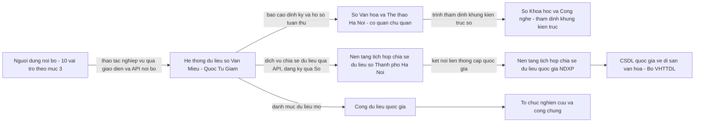
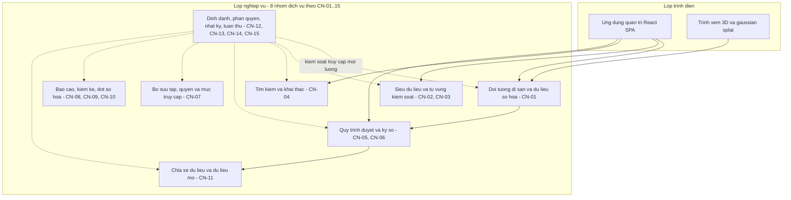
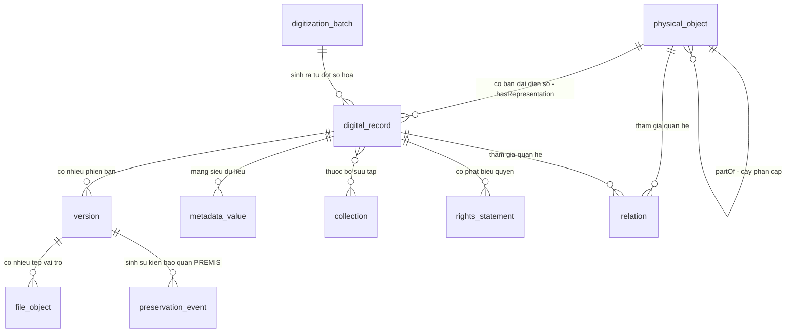
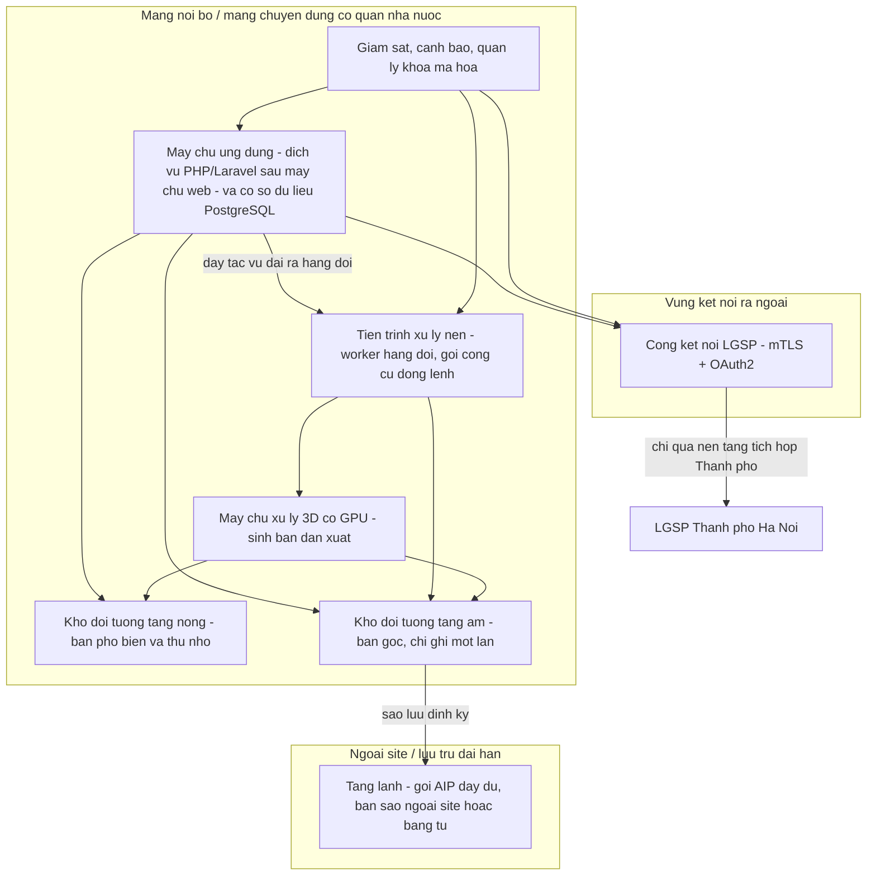
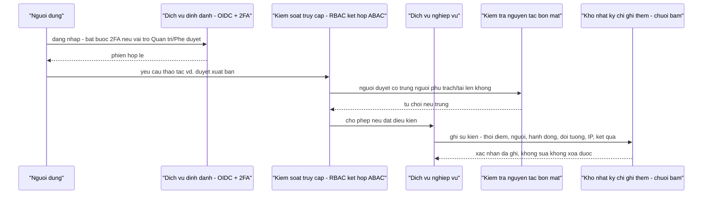
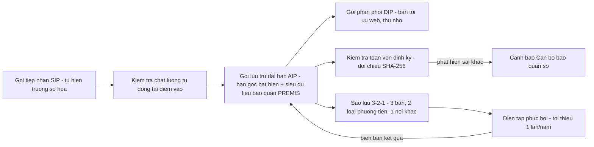

# MÔ TẢ KIẾN TRÚC HỆ THỐNG
## Hệ thống quản lý dữ liệu số hóa Văn Miếu — Quốc Tử Giám

**Hệ thống quản lý dữ liệu số Văn Miếu — Quốc Tử Giám** · Tài liệu số hiệu `08` · Phụ lục kỹ thuật hồ sơ dự thầu · đọc cùng `01-thuyet-minh-ky-thuat.md` (Chương 4–9), `07-mo-hinh-du-lieu.md`, `06-dac-ta-api.md`, `09-dac-ta-yeu-cau-srs.md`, `docs/adr/`

| Trường | Nội dung |
|---|---|
| Mã tài liệu | VMQTG-DS-08 |
| Tên tài liệu | Mô tả kiến trúc hệ thống (Architecture Description) |
| Chuẩn áp dụng | ISO/IEC/IEEE 42010:2022 — Software, systems and enterprise — Architecture description |
| Phiên bản | 1.0.0 |
| Ngày ban hành | 12/08/2026 |
| Người lập | Nhóm tư vấn/nhà thầu lập hồ sơ dự thầu *(tên đơn vị và cá nhân chịu trách nhiệm: cần điền trước khi nộp)* |
| Trạng thái | Dự thảo trình chủ đầu tư |
| Phạm vi mô tả | Kiến trúc mục tiêu **Giai đoạn 1** của hệ thống (theo `01-thuyet-minh-ky-thuat.md` Chương 3, mục 3.3), đối chiếu với trạng thái hiện thực hoá của mã nguồn ứng dụng minh hoạ tại `app/src/` (xem mục 9) |

**Tài liệu liên quan (đường dẫn tương đối từ `docs/`):**

| Tài liệu | Vai trò đối với tài liệu này |
|---|---|
| `./00-ke-hoach-nang-cap.md` | Nguồn các quyết định thiết kế gốc (mục 0bis–0septies), tiền thân của các ADR |
| `./01-thuyet-minh-ky-thuat.md` | Nguồn yêu cầu chức năng CN-01…CN-15, phi chức năng PCN-01…15, kiến trúc giải pháp (Chương 6), thiết kế dữ liệu (Chương 7), an toàn thông tin (Chương 9) — tài liệu này **không chép lại** mà tham chiếu và tổ chức lại theo khung nhìn ISO 42010 |
| `./02-quy-trinh-bao-quan-sao-luu.md` | Chi tiết vận hành của góc nhìn Vận hành & bảo quản dài hạn (mục 4.6) |
| `./03-ma-tran-truy-vet.md` | Ma trận truy vết wireframe × màn hình × pháp lý × chuẩn quốc tế — bổ sung ở mức use case |
| `./06-dac-ta-api.md` | Chi tiết kỹ thuật của góc nhìn Chức năng/logic, lớp giao tiếp API |
| `./07-mo-hinh-du-lieu.md` | Chi tiết đầy đủ của góc nhìn Dữ liệu (mục 4.3) |
| `./09-dac-ta-yeu-cau-srs.md` | Đặc tả yêu cầu phần mềm theo ISO/IEC/IEEE 29148:2018, dùng chính bộ khung nhìn và quyết định kiến trúc của tài liệu này làm ràng buộc thiết kế |
| `./adr/0001-…` đến `./adr/0016-…` | 16 quyết định kiến trúc (Architecture Decision Record) được tài liệu này tham chiếu tại mục 6, không chép lại nội dung |

---

## 1. Giới thiệu

### 1.1. Mục đích tài liệu

Tài liệu này mô tả kiến trúc của hệ thống quản lý dữ liệu số hóa Văn Miếu — Quốc Tử Giám theo khung khái niệm của **ISO/IEC/IEEE 42010:2022**: xác định các bên liên quan và mối quan tâm của họ đối với kiến trúc, tổ chức các khung nhìn (viewpoints) để mỗi khung nhìn giải quyết một tập mối quan tâm cụ thể, trình bày các góc nhìn (views) tương ứng bằng mô hình, và chứng minh — thông qua ma trận đối chiếu tại mục 5 — rằng mọi mối quan tâm đã xác định đều được ít nhất một khung nhìn xử lý. Tài liệu không lặp lại nội dung kỹ thuật đã có ở `01-thuyet-minh-ky-thuat.md`; mục tiêu là **tổ chức lại** nội dung đó theo cấu trúc chuẩn quốc tế để hội đồng thẩm định (đặc biệt là Sở Khoa học và Công nghệ Hà Nội khi thẩm định tuân thủ Khung kiến trúc số Thành phố) có một tài liệu tham chiếu độc lập, súc tích.

### 1.2. Phạm vi

Tài liệu mô tả kiến trúc mục tiêu của **Giai đoạn 1** — phạm vi đã chốt tại `01-thuyet-minh-ky-thuat.md` mục 3.3: kho dữ liệu số tập trung cho năm loại đối tượng di sản và tám dạng dữ liệu số, quy trình duyệt ba cấp, phân hệ tuân thủ và bảo vệ dữ liệu cá nhân, dịch vụ chia sẻ dữ liệu qua nền tảng tích hợp của Thành phố. Kiến trúc phục vụ **Cổng thông tin công chúng và cổng tham quan số** (Giai đoạn 2, mục 3.4 tài liệu 01) được nêu ở mức nguyên tắc sẵn sàng mở rộng, không mô tả chi tiết.

Biên giới hệ thống: phía trong là các dịch vụ nghiệp vụ, cơ sở dữ liệu, kho đối tượng và hạ tầng do chủ đầu tư quản lý; phía ngoài là các hệ thống mà dự án **kết nối tới nhưng không kiểm soát** — nền tảng tích hợp, chia sẻ dữ liệu số của Thành phố Hà Nội (LGSP), Cơ sở dữ liệu quốc gia về di sản văn hóa (Bộ VHTTDL), Cổng dữ liệu quốc gia, hệ thống định danh cơ quan (nếu dùng đăng nhập một lần cấp cơ quan).

### 1.3. Định nghĩa và viết tắt

Bảng đầy đủ thuật ngữ, mã và viết tắt nằm tại `09-dac-ta-yeu-cau-srs.md` mục 1.3 (dùng chung cho cả hai tài liệu, tránh một thuật ngữ có hai định nghĩa). Các viết tắt xuất hiện thường xuyên nhất trong tài liệu này: **AIP/SIP/DIP** (gói tin lưu trữ/tiếp nhận/phân phối theo OAIS), **RBAC/ABAC** (phân quyền theo vai trò/theo thuộc tính), **LGSP** (nền tảng tích hợp, chia sẻ dữ liệu số Thành phố), **NDXP** (nền tảng tích hợp, chia sẻ dữ liệu quốc gia), **RPO/RTO** (mục tiêu điểm khôi phục/thời gian khôi phục), **ADR** (Architecture Decision Record).

### 1.4. Tài liệu tham chiếu

Xem bảng "Tài liệu liên quan" ở trang đầu. Căn cứ pháp lý và tiêu chuẩn kỹ thuật viện dẫn xuyên suốt tài liệu này giữ nguyên bộ đã xác minh tại `01-thuyet-minh-ky-thuat.md` Chương 1 — tài liệu này chỉ trích số hiệu điều khoản khi trực tiếp chi phối một quyết định kiến trúc, không nhắc lại toàn bộ bối cảnh pháp lý.

---

## 2. Bối cảnh và mục tiêu kiến trúc

Kiến trúc được dẫn dắt bởi ba nhóm chỉ tiêu đo được tại `01-thuyet-minh-ky-thuat.md` mục 3.2 (MT-01…MT-09): **(một)** kho dữ liệu số tập trung, chuẩn hóa, có mã định danh bền vững và mã toàn vẹn SHA-256 cho mọi bản ghi; **(hai)** quy trình phê duyệt có trách nhiệm, bảo quản dài hạn không tổn hại bản gốc; **(ba)** sẵn sàng kết nối, chia sẻ dữ liệu qua nền tảng tích hợp của Thành phố trước mốc 31/12/2026, đồng thời tuân thủ an toàn thông tin và bảo vệ dữ liệu cá nhân theo pháp luật hiện hành. Bảy nguyên tắc kiến trúc nền tảng (mục 7) và các quyết định kiến trúc cụ thể (mục 6) đều truy được về một hoặc nhiều chỉ tiêu này.

---

## 3. Bên liên quan và mối quan tâm (Stakeholders & concerns)

Theo ISO/IEC/IEEE 42010:2022, mỗi bên liên quan (stakeholder) có một hoặc nhiều mối quan tâm (concern) đối với hệ thống, và mỗi mối quan tâm phải được ít nhất một khung nhìn kiến trúc giải quyết (mục 5 chứng minh điều này bằng ma trận đối chiếu). Mười bên liên quan dưới đây bao trùm toàn bộ vòng đời dữ liệu số hóa, từ tạo lập đến chia sẻ và khai thác.

| # | Bên liên quan | Mối quan tâm (concern) |
|---|---|---|
| BLQ-01 | **Chủ đầu tư** — Trung tâm Hoạt động Văn hóa Khoa học Văn Miếu — Quốc Tử Giám | (a) Toàn bộ dữ liệu số hóa hiện có được đưa vào một kho tập trung, không thất lạc, không trùng lặp; (b) hệ thống vận hành độc lập, không phụ thuộc một nhà thầu duy nhất về sau (chống khóa nhà cung cấp); (c) chi phí vận hành dự báo được, phù hợp năng lực đơn vị sự nghiệp công lập; (d) dữ liệu di sản được phản ánh chính xác, không bị suy đoán hay gán mặc định |
| BLQ-02 | **Sở Văn hóa và Thể thao Hà Nội** — cơ quan chủ quản | (a) Nhận được báo cáo nghiệp vụ và số liệu tổng hợp đúng chế độ thông tin báo cáo (Điều 33 Luật 45/2024); (b) Trung tâm thực hiện đúng vai trò đơn vị trực thuộc khi kết nối, chia sẻ dữ liệu — không tự ý kết nối thẳng ra cấp Thành phố hoặc cấp quốc gia; (c) dữ liệu phục vụ được công tác quản lý di tích quốc gia đặc biệt trên địa bàn |
| BLQ-03 | **Sở Khoa học và Công nghệ Hà Nội** — đầu mối thẩm định Khung kiến trúc số Thành phố | (a) Hệ thống tuân thủ Khung kiến trúc số Thành phố Hà Nội 1.0 (Quyết định 2906/QĐ-UBND) trước khi triển khai bằng vốn ngân sách; (b) kết nối ra ngoài đi qua nền tảng tích hợp, chia sẻ dữ liệu của Thành phố, không kết nối ngang hàng; (c) kiến trúc có tài liệu đầy đủ, có thể thẩm định độc lập, không phụ thuộc diễn giải miệng của nhà thầu |
| BLQ-04 | **Cán bộ số hóa** (kỹ thuật số hóa) | (a) Tải lên tệp lớn ổn định, tiếp tục được sau gián đoạn mạng; (b) kiểm tra chất lượng tự động ngay tại điểm vào, không phát hiện lỗi ở khâu sau; (c) quản lý được thiết bị quét và lịch hiệu chuẩn gắn với từng đợt số hóa |
| BLQ-05 | **Biên tập viên** | (a) Nhập siêu dữ liệu theo hồ sơ chuẩn hóa, có bộ từ vựng kiểm soát, không phải tự nghĩ cấu trúc; (b) nhập tư liệu Hán Nôm ba lớp và niên đại hai lớp mà không mất thông tin gốc; (c) không có ô trống mơ hồ — mọi trường thiếu đều có mã khuyết giá trị tường minh |
| BLQ-06 | **Cán bộ thẩm định và phê duyệt** | (a) Quy trình ba cấp rõ ràng, có thể trả lại hoặc từ chối kèm lý do; (b) hệ thống tự chặn xung đột lợi ích (nguyên tắc bốn mắt), không phải tự nhớ để tránh; (c) mọi quyết định duyệt được ký số và lưu vết không thể chối bỏ |
| BLQ-07 | **Quản trị hệ thống** | (a) Quản lý người dùng, phân quyền, khóa API và cấu hình mà không cần can thiệp của nhà thầu; (b) nhật ký đầy đủ, chỉ ghi thêm, phục vụ thanh tra và điều tra sự cố; (c) hạ tầng tự chủ, không phụ thuộc dịch vụ đám mây nước ngoài |
| BLQ-08 | **Cán bộ bảo quản số** *(vai trò mới)* | (a) Theo dõi tình trạng toàn vẹn (fixity) của toàn bộ kho tệp gốc theo thời gian thực; (b) chính sách vòng đời và định dạng lưu trữ minh bạch, đặc biệt với định dạng chưa chuẩn hóa như gaussian splat; (c) diễn tập phục hồi định kỳ có bằng chứng, không chỉ có kế hoạch trên giấy |
| BLQ-09 | **Cơ quan tiếp nhận chia sẻ dữ liệu** — LGSP Thành phố, Cơ sở dữ liệu quốc gia về di sản văn hóa (Bộ VHTTDL), Cổng dữ liệu quốc gia, tổ chức nghiên cứu | (a) API và đặc tả kỹ thuật đủ điều kiện đăng ký dịch vụ chia sẻ; (b) dữ liệu mở có giấy phép sử dụng rõ ràng, danh mục công bố đúng quy định; (c) hệ thống sẵn sàng ánh xạ sang đặc tả kết nối cấp quốc gia khi được công bố, không phải thiết kế lại |
| BLQ-10 | **Công chúng** *(mối quan tâm gián tiếp, phục vụ đầy đủ ở Giai đoạn 2)* | (a) Dữ liệu mở về di sản có thể tra cứu qua Cổng dữ liệu quốc gia; (b) dữ liệu cá nhân của người còn sống trong tư liệu (ảnh, gia phả) được che chắn đúng mức trước khi công khai; (c) trải nghiệm tra cứu công khai đầy đủ — cổng tham quan số, đa ngữ — sẽ có ở Giai đoạn 2 (mục 3.4 tài liệu 01), Giai đoạn 1 chỉ bảo đảm nền tảng dữ liệu sẵn sàng |

---

## 4. Khung nhìn kiến trúc (viewpoints) và các góc nhìn (views)

Sáu khung nhìn dưới đây được chọn để cùng nhau bao phủ toàn bộ mối quan tâm tại mục 3 — chứng minh cụ thể tại ma trận mục 5. Mỗi khung nhìn nêu: mối quan tâm được giải quyết, mô hình biểu diễn (sơ đồ mermaid), và diễn giải.

### 4.1. Góc nhìn Ngữ cảnh & tích hợp (Context & Integration View)

**Mối quan tâm giải quyết:** BLQ-01(b), BLQ-02(b,c), BLQ-03(b), BLQ-09(a,b,c), BLQ-10(a).

**Mô hình:**

**Diễn giải.** Hệ thống không kết nối trực tiếp ra cấp Thành phố hay cấp quốc gia: mọi kết nối đi qua Sở Văn hóa và Thể thao Hà Nội (đăng ký, phê duyệt chia sẻ) rồi tới nền tảng tích hợp, chia sẻ dữ liệu của Thành phố, đúng Điều 7 khoản 3 Quyết định 85/2025/QĐ-UBND — đây là ràng buộc đã được [ADR-0013](adr/0013-bien-chu-de-root-modal-qua-portal.md) hoá thân vào thiết kế biến chủ đề của cổng và được kiểm chứng lại tại mục 6. Nhánh Cơ sở dữ liệu quốc gia về di sản văn hóa (Bộ VHTTDL) chỉ ở trạng thái **sẵn sàng kết nối** — lớp ánh xạ tách riêng khỏi lõi hệ thống — vì đặc tả kỹ thuật cấp quốc gia chưa được công bố tại thời điểm lập hồ sơ. Nhánh dữ liệu mở đi độc lập qua Cổng dữ liệu quốc gia theo Điều 10 Nghị định 165/2025/NĐ-CP.

### 4.2. Góc nhìn Chức năng/logic (Functional/Logical View)

**Mối quan tâm giải quyết:** BLQ-01(a,d), BLQ-04, BLQ-05, BLQ-06, BLQ-07(a), BLQ-08(a).

**Mô hình:**

**Diễn giải.** Tám nhóm dịch vụ ánh xạ trực tiếp 1–1 sang mười lăm nhóm yêu cầu chức năng CN-01…CN-15 của `01-thuyet-minh-ky-thuat.md` Chương 4, cho phép tách thành dịch vụ độc lập khi tải tăng mà không phải thiết kế lại (nguyên tắc kiến trúc #5, mục 7). Nhóm B8 (định danh, phân quyền, nhật ký, tuân thủ) cắt ngang mọi nhóm khác — mọi thao tác nghiệp vụ đều đi qua kiểm soát truy cập và sinh sự kiện nhật ký, thể hiện bằng các cạnh nét đứt. Chi tiết từng nhóm dịch vụ và luồng dữ liệu nội bộ nằm ở `01-thuyet-minh-ky-thuat.md` Chương 6, mục 6.2–6.3.

### 4.3. Góc nhìn Dữ liệu (Data View)

**Mối quan tâm giải quyết:** BLQ-01(a,d), BLQ-05(b,c), BLQ-08(a,b), BLQ-09(a,c).

**Mô hình:**

**Diễn giải.** Nền tảng mô hình dữ liệu là quyết định tách **hai trục phân loại** — loại đối tượng di sản thật (`physical_object`) và dạng dữ liệu số (`digital_record`) — theo đúng mô hình CIDOC-CRM (ISO 21127), thay vì trộn hai khái niệm vào một trường như cách làm thường gặp ([ADR-0003](adr/0003-tach-truc-objectclass-va-digitalform.md)). Hệ thống mã định danh năm tầng ([ADR-0004](adr/0004-he-thong-ma-dinh-danh-5-tang.md)) và mã khuyết giá trị tường minh thay cho ô trống ([ADR-0005](adr/0005-bo-5-ma-khuyet-gia-tri.md), [ADR-0016](adr/0016-averagecompletenesspct-tra-null-cho-tap-rong.md)) là hai ràng buộc xuyên suốt mọi thực thể. Sơ đồ thực thể — quan hệ đầy đủ (16 thực thể theo danh mục đề bài cộng các bảng bổ sung có chủ đích) nằm tại `07-mo-hinh-du-lieu.md`; sơ đồ trên chỉ giữ lại các thực thể cốt lõi để minh họa nguyên lý tách trục.

### 4.4. Góc nhìn Triển khai/hạ tầng (Deployment View)

**Mối quan tâm giải quyết:** BLQ-01(b), BLQ-03(b), BLQ-07(c), BLQ-08(b).

**Mô hình:**

**Diễn giải.** Nguyên tắc tự chủ hạ tầng (self-host, nguyên tắc kiến trúc #1) đặt toàn bộ thành phần xử lý trong mạng nội bộ hoặc mạng chuyên dùng, không phụ thuộc dịch vụ đám mây nước ngoài. Kiến trúc lưu trữ ba tầng — nóng, ấm, lạnh (`01-thuyet-minh-ky-thuat.md` mục 6.5) — tách bạch dữ liệu truy cập thường xuyên khỏi bản gốc bất biến và bản sao lưu dài hạn, phục vụ trực tiếp mục tiêu RPO ≤ 24 giờ và RTO ≤ 4 giờ (mục 5.3 tài liệu 01). Máy chủ GPU chỉ phục vụ khâu xử lý và sinh bản dẫn xuất, không phát sinh chi phí theo số người xem vì khâu hiển thị chạy trên máy trạm người dùng. Hạ tầng tối thiểu chi tiết theo cấu hình, dung lượng nằm tại `01-thuyet-minh-ky-thuat.md` Chương 10.

Nút **tiến trình xử lý nền** tách khỏi nút dịch vụ API là hệ quả trực tiếp của [ADR-0018](adr/0018-php-laravel-cho-lop-dich-vu-ung-dung.md): dịch vụ PHP xử lý đồng bộ theo vòng đời request, nên mọi tác vụ dài — sinh bản dẫn xuất 3D, đóng gói AIP, kiểm tra toàn vẹn định kỳ theo `02-quy-trinh-bao-quan-sao-luu.md` — **bắt buộc** chạy ở worker qua hàng đợi, không có lựa chọn chạy trong request. Cùng lý do, endpoint phát trực tiếp tệp nhị phân có hỗ trợ `Range` (`06-dac-ta-api.md` mục 1.1) do máy chủ web đảm nhiệm qua cơ chế uỷ quyền nội bộ: dịch vụ ứng dụng kiểm quyền rồi trả chỉ dẫn, không đọc tệp lớn qua tiến trình PHP. Hai ranh giới này là ràng buộc thiết kế cứng, không phải khuyến nghị tối ưu.

### 4.5. Góc nhìn An toàn thông tin (Security View)

**Mối quan tâm giải quyết:** BLQ-01(b,d), BLQ-03(b), BLQ-06(b,c), BLQ-07(b), BLQ-10(b).

**Mô hình:**

**Diễn giải.** Ba quyết định kiến trúc chi phối góc nhìn này: nguyên tắc bốn mắt chặn ở tầng dịch vụ chứ không chỉ ẩn nút giao diện ([ADR-0011](adr/0011-nguyen-tac-bon-mat-tach-phe-duyet-xuat-ban.md)), nhật ký chỉ ghi thêm với chuỗi băm liên kết để phát hiện can thiệp ([ADR-0012](adr/0012-nhat-ky-append-only-thoi-han-luu-theo-cap-do-attt.md)), và xác thực hai yếu tố bắt buộc với vai trò Quản trị và Phê duyệt (`01-thuyet-minh-ky-thuat.md` mục 9.2). Cấp độ an toàn hệ thống thông tin đề xuất là **cấp độ 2**, nhưng kiến trúc được thiết kế theo mức biện pháp của **cấp độ 3** ở các hạng mục có chi phí biên thấp — mã hóa AES-256 khi lưu, TLS 1.2 trở lên khi truyền, thời hạn lưu nhật ký mặc định 12 tháng — để việc nâng cấp độ về sau không phải thiết kế lại (mục 9.1, 9.6 tài liệu 01). Chi tiết đầy đủ nằm ở `01-thuyet-minh-ky-thuat.md` Chương 9.

### 4.6. Góc nhìn Vận hành & bảo quản dài hạn (Operations & Long-term Preservation View)

**Mối quan tâm giải quyết:** BLQ-01(d), BLQ-07(b), BLQ-08(a,b,c).

**Mô hình:**

**Diễn giải.** Vòng đời dữ liệu tuân theo mô hình OAIS (ISO 14721) với ba gói tin tách bạch, bảo đảm thao tác biên tập và tối ưu cho web không bao giờ chạm tới bản gốc — nguyên tắc kiến trúc #4 (mục 7). Việc kiểm tra toàn vẹn định kỳ, sao lưu theo quy tắc ba bản — hai loại phương tiện — một nơi khác, và diễn tập phục hồi có biên bản là ba cơ chế cụ thể hóa cam kết MT-06 (mục 3.2 tài liệu 01). Định dạng chưa chuẩn hóa (gaussian splat) được xử lý như một rủi ro bảo quản có theo dõi, không coi là bản lưu trữ dài hạn (mục 7.8 tài liệu 01). Quy trình chi tiết — lịch kiểm tra, thủ tục khôi phục nhiều bước, ma trận vai trò thực hiện — nằm tại `02-quy-trinh-bao-quan-sao-luu.md`.

---

## 5. Ma trận đối chiếu mối quan tâm ↔ khung nhìn

Ma trận dưới đây chứng minh — theo yêu cầu của ISO/IEC/IEEE 42010:2022 — rằng mỗi mối quan tâm tại mục 3 được ít nhất một khung nhìn tại mục 4 xử lý. Chữ cái trong ô tương ứng với mối quan tâm (a)/(b)/(c)/(d) đã liệt kê tại bảng mục 3. Cột **"Mục khác / ghi chú"** dùng cho mối quan tâm không do một khung nhìn kỹ thuật xử lý mà do phần khác của tài liệu (quyết định kiến trúc, ràng buộc) hoặc do tài liệu khác trong bộ hồ sơ xử lý — trường hợp này được ghi rõ, không để trống mơ hồ, đúng tinh thần "không có ô trống" quán xuyến toàn bộ hồ sơ (`01-thuyet-minh-ky-thuat.md` mục 7.7).

| Bên liên quan | 4.1 Ngữ cảnh | 4.2 Chức năng | 4.3 Dữ liệu | 4.4 Triển khai | 4.5 An toàn TT | 4.6 Vận hành | Mục khác / ghi chú |
|---|---|---|---|---|---|---|---|
| BLQ-01 Chủ đầu tư | b | a, d | a, d | b | b, d | d | **(c)** chi phí vận hành — ngoài phạm vi mô tả kiến trúc, xem `01-thuyet-minh-ky-thuat.md` Chương 16 |
| BLQ-02 Sở VH&TT Hà Nội | b, c | a *(gián tiếp qua nhóm dịch vụ B6)* | — | — | — | — | — |
| BLQ-03 Sở KH&CN Hà Nội | b | — | — | b | — | — | **(a, c)** tuân thủ khung kiến trúc và tính đầy đủ tài liệu — do mục 6 (Quyết định kiến trúc) và mục 8 (Ràng buộc) của chính tài liệu này đáp ứng, không phải một khung nhìn kỹ thuật cụ thể |
| BLQ-04 Cán bộ số hóa | — | a, b, c | — | — | — | — | — |
| BLQ-05 Biên tập viên | — | a | b, c | — | — | — | — |
| BLQ-06 Thẩm định, phê duyệt | — | a | — | — | b, c | — | — |
| BLQ-07 Quản trị hệ thống | — | a | — | c | b | — | — |
| BLQ-08 Bảo quản số | — | a | a, b | b | — | a, b, c | — |
| BLQ-09 Cơ quan tiếp nhận chia sẻ | a, b, c | — | a, c | — | — | — | — |
| BLQ-10 Công chúng | a | — | — | — | b | — | **(c)** trải nghiệm tra cứu công khai đầy đủ (cổng tham quan số) — khoảng trống có chủ đích của Giai đoạn 1, đã nêu tại `01-thuyet-minh-ky-thuat.md` mục 3.4 và lộ trình Chương 15 |

**Kết luận đối chiếu:** 27/29 mối quan tâm cụ thể được ít nhất một khung nhìn kiến trúc xử lý trực tiếp. Hai mối quan tâm còn lại — BLQ-01(c) và BLQ-10(c) — không phải khoảng trống bị bỏ sót mà là **ranh giới phạm vi có chủ đích**: chi phí vận hành thuộc tài liệu thuyết minh kinh tế — kỹ thuật, không thuộc mô tả kiến trúc theo 42010; trải nghiệm công chúng đầy đủ thuộc Giai đoạn 2 theo quyết định phạm vi đã chốt (mục 3.4 tài liệu 01). BLQ-03(a, c) và BLQ-02(a) được xử lý nhưng không qua một khung nhìn kỹ thuật đơn lẻ mà qua cấu trúc tổng thể của tài liệu — điều này phù hợp với ISO/IEC/IEEE 42010:2022 vì tiêu chuẩn không bắt buộc mọi mối quan tâm phải được giải quyết bởi đúng một view.

---

## 6. Quyết định kiến trúc

Các quyết định kiến trúc cụ thể được ghi nhận đầy đủ (bối cảnh, phương án cân nhắc, hệ quả) dưới dạng **Architecture Decision Record (ADR)** trong thư mục `docs/adr/`, đánh số 0001–0018. Tài liệu này **không chép lại nội dung** từng ADR — chỉ lập bảng trỏ tới số hiệu, tiêu đề và khung nhìn liên quan, để người đọc tra cứu đúng nguồn khi cần lý giải chi tiết một quyết định.

| ADR | Tiêu đề | Khung nhìn liên quan chính | Mối quan tâm liên quan |
|---|---|---|---|
| 0001 | IA theo v3 | 4.2 Chức năng/logic | BLQ-01, BLQ-05, BLQ-06 |
| 0002 | React + Vite + mock service | 4.2 Chức năng/logic, 4.4 Triển khai | BLQ-01, BLQ-07 *(xem thêm mục 9 — trạng thái hiện thực hoá)* |
| 0003 | Hai trục phân loại (đối tượng di sản × dạng dữ liệu số) | 4.3 Dữ liệu | BLQ-01, BLQ-05, BLQ-09 |
| 0004 | Mã định danh 5 tầng | 4.3 Dữ liệu | BLQ-01, BLQ-08, BLQ-09 |
| 0005 | Mã khuyết giá trị | 4.3 Dữ liệu | BLQ-01, BLQ-05 |
| 0006 | Niên đại hai lớp | 4.3 Dữ liệu | BLQ-05 |
| 0007 | Bảng đo lường CIDOC-CRM E54 | 4.3 Dữ liệu | BLQ-05, BLQ-08 |
| 0008 | `hasPreservationSurrogate` | 4.3 Dữ liệu, 4.6 Vận hành | BLQ-08 |
| 0009 | Nguồn danh sách đối tượng | 4.3 Dữ liệu | BLQ-01, BLQ-05 |
| 0010 | Hoàn tác hai tầng | 4.2 Chức năng/logic | BLQ-05, BLQ-06 |
| 0011 | Nguyên tắc bốn mắt | 4.5 An toàn thông tin | BLQ-01, BLQ-06, BLQ-07 |
| 0012 | Nhật ký append-only | 4.5 An toàn thông tin | BLQ-01, BLQ-03, BLQ-07 |
| 0013 | Portal và biến chủ đề | 4.1 Ngữ cảnh & tích hợp | BLQ-03, BLQ-10 |
| 0014 | Kỷ luật trích dẫn pháp lý | Xuyên suốt tài liệu (mục 1.4, Chương 1 tài liệu 01) | BLQ-01, BLQ-03 |
| 0015 | i18n tách lớp | 4.2 Chức năng/logic, 4.3 Dữ liệu | BLQ-05, BLQ-10 |
| 0016 | Completeness trả `null` | 4.3 Dữ liệu | BLQ-01, BLQ-05 |
| 0017 | Ma trận phân quyền một nguồn; phân tách nhiệm vụ nằm trong mã | 4.5 An toàn thông tin | BLQ-01, BLQ-06, BLQ-07 |
| 0018 | PHP + Laravel cho lớp dịch vụ ứng dụng; lớp trình diễn giữ nguyên React | 4.2 Chức năng/logic, 4.4 Triển khai | BLQ-01, BLQ-03, BLQ-07 *(xem thêm mục 9 — trạng thái hiện thực hoá)* |

*Ghi chú:* thư mục `docs/adr/` đã hoàn tất với 18 ADR và một tệp chỉ mục; tên tệp theo quy ước `NNNN-tieu-de-khong-dau.md`, đối chiếu tại `adr/README.md`. Bảng trên tra cứu theo **số hiệu và tiêu đề**, không phụ thuộc tên tệp cụ thể.

---

## 7. Nguyên lý kiến trúc (architecture principles)

Bảy nguyên lý dưới đây — nguyên văn từ `01-thuyet-minh-ky-thuat.md` mục 6.1 — chi phối mọi quyết định thiết kế và mọi khung nhìn tại mục 4. Cột "Hệ quả với khung nhìn" bổ sung so với tài liệu 01, làm rõ nguyên lý thể hiện cụ thể ở đâu trong bộ khung nhìn của tài liệu này.

| # | Nguyên lý | Căn cứ | Hệ quả với khung nhìn |
|---|---|---|---|
| 1 | **Tự chủ hạ tầng (self-host)** — không phụ thuộc dịch vụ đám mây nước ngoài | Yêu cầu lưu trữ dữ liệu tại Việt Nam; vận hành trong mạng nội bộ | Định hình toàn bộ 4.4 Triển khai/hạ tầng |
| 2 | **Ưu tiên mã nguồn mở và phần mềm trong nước** | Điều 85 Nghị định 308/2025/NĐ-CP | Lựa chọn công nghệ tại 4.2 và 4.4 (PHP + Laravel ở lớp dịch vụ theo [ADR-0018](adr/0018-php-laravel-cho-lop-dich-vu-ung-dung.md), PostgreSQL, OpenSearch, kho đối tượng tương thích S3) — toàn bộ mã nguồn mở, giấy phép tự do, self-host được, mặt bằng nhân lực trong nước rộng |
| 3 | **Tách lưu trữ tệp khỏi cơ sở dữ liệu** | Quy mô dữ liệu 3D và không gian rất lớn | Cấu trúc lớp dữ liệu tại 4.3 và ba tầng lưu trữ tại 4.4 |
| 4 | **Bản gốc bất biến, tách ba lớp gói tin SIP — AIP — DIP** | Mô hình OAIS ISO 14721 | Toàn bộ 4.6 Vận hành & bảo quản dài hạn |
| 5 | **Giao diện lập trình mở, chuẩn hóa** — mọi chức năng đều qua API | Điều kiện kết nối nền tảng chia sẻ dữ liệu Thành phố | Ranh giới lớp trình diễn/nghiệp vụ tại 4.2; toàn bộ 4.1 |
| 6 | **Kết nối ra ngoài đi qua nền tảng tích hợp của Thành phố**, không kết nối ngang hàng | Điều 7 khoản 3 Quyết định 85/2025/QĐ-UBND; Điều 7 Nghị định 278/2025/NĐ-CP | Cấu trúc phân tầng của 4.1 Ngữ cảnh & tích hợp |
| 7 | **Nhật ký chỉ ghi thêm, tách kho** | Điều 13 Nghị định 278/2025/NĐ-CP | Toàn bộ 4.5 An toàn thông tin |

---

## 8. Ràng buộc (constraints)

| Loại ràng buộc | Nội dung | Nguồn |
|---|---|---|
| **Pháp lý — lưu trữ và chủ quyền dữ liệu** | Không thành phần nào truyền dữ liệu di sản ra khỏi lãnh thổ Việt Nam; toàn bộ tài nguyên tĩnh được đóng gói, phục vụ từ chính hệ thống | `01-thuyet-minh-ky-thuat.md` mục 5.5 |
| **Pháp lý — kết nối, chia sẻ dữ liệu** | Kết nối ra ngoài bắt buộc qua nền tảng tích hợp, chia sẻ dữ liệu của Thành phố; không tự kết nối thẳng tới CSDL quốc gia về di sản văn hóa hay Cổng dữ liệu quốc gia | Điều 7 khoản 3 Quyết định 85/2025/QĐ-UBND; Điều 7, Điều 8 Nghị định 278/2025/NĐ-CP |
| **Pháp lý — ưu tiên công nghệ** | Ưu tiên thành phần mã nguồn mở và phần mềm trong nước; mọi thành phần có phí bản quyền phải kê khai rõ | Điều 85 Nghị định 308/2025/NĐ-CP; PCN-11 |
| **Pháp lý — bảo vệ dữ liệu cá nhân** | Kiến trúc phải hỗ trợ đầy đủ nghiệp vụ DPO, DPIA trong 60 ngày, thông báo vi phạm trong 72 giờ; không dựa vào miễn trừ chưa xác minh cho cơ quan nhà nước | Luật Bảo vệ dữ liệu cá nhân 91/2025/QH15; Nghị định 356/2025/NĐ-CP |
| **Tuân thủ khung kiến trúc** | Toàn bộ kiến trúc trình Sở Khoa học và Công nghệ Hà Nội thẩm định tuân thủ Khung kiến trúc số Thành phố Hà Nội 1.0 trước khi triển khai bằng vốn ngân sách | Quyết định 2906/QĐ-UBND, Điều 2.1 |
| **Hạ tầng** | Băng thông và cấu hình tối thiểu phải phục vụ được ≥ 50 người dùng đồng thời, mở rộng tới 200; tải mô hình 3D lũy tiến, không tải nguyên khối | `01-thuyet-minh-ky-thuat.md` mục 5.1, 6.6 |
| **Tương thích** | Bố cục hoạt động đúng từ độ rộng màn hình 1024 px; không yêu cầu cài đặt phần mềm bổ trợ hay trình cắm trên trình duyệt | `01-thuyet-minh-ky-thuat.md` mục 5.4 |
| **Chống khóa nhà cung cấp** | Không dùng định dạng lưu trữ độc quyền cho bản gốc; xuất toàn bộ dữ liệu, siêu dữ liệu theo chuẩn mở bất kỳ lúc nào; cấu hình vận hành tách khỏi mã nguồn | PCN-12, PCN-13, PCN-15 |

---

## 9. Trạng thái hiện thực hoá so với kiến trúc mục tiêu

Điểm cần nói rõ để hội đồng không nhầm lẫn phạm vi: kiến trúc mô tả tại mục 4 là **kiến trúc mục tiêu** của hệ thống chính thức khi triển khai — với lớp dịch vụ PHP + Laravel ([ADR-0018](adr/0018-php-laravel-cho-lop-dich-vu-ung-dung.md)), PostgreSQL, kho đối tượng tương thích S3, máy tìm kiếm OpenSearch, hàng đợi tác vụ, máy chủ định danh OpenID Connect như liệt kê tại `01-thuyet-minh-ky-thuat.md` mục 6.2. Mã nguồn hiện có tại `app/src/` là **ứng dụng minh hoạ (demo/POC)** phục vụ trình bày giao diện, luồng nghiệp vụ và kịch bản demo hồ sơ dự thầu (`05-kich-ban-demo.md`), theo quyết định kiến trúc [ADR-0002](adr/0002-react-vite-lop-dich-vu-gia-lap.md) (React + Vite + mock service): giao diện dựng bằng React 19 và React Router, không có máy chủ nghiệp vụ hay cơ sở dữ liệu thật — toàn bộ trạng thái nghiệp vụ được mô phỏng bằng lớp dịch vụ giả lập trong bộ nhớ trình duyệt (`app/src/services/mock/*.ts`, điều phối bởi `app/src/services/store.ts` và hook `useStore.ts`).

| Thành phần | Kiến trúc mục tiêu (mục 4) | Trạng thái mã nguồn demo hiện tại (`app/src/`) |
|---|---|---|
| Lớp trình diễn | React SPA, gọi API qua HTTPS | React 19 + React Router, đúng công nghệ mục tiêu — có thể tái sử dụng phần lớn khi nối vào API thật |
| Lớp nghiệp vụ (8 nhóm dịch vụ) | Dịch vụ REST theo miền nghiệp vụ viết bằng PHP + Laravel ([ADR-0018](adr/0018-php-laravel-cho-lop-dich-vu-ung-dung.md)), xem 4.2 | Mô phỏng bằng `services/mock/assetService.ts`, `collectionService.ts`, `userService.ts`, `auditService.ts`, `connectionService.ts`, `uploadService.ts` — cùng ranh giới miền nghiệp vụ, khác cơ chế truyền tải |
| Lớp dữ liệu | PostgreSQL + kho đối tượng S3 + chỉ mục tìm kiếm, xem 4.3 | Dữ liệu mẫu tĩnh tại `services/mock/` và `data/`, không có cơ sở dữ liệu quan hệ hay kho đối tượng thật |
| Xác thực, phân quyền | OpenID Connect, 2FA, RBAC kết hợp ABAC, xem 4.5 | `context/AuthContext.tsx` mô phỏng phiên đăng nhập ở mức giao diện, chưa có máy chủ định danh thật |
| Hạ tầng | Ba tầng lưu trữ, GPU xử lý, sao lưu ngoài site, xem 4.4 | Không áp dụng — ứng dụng demo chạy tại chỗ (`vite dev`/`vite preview`), không có hạ tầng triển khai |

**Hệ quả cho hồ sơ:** phần minh hoạ hiện có chứng minh được tính khả thi của lớp trình diễn và luồng nghiệp vụ, nhưng **không phải** là bằng chứng đã triển khai lớp dữ liệu, an toàn thông tin hay hạ tầng theo kiến trúc mục tiêu — các lớp đó sẽ được hiện thực hoá trong giai đoạn triển khai chính thức sau khi trúng thầu, theo đúng kế hoạch tại `01-thuyet-minh-ky-thuat.md` Chương 12.

---

## 10. Kết luận

Tài liệu đã xác định mười bên liên quan với hai mươi chín mối quan tâm cụ thể (mục 3), tổ chức sáu khung nhìn kiến trúc cùng mô hình minh hoạ để xử lý các mối quan tâm đó (mục 4), chứng minh mức độ bao phủ bằng ma trận đối chiếu (mục 5), trỏ tới đầy đủ mười sáu quyết định kiến trúc chi tiết (mục 6), nêu bảy nguyên lý và tám nhóm ràng buộc chi phối thiết kế (mục 7–8), và nói rõ ranh giới giữa kiến trúc mục tiêu với trạng thái hiện thực hoá hiện tại (mục 9). Tài liệu này cùng `09-dac-ta-yeu-cau-srs.md` tạo thành cặp tài liệu kiến trúc — yêu cầu theo đúng cặp chuẩn ISO/IEC/IEEE 42010:2022 và 29148:2018 thường được hội đồng thẩm định đối chiếu song song.

---

## Báo cáo rà soát và danh mục cần đối chiếu trước khi nộp

Tài liệu được biên soạn bằng cách tổ chức lại nội dung đã có tại `01-thuyet-minh-ky-thuat.md` (Chương 1, 3, 4–9), `00-ke-hoach-nang-cap.md` và các quyết định kiến trúc dự kiến của `docs/adr/` theo khung ISO/IEC/IEEE 42010:2022, không phát sinh căn cứ pháp lý hay số liệu kỹ thuật mới ngoài bộ đã xác minh. Sáu sơ đồ mermaid dùng cú pháp `ID["nhãn"]` với nhãn tiếng Việt trong ngoặc kép, giữ ID nút bằng ký tự ASCII để bảo đảm phân tích cú pháp ổn định.

**Danh mục "(cần đối chiếu trước khi nộp)":**

1. **Người lập tài liệu** — tên đơn vị tư vấn/nhà thầu và cá nhân chịu trách nhiệm chưa được điền ở bảng thông tin đầu tài liệu.
2. **Tên tệp chính xác của 16 ADR** trong `docs/adr/` — bảng mục 6 tra cứu theo số hiệu và tiêu đề, cần đối chiếu lại đường dẫn tệp khi thư mục ADR hoàn tất.
3. Mọi nội dung gắn nhãn *"(cần đối chiếu nguyên văn trước khi nộp)"* trong `01-thuyet-minh-ky-thuat.md` mà tài liệu này tham chiếu (đặc biệt Chương 1 về hiệu lực văn bản pháp luật, Chương 9 mục 9.1 và 9.6 về cấp độ an toàn thông tin) áp dụng nguyên trạng cho tài liệu này vì nội dung được tham chiếu, không nhân bản.
