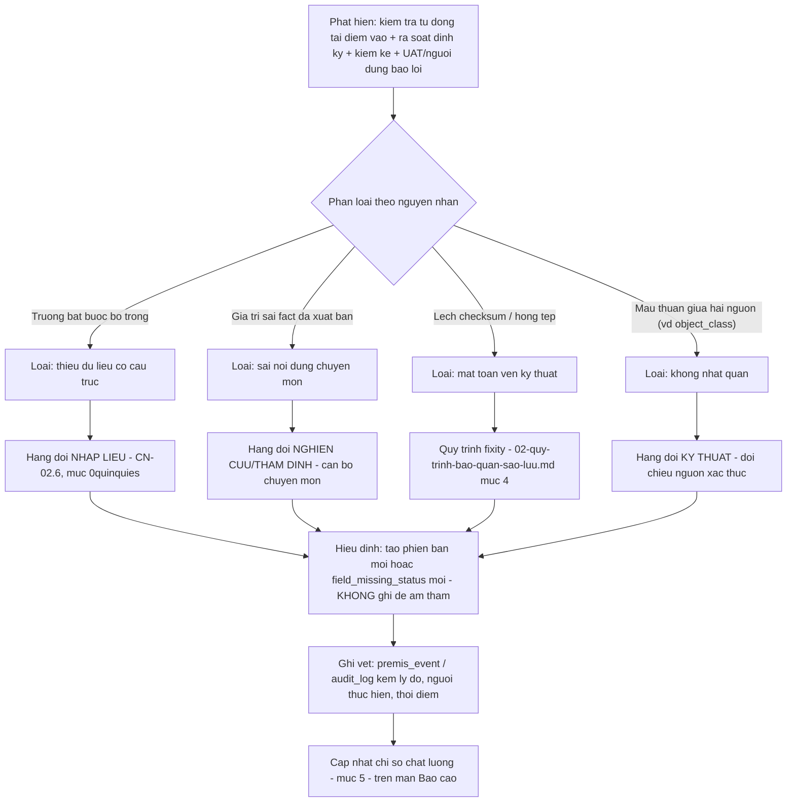

# Chất lượng dữ liệu số hóa

**Hệ thống quản lý dữ liệu số hóa Văn Miếu — Quốc Tử Giám**

| Trường | Nội dung |
|---|---|
| Mã tài liệu | 12 |
| Tên tài liệu | Mô hình và phép đo chất lượng dữ liệu |
| Chuẩn áp dụng | ISO/IEC 25012:2008 — Data Quality Model (15 đặc tính); ISO/IEC 25024:2015 — Measurement of data quality (phép đo) |
| Phiên bản | 1.0.0 |
| Ngày ban hành | 12/08/2026 |
| Trạng thái | Dự thảo — phục vụ hồ sơ dự thầu, chờ Trung tâm phê duyệt ngưỡng mục tiêu chính thức |
| Đơn vị lập | Nhà thầu, phối hợp Trung tâm Hoạt động Văn hóa Khoa học Văn Miếu — Quốc Tử Giám |
| Tài liệu liên quan | `00-ke-hoach-nang-cap.md` (mã khuyết giá trị mục 0quinquies, mã định danh mục 0quater) · `01-thuyet-minh-ky-thuat.md` (Chương 5 mục 5.7 chất lượng nội dung di sản, Chương 7 thiết kế dữ liệu, Chương 9 an toàn thông tin) · `02-quy-trinh-bao-quan-sao-luu.md` (fixity, 3-2-1, NDSA) · `04-phu-luc-fact-di-san.md` (14 sai sót đã hiệu đính) · `07-mo-hinh-du-lieu.md` (ERD, từ điển dữ liệu) · `11-ke-hoach-kiem-thu.md` (kiểm thử liên quan chất lượng dữ liệu) |

---

## Mục lục

1. Giới thiệu và khung áp dụng
2. Đặc tính vốn có (inherent)
3. Đặc tính vốn có + phụ thuộc hệ thống
4. Đặc tính phụ thuộc hệ thống (system-dependent)
5. Bảng tổng hợp 15 phép đo
6. Quy trình xử lý dữ liệu kém chất lượng
7. Bài học thực tế — đợt rà soát 14 sai sót
8. Lộ trình cải thiện

---

## 1. Giới thiệu và khung áp dụng

### 1.1. Mục đích

Tài liệu áp dụng **mô hình chất lượng dữ liệu ISO/IEC 25012:2008** — 15 đặc tính chia ba nhóm (vốn có, vốn có kết hợp phụ thuộc hệ thống, phụ thuộc hệ thống) — vào dữ liệu di sản của hệ thống, và dùng khung **phép đo ISO/IEC 25024:2015** để cụ thể hoá từng đặc tính thành công thức đo được, có ngưỡng mục tiêu và cách hệ thống hiện đang đo hoặc bảo đảm. Đây là công cụ vận hành thường trực, không phải tài liệu lập một lần: các phép đo ở mục 2–4 là những chỉ số nên xuất hiện trên màn Báo cáo — Thống kê và màn Kiểm kê của hệ thống.

### 1.2. Ba nhóm đặc tính theo ISO/IEC 25012

| Nhóm | Ý nghĩa | 5 + 7 + 3 = 15 đặc tính |
|---|---|---|
| **Vốn có (inherent)** | Chất lượng vốn có trong bản thân dữ liệu, không phụ thuộc hệ thống lưu trữ nó | Tính chính xác (accuracy), tính đầy đủ (completeness), tính nhất quán (consistency), tính tin cậy (credibility), tính thời sự (currentness) |
| **Vốn có + phụ thuộc hệ thống** | Vừa phụ thuộc bản chất dữ liệu, vừa phụ thuộc năng lực hệ thống thể hiện/bảo vệ dữ liệu đó | Khả năng tiếp cận (accessibility), tính tuân thủ (compliance), tính bảo mật (confidentiality), tính hiệu quả (efficiency), độ chính xác chi tiết (precision), tính truy vết (traceability), tính dễ hiểu (understandability) |
| **Phụ thuộc hệ thống (system-dependent)** | Chất lượng do năng lực kỹ thuật của hệ thống quyết định, không nằm trong bản thân giá trị dữ liệu | Tính sẵn sàng (availability), tính khả chuyển (portability), khả năng phục hồi (recoverability) |

### 1.3. Vì sao mô hình này phù hợp với dữ liệu di sản

Dữ liệu số hóa của Văn Miếu — Quốc Tử Giám có ba đặc điểm khiến mô hình 25012 áp dụng chặt hơn một hệ CSDL nghiệp vụ thông thường: *(một)* mỗi bản ghi neo với **một đối tượng vật lý có thật, duy nhất và không thể tạo lại** — sai một giá trị (niên đại, vị trí) không chỉ là lỗi kỹ thuật mà là sai lệch tri thức về di sản; *(hai)* dữ liệu đến từ **nhiều tầng thẩm quyền xác thực khác nhau** (nhà thầu số hóa, cán bộ chuyên môn Trung tâm, hội đồng thẩm định Hán Nôm, cơ quan quản lý cấp trên) nên tính tin cậy (credibility) và tính truy vết (traceability) không thể tách rời; *(ba)* dự án chịu ràng buộc pháp lý cụ thể (Luật Di sản văn hóa 45/2024/QH15 Điều 85, Luật Dữ liệu số 60/2024/QH15 Điều 12) nêu đích danh **"chất lượng dữ liệu"** là nghĩa vụ pháp lý, không chỉ là mục tiêu kỹ thuật nội bộ.

### 1.4. Cách đọc phần thân bài — bốn mục cho mỗi đặc tính

Mỗi đặc tính ở mục 2–4 trình bày theo đúng bốn mục: **Nghĩa trong bối cảnh này** (diễn giải định nghĩa 25012 vào dữ liệu di sản cụ thể) · **Phép đo cụ thể** (công thức đo dạng tỷ lệ hoặc đếm, theo khuôn mẫu hàm đo của ISO/IEC 25024) · **Ngưỡng mục tiêu** (giá trị cam kết hoặc đề xuất — mục nào chưa có số chính thức trong hồ sơ được ghi rõ "đề xuất, chờ Trung tâm phê duyệt") · **Cách hệ thống hiện đang đo hoặc bảo đảm** (cơ chế hoặc trường dữ liệu cụ thể trong `07-mo-hinh-du-lieu.md`/mã nguồn `app/src`).

---

## 2. Đặc tính vốn có (inherent)

### 2.1. Tính chính xác (Accuracy)

- **Nghĩa trong bối cảnh này:** giá trị dữ liệu (niên đại, vị trí, tên gọi, danh tính, quan hệ hiện vật) phản ánh đúng thực tế lịch sử/hiện trạng, đã qua xác nhận chuyên môn — đúng nguyên tắc Điều 85 Nghị định 308/2025/NĐ-CP: "dữ liệu số phải phản ánh chính xác nội dung, đặc điểm, giá trị di sản".
- **Phép đo cụ thể:** `tỷ lệ bản ghi không phát sinh lỗi fact sau xuất bản = 1 − (số bản ghi bị phát hiện sai fact qua rà soát định kỳ hoặc UAT / tổng số bản ghi đã xuất bản trong kỳ)`. Đo bổ sung: `tỷ lệ bản ghi đã qua đủ bước Thẩm định nội dung trước khi Đã duyệt = số bản ghi có sự kiện PREMIS THAM_DINH_NOI_DUNG / số bản ghi ở trạng thái Đã duyệt trở lên`.
- **Ngưỡng mục tiêu:** 100% bản ghi xuất bản phải có sự kiện `THAM_DINH_NOI_DUNG` (ràng buộc cấu trúc quy trình, không phải mục tiêu thống kê — pipeline chặn cứng). Tỷ lệ lỗi fact phát hiện sau xuất bản: mục tiêu tiệm cận 0, dùng **mức nền 14/150 ≈ 9,3%** (đợt rà soát trước khi hệ thống vận hành, xem mục 7) làm đường gốc để đo cải thiện theo thời gian — không phải ngưỡng chấp nhận được.
- **Cách hệ thống hiện đang đo hoặc bảo đảm:** trạng thái pipeline bắt buộc bước `Thẩm định nội dung` trước `Đã duyệt` (`app/src/data/pipeline.ts`, `PIPELINE_SEQUENCE`); mỗi lần thẩm định ghi một `premis_event` loại `THAM_DINH_NOI_DUNG` kèm `agent_user_id`; song thẩm bắt buộc với Hán Nôm (người dịch ≠ người thẩm định, CN-05.4).

### 2.2. Tính đầy đủ (Completeness)

- **Nghĩa trong bối cảnh này:** mọi trường bắt buộc của một bản ghi có giá trị thật hoặc một trong năm mã khuyết giá trị tường minh — "không có ô trống" (`00-ke-hoach-nang-cap.md` mục 0quinquies).
- **Phép đo cụ thể:** `% độ đầy đủ hồ sơ = (số trường có giá trị thật + số trường mang KHONG_RO hoặc HAN_CHE) / (tổng số trường áp dụng − số trường mang KHONG_AP_DUNG)`, tính cho từng bản ghi rồi lấy trung bình theo phạm vi (bộ sưu tập/toàn kho). Đây đúng công thức đã cài đặt tại `07-mo-hinh-du-lieu.md` mục 5.14 và hiện thực một phần tại `profileCompletenessPct()`/`averageCompletenessPctOrNull()` trong `app/src/data/selectors.ts`.
- **Ngưỡng mục tiêu:** cấu trúc — 100% trường bắt buộc có giá trị hoặc mã khuyết kèm lý do, ép buộc ở tầng lưu (MT-03, không cho lưu khi bỏ trống). Nội dung — mức đề xuất ≥ 85% cho nhóm hiện vật/tài liệu vào cuối Giai đoạn 1, **chờ Trung tâm phê duyệt chính thức theo khối lượng nhập liệu thực tế**; ngưỡng này chưa xuất hiện dưới dạng cam kết trong `01-thuyet-minh-ky-thuat.md`.
- **Cách hệ thống hiện đang đo hoặc bảo đảm:** trường `so_kiem_ke` là ví dụ thật cho thấy chỉ số này trung thực chứ không tô hồng — ghi chú trong `app/src/pages/InventoryPage.tsx` xác nhận `so_kiem_ke` hiện ở trạng thái `CHUA_NHAP` với **gần 100% hiện vật/tài liệu trong dữ liệu mẫu**, tức chỉ số đầy đủ hồ sơ cho trường này khởi điểm thấp — đây là hiện trạng thật cần đưa vào hàng đợi nhập liệu (mục 6), không phải lỗi hệ thống hay số liệu bị che giấu.

### 2.3. Tính nhất quán (Consistency)

- **Nghĩa trong bối cảnh này:** dữ liệu không tự mâu thuẫn — giữa các bản ghi với nhau (một đối tượng không có hai giá trị `object_class` khác nhau ở hai nơi), và giữa số liệu hiển thị với dữ liệu nguồn (nguyên tắc "một nguồn số liệu duy nhất", Chương 8 mục 8.1 tài liệu 01).
- **Phép đo cụ thể:** `tỷ lệ lệch object_class = số bản ghi asset.object_class ≠ physical_artifact.object_class (khi có physical_artifact_id) / tổng số bản ghi có physical_artifact_id`; kiểm thử đối chiếu số liệu Tổng quan/Báo cáo với kết quả tính trực tiếp từ mảng dữ liệu nguồn (không có số ghi cứng).
- **Ngưỡng mục tiêu:** 0% lệch `object_class` — ràng buộc bằng thiết kế: tầng ứng dụng ghi đè `asset.object_class` theo `physical_artifact.object_class` tại thời điểm gán, không cho sửa tay lệch nhau (`07-mo-hinh-du-lieu.md` mục 2.3).
- **Cách hệ thống hiện đang đo hoặc bảo đảm:** mọi chỉ số Tổng quan, pipeline, bộ sưu tập, dung lượng đều **derive từ mảng `ASSETS` duy nhất** qua các hàm ở `app/src/data/selectors.ts` (nguyên tắc A2, `00-ke-hoach-nang-cap.md` mục 1); không có số liệu ghi cứng ở nơi khác trong mã nguồn.

### 2.4. Tính tin cậy (Credibility)

- **Nghĩa trong bối cảnh này:** người dùng có căn cứ để tin dữ liệu đúng — biết được nguồn gốc, mức độ chắc chắn, và ai đã xác nhận giá trị đó, đặc biệt với niên đại và danh tính hiện vật.
- **Phép đo cụ thể:** `% giá trị niên đại có era_certainty tường minh = số bản ghi có era_certainty ∈ {CHINH_XAC, UOC_TINH, TRANH_CAI} / tổng số bản ghi có era_display`; `% lượt dùng CHUA_XAC_DINH/KHONG_RO có ghi chú nguồn = số field_missing_status có ghi_chu_khuyet khác rỗng / tổng số field_missing_status với reason_code đó` (bắt buộc = 100% theo ràng buộc ứng dụng, mục 0quinquies quy tắc 2).
- **Ngưỡng mục tiêu:** 100% bản ghi công bố có `era_certainty`; 100% lượt dùng `CHUA_XAC_DINH`/`KHONG_RO` có ghi chú nguồn tra cứu (ép buộc, không phải mục tiêu thống kê).
- **Cách hệ thống hiện đang đo hoặc bảo đảm:** trường `era_certainty` (`CHINH_XAC`/`UOC_TINH`/`TRANH_CAI`) trên bảng `asset` (`07-mo-hinh-du-lieu.md` mục 4.1); cột `ghi_chu_khuyet` bắt buộc khác rỗng khi `reason_code` là `KHONG_RO`/`CHUA_XAC_DINH` (bảng `field_missing_status`, mục 5.15); tiêu chí "[ĐÃ XÁC MINH]" trong `03-ma-tran-truy-vet.md` chỉ chấp nhận điều khoản đối chiếu ≥ 2 nguồn độc lập — cùng nguyên tắc áp cho fact di sản.

### 2.5. Tính thời sự (Currentness)

- **Nghĩa trong bối cảnh này:** dữ liệu phản ánh đúng trạng thái **hiện tại** của đối tượng — đặc biệt vị trí hiện tại và tình trạng bảo quản, vốn có thể đổi theo thời gian (di dời, trùng tu) trong khi mã định danh và phần lớn siêu dữ liệu khác giữ nguyên.
- **Phép đo cụ thể:** `số ngày quá hạn kiểm kê = hôm nay − physical_artifact.next_inventory_due (khi âm)`; `tỷ lệ đối tượng còn trong hạn kiểm kê = số đối tượng có next_inventory_due ≥ hôm nay / tổng số đối tượng object_class ∈ {artifact, document}`.
- **Ngưỡng mục tiêu:** chu kỳ kiểm kê định kỳ cụ thể theo Điều 23 Luật Di sản văn hóa 45/2024/QH15 **cần Trung tâm xác định số năm/quý cụ thể** — luật chỉ đặt nghĩa vụ kiểm kê định kỳ, không quy định chu kỳ số năm trong nguồn đã đối chiếu *(cần đối chiếu nguyên văn trước khi nộp)*. Đề xuất vận hành: đồng bộ với tần suất kiểm tra toàn vẹn fixity của dữ liệu số hóa liên quan (`02-quy-trinh-bao-quan-sao-luu.md` mục 4 — hàng quý cho 82 bia Tiến sĩ và Hán Nôm quý hiếm, 6 tháng cho nhóm còn lại).
- **Cách hệ thống hiện đang đo hoặc bảo đảm:** trường `last_inventory_date`/`next_inventory_due` trên `physical_artifact` (`07-mo-hinh-du-lieu.md` mục 3); bốn bản ghi sai vị trí đã hiệu đính trong đợt rà soát (mục 7) là minh chứng trực tiếp rủi ro currentness có thật và đã được xử lý bằng quy tắc "vị trí là siêu dữ liệu, không phải khóa" (mục 0quater nguyên tắc 2) — sửa vị trí không phá vỡ mã định danh.

---

## 3. Đặc tính vốn có + phụ thuộc hệ thống

### 3.1. Khả năng tiếp cận (Accessibility)

- **Nghĩa trong bối cảnh này:** người dùng — kể cả người khuyết tật — tiếp cận được dữ liệu đúng quyền của mình, qua giao diện đạt chuẩn trợ năng và đúng mức truy cập được cấp.
- **Phép đo cụ thể:** `tỷ lệ màn nghiệp vụ chính đạt WCAG 2.1 AA = số màn đạt (tương phản ≥ 4,5:1, điều hướng bàn phím đầy đủ, nhãn trình đọc màn hình) / tổng số màn nghiệp vụ chính`; `tỷ lệ truy cập đúng access_level = số lượt truy vấn API trả đúng tập bản ghi theo CONG_KHAI/NGHIEN_CUU/NOI_BO / tổng số lượt truy vấn kiểm thử`.
- **Ngưỡng mục tiêu:** 100% màn nghiệp vụ chính đạt WCAG 2.1 mức AA (Chương 5 mục 5.4 tài liệu 01); 0% lượt rò rỉ dữ liệu sai mức truy cập.
- **Cách hệ thống hiện đang đo hoặc bảo đảm:** trường `access_level` (`CONG_KHAI`/`NGHIEN_CUU`/`NOI_BO`) trên `asset`; nguyên tắc thiết kế giao diện mục 8.1 tài liệu 01 (trợ năng là yêu cầu, không phải tuỳ chọn); kiểm thử tương ứng ở `11-ke-hoach-kiem-thu.md` mục 8.2.

### 3.2. Tính tuân thủ (Compliance)

- **Nghĩa trong bối cảnh này:** dữ liệu và siêu dữ liệu tuân theo chuẩn, quy ước và quy định đã cam kết — Dublin Core/TCVN 7980, CIDOC-CRM, và các nghĩa vụ pháp lý ghi trong sổ đăng ký tuân thủ.
- **Phép đo cụ thể:** `tỷ lệ ánh xạ Dublin Core hợp lệ = số bản ghi xuất ra dc:identifier/dc:title/dc:type/… không lỗi schema / tổng số bản ghi xuất bản`; `tỷ lệ mục sổ tuân thủ "Đạt" có chứng cứ hợp lệ = số compliance_item trạng thái DAT có evidence khác rỗng / tổng số compliance_item trạng thái DAT`.
- **Ngưỡng mục tiêu:** 100% cho cả hai phép đo — ánh xạ Dublin Core không mất mát là yêu cầu cấu trúc (mục 7.5 tài liệu 01); không trạng thái "Đạt" nào thiếu chứng cứ là ràng buộc cứng của CN-15.1.
- **Cách hệ thống hiện đang đo hoặc bảo đảm:** bảng ánh xạ trường nội bộ ↔ TCVN 7980-1:2024/LIDO/CIDOC-CRM/PREMIS (`07-mo-hinh-du-lieu.md` mục 5.7, `01-thuyet-minh-ky-thuat.md` mục 7.5); sổ đăng ký tuân thủ 8 trường không lưu được "Đạt" khi ô chứng cứ trống (`app/src/data/complianceEvidence.ts`, CN-15.1).

### 3.3. Tính bảo mật (Confidentiality)

- **Nghĩa trong bối cảnh này:** dữ liệu — đặc biệt dữ liệu cá nhân trong gia phả, ảnh chân dung, sắc phong — chỉ hiển thị cho người có quyền, đúng Luật Bảo vệ dữ liệu cá nhân 91/2025/QH15.
- **Phép đo cụ thể:** `tỷ lệ trường HAN_CHE lộ trên API công khai = số phần tử HAN_CHE xuất hiện trong phản hồi API công khai / tổng số phần tử HAN_CHE` (mục tiêu bằng 0, kiểm thử tự động hoá được); `tỷ lệ bản ghi contains_personal_data đã qua rà soát che thông tin trước công khai = số bản ghi đã rà soát / tổng số bản ghi có contains_personal_data = true và access_level ≠ NOI_BO`.
- **Ngưỡng mục tiêu:** 0% trường `HAN_CHE` lộ qua API công khai; 100% bản ghi có cờ `contains_personal_data` đã qua bước rà soát trước khi chuyển trạng thái `Xuất bản`.
- **Cách hệ thống hiện đang đo hoặc bảo đảm:** cột `contains_personal_data` trên `asset` (`07-mo-hinh-du-lieu.md` mục 5.4); quy tắc API công khai bỏ phần tử `HAN_CHE` trong khi API nội bộ vẫn trả giá trị thật (mục 0quinquies bảng hành vi); mã hoá AES-256 khi lưu, TLS 1.2+ khi truyền (Chương 9 mục 9.3 tài liệu 01).

### 3.4. Tính hiệu quả (Efficiency)

- **Nghĩa trong bối cảnh này:** dữ liệu — đặc biệt dữ liệu 3D/gaussian splat dung lượng lớn — được xử lý và truy xuất với mức tài nguyên phù hợp, không buộc tải nguyên khối.
- **Phép đo cụ thể:** thời gian phản hồi tra cứu (≤ 2 giây/50.000 bản ghi), thời gian mở hồ sơ chi tiết (≤ 1,5 giây), thời gian hiển thị khung hình đầu tiên mô hình 3D (≤ 5 giây/20 Mbps) — đúng PCN-01 đến PCN-03; đo bằng công cụ kiểm thử tải, phân vị 95.
- **Ngưỡng mục tiêu:** theo đúng bảng PCN-01–06, Chương 5 mục 5.1 tài liệu 01 (xem `11-ke-hoach-kiem-thu.md` mục 8.1).
- **Cách hệ thống hiện đang đo hoặc bảo đảm:** kiến trúc tải lũy tiến theo mức chi tiết cho dữ liệu 3D/không gian, không tải nguyên khối (Chương 6 mục 6.6 tài liệu 01); chỉ mục tìm kiếm tách riêng, mở rộng ngang (Chương 6 mục 6.2).

### 3.5. Độ chính xác chi tiết (Precision)

- **Nghĩa trong bối cảnh này:** giá trị đo lường vật lý (kích thước, khối lượng, diện tích hiện vật/công trình) được ghi đúng độ chi tiết và đúng tính chất trị số — không trình bày một trị số ước lượng như thể là số đo chính xác tuyệt đối.
- **Phép đo cụ thể:** `tỷ lệ bản ghi đo có đủ qualifier + method = số bản ghi đo (dimensionType) có cả qualifier (chính xác/xấp xỉ/tối đa/ước lượng) và method (thước dây/thước kẹp/máy quét 3D/trích từ bản vẽ) / tổng số bản ghi đo`.
- **Ngưỡng mục tiêu:** 100% — đây là ràng buộc cấu trúc theo `00-ke-hoach-nang-cap.md` mục 0sexies (bảng đo lặp lại, không phải ô cố định), áp dụng "mọi trường trên tuân thủ mục 0quinquies: thiếu thì mang mã khuyết giá trị, không để trống".
- **Cách hệ thống hiện đang đo hoặc bảo đảm:** mô hình bản ghi đo theo CIDOC-CRM E54 Dimension và Spectrum 5.0 (mục 0sexies) — mỗi dòng đo có `dimensionType`, `measuredPart`, `value`+`unit`, `qualifier`, `method`, `measuredBy`+`measuredAt`; trị số suy ra từ mô hình 3D bắt buộc ghi `method = máy quét 3D` và liên kết tới bản ghi dữ liệu số đã dùng để đo.

### 3.6. Tính truy vết (Traceability)

- **Nghĩa trong bối cảnh này:** mọi thay đổi dữ liệu — ai, khi nào, vì sao — truy lại được đầy đủ, không thể sửa hoặc xoá ngầm; đây là đặc tính then chốt nhất trong toàn bộ 15 đặc tính đối với một hệ thống nhà nước quản lý di sản.
- **Phép đo cụ thể:** `tỷ lệ chuỗi hash toàn vẹn = 1 nếu mọi record_hash = SHA256(nội dung + prev_hash liền trước) khớp liên tục, ngược lại 0 tại vị trí đứt gãy` (kiểm tra định kỳ toàn bộ `audit_log`); `tỷ lệ thao tác ghi có audit_log tương ứng = số thao tác ghi có bản ghi audit_log / tổng số thao tác ghi thực hiện qua API`.
- **Ngưỡng mục tiêu:** 100% cho cả hai — chuỗi hash không được phép đứt gãy; mọi thao tác ghi phải có nhật ký tương ứng (CN-12.7, CN-12.8).
- **Cách hệ thống hiện đang đo hoặc bảo đảm:** `audit_log.prev_hash`/`record_hash` tạo chuỗi băm nối tiếp, chỉ `INSERT`, không `UPDATE`/`DELETE` ở cả tầng ứng dụng lẫn quyền cơ sở dữ liệu, kể cả vai trò Quản trị (`07-mo-hinh-du-lieu.md` mục 5.9); mỗi `asset_version` có `created_by`/`created_at`/`change_reason` bắt buộc khi `version_no > 1`; mỗi sự kiện bảo quản là một `premis_event` gắn `agent_user_id` hoặc `agent_software`.

### 3.7. Tính dễ hiểu (Understandability)

- **Nghĩa trong bối cảnh này:** người xem — kể cả người không rành kỹ thuật — hiểu đúng ý nghĩa của một giá trị hiển thị, đặc biệt phân biệt được "chưa ai nhập" với "đã nghiên cứu và kết luận không thể biết".
- **Phép đo cụ thể:** `tỷ lệ giá trị khuyết hiển thị đúng nhãn tiếng Việt = số ô mang mã khuyết hiển thị dạng "— <Nhãn>" (qua formatMissing()) / tổng số ô mang mã khuyết` — mục tiêu 100%, không hiển thị mã enum thô (ví dụ chuỗi "CHUA_XAC_DINH" chưa dịch) hay ô trắng.
- **Ngưỡng mục tiêu:** 100%; đo bổ sung định tính qua khảo sát UAT mức độ cán bộ nghiệp vụ hiểu đúng nhãn hiển thị mà không cần giải thích thêm.
- **Cách hệ thống hiện đang đo hoặc bảo đảm:** `MISSING_LABELS`/`formatMissing()` trong `app/src/data/missingValues.ts` ánh xạ 5 mã khuyết sang nhãn tiếng Việt có nghĩa ("Không áp dụng", "Chưa xác định", "Không rõ / Khuyết danh", "Chưa nhập liệu", "Hạn chế công bố"); quy tắc hiển thị "không để ô trắng — in nghiêng, màu nhạt" (`00-ke-hoach-nang-cap.md` mục 0quinquies quy tắc 4); bộ từ vựng kiểm soát Getty AAT/TGN/Iconclass thay thẻ tự do, giảm mơ hồ thuật ngữ.

---

## 4. Đặc tính phụ thuộc hệ thống (system-dependent)

### 4.1. Tính sẵn sàng (Availability)

- **Nghĩa trong bối cảnh này:** dữ liệu truy cập được khi cần, trong giờ hành chính và cả khi có sự cố kỹ thuật thông thường.
- **Phép đo cụ thể:** `% thời gian hoạt động theo tháng = (tổng thời gian trong tháng − thời gian ngừng ngoài kế hoạch) / tổng thời gian trong tháng`, không tính thời gian bảo trì đã thông báo trước.
- **Ngưỡng mục tiêu:** ≥ 99,5% theo tháng (Chương 5 mục 5.3 tài liệu 01); cửa sổ bảo trì thông báo trước tối thiểu 3 ngày làm việc, thực hiện ngoài giờ hành chính.
- **Cách hệ thống hiện đang đo hoặc bảo đảm:** giám sát chỉ số hệ thống và cảnh báo tự động khi vượt ngưỡng (Chương 10 mục 10.4 tài liệu 01); kiến trúc có ≥ 2 nút máy chủ ứng dụng để chịu lỗi (Chương 10 mục 10.1).

### 4.2. Tính khả chuyển (Portability)

- **Nghĩa trong bối cảnh này:** dữ liệu xuất được nguyên vẹn sang định dạng mở, không bị khoá trong định dạng hay hệ quản trị độc quyền — điều kiện để Trung tâm tự chủ dữ liệu lâu dài, kể cả khi đổi nhà cung cấp vận hành.
- **Phép đo cụ thể:** `tỷ lệ round-trip không mất trường = số bản ghi xuất ra Dublin Core/JSON rồi nhập lại khớp 100% giá trị gốc / tổng số bản ghi kiểm thử xuất-nhập`.
- **Ngưỡng mục tiêu:** 100% — không sử dụng định dạng lưu trữ độc quyền cho bản gốc (PCN-13); xuất toàn bộ dữ liệu và siêu dữ liệu theo chuẩn mở bất kỳ lúc nào (PCN-12).
- **Cách hệ thống hiện đang đo hoặc bảo đảm:** siêu dữ liệu xuất theo Dublin Core và JSON, tệp gốc theo cấu trúc thư mục kèm bảng kê checksum, nhật ký theo văn bản thuần (Chương 5 mục 5.6 tài liệu 01); định dạng lưu trữ ưu tiên mở: TIFF/PDF-A/E57/PLY/glTF (Chương 7 mục 7.6, `02-quy-trinh-bao-quan-sao-luu.md` mục 7.1).

### 4.3. Khả năng phục hồi (Recoverability)

- **Nghĩa trong bối cảnh này:** dữ liệu khôi phục lại được đúng và đủ sau sự cố — mất tệp, hỏng thiết bị, hoặc thảm hoạ toàn hệ thống — trong thời gian cam kết.
- **Phép đo cụ thể:** `% dữ liệu số hóa có checksum hợp lệ = số bản ghi xác minh fixity thành công lần gần nhất / tổng số bản ghi đã ingest`; `tuổi bản sao lưu mới nhất = hiện tại − thời điểm sao lưu thành công gần nhất`; `RTO thực đo = thời điểm dịch vụ khôi phục xong − thời điểm sự cố được xác nhận`.
- **Ngưỡng mục tiêu:** **hai con số cần được đối chiếu và thống nhất khi lập kế hoạch kiểm thử chi tiết** — Chương 5 mục 5.3 và Chương 11 mục 11.1 của `01-thuyet-minh-ky-thuat.md` (mục tiêu nghiệm thu, MT-06) cam kết tỷ lệ tệp hợp lệ **≥ 99,9%**, trong khi bảng chỉ số vận hành ở `02-quy-trinh-bao-quan-sao-luu.md` mục 9 đặt ngưỡng KPI theo dõi hằng ngày ở **≥ 99,5%**. Cách đọc đúng: 99,5% là **ngưỡng cảnh báo vận hành** (thấp hơn, kích hoạt điều tra sớm trước khi chạm mức nghiệm thu), 99,9% là **ngưỡng nghiệm thu chính thức** — hai tài liệu không mâu thuẫn nếu đọc đúng vai trò từng con số, nhưng **cần ghi rõ cách đọc này trong bản thuyết minh chính thức để tránh hội đồng hiểu là hai cam kết trái nhau**. RPO ≤ 24 giờ, RTO ≤ 4 giờ áp dụng thống nhất ở cả hai tài liệu.
- **Cách hệ thống hiện đang đo hoặc bảo đảm:** kiến trúc 3 bản — 2 loại phương tiện — 1 nơi khác (`02-quy-trinh-bao-quan-sao-luu.md` mục 2); kiểm tra toàn vẹn định kỳ tự động phục hồi bản hỏng từ bản còn nguyên vẹn trong ba bản (mục 4); diễn tập khôi phục tối thiểu 1 lần/năm có biên bản (Chương 11 mục 11.1 tài liệu 01).

---

## 5. Bảng tổng hợp 15 phép đo

Bảng dưới gom lại toàn bộ ngưỡng mục tiêu ở mục 2–4 thành một bảng tra cứu nhanh — dùng làm nguồn cho màn Báo cáo — Thống kê hiển thị "chỉ số chất lượng dữ liệu" tổng hợp.

| # | Đặc tính | Nhóm | Ngưỡng mục tiêu tóm tắt |
|---|---|---|---|
| 1 | Accuracy | Vốn có | 100% bản ghi xuất bản có sự kiện thẩm định nội dung; tỷ lệ lỗi fact → 0, mức nền 9,3% |
| 2 | Completeness | Vốn có | 100% trường bắt buộc có giá trị/mã khuyết; nội dung ≥ 85% (đề xuất) |
| 3 | Consistency | Vốn có | 0% lệch `object_class` giữa hai bảng |
| 4 | Credibility | Vốn có | 100% niên đại có `era_certainty`; 100% `CHUA_XAC_DINH`/`KHONG_RO` có ghi chú nguồn |
| 5 | Currentness | Vốn có | Chu kỳ kiểm kê — chờ Trung tâm xác định; đề xuất đồng bộ tần suất fixity |
| 6 | Accessibility | Kết hợp | 100% màn chính đạt WCAG 2.1 AA; 0% rò rỉ sai mức truy cập |
| 7 | Compliance | Kết hợp | 100% ánh xạ Dublin Core hợp lệ; 0% "Đạt" thiếu chứng cứ |
| 8 | Confidentiality | Kết hợp | 0% `HAN_CHE` lộ API công khai; 100% bản ghi cá nhân đã rà soát trước công khai |
| 9 | Efficiency | Kết hợp | Theo bảng PCN-01–06 (tra cứu ≤ 2s, mở hồ sơ ≤ 1,5s…) |
| 10 | Precision | Kết hợp | 100% bản ghi đo có đủ `qualifier` + `method` |
| 11 | Traceability | Kết hợp | 100% chuỗi hash liên tục; 100% thao tác ghi có nhật ký |
| 12 | Understandability | Kết hợp | 100% giá trị khuyết hiển thị đúng nhãn tiếng Việt |
| 13 | Availability | Phụ thuộc hệ thống | ≥ 99,5% thời gian hoạt động/tháng |
| 14 | Portability | Phụ thuộc hệ thống | 100% round-trip xuất/nhập không mất trường |
| 15 | Recoverability | Phụ thuộc hệ thống | ≥ 99,5% (cảnh báo vận hành) / ≥ 99,9% (nghiệm thu) checksum hợp lệ; RPO ≤ 24h; RTO ≤ 4h |

---

## 6. Quy trình xử lý dữ liệu kém chất lượng

### 6.1. Bốn bước — phát hiện → phân loại → hàng đợi việc → hiệu đính có ghi vết

### 6.2. Diễn giải từng bước

1. **Phát hiện.** Bốn kênh phát hiện độc lập, không chỉ dựa vào một nguồn: *(a)* kiểm tra tự động tại điểm vào (CN-03.3 — định dạng, độ phân giải, kích thước); *(b)* rà soát định kỳ nội dung và fixity theo lịch (`02-quy-trinh-bao-quan-sao-luu.md` mục 4); *(c)* đối chiếu kiểm kê định kỳ phát hiện ba loại lệch (CN-09.2); *(d)* phản ánh của người dùng nội bộ hoặc phát hiện trong UAT.
2. **Phân loại.** Mỗi vấn đề chất lượng được gán đúng một trong bốn nhóm nguyên nhân ở sơ đồ trên — phân loại đúng quyết định hàng đợi và người xử lý đúng, tránh việc một cán bộ kỹ thuật phải tự phán đoán một sai lệch chuyên môn (và ngược lại).
3. **Hàng đợi việc.** Hai hàng đợi nghiệp vụ đã có sẵn cơ chế trong `00-ke-hoach-nang-cap.md` mục 0quinquies: **nghiên cứu/thẩm định** (khi mã khuyết là `CHUA_XAC_DINH`) và **nhập liệu** (khi mã khuyết là `CHUA_NHAP`); vấn đề toàn vẹn kỹ thuật đi theo quy trình fixity riêng (không qua hai hàng đợi trên); vấn đề không nhất quán giữa hai nguồn dữ liệu đưa vào hàng đợi kỹ thuật đối chiếu lại nguồn xác thực (`physical_artifact.object_class` là nguồn xác thực theo mục 2.3 tài liệu `07-mo-hinh-du-lieu.md`).
4. **Hiệu đính có ghi vết.** Nguyên tắc xuyên suốt: **không sửa đè âm thầm**. Với siêu dữ liệu mô tả, hiệu đính sau khi đã qua QC tạo `asset_version` mới (bản gốc `v1` bất biến — CN-06.1); với trường mang mã khuyết, thay đổi tạo một `field_missing_status` mới kèm `ghi_chu_khuyet`; với dữ liệu đã chốt (biên bản kiểm kê), áp dụng đúng cơ chế "điều chỉnh có lý do" hai tầng đã mô tả tại `11-ke-hoach-kiem-thu.md` mục 7.6.
5. **Ghi vết.** Mọi hiệu đính sinh ít nhất một `premis_event` (nếu ở mức phiên bản/tệp) hoặc một dòng `audit_log` (nếu là thao tác nghiệp vụ khác) — không có ngoại lệ, kể cả tài khoản Quản trị.
6. **Cập nhật chỉ số.** Vì mọi chỉ số chất lượng ở mục 5 đều **derive từ dữ liệu hiện hành** (không có số ghi cứng, đúng nguyên tắc A2), việc hiệu đính lập tức phản ánh vào chỉ số hiển thị lần tính kế tiếp — không cần thao tác đồng bộ thủ công riêng.

### 6.3. Vai trò tham gia (đối chiếu RACI của quy trình bảo quản)

| Bước | Vai trò chính | Vai trò hỗ trợ |
|---|---|---|
| Phát hiện | Hệ thống (tự động), Bảo quản số (fixity), Biên tập (kiểm kê) | Mọi vai trò nghiệp vụ (phản ánh lỗi) |
| Phân loại | Biên tập hoặc Bảo quản số tuỳ nhóm nguyên nhân | Quản trị (nhóm không nhất quán kỹ thuật) |
| Hàng đợi việc | Biên tập (nhập liệu), cán bộ chuyên môn (nghiên cứu/thẩm định) | DPO khi liên quan dữ liệu cá nhân |
| Hiệu đính | Biên tập, Kỹ thuật số hóa | Thẩm định (song thẩm khi liên quan Hán Nôm) |
| Ghi vết | Hệ thống (tự động) | — |

---

## 7. Bài học thực tế — đợt rà soát 14 sai sót

### 7.1. Vai trò của minh chứng này

Trước khi hệ thống được đưa vào vận hành, nhóm triển khai đã tự rà soát và đối chiếu nguồn độc lập cho toàn bộ dữ liệu trình diễn dùng trong hồ sơ, và phát hiện **8 nhóm, tổng cộng 14 sai sót nội dung di sản cụ thể** — toàn bộ đã được hiệu đính trước khi đưa vào bản thuyết minh chính thức. Chi tiết đầy đủ từng sai sót, giá trị ban đầu, giá trị đã hiệu đính và nguồn đối chiếu nằm tại **`04-phu-luc-fact-di-san.md`** Bảng B; tài liệu này không lặp lại toàn văn mà dùng làm **minh chứng vận hành thật** cho quy trình ở mục 6 — chứng minh quy trình phát hiện → phân loại → hiệu đính → ghi vết không phải lý thuyết suông mà đã chạy đúng một lần trên chính bộ dữ liệu của dự án.

### 7.2. Phân loại 14 sai sót theo đặc tính chất lượng dữ liệu bị vi phạm

| Đặc tính bị vi phạm | Số sai sót | Ví dụ tiêu biểu (xem `04-phu-luc-fact-di-san.md` Bảng B) |
|---|---|---|
| **Accuracy** (sai fact) | 5 | Niên đại tượng Chu Văn An gán "thế kỷ 18" thay vì đúng là tượng đồng đúc năm 2003; nhầm hiện vật long sàng — vốn thuộc một di tích khác — vào danh mục |
| **Currentness** (sai vị trí hiện tại) | 3 | Tượng thờ Khổng Tử, chuông Bích Ung, khánh đá đều bị ghi sai vị trí đặt hiện tại so với khảo sát hiện trạng |
| **Credibility** (sai niên đại tính toán được) | 3 | Ba mốc can chi tính sai — khoa 1463 ghi "Quý Mão" (đúng là Quý Mùi), khoa 1499 ghi "Kỷ Sửu" (đúng là Kỷ Mùi), khoa 1496 ghi "Bính Thân" (đúng là Bính Thìn) — nay đã có kiểm thử tự động khoá lại (`app/tests/canChi.test.ts`) |
| **Consistency** (bản ghi tự mâu thuẫn) | 1 | Khánh đá: tên hiện vật ghi "điện Đại Thành" nhưng trường vị trí lại ghi "Nhà Thái Học" — hai trường trong cùng một bản ghi mâu thuẫn nhau |
| **Understandability/Precision** (nhầm cấp độ thuật ngữ hoặc dữ liệu) | 2 | "Nhà bia phương đình"/"Cổng Nghi Môn ngoại-nội" dùng sai tên chính thức của công trình; trường niên đại ghi mức bộ sưu tập ("Thế kỷ 15–19") cho từng hiện vật đơn lẻ đã có năm chính xác trong tên gọi |
| **Tổng** | **14** | |

### 7.3. Bài học rút ra cho thiết kế hệ thống — không chỉ cho dữ liệu trình diễn

Ba sai sót có tần suất cao nhất (Currentness — vị trí, Credibility — can chi) không phải sự cố ngẫu nhiên mà là **lớp lỗi có tính hệ thống**, và mỗi lớp lỗi đã kéo theo đúng một cơ chế phòng ngừa cụ thể trong thiết kế, không dừng ở việc sửa số liệu:

1. **Ba lỗi vị trí (Currentness)** → dẫn tới nguyên tắc "vị trí là siêu dữ liệu, không phải khoá" trong hệ thống mã định danh (`00-ke-hoach-nang-cap.md` mục 0quater nguyên tắc 2) — sửa vị trí không còn phá vỡ mã định danh và các liên kết đã phát hành.
2. **Ba lỗi can chi (Credibility)** → dẫn tới việc trích riêng hàm `canChiOf()` thành đơn vị kiểm thử được và viết bộ kiểm thử tự động đối chiếu 8 mốc với nguồn sử liệu (`app/tests/canChi.test.ts`) — đây chính là ví dụ cụ thể ở mục 9.2 tài liệu `11-ke-hoach-kiem-thu.md`.
3. **Một lỗi tự mâu thuẫn (Consistency, khánh đá)** → củng cố lập luận tách `physical_artifact` khỏi `asset` với `physical_artifact.object_class`/`current_location` là **nguồn xác thực duy nhất** (`07-mo-hinh-du-lieu.md` mục 2.3, mục 5.2) — một đối tượng chỉ có một nơi ghi vị trí, không còn hai trường có thể lệch nhau.
4. **Một lỗi sai cấp độ niên đại** (gán niên đại bộ sưu tập cho hiện vật đơn lẻ) → dẫn tới thiết kế niên đại hai lớp `era_display`/`era_from`-`era_to`/`era_certainty` (mục 2.4 tài liệu này) — buộc mỗi hiện vật có niên đại riêng thay vì kế thừa mặc định từ bộ sưu tập.

**Kết luận:** đây là minh chứng cho một quy trình kiểm soát chất lượng dữ liệu **đang vận hành hiệu quả**, không phải một sự cố cần che giấu — nhà thầu chủ động phát hiện, phân loại đúng nguyên nhân, hiệu đính có ghi vết, và **chuyển mỗi lớp lỗi thành một cơ chế phòng ngừa ở tầng thiết kế** để lớp lỗi đó không lặp lại trong vận hành thật.

---

## 8. Lộ trình cải thiện

| Giai đoạn | Việc cần làm | Đặc tính liên quan |
|---|---|---|
| Trước vận hành chính thức | Trung tâm phê duyệt chính thức các ngưỡng còn ghi "đề xuất" ở mục 2–4 (đặc biệt: % đầy đủ hồ sơ mục tiêu theo nhóm đối tượng, chu kỳ kiểm kê định kỳ theo Điều 23 Luật DSVH 45/2024) | Completeness, Currentness |
| Trước vận hành chính thức | Hoàn thành nhập `so_kiem_ke` cho nhóm hiện vật/tài liệu ưu tiên cao (82 bia Tiến sĩ, Hán Nôm quý hiếm) — hiện đang ở `CHUA_NHAP` gần như toàn bộ trong dữ liệu mẫu | Completeness |
| 6 tháng đầu vận hành | Đưa 15 chỉ số ở mục 5 lên màn Báo cáo — Thống kê dưới dạng chỉ số đo tự động, không chỉ mô tả trong tài liệu | Toàn bộ 15 đặc tính |
| 6 tháng đầu vận hành | Thiết lập báo cáo định kỳ đối chiếu ngưỡng cảnh báo vận hành (99,5%) và ngưỡng nghiệm thu (99,9%) cho Recoverability, tránh để hai con số bị hiểu nhầm là mâu thuẫn (mục 4.3) | Recoverability |
| Năm thứ 2 | Mở rộng bộ kiểm thử tự động cho các hàm tính chỉ số chất lượng khác (`profileCompletenessPct`, `normalizeForSearch`…), theo đúng lộ trình đã nêu tại `11-ke-hoach-kiem-thu.md` mục 9.3 | Completeness, Consistency |
| Liên tục | Duy trì rà soát nội dung định kỳ theo mô hình đã chứng minh hiệu quả ở mục 7 — không chờ hội đồng hoặc người dùng bên ngoài phát hiện sai sót | Accuracy, Credibility |

---

*Tài liệu này đọc cùng `07-mo-hinh-du-lieu.md` (nguồn cấu trúc dữ liệu của mọi phép đo), `02-quy-trinh-bao-quan-sao-luu.md` (chi tiết fixity, 3-2-1, NDSA), `04-phu-luc-fact-di-san.md` (minh chứng đầy đủ 14 sai sót) và `11-ke-hoach-kiem-thu.md` (kiểm thử các cơ chế bảo đảm chất lượng dữ liệu nêu trên). Ngưỡng mục tiêu ghi "đề xuất" trong tài liệu này cần được Trung tâm phê duyệt chính thức trước khi đưa vào cam kết hợp đồng.*
