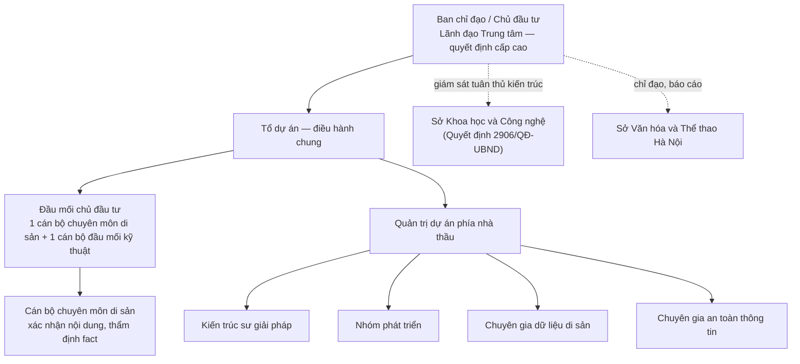
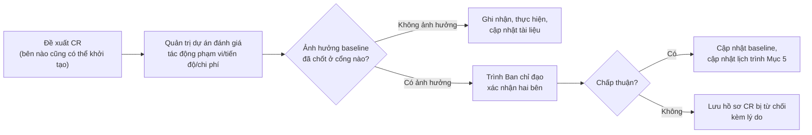

# Kế hoạch quản lý dự án

## Hệ thống quản lý dữ liệu số hóa Văn Miếu — Quốc Tử Giám

| Trường | Nội dung |
|---|---|
| Mã tài liệu | VM-DOC-13 |
| Phiên bản | 1.0.0 |
| Ngày ban hành | 12/08/2026 |
| Trạng thái | Dự thảo lập kèm hồ sơ dự thầu — chờ chủ đầu tư và nhà thầu cùng rà soát trước khi ký hợp đồng |
| Chuẩn tham chiếu | ISO/IEC/IEEE 16326:2019 (Systems and software engineering — Life cycle processes — Project management), tham chiếu quy trình vòng đời phần mềm theo ISO/IEC/IEEE 12207:2017 |
| Tài liệu liên quan | [`00-ke-hoach-nang-cap.md`](./00-ke-hoach-nang-cap.md) · [`01-thuyet-minh-ky-thuat.md`](./01-thuyet-minh-ky-thuat.md) (Chương 3, 12, 13, 14, 17, 18) · [`02-quy-trinh-bao-quan-sao-luu.md`](./02-quy-trinh-bao-quan-sao-luu.md) · [`03-ma-tran-truy-vet.md`](./03-ma-tran-truy-vet.md) · [`14-van-hanh-va-ban-giao.md`](./14-van-hanh-va-ban-giao.md) · [`16-van-de-da-biet.md`](./16-van-de-da-biet.md) · [`../CONTRIBUTING.md`](../CONTRIBUTING.md) |

---

## 1. Vai trò tài liệu và phạm vi áp dụng

Tài liệu này là **kế hoạch quản lý dự án (Project Management Plan)** cho vòng đời phát triển giai đoạn 1 của hệ thống quản lý dữ liệu số hóa Văn Miếu — Quốc Tử Giám, lập theo cấu trúc nội dung của **ISO/IEC/IEEE 16326:2019**. Tài liệu không lặp lại nội dung nghiệp vụ, kiến trúc hay pháp lý đã trình bày ở `01-thuyet-minh-ky-thuat.md` — mỗi mục chỉ tóm tắt và dẫn chiếu đúng chương/mục nguồn, phần nội dung **mới** (cổng rà soát kỹ thuật, quản lý cấu hình, quản lý thay đổi, bảng rủi ro theo góc nhìn quản lý dự án) được trình bày đầy đủ tại đây.

Các tiến trình quản lý dự án trong tài liệu này (lập kế hoạch, đánh giá tiến độ, quản lý rủi ro, quản lý cấu hình, kiểm soát thay đổi) tương ứng với nhóm **tiến trình thỏa thuận** và **tiến trình tổ chức dự án** của **ISO/IEC/IEEE 12207:2017** (Software life cycle processes) — 16326:2019 là hướng dẫn triển khai cụ thể các tiến trình quản lý được liệt kê trong 12207:2017 cho một dự án đơn lẻ. Phạm vi áp dụng là **toàn bộ giai đoạn 1** đã mô tả tại Chương 3, mục 3.3 của thuyết minh kỹ thuật; giai đoạn 2 lập kế hoạch quản lý dự án riêng khi có quyết định bố trí vốn (xem Chương 15 thuyết minh kỹ thuật).

**Đối tượng đọc:** Ban quản lý dự án phía chủ đầu tư (Trung tâm Hoạt động Văn hóa Khoa học Văn Miếu — Quốc Tử Giám), tổ giám sát của Sở Văn hóa và Thể thao Hà Nội, đơn vị tư vấn thẩm định (nếu có), quản trị dự án và kiến trúc sư giải pháp phía nhà thầu.

---

## 2. Tổ chức dự án và vai trò

### 2.1. Sơ đồ tổ chức

### 2.2. Bảng vai trò và trách nhiệm

| Vai trò | Bên | Trách nhiệm chính trong quản lý dự án |
|---|---|---|
| **Ban chỉ đạo / Chủ đầu tư** | Trung tâm | Phê duyệt phạm vi, ngân sách, mốc tiến độ; ra quyết định tại các cổng rà soát SRR/PDR/CDR/nghiệm thu; ký biên bản chuyển giai đoạn |
| **Đầu mối chuyên môn di sản** | Trung tâm | Xác nhận danh mục đối tượng di sản, số kiểm kê gốc; thẩm định nội dung fact trước khi xuất bản; đại diện Trung tâm trong UAT |
| **Đầu mối kỹ thuật** | Trung tâm | Điều phối khảo sát hạ tầng, tiếp nhận bàn giao kỹ thuật, phối hợp kiểm thử |
| **Quản trị dự án (PM)** | Nhà thầu | Lập và cập nhật kế hoạch, điều phối tiến độ, chủ trì họp giao ban, báo cáo chủ đầu tư, quản lý rủi ro và thay đổi |
| **Kiến trúc sư giải pháp** | Nhà thầu | Chịu trách nhiệm kỹ thuật tại các cổng PDR/CDR; bảo đảm thiết kế khớp yêu cầu phi chức năng Chương 5 |
| **Nhóm phát triển** | Nhà thầu | Hiện thực các đợt phát triển theo Chương 12.1; tham gia TRR |
| **Chuyên gia dữ liệu di sản** | Nhà thầu | Thiết kế mô hình siêu dữ liệu, hỗ trợ chuyển đổi và làm sạch dữ liệu (Chương 12.2), **không tự quyết định nội dung di sản** |
| **Chuyên gia an toàn thông tin** | Nhà thầu | Lập hồ sơ đề xuất cấp độ ATTT, chủ trì kiểm thử an toàn trước TRR/UAT |
| **Sở Khoa học và Công nghệ** | Cơ quan giám sát | Thẩm định tuân thủ Khung kiến trúc số TP Hà Nội trước khi triển khai (không tham gia điều hành hằng ngày) |
| **Sở Văn hóa và Thể thao Hà Nội** | Cơ quan chủ quản | Nhận báo cáo tiến độ định kỳ; phê duyệt các nội dung vượt thẩm quyền Trung tâm |

Tổ chức thực hiện chi tiết (họp giao ban, phiếu thay đổi) xem thêm Chương 12.4 thuyết minh kỹ thuật.

---

## 3. Phạm vi và sản phẩm bàn giao

### 3.1. Phạm vi

Phạm vi quản lý của kế hoạch này là **giai đoạn 1 — Kho dữ liệu và quy trình**, gồm nhóm chức năng CN-01 đến CN-15 và chỉ tiêu phi chức năng PCN-01 đến PCN-15 (Chương 3–5, `01-thuyet-minh-ky-thuat.md`). Phạm vi giai đoạn 2 (cổng khai thác công chúng, đa ngữ đầy đủ, nhận dạng Hán Nôm, IIIF, mở API nghiên cứu) **không thuộc kế hoạch này** — xem Chương 15 mục 15.3 về điều kiện chuyển giai đoạn.

### 3.2. Sản phẩm bàn giao theo từng đợt

Bảng dưới rút gọn từ Chương 12.1 thuyết minh kỹ thuật, chỉ giữ lại cột phục vụ kiểm soát tiến độ và làm căn cứ nghiệm thu từng đợt:

| Đợt | Hạng mục | Sản phẩm bàn giao | Cổng rà soát gắn kèm |
|---|---|---|---|
| 1 | Khởi động và khảo sát | Báo cáo khảo sát; danh mục đối tượng di sản có xác nhận chuyên môn | — |
| 2 | Thiết kế chi tiết | Tài liệu thiết kế; đặc tả OpenAPI; hồ sơ đề xuất cấp độ an toàn | **SRR → PDR → CDR** |
| 3 | Phát triển đợt 1 | Bản dựng kiểm thử nội bộ đợt 1 (kho dữ liệu, mã định danh, siêu dữ liệu, nhập liệu, tìm kiếm) | — |
| 4 | Phát triển đợt 2 | Bản dựng kiểm thử nội bộ đợt 2 (duyệt, ký số, phiên bản, bộ sưu tập, hồ sơ đối tượng di sản) | — |
| 5 | Phát triển đợt 3 | Bản dựng kiểm thử nội bộ đợt 3 (báo cáo, kiểm kê, người dùng, nhật ký, sao lưu, tuân thủ) | — |
| 6 | Kết nối và chia sẻ | Hồ sơ đăng ký kết nối; biên bản kết nối thử với nền tảng tích hợp Thành phố | — |
| 7 | Chuyển đổi và làm sạch dữ liệu | Báo cáo chuyển đổi; danh sách trường còn thiếu theo hàng đợi mã khuyết giá trị | — |
| 8 | Kiểm thử | Báo cáo kiểm thử và biên bản khắc phục (đơn vị, tích hợp, hiệu năng, an toàn, trợ năng, chuyển đổi dữ liệu) | **TRR** |
| 9 | Nghiệm thu người dùng | Biên bản nghiệm thu người dùng theo từng kịch bản nghiệp vụ | **UAT** |
| 10 | Đào tạo và vận hành thử | Biên bản đào tạo; nhật ký vận hành thử | — |
| 11 | Nghiệm thu và bàn giao | Biên bản nghiệm thu tổng thể; bộ hồ sơ bàn giao (Mục 6, `14-van-hanh-va-ban-giao.md`) | **Nghiệm thu tổng thể** |

Danh mục tài liệu bàn giao đầy đủ (8 loại) và cam kết chuyển giao xem Chương 13.2–13.3 thuyết minh kỹ thuật, được trình bày dưới dạng danh mục vận hành tại `14-van-hanh-va-ban-giao.md` mục 7.

---

## 4. Các cổng rà soát kỹ thuật (Technical Reviews)

Sáu cổng rà soát dưới đây áp dụng nguyên tắc của ISO/IEC/IEEE 16326:2019 (technical reviews as decision gates): mỗi cổng chỉ được coi là **đã qua** khi có đầy đủ hồ sơ đầu vào, đạt tiêu chí thông qua, và có chữ ký của người quyết định — không có khái niệm "thông qua có điều kiện" mà không ghi rõ điều kiện và hạn khắc phục.

### 4.1. SRR — System/Software Requirements Review (Rà soát yêu cầu)

| Mục | Nội dung |
|---|---|
| Thời điểm | Cuối Đợt 2 — Thiết kế chi tiết, trước khi bắt đầu Đợt 3 phát triển |
| Đầu vào | Tài liệu yêu cầu chức năng CN-01–CN-15 và phi chức năng PCN-01–PCN-15 (Chương 4–5); danh mục đối tượng di sản đã xác nhận chuyên môn (Đợt 1); ma trận truy vết `03-ma-tran-truy-vet.md` |
| Tiêu chí thông qua | Mỗi yêu cầu CN/PCN có tiêu chí nghiệm thu đo được; không còn yêu cầu mơ hồ hoặc thiếu chủ sở hữu nghiệp vụ; danh mục đối tượng di sản đã có xác nhận ký của cán bộ chuyên môn Trung tâm |
| Người quyết định | Đầu mối chuyên môn di sản và đầu mối kỹ thuật (phía chủ đầu tư), đồng ký cùng quản trị dự án nhà thầu |
| Hồ sơ để lại | Biên bản SRR; bảng yêu cầu đã chốt (baseline); danh sách vấn đề mở kèm hạn xử lý |

### 4.2. PDR — Preliminary Design Review (Rà soát thiết kế sơ bộ)

| Mục | Nội dung |
|---|---|
| Thời điểm | Giữa Đợt 2, sau khi có kiến trúc bốn lớp và mô hình dữ liệu mức khái niệm |
| Đầu vào | Sơ đồ kiến trúc bốn lớp (Chương 6.3); mô hình dữ liệu hai trục phân loại và hệ mã định danh 5 tầng (Chương 7.1–7.3, `07-mo-hinh-du-lieu.md`); bản đồ màn hình (Chương 8.2); hồ sơ đề xuất cấp độ an toàn sơ bộ (Chương 9.1) |
| Tiêu chí thông qua | Kiến trúc đáp ứng yêu cầu phi chức năng PCN-01–PCN-06 (hiệu năng, mở rộng); không phụ thuộc dịch vụ ngoài lãnh thổ (Chương 5.5); mô hình dữ liệu đã tách đúng hai trục phân loại và không còn trường mã hóa thuộc tính vào định danh (mục 0quater, `00-ke-hoach-nang-cap.md`) |
| Người quyết định | Kiến trúc sư giải pháp trình bày; đầu mối kỹ thuật chủ đầu tư và quản trị dự án cùng thông qua |
| Hồ sơ để lại | Biên bản PDR; bản thiết kế sơ bộ đã chốt; danh sách rủi ro kỹ thuật phát sinh chuyển vào Mục 8 |

### 4.3. CDR — Critical Design Review (Rà soát thiết kế chi tiết)

| Mục | Nội dung |
|---|---|
| Thời điểm | Cuối Đợt 2, ngay trước khi mở Đợt 3 phát triển |
| Đầu vào | Đặc tả OpenAPI đầy đủ (`06-dac-ta-api.md`); từ điển dữ liệu và ERD đầy đủ 22+5 bảng (`07-mo-hinh-du-lieu.md`); thiết kế giao diện chi tiết cho toàn bộ bản đồ màn hình; hồ sơ tuân thủ Khung kiến trúc số TP Hà Nội |
| Tiêu chí thông qua | Mọi endpoint API có ánh xạ tới yêu cầu CN tương ứng; mọi bảng dữ liệu có khóa và ràng buộc toàn vẹn rõ ràng; thiết kế đã qua thẩm định tuân thủ của Sở Khoa học và Công nghệ (hoặc đã nộp hồ sơ thẩm định và có lịch trả kết quả) |
| Người quyết định | Ban chỉ đạo (chủ đầu tư), có ý kiến chuyên môn của Sở Khoa học và Công nghệ về tuân thủ kiến trúc |
| Hồ sơ để lại | Biên bản CDR; thiết kế chi tiết đã chốt (baseline dùng cho phát triển); biên bản/công văn thẩm định của Sở KH&CN nếu đã có |

### 4.4. TRR — Test Readiness Review (Sẵn sàng kiểm thử)

| Mục | Nội dung |
|---|---|
| Thời điểm | Cuối Đợt 7 (chuyển đổi và làm sạch dữ liệu), trước khi vào Đợt 8 Kiểm thử |
| Đầu vào | Bản dựng hoàn chỉnh 3 đợt phát triển; kế hoạch kiểm thử theo bảng Chương 12.3 (đơn vị, tích hợp, hiệu năng, an toàn, trợ năng, chuyển đổi dữ liệu, UAT); báo cáo chuyển đổi dữ liệu và danh sách trường còn thiếu |
| Tiêu chí thông qua | Không còn lỗi chặn (blocker) đã biết; môi trường kiểm thử đã tách biệt dữ liệu thật (Chương 9.3); bộ kiểm thử tự động chạy được trên máy chủ tích hợp; kịch bản kiểm thử đã được đầu mối chuyên môn và đầu mối kỹ thuật chủ đầu tư xác nhận đủ bao phủ nghiệp vụ |
| Người quyết định | Quản trị dự án nhà thầu đề xuất; đầu mối kỹ thuật chủ đầu tư thông qua |
| Hồ sơ để lại | Biên bản TRR; kế hoạch kiểm thử đã chốt; danh sách rủi ro còn tồn khi vào kiểm thử |

### 4.5. UAT — User Acceptance Testing (Nghiệm thu người dùng)

| Mục | Nội dung |
|---|---|
| Thời điểm | Đợt 9, sau khi Đợt 8 Kiểm thử đạt tiêu chí Chương 12.3 |
| Đầu vào | Báo cáo kiểm thử và biên bản khắc phục của Đợt 8; kịch bản nghiệp vụ theo từng vai trò (Chuyên viên, Biên tập, Phê duyệt/Lãnh đạo, Quản trị); tài khoản demo cho từng vai trò |
| Tiêu chí thông qua | Có biên bản ký của người dùng đại diện **từng vai trò** (không chỉ một đại diện chung); không còn lỗi mức nghiêm trọng hoặc cao (theo phân loại SLA tại `14-van-hanh-va-ban-giao.md` mục 4) chưa khắc phục |
| Người quyết định | Đại diện người dùng từng vai trò (phía Trung tâm) ký từng kịch bản; Ban chỉ đạo tổng hợp thông qua |
| Hồ sơ để lại | Biên bản nghiệm thu người dùng theo từng kịch bản; danh sách lỗi mức thấp/trung bình chuyển sang giai đoạn bảo hành |

### 4.6. Nghiệm thu tổng thể

| Mục | Nội dung |
|---|---|
| Thời điểm | Đợt 11, sau Đợt 10 Đào tạo và vận hành thử |
| Đầu vào | Toàn bộ biên bản của 5 cổng trước; biên bản đào tạo; nhật ký vận hành thử; bộ hồ sơ bàn giao (Mục 6, `14-van-hanh-va-ban-giao.md`) |
| Tiêu chí thông qua | Đạt toàn bộ tiêu chí CN-01–CN-15 và PCN-01–PCN-15 (cam kết mục 1, Chương 18); hạng mục kết nối, chia sẻ dữ liệu đã hoàn thành (Điều 24 Nghị định 278/2025/NĐ-CP); không còn lỗ hổng an toàn mức cao/nghiêm trọng chưa khắc phục |
| Người quyết định | Hội đồng nghiệm thu (Ban chỉ đạo chủ đầu tư, có thể mời Sở Văn hóa và Thể thao Hà Nội) |
| Hồ sơ để lại | Biên bản nghiệm thu tổng thể; bộ hồ sơ bàn giao đầy đủ; mốc bắt đầu tính thời hạn bảo hành 12 tháng |

---

## 5. Lịch trình theo giai đoạn

Lịch trình chi tiết theo tuần (dạng thanh ngang, Gantt) được lập tại bước ký hợp đồng, khi đã có ngày khởi động chính thức — **không đưa số tuần cụ thể vào đây** để tránh cam kết một mốc chưa có căn cứ hợp đồng. Khung trình tự 11 đợt và ràng buộc phụ thuộc giữa các đợt lấy nguyên từ bảng Mục 3.2; ba nguyên tắc lập lịch bắt buộc:

1. **Đợt 7 (chuyển đổi, làm sạch dữ liệu) không được rút gọn hoặc chạy song song ẩn với Đợt 3–5** — đây là hạng mục hay bị bỏ sót nêu tại Chương 12.2 thuyết minh kỹ thuật, cần thời gian riêng có sản phẩm bàn giao riêng.
2. **Đợt 6 (kết nối, chia sẻ) phải khởi động sớm**, ngay sau CDR, không chờ đến gần cuối dự án — vì mốc hoàn thành kết nối **trước 31/12/2026** theo Điều 24 Nghị định 278/2025/NĐ-CP là mốc cứng, không đàm phán được (rủi ro R-03, Mục 8).
3. Mỗi cổng rà soát ở Mục 4 là **điểm kiểm soát bắt buộc** trên lịch trình — không cho phép đợt kế tiếp bắt đầu khi cổng liền trước chưa có biên bản thông qua.

> **Bảng điền khi ký hợp đồng — đơn vị điền:**

| Đợt | Tuần bắt đầu | Tuần kết thúc | Phụ thuộc |
|---|---|---|---|
| 1. Khởi động và khảo sát | Đơn vị điền | Đơn vị điền | — |
| 2. Thiết kế chi tiết (SRR → PDR → CDR) | Đơn vị điền | Đơn vị điền | Đợt 1 |
| 3–5. Phát triển đợt 1–3 | Đơn vị điền | Đơn vị điền | CDR |
| 6. Kết nối và chia sẻ | Đơn vị điền | Đơn vị điền | CDR (khởi động song song Đợt 3–5) |
| 7. Chuyển đổi và làm sạch dữ liệu | Đơn vị điền | Đơn vị điền | Đợt 5 |
| 8. Kiểm thử (TRR) | Đơn vị điền | Đơn vị điền | Đợt 7 |
| 9. Nghiệm thu người dùng (UAT) | Đơn vị điền | Đơn vị điền | Đợt 8 |
| 10. Đào tạo và vận hành thử | Đơn vị điền | Đơn vị điền | Đợt 9 |
| 11. Nghiệm thu và bàn giao | Đơn vị điền | Đơn vị điền | Đợt 10, Đợt 6 |

---

## 6. Quản lý cấu hình và phiên bản

### 6.1. Đánh số phiên bản (SemVer)

Sản phẩm phần mềm và tài liệu đi kèm đánh số theo **Semantic Versioning 2.0.0** dạng `MAJOR.MINOR.PATCH`:

| Thành phần | Tăng khi |
|---|---|
| `MAJOR` | Thay đổi phá vỡ tương thích API/schema dữ liệu đã công bố, hoặc thay đổi lớn về phạm vi nghiệp vụ (ví dụ chuyển sang giai đoạn 2) |
| `MINOR` | Bổ sung tính năng mới, tương thích ngược (ví dụ thêm CN-xx mới, thêm màn hình) |
| `PATCH` | Sửa lỗi, hiệu chỉnh không đổi hành vi API/schema đã công bố |

Bản nghiệm thu giai đoạn 1 mang số **1.0.0**. Trong thời gian bảo hành, bản vá phát hành dưới dạng `1.0.x`; tính năng bổ sung theo hợp đồng bảo trì phát hành dưới dạng `1.x.0`. Mọi tài liệu trong `docs/` mang số phiên bản riêng, đồng bộ theo cùng quy tắc, cập nhật độc lập với số phiên bản phần mềm khi chỉ tài liệu thay đổi.

### 6.2. Quy ước nhánh mã nguồn

| Nhánh | Vai trò |
|---|---|
| `main` | Nhánh ổn định, luôn phản ánh bản đã qua ít nhất một cổng rà soát; chỉ nhận merge qua pull request đã review |
| `develop` | Nhánh tích hợp giữa các đợt phát triển (Đợt 3–5) |
| `feature/<mã-CN>-<mô-tả-ngắn>` | Nhánh phát triển một yêu cầu chức năng, ví dụ `feature/cn09-kiem-ke-dinh-ky` |
| `fix/<mô-tả-ngắn>` | Nhánh sửa lỗi phát hiện trong kiểm thử hoặc bảo hành |
| `release/<version>` | Nhánh đóng băng phạm vi chuẩn bị cho một cổng rà soát hoặc bản phát hành |

Chi tiết quy trình nhánh, quy ước commit và Definition of Done xem `../CONTRIBUTING.md`.

---

## 7. Quản lý thay đổi (Change Request)

### 7.1. Nguyên tắc

Sau khi một cổng rà soát (Mục 4) đã thông qua, phạm vi tương ứng trở thành **baseline** — mọi thay đổi phạm vi, thiết kế đã chốt hoặc tiến độ đều phải qua **phiếu thay đổi (Change Request — CR)** có xác nhận hai bên, đúng nguyên tắc đã nêu tại Chương 12.4 thuyết minh kỹ thuật. Không có thay đổi "ngầm hiểu" chỉ trao đổi qua trò chuyện không văn bản.

### 7.2. Quy trình xử lý một CR

### 7.3. Bảng ghi nhận CR (mẫu)

| Mã CR | Ngày đề xuất | Nội dung | Tác động | Quyết định | Người xác nhận hai bên | Ngày |
|---|---|---|---|---|---|---|
| CR-001 | Đơn vị điền | Đơn vị điền | Đơn vị điền | Đơn vị điền | Đơn vị điền | Đơn vị điền |

---

## 8. Bảng rủi ro dự án

Bảng dưới dùng **cùng mã R-xx** với Chương 17 thuyết minh kỹ thuật để hai tài liệu tra chéo được trực tiếp — đây là góc nhìn **quản lý dự án** (ai theo dõi, biện pháp thuộc trách nhiệm điều hành), Chương 17 là góc nhìn **kỹ thuật/giải pháp**. Xác suất và tác động đánh giá theo thang Thấp / Trung bình / Cao / Rất cao.

| Mã | Rủi ro | Xác suất | Tác động | Biện pháp giảm thiểu | Người chịu trách nhiệm |
|---|---|---|---|---|---|
| **R-01** | **Dữ liệu di sản bị gán sai thông tin** (niên đại, vị trí, tên gọi, can chi) | Trung bình | **Rất cao** — mất uy tín chuyên môn toàn bộ hệ thống trước hội đồng và công chúng | Bắt buộc mọi bản ghi qua bước thẩm định và ký xác nhận của cán bộ chuyên môn Trung tâm trước khi xuất bản (không để nhà thầu tự quyết định nội dung di sản); song thẩm với tư liệu Hán Nôm; dùng mã khuyết giá trị thay suy đoán; đối chiếu với `PL8` — danh mục thông tin di sản đã đối chiếu nguồn; đưa vào tiêu chí thông qua SRR và UAT | Đầu mối chuyên môn di sản (Trung tâm) chủ trì nội dung; quản trị dự án nhà thầu bảo đảm quy trình chặn xuất bản khi chưa có xác nhận |
| **R-05** | **Văn bản pháp lý thay đổi trong thời gian thực hiện dự án** | **Cao** — khung pháp lý về dữ liệu, BVDLCN, ATTT đang trong giai đoạn ban hành dày đặc năm 2025–2026 | Trung bình — có thể phải điều chỉnh cấu hình tuân thủ, không ảnh hưởng kiến trúc lõi | Sổ đăng ký tuân thủ (`08-tuan-thu-quan-tri-du-lieu` — hub B8) có trạng thái "Chờ văn bản hướng dẫn" và ngày rà soát kế tiếp; lớp ánh xạ dữ liệu tách riêng khỏi lõi nghiệp vụ; rà soát hồ sơ pháp lý bắt buộc lại **tại thời điểm ký hợp đồng và tại thời điểm nghiệm thu** (cam kết mục 6, Chương 18); CR áp dụng khi thay đổi vượt phạm vi cấu hình | Quản trị dự án phối hợp cán bộ đầu mối bảo vệ dữ liệu cá nhân (DPO) |
| R-02 | Tiến độ trễ do phụ thuộc phê duyệt liên thông (cấp độ ATTT, thẩm định kiến trúc) | Trung bình | Cao | Nộp hồ sơ đề xuất cấp độ và hồ sơ thẩm định kiến trúc ngay sau CDR, không chờ gần mốc nghiệm thu; theo dõi tiến độ phê duyệt như một mục riêng trong báo cáo tuần | Quản trị dự án |
| R-03 | **Chậm mốc kết nối, chia sẻ 31/12/2026** | Trung bình | Cao | Đưa Đợt 6 lên sớm ngay sau CDR (Mục 5, nguyên tắc 2); phối hợp Sở KH&CN và Sở VH&TT từ đầu dự án | Ban chỉ đạo và quản trị dự án |
| R-11 | Dữ liệu hiện có của Trung tâm không đủ chất lượng để chuyển đổi đúng lịch Đợt 7 | Cao | Trung bình | Tách Đợt 7 thành công việc riêng có sản phẩm bàn giao riêng (Mục 3.2); gán mã khuyết giá trị và đưa vào hàng đợi thay vì chặn toàn bộ tiến độ; không cho Đợt 8 bắt đầu khi chưa có báo cáo đối soát | Trung tâm (nguồn dữ liệu) và nhà thầu (quy trình) |
| R-12 | Thiếu nhân sự đầu mối phía Trung tâm hoặc nhân sự thay đổi giữa dự án | Cao | Trung bình | Yêu cầu tối thiểu 2 đầu mối cố định (Mục 2.2) xuyên suốt dự án; bàn giao tri thức bằng biên bản họp, không chỉ trao đổi miệng; đào tạo lại khi có thay đổi nhân sự (Chương 13.1) | Ban chỉ đạo (Trung tâm) |

Danh mục rủi ro kỹ thuật/giải pháp đầy đủ (R-01 đến R-15, gồm cả rủi ro hư hỏng dữ liệu, mã độc tống tiền, phụ thuộc nhà thầu, định dạng gaussian splat lỗi thời) xem Chương 17, `01-thuyet-minh-ky-thuat.md`. Rủi ro mới phát sinh trong quá trình triển khai được thêm vào cả hai bảng, đánh số tiếp theo `R-16` trở đi, ghi nhận tại cuộc họp giao ban gần nhất.

---

## 9. Quản lý chất lượng

### 9.1. Cơ chế bảo đảm chất lượng theo lớp

| Lớp | Cơ chế | Tần suất |
|---|---|---|
| Mã nguồn | Kiểm tra kiểu tĩnh (`tsc --noEmit`), lint (`oxlint`), build không lỗi | Mỗi lần mở pull request (xem Definition of Done, `../CONTRIBUTING.md`) |
| Chức năng | Bộ kiểm thử tự động (`npm test`), kiểm thử tích hợp theo Chương 12.3 | Mỗi đợt phát triển; đầy đủ trước TRR |
| Phi chức năng | Kiểm thử hiệu năng theo PCN-01–PCN-06, kiểm thử trợ năng WCAG 2.1 AA | Đợt 8, lặp lại nếu có CR ảnh hưởng |
| An toàn thông tin | Quét lỗ hổng, kiểm thử xâm nhập, kiểm thử phân quyền và tính bất biến nhật ký (Chương 9.8) | Trước TRR; định kỳ hằng năm sau nghiệm thu (Chương 16.1 mục 11) |
| Dữ liệu | Đối soát số lượng, dung lượng, checksum giữa nguồn và hệ thống sau nhập lô (Chương 12.2 bước 4) | Mỗi đợt chuyển đổi dữ liệu |
| Nội dung di sản | Thẩm định chuyên môn và song thẩm Hán Nôm trước xuất bản (rủi ro R-01) | Mỗi bản ghi trước khi qua trạng thái "Đã xuất bản" |

### 9.2. Tiêu chí "Đạt" chung

Một hạng mục chỉ được đánh dấu hoàn thành khi: *(một)* đạt tiêu chí nghiệm thu đã ghi trong yêu cầu CN/PCN tương ứng; *(hai)* không còn lỗi mức chặn (blocker) hoặc mức cao chưa xử lý; *(ba)* đã cập nhật tài liệu liên quan (không để tài liệu lạc hậu so với mã nguồn — xem quy tắc viết tài liệu, `../CONTRIBUTING.md`). Không có khái niệm "coi như đạt" khi thiếu một trong ba điều kiện.

---

## 10. Truyền thông và báo cáo tiến độ với chủ đầu tư

### 10.1. Kênh và tần suất

| Kênh | Tần suất | Nội dung | Người chủ trì |
|---|---|---|---|
| Họp giao ban tiến độ | Hằng tuần, có biên bản | Tiến độ theo đợt, vướng mắc, quyết định cần chủ đầu tư | Quản trị dự án nhà thầu (Chương 12.4) |
| Báo cáo cổng rà soát | Tại mỗi cổng SRR/PDR/CDR/TRR/UAT/nghiệm thu | Biên bản và hồ sơ để lại theo Mục 4 | Quản trị dự án nhà thầu, ký cùng đầu mối chủ đầu tư |
| Báo cáo hỗ trợ sau nghiệm thu | Hằng quý (giai đoạn bảo hành) | Tổng hợp tình hình hỗ trợ theo mức SLA (Chương 14.2) | Nhà thầu, gửi chủ đầu tư |
| Báo cáo tuân thủ, sự cố | Theo quy trình 72 giờ và các mốc luật định (Chương 9.6–9.7) | Sự cố dữ liệu cá nhân, rà soát tuân thủ | DPO, theo quy trình `../SECURITY.md`; hướng dẫn và phân công trách nhiệm tra cứu tại màn Trợ giúp & tra cứu |
| Báo cáo lên Sở Văn hóa và Thể thao Hà Nội | Định kỳ theo quy chế chủ quản; đột xuất khi có sự cố mức Nghiêm trọng/Cao | Tổng hợp tiến độ, tuân thủ, sự cố | Ban chỉ đạo (Trung tâm) |

### 10.2. Nguyên tắc báo cáo

Báo cáo tiến độ **không dùng tỷ lệ phần trăm cảm tính** — mỗi mục tiến độ neo vào một sản phẩm bàn giao cụ thể ở Mục 3.2 hoặc một cổng rà soát ở Mục 4 đã/chưa thông qua. Vướng mắc và rủi ro mới phát sinh được báo cáo ngay tại cuộc họp gần nhất, không dồn đến cuối đợt — nguyên tắc này áp dụng trực tiếp cho rủi ro R-01 và R-05 vì cả hai đều có thể phát sinh liên tục trong suốt vòng đời dự án, không chỉ tại một thời điểm cố định.

---

*Hết tài liệu. Xem `14-van-hanh-va-ban-giao.md` cho giai đoạn sau nghiệm thu và `16-van-de-da-biet.md` cho hạn chế đã biết của bản 1.0.0.*
