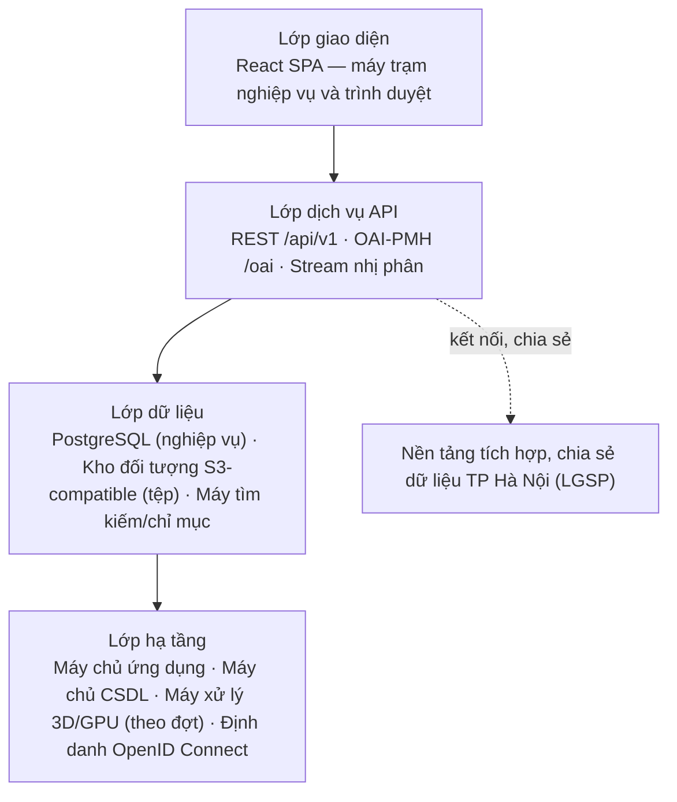
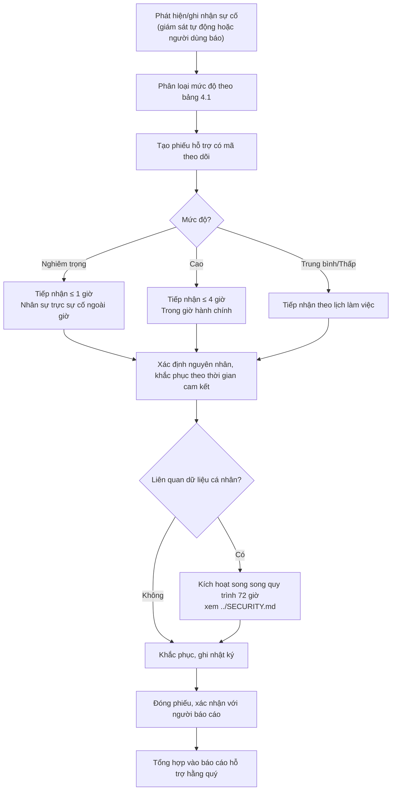
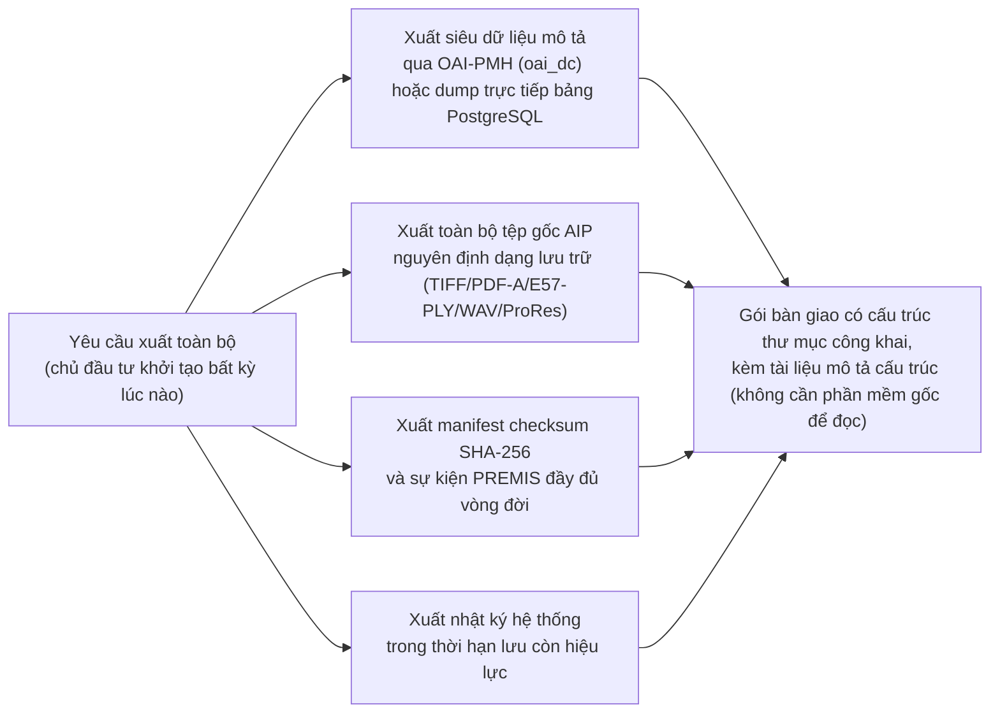

# Sổ tay vận hành và kế hoạch chuyển giao

## Hệ thống quản lý dữ liệu số hóa Văn Miếu — Quốc Tử Giám

| Trường | Nội dung |
|---|---|
| Mã tài liệu | VM-DOC-14 |
| Phiên bản | 1.0.0 |
| Ngày ban hành | 12/08/2026 |
| Trạng thái | Dự thảo lập kèm hồ sơ dự thầu — hoàn thiện thành sổ tay vận hành chính thức tại Đợt 11 (Nghiệm thu và bàn giao) |
| Tài liệu liên quan | [`00-ke-hoach-nang-cap.md`](./00-ke-hoach-nang-cap.md) · [`01-thuyet-minh-ky-thuat.md`](./01-thuyet-minh-ky-thuat.md) (Chương 6, 9, 10, 11, 13, 14) · [`02-quy-trinh-bao-quan-sao-luu.md`](./02-quy-trinh-bao-quan-sao-luu.md) · [`13-ke-hoach-quan-ly-du-an.md`](./13-ke-hoach-quan-ly-du-an.md) · [`16-van-de-da-biet.md`](./16-van-de-da-biet.md) |

---

## 1. Mục đích và phạm vi

Tài liệu này là **sổ tay vận hành (runbook)** dùng sau khi hệ thống đã nghiệm thu, kết hợp **kế hoạch chuyển giao** cho giai đoạn bàn giao và thời gian đầu vận hành độc lập của Trung tâm. Tài liệu phục vụ trực tiếp: quản trị hệ thống của Trung tâm, cán bộ đầu mối dữ liệu, cán bộ bảo quản số, và nhân sự hỗ trợ của nhà thầu trong thời gian bảo hành. Nội dung nghiệp vụ, kiến trúc và pháp lý chi tiết đã trình bày ở `01-thuyet-minh-ky-thuat.md` và `02-quy-trinh-bao-quan-sao-luu.md` — tài liệu này **tóm tắt phần cần tra cứu nhanh khi vận hành** và bổ sung nội dung chưa có ở đâu khác: SLA sự cố theo mức độ, chỉ số giám sát gộp, lịch định kỳ hợp nhất, kế hoạch đào tạo theo 4 nhóm người dùng, danh mục bàn giao, và kế hoạch thoát phụ thuộc nhà cung cấp.

---

## 2. Kiến trúc triển khai và yêu cầu hạ tầng tối thiểu

### 2.1. Kiến trúc bốn lớp (tóm tắt)

Chi tiết đầy đủ sơ đồ bốn lớp, luồng tích hợp và kiến trúc lưu trữ ba tầng: Chương 6, `01-thuyet-minh-ky-thuat.md`.

### 2.2. Hạ tầng tối thiểu (rút gọn từ Chương 10.1)

| Thành phần | Cấu hình tối thiểu | Ghi chú vận hành |
|---|---|---|
| Máy chủ ứng dụng | 8 vCPU / 16 GB RAM / 200 GB SSD | Nên 2 nút để chịu lỗi |
| Máy chủ cơ sở dữ liệu | 8 vCPU / 32 GB RAM / 500 GB SSD | PostgreSQL; theo dõi dung lượng chỉ mục |
| Máy chủ chỉ mục tìm kiếm | 4 vCPU / 16 GB RAM / 200 GB SSD | Có thể chạy chung máy chủ ứng dụng ở quy mô ban đầu |
| Máy xử lý 3D/gaussian splat | 8 vCPU / 32 GB RAM / GPU ≥ 16 GB VRAM | Chỉ chạy theo đợt xử lý, không thường trực |
| Kho đối tượng — nóng/ấm | Theo dự báo Chương 10.3 × 1,5 | Hỗ trợ chế độ chỉ ghi một lần cho bản gốc |
| Kho lưu trữ lạnh/sao lưu | ≥ 2 lần dung lượng tầng nóng | Đặt tại địa điểm địa lý thứ hai |
| Đường truyền | ≥ 100 Mbps đối xứng | Cần cho tải lên tệp lớn và đồng bộ sao lưu |

Phương án đặt hệ thống khuyến nghị: **Trung tâm dữ liệu thành phố Hà Nội** (Chương 10.2). Trong mọi phương án, **dữ liệu không rời lãnh thổ Việt Nam**.

---

## 3. Quy trình cài đặt, cấu hình, nâng cấp, khôi phục

### 3.1. Cài đặt lần đầu

1. Chuẩn bị hạ tầng theo Mục 2.2; xác nhận kết nối mạng nội bộ và đường ra nền tảng tích hợp Thành phố.
2. Triển khai theo kịch bản dựng và kịch bản triển khai bàn giao cùng mã nguồn (Mục 6, hạng mục 5).
3. Khởi tạo cơ sở dữ liệu từ script di trú (migration) phiên bản đang bàn giao; nạp dữ liệu đã chuyển đổi và làm sạch (Chương 12.2).
4. Cấu hình định danh OpenID Connect, chính sách mật khẩu, xác thực hai yếu tố bắt buộc cho vai trò Quản trị và Phê duyệt (Chương 9.2).
5. Khởi tạo tối thiểu **hai tài khoản quản trị** độc lập (không dùng chung) trước khi bàn giao vận hành chính thức.
6. Chạy kiểm thử khói (smoke test) theo kịch bản UAT đã ký; xác nhận nhật ký hệ thống ghi nhận đúng.

### 3.2. Cấu hình vận hành

Cấu hình tách khỏi mã nguồn (biến môi trường/tệp cấu hình riêng) theo đúng cam kết chống khóa nhà cung cấp — bao gồm: chuỗi kết nối cơ sở dữ liệu và kho đối tượng, tham số cấp phát khóa API, thời hạn lưu nhật ký (mặc định 12 tháng, xem Chương 9.6), tham số kết nối nền tảng tích hợp Thành phố, cấu hình gửi cảnh báo giám sát (Mục 5).

### 3.3. Nâng cấp phiên bản

1. Xác định số phiên bản đích theo quy tắc SemVer (`13-ke-hoach-quan-ly-du-an.md` mục 6.1).
2. Sao lưu đầy đủ trước nâng cấp (không nâng cấp khi chưa có điểm khôi phục đã xác minh — Mục 4, `02-quy-trinh-bao-quan-sao-luu.md`).
3. Áp dụng script di trú cơ sở dữ liệu theo thứ tự phiên bản, không bỏ qua bước trung gian.
4. Chạy lại bộ kiểm thử tự động; xác nhận không có hồi quy (regression) trên các kịch bản nghiệp vụ chính.
5. Thông báo cửa sổ bảo trì trước cho người dùng (Chương 10.4); ghi nhận vào nhật ký thay đổi hệ thống.
6. Nếu nâng cấp gây lỗi không khắc phục được trong cửa sổ bảo trì, khôi phục về điểm sao lưu trước nâng cấp — không để hệ thống ở trạng thái nửa vời qua giờ làm việc kế tiếp.

### 3.4. Khôi phục sau sự cố

Quy trình khôi phục đầy đủ theo bốn kịch bản (xóa nhầm, hỏng đĩa, hỏng trung tâm dữ liệu, ransomware), sơ đồ luồng và bảng RACI: Mục 6, `02-quy-trinh-bao-quan-sao-luu.md`. Cam kết RPO ≤ 24 giờ, RTO ≤ 4 giờ áp dụng cho mọi kịch bản trừ ransomware (RTO có thể kéo dài tùy phạm vi điều tra).

---

## 4. Xử lý sự cố phân theo mức độ nghiêm trọng — SLA

### 4.1. Bảng mức độ và cam kết dịch vụ

Bảng dưới lấy nguyên từ Chương 14.2 thuyết minh kỹ thuật — đây là **cam kết hợp đồng của nhà thầu trong thời gian bảo hành**; sau bảo hành áp dụng khi có hợp đồng bảo trì (Mục 8).

| Mức sự cố | Định nghĩa | Ví dụ tại hệ thống này | Thời gian tiếp nhận | Thời gian khắc phục |
|---|---|---|---|---|
| **Nghiêm trọng** | Hệ thống dừng hoạt động; mất hoặc hỏng dữ liệu; lộ lọt dữ liệu | Không đăng nhập được toàn hệ thống; phát hiện checksum AIP lệch không tự phục hồi được; nghi vấn rò rỉ dữ liệu cá nhân | ≤ 1 giờ | ≤ 4 giờ |
| **Cao** | Chức năng chính không dùng được | Không tải lên được, không duyệt/xuất bản được, kết nối chia sẻ dữ liệu với Thành phố gián đoạn | ≤ 4 giờ | ≤ 1 ngày làm việc |
| **Trung bình** | Lỗi cục bộ, có phương án thay thế tạm thời | Một bộ lọc tìm kiếm sai kết quả, một biểu đồ báo cáo hiển thị lệch | ≤ 1 ngày làm việc | ≤ 5 ngày làm việc |
| **Thấp** | Lỗi hiển thị, đề nghị cải thiện nhỏ | Lỗi căn chỉnh giao diện, đề nghị đổi nhãn | ≤ 2 ngày làm việc | Theo đợt cập nhật định kỳ |

### 4.2. Quy trình xử lý sự cố

### 4.3. Kênh tiếp nhận và trực

Kênh tiếp nhận: đường dây nóng, thư điện tử, hệ thống ghi nhận yêu cầu hỗ trợ có mã phiếu để chủ đầu tư theo dõi tiến độ. Nhân sự nhà thầu trực trong giờ hành chính; trực sự cố mức Nghiêm trọng ngoài giờ trong suốt thời gian bảo hành. Báo cáo tổng hợp tình hình hỗ trợ gửi chủ đầu tư **hằng quý** (Chương 14.2). Liên hệ báo cáo lỗ hổng an toàn thông tin xem `../SECURITY.md`.

---

## 5. Giám sát và cảnh báo

### 5.1. Chỉ số hạ tầng và vận hành

| Chỉ số | Ngưỡng cảnh báo | Kênh cảnh báo |
|---|---|---|
| Dung lượng theo từng tầng lưu trữ (nóng/AIP/lạnh) | Cảnh báo khi > 85% | Thư điện tử/kênh nhắn tin nội bộ (Chương 10.4) |
| Tải và độ trễ máy chủ ứng dụng, cơ sở dữ liệu | Vượt ngưỡng cấu hình theo PCN-01–PCN-06 | Tự động qua hệ giám sát hạ tầng |
| Tác vụ nền thất bại (sinh bản dẫn xuất, đóng gói AIP, đồng bộ off-site) | Bất kỳ lần thất bại nào | Cảnh báo tức thời tới Quản trị hệ thống |
| Đồng hồ hệ thống lệch nguồn thời gian chuẩn | Bất kỳ độ lệch nào ảnh hưởng đối chiếu nhật ký | Tự động |

### 5.2. Chỉ số bảo quản số và toàn vẹn (từ `02-quy-trinh-bao-quan-sao-luu.md` Mục 9)

| Chỉ số | Mục tiêu |
|---|---|
| % dữ liệu số hóa có checksum hợp lệ (fixity gần nhất) | ≥ 99,5% |
| Tuổi bản sao lưu mới nhất | ≤ 24 giờ (khớp RPO) |
| Kết quả diễn tập khôi phục gần nhất | Đạt, RTO thực đo ≤ 4 giờ |
| Số sự cố fixity phát hiện trong kỳ | 100% đã khắc phục trong kỳ |
| Số bản ghi dữ liệu số hóa ở trạng thái "Cần số hóa lại" | Giảm dần theo thời gian |

### 5.3. Chỉ số an toàn thông tin và tuân thủ

| Chỉ số | Mục tiêu / ngưỡng |
|---|---|
| Đăng nhập sai liên tiếp trên một tài khoản | Cảnh báo và khóa tạm theo cấu hình (Chương 9.2) |
| Truy cập ngoài giờ hành chính vào vai trò Quản trị/Phê duyệt | Cảnh báo, rà soát thủ công |
| Xuất dữ liệu khối lượng lớn (tải xuống hàng loạt) | Cảnh báo, đối chiếu với yêu cầu chia sẻ đã duyệt |
| Số bản ghi hồ sơ tuân thủ ở trạng thái "Chờ văn bản hướng dẫn" quá hạn rà soát | Rà soát và cập nhật theo lịch, không để treo quá kỳ |
| Đồng hồ 72 giờ thông báo sự cố dữ liệu cá nhân | Không được vượt — xem `../SECURITY.md` |

Các chỉ số kỹ thuật hiển thị trực tiếp trên màn nghiệp vụ tương ứng (Sao lưu & khôi phục, Nhật ký nâng cao). Riêng hai dòng cuối (hồ sơ tuân thủ quá hạn rà soát, đồng hồ 72 giờ) là **việc đơn vị vận hành tự theo dõi** theo hướng dẫn và phân công trách nhiệm tại màn Trợ giúp & tra cứu — phần mềm không tự gán trạng thái tuân thủ ([ADR-0020](adr/0020-tro-giup-tra-cuu-thay-bang-tuyen-bo-tuan-thu.md)). Sổ tay này tổng hợp thành một điểm tra cứu chung cho người vận hành.

---

## 6. Lịch công việc định kỳ

Bảng dưới hợp nhất lịch từ `02-quy-trinh-bao-quan-sao-luu.md` và các chương liên quan của thuyết minh kỹ thuật thành **một lịch vận hành duy nhất** — tránh tình trạng cán bộ phải lật nhiều tài liệu để biết việc gì đến hạn.

| Công việc | Tần suất | Trách nhiệm | Nguồn quy trình chi tiết |
|---|---|---|---|
| Sao lưu gia tăng | Hằng ngày, 03:00 | Quản trị hệ thống | Mục 5, `02-quy-trinh-bao-quan-sao-luu.md` |
| Sao lưu đầy đủ | Hằng tuần (Chủ nhật, ngoài giờ) | Quản trị hệ thống | Mục 5, cùng tài liệu |
| Sao chép off-site | Hằng ngày, theo sau bản gia tăng | Quản trị hệ thống | Mục 2.3, cùng tài liệu |
| Kiểm tra toàn vẹn (fixity) — 82 bia Tiến sĩ, tài liệu Hán Nôm quý hiếm | Hàng quý | Cán bộ bảo quản số | Mục 4, cùng tài liệu |
| Kiểm tra toàn vẹn — ảnh tư liệu, media | 6 tháng/lần | Cán bộ bảo quản số | Mục 4, cùng tài liệu |
| Kiểm tra toàn vẹn — toàn bộ kho | Hằng năm | Cán bộ bảo quản số | Mục 4, cùng tài liệu |
| Diễn tập khôi phục | Hằng quý (mẫu đại diện) + 1 lần/năm toàn hệ thống | Cán bộ bảo quản số + Quản trị hệ thống | Mục 5, cùng tài liệu |
| Rà soát định dạng lưu trữ (đặc biệt gaussian splat) | 2 năm/lần | Cán bộ bảo quản số | Mục 7.3, cùng tài liệu |
| Kiểm kê định kỳ đối chiếu số kiểm kê hiện vật gốc ↔ mã định danh số | Theo chu kỳ kiểm kê của Trung tâm (đơn vị điền, tối thiểu theo Luật Di sản văn hóa Điều 23) | Cán bộ chuyên môn di sản, ghi nhận qua màn Kiểm kê định kỳ | CN-09, Chương 4.9 thuyết minh kỹ thuật |
| Rà soát tuân thủ (sổ đăng ký tuân thủ, DPIA, trạng thái "Chờ văn bản hướng dẫn") | Theo ngày rà soát kế tiếp ghi trên từng dòng sổ đăng ký; tối thiểu hằng năm | DPO / cán bộ đầu mối dữ liệu | Chương 9.7 thuyết minh kỹ thuật; `../SECURITY.md` |
| Đánh giá rủi ro dữ liệu hằng năm | Hằng năm | DPO, phối hợp Quản trị hệ thống | Điều 15/17 Nghị định 165/2025/NĐ-CP |
| Kiểm thử an toàn định kỳ | Hằng năm | Chuyên gia an toàn thông tin (nhà thầu/đơn vị thuê) | Chương 16.1 mục 11 thuyết minh kỹ thuật |
| Vá lỗi bảo mật hệ điều hành và thành phần nền | Theo cửa sổ bảo trì đã thông báo trước, ưu tiên bản vá nghiêm trọng | Quản trị hệ thống | Chương 10.4 thuyết minh kỹ thuật |
| Đào tạo lại khi thay đổi nhân sự | Tối thiểu 1 đợt/năm | Trung tâm, phối hợp nhà thầu (trong bảo trì) | Mục 7, tài liệu này |

---

## 7. Kế hoạch đào tạo theo 4 nhóm người dùng

Chương trình đào tạo gốc của thuyết minh kỹ thuật (Chương 13.1) chia theo 6 lớp nghiệp vụ; sổ tay vận hành này gộp lại thành **4 nhóm theo chức năng vận hành** để dễ bố trí lịch và nhân sự — mỗi nhóm vẫn giữ nguyên nội dung và thời lượng gốc, chỉ đổi cách nhóm.

### 7.1. Nhóm 1 — Nhập liệu

| Mục | Nội dung |
|---|---|
| Tương ứng | Lớp 1 — Chuyên viên số hóa, kỹ thuật |
| Thời lượng | 02 buổi |
| Nội dung | Tải lên đơn lẻ và theo lô; tiêu chuẩn chất lượng đầu vào (QC); xử lý tệp lỗi và trạng thái "Cần số hóa lại"; quản lý đợt số hóa và thiết bị |
| Hình thức | Thực hành trên dữ liệu thật của Trung tâm; bài kiểm tra cuối lớp |

### 7.2. Nhóm 2 — Biên tập

| Mục | Nội dung |
|---|---|
| Tương ứng | Lớp 2 — Biên tập viên tư liệu |
| Thời lượng | 03 buổi |
| Nội dung | Bộ trường siêu dữ liệu theo chuẩn DAM; từ vựng kiểm soát; ba lớp Hán Nôm (nguyên văn/phiên âm/dịch nghĩa); niên đại hai lớp và chuẩn EDTF; cách dùng đúng bộ mã khuyết giá trị (mục 0quinquies, `00-ke-hoach-nang-cap.md`); quan hệ đối tượng và dữ liệu số |
| Hình thức | Thực hành trên dữ liệu thật; bài kiểm tra cuối lớp |

### 7.3. Nhóm 3 — Phê duyệt / Lãnh đạo

| Mục | Nội dung |
|---|---|
| Tương ứng | Lớp 3 — Trưởng phòng, Ban Giám đốc |
| Thời lượng | 01 buổi |
| Nội dung | Quy trình duyệt ba cấp; trả lại bổ sung và từ chối; ký số khi xuất bản; đọc và xuất báo cáo — thống kê |
| Hình thức | Thực hành trên kịch bản duyệt thật; bài kiểm tra cuối lớp |

### 7.4. Nhóm 4 — Quản trị hệ thống

| Mục | Nội dung |
|---|---|
| Tương ứng | Lớp 4 — Quản trị hệ thống (bắt buộc), có thể gộp chuyên đề Lớp 5 và Lớp 6 nếu cùng người kiêm nhiệm |
| Thời lượng | 02 buổi (Lớp 4) + 01 buổi chuyên đề bảo vệ dữ liệu cá nhân (Lớp 5) + 01 buổi chuyên đề bảo quản số (Lớp 6) nếu kiêm nhiệm |
| Nội dung | Tài khoản và phân quyền; khóa API; nhật ký và cảnh báo; sao lưu và khôi phục; cấu hình hệ thống. Chuyên đề bổ sung: xử lý yêu cầu chia sẻ và thời hạn, sổ đăng ký tuân thủ, DPIA, quy trình 72 giờ (Lớp 5); kiểm tra toàn vẹn, điểm khôi phục, chỉ số bảo quản, lịch rà soát định dạng (Lớp 6) |
| Hình thức | Thực hành trên môi trường vận hành thử; bài kiểm tra cuối lớp |

### 7.5. Ghi chú chung

Mỗi lớp có tài liệu riêng, bài thực hành trên dữ liệu thật của Trung tâm và bài kiểm tra cuối lớp (Chương 13.1). Số lượng học viên từng lớp do chủ đầu tư xác định — **đơn vị điền**. Đào tạo lại tối thiểu 1 đợt/năm khi có thay đổi nhân sự (Mục 6).

---

## 8. Danh mục bàn giao

### 8.1. Mã nguồn và kỹ thuật

| # | Hạng mục | Nội dung | Trạng thái quyền sở hữu |
|---|---|---|---|
| 1 | Mã nguồn đầy đủ | Kèm lịch sử phiên bản (git), kịch bản dựng và kịch bản triển khai | Chuyển giao toàn bộ cho chủ đầu tư (Chương 13.3) |
| 2 | Bộ kiểm thử tự động | Chạy được độc lập trên máy chủ tích hợp | Chuyển giao |
| 3 | Đặc tả API | OpenAPI đầy đủ (`06-dac-ta-api.md`) kèm ví dụ gọi thử; bản ghi mẫu OAI-PMH | Chuyển giao |
| 4 | Mô hình dữ liệu và từ điển dữ liệu | `07-mo-hinh-du-lieu.md`, quy tắc mã định danh 5 tầng | Chuyển giao |
| 5 | Cấu hình hạ tầng (infrastructure as code, nếu có) | Script khởi tạo môi trường, biến cấu hình mẫu (không kèm bí mật thật) | Chuyển giao |

### 8.2. Tài liệu

| # | Tài liệu | Ghi chú |
|---|---|---|
| 6 | Hướng dẫn sử dụng theo từng vai trò | Tương ứng 4 nhóm đào tạo Mục 7, có ảnh chụp màn hình thao tác |
| 7 | Tài liệu quản trị hệ thống | Cài đặt, cấu hình, sao lưu, khôi phục, xử lý sự cố thường gặp — tương ứng Mục 2–4 tài liệu này |
| 8 | Tài liệu kiến trúc và thiết kế kỹ thuật | `01-thuyet-minh-ky-thuat.md`, `07-mo-hinh-du-lieu.md` |
| 9 | Video hướng dẫn | Các thao tác chính theo từng vai trò |
| 10 | Dự thảo quy chế quản lý, khai thác dữ liệu | Để Trung tâm hoàn thiện và ban hành chính thức (PL7, Chương 12 phụ lục) |
| 11 | Toàn bộ tài liệu quản trị dự án, vận hành, tuân thủ | `13-ke-hoach-quan-ly-du-an.md`, tài liệu này, `../SECURITY.md`, `16-van-de-da-biet.md` |

### 8.3. Tài khoản

| # | Hạng mục | Nội dung |
|---|---|---|
| 12 | Tài khoản quản trị hệ thống | Tối thiểu 2 tài khoản độc lập, mật khẩu đổi ngay sau bàn giao, xác thực hai yếu tố đã bật |
| 13 | Khóa API còn hiệu lực | Danh sách khóa đang cấp phát, phạm vi, hạn dùng; thu hồi khóa dùng cho môi trường thi công/kiểm thử của nhà thầu ngay sau nghiệm thu |
| 14 | Tài khoản dịch vụ hạ tầng (nếu thuê) | Chuyển quyền sở hữu tài khoản cấp phát tài nguyên (nếu phương án B, Chương 10.2) về tên chủ đầu tư |

### 8.4. Dữ liệu và quyền sở hữu

| # | Hạng mục | Nội dung |
|---|---|---|
| 15 | Toàn bộ dữ liệu và siêu dữ liệu | Xuất theo chuẩn mở, không định dạng độc quyền (xem Mục 10 — thoát phụ thuộc nhà cung cấp) |
| 16 | Quyền sở hữu | Chủ đầu tư có **toàn quyền sửa đổi, mở rộng, thuê đơn vị khác bảo trì** mà không cần sự đồng ý của nhà thầu (Chương 13.3, cam kết mục 12–13 Chương 18) |
| 17 | Biên bản nghiệm thu và hồ sơ pháp lý đi kèm | Biên bản từng cổng rà soát (`13-ke-hoach-quan-ly-du-an.md` Mục 4), biên bản nghiệm thu tổng thể |

---

## 9. Cam kết bảo hành và hỗ trợ sau bảo hành

### 9.1. Bảo hành

Thời hạn bảo hành **tối thiểu 12 tháng** kể từ ngày ký biên bản nghiệm thu tổng thể. Phạm vi: khắc phục lỗi phần mềm; hiệu chỉnh sai lệch so với tài liệu thiết kế đã phê duyệt; xử lý lỗ hổng an toàn thông tin phát hiện trong thời gian bảo hành; cập nhật khi thành phần nền mã nguồn mở có bản vá bảo mật quan trọng. Không thuộc phạm vi: yêu cầu phát sinh mới ngoài phạm vi đã ký; sự cố do thay đổi hạ tầng hoặc thao tác sai của người vận hành đã được đào tạo (Chương 14.1). Mức SLA áp dụng trong bảo hành: Mục 4.1.

### 9.2. Hỗ trợ tại chỗ tháng đầu

Trong **tháng đầu tiên sau nghiệm thu**, nhà thầu bố trí hỗ trợ tại chỗ theo lịch thống nhất với chủ đầu tư để xử lý vướng mắc phát sinh khi vận hành thực tế (Chương 13.3) — đây là giai đoạn chuyển tiếp quan trọng nhất, khi cán bộ Trung tâm vừa đào tạo xong bắt đầu thao tác trên dữ liệu thật.

### 9.3. Bảo trì sau bảo hành

Sau thời gian bảo hành, chủ đầu tư có thể ký hợp đồng bảo trì hằng năm gồm: theo dõi và vá lỗi bảo mật của thành phần nền; hỗ trợ vận hành và xử lý sự cố theo SLA Mục 4.1; hiệu chỉnh nhỏ; hỗ trợ khi quy định pháp luật thay đổi ảnh hưởng cấu hình tuân thủ; **hỗ trợ điều chỉnh lớp ánh xạ dữ liệu khi Bộ VHTTDL công bố bộ tiêu chuẩn dữ liệu số ngành**. Chi phí bảo trì năm tính theo tỷ lệ phần trăm giá trị phần mềm, thông lệ 10–15%/năm — bảng chi tiết tại Chương 16.1, `01-thuyet-minh-ky-thuat.md`.

---

## 10. Kế hoạch thoát phụ thuộc nhà cung cấp

Đây là nội dung mà chủ đầu tư nhà nước cần thấy rõ **trước khi ký hợp đồng**, không chỉ khi có tranh chấp: hệ thống được thiết kế để chủ đầu tư có thể **tự vận hành, tự bảo trì bằng đơn vị khác, hoặc xuất toàn bộ dữ liệu sang hệ thống khác bất kỳ lúc nào**, mà không cần sự đồng ý hay hỗ trợ kỹ thuật độc quyền từ nhà thầu ban đầu.

### 10.1. Bốn nguyên tắc thiết kế chống khóa nhà cung cấp

| Nguyên tắc | Cách thực hiện |
|---|---|
| **Ưu tiên mã nguồn mở** | Toàn bộ thành phần nền (React, PostgreSQL, kho đối tượng tương thích S3, máy tìm kiếm, hàng đợi tác vụ, máy chủ định danh OpenID Connect) là mã nguồn mở, không có phí bản quyền — đúng Điều 85 Nghị định 308/2025/NĐ-CP (Chương 16.2, `01-thuyet-minh-ky-thuat.md`) |
| **Không định dạng độc quyền cho dữ liệu lưu trữ dài hạn** | Bản gốc (AIP) lưu ở định dạng mở: TIFF, PDF/A, E57/PLY, WAV, ProRes (Mục 7.1, `02-quy-trinh-bao-quan-sao-luu.md`); riêng gaussian splat `.splat` — định dạng chưa chuẩn hóa ISO — luôn có kèm bản PLY bảo hiểm và ảnh nguồn để không phụ thuộc một công cụ hiển thị duy nhất |
| **Không định dạng độc quyền cho siêu dữ liệu** | Ánh xạ theo TCVN 7980-1/2 (Dublin Core), CIDOC-CRM, PREMIS — chuẩn quốc tế/quốc gia công khai, không phải lược đồ riêng của nhà thầu |
| **Cấu hình tách khỏi mã nguồn** | Tham số vận hành (Mục 3.2) không nhúng cứng trong mã, để đơn vị kế nhiệm đọc và tiếp quản được ngay mà không phải dịch ngược |

### 10.2. Quy trình xuất toàn bộ dữ liệu và metadata theo chuẩn mở

Không có bước nào trong quy trình trên yêu cầu quyền truy cập độc quyền của nhà thầu hoặc định dạng đóng gói riêng — mọi lệnh xuất chạy được bằng công cụ chuẩn của PostgreSQL, giao thức OAI-PMH, hoặc thao tác sao chép tệp thông thường trên kho đối tượng tương thích S3.

### 10.3. Cam kết đi kèm

1. Nhà thầu **không có cơ chế khóa dữ liệu** (không mã hóa dữ liệu bằng khóa riêng của nhà thầu không chuyển giao được, không định dạng đóng gói buộc phải dùng phần mềm của nhà thầu để mở).
2. Toàn bộ mã nguồn, kịch bản dựng, kịch bản triển khai được bàn giao đầy đủ (Mục 8.1) — đơn vị kế nhiệm bất kỳ có thể build lại toàn bộ hệ thống từ đầu.
3. Thời gian và điều kiện thực hiện xuất toàn bộ dữ liệu: **không giới hạn**, chủ đầu tư có thể yêu cầu bất kỳ lúc nào trong và sau thời gian bảo hành, không phát sinh phí từ phía nhà thầu cho riêng thao tác xuất dữ liệu chuẩn.
4. Trường hợp chủ đầu tư chấm dứt hợp đồng bảo trì và chuyển sang đơn vị khác: nhà thầu bàn giao đầy đủ theo danh mục Mục 8 trong thời hạn thống nhất tại hợp đồng bảo trì, không viện dẫn lý do kỹ thuật để trì hoãn.
5. Cam kết này áp dụng cả với dữ liệu phát sinh trong quá trình vận hành (không chỉ dữ liệu tại thời điểm bàn giao ban đầu).

---

*Hết tài liệu. Xem `13-ke-hoach-quan-ly-du-an.md` cho giai đoạn trước nghiệm thu và `16-van-de-da-biet.md` cho hạn chế đã biết của bản 1.0.0.*
