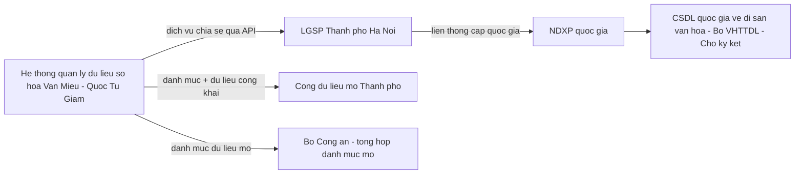

# Hồ sơ đề xuất cấp độ an toàn hệ thống thông tin

**Hệ thống quản lý dữ liệu số hóa Văn Miếu — Quốc Tử Giám**

| Trường | Nội dung |
|---|---|
| Mã tài liệu | 15 |
| Tên tài liệu | Hồ sơ đề xuất cấp độ an toàn hệ thống thông tin |
| Chuẩn/căn cứ áp dụng | Nghị định 85/2016/NĐ-CP (bảo đảm an toàn hệ thống thông tin theo cấp độ); Thông tư 12/2022/TT-BTTTT (Điều 9 khoản 1, dẫn chiếu bắt buộc TCVN 11930:2017); TCVN 11930:2017 — Yêu cầu cơ bản về an toàn hệ thống thông tin theo cấp độ |
| Phiên bản | 1.0.0 |
| Ngày ban hành | 12/08/2026 |
| Trạng thái | Dự thảo — hồ sơ trình cấp có thẩm quyền phê duyệt trước khi hệ thống vận hành chính thức; **chưa có kết quả phê duyệt tại thời điểm lập** |
| Đơn vị lập | Nhà thầu, phối hợp Trung tâm Hoạt động Văn hóa Khoa học Văn Miếu — Quốc Tử Giám |
| Tài liệu liên quan | `00-ke-hoach-nang-cap.md` (bối cảnh pháp lý, quyết định thiết kế) · `01-thuyet-minh-ky-thuat.md` (Chương 1 căn cứ pháp lý, Chương 6 kiến trúc và kết nối, Chương 9 an toàn thông tin và bảo vệ dữ liệu cá nhân) · `02-quy-trinh-bao-quan-sao-luu.md` (căn cứ thời hạn lưu nhật ký hệ thống) · `07-mo-hinh-du-lieu.md` (`audit_log.retention_until` theo cấp độ) · `09-dac-ta-yeu-cau-srs.md` (nhóm yêu cầu phi chức năng an toàn thông tin `YC-PCN-24` đến `YC-PCN-29`) · `docs/adr/0012-nhat-ky-append-only-thoi-han-luu-theo-cap-do-attt.md` · `11-ke-hoach-kiem-thu.md` (mục 8.4 kiểm thử an toàn thông tin) · `12-chat-luong-du-lieu.md` (đặc tính Confidentiality, Recoverability) |

---

## Mục lục

1. Giới thiệu và ghi chú cập nhật pháp lý
**Phần I — Thuyết minh tổng quan hệ thống thông tin**
2. Thông tin chung về hệ thống
3. Phạm vi, người dùng và quy mô
4. Dữ liệu xử lý
5. Kết nối ra ngoài hệ thống
**Phần II — Thuyết minh đề xuất cấp độ**
6. Căn cứ và phương pháp xác định cấp độ
7. Phân tích theo tiêu chí và đề xuất cấp độ 2
8. Ba điều kiện có thể phải nâng lên cấp độ 3
9. Thủ tục trình, phê duyệt
**Phần III — Phương án bảo đảm an toàn theo cấp độ**
10. Khung biện pháp theo TCVN 11930:2017
11. Nhóm biện pháp quản lý
12. Nhóm biện pháp kỹ thuật
13. Thời hạn lưu nhật ký theo cấp độ
14. Danh mục cần đối chiếu nguyên văn trước khi nộp

---

## 1. Giới thiệu và ghi chú cập nhật pháp lý

### 1.1. Mục đích

Tài liệu là **hồ sơ đề xuất cấp độ an toàn hệ thống thông tin** cho Hệ thống quản lý dữ liệu số hóa Văn Miếu — Quốc Tử Giám, lập theo đúng ba thành phần bắt buộc của Nghị định 85/2016/NĐ-CP và Thông tư 12/2022/TT-BTTTT: *(một)* thuyết minh tổng quan hệ thống thông tin; *(hai)* thuyết minh đề xuất cấp độ; *(ba)* phương án bảo đảm an toàn hệ thống thông tin theo cấp độ đề xuất. Hồ sơ này là tài liệu **trình cấp có thẩm quyền phê duyệt** trước khi hệ thống vận hành chính thức, không phải tài liệu tự công bố.

### 1.2. Ghi chú cập nhật pháp lý bắt buộc đọc trước

**Luật An ninh mạng số 116/2025/QH15** (thông qua 10/12/2025) có hiệu lực từ **01/7/2026**, hợp nhất và thay thế đồng thời **Luật An toàn thông tin mạng 86/2015/QH13** và **Luật An ninh mạng 24/2018/QH14**. Luật mới quy định khung phân loại hệ thống thông tin theo **5 cấp độ** — về nguyên tắc số cấp độ giữ nguyên như khung hiện hành, nhưng **tại thời điểm lập hồ sơ này, nghị định hướng dẫn phân loại cấp độ thay thế Nghị định 85/2016/NĐ-CP chưa được ban hành** (dự thảo do Bộ Công an chủ trì, chưa công bố chính thức). Vì vậy hồ sơ này **tạm thời tiếp tục áp dụng Nghị định 85/2016/NĐ-CP và Thông tư 12/2022/TT-BTTTT dẫn chiếu TCVN 11930:2017** làm căn cứ kỹ thuật duy nhất hiện có, đồng thời **cam kết rà soát và cập nhật lại toàn bộ hồ sơ** — kể cả kết quả đã được phê duyệt — ngay khi văn bản hướng dẫn mới có hiệu lực. *(Trạng thái hiệu lực chi tiết của Nghị định 85/2016/NĐ-CP và Thông tư 12/2022/TT-BTTTT sau ngày 01/7/2026, và nội dung cụ thể của nghị định thay thế: cần đối chiếu nguyên văn trước khi nộp.)*

Hồ sơ này **không** viện dẫn Nghị định 53/2022/NĐ-CP (thời hạn lưu nhật ký 12/24 tháng) làm căn cứ cho bất kỳ con số nào — phạm vi điều chỉnh của nghị định đó là doanh nghiệp cung cấp dịch vụ trên mạng viễn thông, mạng Internet, **không áp dụng cho đơn vị sự nghiệp công lập** như Trung tâm (xem mục 13).

---

# PHẦN I — THUYẾT MINH TỔNG QUAN HỆ THỐNG THÔNG TIN

## 2. Thông tin chung về hệ thống

| Mục | Nội dung |
|---|---|
| Tên hệ thống thông tin | Hệ thống quản lý dữ liệu số hóa Văn Miếu — Quốc Tử Giám |
| Loại hệ thống | Hệ thống thông tin nội bộ phục vụ quản lý chuyên môn (kho dữ liệu số hóa di sản, quy trình duyệt xuất bản, kiểm kê, tuân thủ) — **không phải** hệ thống cung cấp dịch vụ công trực tuyến cho người dân |
| Cơ quan chủ quản | **Sở Văn hóa và Thể thao Hà Nội** — Trung tâm Hoạt động Văn hóa Khoa học Văn Miếu — Quốc Tử Giám là đơn vị sự nghiệp công lập trực thuộc Sở, không có tư cách chủ quản hệ thống thông tin độc lập (đối chiếu cách diễn đạt tư cách chủ thể tại `01-thuyet-minh-ky-thuat.md` mục 1.5 và 6.4) |
| Đơn vị trực tiếp quản lý, vận hành | Trung tâm Hoạt động Văn hóa Khoa học Văn Miếu — Quốc Tử Giám |
| Cấp có thẩm quyền phê duyệt hồ sơ cấp độ | **Cần đối chiếu quy chế phân cấp thẩm quyền phê duyệt hồ sơ đề xuất cấp độ an toàn hệ thống thông tin của UBND thành phố Hà Nội trước khi nộp** — chưa xác định được trong nguồn đã đối chiếu liệu thẩm quyền này được phân cấp cho Giám đốc Sở Văn hóa và Thể thao hay thuộc thẩm quyền UBND Thành phố. Đây là vai trò **khác** với vai trò của Sở Khoa học và Công nghệ — đầu mối thẩm định tuân thủ Khung kiến trúc số Thành phố Hà Nội 1.0 (Quyết định 2906/QĐ-UBND, `01-thuyet-minh-ky-thuat.md` mục 1.4) — hai thủ tục không được gộp làm một khi trình hồ sơ |
| Địa điểm đặt hệ thống | Trung tâm Dữ liệu thành phố Hà Nội (phương án khuyến nghị, `01-thuyet-minh-ky-thuat.md` mục 10.2) — dữ liệu không rời lãnh thổ Việt Nam trong mọi phương án |
| Giai đoạn được mô tả trong hồ sơ này | Giai đoạn 1 (theo `01-thuyet-minh-ky-thuat.md` mục 3.3) — hồ sơ Giai đoạn 2 (cổng công chúng) lập và trình lại khi triển khai, do phạm vi phục vụ thay đổi có thể ảnh hưởng cấp độ (xem mục 8) |

## 3. Phạm vi, người dùng và quy mô

### 3.1. Phạm vi nghiệp vụ

Kho dữ liệu số tập trung cho năm loại đối tượng di sản và tám dạng dữ liệu số; hệ thống mã định danh; nhập liệu và kiểm soát chất lượng đầu vào; siêu dữ liệu và mã khuyết giá trị; tìm kiếm; quy trình duyệt và xuất bản 9 trạng thái; phiên bản và toàn vẹn dữ liệu; bộ sưu tập và phát biểu quyền; báo cáo thống kê; kiểm kê định kỳ; quản lý đợt số hóa; kết nối và chia sẻ dữ liệu; người dùng, phân quyền và nhật ký; sao lưu và phục hồi; tuân thủ và quản trị dữ liệu — đúng phạm vi Giai đoạn 1 đã chốt tại `01-thuyet-minh-ky-thuat.md` Chương 3 mục 3.3.

### 3.2. Người sử dụng hệ thống

| Nhóm người dùng | Mô tả | Quy mô ước tính |
|---|---|---|
| Cán bộ nghiệp vụ nội bộ Trung tâm | 6 vai trò: Quản trị, Kỹ thuật số hóa, Biên tập, Phê duyệt, Chỉ xem, Cán bộ bảo quản số | Vài chục tài khoản — quy mô nhỏ, không phải xử lý dữ liệu cá nhân diện rộng (đối chiếu mục 7) |
| Cán bộ đầu mối bảo vệ dữ liệu cá nhân (DPO) | Vai trò chuyên trách theo Điều 33 khoản 2 Luật Bảo vệ dữ liệu cá nhân 91/2025/QH15 | 1–2 người, kiêm nhiệm hoặc chuyên trách tùy quyết định của Trung tâm |
| Tổ chức, cá nhân khai thác dữ liệu mở | Truy cập qua API dữ liệu mở/Cổng dữ liệu mở Thành phố, **không đăng nhập vào hệ thống quản trị** | Không giới hạn số lượng, nhưng chỉ truy cập tập dữ liệu đã công bố công khai, không tương tác trực tiếp với hệ thống nội bộ |
| Cơ quan, tổ chức yêu cầu chia sẻ dữ liệu có điều kiện | Nộp yêu cầu qua kênh riêng (không phải tài khoản đăng nhập), được xét duyệt theo quy trình CN-11.4 | Không thường xuyên, xử lý theo từng yêu cầu |

**Kết luận về quy mô người dùng:** hệ thống phục vụ **chủ yếu người dùng nội bộ** với quy mô nhỏ; phần công chúng chỉ tiêu thụ dữ liệu đã công bố qua API một chiều, không phải người dùng có tài khoản tương tác hai chiều với hệ thống — đây là căn cứ chính cho việc chưa xếp vào nhóm "hệ thống phục vụ trực tiếp người dân quy mô lớn" (mục 8).

### 3.3. Quy mô kỹ thuật

Mục tiêu thiết kế 5 năm: 50.000 bản ghi dữ liệu số, 20 TB dung lượng, tối thiểu 50 người dùng nghiệp vụ đồng thời (thiết kế mở rộng tới 200) — theo `01-thuyet-minh-ky-thuat.md` Chương 5 mục 5.2.

## 4. Dữ liệu xử lý

| Nhóm dữ liệu | Nội dung | Mức nhạy cảm |
|---|---|---|
| Dữ liệu số hóa di sản | Mô hình 3D, gaussian splat, đám mây điểm, bản vẽ kỹ thuật, ảnh số, văn bản số, video, âm thanh của đối tượng di sản | Không thuộc danh mục bí mật nhà nước theo hiểu biết tại thời điểm lập hồ sơ (xem mục 8 điều kiện 3) |
| Siêu dữ liệu mô tả và quản trị | Niên đại, vị trí, số kiểm kê, quan hệ hiện vật, trạng thái quy trình, phát biểu quyền | Không nhạy cảm, phần lớn dự kiến công bố công khai theo mức truy cập |
| Dữ liệu cá nhân trong tư liệu di sản | Ảnh chân dung, tên người trong gia phả/sắc phong — có thể liên quan người còn sống hoặc thân nhân trực hệ | Dữ liệu cá nhân theo Luật Bảo vệ dữ liệu cá nhân 91/2025/QH15, xử lý bằng cờ `contains_personal_data` và mã khuyết `HAN_CHE` (`01-thuyet-minh-ky-thuat.md` mục 9.7) |
| Dữ liệu cá nhân của người dùng nội bộ | Họ tên, thư điện tử công vụ, vai trò, lịch sử đăng nhập, địa chỉ IP trong nhật ký | Dữ liệu cá nhân cơ bản, quy mô nhỏ (cán bộ, viên chức sử dụng hệ thống) |
| Dữ liệu vận hành, cấu hình | Khóa API, cấu hình kết nối, thông tin xác thực hệ thống | Dữ liệu kỹ thuật nhạy cảm về an toàn thông tin, không phải dữ liệu cá nhân |

**Kết luận về loại thông tin xử lý:** hệ thống xử lý dữ liệu số hóa di sản văn hóa và dữ liệu cá nhân quy mô nhỏ (chủ yếu người dùng nội bộ); **không** xử lý thông tin thuộc phạm vi bí mật nhà nước theo hiểu biết hiện tại — điểm này cần đối chiếu chính thức trước khi chốt (mục 8 điều kiện 3).

## 5. Kết nối ra ngoài hệ thống

### 5.1. Nguyên tắc kết nối

Theo Điều 7 khoản 3 Quyết định 85/2025/QĐ-UBND và Điều 7 Nghị định 278/2025/NĐ-CP: **mọi kết nối ra ngoài đi qua nền tảng tích hợp, chia sẻ dữ liệu số của Thành phố (LGSP Hà Nội)**, không kết nối trực tiếp ngang hàng với hệ thống của cơ quan khác. Đây là nguyên tắc kiến trúc bắt buộc, ảnh hưởng trực tiếp tới việc xác định biên an toàn của hệ thống (mục 7).

### 5.2. Danh mục kết nối

| Kết nối | Đối tác | Chiều dữ liệu | Trạng thái | Ghi chú an toàn thông tin |
|---|---|---|---|---|
| Nền tảng tích hợp, chia sẻ dữ liệu số Thành phố (LGSP Hà Nội) | Sở Khoa học và Công nghệ Hà Nội (chủ trì vận hành LGSP theo Quyết định 5918/QĐ-UBND) | Hai chiều — gửi dịch vụ chia sẻ, nhận yêu cầu | Đang hoạt động | Kênh kết nối bắt buộc, xác thực và mã hóa theo quy chế LGSP |
| Cổng dữ liệu mở Thành phố | UBND Thành phố Hà Nội | Một chiều — gửi danh mục và dữ liệu đã công bố công khai | Đã công bố một số bộ dữ liệu | Chỉ dữ liệu mức truy cập `CONG_KHAI`, không chứa dữ liệu cá nhân hay `HAN_CHE` |
| Nền tảng tích hợp, chia sẻ dữ liệu quốc gia (NDXP) | Cấp quốc gia, qua trung gian LGSP Thành phố | Gián tiếp qua LGSP | Theo lộ trình chung của Thành phố | Trung tâm không kết nối thẳng ra cấp quốc gia (`01-thuyet-minh-ky-thuat.md` mục 6.4 điểm 1) |
| Cơ sở dữ liệu quốc gia về di sản văn hóa | Bộ Văn hóa, Thể thao và Du lịch | Hai chiều, khi có đặc tả kỹ thuật chính thức | **Chờ ký kết** — Bộ VHTTDL chưa công bố đặc tả kết nối | Lớp ánh xạ dữ liệu tách riêng, sẵn sàng kết nối khi có đặc tả (Điều 85 khoản 4 Luật 45/2024, Điều 86 khoản 4 NĐ 308/2025) |
| Bộ Công an — tổng hợp danh mục dữ liệu mở | Bộ Công an | Một chiều — gửi danh mục dữ liệu mở để tổng hợp | Theo Điều 10 Nghị định 165/2025/NĐ-CP | Chỉ gửi danh mục và siêu dữ liệu mô tả, không gửi dữ liệu gốc |

### 5.3. Sơ đồ kết nối rút gọn phục vụ hồ sơ cấp độ

**Kết luận về kết nối ra ngoài:** toàn bộ kết nối đi qua một điểm trung gian duy nhất (LGSP Thành phố) theo đúng nguyên tắc kiến trúc; hệ thống không mở cổng kết nối trực tiếp, ngang hàng với hệ thống của tổ chức, cá nhân khác — đây là yếu tố giảm nhẹ mức độ phơi nhiễm khi xác định cấp độ (mục 7).

---

# PHẦN II — THUYẾT MINH ĐỀ XUẤT CẤP ĐỘ

## 6. Căn cứ và phương pháp xác định cấp độ

### 6.1. Chuỗi căn cứ pháp lý

**Nghị định 85/2016/NĐ-CP** quy định hệ thống thông tin được phân theo **5 cấp độ** an toàn, từ cấp độ 1 (thấp nhất) tới cấp độ 5 (cao nhất), dựa trên mức độ quan trọng của hệ thống, phạm vi và đối tượng phục vụ, loại thông tin xử lý và hậu quả nếu hệ thống bị mất an toàn thông tin. **Thông tư 12/2022/TT-BTTTT** hướng dẫn chi tiết hồ sơ đề xuất cấp độ và, tại Điều 9 khoản 1, **dẫn chiếu bắt buộc áp dụng TCVN 11930:2017** cho phương án bảo đảm an toàn theo cấp độ (Phần III tài liệu này).

### 6.2. Bốn tiêu chí xem xét

Bốn tiêu chí dưới đây là cơ sở phân tích ở mục 7, tổng hợp từ nội dung Nghị định 85/2016/NĐ-CP và diễn giải áp dụng đã có tại `01-thuyet-minh-ky-thuat.md` mục 9.1:

1. **Phạm vi, quy mô phục vụ** — hệ thống phục vụ nội bộ một đơn vị, một ngành, hay toàn dân/toàn quốc.
2. **Loại thông tin xử lý** — thông tin thông thường, thông tin có tính nhạy cảm nghiệp vụ, dữ liệu cá nhân, hay thông tin thuộc danh mục bí mật nhà nước.
3. **Quy mô xử lý dữ liệu cá nhân** — có hay không hoạt động xử lý dữ liệu cá nhân diện rộng.
4. **Hậu quả khi hệ thống bị xâm phạm** — mức độ ảnh hưởng tới hoạt động của cơ quan, tới quyền lợi tổ chức/cá nhân, tới an ninh quốc gia, trật tự an toàn xã hội.

## 7. Phân tích theo tiêu chí và đề xuất cấp độ 2

### 7.1. Bảng phân tích

| Tiêu chí | Phân tích đối với hệ thống này | Kết luận |
|---|---|---|
| Phạm vi, quy mô phục vụ | Hệ thống thông tin **nội bộ của một đơn vị sự nghiệp công lập**, phục vụ hoạt động chuyên môn quản lý dữ liệu số hóa di sản của Trung tâm; kết nối ra ngoài đi qua một điểm trung gian duy nhất (mục 5); **không phải** hệ thống cung cấp dịch vụ công trực tuyến phục vụ trực tiếp người dân trên diện rộng | Quy mô nhỏ — không đạt ngưỡng "diện rộng" |
| Loại thông tin xử lý | Dữ liệu số hóa di sản văn hóa và siêu dữ liệu chuyên môn (mục 4); phần lớn dự kiến công bố công khai theo mức truy cập; **không** xử lý thông tin thuộc phạm vi bí mật nhà nước theo hiểu biết tại thời điểm lập hồ sơ | Không nhạy cảm ở mức cao — nhưng xem điều kiện 3, mục 8 |
| Quy mô dữ liệu cá nhân | Chủ yếu là dữ liệu cá nhân của cán bộ, viên chức sử dụng hệ thống (mục 3.2) — quy mô nhỏ; dữ liệu cá nhân trong tư liệu lịch sử (gia phả, ảnh chân dung) được kiểm soát bằng cờ `contains_personal_data` và mã khuyết `HAN_CHE` trước khi công bố, không phải hoạt động thu thập/xử lý dữ liệu cá nhân diện rộng có chủ đích | Không thuộc diện xử lý dữ liệu cá nhân diện rộng — nhưng xem điều kiện 1, mục 8 |
| Hậu quả khi bị xâm phạm | Ảnh hưởng tới hoạt động chuyên môn của đơn vị và tới giá trị tư liệu (rủi ro uy tín, rủi ro toàn vẹn dữ liệu di sản); **không** gây gián đoạn dịch vụ công thiết yếu cho người dân, không ảnh hưởng trực tiếp an ninh quốc gia hay trật tự an toàn xã hội theo hiểu biết hiện tại | Hậu quả ở mức trung bình, khoanh vùng trong phạm vi chuyên môn và uy tín |

### 7.2. Kiến nghị

**Đề xuất cấp độ 2.** Cả bốn tiêu chí đều cho kết quả nhất quán ở mức phục vụ nội bộ, quy mô nhỏ, không có yếu tố đẩy lên nhóm hệ thống diện rộng hoặc thông tin đặc biệt nhạy cảm — phù hợp khung mô tả cấp độ 2 của Nghị định 85/2016/NĐ-CP (hệ thống phục vụ hoạt động nội bộ của một cơ quan, đơn vị, khi bị mất an toàn thông tin sẽ làm tổn hại tới hoạt động hợp pháp của cơ quan, tổ chức đó). Đây là kết quả **đồng nhất** với kiến nghị đã nêu tại `01-thuyet-minh-ky-thuat.md` mục 9.1 và được yêu cầu hoá thành `YC-PCN-29` tại `09-dac-ta-yeu-cau-srs.md`.

### 7.3. Nguyên tắc thiết kế vượt mức tối thiểu

Dù đề xuất cấp độ 2, **kiến trúc an toàn được xây dựng theo mức cấp độ 3** ở các biện pháp có chi phí biên thấp — nhật ký, mã hóa, phân quyền, xác thực hai yếu tố (chi tiết Phần III) — để việc nâng cấp độ về sau, nếu xảy ra theo một trong ba điều kiện ở mục 8, **không phải thiết kế lại hệ thống**, chỉ phải bổ sung thủ tục hành chính và một số biện pháp hạ tầng.

## 8. Ba điều kiện có thể phải nâng lên cấp độ 3

Hồ sơ nêu trước ba điều kiện dưới đây để chủ đầu tư chủ động theo dõi, không chờ tới khi phát sinh mới xem xét lại cấp độ. Nếu **bất kỳ điều kiện nào** xảy ra hoặc được xác nhận, hồ sơ cấp độ cần lập lại và trình phê duyệt lại — không tự động áp dụng, phải qua đúng thủ tục ở mục 9.

### Điều kiện 1 — Xử lý dữ liệu cá nhân diện rộng

Khi hệ thống mở rộng phạm vi xử lý dữ liệu cá nhân vượt quy mô nội bộ hiện tại — ví dụ số hóa và công bố khối lượng lớn tư liệu chứa thông tin định danh được của nhiều cá nhân (gia phả dòng họ khoa bảng quy mô lớn, hồ sơ hiến tặng hiện vật có thông tin người hiến tặng), hoặc triển khai chức năng thu thập dữ liệu cá nhân của người dùng bên ngoài (ví dụ đăng ký tài khoản nghiên cứu viên công khai). Ngưỡng "diện rộng" cụ thể theo văn bản hướng dẫn phân loại cấp độ — *(cần đối chiếu nguyên văn trước khi nộp, vì Nghị định 85/2016/NĐ-CP không tự nó định lượng số cụ thể)*.

### Điều kiện 2 — Hệ thống phục vụ trực tiếp người dân quy mô lớn

Khi hệ thống mở cổng phục vụ công chúng ở Giai đoạn 2 (bản đồ số 3D toàn khu, cổng tham quan số, nội dung thuyết minh đa ngữ cho khách tham quan) và đạt quy mô truy cập, tương tác trực tiếp với người dân trên diện rộng — khác về bản chất với Giai đoạn 1 hiện tại, nơi công chúng chỉ tiêu thụ dữ liệu mở một chiều qua API (mục 3.2, mục 5). Đây là điều kiện đã được nêu nhất quán tại `01-thuyet-minh-ky-thuat.md` mục 9.1 và cần đánh giá lại ngay khi có quyết định bố trí vốn Giai đoạn 2.

### Điều kiện 3 — Chứa dữ liệu thuộc danh mục bí mật nhà nước ngành văn hóa

Khi rà soát phát hiện một phần dữ liệu số hóa (ví dụ hồ sơ khoa học xếp hạng di tích, thông tin vị trí chi tiết của hiện vật giá trị đặc biệt, hoặc tài liệu nội bộ liên quan công tác bảo vệ di sản) thuộc **danh mục bí mật nhà nước trong lĩnh vực văn hóa** do cơ quan có thẩm quyền ban hành. **Mục này ghi rõ: cần đối chiếu danh mục bí mật nhà nước ngành văn hóa hiện hành trước khi chốt cấp độ** — tại thời điểm lập hồ sơ, nhà thầu **chưa có căn cứ xác nhận hoặc loại trừ** khả năng này, và khuyến nghị Trung tâm phối hợp cơ quan có thẩm quyền rà soát danh mục trước khi hồ sơ cấp độ được trình phê duyệt chính thức, không chỉ dựa trên "hiểu biết tại thời điểm lập hồ sơ" như đã ghi ở mục 7.1.

### 8.1. Bảng tổng hợp ba điều kiện

| # | Điều kiện | Trạng thái hiện tại | Trách nhiệm theo dõi |
|---|---|---|---|
| 1 | Xử lý dữ liệu cá nhân diện rộng | Chưa xảy ra — quy mô nhỏ, kiểm soát bằng `contains_personal_data`/`HAN_CHE` | DPO, Quản trị |
| 2 | Phục vụ trực tiếp người dân quy mô lớn | Chưa xảy ra — thuộc Giai đoạn 2, chưa triển khai | Ban Giám đốc Trung tâm, khi quyết định bố trí vốn Giai đoạn 2 |
| 3 | Chứa dữ liệu bí mật nhà nước ngành văn hóa | **Chưa đối chiếu** — cần rà soát trước khi chốt hồ sơ chính thức | Trung tâm, phối hợp cơ quan có thẩm quyền quản lý danh mục bí mật nhà nước |

## 9. Thủ tục trình, phê duyệt

1. Nhà thầu hoàn thiện hồ sơ đề xuất cấp độ (ba phần theo mục 1.1) dựa trên thiết kế chi tiết đã hoàn thành ở bước Thiết kế chi tiết của kế hoạch triển khai (`01-thuyet-minh-ky-thuat.md` Chương 12).
2. Trung tâm rà soát nội dung, đối chiếu điều kiện 3 (mục 8) với cơ quan quản lý danh mục bí mật nhà nước ngành văn hóa trước khi trình.
3. Trung tâm trình hồ sơ lên cấp có thẩm quyền phê duyệt *(xác định cụ thể cấp có thẩm quyền: cần đối chiếu quy chế phân cấp — mục 2)*.
4. Hồ sơ được phê duyệt trước khi hệ thống đưa vào vận hành chính thức — đây là điều kiện tiên quyết, không phải thủ tục có thể hoàn thiện sau (`01-thuyet-minh-ky-thuat.md` mục 9.1, rủi ro R-04 tại Chương 17).
5. Khi có văn bản hướng dẫn phân loại cấp độ thay thế Nghị định 85/2016/NĐ-CP (theo Luật An ninh mạng 116/2025/QH15, mục 1.2), hồ sơ được rà soát và cập nhật lại trong thời hạn văn bản mới quy định.
6. Khi một trong ba điều kiện ở mục 8 xảy ra, Trung tâm khởi động lại quy trình từ bước 1 với cấp độ đề xuất mới.

---

# PHẦN III — PHƯƠNG ÁN BẢO ĐẢM AN TOÀN THEO CẤP ĐỘ

## 10. Khung biện pháp theo TCVN 11930:2017

TCVN 11930:2017 quy định biện pháp bảo đảm an toàn hệ thống thông tin theo cấp độ, chia thành **hai nhóm lớn**: nhóm biện pháp **quản lý** và nhóm biện pháp **kỹ thuật** (bốn nhóm nhỏ: an toàn mạng, an toàn máy chủ/máy trạm, an toàn ứng dụng, an toàn dữ liệu). Phương án ở mục 11–12 trình bày theo đúng khung này, ánh xạ với biện pháp cụ thể **đã có trong thiết kế** của hệ thống (`01-thuyet-minh-ky-thuat.md` Chương 9). **Nội dung chi tiết từng yêu cầu thành phần của TCVN 11930:2017 (số hiệu điều khoản, mô tả đầy đủ theo cấp độ 2) cần đối chiếu nguyên văn tiêu chuẩn trước khi nộp** — bảng dưới trình bày ở mức nhóm biện pháp và biện pháp cụ thể đã thiết kế, không trích dẫn số điều khoản của tiêu chuẩn vì chưa được đối chiếu trực tiếp với văn bản gốc.

## 11. Nhóm biện pháp quản lý

| Nhóm biện pháp quản lý | Nội dung áp dụng cho hệ thống này |
|---|---|
| **Chính sách an toàn thông tin** | Ban hành chính sách an toàn thông tin nội bộ của Trung tâm, gồm quy định về tài khoản, mật khẩu, phân quyền, sao lưu, ứng phó sự cố; rà soát định kỳ hằng năm cùng đợt đánh giá rủi ro dữ liệu (Điều 15, 17 Nghị định 165/2025/NĐ-CP) |
| **Tổ chức bảo đảm an toàn thông tin** | Phân công vai trò rõ ràng: Quản trị hệ thống, Cán bộ bảo quản số, DPO (Điều 33 khoản 2 Luật Bảo vệ dữ liệu cá nhân 91/2025/QH15); tối thiểu hai tài khoản quản trị để tránh phụ thuộc một người (`01-thuyet-minh-ky-thuat.md` mục 9.2) |
| **Đào tạo, nâng cao nhận thức** | Đào tạo cán bộ nghiệp vụ theo vai trò trước khi vận hành chính thức (`01-thuyet-minh-ky-thuat.md` Chương 13); nội dung đào tạo gồm cả nhận thức an toàn thông tin cơ bản (nhận diện lừa đảo, quản lý mật khẩu, báo cáo sự cố) |
| **Quản lý thiết kế, xây dựng hệ thống** | Tách môi trường phát triển/kiểm thử/vận hành; không dùng dữ liệu thật cho môi trường kiểm thử; kiểm thử an toàn (rà soát cấu hình, quét lỗ hổng, kiểm thử xâm nhập) trước nghiệm thu (`01-thuyet-minh-ky-thuat.md` mục 9.3, 9.8) |
| **Quản lý vận hành hệ thống** | Quy trình vá lỗi bảo mật định kỳ có cửa sổ bảo trì thông báo trước; giám sát chỉ số hệ thống và cảnh báo tự động; đồng hồ hệ thống đồng bộ nguồn thời gian chuẩn (`01-thuyet-minh-ky-thuat.md` Chương 10 mục 10.4) |
| **Quản lý rủi ro, đánh giá, kiểm tra** | Đánh giá rủi ro dữ liệu hằng năm (Điều 15, 17 NĐ 165/2025); kiểm toán dữ liệu theo Điều 13, 14 Nghị định 278/2025/NĐ-CP; diễn tập ứng phó sự cố tối thiểu 1 lần/năm có biên bản (`02-quy-trinh-bao-quan-sao-luu.md` mục 5) |
| **Quản lý kết thúc/thay đổi hệ thống** | Xuất toàn bộ dữ liệu và siêu dữ liệu theo chuẩn mở bất kỳ lúc nào; không khóa dữ liệu trong định dạng độc quyền, bảo đảm chuyển giao/chấm dứt hợp đồng không gây gián đoạn hoặc mất dữ liệu (PCN-12, PCN-13, `01-thuyet-minh-ky-thuat.md` mục 5.6) |

---

## 12. Nhóm biện pháp kỹ thuật

### 12.1. An toàn hạ tầng mạng

| Biện pháp | Nội dung áp dụng |
|---|---|
| Kiểm soát kết nối ra ngoài | Toàn bộ kết nối ra ngoài đi qua LGSP Thành phố, không kết nối trực tiếp ngang hàng (mục 5); kênh riêng hoặc xác thực hai chiều tới nền tảng tích hợp (`01-thuyet-minh-ky-thuat.md` mục 9.3) |
| Mã hóa khi truyền | TLS phiên bản 1.2 trở lên cho mọi kết nối người dùng–hệ thống; kênh mTLS hoặc tương đương cho kết nối LGSP |
| Phân vùng mạng | Tách mạng cho máy chủ ứng dụng/cơ sở dữ liệu, máy chủ xử lý 3D có GPU, và kho lưu trữ off-site; kho sao lưu tầng lạnh cách ly mạng một phần (gần air-gapped, `02-quy-trinh-bao-quan-sao-luu.md` mục 2.2) |
| Giám sát và giới hạn tốc độ | Giới hạn tốc độ gọi API theo đầu mối tiêu thụ; giám sát lưu lượng bất thường (CN-11.7) |

### 12.2. An toàn máy chủ, máy trạm

| Biện pháp | Nội dung áp dụng |
|---|---|
| Vá lỗi định kỳ | Quy trình vá lỗi bảo mật định kỳ cho hệ điều hành và thành phần nền, cửa sổ bảo trì thông báo trước ≥ 3 ngày làm việc |
| Tách môi trường | Phát triển/kiểm thử/vận hành tách biệt hạ tầng, dữ liệu, thông tin xác thực; môi trường không phải vận hành hiển thị dải cảnh báo trên giao diện |
| Chịu lỗi | Tối thiểu 2 nút máy chủ ứng dụng để chịu lỗi (`01-thuyet-minh-ky-thuat.md` Chương 10 mục 10.1) |
| Quản lý cấu hình | Cấu hình vận hành tách khỏi mã nguồn; nâng cấp không mất cấu hình và dữ liệu (PCN-15) |

### 12.3. An toàn ứng dụng

| Biện pháp | Nội dung áp dụng |
|---|---|
| Xác thực | Đăng nhập bắt buộc cho mọi màn nghiệp vụ; ưu tiên đăng nhập một lần (OpenID Connect) với tài khoản cơ quan; xác thực hai yếu tố **bắt buộc** với vai trò Quản trị và Phê duyệt |
| Kiểm soát truy cập | RBAC kết hợp ABAC theo phạm vi bộ sưu tập; nguyên tắc bốn mắt thực thi ở **tầng dịch vụ**, không chỉ ẩn nút giao diện (ADR-0011) |
| Quản lý phiên | Xem và buộc đăng xuất thiết bị; quản trị buộc đăng xuất phiên người khác kèm lý do và ghi nhật ký |
| Chính sách mật khẩu, khóa tài khoản | Cấu hình được độ dài, thành phần ký tự, thời hạn đổi, số lần sai trước khi khóa; thông báo lỗi chung, không tiết lộ tài khoản có tồn tại hay không |
| Kiểm soát đầu vào | Kiểm tra định dạng/độ phân giải/kích thước tại điểm nhận tệp; vô hiệu hóa công thức động trong tệp Excel nhập lô, quét mã độc trước khi đưa vào kho (CN-03.3, CN-03.6) |
| Bảo vệ dữ liệu giá trị cao | Đóng dấu chìm động trên bản xem trước công khai; liên kết tải bản gốc có thời hạn; nhật ký tải xuống tách riêng bản gốc/bản phổ biến (`01-thuyet-minh-ky-thuat.md` mục 9.4) |
| Kiểm thử trước nghiệm thu | Quét lỗ hổng ứng dụng và hạ tầng, kiểm thử xâm nhập ở mức ứng dụng, kiểm thử phân quyền theo từng vai trò, kiểm thử luồng nhật ký không sửa/xóa được (mục 9.8 tài liệu 01; `11-ke-hoach-kiem-thu.md` mục 8.4) |

### 12.4. An toàn dữ liệu

| Biện pháp | Nội dung áp dụng |
|---|---|
| Mã hóa khi lưu | Toàn bộ tệp gốc và cơ sở dữ liệu siêu dữ liệu mã hóa AES-256; khóa mã hóa quản lý tách biệt khỏi hạ tầng lưu trữ, có quy trình luân chuyển khóa |
| Toàn vẹn dữ liệu | Checksum SHA-256 tính ngay khi ingest; kiểm tra toàn vẹn định kỳ theo tần suất phân loại (hàng quý với 82 bia Tiến sĩ/Hán Nôm quý hiếm, 6 tháng với nhóm còn lại — `02-quy-trinh-bao-quan-sao-luu.md` mục 4) |
| Sao lưu, phục hồi | Quy tắc 3 bản — 2 loại phương tiện — 1 nơi khác; RPO ≤ 24 giờ, RTO ≤ 4 giờ; diễn tập khôi phục ≥ 1 lần/năm có biên bản |
| Nhật ký, truy vết | Nhật ký chỉ ghi thêm, chuỗi băm liên kết (hash chain), tách kho khỏi cơ sở dữ liệu nghiệp vụ, kể cả tài khoản Quản trị cũng không sửa/xóa được (ADR-0012); ghi tối thiểu 6 trường: thời điểm, người thực hiện, hành động, đối tượng, IP, kết quả |
| Bảo vệ dữ liệu cá nhân | Cờ `contains_personal_data`; mã khuyết `HAN_CHE` loại trường nhạy cảm khỏi API công khai; quy trình DPIA trong 60 ngày; quy trình thông báo vi phạm 72 giờ (`01-thuyet-minh-ky-thuat.md` mục 9.7) |
| Chống sao chép, khai thác trái phép | Tổ hợp đóng dấu chìm, liên kết tải có hạn, nhật ký tải xuống, điều khoản trong phát biểu quyền — đáp ứng Điều 86 khoản 4 Nghị định 308/2025/NĐ-CP (chống sao chép dữ liệu trái phép hoặc bán dữ liệu thô) |

---

## 13. Thời hạn lưu nhật ký theo cấp độ

### 13.1. Nguồn con số đúng — không dùng một con số chung cho mọi hệ thống

Đây là điểm nhiều hồ sơ ghi sai: **không có một con số bắt buộc chung cho mọi hệ thống thông tin của Nhà nước.** Chuỗi căn cứ đúng cho hệ thống này là **Nghị định 85/2016/NĐ-CP** (phân loại cấp độ) → **Thông tư 12/2022/TT-BTTTT Điều 9 khoản 1** (dẫn chiếu bắt buộc tiêu chuẩn quốc gia) → **TCVN 11930:2017** (con số cụ thể theo từng cấp độ):

| Cấp độ an toàn | Thời hạn lưu tối thiểu nhật ký hệ thống theo TCVN 11930:2017 |
|---|---|
| Cấp độ 1 | Chỉ yêu cầu ghi nhật ký, không quy định thời hạn lưu tối thiểu |
| **Cấp độ 2** (cấp độ đề xuất — mục 7.2) | **≥ 01 tháng** |
| Cấp độ 3 | **≥ 03 tháng** |
| Cấp độ 4 | **≥ 06 tháng** |
| Cấp độ 5 | **≥ 12 tháng** |

### 13.2. Nghị định 53/2022/NĐ-CP không áp dụng cho hệ thống này

Con số **12 tháng** (hoặc 24 tháng với một số loại dữ liệu) thường bị viện dẫn nhầm từ **Nghị định 53/2022/NĐ-CP**. Hồ sơ này khẳng định rõ: **phạm vi điều chỉnh của Nghị định 53/2022/NĐ-CP là doanh nghiệp cung cấp dịch vụ trên mạng viễn thông, mạng Internet và dịch vụ giá trị gia tăng trên không gian mạng — không phải đơn vị sự nghiệp công lập.** Trung tâm Hoạt động Văn hóa Khoa học Văn Miếu — Quốc Tử Giám không thuộc đối tượng áp dụng của nghị định này, nên **hồ sơ không dùng con số 12/24 tháng của Nghị định 53/2022/NĐ-CP làm căn cứ hay cam kết** cho thời hạn lưu nhật ký của hệ thống.

### 13.3. Cam kết cấu hình của giải pháp

Hệ thống **cấu hình được** thời hạn lưu nhật ký (không hard-code) và **mặc định đặt ở mức 12 tháng** — cao hơn mức tối thiểu bắt buộc của cả cấp độ 2 (đề xuất) lẫn cấp độ 3 (mức thiết kế theo mục 7.3) — đồng thời hiển thị nhãn chính sách ngay trên màn Nhật ký để cán bộ vận hành biết rõ mức đang áp dụng (`01-thuyet-minh-ky-thuat.md` mục 9.6; trường `audit_log.retention_until`, `07-mo-hinh-du-lieu.md` mục 4.5). Khi cấp độ an toàn được phê duyệt chính thức (mục 9), tham số này được rà soát lại cho khớp — có thể **hạ xuống mức tối thiểu của cấp độ 2 (01 tháng)** nếu Trung tâm không có nhu cầu lưu dài hơn, hoặc **giữ nguyên/nâng thêm** nếu Trung tâm chủ động chọn mức cao hơn.

### 13.4. Phân biệt nhật ký an toàn thông tin với sự kiện bảo quản (PREMIS)

Thời hạn theo TCVN 11930:2017 ở mục 13.1 áp dụng cho **nhật ký an toàn thông tin** (đăng nhập, đổi quyền, truy cập, thay đổi cấu hình). Đây là loại nhật ký **khác bản chất** với **sự kiện bảo quản PREMIS** (ingest, kiểm tra toàn vẹn, di trú định dạng…) ghi lịch sử vòng đời của chính dữ liệu số hóa — sự kiện PREMIS lưu **vĩnh viễn** cùng gói AIP, không áp dụng thời hạn tối thiểu theo cấp độ ATTT. Hai loại nhật ký được lưu và quản lý tách biệt trong thiết kế (`02-quy-trinh-bao-quan-sao-luu.md` mục 3.3).

### 13.5. Thời hạn riêng cho hồ sơ vi phạm dữ liệu cá nhân

Ngoài nhật ký hệ thống theo cấp độ ATTT, **hồ sơ vi phạm dữ liệu cá nhân lưu tối thiểu 05 năm** kể từ khi khắc phục xong sự cố, theo Nghị định 356/2025/NĐ-CP — đây là một thời hạn lưu **riêng biệt**, không thay thế và không bị chi phối bởi thời hạn lưu nhật ký hệ thống ở mục 13.1.

---

## 14. Danh mục cần đối chiếu nguyên văn trước khi nộp

Tổng hợp toàn bộ điểm đã gắn cờ "cần đối chiếu" xuyên suốt tài liệu — không trích dẫn hoặc cam kết chính thức cho tới khi hoàn tất đối chiếu:

| # | Nội dung cần đối chiếu | Vị trí trong tài liệu | Vì sao chưa chốt được |
|---|---|---|---|
| 1 | Trạng thái hiệu lực của Nghị định 85/2016/NĐ-CP và Thông tư 12/2022/TT-BTTTT sau ngày 01/7/2026 | Mục 1.2 | Nghị định thay thế do Bộ Công an chủ trì soạn thảo theo Luật An ninh mạng 116/2025/QH15, chưa ban hành tại thời điểm lập hồ sơ |
| 2 | Cấp có thẩm quyền cụ thể phê duyệt hồ sơ đề xuất cấp độ (Giám đốc Sở VH&TT hay UBND Thành phố) | Mục 2, mục 9 | Chưa xác định được quy chế phân cấp thẩm quyền cụ thể của UBND TP Hà Nội trong nguồn đã đối chiếu |
| 3 | Danh mục bí mật nhà nước ngành văn hóa hiện hành, đối chiếu với nội dung dữ liệu số hóa của dự án | Mục 8, điều kiện 3 | Nhà thầu chưa có thẩm quyền và nguồn tra cứu chính thức danh mục này; cần cơ quan có thẩm quyền xác nhận |
| 4 | Ngưỡng định lượng "xử lý dữ liệu cá nhân diện rộng" theo văn bản hướng dẫn phân loại cấp độ | Mục 8, điều kiện 1 | Nghị định 85/2016/NĐ-CP không tự định lượng; cần văn bản hướng dẫn chi tiết hoặc án lệ áp dụng thực tế |
| 5 | Nội dung điều khoản cụ thể của TCVN 11930:2017 (số hiệu điều khoản cho từng biện pháp ở mục 11–12) | Mục 10, 11, 12 | Tài liệu này trình bày ở mức nhóm biện pháp theo hiểu biết chung về cấu trúc tiêu chuẩn, chưa đối chiếu trực tiếp bản đầy đủ của tiêu chuẩn |
| 6 | Nội dung nghị định thay thế Nghị định 85/2016/NĐ-CP khi Luật An ninh mạng 116/2025/QH15 có hiệu lực | Mục 1.2, mục 9.5 | Dự thảo do Bộ Công an chủ trì, chưa công bố chính thức tại thời điểm lập hồ sơ |

---

*Tài liệu này đọc cùng `01-thuyet-minh-ky-thuat.md` Chương 9 (an toàn thông tin và bảo vệ dữ liệu cá nhân — trình bày đầy đủ hơn ở cấp độ thuyết minh giải pháp), `02-quy-trinh-bao-quan-sao-luu.md` (căn cứ chi tiết cho mục 13), `07-mo-hinh-du-lieu.md` (cấu trúc dữ liệu hỗ trợ các biện pháp ở mục 12), `09-dac-ta-yeu-cau-srs.md` và `docs/adr/0012-*.md` (yêu cầu và quyết định thiết kế tương ứng). Hồ sơ này **chưa có giá trị pháp lý cho tới khi được cấp có thẩm quyền phê duyệt chính thức** — mọi nội dung trình bày là đề xuất của nhà thầu dựa trên thiết kế hệ thống tại thời điểm lập tài liệu.*
