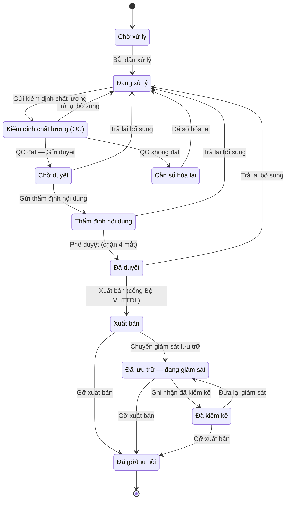
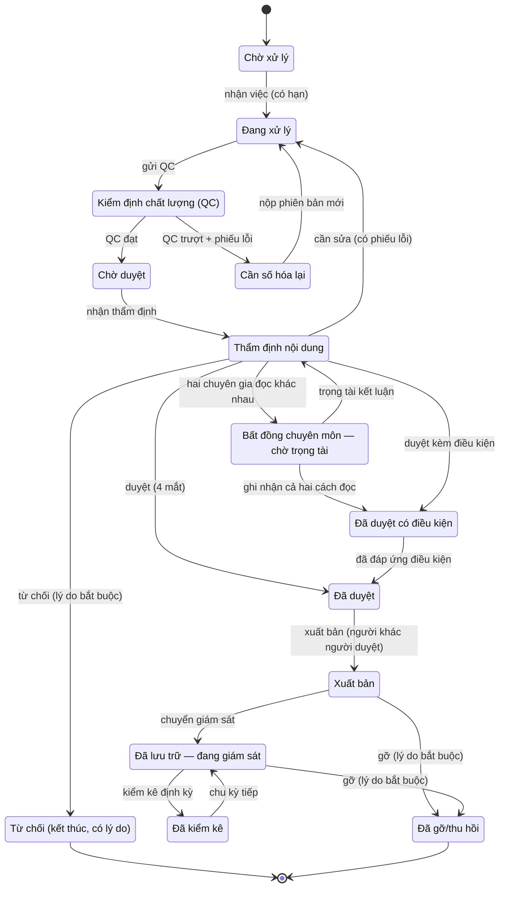
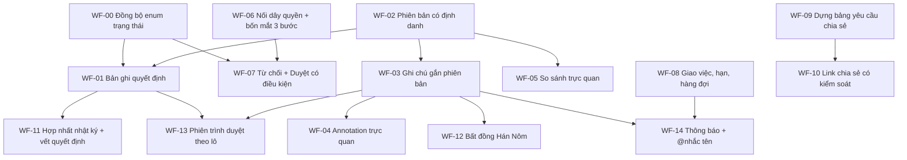

# Audit 04 — Quy trình duyệt, ghi chú & cộng tác

> Người thực hiện: subagent lăng kính review/collaboration · Ngày: 12/08/2026

> **⚠️ Ghi chú về tính thời điểm của bằng chứng.** Báo cáo được soạn trên ảnh chụp mã nguồn lúc ~14:00–17:30 ngày 12/08/2026. Trong lúc soạn, một luồng làm việc song song đã sửa đúng phần phân quyền: bảng `CAPS` gõ tay bị gỡ khỏi `app/src/context/AuthContext.tsx`, chính sách chuyển vào **`app/src/data/permissions.ts`** (nguồn duy nhất, có `capsForRole()`/`capsFromMatrix()` và bộ kiểm thử `app/tests/permissions.test.ts`). Hai phát hiện của báo cáo **đã được khắc phục** nhờ thay đổi đó và được đánh dấu ✅ tại chỗ: (a) hai nguồn định nghĩa quyền mâu thuẫn nhau, (b) vai trò Quản trị được cấp Duyệt/Xuất bản. **Hai phát hiện cốt lõi vẫn còn nguyên hiệu lực** (đã kiểm chứng lại sau thay đổi): trường `can` **vẫn không được component nào tiêu thụ**, và vai trò 'Phê duyệt' **vẫn giữ đồng thời cả `Duyệt` lẫn `Xuất bản`** (`app/src/data/permissions.ts:132`). WF-06 vì vậy vẫn cần làm, chỉ giảm phạm vi — xem ghi chú trong WF-06.

---

## 1. Tóm tắt điều hành

App VM Digital Assets Admin có **bộ khung quy trình đúng** nhưng **gần như không có lớp cộng tác**. Pipeline 9 bước (`app/src/data/pipeline.ts:13-23`) được thiết kế tốt về mặt nghiệp vụ bảo tàng — tách Kiểm định chất lượng khỏi Thẩm định nội dung, tách Phê duyệt khỏi Xuất bản, có nhánh thất bại và trạng thái thu hồi không xoá. Đó là phần hơn nhiều CMS di sản thương mại. Nhưng khi soi bằng lăng kính "tốt như Frame.io", khoảng cách không nằm ở việc thiếu tính năng hào nhoáng, mà ở **ba lỗ thủng cấu trúc**:

**Lỗ thủng 1 — Quyết định không để lại vết.** Đây là phát hiện nghiêm trọng nhất. Hàm `assetService.requestRevision(id, reason)` bắt buộc nhập lý do, kiểm tra lý do không rỗng, rồi **vứt bỏ lý do đó** — chỉ đổi `status` (`app/src/services/mock/assetService.ts:57-60`). Hàm `unpublish(id, reason)` y hệt (`:61-64`). Lý do chỉ sống trong `auditService.record()` gọi từ tầng UI (`app/src/pages/AssetDetailPage.tsx:158, 166`), tức là **tầng dịch vụ không hề biết** quyết định đó dựa trên lý do gì. Với dữ liệu di sản quốc gia, "ai từ chối, vì sao, trên phiên bản nào" là hồ sơ pháp lý — hiện nó không tồn tại ở tầng dữ liệu.

**Lỗ thủng 2 — Không có thực thể ghi chú.** Toàn bộ 14.768 dòng mã không có type `Comment`, `Annotation`, `ReviewNote` hay tương đương. `services/types.ts` khai báo 20 interface, không interface nào là ghi chú. Thứ gần nhất là `LogEntry` (`app/src/services/types.ts:112-118`) với 5 trường chuỗi phẳng — không có tác giả trả lời, không gắn phiên bản, không toạ độ, không trạng thái đã-giải-quyết. Trang chi tiết dài 770 dòng có đúng **hai ô nhập văn bản**, cả hai là lý do bắt buộc trong modal xác nhận (`AssetDetailPage.tsx:716-721`, `:739-744`). Một chuyên gia Hán Nôm muốn ghi "chữ thứ 4 dòng 3 nên đọc là 誥 không phải 詰" thì trong app hiện tại **không có chỗ nào để gõ câu đó**.

**Lỗ thủng 3 — Kiểm soát tuân thủ chỉ là trang trí UI.** Interface `Capabilities` định nghĩa `approve` và `publish` (nay ở `app/src/data/permissions.ts:255-261`), suy ra theo vai trò qua `capsForRole()` (`:278-280`), phơi ra ở `AuthContext` (`app/src/context/AuthContext.tsx:30`), rồi **không nơi nào trong app đọc `can`**. Kiểm chứng (chạy lại sau thay đổi song song lúc 17:30): `useAuth()` được gọi ở 5 chỗ (`Sidebar.tsx:54`, `EvidenceViewer.tsx:25`, `LoginPage.tsx:64`, `InventoryPage.tsx:148`, `AssetDetailPage.tsx:47`) và **không chỗ nào lấy trường `can`**. Hệ quả trực tiếp: đăng nhập vai trò **"Chỉ xem" vẫn bấm được nút "Phê duyệt" và "Xuất bản"**. Nguyên tắc bốn mắt của ADR 0011 chỉ áp cho **một** trong chín bước (`AssetDetailPage.tsx:110` — chỉ `isApprovalStep`), nên người phụ trách vẫn tự QC và **tự xuất bản** bản ghi của chính mình.

Bên cạnh đó là các khoảng trống có thể đoán trước: không so sánh phiên bản trực quan (chỉ bảng metadata 6 dòng — `app/src/data/digitization.ts:246-255`), không giao việc/hạn/hàng đợi, không thông báo (chuông ở `app/src/layout/Header.tsx:51` là nút không có `onClick`), không phiên trình duyệt cho hội đồng khoa học, và trang "Kết nối & chia sẻ" **không có chức năng chia sẻ có kiểm soát nào** — không link hết hạn, không watermark, không thu hồi, không nhật ký ai đã xem.

**Phát hiện quan trọng nhất về bản chất khoảng cách: đây KHÔNG phải lỗ hổng đặc tả, mà là lỗ hổng cài đặt.** Đối chiếu với `docs/09-dac-ta-yeu-cau-srs.md` cho thấy hồ sơ thầu **đã yêu cầu gần như toàn bộ** những gì báo cáo này thấy thiếu, ở mức ưu tiên "Bắt buộc":

| Yêu cầu SRS | Nội dung | Hiện trạng app |
|---|---|---|
| YC-CN-05.3 (`09:201`) | Đủ 4 hành động Duyệt, Trả lại bổ sung, **Từ chối**, Gỡ xuất bản; trả lại và từ chối **bắt buộc nhập lý do** | ❌ Không có "Từ chối"; lý do bị vứt ở tầng dịch vụ |
| YC-CN-05.8 (`09:206`) | Hàng đợi việc theo vai trò, **có hạn xử lý và cảnh báo quá hạn** | ❌ Không có |
| YC-CN-06.2 (`09:213`) | Lưu lịch sử phiên bản đầy đủ, **so sánh 2 phiên bản** | 🟡 Chỉ bảng metadata 6 dòng |
| YC-CN-07.6 (`09:228`) | **Đóng dấu chìm động, liên kết tải có thời hạn, ghi nhật ký từng lượt tải bản gốc** — Điều 86.4 NĐ 308/2025 | ❌ Không có |
| YC-CN-11.4 (`09:267`) | Yêu cầu chia sẻ: người được giao, hạn xử lý, cảnh báo quá hạn, Duyệt/Từ chối/Yêu cầu bổ sung, **thu hồi quyền truy cập** | ❌ Bảng chỉ 2 cột, không nút thao tác |
| YC-CN-11.8 (`09:271`) | SLA: tiếp nhận 01 ngày, phản hồi 05 ngày làm việc, **có đếm ngược và cảnh báo** | ❌ Không có |
| YC-PCN-27 (`09:405`) | Bốn mắt **thực thi tại tầng API**, không chỉ ẩn UI | ❌ Chưa có API; UI mới thực thi 1/9 bước |

Đặc tả API cũng đã mô hình hoá đúng: `POST /share-requests/{id}/approve` bắt buộc `decision_note` (`docs/06-dac-ta-api.md:512-516`), `/reject` bắt buộc `decision_note` (`:549-552`), `/revoke` bắt buộc `revoke_reason` (`:579-582`). Mô hình dữ liệu cũng vậy: `ASSET_VERSION` có `change_reason`/`created_by`/`superseded_at` (`docs/07-mo-hinh-du-lieu.md:445-462`), `PREMIS_EVENT` có `THAM_DINH_NOI_DUNG`/`KY_SO_XUAT_BAN` kèm `agent_user_id` (`:481-494`), `AUDIT_LOG` có `prev_hash`/`record_hash` (`:496-511`).

Điều này đổi bản chất rủi ro của hồ sơ thầu. Rủi ro **không phải** "chúng ta chưa nghĩ tới", mà là **"chúng ta đã cam kết bằng văn bản, bản demo lại không thể hiện"** — dạng rủi ro dễ bị hội đồng kỹ thuật phát hiện hơn nhiều, vì họ chỉ cần đối chiếu SRS với màn hình. Ba ví dụ có thể bị bắt trong vòng vài phút: SRS hứa hành động "Từ chối" mà app không có trạng thái từ chối; SRS hứa cảnh báo quá hạn mà `Asset` không có trường hạn nào; SRS hứa thu hồi quyền truy cập mà chuỗi `reqRevokeBtn` nằm chết trong `i18n/vi.ts:190`.

Có **ba khoảng trống là lỗ hổng đặc tả thật** (chưa có ở bất kỳ tài liệu nào, nên phần đề xuất mới của báo cáo này tập trung vào đây): (1) không có thực thể bình luận/annotation trong `docs/07-mo-hinh-du-lieu.md` — chỉ có cột `note` text tự do rải rác; (2) không có bảng thông báo in-app; (3) không có cơ chế ghi nhận **bất đồng chuyên môn** — trường `translator_user_id`/`reviewer_user_id` tồn tại trong schema API (`06:1102, 1105`) nhưng chỉ lưu *ai đọc*, không lưu *đọc ra gì* và *khi hai người đọc khác nhau thì sao*.

Một chi tiết đáng chú ý về mức độ hoàn thiện: file `i18n/vi.ts` đã viết sẵn **39/55 khoá `share.*` mà giao diện không dùng** — trong đó có `reqApproveBtn` ('Duyệt'), `reqRejectBtn` ('Từ chối'), `reqRevokeBtn` ('Thu hồi quyền truy cập'), `reqColDeadline` ('Hạn xử lý'), `reqOverdueChip` ('Quá hạn'), `statusRejected` ('Từ chối') (`app/src/i18n/vi.ts:183-196`). Nghĩa là **thiết kế đã hình dung đúng** một trang duyệt yêu cầu chia sẻ có hạn xử lý và nút duyệt/từ chối/thu hồi — chỉ là `SharePage.tsx` chưa dựng. Đây là tin tốt cho phân kỳ: phần lớn khoảng trống ở mục này là **việc dựng UI trên nền đã nghĩ sẵn**, không phải thiết kế lại từ đầu.

Đánh giá tổng thể theo thang trưởng thành quy trình duyệt:

| Trục năng lực | Mức hiện tại (0–5) | Mức cần cho thầu | Mức cần cho production |
|---|---|---|---|
| Định nghĩa pipeline & trạng thái | 4 | 4 | 5 |
| Ràng buộc chuyển trạng thái (ai được làm gì) | **1** | 3 | 5 |
| Ghi chú / annotation | **0** | 2 | 4 |
| So sánh phiên bản | **1** | 2 | 4 |
| Giao việc, hạn, hàng đợi | **0** | 2 | 4 |
| Thông báo & @nhắc tên | **0** | 1 | 4 |
| Chia sẻ ra ngoài có kiểm soát | **0** | 2 | 5 |
| Vết kiểm toán của **quyết định** | **1** | 4 | 5 |
| Xử lý bất đồng chuyên môn | **0** | 2 | 4 |

Ba con số 0 ở giữa bảng là nội dung chính của báo cáo này.

**Về phân kỳ.** Phần lớn khoảng trống nêu trên **làm được ngay trong bản demo mock** vì chúng là mô hình dữ liệu + UI, không cần backend: thực thể ghi chú, annotation trên ảnh, trạng thái từ chối có lý do, hàng đợi việc của tôi, phiên trình duyệt, ghi nhận bất đồng Hán Nôm. Chỉ **bốn** hạng mục thực sự cần backend thật: watermark động theo phiên xem, nhật ký ai-đã-xem link chia sẻ, email digest, và hash-chain nhật ký chống can thiệp. Báo cáo đánh dấu rõ ranh giới này ở từng đề xuất.

---

## 2. Sơ đồ vòng đời hiện tại vs vòng đời nên có

### 2.1. Vòng đời HIỆN TẠI (đúng như mã đang chạy)

Nguồn: `app/src/data/pipeline.ts:13-23` (`PIPELINE_SEQUENCE`), `:32-43` (`ADVANCE_LABEL`), `:46-52` (`nextStatus`), và `app/src/services/mock/assetService.ts:48-64`.



Ba nhận xét về sơ đồ này:

1. **Mọi mũi tên "Trả lại bổ sung" đều đổ về một điểm duy nhất** là `Đang xử lý` (`assetService.ts:59`). Trả lại vì ảnh mờ (lỗi kỹ thuật) và trả lại vì sai bản dịch nghĩa (lỗi nội dung) đi về cùng một chỗ, cùng một trạng thái, không phân biệt được người nào phải xử lý tiếp.
2. **Không có mũi tên "Từ chối".** Enum `AssetStatus` 11 giá trị (`app/src/services/types.ts:12-23`) không có trạng thái từ chối dứt điểm. Một bản số hoá bị hội đồng kết luận "không đạt, không làm lại" không có chỗ để dừng.
3. **Không có mũi tên "Duyệt có điều kiện".** Thực tế bảo tàng rất hay gặp: duyệt xuất bản ảnh nhưng che phần chứa dữ liệu cá nhân, hoặc duyệt ở mức "Nghiên cứu" chứ không "Công khai". Hiện `getAccessLevel()` (`app/src/data/digitization.ts:116-121`) suy ra mức truy cập **tự động từ nội dung**, không phải từ quyết định của người duyệt.

### 2.2. Vòng đời NÊN CÓ

Giữ nguyên 9 bước xương sống (đã đúng, và ADR 0011 đã lập luận kỹ), bổ sung **kết quả quyết định** như một chiều riêng biệt thay vì trộn vào trạng thái, cộng thêm vòng giải quyết bất đồng cho nội dung Hán Nôm.



Khác biệt cốt lõi so với hiện tại — bốn điểm:

| # | Bổ sung | Vì sao cần |
|---|---|---|
| 1 | `Từ chối` là trạng thái kết thúc có lý do bắt buộc | **SRS YC-CN-05.3 (`09:201`) đã yêu cầu bắt buộc** hành động "Từ chối" mà app chưa có; Spectrum 5.1 cũng tách bạch Cataloguing (biên mục) với Deaccessioning and disposal (loại khỏi sưu tập) — một bản số hoá bị bác cần điểm dừng, không phải quay vòng vô hạn về `Đang xử lý` |
| 2 | `Đã duyệt có điều kiện` | ftrack Client Review có cặp nút **Approved / Required changes**; Frame.io V4 chỉ có 4 trạng thái (No Status, Needs Review, In Progress, Approved) nên đây là chỗ vượt lên chứ không phải bắt chước. Thực tế duyệt di sản hầu như luôn kèm điều kiện (che dữ liệu cá nhân, hạ mức truy cập) |
| 3 | `Bất đồng chuyên môn — chờ trọng tài` | Yêu cầu riêng của tư liệu Hán Nôm; xem §4.9 |
| 4 | Nhánh "cần sửa" mang theo **phiếu lỗi** (danh sách ghi chú chưa giải quyết), không chỉ đổi trạng thái | Đây là cơ chế làm cho vòng lặp sửa hội tụ thay vì lặp mù |

**Điểm quan trọng về cách cài đặt:** không nên nhét `Từ chối` / `Đã duyệt có điều kiện` vào enum `AssetStatus` như hai giá trị nữa. Cách đúng là tách **trạng thái vị trí trong pipeline** (`AssetStatus`, giữ nguyên 11 giá trị) khỏi **kết quả của bước duyệt** (`ReviewDecision`) — một bản ghi có thể ở `Thẩm định nội dung` với quyết định gần nhất là "cần sửa", và lịch sử quyết định là một danh sách append-only. Đây cũng chính là mô hình ShotGrid dùng (Status field trên Task, tách khỏi Note entity) và Frame.io V4 dùng (asset status tách khỏi comment threads).

---

## 3. Bảng đối chiếu năng lực

Ký hiệu cột "App VM hiện tại": ✅ có đầy đủ · 🟡 có một phần · ❌ không có.

| Năng lực | Frame.io / ShotGrid làm gì | Thực tiễn bảo tàng (Spectrum 5.1…) | App VM hiện tại | Bằng chứng | Khoảng cách |
|---|---|---|---|---|---|
| **Ghi chú gắn phiên bản** | Frame.io: comment gắn cứng vào version trong Version Stack, đổi version thì comment theo version đó. ShotGrid: Note entity link tới Version entity | Spectrum *Cataloguing* yêu cầu ghi nguồn thông tin và người biên mục cho từng lần sửa mô tả | ❌ Không có thực thể ghi chú nào | `app/src/services/types.ts` — 20 interface, không có `Comment`/`Note`/`Annotation`; `AssetDetailPage.tsx` 770 dòng chỉ có 2 textarea lý do (`:716-721`, `:739-744`) | **Rất lớn** — thiếu hoàn toàn |
| **Annotation trên ảnh** | Frame.io: vẽ tự do/mũi tên/khung trên ảnh, lưu toạ độ theo version | *Condition checking* của Spectrum: đánh dấu vị trí hư hại trên ảnh hiện vật là thao tác lõi | ❌ Không có | Không có canvas vẽ; `StelePreview.tsx` là SVG tĩnh trang trí (155 dòng, không nhận sự kiện chuột) | **Rất lớn** |
| **Annotation trên video theo timecode** | Frame.io: comment gắn timecode, click nhảy tới khung; vẽ trực tiếp trên khung dừng | Ít dùng trong bảo tàng truyền thống, nhưng cần cho `digitalForm: 'video' \| 'audio'` | ❌ Không có | `DigitalForm` có `'video'`/`'audio'` (`types.ts:32`) nhưng `AssetDetailPage.tsx:66-69` chỉ render placeholder chữ | **Lớn** |
| **Annotation trên mô hình 3D** | SyncSketch/ShotGrid RV có annotation trên 3D; Frame.io V4 chưa | Chưa có chuẩn bảo tàng; đây là biên giới công nghệ | ❌ Không có | `isThreeD` chỉ đổi component xem trước (`AssetDetailPage.tsx:64, 227-238`) | **Lớn** — nhưng là điểm khác biệt cạnh tranh mạnh |
| **So sánh phiên bản A/B** | Frame.io: side-by-side + overlay/wipe giữa 2 version bất kỳ | Bản gốc bất biến vs bản đã hiệu chỉnh là yêu cầu OAIS/PREMIS | 🟡 Chỉ bảng metadata | `compareVersions()` trả 6 dòng cố định về dung lượng/định dạng/lý do (`data/digitization.ts:246-255`); UI là modal `<li>` (`AssetDetailPage.tsx:680-701`); nút cứng v1↔hiện hành, không chọn cặp (`:489-491`) | **Lớn** |
| **Lịch sử phiên bản là dữ liệu thật** | Version là entity thật, tạo bởi thao tác upload | PREMIS: mỗi version là một Representation có sự kiện tạo | 🟡 Sinh giả bằng RNG | `getVersionHistory()` quyết định số phiên bản bằng `rng() < 0.32` (`digitization.ts:206-211`); không có thao tác "tạo phiên bản" nào trong app | **Lớn** — không thể gắn quyết định vào phiên bản |
| **Trạng thái duyệt tách bạch (cần sửa / có điều kiện / duyệt / từ chối)** | Frame.io V4: đúng 4 trạng thái — No Status, Needs Review, In Progress, Approved. ShotGrid/Flow: status field **cấu hình được** (mã `rev`/`ip`/`apr` là quy ước studio tự đặt, không cố định). ftrack: Approved / Required changes | Spectrum 5.1 tách *Cataloguing* / *Condition checking* / *Deaccessioning and disposal* thành quy trình riêng | 🟡 Có "duyệt" và "trả lại", **không có "từ chối"** dù SRS bắt buộc, không có "có điều kiện" | `AssetStatus` 11 giá trị (`types.ts:12-23`) không có từ chối, trong khi **SRS YC-CN-05.3 (`09:201`) yêu cầu bắt buộc**; `REVIEWABLE_STATUSES` (`pipeline.ts:29`) chỉ dẫn về `Đang xử lý` | **Lớn** — vi phạm yêu cầu bắt buộc đã cam kết |
| **Lý do từ chối bắt buộc** | Frame.io: comment bắt buộc khi đổi status (tuỳ cấu hình) | Bắt buộc trong hồ sơ nghiệp vụ nhà nước | 🟡 **Bắt buộc ở UI, bị vứt ở tầng dịch vụ** | `requestRevision()` validate rồi bỏ `reason` (`assetService.ts:57-60`); `unpublish()` y hệt (`:61-64`); UI chặn nút khi rỗng (`AssetDetailPage.tsx:708, 731`) | **Rất lớn** — đây là lỗi nghiêm trọng nhất |
| **Giao việc & hạn** | ShotGrid: Task có assignee + due date + "My Tasks"; ftrack tương tự | *Object entry* của Spectrum ghi rõ người chịu trách nhiệm từng bước và thời hạn | ❌ Chỉ có `owner` là chuỗi tên | `Asset` không có `assignee`/`dueDate`/`enteredStatusAt` (`types.ts:49-99`); chỉ `owner: string` (`:75`) | **Rất lớn** |
| **Quá hạn / SLA** | ShotGrid có bộ lọc overdue; Frame.io có due date trên project | Kiểm kê định kỳ theo Điều 23 Luật Di sản 45/2024 có chu kỳ luật định | 🟡 Có ở Tuân thủ, không có ở pipeline | `CompliancePage.tsx:36-37, 353-365, 442` tính quá hạn cho hồ sơ tuân thủ; `data/requests.ts:19` có `deadline` nhưng **không render** ở `SharePage.tsx:121-138` | **Lớn** |
| **Hàng đợi việc của tôi** | Frame.io: "My Work"; ShotGrid: "My Tasks" | Hàng đợi biên mục là chuẩn thư viện quốc gia | 🟡 Có tab "Của tôi" nhưng **hardcode tên người** | `DashboardPage.tsx:26` — `listByUser('Nguyễn Thị Hạnh')` thay vì dùng `useAuth()` | **Trung bình** |
| **Ràng buộc state machine** | Chuyển trạng thái do server enforce theo permission | Tách quyền là kiểm soát nội bộ bắt buộc | 🟡 Có thứ tự bước, **không có kiểm tra quyền** | `nextStatus()` đúng thứ tự (`pipeline.ts:46-52`) nhưng `handlePrimaryAction()` không kiểm tra `can` (`AssetDetailPage.tsx:133-141`) | **Rất lớn** |
| **Ai được phép chuyển bước nào** | Permission theo role/step, enforce ở server | Bắt buộc | ❌ **`Capabilities.approve/publish` không được dùng ở bất kỳ đâu** | Định nghĩa `app/src/data/permissions.ts:255-261`, suy ra qua `capsForRole()` (`:278-280`), phơi ra ở `AuthContext.tsx:30`; `useAuth()` gọi ở 5 nơi, **không nơi nào lấy `can`** (`Sidebar.tsx:54`, `EvidenceViewer.tsx:25`, `LoginPage.tsx:64`, `InventoryPage.tsx:148`, `AssetDetailPage.tsx:47`) — kiểm chứng lại 17:30 | **Rất lớn** |
| **Nguyên tắc bốn mắt** | Không phải khái niệm studio; ShotGrid/Flow tách reviewer khỏi artist qua Task assignment | ⚠️ **Không phải điều khoản chuẩn hoá** — không tìm thấy thuật ngữ "four-eyes"/"dual control" trong OAIS (ISO 14721) hay ISO 16363; ISO 16363 chỉ yêu cầu governance và phân định trách nhiệm bằng văn bản. Đây là **thông lệ kiểm soát nội bộ tốt**, cần nêu đúng như vậy trong hồ sơ | 🟡 Chỉ áp cho **1/9 bước** | `approvalGateBlocked = isApprovalStep(...) && sel.owner === currentUser.name` (`AssetDetailPage.tsx:110`); bước QC và **bước Xuất bản không có** kiểm tra; SRS YC-CN-05.2 (`09:200`) và YC-PCN-27 (`09:405`) yêu cầu enforce cả ở tầng API | **Lớn** |
| **Tách Phê duyệt khỏi Xuất bản** | — | Bắt buộc theo ADR 0011 của chính dự án | 🟡 Tách ở **pipeline**, gộp ở **quyền** | `isApprovalStep`/`isPublishStep` tách (`pipeline.ts:60-67`) nhưng vai trò 'Phê duyệt' vẫn được cấp cả `Duyệt` lẫn `Xuất bản` (`app/src/data/permissions.ts:132`) → `approve: true, publish: true` (`:272-273`). *(Kiểm chứng lại 17:30 sau khi luồng song song gộp nguồn quyền — vấn đề này còn nguyên)* | **Trung bình** — mâu thuẫn nội bộ với ADR 0011 |
| **Thông báo trong app** | Frame.io/ShotGrid: inbox thông báo, badge đếm | Không bắt buộc nhưng là điều kiện để quy trình chạy | ❌ Chuông là nút chết | `Header.tsx:51` — `<button>` không có `onClick`, không badge, không danh sách | **Lớn** |
| **@nhắc tên** | Frame.io: `@tên` trong comment gửi thông báo | — | ❌ Không có (không có comment thì không có mention) | Hệ quả của thiếu thực thể ghi chú | **Lớn** |
| **Email digest** | Frame.io/ShotGrid: digest hằng ngày | — | ❌ Không có | Không có service email; cần backend | **Trung bình** |
| **Hàng đợi phê duyệt** | Frame.io: view lọc theo status | Hàng đợi duyệt là màn hình chính của người phê duyệt | 🟡 Lọc được theo trạng thái, không có màn hình riêng | `AssetsPage.tsx:53` lọc `statusFilter`; `DashboardPage.tsx:32` đếm `Chờ duyệt`; nhưng không có view "việc chờ tôi duyệt" | **Trung bình** |
| **Link chia sẻ hết hạn** | Frame.io: share link có expiry | *Loans out* của Spectrum: cho mượn luôn có thời hạn | ❌ Không có link chia sẻ nào | `SharePage.tsx` 231 dòng: kết nối hệ thống, API, yêu cầu công văn — **không có chức năng tạo link** | **Rất lớn** |
| **Mật khẩu bảo vệ link** | Frame.io: passphrase | — | ❌ Không có | như trên | **Rất lớn** |
| **Watermark động** | Frame.io: forensic watermark theo phiên người xem (gói cao) | Bảo tàng dùng watermark cho ảnh hiện vật chưa công bố | ❌ Không có | Không có chuỗi `watermark` nào trong toàn mã nguồn | **Rất lớn** — quan trọng vì có "tài liệu nhạy cảm chưa công bố" |
| **Chặn tải xuống** | Frame.io: bật/tắt download trên share link | — | 🟡 Có chặn **bản gốc** theo trạng thái, không theo người nhận | `canDownloadMaster()` (`digitization.ts:359-361`) chặn tới khi Xuất bản; UI disable radio (`AssetDetailPage.tsx:647-659`) | **Lớn** |
| **Thu hồi link** | Frame.io: revoke share link | *Loans out*: thu hồi hiện vật cho mượn | ❌ i18n có `reqRevokeBtn` nhưng UI không dựng | `i18n/vi.ts:190-193` định nghĩa; `SharePage.tsx:121-138` không render | **Rất lớn** |
| **Nhật ký ai đã xem** | Frame.io: xem được ai mở link, khi nào | Bảo tàng cần biết ai đã truy cập tư liệu hạn chế | ❌ Không có | Không có bản ghi truy cập; `auditService` chỉ ghi thao tác nội bộ | **Rất lớn** |
| **Phiên trình duyệt (review session)** | Frame.io: presentation/real-time review; ftrack có client review session; SyncSketch có phiên realtime | Hội đồng khoa học duyệt theo phiên là thực tiễn chuẩn ở bảo tàng VN | ❌ Không có | Không có khái niệm phiên/danh sách duyệt hàng loạt | **Lớn** |
| **Duyệt hàng loạt** | Frame.io: chọn nhiều asset, đổi status | Hội đồng duyệt 82 bia theo lô | ❌ Không có | `AssetTable.tsx` không có checkbox chọn nhiều | **Trung bình** |
| **Vết kiểm toán của QUYẾT ĐỊNH** | ShotGrid/Flow: EventLogEntry ghi mọi thay đổi status kèm người và thời điểm | PREMIS coi phê duyệt/xuất bản là *preservation event* có actor + timestamp; ISO 16363 yêu cầu procedural accountability | 🟡 Có log thao tác, **không có bản ghi quyết định** | `LogEntry` 5 trường chuỗi (`types.ts:112-118`); không trường `versionId`, `decision`, `reason`. Trong khi `docs/07-mo-hinh-du-lieu.md:481-494` **đã đặc tả** `PREMIS_EVENT` với `THAM_DINH_NOI_DUNG`/`KY_SO_XUAT_BAN` + `agent_user_id` | **Rất lớn** — đặc tả có, cài đặt không |
| **Nhật ký bất biến (hash chain)** | — | ADR 0012 của chính dự án quyết định `prev_hash`/`record_hash` | 🟡 Có hash **rời**, không thành chuỗi | `AuditEntry.hash` đơn lẻ, không có `prev_hash` (`AuditLogPage.tsx:45`); hash mới sinh bằng `Math.random()` (`:193`) | **Trung bình** (mock chấp nhận được, nhưng mâu thuẫn ADR 0012) |
| **Nhật ký hiển thị đúng thao tác thật** | — | — | ❌ **Hai kho log rời nhau** | `/logs` → `AuditLogPage` đọc `RAW_ENTRIES` ghi cứng (`App.tsx:59`, `AuditLogPage.tsx:49-84`); `LogsPage.tsx` đọc `logStore` thật nhưng **không được route** (mã chết) | **Lớn** — thao tác demo không hiện ở màn Nhật ký |
| **Xử lý bất đồng chuyên môn** | ShotGrid/ftrack: nhiều note trên cùng version, không có cơ chế trọng tài chuyên biệt | Biên mục 4 mắt thư viện quốc gia: hai bản đọc độc lập, đối chiếu, trọng tài | ❌ Song thẩm là **nhãn trang trí** | `getHanNomReviewPair()` bốc ngẫu nhiên reviewer từ mảng 5 tên ghi cứng (`digitization.ts:438, 441-446`), không đọc từ `USERS`; UI chỉ in 1 câu (`AssetDetailPage.tsx:300-305`) | **Rất lớn** |

---

## 4. Phân tích chi tiết từng khoảng trống

### 4.1. Lý do quyết định bị vứt bỏ ở tầng dịch vụ

Đây là phát hiện nghiêm trọng nhất trong báo cáo, vì nó phá đúng thứ mà một hệ quản lý tài sản di sản tồn tại để làm: chứng minh quyết định.

Mã hiện tại (`app/src/services/mock/assetService.ts:57-64`):

```ts
requestRevision(id, reason) {
  if (!reason.trim()) throw new Error('Lý do trả lại bổ sung là bắt buộc.');
  return updateAsset(id, (a) => ({ ...a, status: 'Đang xử lý' }));
},
unpublish(id, reason) {
  if (!reason.trim()) throw new Error('Lý do gỡ xuất bản là bắt buộc.');
  return updateAsset(id, (a) => ({ ...a, status: 'Đã gỡ/thu hồi' }));
},
```

Tham số `reason` được kiểm tra rồi **không bao giờ được dùng nữa**. Nó không đi vào `Asset`, không đi vào một bảng quyết định, không đi vào giá trị trả về. Nơi duy nhất lý do còn tồn tại là lời gọi `auditService.record()` **song song** ở tầng UI (`AssetDetailPage.tsx:157-158`):

```ts
assetService.requestRevision(sel.id, revisionReason);
logAction('Trả lại bổ sung', revisionReason);
```

Hai lời gọi độc lập. Nếu một màn khác gọi `requestRevision` mà quên gọi `logAction`, lý do biến mất hoàn toàn và **không có gì báo lỗi**. Đây là lỗi thiết kế tầng, không phải lỗi mock: kể cả khi thay bằng backend thật, hình dạng interface hiện tại vẫn khuyến khích cài đặt sai y hệt.

Điều này mâu thuẫn trực tiếp với ADR 0010 (`docs/adr/0010-hoan-tac-hai-tang.md:15-17`), vốn quyết định rằng sau khi chốt phải "tạo thêm bản điều chỉnh có lý do + người thực hiện + thời điểm, cả hai cùng hiển thị trong lịch sử". `InventoryPage` **đã làm đúng** điều này — nó tạo `Adjustment` với `reason`, `user`, `time` và lưu vào state (`app/src/pages/InventoryPage.tsx:368-376`). Nhưng pipeline duyệt tài sản thì không. Cùng một dự án, cùng một nguyên tắc, hai cách cài đặt khác nhau.

### 4.2. Không có thực thể ghi chú — và vì sao "thêm ô comment" không phải câu trả lời

Cám dỗ dễ thấy là thêm một mảng `comments: string[]` vào `Asset`. Đó là sai lầm mà nhiều CMS mắc phải, và Frame.io tồn tại được chính vì không mắc.

Điểm mấu chốt: **ghi chú duyệt gắn với phiên bản, không gắn với bản ghi**. Khi người kỹ thuật nộp v2 để sửa lỗi mà v1 bị chê, ghi chú "ảnh mờ vùng minh văn" phải ở lại v1 như bằng chứng vì sao có v2 — chứ không trôi sang v2 làm người đọc tưởng v2 cũng mờ. Frame.io giải quyết bằng Version Stack: comment neo vào version cụ thể, chuyển version thì đổi tập comment. ShotGrid giải quyết bằng Note entity link tới Version entity.

App hiện tại **không thể** làm điều đó, vì `getVersionHistory()` (`digitization.ts:206-237`) không tạo ra phiên bản có định danh bền vững — nó sinh lại danh sách mỗi lần render từ seed `asset.code`. Không có `versionId` để neo ghi chú vào. Nghĩa là **phải sửa mô hình phiên bản trước, mới gắn được ghi chú** — thứ tự này quan trọng cho việc lập kế hoạch (xem WF-02 phụ thuộc WF-01).

Hình dạng tối thiểu cần có:

```
ReviewNote {
  id, assetId, versionId,          // neo vào PHIÊN BẢN
  authorId, createdAt,
  body,                             // nội dung
  anchor?: {                        // vị trí trực quan, tuỳ chọn
    kind: 'image' | 'video' | 'model3d',
    ...toạ độ / timecode / điểm bề mặt
  },
  parentNoteId?,                    // luồng trả lời
  status: 'mở' | 'đã giải quyết' | 'không áp dụng',
  resolvedBy?, resolvedAt?
}
```

Trường `status` là thứ biến ghi chú từ "bình luận" thành **phiếu lỗi có thể đóng** — cơ chế làm vòng lặp sửa hội tụ. Đây là điểm khác biệt lớn nhất giữa một CMS có ô comment và một hệ duyệt thật.

### 4.3. So sánh phiên bản chỉ là bảng metadata

Hàm `compareVersions()` (`app/src/data/digitization.ts:246-255`) trả về đúng 6 dòng cố định, không phụ thuộc nội dung khác biệt thật:

```ts
return [
  { sign: '-', label: 'Dung lượng', value: older.sizeLabel },
  { sign: '+', label: 'Dung lượng', value: newer.sizeLabel },
  { sign: '·', label: 'Định dạng tệp', value: `${asset.fmt} (không đổi)` },
  { sign: '+', label: 'Lý do tạo phiên bản', value: newer.changeReason ?? '—' },
  { sign: '+', label: 'Người tạo phiên bản', value: newer.createdBy },
  { sign: '+', label: 'Thời điểm tạo', value: newer.createdAt },
];
```

Ba hạn chế:
1. Dòng "Định dạng tệp (không đổi)" là **khẳng định cứng** — hàm không so sánh gì, chỉ in ra "không đổi". Nếu phiên bản mới thực sự đổi định dạng, bảng vẫn nói không đổi.
2. Không so sánh metadata mô tả (niên đại, mô tả, thẻ, bản dịch) — vốn là thứ hay thay đổi nhất và là thứ hội đồng cần soi nhất.
3. Không có so sánh trực quan. Với dữ liệu di sản, câu hỏi "bản quét lại có sáng hơn không, có vá được lỗ hổng lưới không" chỉ trả lời được bằng mắt.

UI cũng hạn chế: nút so sánh cứng cặp `originalVersion ↔ currentVersion` (`AssetDetailPage.tsx:489-491`), không chọn được v2↔v3.

### 4.4. Không kiểm tra quyền khi chuyển trạng thái

`handlePrimaryAction()` (`AssetDetailPage.tsx:133-141`) — toàn bộ điều kiện bảo vệ:

```ts
function handlePrimaryAction() {
  if (approvalGateBlocked || !actionLabel) return;
  ...
  assetService.advanceStatus(sel.id);
}
```

`approvalGateBlocked` chỉ đúng khi đang ở bước Thẩm định nội dung **và** người dùng là cán bộ phụ trách (`:110`). Không có kiểm tra vai trò. Kịch bản dễ tái hiện trong demo thầu: đăng nhập vai trò **"Chỉ xem"**, mở một bản ghi ở trạng thái `Thẩm định nội dung` mà mình không phụ trách, nút "Phê duyệt" hiện ra và bấm được. Tương tự với "Xuất bản".

Nguyên nhân gốc: `Capabilities` đã được định nghĩa đầy đủ và đúng (`AuthContext.tsx:18-37`) nhưng **chưa ai nối dây**. Đây là tin tốt — sửa rất rẻ, chỉ cần đọc `can` trong `AssetDetailPage` và điều kiện hoá nút. Rủi ro nếu không sửa thì rất đắt: hội đồng chấm thầu chỉ cần đăng nhập vai trò Chỉ xem và bấm Phê duyệt là toàn bộ phần trình bày về tách quyền mất giá trị.

ADR 0011 đã cảnh báo chính xác rủi ro này (`docs/adr/0011-...md:36-39`): kiểm soát bốn mắt chỉ khoá nút ở tầng UI, cần enforce lại ở server. Báo cáo này bổ sung: **ngay cả ở tầng UI cũng chưa enforce đủ** — mới 1/9 bước, và chưa có kiểm tra vai trò nào.

### 4.5. Bốn mắt chỉ áp cho một bước, và Xuất bản là bước bị bỏ sót nguy hiểm nhất

`isPublishStep()` tồn tại (`pipeline.ts:65-67`) và được dùng để mở cổng xác nhận văn bản Bộ VHTTDL (`AssetDetailPage.tsx:135-138`). Nhưng cổng đó chỉ hỏi "đã có văn bản chưa" bằng một checkbox (`:760-763`), **không hỏi ai đang bấm**. Người đã tự duyệt ở bước trước (nếu là người khác) hoặc chính cán bộ phụ trách đều xuất bản được.

Nghiêm trọng hơn — và **vẫn còn nguyên sau thay đổi song song lúc 17:30**: vai trò 'Phê duyệt' được cấp đồng thời cả hai quyền (`app/src/data/permissions.ts:132`):

```ts
'Dữ liệu số hóa': row(['Xem', 'Duyệt', 'Xuất bản']),
```

Vì `capsFromMatrix()` suy `approve` từ ô `Duyệt` và `publish` từ ô `Xuất bản` (`permissions.ts:272-273`), vai trò này vẫn có `approve: true, publish: true`. Trong khi tiêu đề ADR 0011 là **"tách quyền Phê duyệt khỏi Xuất bản"**. Pipeline tách (2 bước riêng), nhưng mô hình quyền gộp (1 vai trò làm cả hai). Với dữ liệu chỉ có một người vai trò 'Phê duyệt' (`data/users.ts:15` — Phạm Quốc Đạt), thực tế là **một người duyệt rồi tự xuất bản**, đúng thứ ADR muốn ngăn.

✅ **Đã khắc phục trong lúc soạn báo cáo:** trước 17:30, app có **hai nguồn định nghĩa quyền nói ngược nhau** — bảng `CAPS` gõ tay trong `AuthContext.tsx` đặt `approve: false, publish: false` cho vai trò Quản trị, còn ma trận ở `UserDetailPage.tsx` lại cấp Quản trị toàn quyền gồm cả Duyệt và Xuất bản. Luồng song song đã gộp về một nguồn duy nhất `app/src/data/permissions.ts`, bỏ Duyệt/Xuất bản khỏi vai trò Quản trị (`:96-103`), và khoá bất biến bằng bộ kiểm thử `app/tests/permissions.test.ts`. Ghi nhận đây là hướng xử lý đúng; phần còn lại của WF-06 không bị ảnh hưởng.

Cần tách thành hai vai trò (hoặc hai quyền gán độc lập) và áp bốn mắt cho cả ba bước có ý nghĩa kiểm soát: QC, Thẩm định nội dung, Xuất bản — với quy tắc "người thực hiện bước N ≠ người thực hiện bước N−1".

### 4.6. Không có giao việc, hạn, hàng đợi

`Asset` (`types.ts:49-99`) có `owner: string` — một chuỗi tên, không phải khoá ngoại tới `User`. Hệ quả kỹ thuật: không join được, không lọc "việc của tôi" một cách tin cậy, đổi tên người là mất liên kết. Không có `assignee` riêng cho từng bước (người số hoá ≠ người QC ≠ người thẩm định — chính là điều ADR 0011 muốn), không có `dueDate`, không có `enteredStatusAt` nên **không tính được bản ghi đã nằm ở một bước bao lâu**.

Đây là lý do không thể trả lời những câu hỏi vận hành cơ bản nhất: bao nhiêu bản ghi kẹt ở `Chờ duyệt` quá 30 ngày? Ai đang giữ nhiều việc quá hạn nhất? Bước nào là nút thắt cổ chai?

Trớ trêu là app **đã biết làm** việc tính quá hạn — `CompliancePage.tsx:36-37` có hàm `daysRemaining()`, và dùng nó ở ba chỗ (`:353-365`, `:442`, `:657`). Kỹ thuật đã có, chỉ chưa áp vào pipeline.

Tab "Của tôi" ở Tổng quan hardcode tên (`DashboardPage.tsx:26`):

```ts
() => (recentTab === 'mine' ? services.audit.listByUser('Nguyễn Thị Hạnh') : logs).slice(0, 5),
```

Đăng nhập vai trò nào cũng thấy hoạt động của Nguyễn Thị Hạnh. Trong khi `useAuth()` đã sẵn sàng và được dùng đúng ở các trang khác. Đây là lỗi nhỏ nhưng dễ bị bắt trong demo — hội đồng đổi vai trò rồi thấy "Của tôi" không đổi.

### 4.7. Thông báo: chuông chết

`app/src/layout/Header.tsx:51`:

```tsx
<button type="button" title="Thông báo" aria-label="Thông báo" className={styles.bellBtn}>
```

Không `onClick`, không badge đếm, không danh sách thả xuống.

**Điều này đã được biết và có chủ đích.** `docs/05-kich-ban-demo.md:72` liệt kê "Chuông thông báo" trong danh sách nút phải gắn nhãn "Giai đoạn 2" trước khi demo, cùng với Tạo lại API key, Cài đặt, Tải mẫu Excel. Nên đây **không phải lỗi bỏ sót** mà là quyết định phân kỳ.

**Nhưng việc gắn nhãn thì chưa làm.** Kiểm chứng: `grep -rn "Giai đoạn 2" app/src/` không trả về kết quả nào. Nghĩa là chuông vẫn hiện ra như một nút bình thường, bấm vào không có gì xảy ra và **không có gì nói cho người dùng biết vì sao**. Đây là việc 30 phút (thêm `title`/badge "Giai đoạn 2" hoặc tooltip) và là hạng mục checklist tiền-demo đã được chính dự án xác định — cần hoàn thành, không cần đề xuất mới.

Cần lưu ý thêm: chuông thông báo **không có mã yêu cầu riêng** trong SRS hay PRD, và `docs/07-mo-hinh-du-lieu.md` không có bảng `notification`. Nên khác với các khoảng trống ở §4.1–4.6, đây là chỗ **đặc tả cũng thiếu**, không chỉ cài đặt thiếu.

Về mặt vận hành: không có thông báo thì quy trình duyệt không tự chạy — người phê duyệt không biết có việc mới, người kỹ thuật không biết bị trả lại, hạn trôi qua không ai hay. Trong Frame.io và ShotGrid/Flow, thông báo + @mention là thứ giữ vòng lặp duyệt quay, không phải tính năng phụ. Điều này lại càng quan trọng khi SRS YC-CN-05.8 (`09:206`) đã yêu cầu "cảnh báo quá hạn" — cảnh báo mà không có kênh chuyển tới người dùng thì chỉ là một con số trên màn hình chờ người ta tự vào xem.

### 4.8. Trang "Kết nối & chia sẻ" không có chia sẻ có kiểm soát

Đề bài yêu cầu đánh giá thẳng trang này. Đánh giá thẳng: **`SharePage.tsx` không phải trang chia sẻ, nó là trang cấu hình kết nối liên thông.**

Nội dung thật của 231 dòng: danh sách hệ thống kết nối với nút bật/tắt và tần suất đồng bộ (`:36-65`), bảng chỉ đạo cơ quan chủ quản (`:68-95`), bảng thống kê API (`:98-120`), bảng yêu cầu chia sẻ từ cơ quan khác (`:121-138`), khung tuân thủ và cán bộ đầu mối (`:141-157`), modal cấu hình endpoint/khoá API/tần suất (`:159-228`).

Không có: tạo link chia sẻ, đặt hạn, đặt mật khẩu, watermark, chặn tải, thu hồi, xem ai đã truy cập.

Bảng "Yêu cầu chia sẻ từ cơ quan khác" (`:123-137`) chỉ render **hai cột**: tên cơ quan + mục đích, và trạng thái. Không có nút thao tác nào. Người dùng nhìn thấy một yêu cầu ở trạng thái "Chờ duyệt" (`data/requests.ts:46`) và **không có cách nào duyệt nó**.

Bằng chứng rằng đây là việc chưa dựng chứ không phải quyết định thiết kế: `data/requests.ts:19` đã khai báo trường `deadline`, dữ liệu đã có (`:30, 39, 48`), nhưng không được render. Và **39/55 khoá i18n `share.*` là mã chết** — trong đó có đủ bộ chuỗi cho một trang duyệt hoàn chỉnh:

| Khoá i18n chưa dùng | Nội dung | Dòng |
|---|---|---|
| `reqColDeadline` | 'Hạn xử lý' | `i18n/vi.ts:183` |
| `reqOverdueChip` | 'Quá hạn' | `:186` |
| `reqApproveBtn` | 'Duyệt' | `:187` |
| `reqRejectBtn` | 'Từ chối' | `:188` |
| `reqMoreInfoBtn` | 'Yêu cầu bổ sung' | `:189` |
| `reqRevokeBtn` | 'Thu hồi quyền truy cập' | `:190` |
| `reqRevokeMsg` | 'Thu hồi quyền truy cập của "{org}" sẽ dừng ngay việc chia sẻ…' | `:192` |
| `statusRejected` / `statusMoreInfo` / `statusRevoked` | 'Từ chối' / 'Yêu cầu bổ sung' / 'Đã thu hồi' | `:194-196` |

Nói cách khác: **thiết kế đã đúng, chỉ chưa dựng**. Đây là hạng mục có tỉ lệ giá trị/công sức cao nhất trong toàn báo cáo — dựng lại bảng này bằng chuỗi đã có là việc một người-ngày, và nó biến một bảng chết thành minh hoạ trực tiếp cho năng lực "chia sẻ có kiểm soát" trước hội đồng.

**Đối chiếu đặc tả:** SRS YC-CN-11.4 (`docs/09-dac-ta-yeu-cau-srs.md:267`) yêu cầu **bắt buộc** đúng tập chức năng đang thiếu — "người được giao, hạn xử lý, cảnh báo quá hạn, hành động Duyệt — Từ chối — Yêu cầu bổ sung, phạm vi và thời hạn hiệu lực, thu hồi quyền truy cập". YC-CN-11.8 (`:271`) còn thêm SLA cụ thể: tiếp nhận 01 ngày làm việc, phản hồi 05 ngày làm việc, "hệ thống đếm ngược và cảnh báo theo đúng ngưỡng cấu hình". Và API đã đặc tả xong ba endpoint tương ứng với `decision_note`/`revoke_reason` bắt buộc (`docs/06-dac-ta-api.md:495-593`). Nghĩa là: **yêu cầu có, API có, chuỗi giao diện có, dữ liệu `deadline` có — chỉ thiếu ~120 dòng JSX.**

Về watermark động và nhật ký ai-đã-xem: hai thứ này **cần backend thật** (watermark phải render phía server theo phiên người xem, mới có giá trị truy vết). Trong demo mock chỉ nên trình bày ở mức UI cấu hình + màn hình nhật ký truy cập với dữ liệu mẫu, và nói rõ trong hồ sơ rằng phần render nằm ở giai đoạn production. Ràng buộc self-host làm điều này khả thi — watermark server-side không cần dịch vụ đám mây.

### 4.9. Bất đồng chuyên môn Hán Nôm — khoảng trống có tính đặc thù di sản cao nhất

Đây là câu hỏi hay nhất trong đề bài, và là chỗ app có cơ hội vượt Frame.io thay vì chỉ đuổi theo.

Hiện tại app **có nhắc** tới song thẩm. `getHanNomReviewPair()` (`digitization.ts:441-446`):

```ts
export function getHanNomReviewPair(asset: Asset): ReviewPairInfo | null {
  if (!isHanNomContent(asset)) return null;
  const rng = rngFor('hannom', asset.code);
  const candidates = REVIEWER_POOL.filter((n) => n !== asset.owner);
  return { translator: asset.owner, reviewer: pick(rng, candidates.length ? candidates : REVIEWER_POOL) };
}
```

Bốn vấn đề:
1. Người thẩm định được **bốc ngẫu nhiên** từ mảng 5 tên ghi cứng (`:438`), không đọc từ `USERS` (`data/users.ts:9-17`) — nên có thể gán người không tồn tại trong hệ thống hoặc không có quyền thẩm định.
2. Không có **kết quả**. Cặp người được hiển thị, nhưng không có nơi nào ghi "người dịch đọc là X, người thẩm định đọc là Y".
3. Không có **bất đồng**. Nếu hai người đọc khác nhau, hệ thống không có chỗ ghi nhận cả hai, không có trạng thái chờ trọng tài, không có cách xuất bản kèm chú thích "có hai cách đọc".
4. Kết quả chỉ là một câu văn hiển thị (`AssetDetailPage.tsx:300-305`), không ảnh hưởng tới việc nút Phê duyệt có mở hay không.

Thực tiễn biên mục thư viện quốc gia và khảo cứu văn bia là: hai chuyên gia đọc **độc lập** (không thấy kết quả của nhau), hệ thống đối chiếu, chỗ khác nhau được đánh dấu, người thứ ba (chủ nhiệm/hội đồng) phân xử. Và điểm then chốt về học thuật: **bất đồng không phải lỗi cần xoá, mà là dữ liệu cần giữ**. Một chữ mờ trên bia 500 năm tuổi có thể chính đáng có hai cách đọc; công bố kèm cả hai kèm tên người đề xuất là chuẩn mực học thuật cao hơn là ép một đáp án.

Đây là chỗ app có thể tạo khác biệt thật trong hồ sơ thầu: không hệ thống studio media nào (Frame.io, ShotGrid, ftrack) có cơ chế này, vì họ không cần. Một CMS di sản Việt Nam có nó là lập luận cạnh tranh mạnh và **rất rẻ để làm trong mock** — chỉ là mô hình dữ liệu + một màn hình đối chiếu.

### 4.10. Hai kho nhật ký rời nhau, và nhật ký không phải vết của quyết định

Hai vấn đề riêng biệt, cùng nằm ở lớp audit.

**Vấn đề A — hai kho log không nối nhau.** Route `/logs` trỏ tới `AuditLogPage` (`app/src/App.tsx:59`), và trang này đọc mảng ghi cứng `RAW_ENTRIES` gồm 28 bản ghi (`AuditLogPage.tsx:49-84`). Nó **không import `auditService`**. Trong khi đó `auditService.record()` ghi vào `logStore` (`services/mock/auditService.ts:36-38`) và được gọi từ ba nơi thật: `AssetDetailPage.tsx:130`, `InventoryPage.tsx:343, 376`, `EvidenceViewer.tsx:50`.

`LogsPage.tsx` — trang đọc `logStore` thật (`:7`) — **không được route ở bất kỳ đâu** (kiểm chứng: `grep -rn "LogsPage"` chỉ ra một kết quả là chính dòng khai báo hàm). Đây là mã chết.

Hệ quả trong demo: người trình bày phê duyệt một bản ghi, mở màn Nhật ký để cho hội đồng xem vết — và **không thấy thao tác vừa làm**. Nó chỉ hiện ở khối "Hoạt động gần đây" của Tổng quan (`DashboardPage.tsx:25-27`). Đây là rủi ro demo trực tiếp.

**Vấn đề B — log thao tác ≠ vết quyết định.** `LogEntry` (`types.ts:112-118`) có 5 trường chuỗi: `time`, `user`, `action`, `target`, `note`. Thiếu mọi thứ làm nên một quyết định có thể kiểm toán:
- không `versionId` → không biết duyệt **trên phiên bản nào**
- không `decision` có cấu trúc → "Phê duyệt" và "Trả lại bổ sung" chỉ là chuỗi tự do trong `action`
- không `reason` tách khỏi `note`
- không định danh bản ghi log, không `prevHash`

Thêm nữa `time` là chuỗi hiển thị (`'Vừa xong'` — `auditService.ts:37`; `'09:42 hôm nay'` — `data/logs.ts:11`), không phải mốc thời gian máy đọc được. Không sắp xếp, lọc theo khoảng, hay tính SLA được.

Về hash: `AuditLogPage` có trường `hash` (`:45`) và badge khoá với tooltip "Bản ghi đã ký số, không thể sửa/xóa" (`:343`). Nhưng đó là hash **rời**, không có `prev_hash`, nên không phải chuỗi và không phát hiện được việc xoá một bản ghi ở giữa. Bản ghi mới sinh hash bằng `Math.random()` (`:193`). ADR 0012 (`docs/adr/0012-...md:15-18`) đã quyết định đúng — hash-chain `prev_hash`/`record_hash`. Với bản mock, hash giả chấp nhận được; nhưng nếu hồ sơ thầu nêu ADR 0012 như một cam kết kỹ thuật thì nên **nói rõ trong tài liệu** rằng bản demo mô phỏng hình thức, chuỗi băm thật thuộc giai đoạn backend — tránh việc hội đồng kỹ thuật soi mã và thấy `Math.random()`.

### 4.11. Không có phiên trình duyệt cho hội đồng khoa học

Quy trình duyệt nội dung Hán Nôm ở bảo tàng Việt Nam vận hành theo **phiên họp hội đồng**: chuẩn bị danh sách hiện vật, họp, duyệt từng mục, ra biên bản có chữ ký. App hiện tại chỉ có mô hình duyệt **từng bản ghi một, bất đồng bộ** — mở chi tiết một tài sản, bấm một nút.

Không có: tạo danh sách trình duyệt, mời thành viên hội đồng, ghi ý kiến từng thành viên, biểu quyết, kết xuất biên bản. Với hội đồng duyệt 82 bia Tiến sĩ, mô hình từng-bản-ghi-một là không dùng được trên thực tế.

Điểm cần lưu ý về thiết kế: phiên trình duyệt **không thay thế** quyết định trên từng bản ghi, mà là một lớp gom bên trên — mỗi mục trong phiên vẫn sinh ra một `ReviewDecision` gắn với version tương ứng, cộng thêm một `ReviewSession` gom chúng lại kèm biên bản. Làm đúng thứ tự này thì phiên trình duyệt là lớp mỏng trên WF-01/WF-03, không phải hệ thống thứ hai.

Cần nói rõ một điều để tránh hiểu nhầm khi thuyết minh: quy trình duyệt mà SRS đặc tả (YC-CN-05.1, `09:199`) là **tuyến tính ba cấp** — chuyên viên trình → thẩm định nội dung → lãnh đạo duyệt xuất bản — **không phải hội đồng biểu quyết đa thành viên**. Phiên trình duyệt đề xuất ở đây là cách gom việc theo lô cho hiệu quả, không phải đổi mô hình quản trị sang biểu quyết. Nếu Trung tâm thực sự vận hành theo hội đồng biểu quyết, đó là thay đổi ở tầng yêu cầu và cần bổ sung vào SRS trước, không nên tự ý đưa vào phần mềm.

### 4.12. Enum trạng thái của app và của đặc tả API KHÔNG khớp nhau

Phát hiện này nằm ngoài phạm vi cộng tác nhưng ảnh hưởng trực tiếp tới độ tin cậy của toàn bộ phần trình bày quy trình duyệt, nên đưa vào đây.

Cả hai đều có đúng 11 giá trị, nhưng **không cùng một tập**:

| # | App — `app/src/services/types.ts:12-23` | API — `docs/06-dac-ta-api.md:822-835` | Khớp? |
|---|---|---|---|
| — | *(không có)* | `de_xuat` | ❌ **chỉ có ở API** |
| 1 | Chờ xử lý | `cho_xu_ly` | ✅ |
| 2 | Đang xử lý | `dang_xu_ly` | ✅ |
| 3 | **Kiểm định chất lượng** | *(không có)* | ❌ **chỉ có ở app** |
| 4 | Chờ duyệt | `cho_duyet` | ✅ |
| 5 | Thẩm định nội dung | `cho_tham_dinh` | 🟡 lệch nghĩa: "chờ thẩm định" ≠ "thẩm định nội dung" |
| 6 | Đã duyệt | `da_duyet` | ✅ |
| 7 | Xuất bản | `xuat_ban` | ✅ |
| 8 | Đã lưu trữ — đang giám sát | `da_luu_tru` | ✅ |
| 9 | Đã kiểm kê | `da_kiem_ke` | ✅ |
| 10 | Cần số hóa lại | `can_so_hoa_lai` | ✅ |
| 11 | Đã gỡ/thu hồi | `da_go_xuat_ban` | ✅ |

Bước **Kiểm định chất lượng (QC)** — một trong những điểm mạnh nghiệp vụ nhất của pipeline, được ADR 0011 và mục C3 của kế hoạch nâng cấp nhấn mạnh — **không tồn tại trong đặc tả API**. Ngược lại API có `de_xuat` (đề xuất số hoá) mà app không có.

Rủi ro cụ thể: `docs/03-ma-tran-truy-vet.md:61` khẳng định UC-05 "**Đáp ứng**" với "pipeline 9 trạng thái". Một người chấm thầu kỹ thuật đọc chéo `06-dac-ta-api.md` với `03-ma-tran-truy-vet.md` sẽ thấy con số và tập giá trị không khớp nhau ở ba chỗ. Đây là loại lỗi làm giảm uy tín toàn bộ hồ sơ chứ không chỉ một mục — cùng dạng rủi ro mà ADR 0012 đã cảnh báo về việc trích sai NĐ 53/2022.

Việc cần làm là chọn một nguồn sự thật duy nhất cho enum này và đồng bộ ba nơi: `app/src/services/types.ts`, `docs/06-dac-ta-api.md`, `docs/07-mo-hinh-du-lieu.md`. Đây là việc dưới một người-ngày và nên làm **trước** mọi đề xuất khác trong báo cáo này, vì mọi thứ khác đều neo vào enum này.

---

## 5. Ma trận phân quyền RACI đề xuất theo từng bước pipeline

Ký hiệu: **R** = người trực tiếp làm · **A** = người chịu trách nhiệm cuối/phê chuẩn · **C** = được hỏi ý kiến · **I** = được thông báo.

Vai trò tham chiếu `app/src/data/users.ts:9-17` và ma trận chính sách `app/src/data/permissions.ts:27` (`ROLE_OPTIONS`), `:91-145` (`buildMatrix`), có bổ sung hai vai trò mới đề xuất (đánh dấu ✚).

| Bước pipeline | Kỹ thuật số hóa | Biên tập | Kiểm định QC ✚ | Phê duyệt nội dung | Xuất bản ✚ | Quản trị | Chỉ xem |
|---|---|---|---|---|---|---|---|
| Chờ xử lý → Đang xử lý | **R/A** | C | I | — | — | I | — |
| Đang xử lý (số hoá, xử lý) | **R/A** | C | — | — | — | I | — |
| Nhập/hiệu đính metadata | C | **R/A** | — | — | — | I | — |
| Đang xử lý → Kiểm định QC | **R** | I | **A** | — | — | I | — |
| Kiểm định chất lượng | C | I | **R/A** | — | — | I | — |
| QC trượt → Cần số hóa lại | I | I | **R/A** | — | — | I | — |
| Kiểm định → Chờ duyệt | C | C | **R/A** | I | — | I | — |
| Thẩm định nội dung (thường) | I | C | I | **R/A** | I | I | — |
| Thẩm định nội dung (Hán Nôm) | — | **R** (người dịch) | — | **A** (người thẩm định) | — | C | — |
| Ghi nhận bất đồng Hán Nôm ✚ | — | **R** | — | **R** | — | **A** (trọng tài) | I |
| Trả lại bổ sung (có phiếu lỗi) | I | I | **R** | **R** | — | I | — |
| Từ chối ✚ (kết thúc) | I | I | C | **R** | — | **A** | I |
| Duyệt có điều kiện ✚ | I | C | — | **R/A** | C | I | — |
| Thẩm định → Đã duyệt | I | I | I | **R/A** | I | I | — |
| Cổng ý kiến Bộ VHTTDL | — | — | — | C | **R** | **A** | I |
| Đã duyệt → Xuất bản | I | I | — | C | **R/A** | I | I |
| Gỡ xuất bản / thu hồi | I | I | — | C | **R** | **A** | I |
| Chuyển giám sát lưu trữ | — | — | — | — | I | **R/A** | — |
| Ghi nhận đã kiểm kê | C | C | — | — | — | **R/A** | I |
| Tạo/thu hồi link chia sẻ ngoài ✚ | — | C | — | **R** | C | **A** | — |
| Duyệt yêu cầu chia sẻ của cơ quan khác ✚ | — | — | — | **R** | C | **A** | I |

**Bốn quy tắc bắt buộc đi kèm ma trận** (đây là phần phải enforce ở mã, không chỉ là tài liệu):

1. **Quy tắc kế tiếp khác người:** người thực hiện bước N ≠ người thực hiện bước N−1, áp cho cả ba cặp: (Đang xử lý → QC), (QC → Thẩm định nội dung), (Thẩm định → Xuất bản). Hiện chỉ áp một phần cho cặp thứ hai (`AssetDetailPage.tsx:110`).
2. **Quy tắc phụ trách không tự duyệt:** `owner` của bản ghi không được là người thực hiện QC, Thẩm định, hay Xuất bản — mở rộng logic có sẵn ở `:110` ra ba bước.
3. **Tách Phê duyệt khỏi Xuất bản ở cấp quyền:** bỏ ô `Xuất bản` khỏi hàng 'Phê duyệt' (`app/src/data/permissions.ts:132`) và tạo vai trò 'Xuất bản' riêng trong `ROLE_OPTIONS` (`:27`). **Vẫn cần làm** — kiểm chứng lại lúc 17:30 cho thấy vai trò này còn giữ cả hai quyền.
4. **Quản trị không có quyền duyệt nội dung:** ✅ **đã đạt** — `buildMatrix('Quản trị')` nay cấp `['Xem','Tạo/Sửa','Xóa','Quản trị']`, không có Duyệt/Xuất bản (`app/src/data/permissions.ts:96-103`), và bất biến này đã được khoá bằng kiểm thử `app/tests/permissions.test.ts`. Trước 17:30 đây là mâu thuẫn giữa hai nguồn định nghĩa quyền; nay chính sách đã về một nguồn duy nhất. Cần **giữ nguyên** nguyên tắc này khi nối dây `can` ở WF-06.

**Về vai trò mới:** đề xuất thêm 'Kiểm định QC' và 'Xuất bản' làm tổng số vai trò lên 7. Cần cân nhắc: với đơn vị quy mô Trung tâm (7 người trong dữ liệu mẫu), 7 vai trò có thể là quá nhiều và dẫn tới một người kiêm nhiều vai — làm vô hiệu chính nguyên tắc bốn mắt. Phương án thay thế đáng cân nhắc: giữ 5 vai trò, nhưng chuyển kiểm soát bốn mắt sang **quy tắc theo danh tính** (quy tắc 1 và 2 ở trên) thay vì theo vai trò — đúng tinh thần ADR 0011 vốn đã chọn danh tính thay vì vai trò (`docs/adr/0011-...md:16-18`). Khuyến nghị: **giữ 5 vai trò cho bản thầu**, chỉ tách vai trò 'Xuất bản' (vì ADR 0011 đã cam kết tách), và dựa vào quy tắc danh tính cho phần còn lại.

**Về cách nêu nguyên tắc bốn mắt trong hồ sơ.** Kiểm chứng cho thấy "four-eyes principle"/"dual control" **không phải thuật ngữ chuẩn hoá** trong OAIS (ISO 14721) hay ISO 16363 — hai chuẩn này chỉ yêu cầu governance và phân định trách nhiệm bằng văn bản. `docs/03-ma-tran-truy-vet.md:62` đã ghi chú đúng điều tương tự ở phía pháp lý Việt Nam ("không có văn bản pháp luật Việt Nam nào quy định trực tiếp"). Khuyến nghị giữ nguyên cách diễn đạt thận trọng đó xuyên suốt: nêu bốn mắt là **thông lệ quản trị nội bộ tốt mà nhà thầu chủ động áp dụng**, không trích dẫn nó như một yêu cầu chuẩn hoá hay pháp lý. Đây là lập luận mạnh hơn, vì nó cho thấy nhà thầu làm nhiều hơn mức bắt buộc chứ không phải hiểu sai luật.

---

## 6. Danh sách đề xuất nâng cấp

**Giả định chung cho mọi ước tính chi phí trong mục này:**
- 1 người-ngày = 1 lập trình viên full-stack có kinh nghiệm React/TypeScript, đã quen mã nguồn dự án (không tính thời gian onboarding).
- Ước tính là **công sức cài đặt + kiểm thử cơ bản**, chưa gồm viết tài liệu thầu tương ứng, chưa gồm QA độc lập, chưa gồm dự phòng rủi ro. Nhân 1,3–1,5 nếu cần con số cam kết hợp đồng.
- "[Demo thầu]" = làm được hoàn toàn ở tầng mock, không cần backend. "[6 tháng]"/"[18 tháng]" = cần backend thật hoặc phụ thuộc hạng mục khác.
- Chi phí hạ tầng/license quy đổi USD/năm. Ràng buộc self-host của dự án loại bỏ mọi phương án SaaS, nên **phần lớn đề xuất có chi phí license bằng 0** — chi phí thật nằm ở nhân công và máy chủ.
- Giá sản phẩm tham chiếu nêu trong mục "Ai đang làm" là giá niêm yết công khai truy cập 12/08/2026, chỉ dùng để định vị mặt bằng thị trường, **không phải đề xuất mua** (các sản phẩm này đều là SaaS, không đáp ứng ràng buộc self-host).

Thứ tự phụ thuộc giữa các đề xuất:



---

### WF-00 — Đồng bộ enum trạng thái giữa mã nguồn, đặc tả API và mô hình dữ liệu

**Vì sao.** App khai báo 11 trạng thái (`app/src/services/types.ts:12-23`) trong đó có `Kiểm định chất lượng`; đặc tả API khai báo 11 trạng thái khác (`docs/06-dac-ta-api.md:822-835`) trong đó **không có QC** nhưng lại có `de_xuat`; `docs/03-ma-tran-truy-vet.md:61` khẳng định "pipeline 9 trạng thái — Đáp ứng". Ba nguồn, ba tập giá trị. Chi tiết đối chiếu ở §4.12.

**Lợi ích lâu dài.** Enum trạng thái là gốc của mọi thứ khác trong báo cáo này — quyết định, quyền, hàng đợi, SLA đều neo vào nó. Sửa sau khi đã xây 14 hạng mục lên trên sẽ đắt gấp nhiều lần. Ngoài ra, một enum thống nhất là điều kiện để sinh mã client từ OpenAPI khi có backend.

**Ai đang làm (uy tín).** Đây là vệ sinh kỹ thuật cơ bản, không cần tham chiếu sản phẩm. Cách làm chuẩn: coi file OpenAPI là nguồn sự thật, sinh type TypeScript tự động (`openapi-typescript`, MIT license) thay vì gõ tay hai lần — cách Autodesk Flow Production Tracking và ftrack đều dùng cho SDK của họ.

**Cost.** 0,5–1 người-ngày (đối chiếu, chọn tập chuẩn, sửa 3 nơi, chạy lại kiểm thử). Hạ tầng: **0 USD/năm**. Giả định: chọn giữ tập của app (có QC) vì QC là điểm mạnh nghiệp vụ đã được ADR 0011 và kế hoạch C3 khẳng định, và sửa tài liệu API theo — rẻ hơn sửa mã.

**Ưu tiên.** **P0** · [Demo thầu]

**Rủi ro nếu KHÔNG làm.** Hội đồng kỹ thuật đọc chéo hai tài liệu phát hiện mâu thuẫn ở ba giá trị enum. Đây là loại lỗi làm nghi ngờ **toàn bộ** phần thuyết minh kiến trúc, không chỉ một mục — vì nó chứng tỏ tài liệu và mã không được kiểm tra chéo. Cùng hạng rủi ro mà ADR 0012 đã tránh được ở phía pháp lý.

---

### WF-01 — Bản ghi quyết định duyệt (`ReviewDecision`) — chấm dứt việc vứt bỏ lý do

**Vì sao.** `assetService.requestRevision(id, reason)` kiểm tra `reason` không rỗng rồi **không lưu nó vào đâu cả** — chỉ đổi `status` (`app/src/services/mock/assetService.ts:57-60`). `unpublish(id, reason)` y hệt (`:61-64`). Lý do chỉ tồn tại nhờ một lời gọi `auditService.record()` **song song, độc lập** ở tầng UI (`app/src/pages/AssetDetailPage.tsx:157-158, 165-166`) — nếu màn khác gọi service mà quên gọi log, lý do biến mất và không có gì báo lỗi.

Đây đồng thời là vi phạm yêu cầu bắt buộc: SRS YC-CN-05.3 (`docs/09-dac-ta-yeu-cau-srs.md:201`) quy định trả lại và từ chối **bắt buộc nhập lý do**, tiêu chí nghiệm thu là "bấm Trả lại bổ sung phải nhập lý do mới lưu được" — hiện lý do *nhập* được nhưng không *lưu* được. Mô hình dữ liệu đã đặc tả sẵn chỗ chứa: `PREMIS_EVENT` với `event_type` gồm `THAM_DINH_NOI_DUNG`, `KY_SO_XUAT_BAN` và `agent_user_id` (`docs/07-mo-hinh-du-lieu.md:481-494`).

**Lợi ích lâu dài.** Đây là hạng mục có giá trị pháp lý cao nhất trong báo cáo. Với dữ liệu di sản quốc gia, câu hỏi "ai quyết định gỡ bản này khỏi công bố, ngày nào, vì lý do gì, dựa trên phiên bản nào" là câu hỏi thanh tra sẽ hỏi. Có `ReviewDecision` thì trả lời được bằng một truy vấn; không có thì phải đọc log văn bản tự do và hy vọng người thao tác đã gõ đủ. Đồng thời đây là nền cho WF-11, WF-12, WF-13.

Hình dạng tối thiểu: `{ id, assetId, versionId, step, decision, reason, decidedBy, decidedAt, conditions?, supersedesDecisionId? }` với `decision ∈ {duyệt, duyệt có điều kiện, cần sửa, từ chối}`. Append-only, không sửa/xoá — nhất quán với ADR 0010 (bản ghi điều chỉnh thay vì ghi đè) và ADR 0012 (nhật ký chỉ ghi thêm).

**Ai đang làm (uy tín).** Autodesk Flow Production Tracking (tên mới của ShotGrid từ 26/03/2024) tách bạch **Note entity** (nội dung góp ý) khỏi **status field** (kết quả) khỏi **EventLogEntry** (vết thay đổi) — ba thực thể riêng, mỗi thứ một việc. Archivematica (mã nguồn mở, AGPL 3.0, self-host được) ghi mọi quyết định appraisal thành PREMIS event có agent và timestamp trước khi đóng gói AIP. Chuẩn PREMIS coi phê duyệt/xuất bản là *preservation event* bắt buộc có actor + timestamp — `docs/03-ma-tran-truy-vet.md:63` đã dẫn đúng chuẩn này.

**Cost.** 3–4 người-ngày ở tầng mock (định nghĩa type, sửa 4 hàm service để nhận và lưu quyết định, dựng bảng "Lịch sử quyết định" trên trang chi tiết, cập nhật `05-kich-ban-demo.md`). Cộng 2–3 người-ngày khi có backend (bảng + endpoint + ràng buộc append-only ở quyền CSDL). Hạ tầng: **0 USD/năm**. Giả định: tái dùng `PREMIS_EVENT` đã đặc tả ở `07-mo-hinh-du-lieu.md:481-494` thay vì tạo bảng mới — nếu tạo bảng riêng thì cộng thêm 1 người-ngày cho việc cập nhật ERD và tài liệu.

**Ưu tiên.** **P0** · [Demo thầu] cho tầng mock, [6 tháng] cho enforce append-only ở CSDL

**Rủi ro nếu KHÔNG làm.** Ba lớp rủi ro chồng nhau. (1) *Nghiệm thu*: không đạt tiêu chí YC-CN-05.3 đã cam kết. (2) *Pháp lý*: không chứng minh được cơ sở của quyết định gỡ/thu hồi khi bị thanh tra hoặc khi có tranh chấp về nội dung công bố. (3) *Kỹ thuật*: hình dạng interface hiện tại khuyến khích cài đặt sai y hệt khi thay bằng backend thật — nợ kỹ thuật sẽ được sao chép nguyên vẹn sang production.

---

### WF-02 — Phiên bản có định danh bền vững và thao tác tạo phiên bản thật

**Vì sao.** `getVersionHistory()` quyết định một bản ghi có 1, 2 hay 3 phiên bản bằng cách tung xúc xắc có seed: `rollsExtra = !forcedSingle && rng() < 0.32` (`app/src/data/digitization.ts:206-211`). Phiên bản không có `id`, chỉ có `versionNo` sinh lại mỗi lần render. Không có thao tác nào trong app tạo ra một phiên bản mới.

Hệ quả dây chuyền: **không có `versionId` thì không neo được ghi chú (WF-03), không neo được quyết định (WF-01), không so sánh được cặp bất kỳ (WF-05).** Đây là lý do WF-02 nằm ở gốc sơ đồ phụ thuộc.

Đặc tả đã sẵn sàng và chi tiết hơn mã: `ASSET_VERSION` có `version_no`, `status` (DANG_LUU_TRU/DA_THAY_THE), `change_reason`, `created_by`, `superseded_at`, cùng bộ trường ký số (`docs/07-mo-hinh-du-lieu.md:445-462`); API có `GET /assets/{assetId}/versions` (`docs/06-dac-ta-api.md:260`) và schema `AssetVersion` đầy đủ (`:1379-1407`). SRS YC-CN-06.1/06.2 (`09:212-213`) yêu cầu bản gốc bất biến và lịch sử phiên bản đầy đủ.

**Lợi ích lâu dài.** Phiên bản là đơn vị neo của toàn bộ lớp cộng tác. Đây cũng là yêu cầu bảo quản số cốt lõi: OAIS/PREMIS coi mỗi phiên bản là một Representation có sự kiện tạo riêng, và nguyên tắc "bản gốc bất biến" (`07:517-519`) chỉ có nghĩa khi bản gốc là một thực thể có định danh chứ không phải dòng đầu của một danh sách sinh ngẫu nhiên.

**Ai đang làm (uy tín).** Frame.io V4 dùng **Version Stack**: nhiều bản dựng của cùng một asset gộp thành một chồng, mỗi version giữ **tập comment riêng biệt không tự carry-over** sang version mới — đúng ngữ nghĩa cần cho hồ sơ di sản (góp ý về v1 phải ở lại v1). Autodesk Flow Production Tracking dùng Version entity với Note link tới từng version.

**Cost.** 2–3 người-ngày ở tầng mock (thêm `versionId` ổn định, chuyển từ sinh-ngẫu-nhiên sang một mảng seed tĩnh trong `data/`, thêm thao tác "Nộp phiên bản mới" kèm lý do ở màn Nhập dữ liệu). Cộng 2 người-ngày khi có backend. Hạ tầng: **0 USD/năm** ở tầng metadata; lưu trữ tệp nhiều phiên bản là chi phí đã có trong kế hoạch sao lưu, không phát sinh mới. Giả định: giữ nguyên cách dẫn xuất tất định cho các trường phụ (checksum, fixity) — chỉ định danh và lịch sử phiên bản chuyển sang dữ liệu thật.

**Ưu tiên.** **P0** · [Demo thầu]

**Rủi ro nếu KHÔNG làm.** Chặn cứng WF-01, WF-03, WF-05, WF-12. Ngoài ra có rủi ro demo trực tiếp: người trình bày mở hai bản ghi khác nhau thì thấy số phiên bản khác nhau một cách khó giải thích (do seed), và không thể trả lời câu hỏi "làm sao tạo phiên bản mới" vì thao tác đó không tồn tại.

---

### WF-03 — Thực thể ghi chú gắn phiên bản, có trạng thái giải quyết

**Vì sao.** Toàn bộ mã nguồn không có type `Comment`/`Note`/`Annotation` — `app/src/services/types.ts` khai báo 20 interface, không interface nào là ghi chú. Trang chi tiết 770 dòng có đúng hai ô nhập văn bản, cả hai là lý do bắt buộc trong modal xác nhận (`app/src/pages/AssetDetailPage.tsx:716-721, 739-744`). Một chuyên gia muốn ghi "chữ thứ 4 dòng 3 nên đọc là 誥" không có chỗ nào để gõ.

Đây là **lỗ hổng đặc tả thật**, không chỉ lỗ hổng cài đặt: `docs/07-mo-hinh-du-lieu.md` không có bảng `comment`/`annotation` nào (chỉ có cột `note` text tự do ở `ASSET_RELATION.note`, `:175`), và `docs/06-dac-ta-api.md` không có endpoint comment nào. Nên hạng mục này cần bổ sung cả tài liệu lẫn mã.

**Lợi ích lâu dài.** Trường `status` (`mở`/`đã giải quyết`/`không áp dụng`) là thứ biến ghi chú từ "bình luận" thành **phiếu lỗi đóng được** — cơ chế làm vòng lặp sửa hội tụ thay vì lặp mù. Hiện khi trả lại bổ sung, người nhận chỉ có một đoạn văn tự do; với phiếu lỗi có trạng thái, người nhận có danh sách việc và người duyệt lại thấy ngay việc nào đã xử lý. Đây là khác biệt lớn nhất giữa một CMS có ô comment và một hệ duyệt thật.

Quan trọng: ghi chú neo vào **`versionId`**, không neo vào `assetId`. Xem lập luận ở §4.2.

**Ai đang làm (uy tín).** Frame.io V4 có ba loại comment (single-frame, range-based, anchored) và giữ chúng theo từng version trong Version Stack. Autodesk Flow Production Tracking gộp nhiều annotation thành một Note gắn với Version. ftrack Client Review cho phép người ngoài (không cần tài khoản) comment và vẽ trên frame, kèm tab "Approvals & interactions" theo dõi Approved/Required changes/Seen/Not seen.

**Cost.** 4–5 người-ngày ở tầng mock (type + service + panel ghi chú trên trang chi tiết + luồng trả lời + đóng/mở phiếu lỗi + dữ liệu mẫu). Cộng 3 người-ngày backend. Cộng 1 người-ngày cập nhật `07-mo-hinh-du-lieu.md` và `06-dac-ta-api.md` (vì đặc tả chưa có). Hạ tầng: **0 USD/năm**. Giả định: chưa gồm annotation trực quan (tách thành WF-04), chưa gồm @nhắc tên (tách thành WF-14).

**Ưu tiên.** **P1** · [Demo thầu]

**Rủi ro nếu KHÔNG làm.** Khoảng cách với "tốt như Frame.io" vẫn còn nguyên ở đúng chỗ người dùng cảm nhận rõ nhất — không cộng tác được trong sản phẩm thì người ta quay lại email và Zalo, và toàn bộ vết cộng tác nằm ngoài hệ thống. Với tư liệu Hán Nôm, việc trao đổi chuyên môn qua kênh ngoài đồng nghĩa mất luôn cơ sở học thuật của bản dịch được công bố.

---

### WF-04 — Annotation trực quan: ảnh trước, video theo timecode, mô hình 3D sau

**Vì sao.** `DigitalForm` có đủ `image`, `video`, `audio`, `mesh3d`, `splat`, `pointcloud` (`app/src/services/types.ts:32`) nhưng trang chi tiết chỉ render một khung chữ placeholder cho mọi dạng không phải 3D (`app/src/pages/AssetDetailPage.tsx:66-69, 234-238`), còn dạng 3D thì render `StelePreview` — một SVG tĩnh trang trí không nhận sự kiện chuột. Không có canvas vẽ ở bất kỳ đâu.

**Lợi ích lâu dài.** Với hiện vật di sản, phần lớn góp ý chuyên môn là **góp ý về một vị trí cụ thể**: vùng minh văn bị mờ, góc khuất chưa quét, lỗ hổng lưới ở đế bia, vết nứt cần chụp lại. Mô tả bằng lời ("chỗ gần góc dưới bên phải") vừa chậm vừa dễ hiểu sai. Đây cũng là điều kiện để bước *Condition checking and technical assessment* của Spectrum 5.1 làm được trong phần mềm thay vì trên giấy.

Khuyến nghị phân kỳ chặt: **ảnh tĩnh trước** (rẻ nhất, dùng được ngay cho ảnh tư liệu và bản dập — vốn là phần lớn dữ liệu), **video theo timecode sau**, **3D cuối cùng**. Annotation trên 3D là biên giới công nghệ và là điểm khác biệt cạnh tranh mạnh, nhưng làm trước sẽ tiêu ngân sách vào phần ít dữ liệu nhất.

**Ai đang làm (uy tín).** Frame.io V4: công cụ vẽ (mũi tên, khung, vẽ tự do) chồng lên khung hình tại timecode cụ thể. SyncSketch: annotation thời gian thực trên video, ảnh, 360°, PDF, và có **3D Model Viewer** (xoay/zoom/annotate trên mô hình, xem shading/texture/UV) — nhưng chỉ ở gói Team trở lên. Về phương án **self-host** đúng ràng buộc dự án: **Open Review Initiative** của Academy Software Foundation gồm ba công cụ mã nguồn mở có annotation — **xSTUDIO** (DNEG mở mã 01/2023, license **Apache 2.0**), **Open RV** (Autodesk mở mã 18/01/2023), **itView** (Sony Pictures Imageworks). Đây là nguồn tham khảo kiến trúc rất đáng giá vì cùng ràng buộc self-host, và Apache 2.0 cho phép dùng lại mã.

**Cost.** Ảnh tĩnh: 4–5 người-ngày (canvas vẽ, lưu toạ độ chuẩn hoá theo tỉ lệ ảnh, hiển thị lại chồng lớp, gắn vào `ReviewNote.anchor` của WF-03). Video theo timecode: 4–6 người-ngày. 3D (điểm/vùng trên bề mặt): 8–12 người-ngày, độ bất định cao. Hạ tầng: **0 USD/năm** (vẽ ở phía trình duyệt, lưu toạ độ dạng JSON — không cần dịch vụ ngoài). Giả định: dùng thư viện canvas mã nguồn mở sẵn có, không tự viết engine vẽ; toạ độ lưu chuẩn hoá 0–1 để không phụ thuộc độ phân giải hiển thị.

**Ưu tiên.** Ảnh: **P1** · [Demo thầu] — đủ để trình diễn năng lực. Video: **P2** · [6 tháng]. 3D: **P2** · [18 tháng].

**Rủi ro nếu KHÔNG làm.** Mất điểm ở đúng hạng mục mà chủ sở hữu nêu tên khi đặt yêu cầu ("tốt như Frame.io") — annotation là thứ đầu tiên người ta nghĩ tới khi nhắc Frame.io. Với riêng phần 3D, đây còn là cơ hội tạo khác biệt bị bỏ lỡ: rất ít CMS di sản làm được, và dự án này có sẵn dữ liệu 3D để trình diễn.

---

### WF-05 — So sánh phiên bản trực quan A/B

**Vì sao.** `compareVersions()` trả về đúng 6 dòng cố định về dung lượng, định dạng, lý do, người tạo, thời điểm (`app/src/data/digitization.ts:246-255`). Dòng "Định dạng tệp (không đổi)" là **khẳng định cứng** — hàm không so sánh gì, chỉ in ra chữ "không đổi", nên nếu phiên bản mới thực sự đổi định dạng thì bảng vẫn nói không đổi. Không so sánh metadata mô tả (niên đại, mô tả, thẻ, bản dịch) — vốn là thứ hội đồng cần soi nhất. Nút so sánh cứng cặp v1↔hiện hành, không chọn được v2↔v3 (`app/src/pages/AssetDetailPage.tsx:489-491`).

SRS YC-CN-06.2 (`09:213`) yêu cầu "so sánh 2 phiên bản"; `docs/03-ma-tran-truy-vet.md:61` đã khẳng định "Đáp ứng" với "tab Phiên bản so sánh v1/v2".

**Lợi ích lâu dài.** Hai loại so sánh phục vụ hai câu hỏi khác nhau, cần cả hai: **so sánh metadata** trả lời "ai đã sửa niên đại từ 1484 thành 1484?" — quan trọng cho biên mục; **so sánh trực quan** trả lời "bản quét lại có vá được lỗ hổng lưới không" — quan trọng cho QC. Hiện app không làm tốt cả hai.

**Ai đang làm (uy tín).** Frame.io V4 có **Comparison Viewer**: so sánh side-by-side hai version (video/ảnh/audio/PDF), thanh trượt chồng ảnh, và chế độ **Show/Hide Differences** làm nổi bật khác biệt pixel. Đây đúng là mô hình cần.

**Cost.** So sánh metadata thật (diff hai bản ghi, không phải 6 dòng cứng) + chọn cặp phiên bản bất kỳ: 2–3 người-ngày. So sánh trực quan side-by-side + thanh trượt chồng lớp cho ảnh: 3–4 người-ngày. Làm nổi bật khác biệt pixel: thêm 2–3 người-ngày. Hạ tầng: **0 USD/năm** cho ảnh (xử lý phía trình duyệt); nếu sau này cần so sánh video/3D nặng thì phát sinh chi phí máy chủ render, ước tính 300–800 USD/năm cho một máy ảo có GPU khiêm tốn tự vận hành — **con số này là ước lượng thô, cần khảo sát lại theo khối lượng thật**. Giả định: chỉ so sánh trong cùng một `digitalForm`; so sánh chéo dạng (ảnh vs 3D) không có ý nghĩa nghiệp vụ nên không làm.

**Ưu tiên.** Metadata + chọn cặp: **P1** · [Demo thầu]. Trực quan ảnh: **P2** · [6 tháng]. Video/3D: **P2** · [18 tháng].

**Rủi ro nếu KHÔNG làm.** Ma trận truy vết đang khẳng định "Đáp ứng" cho một năng lực mà thực tế là bảng 6 dòng có một dòng nói dối (`không đổi`). Nếu hội đồng yêu cầu trình diễn trực tiếp mục này, khoảng cách giữa lời khẳng định và màn hình là rõ ràng.

---

### WF-06 — Nối dây kiểm tra quyền và mở rộng bốn mắt ra ba bước kiểm soát

**Vì sao.** Interface `Capabilities` định nghĩa đầy đủ `read/write/approve/publish/admin` và gán đúng theo vai trò (`app/src/context/AuthContext.tsx:18-37`), nhưng **không nơi nào trong app đọc trường `can`**. Kiểm chứng: `useAuth()` được gọi ở 5 chỗ (`Sidebar.tsx:54`, `EvidenceViewer.tsx:25`, `LoginPage.tsx:64`, `InventoryPage.tsx:148`, `AssetDetailPage.tsx:47`), không chỗ nào lấy `can`. Toàn bộ điều kiện bảo vệ của hành động chuyển trạng thái là một dòng (`AssetDetailPage.tsx:134`):

```ts
if (approvalGateBlocked || !actionLabel) return;
```

Trong đó `approvalGateBlocked` chỉ đúng ở bước Thẩm định nội dung và chỉ khi người dùng là cán bộ phụ trách (`:110`). **Hệ quả kiểm chứng được trong 30 giây:** đăng nhập vai trò "Chỉ xem", mở bản ghi ở trạng thái `Thẩm định nội dung` không do mình phụ trách → nút "Phê duyệt" hiện ra và bấm được. Tương tự với "Xuất bản".

Thêm một mâu thuẫn nội bộ **vẫn còn**: vai trò 'Phê duyệt' được cấp cả `Duyệt` **và** `Xuất bản` (`app/src/data/permissions.ts:132`), nên `capsFromMatrix()` suy ra `approve: true, publish: true` (`:272-273`) — trong khi tiêu đề ADR 0011 là "tách quyền Phê duyệt khỏi Xuất bản". Với dữ liệu chỉ có một người vai trò này (`app/src/data/users.ts:15`), thực tế là một người duyệt rồi tự xuất bản.

✅ **Đã khắc phục trong lúc soạn (17:30):** mâu thuẫn "hai nguồn định nghĩa quyền" (bảng `CAPS` trong `AuthContext.tsx` vs ma trận trong `UserDetailPage.tsx`, lệch nhau ở vai trò Quản trị) đã được luồng song song gộp về nguồn duy nhất `app/src/data/permissions.ts` kèm kiểm thử `app/tests/permissions.test.ts`. **Phạm vi WF-06 giảm tương ứng** — bỏ phần "tách nguồn định nghĩa quyền" và "sửa ma trận Quản trị", giữ nguyên phần nối dây `can` và mở rộng bốn mắt.

**Lợi ích lâu dài.** Đây là hạng mục **rẻ nhất so với tác động** trong toàn báo cáo: phần khó (thiết kế mô hình quyền) đã xong và đúng, chỉ thiếu việc nối dây. Nó cũng là điều kiện để WF-07 có ý nghĩa — thêm trạng thái "Từ chối" mà ai cũng bấm được thì không phải kiểm soát.

**Ai đang làm (uy tín).** Đây là kiểm soát nội bộ, không phải tính năng studio. Cần nêu đúng trong hồ sơ: kiểm chứng cho thấy "four-eyes"/"dual control" **không phải thuật ngữ chuẩn hoá** trong OAIS (ISO 14721) hay ISO 16363 — hai chuẩn này chỉ yêu cầu governance và phân định trách nhiệm bằng văn bản. `docs/03-ma-tran-truy-vet.md:62` đã ghi chú tương tự ở phía pháp lý Việt Nam. Nên trình bày bốn mắt là **thông lệ quản trị tốt nhà thầu chủ động áp dụng**, không trích như yêu cầu chuẩn hoá.

**Cost.** **1–1,5 người-ngày** (giảm từ ước tính ban đầu 1,5–2 nhờ thay đổi song song lúc 17:30 đã gộp nguồn định nghĩa quyền và sửa ma trận Quản trị — hai việc này không còn nằm trong phạm vi): đọc `can` trong `AssetDetailPage`, điều kiện hoá nút theo bước; mở rộng quy tắc bốn mắt từ 1 sang 3 bước (QC, Thẩm định, Xuất bản) theo hai quy tắc ở §5; tách vai trò 'Xuất bản' khỏi 'Phê duyệt' bằng cách bỏ ô `Xuất bản` khỏi hàng 'Phê duyệt' (`app/src/data/permissions.ts:132`) và bổ sung vai trò mới vào `ROLE_OPTIONS` (`:27`) + `data/users.ts`. Bộ kiểm thử `app/tests/permissions.test.ts` đã có sẵn để khoá bất biến sau khi sửa. Cộng 2–3 người-ngày khi có backend để enforce lại ở tầng API theo YC-PCN-27 (`09:405`). Hạ tầng: **0 USD/năm**. Giả định: giữ 5 vai trò + tách thêm 'Xuất bản' thành 6, không lên 7 (xem lập luận ở §5).

**Ưu tiên.** **P0** · [Demo thầu] cho tầng UI, [6 tháng] cho tầng API

**Rủi ro nếu KHÔNG làm.** Rủi ro demo cao nhất trong báo cáo. Hội đồng chấm thầu chỉ cần đăng nhập vai trò "Chỉ xem" và bấm nút Phê duyệt là **toàn bộ phần thuyết minh về tách quyền, bốn mắt, và ADR 0011 mất giá trị tại chỗ** — và đây chính là kịch bản `docs/05-kich-ban-demo.md:28` chủ động mời hội đồng thử ("Người tải lên không được tự duyệt"). Mời người ta thử một kiểm soát chưa được cài đặt đầy đủ là rủi ro tự tạo ra.

---

### WF-07 — Bổ sung kết quả duyệt "Từ chối" và "Duyệt có điều kiện"

**Vì sao.** SRS YC-CN-05.3 (`docs/09-dac-ta-yeu-cau-srs.md:201`) yêu cầu **bắt buộc** đủ bốn hành động "Duyệt, Trả lại bổ sung, **Từ chối**, Gỡ xuất bản". Enum `AssetStatus` (`app/src/services/types.ts:12-23`) **không có trạng thái từ chối**, và giao diện không có nút tương ứng. Mọi nhánh không-thuận đều đổ về `Đang xử lý` (`app/src/services/mock/assetService.ts:59`) — trả lại vì ảnh mờ (lỗi kỹ thuật) và trả lại vì sai bản dịch nghĩa (lỗi nội dung) về cùng một chỗ, không phân biệt được ai phải xử lý tiếp.

Ngoài ra không có "duyệt có điều kiện", trong khi thực tế duyệt di sản hầu như luôn kèm điều kiện. Hiện mức truy cập được suy ra **tự động từ nội dung** (`app/src/data/digitization.ts:116-121`) chứ không phải từ quyết định của người duyệt — nghĩa là người duyệt không có cách nào nói "duyệt, nhưng chỉ ở mức Nghiên cứu".

**Lợi ích lâu dài.** Cách cài đặt đúng là **không** nhét hai giá trị này vào enum `AssetStatus`. Tách **vị trí trong pipeline** (`AssetStatus`, giữ 11 giá trị) khỏi **kết quả bước duyệt** (`ReviewDecision.decision` của WF-01) — một bản ghi có thể ở `Thẩm định nội dung` với quyết định gần nhất là "cần sửa". Đây là mô hình Flow Production Tracking dùng (status field tách khỏi Note) và Frame.io dùng (asset status tách khỏi comment thread). Làm theo cách này thì WF-07 gần như miễn phí sau khi có WF-01, và tránh được việc enum trạng thái phình ra mỗi lần thêm một sắc thái quyết định.

**Ai đang làm (uy tín).** ftrack Client Review có cặp nút **Approved / Required changes** — đúng sự phân biệt cần thiết. Frame.io V4 chỉ có 4 trạng thái (No Status, Needs Review, In Progress, Approved) nên **không** có "approved with changes" dựng sẵn; đây là chỗ đề xuất vượt lên chứ không bắt chước. Autodesk Flow Production Tracking cho phép cấu hình tuỳ ý tập trạng thái trên Task/Version (các mã `rev`/`ip`/`apr` chỉ là quy ước studio tự đặt, không phải tên cố định của phần mềm) — mô hình cấu hình được này là hướng đúng về dài hạn.

**Cost.** 2 người-ngày nếu làm **sau** WF-01 (chỉ thêm giá trị vào `decision`, thêm hai nút, thêm ô nhập điều kiện, thêm hiển thị). 4–5 người-ngày nếu làm độc lập không có WF-01 (phải tự dựng chỗ lưu). Hạ tầng: **0 USD/năm**. Giả định: "Từ chối" là trạng thái kết thúc, bản ghi **không xoá** — nhất quán với cách xử lý `Đã gỡ/thu hồi` hiện có (`app/src/data/pipeline.ts:11-12`) và với PREMIS DEACCESSION.

**Ưu tiên.** **P0** · [Demo thầu]

**Rủi ro nếu KHÔNG làm.** Không đạt một yêu cầu **bắt buộc** đã cam kết bằng văn bản trong SRS. Đây là loại thiếu sót dễ bị phát hiện nhất vì hội đồng chỉ cần dò danh sách YC-CN-05 và đối chiếu với màn hình. Về vận hành: không có điểm dừng cho hồ sơ bị bác, dẫn tới bản ghi quay vòng vô hạn giữa `Đang xử lý` và các bước duyệt.

---

### WF-08 — Giao việc theo bước, hạn xử lý, hàng đợi "Việc của tôi" và cảnh báo quá hạn

**Vì sao.** SRS YC-CN-05.8 (`docs/09-dac-ta-yeu-cau-srs.md:206`) yêu cầu **bắt buộc**: "hàng đợi việc cần làm theo vai trò, có hạn xử lý và cảnh báo quá hạn", tiêu chí nghiệm thu là "hiển thị số việc chờ và số việc quá hạn **đúng thực tế dữ liệu**". PRD (`docs/10-yeu-cau-san-pham-prd.md:88-89`) mô tả đây là pain point trực tiếp của persona cán bộ phê duyệt.

App hiện tại **không thể** đáp ứng: `Asset` chỉ có `owner: string` — một chuỗi tên, không phải khoá ngoại tới `User` (`app/src/services/types.ts:75`). Không có `assignee` riêng cho từng bước, không có `dueDate`, và không có `enteredStatusAt` nên **không tính được bản ghi đã nằm ở một bước bao lâu**. Không có dữ liệu thì không có cách nào hiển thị "số việc quá hạn đúng thực tế".

Thêm một lỗi nhỏ dễ bị bắt: tab "Của tôi" ở Tổng quan hardcode tên người thay vì dùng phiên đăng nhập (`app/src/pages/DashboardPage.tsx:26`):

```ts
() => (recentTab === 'mine' ? services.audit.listByUser('Nguyễn Thị Hạnh') : logs).slice(0, 5),
```

Đổi vai trò đăng nhập nhưng "Của tôi" không đổi — trong khi `useAuth()` đã sẵn sàng và được dùng đúng ở các trang khác.

**Lợi ích lâu dài.** Đây là hạng mục biến phần mềm từ "nơi lưu trữ" thành "nơi làm việc". Không có hàng đợi và hạn thì quy trình chín bước chỉ là sơ đồ đẹp — trên thực tế người ta vẫn nhắc nhau qua điện thoại. Nó cũng mở ra năng lực quản trị mà lãnh đạo Trung tâm cần: bước nào là nút thắt cổ chai, ai đang quá tải, bao nhiêu bản ghi kẹt quá 30 ngày.

**Điểm thuận lợi:** app **đã biết làm** việc tính quá hạn — `daysRemaining()` ở `app/src/pages/CompliancePage.tsx:36-37` được dùng ở ba chỗ (`:353-365`, `:442`, `:657`). Kỹ thuật có sẵn, chỉ chưa áp vào pipeline.

**Ai đang làm (uy tín).** Autodesk Flow Production Tracking có trang **"My Tasks"** thật với ba tab Active/Upcoming/Done, mặc định sắp theo Due Date, và Task có trường Due Date tính từ Start Date + Duration. Frame.io có due date ở cấp project. Về phía bảo tàng, quy trình *Object entry* của Spectrum 5.1 yêu cầu ghi rõ người chịu trách nhiệm từng bước và thời hạn — và app đã áp dụng đúng nguyên tắc này ở chỗ khác: `COMPLIANCE_ITEM` có `nguoi_chiu_trach_nhiem` và `ngay_ra_soat_ke_tiep` (`docs/07-mo-hinh-du-lieu.md:370-380`).

**Cost.** 4–5 người-ngày ở tầng mock: thêm `assigneeId`/`dueDate`/`enteredStatusAt` vào mô hình, sinh dữ liệu mẫu hợp lý, dựng màn "Việc của tôi" (hoặc mở rộng Tổng quan), tái dùng `daysRemaining()` cho chip quá hạn, sửa lỗi hardcode ở `DashboardPage.tsx:26`. Cộng 2 người-ngày backend. Hạ tầng: **0 USD/năm**. Giả định: SLA mặc định cấu hình được theo bước, giá trị khởi tạo lấy theo tinh thần YC-CN-11.8 (`09:271` — tiếp nhận 01 ngày, phản hồi 05 ngày làm việc) nhưng **áp cho yêu cầu chia sẻ**; SLA cho các bước pipeline nội bộ **chưa có trong bất kỳ tài liệu nào và cần Trung tâm quyết định** — không nên tự đặt số rồi ghi vào hồ sơ.

**Ưu tiên.** **P0** cho mô hình dữ liệu + hàng đợi + sửa lỗi hardcode · [Demo thầu]. **P1** cho báo cáo nút thắt cổ chai · [6 tháng].

**Rủi ro nếu KHÔNG làm.** Không đạt yêu cầu bắt buộc YC-CN-05.8, và không đạt theo cách khó che: tiêu chí nghiệm thu ghi rõ "đúng thực tế dữ liệu", nên không thể dựng một con số tĩnh cho đẹp. Về vận hành, đây là hạng mục quyết định phần mềm có được dùng thật sau khi bàn giao hay không.

---

### WF-09 — Dựng lại bảng yêu cầu chia sẻ bằng chuỗi giao diện đã viết sẵn

**Vì sao.** Đây là hạng mục có **tỉ lệ giá trị trên công sức cao nhất toàn báo cáo**, vì gần như mọi thứ đã có sẵn trừ JSX.

Hiện bảng "Yêu cầu chia sẻ từ cơ quan khác" render đúng **hai cột** — tên cơ quan kèm mục đích, và trạng thái (`app/src/pages/SharePage.tsx:123-137`). Không có nút thao tác nào. Người dùng nhìn thấy một yêu cầu ở trạng thái "Chờ duyệt" (`app/src/data/requests.ts:46`) và **không có cách nào duyệt nó**.

Trong khi đó: trường `deadline` đã khai báo và có dữ liệu (`app/src/data/requests.ts:18-19, 30, 39, 48`) nhưng không render; **39/55 khoá i18n `share.*` là mã chết**, gồm nguyên bộ chuỗi cho một trang duyệt hoàn chỉnh — `reqColDeadline` 'Hạn xử lý' (`app/src/i18n/vi.ts:183`), `reqOverdueChip` 'Quá hạn' (`:186`), `reqApproveBtn` 'Duyệt' (`:187`), `reqRejectBtn` 'Từ chối' (`:188`), `reqMoreInfoBtn` 'Yêu cầu bổ sung' (`:189`), `reqRevokeBtn` 'Thu hồi quyền truy cập' (`:190`), `reqRevokeMsg` (`:192`), `statusRejected`/`statusMoreInfo`/`statusRevoked` (`:194-196`). API đã đặc tả xong ba endpoint với lý do bắt buộc: `/approve` cần `decision_note` (`docs/06-dac-ta-api.md:512-516`), `/reject` cần `decision_note` (`:549-552`), `/revoke` cần `revoke_reason` (`:579-582`). Mô hình dữ liệu `SHARE_REQUEST` đã có `decision_deadline`, `decided_by`, `revoked_at`, `revoke_reason` (`docs/07-mo-hinh-du-lieu.md:304-318`). Và SRS YC-CN-11.4 (`09:267`) yêu cầu **bắt buộc** đúng tập chức năng này.

**Lợi ích lâu dài.** Ngoài việc đạt YC-CN-11.4 và YC-CN-11.8, hạng mục này biến một bảng chết thành minh hoạ trực tiếp cho năng lực "chia sẻ có kiểm soát" — thứ mà hội đồng quan tâm vì liên quan nghĩa vụ kết nối, chia sẻ dữ liệu theo NĐ 278/2025 với mốc 31/12/2026.

**Ai đang làm (uy tín).** Đây là quy trình hành chính công, không có sản phẩm studio tương ứng. Tham chiếu nghiệp vụ đúng là quy trình *Loans out (lending objects)* của Spectrum 5.1: mọi lần cho mượn có thời hạn, có điều kiện, có thu hồi, và có hồ sơ quyết định — đúng cấu trúc mà `SHARE_REQUEST` đã mô hình hoá.

**Cost.** 1–1,5 người-ngày. Đây không phải ước tính lạc quan: chuỗi đã viết, dữ liệu đã có, mô hình đã đặc tả, thành phần giao diện (`ConfirmModal`, `StatusPill`, `TagChip`) đã có sẵn và dùng ở nơi khác. Việc còn lại là dựng bảng đủ cột, thêm ba nút mở `ConfirmModal` bắt nhập lý do, và tái dùng `daysRemaining()` từ `CompliancePage.tsx:36-37` cho chip quá hạn. Hạ tầng: **0 USD/năm**. Giả định: chưa gồm link chia sẻ thật (tách sang WF-10); chỉ là luồng duyệt/từ chối/yêu cầu bổ sung/thu hồi trên yêu cầu bằng công văn.

**Ưu tiên.** **P0** · [Demo thầu]

**Rủi ro nếu KHÔNG làm.** Không đạt hai yêu cầu bắt buộc (YC-CN-11.4, YC-CN-11.8) trong khi chi phí khắc phục dưới hai người-ngày — đây là loại thiếu sót khó biện minh nhất nếu bị hỏi. `docs/05-kich-ban-demo.md:31` còn xếp mục Kết nối & chia sẻ vào kịch bản trình diễn (mốc 7:45–8:45), nghĩa là hội đồng **sẽ** nhìn thẳng vào bảng này.

---

### WF-10 — Link chia sẻ có kiểm soát: hết hạn, mật khẩu, chặn tải, watermark, thu hồi, nhật ký truy cập

**Vì sao.** SRS YC-CN-07.6 (`docs/09-dac-ta-yeu-cau-srs.md:228`) yêu cầu **bắt buộc**, kèm căn cứ pháp lý Điều 86 khoản 4 NĐ 308/2025: "bản xem trước có đóng dấu chìm động, liên kết tải có thời hạn, ghi nhật ký từng lượt tải bản gốc", tiêu chí nghiệm thu "liên kết hết hạn không dùng lại được; nhật ký ghi rõ người tải, bản tải, thời điểm".

App **không có chức năng nào trong số này**. Trang `SharePage.tsx` (231 dòng) là trang cấu hình kết nối liên thông, không phải trang chia sẻ — chi tiết ở §4.8. Không có chuỗi `watermark` nào trong toàn mã nguồn. Thứ gần nhất là chặn tải bản gốc theo trạng thái xuất bản (`app/src/data/digitization.ts:359-361`, UI ở `AssetDetailPage.tsx:647-659`) — chặn theo trạng thái bản ghi, không theo người nhận, không theo phiên.

Đây là hạng mục quan trọng đặc biệt vì bối cảnh dự án nêu rõ có **"tài liệu nhạy cảm chưa công bố"**.

**Lợi ích lâu dài.** Không có chia sẻ có kiểm soát thì cách duy nhất để gửi tư liệu cho một viện nghiên cứu là gửi tệp qua email hoặc USB — mất hoàn toàn khả năng thu hồi và truy vết. Watermark động (nhúng định danh người xem vào từng phiên) là thứ duy nhất cho phép truy ngược nguồn rò rỉ khi tư liệu chưa công bố xuất hiện ở nơi không mong muốn.

**Ai đang làm (uy tín).** Frame.io V4: share link hỗ trợ bắt buộc passphrase, hạn truy cập cấu hình được, tắt tải xuống mặc định, watermark tĩnh theo template; riêng **Forensic Watermarking** (nhúng định danh vô hình theo phiên xem/người dùng, truy vết được rò rỉ) **chỉ có ở gói Enterprise Prime**, không có ở Free/Pro/Team. Đây là chỉ dấu tốt về độ khó: ngay cả sản phẩm dẫn đầu cũng xếp watermark động vào tầng cao nhất. Về phía bảo tàng, *Rights management* và *Loans out* của Spectrum 5.1 là hai quy trình đặt ra yêu cầu tương đương ở mức nghiệp vụ.

**Cost.** Tách rõ hai phần:
- *Phần làm được ở mock* — giao diện tạo link, đặt hạn/mật khẩu/chặn tải, danh sách link đang hoạt động, nút thu hồi, màn nhật ký truy cập với dữ liệu mẫu: **3–4 người-ngày**, hạ tầng 0 USD/năm.
- *Phần cần backend thật* — link ký số có hạn, xác thực mật khẩu, ghi nhật ký truy cập thật, và **render watermark động phía máy chủ theo phiên người xem**: **8–12 người-ngày** cho ảnh và tài liệu; video cần thêm 6–10 người-ngày và có độ bất định cao. Hạ tầng: một máy chủ render watermark tự vận hành, ước tính **400–1.200 USD/năm** tuỳ khối lượng và việc có cần GPU hay không — **con số này là ước lượng thô, phải khảo sát lại theo lưu lượng thật trước khi đưa vào dự toán**. License phần mềm: **0 USD/năm** nếu dùng thư viện xử lý ảnh mã nguồn mở, phù hợp ràng buộc self-host.

**Ưu tiên.** Giao diện + hết hạn + mật khẩu + chặn tải + thu hồi: **P1** · [Demo thầu] cho UI, [6 tháng] cho thực thi thật. Watermark động + nhật ký truy cập thật: **P1** · [6 tháng] cho ảnh/tài liệu, [18 tháng] cho video.

**Rủi ro nếu KHÔNG làm.** Không đạt yêu cầu bắt buộc có **căn cứ pháp lý trực tiếp** (Điều 86.4 NĐ 308/2025) — nặng hơn các thiếu sót khác vì gắn với nghĩa vụ luật định chứ không chỉ cam kết nhà thầu. Rủi ro vận hành thực tế: tư liệu Hán Nôm chưa công bố bị phát tán mà không có cách nào xác định nguồn.

---

### WF-11 — Hợp nhất hai kho nhật ký và nâng nhật ký thao tác thành vết quyết định

**Vì sao.** Hai vấn đề riêng biệt trong cùng một lớp.

*Vấn đề A — hai kho log không nối nhau.* Route `/logs` trỏ tới `AuditLogPage` (`app/src/App.tsx:59`), trang này đọc mảng ghi cứng `RAW_ENTRIES` 28 bản ghi (`app/src/pages/AuditLogPage.tsx:49-84`) và **không import `auditService`**. Trong khi `auditService.record()` ghi vào `logStore` (`app/src/services/mock/auditService.ts:36-38`) và được gọi từ ba nơi thật: `AssetDetailPage.tsx:130`, `InventoryPage.tsx:343, 376`, `EvidenceViewer.tsx:50`. Trang đọc `logStore` thật là `LogsPage.tsx` — **không được route ở bất kỳ đâu** (kiểm chứng: `grep -rn "LogsPage" app/src/` chỉ trả về chính dòng khai báo hàm). Đây là mã chết.

Hệ quả demo trực tiếp: người trình bày phê duyệt một bản ghi, mở màn Nhật ký để cho hội đồng xem vết — **không thấy thao tác vừa làm**. Nó chỉ hiện ở khối "Hoạt động gần đây" của Tổng quan (`DashboardPage.tsx:25-27`).

*Vấn đề B — log thao tác không phải vết quyết định.* `LogEntry` có 5 trường chuỗi phẳng (`app/src/services/types.ts:112-118`): thiếu `versionId` (không biết duyệt trên phiên bản nào), thiếu `decision` có cấu trúc, thiếu `reason` tách khỏi `note`, thiếu định danh bản ghi. Trường `time` là chuỗi hiển thị (`'Vừa xong'` — `auditService.ts:37`; `'09:42 hôm nay'` — `app/src/data/logs.ts:11`), không phải mốc thời gian máy đọc được, nên không sắp xếp, lọc khoảng, hay tính SLA được.

Về hash: `AuditEntry.hash` là hash **rời**, không có `prev_hash` (`AuditLogPage.tsx:45`), nên không thành chuỗi và không phát hiện được việc xoá một bản ghi ở giữa; bản ghi mới sinh hash bằng `Math.random()` (`:193`). ADR 0012 (`docs/adr/0012-...md:15-18`) đã quyết định đúng — hash-chain `prev_hash`/`record_hash` — và `docs/07-mo-hinh-du-lieu.md:496-511` đã đặc tả đúng.

**Lợi ích lâu dài.** Một kho nhật ký duy nhất, có cấu trúc, gắn phiên bản là điều kiện để trả lời câu hỏi thanh tra và để chứng minh khả năng truy vết theo Điều 13 NĐ 278/2025 — mục tiêu mà ADR 0012 đã nêu.

**Ai đang làm (uy tín).** Autodesk Flow Production Tracking dùng **EventLogEntry** ghi mọi thay đổi trường kèm giá trị cũ/mới, actor, timestamp — một kho duy nhất, có cấu trúc. Archivematica (AGPL 3.0, self-host) ghi mọi bước xử lý thành PREMIS event có agent và outcome.

**Cost.** Hợp nhất kho log: 1,5–2 người-ngày (chuyển `AuditLogPage` sang đọc `auditService`, đưa 28 bản ghi mẫu vào `data/logs.ts`, xoá `LogsPage.tsx` chết, đổi `time` sang mốc ISO và format khi hiển thị). Gắn vết quyết định: 1–2 người-ngày **nếu làm sau WF-01** (chỉ cần hiển thị `ReviewDecision` trong dòng thời gian). Hash-chain thật: 2–3 người-ngày, **cần backend** — ở mock chỉ nên mô phỏng hình thức và **nói rõ trong tài liệu** rằng chuỗi băm thật thuộc giai đoạn backend, tránh việc hội đồng kỹ thuật soi mã thấy `Math.random()`. Hạ tầng: **0 USD/năm**. Giả định: giữ nguyên kiến trúc `Store` hiện có, không đưa thư viện quản lý trạng thái mới vào.

**Ưu tiên.** Hợp nhất kho log: **P0** · [Demo thầu]. Vết quyết định: **P0** · [Demo thầu], phụ thuộc WF-01. Hash-chain thật: **P1** · [6 tháng].

**Rủi ro nếu KHÔNG làm.** Rủi ro demo trực tiếp và dễ xảy ra: kịch bản `docs/05-kich-ban-demo.md:28` yêu cầu trình diễn luồng trả lại bổ sung; bước tự nhiên tiếp theo là mở Nhật ký để xem vết — và vết không có ở đó. Thêm rủi ro uy tín nếu hội đồng kỹ thuật đọc mã và thấy `Math.random()` ngay cạnh một badge ghi "Bản ghi đã ký số, không thể sửa/xóa" (`AuditLogPage.tsx:343`).

---

### WF-12 — Ghi nhận bất đồng chuyên môn Hán Nôm: hai bản đọc độc lập, đối chiếu, trọng tài

**Vì sao.** Đây là khoảng trống có tính đặc thù di sản cao nhất, và là chỗ dự án có thể **vượt** các sản phẩm tham chiếu thay vì đuổi theo.

Hiện app **có nhắc** tới song thẩm nhưng chỉ ở mức nhãn hiển thị. `getHanNomReviewPair()` (`app/src/data/digitization.ts:441-446`) bốc ngẫu nhiên người thẩm định từ `REVIEWER_POOL` — một mảng 5 tên **ghi cứng** (`:438`) không đọc từ `USERS` (`app/src/data/users.ts:9-17`), nên có thể gán người không tồn tại trong hệ thống hoặc không có quyền thẩm định. Kết quả chỉ là một câu văn hiển thị (`app/src/pages/AssetDetailPage.tsx:300-305`), không ảnh hưởng tới việc nút Phê duyệt có mở hay không.

Bốn thứ thiếu: (1) không có nơi ghi **kết quả đọc** của từng người; (2) không có cơ chế **đối chiếu**; (3) không có trạng thái **chờ trọng tài**; (4) không có cách công bố kèm chú thích "có hai cách đọc".

SRS YC-CN-05.4 (`docs/09-dac-ta-yeu-cau-srs.md:202`) yêu cầu bắt buộc "người dịch và người thẩm định phải là hai tài khoản khác nhau", tiêu chí nghiệm thu "không cho phép cùng một tài khoản đảm nhiệm cả hai vai trên một bản ghi" — hiện chưa enforce, vì cặp người được sinh ngẫu nhiên chứ không phải do người dùng gán. Schema API có `translator_user_id`/`reviewer_user_id` (`docs/06-dac-ta-api.md:1102, 1105`) nhưng chỉ lưu **ai đọc**, không lưu **đọc ra gì**; và cặp trường này **chưa được đưa vào từ điển dữ liệu chính thức** của `07-mo-hinh-du-lieu.md` — một khoảng trống tài liệu hoá cần vá.

**Lợi ích lâu dài.** Điểm cốt lõi về học thuật: **bất đồng không phải lỗi cần xoá, mà là dữ liệu cần giữ**. Một chữ mờ trên bia 500 năm tuổi có thể chính đáng có hai cách đọc; công bố kèm cả hai kèm tên người đề xuất là chuẩn mực học thuật cao hơn là ép một đáp án. Điều này cũng bảo vệ Trung tâm: khi có tranh luận học thuật về một bản dịch đã công bố, hồ sơ cho thấy vấn đề đã được nhận diện và xử lý đúng quy trình, thay vì trông như một sai sót bị bỏ qua.

**Ai đang làm (uy tín).** **Không sản phẩm studio nào có cơ chế này** — Frame.io, Flow Production Tracking, ftrack, SyncSketch đều chỉ cho phép nhiều note trên cùng một version, không có khái niệm hai bản đọc độc lập rồi đối chiếu, vì nghiệp vụ của họ không cần. Về phía bảo tàng/lưu trữ, kiểm chứng **không tìm thấy** chuẩn nào (OAIS, ISO 16363, hay tài liệu biên mục thư viện quốc gia được khảo sát) định danh chính thức quy trình này — nên cần trình bày đây là **giải pháp nhà thầu thiết kế riêng cho đặc thù tư liệu Hán Nôm**, không viện dẫn chuẩn nào. Đây là cách trình bày trung thực và cũng là cách mạnh nhất: nó cho thấy nhà thầu hiểu nghiệp vụ đủ sâu để thiết kế thứ chưa có sẵn.

**Cost.** 3–4 người-ngày ở tầng mock: mô hình `ReadingProposal { assetId, versionId, proposedBy, field, originalText, transcription, translation, note }`, màn nhập bản đọc, màn đối chiếu hai bản làm nổi bật chỗ khác, trạng thái chờ trọng tài, ô kết luận của người phân xử, và hiển thị "có hai cách đọc" ở bản công bố. Cộng 1 người-ngày sửa `getHanNomReviewPair()` đọc từ `USERS` và enforce hai tài khoản khác nhau theo YC-CN-05.4. Cộng 1 người-ngày bổ sung `07-mo-hinh-du-lieu.md` và `06-dac-ta-api.md`. Cộng 2 người-ngày backend. Hạ tầng: **0 USD/năm**. Giả định: đối chiếu ở mức **trường** (nguyên văn/phiên âm/dịch nghĩa) — đủ cho nghiệp vụ và tránh phải làm diff mức ký tự cho chữ Hán Nôm, vốn phức tạp hơn nhiều.

**Ưu tiên.** **P1** · [Demo thầu]

**Rủi ro nếu KHÔNG làm.** Ba lớp. (1) *Nghiệm thu*: YC-CN-05.4 là yêu cầu bắt buộc và hiện chưa enforce. (2) *Học thuật*: bản dịch công bố không có hồ sơ cho thấy đã qua song thẩm thật — với tư liệu Hán Nôm của di tích quốc gia đặc biệt, đây là rủi ro uy tín học thuật cho chính Trung tâm. (3) *Cạnh tranh*: bỏ lỡ điểm khác biệt duy nhất trong báo cáo này mà **không sản phẩm tham chiếu nào có**, trong khi chi phí chỉ 3–4 người-ngày.

---

### WF-13 — Phiên trình duyệt theo lô kèm biên bản

**Vì sao.** App chỉ có mô hình duyệt **từng bản ghi một, bất đồng bộ**: mở chi tiết một tài sản, bấm một nút (`app/src/pages/AssetDetailPage.tsx:307-328`). `AssetTable.tsx` không có ô chọn nhiều bản ghi, nên không thao tác theo lô được. Với hội đồng duyệt 82 bia Tiến sĩ, mô hình từng-bản-ghi-một không dùng được trên thực tế.

**Lợi ích lâu dài.** Gom việc theo lô là cách duy nhất để quy trình chín bước chịu được khối lượng thật. Biên bản kết xuất được cũng giải quyết một nhu cầu hành chính có thật: cuộc họp hội đồng cần văn bản có chữ ký, và hiện việc đó làm bằng Word bên ngoài hệ thống — nghĩa là quyết định trong phần mềm và quyết định trên giấy là hai bản ghi rời nhau.

**Cảnh báo thiết kế quan trọng.** Quy trình mà SRS đặc tả (YC-CN-05.1, `09:199`) là **tuyến tính ba cấp** — chuyên viên trình → thẩm định nội dung → lãnh đạo duyệt xuất bản — **không phải hội đồng biểu quyết đa thành viên**. Phiên trình duyệt ở đây là cách **gom việc theo lô cho hiệu quả**, không phải đổi mô hình quản trị sang biểu quyết. Nếu Trung tâm thực sự vận hành theo hội đồng biểu quyết, đó là thay đổi ở tầng yêu cầu, cần bổ sung SRS trước — không nên tự đưa vào phần mềm rồi mô tả trong hồ sơ như thể đã được yêu cầu.

Về kiến trúc: phiên **không thay thế** quyết định trên từng bản ghi. Mỗi mục trong phiên vẫn sinh một `ReviewDecision` (WF-01) gắn với version tương ứng; `ReviewSession` chỉ gom chúng lại kèm biên bản. Làm đúng thứ tự này thì đây là lớp mỏng trên WF-01/WF-03, không phải hệ thống thứ hai.

**Ai đang làm (uy tín).** ftrack có **Client Review**: mời người ngoài qua email không cần tài khoản, người được mời vẽ trên frame và đánh dấu Approved/Required changes, kèm tab "Approvals & interactions" theo dõi Approved/Required changes/Seen/Not seen theo phần trăm — mô hình theo dõi ai đã xem/chưa xem rất hợp với họp hội đồng. Frame.io có chế độ presentation cho review tập trung. SyncSketch có phiên annotation thời gian thực nhiều người.

**Cost.** 5–6 người-ngày ở tầng mock: mô hình `ReviewSession`, màn tạo phiên và chọn danh sách bản ghi, chế độ duyệt tuần tự từng mục, ô ý kiến từng thành viên, kết xuất biên bản. Cộng 3 người-ngày backend. Hạ tầng: **0 USD/năm** nếu phiên là bất đồng bộ (mỗi người vào duyệt lúc rảnh). Nếu cần **đồng bộ thời gian thực** (mọi người xem cùng khung hình cùng lúc, kiểu SyncSketch) thì phát sinh máy chủ WebSocket, ước tính **200–500 USD/năm** tự vận hành, cộng 6–8 người-ngày. **Khuyến nghị: làm bất đồng bộ trước** — họp hội đồng ở Trung tâm là họp trực tiếp cùng phòng, nhu cầu đồng bộ từ xa chưa được xác lập trong bất kỳ tài liệu nào.

**Ưu tiên.** **P2** · [6 tháng] cho bản bất đồng bộ. Đồng bộ thời gian thực: **P2** · [18 tháng], và chỉ khi có nhu cầu thật.

**Rủi ro nếu KHÔNG làm.** Rủi ro chấp nhận được trong ngắn hạn. Hệ quả chính là quy trình không chịu tải khi số bản ghi tăng, và biên bản hội đồng tiếp tục nằm ngoài hệ thống — nghĩa là hồ sơ quyết định bị chia đôi giữa phần mềm và tủ tài liệu.

---

### WF-14 — Thông báo trong ứng dụng, @nhắc tên, và bản tin tổng hợp qua email

**Vì sao.** Chuông thông báo ở `app/src/layout/Header.tsx:51` là `<button>` không có `onClick`, không badge đếm, không danh sách. `docs/05-kich-ban-demo.md:72` xác nhận đây là **quyết định phân kỳ có chủ đích** — chuông nằm trong danh sách nút phải gắn nhãn "Giai đoạn 2" trước khi demo. Nhưng **việc gắn nhãn chưa làm**: `grep -rn "Giai đoạn 2" app/src/` không trả về kết quả nào, nên chuông vẫn hiện như một nút bình thường, bấm vào không có gì và không có gì giải thích vì sao.

Khác với các khoảng trống ở WF-01…WF-09, đây là chỗ **đặc tả cũng thiếu**: chuông không có mã yêu cầu riêng trong SRS hay PRD, và `docs/07-mo-hinh-du-lieu.md` không có bảng `notification`. Cơ chế thông báo duy nhất được đặc tả là **webhook cho hệ thống ngoài (LGSP)** (`docs/06-dac-ta-api.md:636-687`), không phải thông báo cho người dùng nội bộ.

**Lợi ích lâu dài.** Không có kênh thông báo thì quy trình duyệt không tự chạy — người phê duyệt không biết có việc mới, người kỹ thuật không biết bị trả lại, hạn trôi qua không ai hay. Điều này làm suy yếu chính WF-08: SRS YC-CN-05.8 yêu cầu "cảnh báo quá hạn", mà cảnh báo không có kênh chuyển tới người dùng thì chỉ là một con số trên màn hình chờ người ta tự vào xem.

**Ai đang làm (uy tín).** Frame.io và Autodesk Flow Production Tracking đều có hộp thư thông báo trong ứng dụng kèm badge đếm, @nhắc tên trong comment gửi thông báo tới người được nhắc, và bản tin tổng hợp qua email. Trong cả hai sản phẩm, thông báo + @mention là cơ chế giữ vòng lặp duyệt quay chứ không phải tính năng phụ.

**Cost.** Ba phần tách bạch:
- *Gắn nhãn "Giai đoạn 2" cho chuông và các nút chưa nối* (hạng mục checklist tiền-demo đã được chính dự án xác định ở `05:72`): **0,5 người-ngày**. Không phải đề xuất mới — là việc còn thiếu.
- *Thông báo trong ứng dụng + @nhắc tên ở mock*: **3–4 người-ngày**, phụ thuộc WF-03 (không có ghi chú thì không có chỗ để nhắc tên) và WF-08 (nguồn sinh thông báo quá hạn). Cộng 1 người-ngày bổ sung bảng `notification` vào `07-mo-hinh-du-lieu.md`.
- *Bản tin tổng hợp qua email*: **cần backend thật** — 3–4 người-ngày cộng hạ tầng gửi thư. Với ràng buộc self-host, phương án đúng là dùng máy chủ thư của cơ quan (hoặc một máy chủ SMTP tự vận hành), chi phí **0–300 USD/năm** tuỳ việc đã có sẵn hạ tầng thư công vụ hay chưa. **Giả định cần kiểm chứng với Trung tâm:** hệ thống thư điện tử công vụ hiện có cho phép ứng dụng nội bộ gửi thư tự động hay không — nếu không, phần này phải thiết kế lại.

**Ưu tiên.** Gắn nhãn Giai đoạn 2: **P0** · [Demo thầu] (0,5 ngày, thuộc checklist đã có). Thông báo in-app + @nhắc tên: **P2** · [6 tháng]. Bản tin email: **P2** · [18 tháng].

**Rủi ro nếu KHÔNG làm.** Ngắn hạn thấp, vì đây là hoãn có chủ đích và đã được ghi nhận. Rủi ro thật nằm ở phần **chưa gắn nhãn**: một nút trông như hoạt động mà bấm không có gì là điểm chạm gây mất thiện cảm ngay lập tức, và mất 30 phút để khắc phục. Dài hạn, thiếu thông báo là lý do phổ biến nhất khiến quy trình duyệt trong phần mềm bị bỏ qua để quay lại nhắc nhau qua Zalo — làm vô hiệu toàn bộ khoản đầu tư vào WF-01…WF-08.

---

## 7. Bảng tổng hợp xếp theo ROI

Sắp xếp theo tỉ lệ tác động trên chi phí, giảm dần. Cột "Cost" là người-ngày cho **phần thuộc phân kỳ ghi ở cột bên cạnh** (không cộng dồn các giai đoạn sau). Hạ tầng/license bằng **0 USD/năm** trừ khi ghi chú khác — hệ quả của ràng buộc self-host, vốn loại bỏ mọi phương án SaaS.

| # | Mã | Tên rút gọn | Ưu tiên | Phân kỳ | Cost (người-ngày) | Tác động | Ghi chú |
|---|---|---|---|---|---|---|---|
| 1 | **WF-09** | Dựng bảng yêu cầu chia sẻ | P0 | Demo thầu | **1–1,5** | **Rất cao** | ROI cao nhất báo cáo. Đạt 2 YC bắt buộc (11.4, 11.8). Chuỗi i18n, dữ liệu `deadline`, API, ERD đều đã có — chỉ thiếu JSX |
| 2 | **WF-06** | Nối dây quyền + bốn mắt 3 bước | P0 | Demo thầu | **1,5–2** | **Rất cao** | Chặn rủi ro demo lớn nhất (vai trò Chỉ xem bấm được Phê duyệt). Mô hình quyền đã đúng, chỉ thiếu nối dây |
| 3 | **WF-14a** | Gắn nhãn "Giai đoạn 2" cho nút chưa nối | P0 | Demo thầu | **0,5** | Trung bình | Thuộc checklist đã có (`05:72`), chưa làm. Không phải đề xuất mới |
| 4 | **WF-00** | Đồng bộ enum trạng thái | P0 | Demo thầu | **0,5–1** | **Cao** | Gốc phụ thuộc của mọi hạng mục khác. Sửa sau sẽ đắt gấp nhiều lần |
| 5 | **WF-11a** | Hợp nhất hai kho nhật ký | P0 | Demo thầu | **1,5–2** | **Cao** | Xoá mã chết `LogsPage.tsx`. Chặn rủi ro demo: thao tác vừa làm không hiện ở màn Nhật ký |
| 6 | **WF-07** | Từ chối + Duyệt có điều kiện | P0 | Demo thầu | **2** | **Cao** | YC-CN-05.3 bắt buộc. Gần như miễn phí nếu làm sau WF-01 |
| 7 | **WF-02** | Phiên bản có định danh bền vững | P0 | Demo thầu | **2–3** | **Rất cao** | Gốc phụ thuộc của WF-01/03/05/12. Không có `versionId` thì không neo được gì |
| 8 | **WF-11b** | Vết quyết định trong nhật ký | P0 | Demo thầu | **1–2** | **Cao** | Phụ thuộc WF-01 |
| 9 | **WF-01** | Bản ghi quyết định `ReviewDecision` | P0 | Demo thầu | **3–4** | **Rất cao** | Giá trị pháp lý cao nhất. Chấm dứt việc vứt lý do ở `assetService.ts:57-64` |
| 10 | **WF-12** | Bất đồng chuyên môn Hán Nôm | P1 | Demo thầu | **3–4** (+2 tài liệu/sửa) | **Cao** | Điểm khác biệt cạnh tranh **duy nhất không sản phẩm tham chiếu nào có**. Cũng đạt YC-CN-05.4 |
| 11 | **WF-08** | Giao việc, hạn, hàng đợi, quá hạn | P0 | Demo thầu | **4–5** | **Rất cao** | YC-CN-05.8 bắt buộc, tiêu chí "đúng thực tế dữ liệu" nên không thể dựng số tĩnh. `daysRemaining()` đã có sẵn |
| 12 | **WF-05a** | So sánh metadata thật + chọn cặp | P1 | Demo thầu | **2–3** | Trung bình | Sửa dòng "không đổi" đang nói dối (`digitization.ts:250`) |
| 13 | **WF-03** | Ghi chú gắn phiên bản + phiếu lỗi | P1 | Demo thầu | **4–5** (+1 tài liệu) | **Rất cao** | Nền của lớp cộng tác. Lỗ hổng **đặc tả** thật — cần bổ sung cả ERD lẫn API |
| 14 | **WF-10a** | Giao diện link chia sẻ có kiểm soát | P1 | Demo thầu | **3–4** | **Cao** | Phần mock của YC-CN-07.6 |
| 15 | **WF-04a** | Annotation trên ảnh tĩnh | P1 | Demo thầu | **4–5** | **Cao** | Rẻ nhất trong nhóm annotation, phủ phần lớn dữ liệu (ảnh, bản dập) |
| 16 | **WF-06b** | Enforce quyền ở tầng API | P0 | 6 tháng | **2–3** | **Rất cao** | YC-PCN-27. ADR 0011 đã cảnh báo đúng rủi ro này |
| 17 | **WF-01b** | Append-only ở quyền CSDL | P0 | 6 tháng | **2–3** | **Cao** | Nhất quán ADR 0010 + 0012 |
| 18 | **WF-10b** | Watermark động + nhật ký truy cập thật | P1 | 6 tháng | **8–12** | **Rất cao** | YC-CN-07.6 có **căn cứ pháp lý trực tiếp** (Điều 86.4 NĐ 308/2025). Hạ tầng ~400–1.200 USD/năm *(ước lượng thô)* |
| 19 | **WF-11c** | Hash-chain nhật ký thật | P1 | 6 tháng | **2–3** | Trung bình | ADR 0012 đã quyết định đúng; mock hiện dùng `Math.random()` |
| 20 | **WF-05b** | So sánh trực quan ảnh (side-by-side) | P2 | 6 tháng | **3–4** | Trung bình | |
| 21 | **WF-04b** | Annotation video theo timecode | P2 | 6 tháng | **4–6** | Trung bình | |
| 22 | **WF-13** | Phiên trình duyệt theo lô (bất đồng bộ) | P2 | 6 tháng | **5–6** (+3 backend) | Trung bình | **Không** đổi mô hình sang biểu quyết — SRS đặc tả tuyến tính 3 cấp |
| 23 | **WF-14b** | Thông báo in-app + @nhắc tên | P2 | 6 tháng | **3–4** (+1 tài liệu) | **Cao** | Phụ thuộc WF-03 + WF-08. Lỗ hổng đặc tả thật |
| 24 | **WF-05c** | Làm nổi bật khác biệt pixel | P2 | 18 tháng | **2–3** | Thấp–TB | Hạ tầng ~300–800 USD/năm nếu cần render máy chủ *(ước lượng thô)* |
| 25 | **WF-14c** | Bản tin tổng hợp qua email | P2 | 18 tháng | **3–4** | Trung bình | Hạ tầng 0–300 USD/năm. **Cần xác nhận** thư công vụ có cho gửi tự động |
| 26 | **WF-04c** | Annotation trên mô hình 3D | P2 | 18 tháng | **8–12** | **Cao** | Độ bất định cao. Khác biệt cạnh tranh mạnh. Tham khảo xSTUDIO (Apache 2.0) |
| 27 | **WF-10c** | Watermark động cho video | P2 | 18 tháng | **6–10** | Trung bình | Độ bất định cao |
| 28 | **WF-13b** | Phiên trình duyệt đồng bộ thời gian thực | P2 | 18 tháng | **6–8** | Thấp | Hạ tầng ~200–500 USD/năm. **Chỉ làm nếu có nhu cầu thật** — họp hội đồng hiện là họp trực tiếp |

### Tổng hợp theo phân kỳ

| Phân kỳ | Số hạng mục | Tổng người-ngày | Hạ tầng USD/năm |
|---|---|---|---|
| **[Demo thầu]** | 15 | **≈ 33–43** | 0 |
| **[6 tháng]** | 8 | **≈ 30–41** | ≈ 400–1.200 *(ước lượng thô)* |
| **[18 tháng]** | 5 | **≈ 25–37** | ≈ 500–1.600 *(ước lượng thô)* |

**Ba khuyến nghị rút ra từ bảng:**

1. **Nhóm bảy hạng mục đầu (mục 1–7 trong bảng) tổng cộng chỉ ≈ 10–14 người-ngày** nhưng xử lý toàn bộ rủi ro demo nghiêm trọng và ba yêu cầu bắt buộc chưa đạt. Đây là gói ưu tiên tuyệt đối trước khi nộp thầu.
2. **Nhân hệ số 1,3–1,5** cho mọi con số nếu dùng làm cam kết hợp đồng — ước tính ở đây là công sức cài đặt + kiểm thử cơ bản, chưa gồm viết tài liệu thầu tương ứng, QA độc lập, và dự phòng rủi ro.
3. **Mọi con số hạ tầng USD/năm trong báo cáo này là ước lượng thô của người audit**, chưa khảo sát lưu lượng thật và chưa lấy báo giá. Không đưa thẳng vào dự toán thầu mà không kiểm chứng lại.

---

## 8. Nguồn tham chiếu

### 8.1. Nguồn nội bộ dự án (đã đọc trực tiếp trong lần audit này)

**Mã nguồn** — `app/src/`: `services/types.ts`, `services/mock/assetService.ts`, `services/mock/auditService.ts`, `data/pipeline.ts`, `data/digitization.ts`, `data/logs.ts`, `data/users.ts`, `data/requests.ts`, `context/AuthContext.tsx`, `layout/navConfig.ts`, `layout/Header.tsx`, `i18n/vi.ts`, `App.tsx`, và các trang `AssetDetailPage.tsx`, `AssetsPage.tsx`, `AuditLogPage.tsx`, `LogsPage.tsx`, `SharePage.tsx`, `UserDetailPage.tsx`, `DashboardPage.tsx`, `InventoryPage.tsx`, `CompliancePage.tsx`, `components/AssetTable.tsx`.

**Tài liệu** — `docs/`: `03-ma-tran-truy-vet.md`, `05-kich-ban-demo.md`, `06-dac-ta-api.md`, `07-mo-hinh-du-lieu.md`, `09-dac-ta-yeu-cau-srs.md`, `10-yeu-cau-san-pham-prd.md`, `00-ke-hoach-nang-cap.md`; ADR `0010-hoan-tac-hai-tang.md`, `0011-nguyen-tac-bon-mat-tach-phe-duyet-xuat-ban.md`, `0012-nhat-ky-append-only-thoi-han-luu-theo-cap-do-attt.md`.

Mọi khẳng định về hiện trạng app trong báo cáo đều kèm `đường/dẫn:dòng` và đã được đọc trực tiếp, không suy đoán.

### 8.2. Nguồn ngoài — ĐÃ KIỂM CHỨNG bằng WebSearch/WebFetch (12/08/2026)

| Sản phẩm / chuẩn | Sự kiện đã kiểm chứng |
|---|---|
| **Frame.io V4** (Adobe) | Đúng **4 trạng thái**: No Status, Needs Review, In Progress, Approved — **không có** "Approved with changes". Có **Version Stacks** (comment giữ theo từng version, không carry-over). Có **Comparison Viewer** side-by-side kèm chế độ **Show/Hide Differences**. Share link hỗ trợ passphrase, hạn truy cập, tắt tải xuống. **Forensic Watermarking chỉ có ở gói Enterprise Prime**. Giá niêm yết: Pro ≈ 15 USD, Team ≈ 25 USD/người/tháng |
| **Autodesk ShotGrid → Flow Production Tracking** | Đổi tên chính thức **26/03/2024**. Kiến trúc tách bạch **Note** / **Version** / **EventLogEntry**. Status field **cấu hình được** (mã `rev`/`ip`/`apr` là quy ước studio tự đặt, không phải tên cố định). Có trang **"My Tasks"** với tab Active/Upcoming/Done, mặc định sắp theo Due Date |
| **ftrack** | Có **Client Review** mời người ngoài không cần tài khoản; cặp nút **Approved / Required changes**; tab **"Approvals & interactions"** theo dõi Approved/Required changes/Seen/Not seen. Giá niêm yết: ftrack Review ≈ 10 USD, ftrack Studio ≈ 25 USD/người/tháng (trả theo năm) |
| **SyncSketch** | Annotation thời gian thực trên video, ảnh, 360°, PDF. Có **3D Model Viewer** (xoay/zoom/annotate, xem shading/texture/UV) — **từ gói Team trở lên** |
| **Spectrum 5.1** (Collections Trust) | Phát hành **09/2022**, gồm **21 quy trình nghiệp vụ**, **miễn phí cho mục đích phi thương mại**. Xác nhận có: *Object entry*, *Cataloguing*, *Condition checking and technical assessment*, *Loans in*, *Loans out*, *Rights management*, *Deaccessioning and disposal* |
| **Archivematica** | Mã nguồn mở **AGPL 3.0**, **self-host được**. Có bước **Appraisal** cần con người xử lý trước khi tạo AIP; ghi mọi bước thành PREMIS event có agent và outcome |
| **Open Review Initiative** (Academy Software Foundation) | Ba công cụ review/annotation **mã nguồn mở, self-host được**: **xSTUDIO** (DNEG mở mã 01/2023, license **Apache 2.0**), **Open RV** (Autodesk mở mã **18/01/2023**), **itView** (Sony Pictures Imageworks). Đây là nhóm tham chiếu phù hợp nhất với ràng buộc self-host của dự án |
| **Kitsu / CGWire** | License **AGPL**, self-host miễn phí; có playlist review và annotation |
| **Nguyên tắc bốn mắt trong chuẩn lưu trữ** | **Phát hiện phủ định — quan trọng:** không tìm thấy thuật ngữ "four-eyes principle" hay "dual control" trong **OAIS (ISO 14721)** hay **ISO 16363**. Hai chuẩn này chỉ yêu cầu governance và phân định trách nhiệm bằng văn bản. Kết luận: bốn mắt là **thông lệ kiểm soát nội bộ tốt**, **không phải điều khoản chuẩn hoá** — đã phản ánh vào §3, §5 và WF-06 |

### 8.3. Nguồn / giả định CHƯA kiểm chứng được — cần xác minh trước khi đưa vào hồ sơ thầu

| Mục | Trạng thái |
|---|---|
| Giá Autodesk Flow Production Tracking (USD/người/tháng) | **(cần kiểm chứng)** — không còn niêm yết công khai rõ ràng sau khi đổi tên; cần liên hệ Autodesk nếu muốn trích dẫn |
| Preservica — quy trình duyệt trước ingest/publish, khả năng self-host, mô hình giá | **(cần kiểm chứng)** — chưa xác minh đủ chi tiết để trích dẫn an toàn. Đã **không** dùng làm căn cứ cho bất kỳ đề xuất nào trong báo cáo |
| Quy trình biên mục "bốn mắt" của thư viện quốc gia | **(cần kiểm chứng)** — không tìm thấy tài liệu chuẩn hoá định danh chính thức quy trình này. Vì vậy WF-12 được trình bày là **giải pháp nhà thầu thiết kế riêng**, không viện dẫn chuẩn nào |
| Chi phí hạ tầng: watermark ≈ 400–1.200 USD/năm · so sánh trực quan ≈ 300–800 USD/năm · WebSocket ≈ 200–500 USD/năm · SMTP 0–300 USD/năm | **(cần kiểm chứng)** — **ước lượng thô của người audit**, chưa khảo sát lưu lượng thật, chưa lấy báo giá. Không đưa thẳng vào dự toán |
| SLA cho từng bước pipeline nội bộ | **(cần Trung tâm quyết định)** — không có trong bất kỳ tài liệu nào. YC-CN-11.8 chỉ quy định SLA cho **yêu cầu chia sẻ** (01 ngày tiếp nhận / 05 ngày phản hồi), không áp cho pipeline nội bộ. **Không nên tự đặt số rồi ghi vào hồ sơ** |
| Hệ thống thư điện tử công vụ có cho phép ứng dụng nội bộ gửi thư tự động không | **(cần xác nhận với Trung tâm)** — ảnh hưởng trực tiếp tới khả thi của WF-14c |
| Trung tâm vận hành duyệt theo **tuyến tính ba cấp** hay **hội đồng biểu quyết** | **(cần xác nhận với Trung tâm)** — SRS YC-CN-05.1 đặc tả tuyến tính ba cấp. WF-13 được thiết kế theo đúng đặc tả đó; nếu thực tế là biểu quyết thì phải sửa SRS trước, không tự đưa vào phần mềm |

### 8.4. Căn cứ pháp lý được dẫn trong báo cáo

Chỉ dẫn lại các văn bản **đã được chính dự án xác minh** trong `docs/` (theo ADR 0014 — chỉ trích dẫn văn bản pháp lý đã xác minh), không tự bổ sung văn bản mới:

- **Luật Di sản văn hóa 45/2024/QH15** — Điều 23 (kiểm kê định kỳ), Điều 88
- **Nghị định 308/2025/NĐ-CP** — Điều 86 khoản 4 (chống tải xuống trái phép, dấu chìm động, liên kết có thời hạn — căn cứ của WF-10), Điều 87 (ý kiến Bộ VHTTDL với di tích quốc gia đặc biệt), Điều 89 (kiểm duyệt nội dung trước khi đưa lên mạng)
- **Nghị định 278/2025/NĐ-CP** — Điều 13 (truy vết), Điều 24 (hạn hoàn thành kết nối 31/12/2026)
- **Luật Bảo vệ dữ liệu cá nhân 91/2025/QH15** — Điều 23
- **Luật Giao dịch điện tử 20/2023/QH15** — Điều 12–13; **Nghị định 137/2024/NĐ-CP** (ký số khi chuyển đổi)
- **TCVN 11930:2017** (thời hạn lưu nhật ký theo cấp độ ATTT — nền của ADR 0012)
- **PREMIS** (preservation event có actor + timestamp), **CIDOC-CRM**, **OAIS (ISO 14721)**, **ISO 16363**

*Lưu ý nhất quán với ADR 0012:* **Nghị định 53/2022/NĐ-CP không áp dụng** cho đơn vị sự nghiệp công lập và không được dùng làm căn cứ ở bất kỳ đâu trong báo cáo này.

---

*Hết báo cáo Audit 04.*
