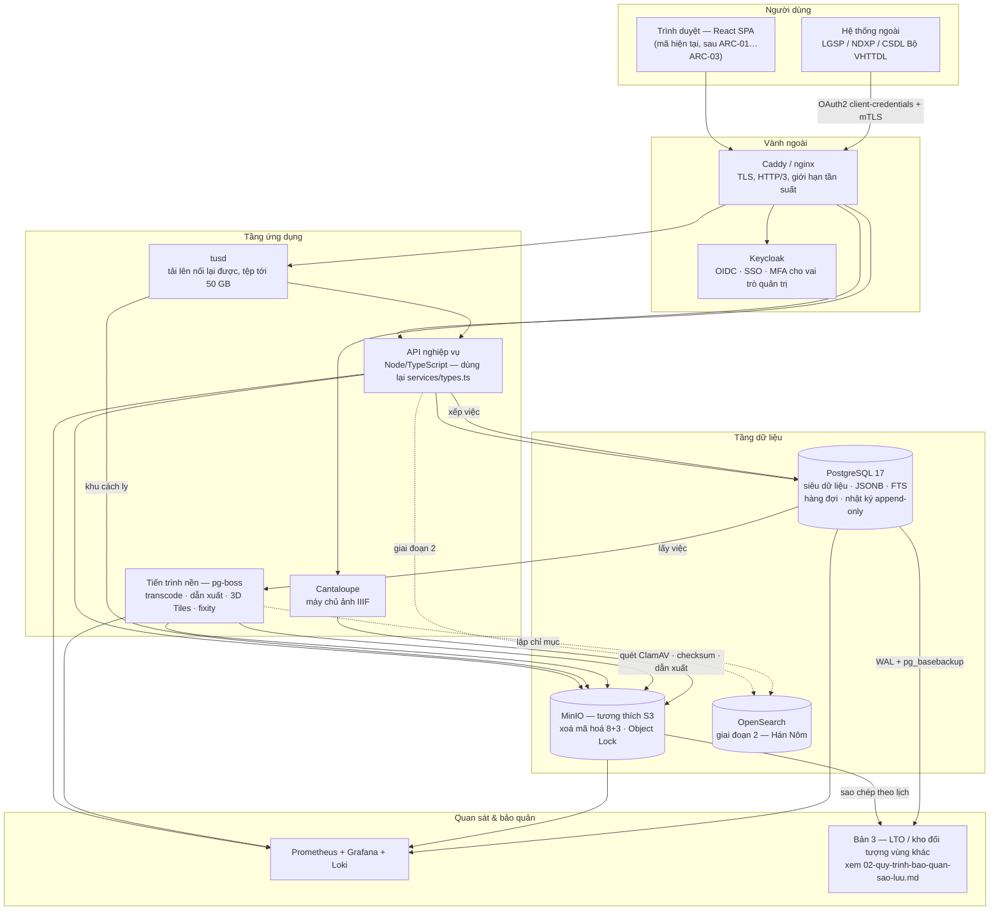

# Audit 05 — Kiến trúc code & khả năng lên production
> Người thực hiện: subagent lăng kính kiến trúc · Ngày: 12/08/2026

> **Ảnh chụp mã nguồn.** Phần lớn báo cáo dựa trên trạng thái mã lúc **~13:50 ngày 12/08/2026** (104 tệp TS/TSX, khi đó 14.768 dòng). Trong lúc audit tạm dừng, mã đã được sửa tiếp lúc **17:31–17:32** — thêm `app/src/data/permissions.ts`, `app/tests/permissions.test.ts`, `app/src/components/AddUserModal.tsx` và sửa `AuthContext.tsx`, `UsersPage.tsx`, `UserDetailPage.tsx`, `userService.ts`. Tôi đã **kiểm lại toàn bộ các khẳng định bị ảnh hưởng** trên bản 17:32 (nay **15.515 dòng**); những chỗ số liệu đổi đã được cập nhật và đánh dấu **[cập nhật 17:32]**. Ba phát hiện cốt lõi về phân quyền **vẫn đúng nguyên vẹn** sau thay đổi này.

---

## 1. Tóm tắt điều hành

**Kết luận một câu:** đây là một bản trình diễn được viết cẩn thận hơn hẳn mặt bằng hồ sơ thầu — kiểu dữ liệu chặt, số liệu suy diễn chứ không ghi cứng, `tsc` sạch — nhưng nó **chưa phải là một ứng dụng có thể nối vào backend thật mà không viết lại**, vì một lý do kỹ thuật duy nhất và có thể sửa được: **toàn bộ lớp dịch vụ là đồng bộ**.

Ba nhóm phát hiện, xếp theo mức độ nghiêm trọng.

### 1.1. Chặn đường lên production (phải sửa trước khi nối API)

| # | Vấn đề | Bằng chứng | Vì sao chặn |
|---|---|---|---|
| 1 | **Không có ranh giới bất đồng bộ.** Mọi phương thức dịch vụ trả về giá trị trực tiếp, không `Promise`. | `app/src/services/mock/assetService.ts:21-38` — `list(): Asset[]`, `get(id): Asset \| undefined`, `search(query): Asset[]` | Nối API thật buộc đổi chữ ký của **cả 6 dịch vụ** và **mọi điểm gọi** (24 điểm gọi `services.*` đã đếm được). Đây không phải "thay implementation", đây là viết lại tầng gọi. |
| 2 | **Kho trạng thái nội bộ của mock bị rò rỉ vào hợp đồng dịch vụ.** | `assetService.ts:22` `readonly store: Store<Asset[]>`; tương tự `uploadService.ts:27`, `connectionService.ts:18` | Hợp đồng dịch vụ tự nó khẳng định "có một mảng toàn bộ asset nằm sẵn trong bộ nhớ client". Với backend thật, tiền đề đó sai — không thể có `Store<Asset[]>` chứa 100.000 bản ghi. Interface phải bỏ, kéo theo `useStore(...)` ở 5 chỗ. |
| 3 | **Phân quyền chỉ là trang trí.** `Capabilities` được tính đầy đủ nhưng **không component nào đọc**; `RequireAuth` chỉ kiểm tra đã đăng nhập, không kiểm tra vai trò. | `context/AuthContext.tsx:76` cấp `can: capsForRole(role)`; grep toàn repo: 0 điểm tiêu thụ ngoài chính file đó. `App.tsx:39-41` + `AuthContext.tsx:89-94` | Tài khoản "Chỉ xem" gõ thẳng `/users`, `/api-keys`, `/backup`, `/compliance` vào thanh địa chỉ là vào được toàn bộ màn quản trị. Trong demo thì vô hại; nhưng nó tạo ấn tượng sai rằng phân quyền "đã có", dẫn tới rủi ro bỏ qua ở giai đoạn backend. |

### 1.2. Nợ kỹ thuật sẽ phát nổ khi có dữ liệu thật

Lọc/tìm kiếm chạy hoàn toàn phía client, quét tuyến tính, **không debounce, không chỉ mục**. Đo thực tế (mục 4): ở **~3.000 bản ghi** mỗi lần gõ phím đã vượt ngân sách 16 ms/khung hình; ở **10.000 bản ghi** là **49,5 ms/lần lọc**; ở **50.000** là **235 ms**. Dữ liệu thật của dự án ở mốc hàng chục nghìn bản ghi số — nghĩa là **kiến trúc lọc hiện tại vỡ trước khi dữ liệu thật nạp xong**.

Không có `ErrorBoundary`, không có `Suspense`, không có skeleton — grep toàn repo trả 0. Hôm nay không sao vì không có gì để lỗi; ngày có mạng thật thì mỗi lỗi mạng là một trang trắng.

Gói build là **một chunk duy nhất 1,14 MB** (`app/dist/assets/index-C6DHV677.js`, 302 KB sau gzip), trong đó `three.js` được nạp ngay từ màn đăng nhập dù chỉ dùng ở một màn chi tiết.

### 1.3. Điểm mạnh thật sự (nên giữ và mang đi khoe)

Ba điểm dưới đây tốt hơn mặt bằng chung và **nên được nêu trong hồ sơ thầu**:

- **Không có một con số ghi cứng nào trong tầng hiển thị.** Mọi dung lượng đều tính từ công thức vật lý (`data/sizeFormulas.ts`), mọi bản ghi sinh từ hạt giống đối tượng vật lý (`data/assets/generator.ts:55-99`) bằng RNG có seed cố định (`data/objects/artifactsGenerated.ts:13`) nên tập dữ liệu ổn định qua mỗi lần tải. Ba hằng số then chốt (WAV, ProRes, TIFF 600 dpi) kiểm chứng lại **đúng** (mục 3.11).
- **Hướng mô hình hoá đúng.** Tách trục `objectClass` (đối tượng di sản) khỏi `DigitalForm` (sản phẩm số hoá) — `services/types.ts:29-32` — và danh sách đối tượng lấy từ hồ sơ hiện vật rồi mới LEFT JOIN bản ghi số vào (`data/assets.ts:22-30`, `pages/ObjectsPage.tsx:85-107`). Đây chính xác là cách một hệ thống kiểm kê di sản phải làm, và là thứ phân biệt sản phẩm này với một CMS ảnh thông thường.
- **An toàn kiểu ở mức tốt.** `npx tsc -b --noEmit` → **exit 0, không lỗi**. `npm run lint` → **exit 0**, 6 cảnh báo đều thuộc loại mỹ phẩm (`react/only-export-components`). Toàn repo **0 lần dùng `any`**, chỉ 4 lần `!` non-null.

### 1.4. Khuyến nghị điều hành

| Giai đoạn | Việc phải làm | Người-ngày |
|---|---|---|
| **Trước buổi chấm thầu** — làm được hoàn toàn trên mock | `ARC-10` (git + CI), `ARC-07` (tách chunk `three.js`), `ARC-12` (tương phản + hộp thoại), `ARC-19` (vệ sinh mã), `ARC-05` (ErrorBoundary + skeleton), `ARC-01` (`Promise` cho lớp dịch vụ), `ARC-06` phần client, `ARC-04` phần `utils/`+`data/` | **18–27** |
| **6 tháng đầu sau trúng thầu** | `ARC-16` (đặc tả API nội bộ), `ARC-14` (thu nhận OAIS), `ARC-03` (phân trang phía máy chủ), `ARC-04` (bộ test), `ARC-02` (TanStack Query), `ARC-06` phần máy chủ, `ARC-15` (nhật ký bất biến), `ARC-08`, `ARC-09`, `ARC-11` phần 1–2, `ARC-18` lần đầu | **105–153** |
| **18 tháng** | `ARC-13` (3D Tiles), `ARC-17` (quan sát hệ thống), `ARC-11` phần 3 (i18n), `ARC-18` định kỳ | **40–63** |
| | **TỔNG** | **163–243** |

Chi phí hạ tầng tự vận hành cho khối lượng suy ra được **≈ 105 TB bản gốc** (⇒ ~346 TB đĩa thô sau 3-2-1 và xoá mã hoá): **CAPEX phần cứng ước 56.000–89.000 USD**, **OPEX 18.600–29.800 USD/năm**, **TCO 5 năm ≈ 161.000–256.000 USD** — chưa gồm nhân công dựng backend (tính riêng theo người-ngày ở mục 8) và **chưa gồm giấy phép thương mại MinIO, khoản rủi ro ngân sách lớn nhất chưa xác định** (mục 6.6). Mọi đơn giá là **giả định chưa kiểm chứng bằng báo giá thật**, ghi rõ kèm phép tính ở mục 6.3 để thay số vào.

Một quyết định chính sách chưa được chốt ở tài liệu nào lại chi phối toàn bộ dự toán: **có giữ lại ảnh nguồn photogrammetry hay không**. Ảnh nguồn chiếm **~63 %** tổng dung lượng; không giữ thì bản gốc tụt từ 105 TB xuống ~21 TB. Khuyến nghị **giữ, nhưng đẩy thẳng xuống băng từ** (mục 6.1, 6.8).

---

## 2. Bảng chấm điểm chất lượng code

Thang 5 điểm. "Bằng chứng" là đường dẫn `file:dòng` hoặc kết quả lệnh chạy thật.

| # | Hạng mục | Điểm | Bằng chứng | Hệ quả |
|---|---|:---:|---|---|
| 1 | **Ranh giới bất đồng bộ** | **1/5** | `services/mock/assetService.ts:21-38` — 8/8 phương thức đồng bộ. Toàn bộ 6 dịch vụ: **0 lần xuất hiện `Promise`/`async`** trong `src/services/` | Không thể thay mock bằng API thật mà không sửa mọi điểm gọi. Đây là món nợ đắt nhất. |
| 2 | **Trừu tượng hoá lớp dịch vụ** | **2/5** | Ý tưởng đúng (`services/index.ts:8-9`), nhưng interface định nghĩa **bên trong** file mock rồi re-export (`services/index.ts:19-24`); 7 điểm import thẳng `services/mock/*` bỏ qua cổng vào; 50 câu lệnh import `data/` trực tiếp từ `pages/`+`components/` trong 18 file, trái với chính lời cam kết ở `services/types.ts:1-3` | Cổng vào duy nhất không được thực thi. Đổi mock → thật vẫn phải sờ vào 18 file tầng hiển thị. |
| 3 | **Quản lý trạng thái** | **2/5** | `services/store.ts` — 24 dòng, không so sánh bằng nhau trước khi thông báo (`:14-18`), không gom lô, `listeners.forEach` (`:17`) không bọc try/catch. Chỉ **5 điểm đăng ký** (`useStore`) so với **20+ điểm đọc** | Giao diện đúng **nhờ may mắn**: react-router tháo/gắn lại component mỗi lần điều hướng nên số liệu được đọc lại. Không có mạng thì không lộ; có mạng thì lộ hết (mục 3.2). |
| 4 | **An toàn kiểu — cơ chế** | **4/5** | `tsconfig.app.json` bật `strict`, `noUnusedLocals`, `noUnusedParameters`, `noFallthroughCasesInSwitch`, `erasableSyntaxOnly`. `npx tsc -b --noEmit` → **exit 0**. **0 lần `any`** toàn repo | Nền tảng vững. Trừ điểm vì thiếu `noUncheckedIndexedAccess` và `exactOptionalPropertyTypes`. |
| 5 | **An toàn kiểu — mô hình miền** | **2/5** | `AssetStatus` là union 11 giá trị rất tốt (`services/types.ts:12-23`), **nhưng**: `User.role: string` (`:123`), `Connection.status: string` (`:136`), `ShareRequest.status: string` (`:156`), `ComplianceItem.state: string` (`:161`), `ApiEndpoint.status: string` (`:148`), `UploadItem.id: number \| string` (`:165`), ngày tháng là chuỗi `dd/mm/yyyy` (`:76`, `:113`) | Hậu quả dây chuyền nghiêm trọng: vì `User.role: string` nên `Role` ở `AuthContext.tsx:16` **suy biến thành `string`** → mất toàn bộ kiểm tra vét cạn vai trò (mục 3.3). |
| 6 | **Kiểm thử** | **2/5** *[cập nhật 17:32]* | **2 tệp test, 141 dòng, 14 test — tất cả đều đạt.** `tests/canChi.test.ts` (33 dòng, 3 test) + `tests/permissions.test.ts` (108 dòng, 11 test, mới thêm lúc 17:32) trên **15.515 dòng** mã ⇒ **0,91 %**. Vẫn không có Vitest/Testing Library/Playwright trong `package.json` | Đã tốt hơn 4 lần và phủ đúng phần rủi ro nhất (ma trận phân quyền, bốn mắt, nhật ký append-only). Nhưng vẫn **không có test component, không có test đầu-cuối**, và các mô-đun thuần tuý còn lại (mã định danh, lịch trạng thái, công thức dung lượng, chuẩn hoá tìm kiếm) vẫn trống. |
| 7 | **Hiệu năng ở quy mô thật** | **2/5** | Lọc tuyến tính không chỉ mục (`utils/search.ts:21-34`), không debounce (`layout/Header.tsx:37-47`), phân trang vẽ **toàn bộ** nút số trang (`components/Pagination.tsx:12`), không ảo hoá | Đo được: 10.000 bản ghi → 49,5 ms/lần gõ phím; 50.000 → 235 ms; phân trang 10.000 bản ghi → **1.000 nút DOM**. Mục 4. |
| 8 | **Hiển thị 3D** | **2/5** | `components/StelePreview.tsx` — hình khối **dựng thủ tục**, không có `GLTFLoader`, không LOD/Draco/meshopt/3D Tiles (`:23-75`). Dọn dẹp khá kỹ (`:129-147`) nhưng thiếu `renderer.forceContextLoss()` | Đủ đẹp cho demo, **không phải** đường đi cho mô hình rùa bia 50 triệu tam giác. Thiếu `forceContextLoss()` làm rò ngữ cảnh WebGL khi vào/ra màn chi tiết nhiều lần (trình duyệt giới hạn ~16 ngữ cảnh). |
| 9 | **Phân quyền phía client** | **1/5** *[đã kiểm lại 17:32 — vẫn giữ nguyên]* | `can` được cấp phát ở `AuthContext.tsx:76` (`capsForRole(role)`) nhưng **không component nào đọc** — grep xác nhận 0 điểm tiêu thụ. `filterNavByRole` (`layout/navConfig.ts:19-21`) chỉ **ẩn menu**. `RequireAuth` (`AuthContext.tsx:89-94`) chỉ kiểm tra `authed`, `App.tsx:39-41` không có cổng theo vai trò | Đường dẫn trực tiếp `/users`, `/api-keys`, `/backup` vẫn mở cho mọi vai trò đã đăng nhập. Mục 3.3. |
| 10 | **Đa ngữ (i18n)** | **2/5** | Khung tốt: khoá suy ra kiểu đệ quy (`i18n/index.ts:18-22`), fallback về `vi` (`:51-56`). Nhưng chỉ **152 lời gọi `t()` trong 11 file**, trong khi **1.258 dòng `.tsx` chứa chữ tiếng Việt có dấu**; `currentLocale` là biến cấp module (`:28`) nên `setLocale` **không kích hoạt render lại**; nút en/fr bị vô hiệu hoá cứng (`components/SettingsModal.tsx:139`) | ADR-0015 đã chấp nhận "khung trước, dịch sau" — hợp lý. Nhưng cơ chế đổi ngôn ngữ **hiện không chạy được kể cả khi có bản dịch**, đó là lỗi kiến trúc chứ không phải nợ nội dung. |
| 11 | **Khả năng tiếp cận (a11y)** | **3/5** | `components/Modal.tsx:19-50` có bẫy tiêu điểm + Escape + hoàn tiêu điểm — **tốt**. Nhưng `Modal` **không dùng portal** (chỉ `EvidenceViewer.tsx:59` và `SettingsModal.tsx:47` dùng), trái mô tả ADR-0013; `ConfirmModal.tsx:34` gọi `<Modal>` **không truyền `label`** → hộp thoại không có tên; chủ đề `crimson` có tương phản **1,81:1** (`theme/themes.ts:31`) | Nền a11y trên trung bình so với mặt bằng, nhưng có 1 lỗi WCAG AA rõ ràng và 1 sai lệch ADR ↔ mã. |
| 12 | **Xử lý lỗi, trạng thái rỗng/tải** | **1/5** | grep `ErrorBoundary\|componentDidCatch\|Suspense\|React.lazy\|skeleton` → **0 kết quả**. Trạng thái rỗng có (`pages/AssetsPage.tsx:121`). Trạng thái tải: đúng **1** chỗ (`pages/LoginPage.tsx:73`) | Một ngoại lệ trong bất kỳ trang nào làm trắng toàn bộ ứng dụng. Với backend thật, đây là chế độ hỏng mặc định. |
| 13 | **Build & CI** | **2/5** | Không có kho git (`git status` → *not a git repository*), không có `.github/workflows`. Build ra **một chunk 1,14 MB** (302 KB gzip). `package.json` không có `typecheck`, không có `format`, `test` dùng cờ thử nghiệm `--experimental-strip-types` | Không có cổng chất lượng tự động. `tsc` sạch hôm nay là nhờ kỷ luật cá nhân, không có gì bảo đảm ngày mai. |
| 14 | **Suy diễn dữ liệu & tính nhất quán** | **5/5** | `data/selectors.ts` + `data/sizeFormulas.ts` + `data/assets/generator.ts:55-99`: **không một con số nào ghi cứng ở tầng hiển thị**. Badge thanh bên tính từ chính nguồn của trang (`layout/Sidebar.tsx:65`). Bộ sưu tập tính lại mỗi lần gọi (`collectionService.ts:20-33`) | Đây là hạng mục **mạnh nhất** của sản phẩm. Nó loại bỏ hẳn nhóm lỗi "số trên thẻ khác số trong trang" vốn là thứ hay bị bắt lỗi nhất khi chấm thầu. |
| 15 | **Tài liệu trong mã** | **5/5** | Chú thích tiếng Việt giải thích **vì sao**, không phải **cái gì** — ví dụ `data/assets.ts:22-30` giải thích vì sao danh sách đối tượng không được suy ngược từ `ASSETS`; `data/selectors.ts:130-135` giải thích vì sao tập rỗng phải trả `null` chứ không phải 100 % | Người tiếp quản đọc hiểu được ý đồ. Hiếm. |

### 2.1. Điểm tổng hợp

| Nhóm | Trọng số | Điểm TB nhóm | Điểm có trọng số |
|---|---:|---:|---:|
| Sẵn sàng nối backend (1, 2, 3) | 30 % | 1,67 | 0,50 |
| An toàn kiểu & mô hình miền (4, 5) | 10 % | 3,00 | 0,30 |
| Kiểm thử & CI (6, 13) | 20 % | 2,00 | 0,40 |
| Hiệu năng & 3D (7, 8) | 15 % | 2,00 | 0,30 |
| Bảo mật/phân quyền (9) | 10 % | 1,00 | 0,10 |
| Trải nghiệm & a11y & i18n (10, 11, 12) | 10 % | 2,00 | 0,20 |
| Chất lượng dữ liệu & tài liệu (14, 15) | 5 % | 5,00 | 0,25 |
| **Tổng** | **100 %** | | **2,05 / 5** |

**Đọc con số này cho đúng.** 2,05/5 **không** có nghĩa "code tệ". Nó có nghĩa: đo bằng thước đo *"đã sẵn sàng chạy production chưa"*, sản phẩm đang ở khoảng **41 %** chặng đường — điều hoàn toàn bình thường và đúng kỳ vọng với một bản trình diễn hồ sơ thầu chưa có backend. Đo bằng thước đo *"chất lượng thủ công của phần đã viết"* thì điểm sẽ là **4/5**. Hai thước đo khác nhau, và mục 8 là danh sách việc để chuyển từ thước đo thứ hai sang thước đo thứ nhất.

---

## 3. Phân tích chi tiết Phần A — nợ kỹ thuật hiện tại

### 3.1. Lớp dịch vụ: ý tưởng đúng, thực thi hở ở bốn chỗ

Ý tưởng kiến trúc được phát biểu rõ ràng ở `services/index.ts:8-9`:

> "Single entry point components import — swap any mock/* implementation for a real API-backed one here later without touching call sites."

Mục tiêu đúng. Nhưng bốn chi tiết làm lời hứa "without touching call sites" không giữ được.

**(a) Toàn bộ hợp đồng là đồng bộ — đây là vấn đề số một của cả bản audit.**

`services/mock/assetService.ts:21-38`:

```ts
export interface AssetService {
  readonly store: Store<Asset[]>;
  list(): Asset[];
  get(id: number): Asset | undefined;
  advanceStatus(id: number): Asset | undefined;
  ...
  search(query: string): Asset[];
}
```

Không có `Promise` nào trong toàn bộ `src/services/`. Hệ quả cụ thể khi nối API thật:

- `list(): Asset[]` phải thành `list(params): Promise<Page<Asset>>`. Mọi điểm gọi phải đổi từ biểu thức thành hiệu ứng — 24 điểm gọi `services.*` đã đếm.
- `get(id): Asset | undefined` — `undefined` hiện nghĩa là "không tìm thấy". Với mạng thật, `undefined` còn có thể nghĩa là "chưa tải xong", "hết thời gian chờ", "403". Ba trạng thái khác nhau bị nén vào một giá trị.
- `advanceStatus(id)` trả về `Asset` mới **ngay lập tức**. Với API thật, giữa lúc bấm nút và lúc máy chủ xác nhận có một khoảng thời gian mà giao diện phải biểu diễn — hoặc bằng cập nhật lạc quan có đường lùi, hoặc bằng trạng thái chờ. Cấu trúc hiện tại không có chỗ cho cả hai.
- `requestRevision` và `unpublish` ném `Error` đồng bộ khi thiếu lý do (`assetService.ts:58`, `:62`). Với API thật, lỗi nghiệp vụ đến **bất đồng bộ** dưới dạng phản hồi 4xx và phải được kết xuất ra giao diện, không phải ném vào ngăn xếp render của React.

**Không có `try/catch` nào bao quanh các lời gọi này ở tầng trang** — nên hôm nay một `Error` ném ra từ `requestRevision` sẽ leo thẳng lên và, vì không có `ErrorBoundary` (mục 3.10), làm trắng ứng dụng.

**(b) Kho trạng thái nội bộ bị đưa vào hợp đồng công khai.**

`assetService.ts:22`, `uploadService.ts:27`, `connectionService.ts:18` — và **[cập nhật 17:32]** nay thêm `userService.ts:29` — đều khai báo `readonly store: Store<...>` **ngay trong interface**. Đây không phải chi tiết cài đặt bị lộ tình cờ — nó là **một phần của hợp đồng**, và tầng hiển thị đã tiêu thụ nó ở 5 chỗ:

| File:dòng | Cách dùng |
|---|---|
| `pages/UploadPage.tsx:45` | `useStore(uploadStore)` |
| `pages/UploadPage.tsx:46` | `useStore(assetStore)` |
| `pages/ObjectDossierPage.tsx:132` | `useStore(services.assets.store)` |
| `pages/AssetDetailPage.tsx:43` | `useStore(assetStore)` |
| `pages/SharePage.tsx:18` | `useStore(connectionSyncStore)` |

Hợp đồng này ngầm khẳng định *"tồn tại một mảng chứa toàn bộ asset trong bộ nhớ trình duyệt"*. Với 100.000 bản ghi (≈ 69 MB JSON, đo ở mục 4) tiền đề đó sai. Nên `store` **phải biến mất khỏi interface**, và 5 điểm trên phải viết lại — đó chính là "touching call sites" mà `services/index.ts:8-9` hứa sẽ tránh được.

**(c) Interface được định nghĩa bên trong file cài đặt.**

`services/index.ts:19-24` re-export kiểu **từ chính các file mock**:

```ts
export type { AssetService } from './mock/assetService';
export type { AuditService } from './mock/auditService';
...
```

Hợp đồng sống trong cài đặt. Muốn viết `HttpAssetService` phải import kiểu từ `mock/assetService`, tạo phụ thuộc ngược đời: cài đặt thật phụ thuộc cài đặt giả. Khắc phục rẻ (chuyển các interface sang `services/contracts.ts`, mock `implements` nó) nhưng phải làm **trước** khi có cài đặt thứ hai, không phải sau.

**(d) Cổng vào duy nhất không được thực thi.**

Bảy điểm import thẳng vào `services/mock/*`, bỏ qua `services/index.ts`:

| File:dòng | Import |
|---|---|
| `components/EvidenceViewer.tsx:15` | `auditService` |
| `pages/InventoryPage.tsx:13` | `auditService` |
| `pages/UploadPage.tsx:15` | `assetStore` |
| `pages/UploadPage.tsx:16` | `uploadService, uploadStore` |
| `pages/SharePage.tsx:8` | `connectionService, connectionSyncStore` |
| `pages/AssetDetailPage.tsx:34` | `assetStore, assetService` |
| `pages/AssetDetailPage.tsx:35` | `auditService` |

Nghiêm trọng hơn: **50 câu lệnh import trực tiếp từ `data/`** trong **18 file** thuộc `pages/`, `components/`, `layout/`. Điều này trái với chính cam kết viết ở `services/types.ts:1-3`:

> "Components only ever import these — never `src/data` directly."

Các file vi phạm: `ObjectsPage`, `UserDetailPage`, `BackupPage`, `DashboardPage`, `ReportsPage`, `UploadPage`, `InventoryPage`, `CollectionDetailPage`, `ObjectDossierPage`, `AssetsPage`, `AssetDetailPage`, `EvidenceViewer`, `CompliancePage`, `ApiKeysPage`, `MissingValueField`, `AssetTable`, `PhysicalSpecsForm`, `SettingsModal`.

Một phần là vô hại (`data/taxonomy.ts` là nhãn hiển thị tĩnh, đúng ra nên nằm ở `i18n/`). Nhưng phần còn lại (`data/dashboard.ts`, `data/compliance.ts`, `data/physicalSpecsData.ts`, `data/metadataFields.ts`) là **dữ liệu nghiệp vụ** mà backend thật sẽ phải cung cấp, và hiện đang được trang đọc thẳng, không qua dịch vụ nào cả. Những trang đó **chưa có đường di trú**.

Khuyến nghị thực thi bằng máy chứ không bằng lời nhắc: một quy tắc `no-restricted-imports` cấm `pages/**` và `components/**` import `data/**` (ARC-09).

### 3.2. Quản lý trạng thái: đúng nhờ may mắn

`services/store.ts` là 24 dòng gọn gàng ghép với `useSyncExternalStore` (`services/useStore.ts:5-7`) — lựa chọn đúng cho phạm vi mock. Ba giới hạn:

1. **Không so sánh trước khi thông báo** (`store.ts:14-18`): mọi `setState` đều đánh thức mọi người nghe, kể cả khi trạng thái không đổi.
2. **Không cách ly lỗi** (`store.ts:17`): `listeners.forEach((l) => l())` — một người nghe ném lỗi thì những người sau **không bao giờ được gọi**. Giao diện lệch nhau âm thầm.
3. **Không có khái niệm "đang tải"/"lỗi"** — chỉ có dữ liệu.

Nhưng vấn đề nặng hơn cả ba điều trên là **tỷ lệ đăng ký/đọc**: 5 điểm `useStore` so với **hơn 20 điểm đọc**. Danh sách các điểm đọc **không** đăng ký:

| File:dòng | Đọc gì |
|---|---|
| `pages/AssetsPage.tsx:44` | `services.assets.list()` |
| `pages/DashboardPage.tsx:23-24` | `services.assets.list()`, `services.audit.list()` |
| `pages/ReportsPage.tsx:73` | `services.assets.list()` |
| `pages/InventoryPage.tsx:149` | `services.assets.list()` |
| `pages/BackupPage.tsx:90` | `services.assets.list()` |
| `pages/ObjectsPage.tsx:128` | `services.assets.list()` |
| `pages/CollectionsPage.tsx:9` | `services.collections.list()` |
| `pages/LogsPage.tsx:7` | `services.audit.list()` |
| `pages/UsersPage.tsx:8` | `services.users.list()` |
| `pages/CollectionDetailPage.tsx:28,37` | `services.collections.*` |
| `layout/Sidebar.tsx:65` | `services.assets.list().length` (badge) |
| `layout/Header.tsx:17` | `services.collections.getBySlug(...)` |

Hôm nay giao diện vẫn đúng — nhưng **vì react-router tháo và gắn lại component mỗi lần điều hướng**, nên số liệu được đọc lại từ đầu. Đó là sự đúng đắn *tình cờ*, không phải *thiết kế*. Hai hệ quả:

- Ngay bây giờ đã có một lỗi lộ ra: `layout/Sidebar.tsx:65` vẽ badge số lượng asset nhưng thanh bên **không tháo/gắn lại** khi điều hướng trong cùng AppShell. Badge chỉ được cập nhật nhờ AppShell render lại theo route — tức là ăn may lần thứ hai.
- Tệ hơn: `pages/InventoryPage.tsx:63` gọi `services.users.list()` ở **cấp module**, tức là chạy đúng một lần lúc nạp bundle và **đóng băng vĩnh viễn**. Với mock (mảng hằng) thì vô hại; với API thật thì đây là lời gọi mạng lúc import — một lỗi nghiêm trọng.

**Điều gì hỏng khi có mạng thật.** Store thủ công không có: trạng thái `isLoading`/`isError`, thử lại có lùi theo cấp số nhân, khử trùng lặp yêu cầu (hôm nay `collectionService.list()` tính lại toàn bộ mỗi lần gọi — `collectionService.ts:36-38`, với API thật là N+1 lời gọi mạng), vô hiệu hoá bộ đệm sau khi ghi, cập nhật lạc quan có đường lùi, huỷ yêu cầu khi component tháo, chống điều kiện tranh chấp khi hai lần gõ phím trả về không đúng thứ tự. Viết lại tất cả bằng tay là **20–30 người-ngày** và sẽ có lỗi; TanStack Query cho sẵn tất cả (ARC-02).

### 3.3. Phân quyền: `Capabilities` là mã chết, và `Role` đã suy biến thành `string`

> *[cập nhật 17:32]* Mục này đã được kiểm lại sau khi `AuthContext.tsx` được sửa. Bảng `CAPS` gõ tay đã được **bỏ đi và thay bằng `capsForRole()` suy ra từ ma trận ở `data/permissions.ts`** — một cải thiện thật: chú thích mới ở `AuthContext.tsx:18-22` ghi rõ hai bảng song song **đã thực sự lệch nhau** (ma trận cấp Duyệt/Xuất bản cho vai trò Quản trị, bảng `CAPS` thì không). Tuy vậy **cả ba phát hiện dưới đây vẫn đúng nguyên vẹn**.

Mô hình quyền `read`/`write`/`approve`/`publish`/`admin` — tách quyền phê duyệt khỏi quyền xuất bản đúng theo ADR-0011 — nay nằm ở `data/permissions.ts` và được đưa vào context tại `AuthContext.tsx:76` (`can: capsForRole(role)`).

**Không component nào đọc nó.** Grep toàn repo cho `can.read|can.write|can.approve|can.publish|can.admin` trả về **0 kết quả**; `can` chỉ xuất hiện ở chính `AuthContext.tsx` (dòng 30 khai báo kiểu, dòng 76 cấp phát). Ba trang có gọi `useAuth()` — `pages/InventoryPage.tsx:148`, `pages/AssetDetailPage.tsx:47`, `layout/Sidebar.tsx:54` — nhưng tất cả chỉ lấy `user` và `role`, không lấy `can`.

Cổng duy nhất thực sự hoạt động là `filterNavByRole` (`layout/navConfig.ts:19-21`), và nó **chỉ ẩn mục menu**. `App.tsx:39-41` bọc toàn bộ AppShell trong `RequireAuth`, mà `RequireAuth` (`AuthContext.tsx:89-94`) chỉ kiểm tra `authed`:

```ts
export function RequireAuth({ children }: { children: ReactNode }) {
  const { authed } = useAuth();
  ...
  if (!authed) return <Navigate to="/login" replace ... />;
  return <>{children}</>;
}
```

Không có tham số vai trò. Vì vậy một phiên đăng nhập vai trò "Chỉ xem" gõ trực tiếp `/users`, `/api-keys`, `/backup`, `/compliance` sẽ **vào được đầy đủ**, bất chấp `roles: ['Quản trị']` khai báo ở `navConfig.ts:79`, `:87`, `:109`.

**Lỗi kiểu nằm dưới đáy.** `AuthContext.tsx:16`:

```ts
export type Role = (typeof USERS)[number]['role'];
```

`USERS` được chú kiểu tường minh là `User[]` (`data/users.ts:9`), và `User.role` là `string` (`services/types.ts:123`). Nên **`Role` chính là `string`** — không phải union 5 vai trò như tên gọi gợi ý. Hệ quả dây chuyền:

- `capsForRole(role)` nhận vào `string` chứ không phải union, nên **không được kiểm tra vét cạn**. Thêm vai trò mới, TypeScript **im lặng**, và vai trò đó rơi vào nhánh mặc định — chỉ đọc. Chế độ hỏng an toàn, nhưng âm thầm.
- Hai lần ép kiểu `as Role` (`:45`, `:71`) là **thao tác rỗng** — chúng ép `string` thành `string`.
- `filterNavByRole(items, role: string)` (`navConfig.ts:19`) và `roles?: string[]` (`:15`) so khớp **chuỗi tự do**. Gõ sai `'Quản Trị'` (hoa/thường khác) là mục menu biến mất vĩnh viễn, không lỗi biên dịch.

Sửa: khai báo `USERS` bằng `as const satisfies readonly User[]` và đặt `Role` là union thật (ARC-06). Việc này rẻ và làm sáng ra ngay các chỗ so khớp chuỗi lỏng lẻo. **Lưu ý:** đợt sửa lúc 17:32 đã dọn được sự trùng lặp chính sách (bỏ bảng `CAPS` song song) nhưng **chưa chạm tới lỗi kiểu này** — `Role` vẫn là `string`.

**Giới hạn cần nói thẳng trong hồ sơ thầu.** Phân quyền phía client **không phải là phân quyền**, dù có sửa hết những điều trên. Nó chỉ là trải nghiệm người dùng. Mọi quy tắc trong `CAPS` phải được thực thi lại ở máy chủ; nguyên tắc bốn mắt của ADR-0011 phải là **ràng buộc trong cơ sở dữ liệu** (một `CHECK` hoặc trigger bảo đảm `approved_by <> submitted_by`), không phải một câu `if` trong React. Mục 5.4 trình bày cách đặt.

### 3.4. Mô hình kiểu miền: chặt ở chỗ khó, lỏng ở chỗ dễ

Phần làm tốt đáng ghi nhận: `AssetStatus` (`services/types.ts:12-23`) là union 11 giá trị **kèm chú thích giải thích hai trạng thái ngoài luồng tuần tự** — chính xác là cách nên mô hình hoá một máy trạng thái nghiệp vụ. `ObjectClass`, `DigitalForm`, `RelationKind` (`:29`, `:32`, `:41`) đều là union chặt.

Nhưng ngay cạnh đó, các trường lẽ ra dễ hơn nhiều lại để chuỗi tự do:

| Dòng | Trường | Kiểu hiện tại | Nên là |
|---|---|---|---|
| `types.ts:123` | `User.role` | `string` | union 5 vai trò → kéo theo sửa `Role` (mục 3.3) |
| `types.ts:136` | `Connection.status` | `string` | `'Hoạt động' \| 'Tạm dừng' \| 'Lỗi'` |
| `types.ts:137` | `Connection.sync` | `string` | trùng khái niệm với `ConnectionSyncState.freq` (`:130`) đã là union — hai nguồn sự thật |
| `types.ts:148` | `ApiEndpoint.status` | `string` | union |
| `types.ts:156` | `ShareRequest.status` | `string` | union — đang được so khớp bằng chuỗi ở `pages/DashboardPage.tsx:39-40` (`r.status === 'Chờ duyệt'`), gõ sai là đếm ra 0 mà không ai biết |
| `types.ts:161` | `ComplianceItem.state` | `string` | union |
| `types.ts:165` | `UploadItem.id` | `number \| string` | một kiểu duy nhất; hiện `addUpload` sinh `number` (`uploadService.ts:44`) còn `confirmBatch` sinh **số thực** `Date.now() + Math.random()` (`:60`) |

Hai vấn đề mô hình hoá khác:

**Ngày tháng là chuỗi hiển thị.** `Asset.updated: string` ở dạng `'dd/mm/yyyy'` (`types.ts:76`) và `LogEntry.time: string` (`:113`). `data/selectors.ts:59-68` phải **tách chuỗi ra để so sánh ngày**:

```ts
const [dd, mm, yyyy] = a.updated.split('/').map(Number);
```

Tệ hơn, `auditService.record` ghi `time: 'Vừa xong'` (`auditService.ts:37`) — một **nhãn hiển thị** vào chỗ đáng lẽ là dấu thời gian. **[cập nhật 17:32]** Mẫu sai này vừa **tái xuất hiện trong mã mới**: `userService.ts:48` đặt `createdAt` bằng `new Date().toLocaleDateString('vi-VN')` — lại là chuỗi hiển thị, lại mất khả năng sắp xếp và so sánh. Đây là bằng chứng cho thấy vấn đề không phải một lỗi lẻ mà là một **thói quen mô hình hoá** cần chặn bằng kiểu (ARC-19). Nhật ký kiểm toán vì thế **không thể sắp xếp theo thời gian**, và với ADR-0012 (nhật ký append-only có chuỗi băm) thì một bản ghi không có dấu thời gian máy đọc được là **không dùng được làm bằng chứng**. Phải là ISO 8601 có múi giờ ở tầng dữ liệu, định dạng ở tầng hiển thị.

**Dung lượng lưu hai lần.** `Asset.size: string` (đã định dạng) và `Asset.sizeMB: number` (`types.ts:63-66`). Chú thích nói `sizeMB` là nguồn sự thật duy nhất và `size` suy ra từ nó — đúng như `generator.ts:76-77` làm. Nhưng kiểu không ép được điều đó: bất kỳ ai cũng có thể đặt hai giá trị mâu thuẫn. Nên bỏ `size` khỏi mô hình và định dạng ở tầng hiển thị.

**Trường bị bỏ quên.** `Asset.relatedObject` (`types.ts:90`) và `RelatedObjectLink` (`:43-47`) mô hình hoá nhóm quan hệ 2 của ADR-0003 — nhưng `generator.ts:68-93` **không bao giờ đặt trường này**; nó chỉ được gắn sau bởi `applyRelations` (`data/assets.ts:19`). Nghĩa là kiểu cho phép một trạng thái mà đường sinh chính không tạo ra được. Không phải lỗi, nhưng là chỗ dễ mục ruỗng.

### 3.5. Kiểm thử: 0,91 % và vẫn chưa có khung thử *[cập nhật 17:32]*

Hai tệp test, **141 dòng, 14 test, tất cả đều đạt** (`npm test` chạy lại lúc kiểm chứng).

- `app/tests/canChi.test.ts` — 33 dòng, 3 test. Chất lượng **tốt**: kiểm 5 mốc đã đối chiếu sử liệu, 3 mốc tra cứu thêm, và tính chất chu kỳ 60 năm (`:30-33`). Chú thích ở `:5-9` ghi rõ nó ra đời vì trường này **từng bị gõ sai 3 lần**.
- `app/tests/permissions.test.ts` — 108 dòng, 11 test, **thêm lúc 17:32**. Phủ đúng phần rủi ro cao nhất: ma trận quyền khớp tài liệu, nguyên tắc bốn mắt, nhật ký append-only không sửa được, và **phát hiện đường tự nâng quyền** (vừa quản trị tài khoản vừa duyệt nội dung). Đây là loại test đúng trọng tâm.

Tỷ lệ: 141 dòng test / 15.515 dòng mã = **0,91 %** — tốt hơn 4 lần so với thời điểm bắt đầu audit, nhưng vẫn thấp, và **vẫn không có khung thử**: `package.json` chưa có Vitest, Testing Library hay Playwright, nên **không có test component và không có test đầu-cuối nào**.

Những phần logic **thuần tuý, dễ test, và có hậu quả nếu sai** hiện không có một dòng test nào:

| Mô-đun | Vì sao rủi ro nếu sai |
|---|---|
| `utils/search.ts:11-18` `normalizeForSearch` | Bỏ dấu tiếng Việt + gập `đ→d`. Sai là **không tìm thấy hiện vật**. Chưa xử lý ký tự Hán Nôm (mục 5.6). |
| `utils/assetCode.ts` `normalizeCode`, `digitalRecordCode`, `physicalObjectId` | Sinh mã định danh 5 tầng theo ADR-0004. Sai là **mã định danh bền vững bị sai**, không sửa lại được sau khi công bố. |
| `data/pipeline.ts` `nextStatus`, `PIPELINE_SEQUENCE` | Máy trạng thái phê duyệt/xuất bản. Sai là **quy trình bốn mắt bị vượt mặt**. |
| `data/sizeFormulas.ts` (11 hàm) | Toàn bộ số liệu dung lượng, và gián tiếp là **dự toán hạ tầng ở mục 6**. |
| `data/selectors.ts:112-146` `profileCompletenessPct` | ADR-0016 nói rõ tập rỗng phải trả `null`; hiện có **cả hai** biến thể (`:136` và `:142`) và không gì ngăn gọi nhầm biến thể trả 0. |
| `data/missingValues.ts` bộ 5 mã khuyết | ADR-0005. Ảnh hưởng trực tiếp mẫu số của chỉ số đầy đủ hồ sơ. |
| ~~Ma trận phân quyền~~ | ✅ **Đã được phủ** bởi `tests/permissions.test.ts` lúc 17:32. |

Chiến lược đề xuất ở ARC-04. Điểm đáng ghi nhận: đợt bổ sung 17:32 đã chọn đúng mô-đun rủi ro nhất để test trước — cách ưu tiên này nên được áp dụng tiếp cho các hàng còn lại trong bảng.

### 3.6. Hiệu năng: ba nút thắt độc lập

Chi tiết số liệu ở mục 4; đây là cơ chế.

**Nút thắt 1 — lọc tuyến tính không chỉ mục, chạy mỗi lần gõ phím.**
`layout/Header.tsx:37-47` đặt `setQuery(e.target.value)` trực tiếp trong `onChange`, **không debounce**. Giá trị chảy vào `AppUiContext` (`context/AppUiContext.tsx:35`) rồi xuống `pages/AssetsPage.tsx:46-56`, nơi `useMemo` lọc **toàn bộ mảng**. Với mỗi asset, `matchesAssetQuery` (`utils/search.ts:21-34`) gọi `normalizeForSearch` trên **7 trường**, mà mỗi lời gọi thực hiện `.toLowerCase().normalize('NFD').replace(...).replace(...)` — cấp phát 4 chuỗi trung gian. Tức là **28 phép chuẩn hoá chuỗi × số bản ghi × mỗi lần gõ phím**, không có chỉ mục dựng sẵn, không có bộ nhớ đệm.

**Nút thắt 2 — phân trang vẽ toàn bộ số trang.**
`components/Pagination.tsx:12`:

```ts
const pages = Array.from({ length: totalPages }, (_, i) => i + 1);
```

Với `PAGE_SIZE = 10` (`pages/AssetsPage.tsx:18`), 10.000 bản ghi ⇒ **1.000 nút** trong DOM, mỗi nút có `style` nội tuyến (`:34`) nên React so sánh lại thuộc tính từng nút mỗi lần render.

**Nút thắt 3 — không ảo hoá ở đâu cả.**
`components/AssetTable.tsx:29` vẽ `assets.map(...)`. Ở trang thư viện điều này an toàn vì đầu vào đã cắt trang xuống 10 dòng (`AssetsPage.tsx:60`). Nhưng các trang khác vẽ **toàn bộ** tập: `pages/InventoryPage.tsx:319` và `:389` ánh xạ toàn bộ phạm vi đợt kiểm kê, `pages/ObjectsPage.tsx:85-107` dựng lại `Map` và LEFT JOIN toàn bộ 150 đối tượng mỗi lần render. Ở 150 bản ghi là tức thì; ở 50.000 thì không.

### 3.7. Hiển thị 3D: đẹp cho demo, không phải đường đi cho dữ liệu thật

`components/StelePreview.tsx` dựng bia + rùa **bằng hình khối thủ tục** — `BoxGeometry`, `SphereGeometry` bị co giãn, `CylinderGeometry` (`:45-74`). Không có `GLTFLoader`, không có `.glb` nào được nạp. Chú thích ở `:10-15` thành thật: nó được chuyển 1:1 từ `viewer.js` của bản mockup.

**Việc dọn dẹp làm khá kỹ** (`:129-147`): huỷ vòng lặp `requestAnimationFrame`, ngắt `ResizeObserver`, gỡ 4 trình nghe sự kiện, `dispose()` renderer, 3 vật liệu và 5 + 6 hình học, gỡ phần tử DOM. Trên mặt bằng chung mã three.js trong React, đây là **trên trung bình rõ rệt**.

Hai thiếu sót:

1. **Thiếu `renderer.forceContextLoss()`.** `renderer.dispose()` giải phóng tài nguyên phía JavaScript nhưng không bảo đảm trả lại ngữ cảnh WebGL. Trình duyệt giới hạn số ngữ cảnh WebGL đồng thời (Chrome khoảng 16); vào ra màn chi tiết nhiều lần có thể làm ngữ cảnh cũ nhất bị thu hồi và các khung hình sau đó hỏng. *(cần kiểm chứng trên three.js r185 cụ thể — hành vi `dispose()` đã thay đổi qua các bản phát hành.)*
2. **Mảng phụ thuộc `[bg]`** (`:148`): đổi màu nền là **dựng lại toàn bộ cảnh**. Vô hại hôm nay (`bg` là hằng), nhưng khi nền theo chủ đề thì mỗi lần đổi chủ đề là một lần tạo lại renderer.

**Khoảng cách tới dữ liệu thật là rất lớn**, và cần nói rõ trong hồ sơ thầu để không bị hiểu nhầm là "đã có xem 3D". Rùa bia quét ở độ phân giải bảo quản là **8–14 triệu tam giác** theo chính tham số của dự án (`data/objects/artifactsGenerated.ts:68-69`, `:101-102`), cho ra tệp GLB **cỡ 350–620 MB** theo công thức của chính dự án (`data/sizeFormulas.ts:19-22`). Nạp thẳng một tệp như vậy vào trình duyệt là không khả thi. Cần: nén hình học (Draco/meshopt), phân mức chi tiết theo khoảng cách, và cắt lát không gian (3D Tiles) — ARC-13.

### 3.8. Đa ngữ: khung tốt, công tắc không nối dây

Phần thiết kế **đúng và đáng khen**: `i18n/index.ts:18-22` suy ra kiểu khoá đệ quy từ `vi.ts`, nên gõ sai khoá là **lỗi biên dịch** chứ không phải chuỗi trống lúc chạy. `en.ts:13-22` tự nhân bản cấu trúc khoá của `vi` bằng `emptyLike`, nên thêm khoá mới ở `vi` là `en`/`fr` tự có ngay (rỗng), không bao giờ lệch cấu trúc. Hàm `t()` (`:51-56`) fallback về `vi` khi chuỗi đích rỗng. ADR-0015 đã chấp nhận chiến lược "dựng khung trước, dịch sau" — hợp lý cho hồ sơ thầu.

Ba vấn đề, trong đó **một là lỗi kiến trúc thật**, hai còn lại là nợ nội dung đã được ADR chấp nhận.

**Lỗi kiến trúc — đổi ngôn ngữ không kích hoạt render lại.** `i18n/index.ts:28` giữ ngôn ngữ hiện tại trong một **biến cấp module**:

```ts
let currentLocale: Locale = 'vi';
export function setLocale(locale: Locale): void { currentLocale = locale; }
```

`useT()` (`:59-61`) chỉ đọc biến đó và trả về — **không đăng ký gì cả**. React hoàn toàn không biết biến này đổi. Nên kể cả khi `en.ts` được dịch đầy đủ, bấm nút đổi ngôn ngữ sẽ **không đổi được gì trên màn hình** cho tới lần render lại tiếp theo vì lý do khác. Chú thích ở `:24-27` và `:58` cho thấy tác giả đã biết ("chỗ cắm sẵn để sau này đọc locale từ context/store"), nhưng ở trạng thái hiện tại thì công tắc là công tắc giả. Hiện tượng này bị che khuất vì `components/SettingsModal.tsx:139` đặt `const ready = l.code === 'vi'` và **vô hiệu hoá** cả hai nút en/fr — nên không ai bấm được để phát hiện.

**Nợ nội dung (đã được ADR-0015 chấp nhận).** Đo bằng grep: **152 lời gọi `t()` trong 11 file**, trong khi **1.258 dòng `.tsx` chứa ký tự tiếng Việt có dấu**. `vi.ts` có 211 khoá. Mức độ phủ rất lệch:

| Đã dùng `t()` nhiều | Chưa dùng `t()` chút nào |
|---|---|
| `UploadPage` (55), `PhysicalSpecsForm` (30), `CoreMetadataForm` (29), `SharePage` (19) | `CompliancePage` (166 dòng có chữ Việt), `InventoryPage` (148), `UserDetailPage` (138), `AssetDetailPage` (110), `ApiKeysPage` (71), `ObjectDossierPage` (70), `ObjectsPage` (67), `DashboardPage` (28) |

Đáng chú ý: **nhãn miền nghiệp vụ nằm trong dữ liệu, không nằm trong i18n** — `AssetStatus` là chuỗi tiếng Việt (`services/types.ts:12-23`), `OBJECT_CLASS_LABELS`/`DIGITAL_FORM_LABELS` nằm ở `data/taxonomy.ts`. Nghĩa là dịch giao diện sang tiếng Anh vẫn để lại "Chờ duyệt", "Xuất bản" ở cột trạng thái. Đây là quyết định kiến trúc cần chốt trước khi dịch: mã trạng thái nên là **mã bất biến** (`PENDING_APPROVAL`) với nhãn nằm ở từ điển, chứ không phải chuỗi tiếng Việt làm khoá chính (ARC-11).

### 3.9. Khả năng tiếp cận: nền tốt, ba lỗi cụ thể

**Làm đúng:** `components/Modal.tsx:19-50` là một cài đặt hộp thoại nghiêm túc — lưu phần tử đang có tiêu điểm (`:20`), chuyển tiêu điểm vào phần tử đầu tiên (`:23`), bẫy Tab hai chiều (`:36-42`), đóng bằng Escape (`:26-29`), **hoàn trả tiêu điểm khi đóng** (`:48`). `role="dialog"` + `aria-modal="true"` (`:57-58`). Nhiều sản phẩm thương mại làm kém hơn.

**Lỗi 1 — `Modal` không dùng portal, trái mô tả ADR-0013.** ADR-0013 có tiêu đề "biến chủ đề root, modal qua portal". Nhưng `Modal.tsx:52-66` trả về JSX **tại chỗ**. `createPortal` chỉ xuất hiện ở hai nơi: `components/EvidenceViewer.tsx:59` và `components/SettingsModal.tsx:47`. Nghĩa là hộp thoại **dùng chung** — thứ bọc mọi hành động phá huỷ qua `ConfirmModal` — lại là cái **không** đi qua portal. Nó render bên trong cây DOM của trang gọi nó, thừa hưởng mọi ngữ cảnh xếp lớp (`transform`, `filter`, `overflow`, `z-index`) của tổ tiên. Với `GlassCard` có hiệu ứng kính mờ, đây là lỗi hiển thị chờ sẵn. Đây là **sai lệch ADR ↔ mã**, nên sửa một trong hai cho khớp.

**Lỗi 2 — hộp thoại xác nhận không có tên.** `Modal` nhận `label?: string` và gán vào `aria-label` (`:59`). `ConfirmModal.tsx:34` gọi `<Modal onClose={onCancel}>` — **không truyền `label`**. Nên `aria-label={undefined}`, và mọi hộp thoại xác nhận (khoá tài khoản, thu hồi khoá API, gỡ xuất bản…) được trình đọc màn hình đọc là "hộp thoại" không tên. Tiêu đề đã có sẵn ở `:36` dưới dạng `<h3>`; chỉ cần nối bằng `aria-labelledby`. Sửa mất vài phút.

**Lỗi 3 — một chủ đề vi phạm WCAG AA, và vi phạm chính ràng buộc ghi trong file.** `theme/themes.ts:6-8` tự đặt ra luật:

> "`accent` phải đủ SÁNG để chữ `ink` đọc được khi nằm trên nền accent"

Tính tỷ lệ tương phản (công thức WCAG 2.1, độ chói tương đối) cho cả 7 chủ đề, chữ `ink` trên nền `accent`:

| Chủ đề | ink | accent | Tỷ lệ | Kết luận |
|---|---|---|---:|---|
| lime | `#14140f` | `#d7ff3f` | 16,07:1 | Đạt AA |
| gold (mặc định) | `#0b3d34` | `#d4af37` | 5,77:1 | Đạt AA |
| terracotta | `#3b1410` | `#e0a458` | 7,44:1 | Đạt AA |
| olive | `#26301f` | `#b7a15c` | 5,42:1 | Đạt AA |
| **crimson** | `#151312` | `#7a1f22` | **1,81:1** | **TRƯỢT** — dưới cả ngưỡng 3:1 cho chữ lớn |
| indigo | `#1e1b4b` | `#818cf8` | 5,36:1 | Đạt AA |
| cyan | `#083344` | `#22d3ee` | 7,41:1 | Đạt AA |

Chủ đề `crimson` (`theme/themes.ts:31`) có `accent` là **đỏ sẫm** `#7a1f22`, không phải màu sáng. Mọi nút chính và nhãn trạng thái trong chủ đề này gần như không đọc được. Chú thích mô tả nó "tông nghi lễ, dùng cho bản trình chiếu" — tức là dành cho đúng tình huống dễ bị soi nhất. `theme/color.ts` có `hexToRgb`/`mix`/`sparkPts` nhưng **không có hàm tính tương phản**, nên không có gì chặn được cặp màu hỏng. Sửa: thêm hàm tỷ lệ tương phản + một test chặn (ARC-12).

**Điểm nhỏ hơn:** `components/AssetTable.tsx:30-42` đặt `role="button"` lên `<tr>`. Việc này làm hàng bấm được bằng bàn phím (tốt) nhưng **ghi đè vai trò `row`**, nên trình đọc màn hình mất quan hệ hàng–cột và điều hướng bảng. Cách chuẩn là để `<tr>` nguyên vai trò và đặt một `<a>`/`<button>` trong ô đầu.

`components/Modal.tsx:53` cho phép đóng bằng cách bấm nền — áp dụng cả cho `ConfirmModal` bọc các hành động phá huỷ. Một cú bấm lạc tay sẽ huỷ hộp thoại; ở đây điều đó an toàn (huỷ chứ không phải xác nhận), nhưng nếu người dùng đã gõ dở lý do gỡ xuất bản thì mất trắng nội dung đã gõ.

### 3.10. Xử lý lỗi, trạng thái rỗng và trạng thái tải

Grep toàn repo với `ErrorBoundary|componentDidCatch|Suspense|React.lazy|skeleton`: **không kết quả nào là cài đặt thật**.

- **Không có ranh giới lỗi.** Một ngoại lệ bất kỳ trong bất kỳ trang nào làm trắng toàn bộ ứng dụng, không thông báo, không đường phục hồi. Đường dẫn cụ thể đã tồn tại **ngay hôm nay**: `assetService.ts:58` và `:62` ném `Error` khi lý do rỗng, và không điểm gọi nào ở `pages/AssetDetailPage.tsx:157`, `:165` bọc `try/catch`.
- **Không có `Suspense`, không có `React.lazy`.** Cả 20 trang được import tĩnh ở `App.tsx:6-23`, nên tất cả nằm trong một chunk (mục 3.12).
- **Trạng thái tải: đúng một chỗ** — `pages/LoginPage.tsx:73` `ssoLoading`, và đó là mô phỏng bằng hẹn giờ.
- **Trạng thái rỗng: có, và làm đúng.** `pages/AssetsPage.tsx:121` hiện "Không có dữ liệu số hóa khớp bộ lọc." Đây là điểm cộng.

Hôm nay không có gì hỏng vì không có gì để hỏng — mọi dữ liệu nằm trong bộ nhớ và luôn sẵn sàng. Ngày có mạng thật, **chế độ hỏng mặc định của ứng dụng này là trang trắng**. Đây là hạng mục rẻ nhất để sửa và có tác động lớn nhất tới cảm nhận "sản phẩm chín" (ARC-05).

### 3.11. Kiểm chứng lại công thức dung lượng — ba đúng, hai đáng ngờ

Vì toàn bộ dự toán hạ tầng ở mục 6 suy ra từ `data/sizeFormulas.ts`, tôi kiểm lại các hằng số. Chú thích đầu file (`:6-12`) đã tự phân loại: WAV/ProRes/TIFF là "verified physics", còn mesh/point-cloud/splat/PDF là "documented engineering estimates (not independently benchmarked)". Tính lại:

| Dòng | Hằng số | Kiểm chứng | Kết luận |
|---|---|---|---|
| `:45-47` | WAV 48 kHz stereo = **11,5 MB/phút** | 48.000 × 2 kênh × 2 byte × 60 s = 11,52 MB | **Đúng** |
| `:50-52` | ProRes 422 HQ 4K = **5.300 MB/phút** | ≈ 707 Mbit/s ÷ 8 × 60 = 5,3 GB/phút | **Đúng** |
| `:55-58` | TIFF 600 dpi A4 = **100 MB/trang** | 4.960 × 7.016 px × 3 byte = 104 MB | **Đúng** |
| `:30-32` | Đám mây điểm = **24 byte/điểm** | xyz float32 (12) + rgb (3) + cường độ (4) + đệm = 24 | **Hợp lý** |
| `:19-22` | Lưới = **28 byte/tam giác** | GLB có chỉ mục: ~0,5 đỉnh/tam giác × (vị trí 12 + pháp tuyến 12 + uv 8) + chỉ mục 6 ≈ 22–36 | **Hợp lý** |
| `:35-37` | Splat = **190 byte/gaussian** | vị trí 12 + tỷ lệ 12 + quaternion 16 + độ mờ 4 + SH bậc thấp ≈ 190 (float32) | **Hợp lý** |
| `:71-73` | Ảnh TIFF = **30 MB/megapixel** | TIFF RGB 16-bit = 6 byte/px ⇒ **6 MB/MP**; 8-bit ⇒ 3 MB/MP | **Cao gấp ~5 lần** *(cần kiểm chứng ý định)* |
| `:66-68` | Ảnh JPEG = **6 MB/megapixel** | JPEG chất lượng cao thực tế 0,3–1 MB/MP | **Cao gấp ~6–20 lần** *(cần kiểm chứng ý định)* |

Hai hằng số ảnh nằm ngoài danh sách "đã kiểm chứng" của chính chú thích đầu file, nhưng cũng **không** được đánh dấu là ước lượng như nhóm mesh/splat. Có thể tác giả cố ý gộp cả quy trình chụp nhiều lần (bracketing, nhiều góc) vào một "ảnh" — nếu vậy nên ghi rõ, vì hai hằng số này **ảnh hưởng trực tiếp tới dự toán mua sắm lưu trữ**. Ở mục 6 tôi dùng **6 MB/MP cho TIFF 16-bit** (giá trị vật lý) và nêu rõ giả định, thay vì dùng thẳng hằng số trong mã.

Đây cũng là minh hoạ tốt nhất cho vì sao cần ARC-04: một test 10 dòng đối chiếu `tiffA4SizeMB(1, 600)` với phép tính pixel sẽ neo các hằng số này lại, và bắt buộc người sửa phải giải trình khi đổi.

### 3.12. Build, đóng gói và CI

**Không có kho git.** `git status` tại thư mục gốc trả về *fatal: not a git repository*. Không có lịch sử, không có nhánh, không có xem xét mã, và **không thể có CI**. Với một sản phẩm sẽ bàn giao cho cơ quan nhà nước và phải bảo trì nhiều năm, đây là thiếu sót nền tảng đứng trên cả mọi vấn đề kỹ thuật trong báo cáo này.

**Đóng gói.** `npm run build` cho ra đúng hai tệp trong `dist/assets/`:

| Tệp | Thô | Sau gzip |
|---|---:|---:|
| `index-C6DHV677.js` | 1.137.539 B (1,14 MB) | 301.830 B (302 KB) |
| `index-xZlZWZO_.css` | 106.792 B | 19.022 B |

*(Đo lại lúc 17:43 sau khi `dist/` được build lại. Bản đo đầu audit là 1.120.164 B / 296.856 B — tức gói đã **phình thêm ~17 KB trong một buổi chiều**, minh hoạ đúng lý do cần ngân sách kích thước gói trong CI ở `ARC-10`.)*

**Một chunk JavaScript duy nhất.** Không tách mã, vì `App.tsx:6-23` import tĩnh cả 20 trang. Hệ quả cụ thể: `three.js` — thư viện lớn nhất trong cây phụ thuộc — được tải và phân tích cú pháp **ngay ở màn đăng nhập**, dù chỉ dùng ở `pages/AssetDetailPage.tsx` qua `StelePreview`. Tách riêng `three` bằng `React.lazy` là việc nửa ngày và cắt được phần lớn khối lượng tải lần đầu (ARC-07).

**Kịch bản trong `package.json`.** Có `dev`, `build`, `lint`, `preview`, `test`. Thiếu: `typecheck` độc lập (hiện `tsc -b` chỉ chạy lồng trong `build`), `format`. `test` dùng `node --experimental-strip-types --test tests/**/*.test.ts` — cờ **thử nghiệm**, đòi Node ≥ 22.6 và hành vi có thể đổi giữa các bản Node; với một sản phẩm bàn giao dài hạn nên chuyển sang khung thử ổn định.

**Cấu hình lint mỏng.** `.oxlintrc.json` chỉ bật **2 quy tắc** (`react/rules-of-hooks`, `react/only-export-components`). Không có `exhaustive-deps` — nghĩa là mảng phụ thuộc `useMemo`/`useEffect` sai sẽ không bị bắt. (Tôi đã kiểm tay `pages/AssetsPage.tsx:56` — mảng phụ thuộc **đúng và đủ**. Nhưng đó là may, không phải nhờ công cụ.) Không có quy tắc chặn import xuyên tầng, thứ lẽ ra ngăn được đúng 50 vi phạm ở mục 3.1(d).

**Kết quả chạy thật, ghi lại nguyên văn:**

- `npx tsc -b --noEmit` → **exit 0**, không thông báo nào.
- `npm run lint` → **exit 0**, 6 cảnh báo, tất cả đều là `react(only-export-components)` tại `components/MissingValueField.tsx:13`, `:33`; `context/AppUiContext.tsx:88`; `context/AuthContext.tsx:82`; `theme/ThemeContext.tsx:88`, `:95`. Đây là cảnh báo về làm mới nhanh khi phát triển, không phải lỗi đúng đắn. *(Đã chạy lại lúc 17:32 — kết quả không đổi, chỉ dịch số dòng.)*

Cả hai lệnh sạch. Đây là kết quả tốt và nên được nêu trong hồ sơ thầu — nhưng nó **chưa được cột vào cổng tự động nào**, nên không có gì bảo đảm nó còn sạch ở lần commit sau.

### 3.13. Rò rỉ tài nguyên và các lỗi nhỏ đã xác nhận

| # | Vấn đề | Bằng chứng | Ảnh hưởng |
|---|---|---|---|
| 1 | **Hẹn giờ rò rỉ khi huỷ tải lên.** `simulateProgress` chỉ `clearInterval` khi tiến độ đạt 100 % (`uploadService.ts:22`). `cancel(id)` chỉ lọc phần tử khỏi mảng (`:51-53`), **không dừng hẹn giờ**. Phần tử đã biến mất nên `done` không bao giờ thành `true`. | `services/mock/uploadService.ts:11-24`, `:51-53` | Mỗi lần huỷ để lại một `setInterval` chạy mãi tới khi tải lại trang, gọi `setState` 3 lần/giây. Huỷ 20 tệp là 20 hẹn giờ vĩnh viễn. |
| 2 | **Khoá định danh tải lên có thể trùng.** `addUpload` dùng `Date.now()` (`:44`); `confirmBatch` dùng `Date.now() + Math.random()` — một **số thực** làm khoá. | `services/mock/uploadService.ts:44`, `:60` | Hai lần bấm trong cùng một mili-giây sinh trùng khoá React. |
| 3 | **Nhật ký không có dấu thời gian máy đọc được.** `record` ghi `time: 'Vừa xong'`. | `services/mock/auditService.ts:37` | Không sắp xếp được theo thời gian; không dùng được làm bằng chứng theo ADR-0012 (xem mục 3.4). |
| 4 | **Phân giải mục tiêu nhật ký bằng cách tách chuỗi hiển thị.** `resolveTarget` cắt `target` tại `' — '` để lấy mã. | `services/mock/auditService.ts:33` | Tên hiện vật chứa dấu gạch ngang dài sẽ phân giải sai. Nhật ký nên lưu khoá ngoại, không lưu chuỗi hiển thị. |
| 5 | **Bốn khẳng định non-null.** | `main.tsx:8`; `pages/ObjectsPage.tsx:89`; `services/mock/connectionService.ts:40`, `:50` | `main.tsx:8` chấp nhận được. `connectionService.ts:40`/`:50` giả định tên kết nối luôn tồn tại — với cấu hình đến từ máy chủ thì đó là giả định sai. |
| 6 | **Lời gọi dịch vụ ở cấp module.** `const OWNER_OPTIONS = services.users.list().map(...)` chạy lúc import. | `pages/InventoryPage.tsx:63` | Với API thật, đây là lời gọi mạng lúc nạp bundle, không thể bắt lỗi, không thể huỷ. |
| 7 | **`averageCompletenessPct` tồn tại song song với biến thể trả `null` mà ADR-0016 yêu cầu.** | `data/selectors.ts:136` và `:142` | Không có gì ngăn gọi nhầm biến thể trả 0. Nên đánh dấu `@deprecated` hoặc bỏ hẳn. |

---

## 4. Ngưỡng vỡ ở quy mô thật

Mục này trả lời đúng một câu hỏi: **bao nhiêu bản ghi thì ứng dụng bắt đầu chậm, và vì cơ chế nào trong mã.**

### 4.1. Phương pháp đo

Tôi nhân bản tập dữ liệu thật của ứng dụng (`ASSETS`, đo được **153 bản ghi**, tổng **127.401 MB ≈ 127 GB**) lên các mốc 1.000 → 100.000 bản ghi, giữ nguyên hình dạng đối tượng, rồi gọi **chính hàm lọc của ứng dụng** — `matchesAssetQuery` tại `app/src/utils/search.ts:21-34` — với 5 truy vấn đại diện (`'bia tien si'`, `'rùa'`, `'VM-HV-00042'`, `'khue van cac'`, `'z'`), 5 vòng lặp, có làm nóng trước.

**Giả định đo:** chạy trên Node 24 / V8, máy Apple Silicon (darwin 27). Máy trạm văn phòng cơ quan phổ thông (Core i5 thế hệ 8–10, Windows, Chrome) chậm hơn khoảng **2–3 lần** ở loại tải một luồng nặng thao tác chuỗi này *(hệ số suy giảm là ước lượng — cần kiểm chứng bằng đo thực tế trên máy đích)*. Bảng dưới ghi cả hai cột.

### 4.2. Số đo thực tế

| Số bản ghi | Thời gian 1 lượt lọc (đo) | Ước trên máy văn phòng (×2,5) | Kích thước JSON | Kết luận |
|---:|---:|---:|---:|---|
| 153 *(hiện tại)* | **1,27 ms** | ~3,2 ms | 0,1 MB | Tức thì |
| 1.000 | **5,55 ms** | ~13,9 ms | 0,7 MB | Còn mượt |
| 3.200 *(suy ra)* | **~16 ms** | ~40 ms | ~2,2 MB | **Ngưỡng 1 — bắt đầu rớt khung hình** |
| 5.000 | **26,01 ms** | ~65 ms | 3,5 MB | Gõ phím thấy trễ |
| 10.000 | **49,54 ms** | ~124 ms | 6,9 MB | **Ngưỡng 2 — trễ rõ rệt** |
| 20.000 *(suy ra)* | **~100 ms** | ~250 ms | ~14 MB | Vượt ngưỡng "tức thời" của Nielsen |
| 50.000 | **235,41 ms** | ~590 ms | 34,7 MB | **Ngưỡng 3 — không dùng được** |
| 100.000 | **478,38 ms** | ~1.200 ms | 69,4 MB | Đứng hình mỗi lần gõ |

Phép đo bám sát tuyến tính: chi phí đơn vị ổn định ở **~4,7–5,6 µs/bản ghi**, lấy tròn **5,0 µs/bản ghi** làm hằng số làm việc. Từ đó suy ra ba ngưỡng:

```
Số bản ghi tối đa = Ngân sách thời gian ÷ 5,0 µs

  16 ms (1 khung hình 60 Hz) →   3.200 bản ghi
  50 ms (ngưỡng "mượt")      →  10.000 bản ghi
 100 ms (ngưỡng "tức thời")  →  20.000 bản ghi
1000 ms (đứt mạch thao tác)  → 200.000 bản ghi
```

**Nhân thêm hệ số gõ phím.** `layout/Header.tsx:37-47` đặt `setQuery(e.target.value)` thẳng trong `onChange`, **không có debounce**. Gõ cụm "bia tiến sĩ" là **11 ký tự ⇒ 11 lượt lọc toàn bộ**. Ở 10.000 bản ghi, đó là **545 ms khoá luồng chính** cho một lần tìm kiếm, và vì luồng chính bị khoá nên chính ô nhập liệu cũng giật.

### 4.3. Năm cơ chế gây vỡ, theo thứ tự bộc lộ

**Cơ chế 1 — chuẩn hoá chuỗi lặp lại, không có chỉ mục.** `utils/search.ts:21-34` gọi `normalizeForSearch` trên **7 trường** mỗi bản ghi, mỗi lần lọc. Mỗi lời gọi (`:11-18`) chạy `.toLowerCase().normalize('NFD').replace(COMBINING_MARKS,'').replace(/đ/g,'d').trim()` — cấp phát 4–5 chuỗi trung gian. Tức là **~28–35 lần cấp phát chuỗi × số bản ghi × mỗi lần gõ phím**, và kết quả bị vứt đi ngay sau đó. Chi phí này **hoàn toàn có thể loại bỏ** bằng cách chuẩn hoá một lần lúc nạp dữ liệu và giữ trường đã chuẩn hoá — nhưng đó chỉ là hoãn vấn đề, vì lọc vẫn là O(n) phía client.

**Cơ chế 2 — mỗi lần sửa một bản ghi là cấp phát lại toàn bộ mảng.** `services/mock/assetService.ts:11-17`:

```ts
assetStore.setState((prev) =>
  prev.map((a) => { if (a.id !== id) return a; updated = mutate(a); return updated; }),
);
```

Đổi trạng thái **một** asset ⇒ `prev.map` duyệt và cấp phát mảng mới **toàn bộ n phần tử**. Ở 100.000 bản ghi, mỗi lần bấm "Duyệt" là 100.000 lần gọi closure + một mảng 100.000 phần tử mới. Đồng thời `Store.setState` (`services/store.ts:14-18`) **không so sánh trước khi thông báo**, nên mọi người nghe đều bị đánh thức, và `useMemo` ở `pages/AssetsPage.tsx:46-56` phụ thuộc `allAssets` — mà identity mảng vừa đổi — nên **lọc lại toàn bộ**. Một thao tác duyệt kéo theo một lượt lọc đầy đủ.

**Cơ chế 3 — phân trang vẽ toàn bộ số trang.** `components/Pagination.tsx:12`:

```ts
const pages = Array.from({ length: totalPages }, (_, i) => i + 1);
```

Với `PAGE_SIZE = 10` (`pages/AssetsPage.tsx:18`):

| Số bản ghi | Số nút phân trang trong DOM |
|---:|---:|
| 1.000 | 100 |
| 10.000 | **1.000** |
| 50.000 | **5.000** |

Mỗi nút còn mang một đối tượng `style` nội tuyến tạo mới mỗi lần render (`:34`), nên React không thể bỏ qua việc so sánh và áp lại thuộc tính. Đây là nút thắt **DOM**, độc lập với nút thắt CPU ở cơ chế 1 — sửa cái này không sửa cái kia. (Bảng dữ liệu thì an toàn: `components/AssetTable.tsx:29` chỉ nhận 10 dòng đã cắt trang từ `AssetsPage.tsx:60`.)

**Cơ chế 4 — quét lồng nhau ở màn Bộ sưu tập.** `services/mock/collectionService.ts:36-38` gọi `COLLECTIONS_META.map(toCollection)`, và **mỗi** `toCollection` (`:20-33`) lại gọi `assetsInCollection(assetService.list(), ...)` — một lượt quét toàn bộ. Độ phức tạp **O(C × N)** với C là số bộ sưu tập. Nó được gọi ở `pages/CollectionsPage.tsx:9` **không bọc `useMemo`**, nên chạy lại mỗi lần render. Với 12 bộ sưu tập × 50.000 asset = 600.000 phép so sánh mỗi lần render.

**Cơ chế 5 — bộ nhớ và tải mạng.** `services.assets.list()` có nghĩa "toàn bộ kho nằm trong RAM trình duyệt". Kích thước JSON đo được ở bảng 4.2; biểu diễn đối tượng JavaScript trong heap thường gấp **2–4 lần** JSON với loại bản ghi nhiều trường chuỗi ngắn như `Asset` (~25 trường):

| Số bản ghi | JSON | Heap ước tính | Thời gian tải qua đường 20 Mbit/s | `JSON.parse` ước tính |
|---:|---:|---:|---:|---:|
| 10.000 | 6,9 MB | 20–30 MB | ~2,8 s | ~0,5 s |
| 50.000 | 34,7 MB | 100–140 MB | ~14 s | ~2,5 s |
| 100.000 | 69,4 MB | 200–280 MB | ~28 s | ~5 s |

*(Giả định: 8 byte/bit, không nén — thực tế gzip giảm khoảng 5–8 lần khối lượng truyền nhưng không giảm thời gian phân tích cú pháp hay bộ nhớ. Tốc độ `JSON.parse` lấy ~70 ms/MB, là bậc độ lớn thông dụng trên V8 — cần kiểm chứng.)*

Ngoài ra, sắp xếp phía client cũng có trần riêng: đo được **129 ms** cho `localeCompare('vi')` trên 50.000 phần tử. So sánh theo ngôn ngữ đắt hơn so sánh chuỗi thường một bậc độ lớn — và hiện `data/selectors.ts:59-68` còn phải **tách chuỗi `dd/mm/yyyy`** để so sánh ngày (mục 3.4), làm chi phí sắp xếp theo ngày cao hơn nữa.

### 4.4. Đối chiếu với quy mô thật của dự án

Tập hiện tại: **153 bản ghi số** trên **150 đối tượng vật lý**. Chiếu theo lộ trình số hoá:

| Giai đoạn | Phạm vi | Số bản ghi số ước tính | Trạng thái với kiến trúc hiện tại |
|---|---|---:|---|
| **1 — Demo thầu** | 82 bia + 82 rùa + công trình chính, mỗi đối tượng 1–4 dạng số | 150 – 800 | **Chạy tốt.** Không cần sửa gì để trình diễn. |
| **2 — Vận hành năm đầu** | + tư liệu Hán Nôm số hoá **theo trang**, ảnh tư liệu, bản dập | 20.000 – 50.000 | **Vỡ.** Vượt ngưỡng 2 và 3. Lọc 124–590 ms/lần gõ trên máy văn phòng; 2.000–5.000 nút phân trang. |
| **3 — Đầy đủ** | + ảnh kiểm kê hiện trạng, media, bản phái sinh có bản ghi riêng | 100.000 + | **Vỡ nặng.** ~1,2 s/lần gõ phím, 200–280 MB heap, 28 s tải dữ liệu đầu tiên. |

**Kết luận có thể hành động:** ranh giới nằm ở đâu đó giữa **3.000 và 10.000 bản ghi** — tức là **giai đoạn 2 sẽ chạm ngưỡng, không phải giai đoạn 3**. Điều đáng chú ý là dự án chạm ngưỡng này **ngay khi bắt đầu số hoá tư liệu Hán Nôm theo trang**, một hoạt động chắc chắn nằm trong phạm vi. Vì vậy phân trang + lọc phía máy chủ (ARC-03) không phải việc "để sau", nó là điều kiện cần của năm vận hành đầu tiên.

**Điều KHÔNG cần lo cho buổi chấm thầu:** ở 153 bản ghi mọi thứ tức thì (1,27 ms). Không có lý do kỹ thuật nào để tối ưu hiệu năng trước khi nộp thầu — ngoài việc tách chunk `three.js` (ARC-07) vốn ảnh hưởng tới **thời gian tải lần đầu**, thứ hội đồng sẽ thấy ngay ở giây đầu tiên.

---

## 5. Kiến trúc production đề xuất

`08-mo-ta-kien-truc.md` đã mô tả kiến trúc mục tiêu ở mức **khung nhìn** (mục 4.1–4.6) và đã chốt các họ công nghệ: PostgreSQL, kho đối tượng tương thích S3, OpenSearch, hàng đợi tác vụ, máy chủ định danh OIDC (`08-mo-ta-kien-truc.md:344`, `:350`). `02-quy-trinh-bao-quan-sao-luu.md` đã chốt 3-2-1, ba tầng nóng/ấm/lạnh, **RPO ≤ 24 giờ / RTO ≤ 4 giờ** (`:173`), quy trình fixity và sự kiện PREMIS. ADR-0012 đã chốt nhật ký append-only.

Mục này **không lặp lại** những nội dung đó. Nó bổ sung ba thứ mà các tài liệu trên chưa có: **lựa chọn sản phẩm cụ thể kèm đánh đổi**, **cơ chế triển khai**, và **khuyến nghị dứt khoát** ở những chỗ tài liệu mới nêu họ công nghệ.

### 5.1. Sơ đồ triển khai đề xuất



### 5.2. Bảng lựa chọn công nghệ và đánh đổi

| Lớp | Phương án cân nhắc | **Khuyến nghị** | Đánh đổi phải chấp nhận |
|---|---|---|---|
| **CSDL** | PostgreSQL · MySQL · MongoDB | **PostgreSQL 17** | Đã chốt ở `08-mo-ta-kien-truc.md:184`. Bổ sung: dùng **JSONB** cho siêu dữ liệu mở rộng theo loại đối tượng (khác nhau giữa bia đá và tư liệu Hán Nôm) nhưng **giữ trường lõi ở cột thật** — JSONB dễ biến thành bãi rác không ràng buộc nếu dùng cho mọi thứ. |
| **Nền tảng gộp** | Supabase self-hosted · Postgres + MinIO + Keycloak rời | **Rời — KHÔNG dùng Supabase** | Ba lý do: (1) Supabase Storage không thiết kế cho tệp 50 GB và phân tầng nóng/ấm/lạnh; (2) `06-dac-ta-api.md:25-26` yêu cầu **OAuth2 client-credentials + mTLS** cho LGSP — Keycloak làm được nguyên bản, GoTrue thì không; (3) đội IT mỏng cần ít lớp ma thuật để gỡ lỗi lúc 3 giờ sáng. **Nên mượn** mô hình RLS của Supabase để thực thi phân quyền ngay trong CSDL. |
| **Kho đối tượng** | MinIO · Ceph RGW · SeaweedFS | **MinIO** giai đoạn 1–2; cân nhắc **Ceph** khi vượt ~500 TB | MinIO đơn giản, một binary, xoá mã hoá và Object Lock sẵn có. Ceph mạnh hơn nhiều nhưng cần một kỹ sư chuyên trách — không khả thi với đội mỏng. **Cảnh báo:** MinIO đã thay đổi mô hình giấy phép và cắt giảm tính năng bản cộng đồng — **cần kiểm chứng điều khoản AGPLv3 và giá bản thương mại tại thời điểm mua sắm**, vì đây là rủi ro pháp lý/ngân sách thật. |
| **Định danh** | Keycloak · Authentik · Zitadel | **Keycloak** | Chuẩn công nghiệp, hỗ trợ OIDC + SAML + mTLS + client-credentials, liên kết được với SSO của cơ quan. Nặng (JVM, ~1 GB RAM) và cấu hình rườm rà — đổi lại là thứ duy nhất trong nhóm chắc chắn đáp ứng cả kênh người dùng lẫn kênh LGSP. Bật **MFA bắt buộc cho vai trò Quản trị và Phê duyệt**. |
| **Tải lên tệp lớn** | tus.io (tusd) · S3 multipart ký sẵn · HTTP thường | **tusd, lưu nền S3** | Tệp tới 50 GB qua đường truyền văn phòng Việt Nam sẽ đứt giữa chừng — tus nối lại được **kể cả sau khi đóng trình duyệt**, multipart ký sẵn thì không. Đánh đổi: byte đi qua tusd thay vì thẳng vào MinIO, tốn thêm một chặng. Chấp nhận được ở lưu lượng dự kiến. Tính **SHA-256 ngay tại điểm vào** theo `02-quy-trinh-bao-quan-sao-luu.md` §3.1. |
| **Quét mã độc** | ClamAV · dịch vụ thương mại | **ClamAV trong worker cách ly** | Bắt buộc: tệp vào **khu cách ly** (bucket riêng), quét xong mới chuyển sang bucket AIP. Worker chạy trong container không có quyền ghi lên bucket AIP. Đánh đổi: ClamAV bắt được ít mẫu hơn sản phẩm thương mại, nhưng miễn phí và đủ cho luồng dữ liệu nội bộ có kiểm soát. |
| **Hàng đợi việc nền** | pg-boss · BullMQ (Redis) · Temporal · Celery | **pg-boss** | Ứng dụng đã là TypeScript; pg-boss chạy **trong chính PostgreSQL** ⇒ không thêm datastore, không thêm thứ để sao lưu, giao dịch xếp việc nguyên tử cùng ghi siêu dữ liệu. BullMQ buộc vận hành Redis (thêm một thứ có thể mất dữ liệu). Temporal mạnh cho quy trình nhiều bước có người duyệt nhưng phải vận hành cả một cụm — **quá sức đội mỏng**. Escalate lên Temporal chỉ khi luồng phê duyệt nhiều nhánh trở thành phần chính. |
| **Máy chủ ảnh IIIF** | Cantaloupe · IIPImage · imgproxy | **Cantaloupe** | Đọc thẳng từ nguồn tương thích S3 (khớp MinIO) mà không cần đồng bộ tệp về đĩa cục bộ — IIPImage nhanh hơn nhưng cần tệp cục bộ, tức là thêm một bản sao 100 TB. Đánh đổi: Cantaloupe chạy JVM, chậm hơn, cần bộ đệm dẫn xuất. |
| **Phục vụ 3D** | 3D Tiles (OGC) · glTF nguyên khối · streaming riêng | **3D Tiles + Draco/meshopt**, tệp tĩnh trên MinIO | Bắt buộc: mesh 8–14 triệu tam giác (`data/objects/artifactsGenerated.ts:68-69`, `:101-102`) cho tệp GLB **350–620 MB** theo công thức của chính dự án — không thể nạp nguyên khối. 3D Tiles là chuẩn OGC, phục vụ được bằng tệp tĩnh, không cần máy chủ chuyên dụng. Rủi ro định dạng Gaussian Splat đã được nêu ở `02-quy-trinh-bao-quan-sao-luu.md` §7.2 — không lặp lại ở đây. |
| **Tìm kiếm** | Postgres FTS · OpenSearch · Meilisearch · Typesense | **Postgres FTS giai đoạn 1 → OpenSearch giai đoạn 2** | `08-mo-ta-kien-truc.md:318` đã chốt OpenSearch là đích. Khuyến nghị **trình tự**: bắt đầu bằng Postgres FTS + `unaccent` (tương đương phía máy chủ của `utils/search.ts:11-18`) để không phải vận hành datastore thứ hai khi kho còn nhỏ; chuyển sang OpenSearch khi chạm **một trong hai** mốc: (a) vượt ~100.000 tài liệu, hoặc (b) bắt đầu lập chỉ mục **Hán Nôm** — xem 5.3. |
| **Tìm kiếm ngữ nghĩa** | pgvector · OpenSearch k-NN | **pgvector, giai đoạn 3, tuỳ chọn** | Hữu ích cho tra cứu bản dịch Hán Nôm và tìm ảnh tương tự. Chưa nên đưa vào phạm vi cam kết — chi phí nhúng vector và bảo trì mô hình là cam kết dài hạn. |
| **Triển khai** | Docker Compose · Kubernetes · cài trực tiếp | **Docker Compose** — dứt khoát | Xem 5.5. |
| **Quan sát hệ thống** | Prometheus + Grafana + Loki · Zabbix | **Prometheus + Grafana + Loki** | Xem 5.4 về bộ cảnh báo tối thiểu. |

### 5.3. Tiếng Việt và Hán Nôm — vì sao đây là lý do thật để cần OpenSearch

Hai bài toán ngôn ngữ **khác hẳn nhau**, và tài liệu hiện có chưa tách bạch:

**Tiếng Việt có dấu.** Bài toán là tìm "rua da doi bia" ra "rùa đá đội bia". Postgres giải trọn vẹn bằng extension `unaccent` ghép vào một `text search configuration` riêng, cộng chỉ mục GIN trên `to_tsvector`. Đây là kỹ thuật chín, chi phí thấp. Ứng dụng **đã có sẵn logic tương đương phía client** ở `utils/search.ts:11-18` (NFD → bỏ dấu tổ hợp → gập `đ→d`), nên khi chuyển sang máy chủ chỉ cần bảo đảm hai bên cho cùng kết quả — và đó chính là loại bất biến nên có test (ARC-04).

**Hán Nôm.** Bài toán khác về bản chất: chữ Hán không có dấu cách giữa từ, nên bộ tách từ mặc định của Postgres coi cả một dòng chữ Hán là **một token duy nhất** — tìm kiếm trong lòng văn bản gần như vô dụng. Cần tách từ theo n-gram (bigram) hoặc theo từ điển. OpenSearch có `icu_tokenizer` và các bộ phân tích CJK sẵn dùng; Postgres thì phải tự dựng. Thêm nữa, kho Hán Nôm còn cần đối chiếu **dị thể tự** (cùng một chữ nhiều biến thể mã Unicode, kể cả khối mở rộng ngoài BMP) — chuẩn hoá Unicode NFC/NFKC và bảng ánh xạ dị thể là việc riêng, không có công cụ nào làm sẵn.

**Kết luận:** mốc chuyển sang OpenSearch nên gắn với **thời điểm bắt đầu số hoá toàn văn Hán Nôm**, không phải với số lượng bản ghi. Nếu giai đoạn 1–2 chỉ lập chỉ mục siêu dữ liệu (tên, mã, niên đại, vị trí) thì Postgres FTS là đủ và tiết kiệm được một hệ thống phải vận hành.

### 5.4. Bốn điểm siết mà tầng ứng dụng phải chịu trách nhiệm

Đây là những chỗ mã hiện tại **giả định sai** và backend phải sửa lại, không phải chỗ để tin vào client.

**(a) Phân quyền thực thi trong CSDL, không phải trong React.** Mục 3.3 cho thấy `Capabilities` hiện là mã chết và `RequireAuth` không kiểm tra vai trò. Ở production, ma trận `CAPS` (`context/AuthContext.tsx:31-37`) phải tồn tại **hai nơi**: một bản trong giao diện để ẩn/hiện (trải nghiệm), và một bản **quyền uy** ở máy chủ. Khuyến nghị dùng Row-Level Security của PostgreSQL với vai trò ánh xạ từ claim của Keycloak — cách này khiến việc bỏ sót một câu `if` ở tầng API không dẫn tới rò dữ liệu.

**(b) Nguyên tắc bốn mắt là ràng buộc CSDL.** ADR-0011 tách quyền phê duyệt khỏi quyền xuất bản. Ở mã hiện tại không có gì thực thi điều đó. Ở production, đây phải là **ràng buộc trong lược đồ** — bảng chuyển trạng thái có `CHECK (approved_by <> submitted_by)` cộng trigger kiểm tra vai trò của `approved_by` tại thời điểm duyệt. Một câu `if` trong React không phải là kiểm soát nội bộ và sẽ không qua được kiểm toán.

**(c) Nhật ký kiểm toán phải có dấu thời gian máy đọc được.** ADR-0012 đã chốt append-only + thời hạn lưu theo cấp độ ATTT. Bổ sung ba chi tiết triển khai: (1) `REVOKE UPDATE, DELETE` trên bảng nhật ký đối với **mọi** vai trò ứng dụng, kể cả vai trò migration; (2) chuỗi băm — mỗi bản ghi mang `prev_hash`, phát hành **giá trị băm gốc hằng ngày** ra một kênh độc lập để phát hiện cắt đuôi; (3) **sửa lỗi hiện có** ở `services/mock/auditService.ts:37` — trường `time` đang ghi chuỗi hiển thị `'Vừa xong'`; ở production phải là `timestamptz`. Một dòng nhật ký không sắp xếp được theo thời gian thì không dùng làm bằng chứng được.

**(d) Bộ cảnh báo tối thiểu, neo vào cam kết đã công bố.** `02-quy-trinh-bao-quan-sao-luu.md:295-301` đã định nghĩa các chỉ số hiển thị trên màn "Sao lưu & khôi phục". Chúng phải trở thành **cảnh báo tự động**, không chỉ là số trên màn hình:

| Cảnh báo | Ngưỡng | Neo vào |
|---|---|---|
| Tuổi bản sao lưu mới nhất | > 24 giờ | RPO ≤ 24 h (`02:173`) |
| Tỷ lệ fixity thất bại | bất kỳ lần nào ≠ 0 | Chỉ tiêu ≥ 99,5 % (`02:299`) |
| Độ sâu hàng đợi việc nền | > 500 việc hoặc chờ > 2 giờ | Nghẽn transcode/dẫn xuất |
| Dung lượng trống kho đối tượng | < 15 % | Tránh dừng ingest đột ngột |
| Tỷ lệ lỗi 5xx của API | > 1 % trong 5 phút | Sức khoẻ dịch vụ |
| Diễn tập khôi phục quá hạn | > 6 tháng kể từ lần đạt gần nhất | RTO ≤ 4 h (`02:173`) — cam kết chưa diễn tập là cam kết chưa có |

### 5.5. Docker Compose hay Kubernetes — khuyến nghị dứt khoát

**Docker Compose. Không Kubernetes.** Lý do, nói thẳng:

Kubernetes giải quyết bài toán *nhiều dịch vụ, nhiều máy, tự phục hồi, tự co giãn, nhiều đội cùng triển khai*. Dự án này có **một hệ thống, một địa điểm chính, lưu lượng nội bộ có thể đoán trước, và một đội IT mỏng**. Trong bối cảnh đó Kubernetes không giải quyết vấn đề nào đang có, mà thêm vào một hệ thống phân tán nữa phải vận hành, vá lỗi và gỡ rối — với đường cong học tập tính bằng tháng.

Cụ thể hơn: khi kho đối tượng 100 TB gắn trực tiếp vào máy chủ, **khả năng co giãn ngang của Kubernetes không dùng được** — dữ liệu không di động. Phần lớn giá trị của K8s biến mất, phần lớn chi phí thì ở lại.

Khuyến nghị cụ thể:
- **Docker Compose** với các tệp `compose.yaml` được quản lý trong git, một tệp `.env` cho bí mật (hoặc tốt hơn: một trình quản lý bí mật đơn giản), khởi động lại tự động bằng `restart: unless-stopped`.
- **Cập nhật bằng thay đổi thẻ ảnh (image tag) + `docker compose up -d`**, có bước thử ở môi trường staging giống hệt.
- **Ngoại lệ duy nhất đáng cân nhắc:** nếu cơ quan chủ quản **đã có sẵn** một cụm Kubernetes được vận hành bởi đội khác và cam kết hỗ trợ, thì dùng nó — chi phí vận hành khi đó do người khác gánh. Không tự dựng cụm mới cho riêng dự án này.

Điều **thật sự** cần đầu tư thay cho K8s: quy trình sao lưu đã được **diễn tập**, giám sát có cảnh báo tới người trực, và tài liệu vận hành đủ để người thứ hai khôi phục được hệ thống lúc 2 giờ sáng. `14-van-hanh-va-ban-giao.md` là chỗ cho phần này.

---

## 6. Sizing hạ tầng & TCO 5 năm

> **Cảnh báo về độ tin cậy của mục này.** Khối lượng dữ liệu dưới đây được suy ra **từ chính công thức của dự án** (`app/src/data/sizeFormulas.ts`, đã kiểm chứng lại ở mục 3.11) nên có thể truy vết được. Nhưng **đơn giá phần cứng, giá điện, tỷ giá và mức lương là GIẢ ĐỊNH chưa được kiểm chứng bằng báo giá thật** — chúng được ghi rõ ở 6.3 kèm phép tính, để đơn vị lập dự toán thay báo giá của mình vào mà không phải tính lại từ đầu. Mọi con số USD trong mục này phải coi là **bậc độ lớn**, không phải dự toán.

### 6.1. Ước tính khối lượng dữ liệu gốc (AIP)

Dùng hằng số của dự án ở những chỗ đã kiểm chứng đúng (ProRes, TIFF 600 dpi, WAV), và dùng **6 MB/megapixel** cho ảnh TIFF 16-bit thay cho hằng số 30 MB/MP trong mã (lý do ở mục 3.11).

| Nhóm | Giả định số lượng | Công thức | Dung lượng |
|---|---|---|---:|
| **A. 82 bia + 82 rùa** (164 đối tượng) | mesh 10 tr. tam giác + 8K; đám mây 400 tr. điểm; splat 5 tr. gaussian; **1.200 ảnh nguồn 45 MP** | `(10×28+60) + (400×24) + (5×190) + (1.200×45×6)` = 340 + 9.600 + 950 + 324.000 MB = **334,9 GB/đối tượng** | **55,0 TB** |
| **B. Công trình kiến trúc** (13) | mesh 30 tr. + 16K; LiDAR 3 tỷ điểm; splat 15 tr.; 3.000 ảnh nguồn | `1.060 + 72.000 + 2.850 + 810.000` MB = **886 GB/công trình** | **11,5 TB** |
| **C. Tư liệu Hán Nôm** | 25.000 trang A4 @600 dpi + 2.000 tờ bản dập khổ A0 | `25.000×100` + `2.000×1.600` MB | **5,7 TB** |
| **D. Ảnh tư liệu & kiểm kê hiện trạng** | 50.000 ảnh 45 MP, TIFF 16-bit | `50.000 × 270` MB | **13,5 TB** |
| **E. Nghe nhìn** | 60 giờ video 4K ProRes 422 HQ + 200 giờ audio WAV | `3.600×5.300` + `12.000×11,5` MB | **19,2 TB** |
| | | **TỔNG BẢN GỐC (AIP)** | **≈ 105 TB** |

**Quan sát quan trọng cho việc lập dự toán:** **~63 % tổng dung lượng là ảnh nguồn photogrammetry** (nhóm A: 324/335 GB mỗi đối tượng). Nếu chính sách bảo quản **không** giữ lại ảnh nguồn thô mà chỉ giữ sản phẩm đã dựng, tổng bản gốc tụt từ 105 TB xuống **≈ 21 TB** — giảm 5 lần, và toàn bộ dự toán phần cứng giảm tương ứng.

**Đây là quyết định chính sách đắt nhất của cả dự án, và nó chưa được chốt ở tài liệu nào.** Thực hành bảo quản di sản quốc tế nghiêng về **giữ ảnh nguồn** (vì kỹ thuật dựng lại sẽ tốt lên, còn hiện vật thì không quét lại được nếu hư hại). Khuyến nghị: **giữ ảnh nguồn**, nhưng đưa chúng thẳng xuống **tầng lạnh/băng từ** ngay sau khi dựng xong — chúng gần như không bao giờ bị đọc lại, nên không cần nằm trên đĩa quay đắt tiền. Việc này cắt được phần lớn chi phí mà không mất dữ liệu.

### 6.2. Quy đổi ra dung lượng thô cần mua

Theo `02-quy-trinh-bao-quan-sao-luu.md` §2.3 (3 bản — 2 loại phương tiện — 1 nơi khác). Tầng nóng không tính vào 3 bản vì tái tạo được từ AIP (`02:57`).

| Hạng mục | Phép tính | Dung lượng thô |
|---|---|---:|
| Bản 1 — AIP tại chỗ, MinIO xoá mã hoá **8+3** | `105 TB × 11/8 = 144 TB` | 144 TB |
| Bản 2 — tại chỗ, phương tiện khác, EC 8+3 | `105 TB × 1,375` | 144 TB |
| Dự phòng tăng trưởng 20 % | `288 × 0,2` | 58 TB |
| **Tổng đĩa quay** | | **≈ 346 TB** |
| Tầng nóng (dẫn xuất bản đã xuất bản, SSD NVMe) | ~30 % dẫn xuất của 15 % AIP | ≈ 6 TB |
| Bản 3 — off-site, LTO-9 (18 TB/cuộn native) | `105 TB ÷ 18` = 5,8 → 6 cuộn/bản đầy đủ; giữ nhiều thế hệ | ≈ 30 cuộn |

**Cấu hình vật lý đề xuất:** 2 máy chủ lưu trữ 2U/12 khay (tách bản 1 và bản 2 sang hai thân máy khác nhau — đây là điểm mấu chốt để đạt "2 loại phương tiện/2 điểm hỏng độc lập"), mỗi máy lắp **8 ổ 22 TB** = 176 TB thô/máy, còn **4 khay trống** cho tăng trưởng. Cộng 1 máy chủ ứng dụng + CSDL với NVMe. Cộng 1 thư viện băng LTO-9 tự nạp.

### 6.3. Bảng đơn giá giả định — THAY BÁO GIÁ THẬT VÀO ĐÂY

| # | Hạng mục | Đơn giá giả định (USD) | Độ tin cậy |
|---|---|---:|---|
| 1 | HDD nearline enterprise 22 TB | 330 – 440 /ổ (≈ 15–20 USD/TB) | **(cần kiểm chứng)** |
| 2 | SSD NVMe enterprise 1,92 TB | 300 – 400 /ổ (≈ 155–210 USD/TB) | **(cần kiểm chứng)** |
| 3 | Cuộn băng LTO-9 18 TB native | 120 – 160 /cuộn (≈ 7–9 USD/TB) | **(cần kiểm chứng)** |
| 4 | Thư viện băng LTO-9 tự nạp + ổ đọc | 4.000 – 7.000 | **(cần kiểm chứng)** |
| 5 | Máy chủ lưu trữ 2U/12 khay, 2 CPU, 256 GB RAM, chưa ổ | 6.000 – 10.000 | **(cần kiểm chứng)** |
| 6 | Máy chủ ứng dụng + CSDL 1U, 2 CPU, 256 GB RAM | 7.000 – 11.000 | **(cần kiểm chứng)** |
| 7 | Switch 10/25 GbE + UPS + tủ rack + cáp | 5.000 – 9.000 | **(cần kiểm chứng)** |
| 8 | Thiết lập điểm off-site (tủ/két băng hoặc thuê colocation năm đầu) | 6.000 – 10.000 | **(cần kiểm chứng)** |
| 9 | Giá điện sản xuất/kinh doanh Việt Nam | ~1.900 VND/kWh | **(cần kiểm chứng — biểu giá EVN)** |
| 10 | Tỷ giá USD/VND | ~25.500 VND/USD | **(cần kiểm chứng — mốc ngày lập dự toán)** |
| 11 | Lương kỹ sư vận hành hệ thống (mid-level) | ~35 triệu VND/tháng | **(cần kiểm chứng — ITviec/TopDev Salary Report)** |
| 12 | **Giấy phép thương mại MinIO** | **CHƯA XÁC ĐỊNH** | **(RỦI RO — xem 6.6)** |

### 6.4. CAPEX — đầu tư ban đầu (phần cứng)

| Hạng mục | Số lượng | Thấp (USD) | Cao (USD) |
|---|---:|---:|---:|
| Máy chủ lưu trữ 2U/12 khay | 2 | 12.000 | 20.000 |
| HDD 22 TB (16 lắp + 4 dự phòng) | 20 | 6.600 | 8.800 |
| Máy chủ ứng dụng + CSDL | 1 | 7.000 | 11.000 |
| SSD NVMe tầng nóng (~15 TB thô → ~6 TB dùng, RAID10) | 8 | 2.400 | 3.200 |
| Thư viện băng LTO-9 + ổ đọc | 1 | 4.000 | 7.000 |
| Cuộn băng LTO-9 | 30 | 3.600 | 4.800 |
| Mạng, UPS, tủ rack, cáp | 1 bộ | 5.000 | 9.000 |
| Thiết lập điểm off-site | 1 | 6.000 | 10.000 |
| **Cộng** | | **46.600** | **73.800** |
| Dự phòng 20 % (thuế, vận chuyển, phát sinh) | | 9.320 | 14.760 |
| **TỔNG CAPEX PHẦN CỨNG** | | **≈ 56.000** | **≈ 89.000** |

*Không bao gồm nhân công dựng backend — đó là lộ trình ARC ở mục 8, tính riêng theo người-ngày.*

### 6.5. OPEX — vận hành hằng năm

| Hạng mục | Phép tính | Thấp (USD/năm) | Cao (USD/năm) |
|---|---|---:|---:|
| Điện + làm mát | 1,8 kW × 24 × 365 = 15.768 kWh; × 1.900 VND; × PUE 1,5 ÷ 25.500 | 1.400 | 2.200 |
| Băng LTO bổ sung | 10 cuộn/năm | 1.200 | 1.600 |
| Thay thế ổ hỏng (AFR ~2 %/năm) | ~0,5 ổ/năm + dự phòng | 600 | 1.000 |
| Mở rộng theo tăng trưởng | +15 %/năm ⇒ ~2 ổ/năm | 700 | 900 |
| Bảo hành/hỗ trợ phần cứng | ~8 % CAPEX | 4.500 | 7.100 |
| Nhân sự vận hành 0,5 FTE | 0,5 × 35 tr.VND × 12 ÷ 25.500 | 8.200 | 12.000 |
| Off-site (thuê chỗ/luân chuyển băng) | | 2.000 | 5.000 |
| **TỔNG OPEX** | | **≈ 18.600** | **≈ 29.800** |

**Chưa gồm giấy phép thương mại** (xem 6.6) và chưa gồm nhân công phát triển tính năng.

### 6.6. Rủi ro ngân sách lớn nhất chưa xác định: giấy phép MinIO

MinIO đã **thay đổi mô hình giấy phép và cắt giảm tính năng của bản cộng đồng** trong các bản phát hành gần đây. Hai hệ quả cần làm rõ **trước khi ký hợp đồng**, không phải sau:

1. **AGPLv3** đặt nghĩa vụ công bố mã nguồn lên "phần mềm kết hợp" trong một số kịch bản triển khai. Với hệ thống của cơ quan nhà nước, cần ý kiến pháp lý về việc nghĩa vụ này có phát sinh hay không.
2. **Giá bản thương mại** — nếu tính theo dung lượng, ở quy mô 300 TB thô, khoản này có thể **ngang hoặc vượt toàn bộ CAPEX phần cứng**, làm đảo lộn dự toán.

**Hành động bắt buộc:** lấy báo giá chính thức, và **chuẩn bị phương án thay thế** ngay từ khâu thiết kế — dùng API S3 chuẩn, không dùng tính năng riêng của MinIO, để có thể chuyển sang **Ceph RGW** hoặc **SeaweedFS** mà không sửa mã ứng dụng. Đây là lý do bảng 5.2 nhấn mạnh "tương thích S3" chứ không phải "MinIO".

### 6.7. TCO 5 năm và so sánh phương án

| Phương án | CAPEX | OPEX × 5 | Làm mới đĩa năm 4 | **TCO 5 năm** |
|---|---:|---:|---:|---:|
| **Tự vận hành tại Trung tâm** (khuyến nghị) | 56.000 – 89.000 | 93.000 – 149.000 | 12.000 – 18.000 | **161.000 – 256.000** |
| Thuê colocation trong nước (đặt máy của mình tại IDC) | 56.000 – 89.000 | +thuê tủ rack, −điện/làm mát | 12.000 – 18.000 | **(cần kiểm chứng giá thuê tủ)** |
| Thuê kho đối tượng của nhà cung cấp trong nước | ~0 | 300 TB × giá thuê × 12 × 5 | 0 | **xem điểm hoà vốn dưới** |

**Điểm hoà vốn — công thức để tự kiểm bằng báo giá thật:**

```
Thuê rẻ hơn tự vận hành  ⟺  Giá(USD/TB/tháng) × 300 TB × 12 tháng  <  OPEX/năm + CAPEX/5

Thay số giữa dải:         Giá × 3.600  <  24.000 + 14.500 = 38.500
                          ⇒  Giá  <  ≈ 10,7 USD/TB/tháng
```

Nghĩa là: **thuê chỉ rẻ hơn nếu giá kho đối tượng trong nước dưới ~10,7 USD/TB/tháng** (≈ 273.000 VND/TB/tháng). Giá kho đối tượng của các nhà cung cấp trong nước **(cần kiểm chứng)** thường cao hơn mốc này đáng kể, nên tự vận hành nhiều khả năng thắng — nhưng hãy thay báo giá thật vào công thức trên thay vì tin vào câu này.

**Ba yếu tố ngoài chi phí nghiêng hẳn về tự vận hành**, và chúng có trọng số cao hơn tiền trong bối cảnh này:

- **Ràng buộc pháp lý.** Dữ liệu di sản quốc gia, thuộc phạm vi Luật Dữ liệu 60/2024/QH15 và Luật Di sản văn hoá 45/2024/QH15. Yêu cầu tự chủ hạ tầng đã là ràng buộc đầu bài, không phải lựa chọn tối ưu chi phí.
- **Chi phí rời bỏ.** Lấy 105 TB ra khỏi một nhà cung cấp là việc tính bằng tháng và bằng phí truyền dữ liệu ra — thường là khoản đắt nhất và ít được dự toán nhất.
- **Bản 3 off-site vẫn phải có dù thuê hay tự vận hành**, nên phương án thuê không loại bỏ được hạ tầng băng từ.

### 6.8. Ba đòn bẩy giảm chi phí, xếp theo hiệu quả

| Đòn bẩy | Cơ chế | Mức tiết kiệm ước tính |
|---|---|---|
| **1. Đưa ảnh nguồn xuống băng từ ngay sau khi dựng** | Ảnh nguồn chiếm ~63 % dung lượng nhưng gần như không bao giờ bị đọc lại. Băng rẻ hơn đĩa **~2 bậc** trên mỗi TB (7–9 USD/TB so với 15–20 USD/TB, chưa kể không tốn điện khi nằm im). | **Giảm 40–50 % CAPEX đĩa** |
| **2. Nén hình học trước khi lưu bản phân phối** | Draco/meshopt giảm mesh 5–10 lần cho bản phân phối (bản gốc giữ nguyên). | Giảm tầng nóng, không giảm AIP |
| **3. Xoá mã hoá thay vì nhân bản** | EC 8+3 tốn 1,375× so với nhân 3 bản tốn 3×. Đã tính trong bảng 6.2. | Đã áp dụng |

---

## 7. Lộ trình di trú mock → production, theo từng service

### 7.1. Phát hiện chặn đường: đặc tả API hiện có KHÔNG phủ được ứng dụng quản trị

Trước khi bàn lộ trình, cần nêu rõ một khoảng trống. `06-dac-ta-api.md` là một đặc tả tốt và chi tiết — nhưng đọc kỹ thì nó là **API tích hợp đối ngoại**, không phải API của chính CMS. Bằng chứng:

- **23 thao tác trên 20 đường dẫn: 17 `GET` + 6 `POST`. Không có một `PUT`, `PATCH` hay `DELETE` nào.**
- Sáu `POST` là: `/assets/{id}/relations`, `/share-requests`, `/share-requests/{id}/approve`, `/reject`, `/revoke`, `/integrations/lgsp/webhook-subscriptions`.
- Cơ chế xác thực đặc tả là **OAuth2 client-credentials + mTLS** (`06-dac-ta-api.md:25-26`, `:692-698`) — tức là **máy nói chuyện với máy**. Không có luồng đăng nhập cho **người**.

Đối chiếu với những gì giao diện hiện làm, phần **chưa có đặc tả** gồm:

| Chức năng giao diện đang làm | Điểm gọi trong mã | Trạng thái đặc tả |
|---|---|---|
| Đăng nhập người dùng, phiên, vai trò | `context/AuthContext.tsx:72-88` | **Chưa có** — cần luồng OIDC authorization-code |
| Tạo/sửa siêu dữ liệu bản ghi số | `components/CoreMetadataForm.tsx` | **Chưa có** |
| Chuyển trạng thái (duyệt, trả lại, gỡ xuất bản) | `services/mock/assetService.ts:48-64` | **Chưa có** |
| Tải tệp lên | `services/mock/uploadService.ts:43-70` | **Chưa có** — cần tus hoặc multipart |
| Quản lý người dùng & phân quyền | `pages/UsersPage.tsx`, `pages/UserDetailPage.tsx` | **Chưa có** |
| Quản lý khoá API | `pages/ApiKeysPage.tsx` | **Chưa có** |
| Đợt kiểm kê định kỳ | `pages/InventoryPage.tsx` | **Chưa có** |
| Sao lưu & khôi phục | `pages/BackupPage.tsx` | **Chưa có** |
| Hồ sơ tuân thủ | `pages/CompliancePage.tsx` | **Chưa có** |

**Đây là hạng mục công việc lớn nhất chưa được lập kế hoạch trong toàn bộ hồ sơ**, và là việc phải làm **trước** mọi bước ở 7.3. Ước lượng ở ARC-16.

Cần nói rõ: đây **không phải lỗi** của `06-dac-ta-api.md` — tài liệu đó làm đúng phạm vi của nó (kết nối LGSP/NDXP/dữ liệu mở). Vấn đề là **chưa có tài liệu thứ hai** cho API nội bộ.

### 7.2. Nguyên tắc di trú: đổi hình dạng hợp đồng trước, đổi cài đặt sau

Sai lầm dễ mắc nhất là viết `HttpAssetService` rồi mới phát hiện tầng hiển thị không nhận được vì mọi thứ đang đồng bộ. Trình tự đúng gồm ba bước, và **bước 1 làm được ngay hôm nay trên mock, không cần backend**:

```
Bước 1 (làm trên mock, KHÔNG cần backend)
  ├─ Chuyển mọi phương thức dịch vụ sang Promise           → ARC-01
  ├─ Bỏ `store` khỏi interface, chuyển interface ra contracts.ts
  ├─ Bọc tầng hiển thị bằng TanStack Query                 → ARC-02
  └─ Thêm ErrorBoundary + skeleton                          → ARC-05
       ⇒ Ứng dụng vẫn chạy 100 % trên mock, nhưng ĐÃ CÓ HÌNH DẠNG của hệ thật.

Bước 2 (cần backend)
  ├─ Đổi tham số danh sách sang phân trang/lọc phía máy chủ → ARC-03
  └─ Viết cài đặt Http* cho từng service, đổi 1 dòng ở services/index.ts

Bước 3 (siết)
  ├─ Phân quyền phía máy chủ + RLS                          → ARC-06
  └─ Bỏ hẳn mock khỏi bundle production
```

Giá trị lớn nhất của bước 1: **nó biến rủi ro "viết lại UI" thành việc đã hoàn thành trước khi backend sẵn sàng**, và nó làm được ngay trong giai đoạn hồ sơ thầu.

### 7.3. Lộ trình theo từng service

| Service | Độ khó | Việc phải làm | Phụ thuộc |
|---|:---:|---|---|
| **`userService`** (`mock/userService.ts:4-6`) | **Dễ nhất** | Chỉ có 1 phương thức `list()`. Đây là service nên làm **đầu tiên** để chạy thử toàn bộ đường ống (Promise → Query → HTTP → phân trang) trên một bề mặt nhỏ. Sau đó mở rộng: nguồn sự thật chuyển sang Keycloak, `role` lấy từ claim thay vì localStorage. | Keycloak |
| **`collectionService`** (`mock/collectionService.ts`) | **Dễ** | Chỉ đọc. Nhưng **phải bỏ tính toán lồng nhau** — `list()` hiện quét toàn bộ asset cho mỗi bộ sưu tập (`:36-38`, mục 4.3 cơ chế 4). Ở máy chủ, `count`/`size`/`updated` phải là **một câu `GROUP BY`**, hoặc bảng tổng hợp cập nhật bằng trigger nếu chậm. Giữ nguyên tính chất "luôn suy ra, không ghi cứng" của ADR/A2. | CSDL |
| **`auditService`** (`mock/auditService.ts`) | **Trung bình** | Ba việc: (1) **sửa `time`** từ chuỗi `'Vừa xong'` (`:37`) sang `timestamptz`; (2) bỏ `resolveTarget` phân giải bằng cách tách chuỗi hiển thị (`:33`) — thay bằng khoá ngoại `asset_id`; (3) ghi nhật ký phải là **việc của máy chủ trong cùng giao dịch** với hành động, không phải lời gọi riêng từ client như hiện nay (`pages/AssetDetailPage.tsx:130`) — client gọi riêng thì có thể bị bỏ qua. Áp ADR-0012 (append-only + chuỗi băm). | CSDL + ADR-0012 |
| **`connectionService`** (`mock/connectionService.ts`) | **Trung bình** | Bỏ `store` khỏi interface (`:18`). Bỏ 2 khẳng định non-null (`:40`, `:50`) — với cấu hình từ máy chủ, "tên kết nối luôn tồn tại" là giả định sai. `listApis`/`listRequests`/`listCompliance` hiện chỉ trả hằng số từ `data/*` — đây thực chất là **ba service riêng** bị gộp, nên tách khi lên thật. Phần share-request **đã có đặc tả** (`06-dac-ta-api.md`, 4 thao tác POST) — làm phần này trước vì có sẵn hợp đồng. | CSDL + LGSP |
| **`uploadService`** (`mock/uploadService.ts`) | **Khó** | Viết lại gần như toàn bộ. `simulateProgress` bằng `setInterval` (`:11-24`) thay bằng sự kiện tiến độ thật của tus. **Sửa rò rỉ hẹn giờ** ở `cancel` (`:51-53`, mục 3.13). Khoá định danh phải do máy chủ cấp, không phải `Date.now() + Math.random()` (`:60`). Thêm: khu cách ly, checksum tại điểm vào (`02` §3.1), quét ClamAV, nối lại sau khi đóng trình duyệt. `parseBatch()` (`:54-56`) hiện trả kết quả cố định — cần phân tích Excel thật phía máy chủ. | tusd + MinIO + worker |
| **`assetService`** (`mock/assetService.ts`) | **Khó nhất** | Service trung tâm, 8 phương thức, bị 7 trang phụ thuộc. Bốn việc: (1) `list()` → `list(params): Promise<Page<Asset>>` với phân trang/lọc/sắp xếp phía máy chủ (**ARC-03** — bắt buộc theo mục 4.4); (2) `search()` chuyển sang Postgres FTS, giữ **cùng ngữ nghĩa bỏ dấu** với `utils/search.ts:11-18` và **có test đối chiếu hai bên**; (3) các phương thức chuyển trạng thái (`:48-64`) thành `POST` có kiểm tra vai trò + ràng buộc bốn mắt ở CSDL (mục 5.4b); (4) bỏ `store` khỏi interface (`:22`) và viết lại 5 điểm `useStore`. | Tất cả |

### 7.4. Thứ tự thực hiện đề xuất

1. **`userService`** — đường ống mẫu trên bề mặt nhỏ nhất. Sai thì sửa rẻ.
2. **`collectionService`** — chỉ đọc, kiểm chứng mô hình phân trang.
3. **`assetService` (chỉ đọc)** — `list` + `get` + `search`. Đây là lúc ARC-03 phải xong.
4. **`auditService`** — vì mọi thao tác ghi ở bước sau đều phải sinh nhật ký.
5. **`assetService` (ghi)** — chuyển trạng thái, có bốn mắt và nhật ký.
6. **`uploadService`** — phức tạp nhất, làm sau khi mọi thứ khác đã ổn định.
7. **`connectionService`** — phụ thuộc lịch kết nối LGSP bên ngoài, ít kiểm soát được.

**Kiểm chứng ở mỗi bước:** giữ mock **song song** và chạy cùng bộ test hợp đồng (contract tests) lên cả hai cài đặt. Khi `HttpAssetService` và `MockAssetService` cùng qua một bộ test, việc đổi 1 dòng ở `services/index.ts:10-17` là an toàn. Đây là lý do ARC-04 (bộ test) phải đi **trước** bước 2, không phải sau.

---

## 8. Danh sách đề xuất nâng cấp

> Quy ước: **người-ngày** tính cho 1 kỹ sư trung–cao cấp quen React/TypeScript. **Hạ tầng USD/năm** là chi phí tăng thêm so với mục 6, không phải tổng. Phân kỳ: **[Demo thầu]** = làm được ngay trên mock, không cần backend · **[6 tháng]** = năm vận hành đầu · **[18 tháng]** = trung hạn.

---

### `ARC-01` — Bọc `Promise` cho lớp dịch vụ và tách hợp đồng ra khỏi cài đặt

**Vì sao.** Toàn bộ 6 dịch vụ là đồng bộ: `services/mock/assetService.ts:21-38` khai báo `list(): Asset[]`, `get(id): Asset | undefined`, `search(query): Asset[]` — không có `Promise` nào trong cả `src/services/`. Đồng thời hợp đồng được định nghĩa **bên trong** file mock rồi re-export (`services/index.ts:19-24`), và kho trạng thái nội bộ bị đưa vào interface (`assetService.ts:22`, `uploadService.ts:27`, `connectionService.ts:18`). Ba điều này cộng lại làm lời hứa "swap implementation without touching call sites" ở `services/index.ts:8-9` **không giữ được**.

**Lợi ích lâu dài.** Đây là đề xuất có đòn bẩy cao nhất trong toàn bộ danh sách: nó biến rủi ro lớn nhất của dự án (*"nối API thật thì phải viết lại giao diện"*) thành việc **đã hoàn thành trước khi backend tồn tại**. Sau ARC-01, việc thay mock bằng HTTP thật là đổi một dòng ở `services/index.ts:10-17`. Nó cũng là điều kiện tiên quyết của ARC-02, ARC-03 và toàn bộ mục 7.

**Ai đang làm (uy tín).** Đây là khuôn mẫu Ports & Adapters (kiến trúc lục giác) của Alistair Cockburn, và là cách mọi thư viện client sinh từ OpenAPI hoạt động — `openapi-typescript` và `orval` sinh ra client bất đồng bộ từ chính đặc tả, nên nếu hợp đồng đã là `Promise` thì client sinh tự động khớp ngay. Trong khối di sản, **Archivematica** (Artefactual Systems, hệ thống bảo quản số theo OAIS được nhiều thư viện và lưu trữ quốc gia dùng) tách rõ tầng giao diện khỏi tầng xử lý qua API bất đồng bộ, chính vì các tác vụ bảo quản đều dài và không thể mô hình hoá đồng bộ.

**Cost.** **4–6 người-ngày.** Gồm: tạo `services/contracts.ts`, đổi 6 interface sang `Promise`, bỏ `store` khỏi hợp đồng, sửa 24 điểm gọi và 5 điểm `useStore`. Hạ tầng: **0 USD/năm**. *Giả định: làm trước ARC-02, nếu làm cùng lúc thì gộp còn 8–10 người-ngày cho cả hai.*

**Ưu tiên.** **P0 · [Demo thầu]** — làm được hoàn toàn trên mock.

**Rủi ro nếu KHÔNG làm.** Khi backend sẵn sàng, việc "nối API" trở thành viết lại tầng hiển thị: ước **25–40 người-ngày** phát sinh, kèm rủi ro hồi quy trên 20 trang không có test bảo vệ (ARC-04). Đây là kịch bản trượt tiến độ điển hình nhất của các dự án đi từ demo lên thật.

---

### `ARC-02` — Chuyển quản lý trạng thái máy chủ sang TanStack Query

**Vì sao.** `services/store.ts` là 24 dòng tự viết: không so sánh trước khi thông báo (`:14-18`), không cách ly lỗi giữa các listener (`:17`), không có khái niệm đang tải/lỗi. Nghiêm trọng hơn là tỷ lệ **5 điểm đăng ký so với hơn 20 điểm đọc** (mục 3.2) — giao diện hiện đúng **nhờ react-router tháo/gắn lại component**, không nhờ thiết kế. Có một chỗ đã hỏng sẵn: `pages/InventoryPage.tsx:63` gọi `services.users.list()` ở **cấp module**, đóng băng vĩnh viễn lúc nạp bundle.

**Lợi ích lâu dài.** Nhận miễn phí toàn bộ nhóm hành vi mà mạng thật đòi hỏi: trạng thái tải/lỗi, thử lại có lùi theo cấp số nhân, khử trùng lặp yêu cầu, vô hiệu hoá bộ đệm sau khi ghi, cập nhật lạc quan có đường lùi, huỷ yêu cầu khi tháo component, và chống điều kiện tranh chấp khi hai lần gõ phím trả về sai thứ tự. Viết tay nhóm này là **20–30 người-ngày** và chắc chắn sẽ có lỗi tinh vi.

**Ai đang làm (uy tín).** TanStack Query (Tanner Linsley) là lựa chọn mặc định của hệ sinh thái React cho *server state*, tách bạch khỏi *client state* — chính là ranh giới mà `AppUiContext` (trạng thái giao diện) và `assetStore` (dữ liệu máy chủ) đang bị trộn lẫn hôm nay. Nguyên tắc "dữ liệu máy chủ không phải là trạng thái ứng dụng" cũng là nền của Relay (Meta) và Apollo Client.

**Cost.** **6–9 người-ngày** (bao gồm bỏ `Store`/`useStore` và chuyển 20+ điểm đọc). Hạ tầng: **0 USD/năm**. *Giả định: làm ngay sau ARC-01 khi hợp đồng đã là `Promise`; làm trước ARC-01 thì chi phí tăng gấp đôi vì phải bọc thủ công.*

**Ưu tiên.** **P0 · [Demo thầu]** cho phần khung (chạy trên mock đã trả `Promise`) · hoàn thiện ở **[6 tháng]**.

**Rủi ro nếu KHÔNG làm.** Với backend thật: dữ liệu cũ hiển thị lẫn dữ liệu mới, hai tab cùng sửa ghi đè nhau, ô tìm kiếm trả kết quả của lần gõ trước, và mỗi lỗi mạng là một trang trắng. Đây là nhóm lỗi rất khó tái hiện và rất tốn công gỡ.

---

### `ARC-03` — Phân trang, lọc và tìm kiếm phía máy chủ

**Vì sao.** Mục 4 đo được: lọc phía client tốn **~5,0 µs/bản ghi**, nên vượt ngân sách 16 ms ở **~3.200 bản ghi** và đạt **49,5 ms** ở 10.000 bản ghi — nhân với 11 lần gõ phím của cụm "bia tiến sĩ" là **545 ms khoá luồng chính**, vì `layout/Header.tsx:37-47` không debounce. Kèm theo: `components/Pagination.tsx:12` vẽ **toàn bộ** nút số trang (10.000 bản ghi ⇒ 1.000 nút), và `services.assets.list()` giả định cả kho nằm trong RAM (100.000 bản ghi ⇒ 69,4 MB JSON, ~28 s tải).

**Lợi ích lâu dài.** Đây là điều kiện cần để hệ thống sống qua **giai đoạn 2** — thời điểm bắt đầu số hoá tư liệu Hán Nôm theo trang, đưa số bản ghi lên 20.000–50.000 (mục 4.4). Sau ARC-03, thời gian phản hồi độc lập với kích thước kho.

**Ai đang làm (uy tín).** Mọi hệ thống danh mục di sản quy mô lớn đều làm vậy: **Europeana** và **Gallica** (Thư viện Quốc gia Pháp) phục vụ hàng chục triệu bản ghi qua API phân trang có mặt tiền chỉ mục, không bao giờ tải toàn bộ về client. `06-dac-ta-api.md:722`, `:730` **đã đặc tả sẵn** tham số `page`/`page_size` — nên phần hợp đồng đối ngoại đã có, chỉ thiếu phía CMS.

**Cost.** **10–15 người-ngày** phía giao diện (đổi hợp đồng danh sách, phân trang theo con trỏ hoặc offset, debounce 250–300 ms, viết lại `Pagination` theo kiểu cửa sổ trượt) **+ 8–12 người-ngày** phía máy chủ (chỉ mục, `GROUP BY` cho bộ sưu tập). Hạ tầng: **0 USD/năm** (dùng Postgres sẵn có). *Giả định: dùng Postgres FTS giai đoạn 1, chưa cần OpenSearch (mục 5.3).*

**Ưu tiên.** **P0 · [6 tháng]** — không cần cho demo (153 bản ghi chạy tức thì), bắt buộc cho vận hành.

**Rủi ro nếu KHÔNG làm.** Hệ thống trở nên không dùng được đúng vào lúc số hoá đạt sản lượng — tức là lúc dự án bắt đầu thành công. Đây là kiểu hỏng tệ nhất: nó xuất hiện sau khi nghiệm thu, khi dữ liệu đã vào và không thể lùi.

---

### `ARC-04` — Xây dựng bộ kiểm thử thật

**Vì sao.** **141 dòng test cho 15.515 dòng mã (0,91 %)** *[cập nhật 17:32 — trước đó là 0,22 %]*. Đợt bổ sung `tests/permissions.test.ts` đã phủ đúng mô-đun rủi ro nhất (ma trận quyền, bốn mắt, nhật ký append-only, đường tự nâng quyền), và đó là cách ưu tiên đúng. Nhưng **vẫn không có khung thử** trong `package.json` — không Vitest, không Testing Library, không Playwright ⇒ **không có test component và không có test đầu-cuối nào**. Những phần logic vừa thuần tuý, vừa dễ test, vừa có hậu quả nghiêm trọng nếu sai vẫn **không có một dòng test nào**: sinh mã định danh 5 tầng (`utils/assetCode.ts`, ADR-0004 — sai là mã bền vững sai vĩnh viễn), máy trạng thái phê duyệt (`data/pipeline.ts`), chuẩn hoá tìm kiếm bỏ dấu (`utils/search.ts:11-18`), và **toàn bộ 11 công thức dung lượng** (`data/sizeFormulas.ts`) vốn là cơ sở của dự toán hạ tầng ở mục 6.

**Lợi ích lâu dài.** Không có bộ test thì **mọi đề xuất còn lại trong mục 8 đều là refactor mù**. ARC-01 sửa 24 điểm gọi, ARC-02 sửa 20+ điểm đọc, ARC-03 viết lại phân trang — không có lưới an toàn thì mỗi lần đều là đánh cược. Bộ test hợp đồng còn là cơ chế bảo đảm `HttpAssetService` và `MockAssetService` hành xử giống nhau (mục 7.4).

**Ai đang làm (uy tín).** Testing Library (Kent C. Dodds) là chuẩn thực tế cho test component React theo hành vi người dùng thay vì chi tiết cài đặt; **Playwright** (Microsoft) là chuẩn cho đầu-cuối đa trình duyệt và có sẵn kiểm tra a11y; **Vitest** dùng chung cấu hình với Vite nên không phải duy trì hai đường build. Ở khối di sản, **Archivematica** và **Fedora/Samvera** (hệ sinh thái kho lưu trữ số dùng rộng rãi trong thư viện đại học) đều duy trì bộ test hồi quy lớn, vì sai sót trong bảo quản chỉ lộ ra sau nhiều năm — lúc đó không sửa được nữa.

**Cost.** **18–25 người-ngày** cho lớp nền: cài Vitest + Testing Library + Playwright (1), test đơn vị cho toàn bộ logic thuần tuý liệt kê ở mục 3.5 (8–10), test component cho 5 màn quan trọng nhất (5–7), 3 kịch bản đầu-cuối theo `05-kich-ban-demo.md` (4–6), bộ test hợp đồng dùng chung cho mock/HTTP (2–3). Hạ tầng: **0 USD/năm** (chạy trong CI). *Giả định: mục tiêu ban đầu ~60 % độ phủ nhánh cho `utils/` và `data/`, không đặt mục tiêu độ phủ cho tầng hiển thị.*

**Ưu tiên.** **P0 · [6 tháng]** · phần test đơn vị cho `utils/` + `data/` nên kéo về **[Demo thầu]** (3–4 người-ngày) vì nó bảo vệ đúng các con số hội đồng sẽ soi.

**Rủi ro nếu KHÔNG làm.** Mỗi thay đổi là một canh bạc; tốc độ phát triển giảm dần theo thời gian cho tới khi không ai dám sửa. Với hệ thống phải bảo trì nhiều năm sau bàn giao và **do đội khác tiếp quản**, đây là rủi ro dự án nghiêm trọng nhất trong danh sách — nghiêm trọng hơn cả ARC-01, vì ARC-01 chỉ tốn tiền còn cái này làm hỏng khả năng bảo trì.

---

### `ARC-05` — Ranh giới lỗi, trạng thái tải và trạng thái rỗng

**Vì sao.** Grep toàn repo `ErrorBoundary|componentDidCatch|Suspense|React.lazy|skeleton` → **không có cài đặt nào**. Đường dẫn hỏng đã tồn tại **ngay hôm nay**: `services/mock/assetService.ts:58` và `:62` ném `Error` khi lý do rỗng, còn điểm gọi ở `pages/AssetDetailPage.tsx:157`, `:165` **không bọc `try/catch`** — nên ngoại lệ leo lên và làm trắng ứng dụng. Trạng thái tải chỉ tồn tại đúng một chỗ (`pages/LoginPage.tsx:73`).

**Lợi ích lâu dài.** Chuyển chế độ hỏng mặc định từ *trang trắng* sang *thông báo có ngữ cảnh kèm nút thử lại*. Với backend thật, lỗi mạng là chuyện thường ngày chứ không phải ngoại lệ, nên đây là hạ tầng chứ không phải trang trí.

**Ai đang làm (uy tín).** **GOV.UK Service Manual** và Design System của Chính phủ Anh quy định rõ mọi dịch vụ công phải xử lý được trạng thái lỗi và trạng thái chờ một cách tường minh, coi đó là yêu cầu về tính bao trùm chứ không phải mỹ phẩm — chuẩn mực rất sát với bối cảnh cơ quan nhà nước Việt Nam. `react-error-boundary` (Kent C. Dodds) là cài đặt chuẩn cho phần ranh giới lỗi.

**Cost.** **3–5 người-ngày.** Gồm: một `ErrorBoundary` gốc + một cho mỗi nhánh route, component skeleton dùng chung, và rà 20 trang để gắn ba trạng thái (đang tải / lỗi / rỗng). Hạ tầng: **0 USD/năm**. *Giả định: dùng lại `GlassCard` và hệ màu sẵn có, không thiết kế lại.*

**Ưu tiên.** **P0 · [Demo thầu]** — rẻ, làm được trên mock, và là thứ hội đồng cảm nhận ngay là "sản phẩm chín".

**Rủi ro nếu KHÔNG làm.** Một ngoại lệ ở bất kỳ đâu làm trắng toàn bộ ứng dụng — kể cả **trong lúc demo trước hội đồng**, và không có cách phục hồi ngoài tải lại trang.

---

### `ARC-06` — Phân quyền thật: kiểu vai trò, cổng route, và thực thi ở máy chủ

**Vì sao.** Ba lỗi chồng lên nhau (mục 3.3), **đã kiểm lại trên bản 17:32 và cả ba vẫn còn nguyên**: (1) `can` được cấp ở `context/AuthContext.tsx:76` nhưng **không component nào đọc** — grep `can.read|can.write|can.approve|can.publish|can.admin` trả về 0 kết quả; (2) `RequireAuth` (`AuthContext.tsx:89-94`) chỉ kiểm tra `authed`, **không kiểm tra vai trò**, nên tài khoản "Chỉ xem" gõ thẳng `/users`, `/api-keys`, `/backup` là vào được, bất chấp khai báo `roles: ['Quản trị']` ở `layout/navConfig.ts:79`, `:87`, `:109`; (3) vì `User.role` là `string` (`services/types.ts:123`) nên `Role` ở `AuthContext.tsx:16` **suy biến thành `string`**, làm hai lần ép kiểu `as Role` (`:45`, `:71`) trở thành thao tác rỗng và mất kiểm tra vét cạn.

*Ghi nhận tiến bộ:* đợt sửa 17:32 đã **bỏ bảng `CAPS` gõ tay** và suy `Capabilities` từ ma trận duy nhất ở `data/permissions.ts` (280 dòng) qua `capsForRole()`, đồng thời thêm 11 test cho ma trận này. Đó là việc đúng và làm giảm đáng kể phạm vi công việc còn lại của ARC-06 — nhưng nó sửa **tính nhất quán của chính sách**, chưa sửa **việc thực thi chính sách**.

**Lợi ích lâu dài.** Sửa (3) là **1 dòng** (`USERS` khai báo `as const satisfies readonly User[]`) nhưng nó làm lộ ngay mọi chỗ so khớp vai trò bằng chuỗi lỏng lẻo. Sửa (1) và (2) biến `CAPS` từ tài liệu thành cơ chế. Phần máy chủ (RLS + ràng buộc bốn mắt) là thứ duy nhất thực sự bảo vệ dữ liệu.

**Ai đang làm (uy tín).** **Keycloak** (Red Hat) là cách chuẩn để ánh xạ vai trò từ nhà cung cấp định danh của cơ quan xuống ứng dụng qua claim OIDC. **Row-Level Security của PostgreSQL** là cơ chế được các hệ thống có yêu cầu kiểm toán dùng để bảo đảm bỏ sót một câu `if` ở tầng API **không** dẫn tới rò dữ liệu — đây cũng chính là mô hình mà Supabase phổ biến hoá và là thứ đáng mượn dù không dùng Supabase (mục 5.2).

**Cost.** **2 người-ngày** phía client (kiểu `Role`, cổng route theo vai trò, dùng `can` thật) **+ 10–14 người-ngày** phía máy chủ (tích hợp Keycloak, chính sách RLS, ràng buộc `CHECK (approved_by <> submitted_by)` + trigger kiểm vai trò). Hạ tầng: Keycloak chạy chung máy chủ ứng dụng, **0 USD/năm** thêm (~1 GB RAM). *Giả định: cơ quan chưa có SSO tập trung; nếu đã có thì phần liên kết tăng thêm 3–5 người-ngày.*

**Ưu tiên.** Phần client **P0 · [Demo thầu]** (2 người-ngày, và nó xoá một điểm yếu dễ bị chất vấn khi chấm) · phần máy chủ **P0 · [6 tháng]**.

**Rủi ro nếu KHÔNG làm.** Trước mắt: mất điểm khi hội đồng thử gõ URL trực tiếp. Về lâu dài: nếu phân quyền vẫn chỉ ở client khi lên thật thì **mọi tài khoản đọc được mọi thứ** qua công cụ phát triển của trình duyệt — vi phạm trực tiếp hồ sơ đề xuất cấp độ ATTT (`15-ho-so-de-xuat-cap-do-attt.md`) và không qua được kiểm toán.

---

### `ARC-07` — Tách gói theo route và tách `three.js` khỏi tải lần đầu

**Vì sao.** `npm run build` cho ra **một chunk JavaScript duy nhất 1,14 MB** (`app/dist/assets/index-C6DHV677.js`, 302 KB sau gzip, đo lại 17:43), vì `App.tsx:6-23` import tĩnh cả 20 trang. Hệ quả: `three.js` — thư viện lớn nhất cây phụ thuộc — được tải và phân tích cú pháp **ngay ở màn đăng nhập**, dù chỉ dùng ở `components/StelePreview.tsx` trên một màn chi tiết.

**Lợi ích lâu dài.** Cắt phần lớn khối lượng tải lần đầu — thứ quyết định ấn tượng ở **giây đầu tiên** của buổi demo, và quyết định trải nghiệm thực tế trên đường truyền văn phòng cơ quan. Đồng thời mở đường cho ARC-13 (3D Tiles) vì trình xem 3D khi đó đã nằm ở chunk riêng.

**Ai đang làm (uy tín).** Tách gói theo route là thực hành mặc định của mọi framework React hiện đại (Next.js, Remix, React Router 6.4+ với `lazy`). Cách làm: `React.lazy` + `Suspense` cho từng route, và `import()` động cho `StelePreview` — Vite tự tách chunk theo `import()` mà không cần cấu hình thêm.

**Cost.** **1–2 người-ngày.** Hạ tầng: **0 USD/năm**. *Giả định: ARC-05 đã có `Suspense` fallback; nếu chưa thì làm gộp hai đề xuất, tổng 4–6 người-ngày.*

**Ưu tiên.** **P0 · [Demo thầu]** — tỷ lệ lợi ích/chi phí cao nhất trong toàn danh sách.

**Rủi ro nếu KHÔNG làm.** Tải lần đầu chậm ngay ở màn đăng nhập, trên chính đường truyền của hội đồng chấm. Về lâu dài, mỗi tính năng mới lại cộng vào một gói duy nhất không bao giờ nhỏ lại.

---

### `ARC-08` — Ảo hoá danh sách và viết lại phân trang theo cửa sổ trượt

**Vì sao.** Hai nút thắt DOM độc lập với nút thắt CPU của ARC-03. (1) `components/Pagination.tsx:12` dựng `Array.from({ length: totalPages })` — với `PAGE_SIZE = 10` (`pages/AssetsPage.tsx:18`), 10.000 bản ghi ⇒ **1.000 nút**, 50.000 ⇒ **5.000 nút**, mỗi nút mang `style` nội tuyến tạo mới mỗi lần render (`:34`). (2) Các trang khác vẽ **toàn bộ** tập chứ không cắt trang: `pages/InventoryPage.tsx:319`, `:336`, `:389` duyệt toàn bộ phạm vi đợt kiểm kê ba lượt.

**Lợi ích lâu dài.** Số nút DOM trở thành hằng số, độc lập với kích thước kho. Phân trang kiểu cửa sổ trượt (`1 … 47 48 [49] 50 51 … 1.000`) cũng là thứ người dùng thực sự cần — không ai bấm nút số 738.

**Ai đang làm (uy tín).** **TanStack Virtual** và **react-window** (Brian Vaughn, cựu thành viên nhóm lõi React) là hai cài đặt chuẩn cho ảo hoá danh sách; đây là kỹ thuật nền của mọi bảng dữ liệu lớn trên web. Mẫu phân trang cửa sổ trượt là chuẩn trong **GOV.UK Design System**.

**Cost.** **4–6 người-ngày** (viết lại `Pagination` 1–2; ảo hoá bảng ở `InventoryPage` và `ObjectsPage` 3–4). Hạ tầng: **0 USD/năm**. *Giả định: chỉ ảo hoá những bảng thực sự vẽ toàn bộ tập; `AssetTable` đã an toàn nhờ cắt trang ở `AssetsPage.tsx:60`.*

**Ưu tiên.** **P1 · [6 tháng]** — cùng nhịp với ARC-03, vì cả hai cùng chạm ngưỡng ở giai đoạn 2.

**Rủi ro nếu KHÔNG làm.** Sửa xong ARC-03 mà không sửa cái này thì trang vẫn giật — vì nghẽn chuyển từ CPU sang DOM. Hai việc phải đi cùng nhau.

---

### `ARC-09` — Cổng kiến trúc bằng lint: chặn import xuyên tầng

**Vì sao.** Cam kết viết ở `services/types.ts:1-3` — *"Components only ever import these — never `src/data` directly"* — hiện bị vi phạm **50 lần trong 18 file** thuộc `pages/`, `components/`, `layout/`. Thêm **7 điểm import thẳng `services/mock/*`** bỏ qua cổng vào duy nhất (`components/EvidenceViewer.tsx:15`, `pages/InventoryPage.tsx:13`, `pages/UploadPage.tsx:15-16`, `pages/SharePage.tsx:8`, `pages/AssetDetailPage.tsx:34-35`). Cấu hình lint hiện chỉ bật **2 quy tắc** (`.oxlintrc.json`).

**Lợi ích lâu dài.** Biến quy ước kiến trúc từ **lời nhắc trong chú thích** thành **lỗi biên dịch**. Đây là khác biệt giữa một ranh giới có thật và một ranh giới trên giấy — và nó bảo vệ đúng thứ mà ADR-0002 dựa vào.

**Ai đang làm (uy tín).** Quy tắc `no-restricted-imports` của ESLint (và tương đương ở oxlint) là cách phổ biến; các dự án lớn dùng thêm `dependency-cruiser` để sinh sơ đồ phụ thuộc và chặn chu trình trong CI. Nguyên tắc nền là quy tắc phụ thuộc của Clean Architecture (Robert C. Martin): phụ thuộc chỉ được hướng vào trong.

**Cost.** **2–4 người-ngày** (1 ngày cấu hình quy tắc + 1–3 ngày dọn 50 vi phạm; phần lớn là chuyển nhãn hiển thị từ `data/taxonomy.ts` sang `i18n/`, đằng nào cũng phải làm cho ARC-11). Hạ tầng: **0 USD/năm**.

**Ưu tiên.** **P1 · [6 tháng]** — nên làm **ngay sau ARC-01** để ranh giới mới không bị phá ngay khi vừa dựng.

**Rủi ro nếu KHÔNG làm.** Ranh giới dịch vụ tiếp tục mục ruỗng theo từng lần sửa. Đến lúc di trú sang API thật, 18 file tầng hiển thị vẫn phải sờ vào — đúng thứ ARC-01 bỏ công để tránh.

---

### `ARC-10` — Đưa mã vào git và dựng CI tối thiểu

**Vì sao.** `git status` tại thư mục gốc trả về *fatal: not a git repository*. **Không có kho git, không có lịch sử, không có xem xét mã, và do đó không thể có CI.** Không có `.github/workflows`. `package.json` không có kịch bản `typecheck` độc lập (hiện `tsc -b` chỉ chạy lồng trong `build`) và không có `format`.

**Lợi ích lâu dài.** Hôm nay `npx tsc -b --noEmit` **exit 0** và `npm run lint` **exit 0** — kết quả tốt, nhưng đó là nhờ kỷ luật cá nhân và **không có gì bảo đảm nó còn đúng ở lần sửa sau**. CI biến trạng thái sạch hiện tại thành trạng thái được bảo vệ. Với hệ thống sẽ bàn giao cho cơ quan và do đội khác tiếp quản, lịch sử git là một phần của bàn giao.

**Ai đang làm (uy tín).** Đây là mức tối thiểu phổ quát của ngành. Với dự án công, **GOV.UK Service Standard** yêu cầu mã nguồn được quản lý phiên bản và triển khai lặp lại được như một tiêu chí đánh giá dịch vụ.

**Cost.** **1–2 người-ngày.** Gồm: khởi tạo kho, `.gitignore` (đã có ở `app/.gitignore`), một workflow chạy `typecheck` + `lint` + `test` + `build` và **kiểm tra ngân sách kích thước gói** (chặn hồi quy của ARC-07). Hạ tầng: **0 USD/năm** cho kho nội bộ; nếu dùng runner tự dựng thì chung máy chủ sẵn có.

**Ưu tiên.** **P0 · [Demo thầu]** — phải làm trước mọi đề xuất khác, vì tất cả các đề xuất còn lại đều sửa mã.

**Rủi ro nếu KHÔNG làm.** Không lùi lại được khi sửa hỏng; không biết ai đổi gì và vì sao; hai người không làm song song được. Và bàn giao một thư mục không có lịch sử cho cơ quan là bàn giao một hộp đen.

---

### `ARC-11` — Mã trạng thái bất biến, nhãn ra từ điển, và sửa cơ chế đổi ngôn ngữ

**Vì sao.** Ba vấn đề chồng nhau (mục 3.8). (1) **Công tắc ngôn ngữ không nối dây**: `i18n/index.ts:28` giữ `currentLocale` trong biến cấp module và `useT()` (`:59-61`) chỉ đọc mà **không đăng ký** — React không biết biến đổi, nên `setLocale` không kích hoạt render lại. Hiện tượng bị che vì `components/SettingsModal.tsx:139` vô hiệu hoá cứng cả hai nút en/fr. (2) **Nhãn miền nghiệp vụ nằm trong dữ liệu**: `AssetStatus` là **chuỗi tiếng Việt** (`services/types.ts:12-23`), `OBJECT_CLASS_LABELS`/`DIGITAL_FORM_LABELS` nằm ở `data/taxonomy.ts` — nên dịch giao diện sang tiếng Anh vẫn để lại "Chờ duyệt", "Xuất bản" ở cột trạng thái. (3) **Độ phủ lệch**: 152 lời gọi `t()` trong 11 file so với 1.258 dòng `.tsx` chứa chữ tiếng Việt.

**Lợi ích lâu dài.** Vấn đề (2) là vấn đề **mô hình dữ liệu**, không phải vấn đề dịch thuật — và nó phải sửa **trước khi có dữ liệu thật**, vì chuỗi tiếng Việt đang được dùng làm khoá so khớp (`pages/DashboardPage.tsx:39-40` so `r.status === 'Chờ duyệt'`). Khi đã có 100.000 bản ghi lưu chuỗi tiếng Việt trong cột trạng thái thì việc đổi sang mã bất biến trở thành di trú CSDL lớn. Sửa bây giờ là đổi kiểu; sửa sau là đổi dữ liệu.

**Ai đang làm (uy tín).** Đây chính là mô hình của **CIDOC-CRM** (mà ADR-0007 của dự án đã áp dụng cho bảng đo lặp lại) và của **Getty AAT** — từ vựng có kiểm soát về nghệ thuật và kiến trúc: mỗi khái niệm có **định danh bền vững**, còn nhãn hiển thị là thuộc tính **gắn thẻ ngôn ngữ**, nhiều nhãn cho một khái niệm. **SKOS** (W3C) chuẩn hoá đúng cấu trúc này. **Europeana** vận hành đa ngữ trên toàn châu Âu theo cách đó: dữ liệu mang mã, giao diện mang nhãn.

**Cost.** **8–12 người-ngày.** Gồm: chuyển `AssetStatus` sang mã bất biến + bảng nhãn (3–4, kèm sửa mọi điểm so khớp chuỗi), đưa `currentLocale` vào context/store để React phản ứng (1), chuyển `data/taxonomy.ts` sang `i18n/` (1–2, trùng phần việc của ARC-09), phủ `t()` cho các trang còn lại (3–5). **Không bao gồm chi phí dịch thuật nội dung** — đó là việc của biên dịch viên, không phải kỹ sư. Hạ tầng: **0 USD/năm**.

**Ưu tiên.** Phần (1) và (2) **P1 · [6 tháng]** (phải xong trước khi nạp dữ liệu thật) · phần (3) **P2 · [18 tháng]**, đúng theo ADR-0015 đã chấp nhận "khung trước, dịch sau".

**Rủi ro nếu KHÔNG làm.** Cam kết đa ngữ trong hồ sơ thầu không thực hiện được: kể cả khi thuê dịch xong, bấm nút đổi ngôn ngữ **không đổi được gì**, và cột trạng thái vẫn tiếng Việt. Nếu để đến sau khi có dữ liệu thật, chi phí nhân lên nhiều lần vì phải di trú cả CSDL.

---

### `ARC-12` — Sửa lỗi tiếp cận: tương phản màu và ngữ nghĩa hộp thoại

**Vì sao.** Ba lỗi cụ thể (mục 3.9). (1) **Chủ đề `crimson` vi phạm WCAG AA**: cặp `ink #151312` trên `accent #7a1f22` (`theme/themes.ts:31`) cho tỷ lệ tương phản **1,81:1**, dưới cả ngưỡng 3:1 dành cho chữ lớn — và vi phạm chính ràng buộc ghi ở `theme/themes.ts:6-8`. `theme/color.ts` **không có hàm tính tương phản** nên không gì chặn được cặp màu hỏng. (2) **Hộp thoại xác nhận không có tên**: `components/ConfirmModal.tsx:34` gọi `<Modal onClose={onCancel}>` mà **không truyền `label`**, nên `aria-label` là `undefined` (`Modal.tsx:59`) — mọi hộp thoại phá huỷ (khoá tài khoản, thu hồi khoá API, gỡ xuất bản) được trình đọc màn hình đọc là hộp thoại vô danh. (3) **`Modal` không dùng portal**, trái mô tả ADR-0013 — `createPortal` chỉ có ở `EvidenceViewer.tsx:59` và `SettingsModal.tsx:47`; hộp thoại dùng chung lại là cái render tại chỗ, thừa hưởng mọi ngữ cảnh xếp lớp của tổ tiên.

**Lợi ích lâu dài.** Phần nền a11y của dự án **đã trên trung bình** — `Modal.tsx:19-50` có bẫy tiêu điểm hai chiều, đóng bằng Escape và hoàn trả tiêu điểm, là thứ nhiều sản phẩm thương mại làm kém hơn. Ba lỗi trên là những mảnh còn thiếu để phần đó thành trọn vẹn, và tất cả đều rẻ.

**Ai đang làm (uy tín).** **WCAG 2.1 SC 1.4.3** quy định ngưỡng tương phản tối thiểu 4,5:1 cho chữ thường. **W3C WAI-ARIA Authoring Practices**, mẫu *Dialog (Modal)*, quy định hộp thoại phải có tên tiếp cận được qua `aria-label` hoặc `aria-labelledby` — ở đây tiêu đề đã có sẵn dưới dạng `<h3>` tại `ConfirmModal.tsx:36`, chỉ cần nối bằng `aria-labelledby`. **GOV.UK Design System** kiểm thử tương phản như một cổng bắt buộc, không phải khuyến nghị.

**Cost.** **2–3 người-ngày.** Gồm: thêm hàm tỷ lệ tương phản vào `theme/color.ts` + **test chặn** duyệt toàn bộ `THEME_OPTIONS` (0,5), chọn lại `accent` cho `crimson` (0,5), nối `aria-labelledby` (0,5), chuyển `Modal` sang portal (0,5), sửa `role="button"` trên `<tr>` ở `AssetTable.tsx:30-42` (0,5). Hạ tầng: **0 USD/năm**.

**Ưu tiên.** **P0 · [Demo thầu]** — hai giờ công cho lỗi tương phản, và đây là loại lỗi bị bắt ngay nếu hội đồng có người kiểm tra tiếp cận hoặc đơn giản là chọn nhầm chủ đề khi trình chiếu.

**Rủi ro nếu KHÔNG làm.** Chủ đề `crimson` được mô tả là "tông nghi lễ, dùng cho bản trình chiếu" — tức là đúng chủ đề dễ được chọn khi trình bày trước hội đồng, và khi đó **nút bấm gần như không đọc được**. Về lâu dài: rủi ro không đạt yêu cầu tiếp cận của dịch vụ công.

---

### `ARC-13` — Đường ống 3D thật: 3D Tiles, nén hình học, phát trực tuyến theo mức chi tiết

**Vì sao.** `components/StelePreview.tsx:23-75` dựng bia và rùa **bằng hình khối thủ tục** (`BoxGeometry`, `SphereGeometry` co giãn, `CylinderGeometry`) — **không có `GLTFLoader`**, không tệp `.glb` nào được nạp, không LOD, không nén. Trong khi đó tham số của chính dự án đặt mesh ở **8–14 triệu tam giác** cho bia (`data/objects/artifactsGenerated.ts:101-102`) và 4,5–9,5 triệu cho rùa (`:68-69`), cho tệp GLB **350–620 MB** theo công thức `data/sizeFormulas.ts:19-22`. Thêm: thiếu `renderer.forceContextLoss()` trong hàm dọn dẹp (`:129-147`) gây rò ngữ cảnh WebGL khi vào/ra màn chi tiết nhiều lần.

**Lợi ích lâu dài.** Đây là **tính năng đặc trưng** của dự án — thứ phân biệt nó với một CMS ảnh. Làm đúng thì 82 rùa bia xem được mượt trên máy văn phòng và cả trên điện thoại; làm sai thì trình duyệt treo và tính năng trở thành gánh nặng.

**Ai đang làm (uy tín).** **Smithsonian Digitization Program Office** quét 3D hiện vật ở độ phân giải bảo quản rồi phục vụ web qua trình xem mã nguồn mở **Voyager** của chính họ, với bản phân phối đã giảm lưới mạnh so với bản gốc — đúng mô hình "giữ bản gốc nặng, phục vụ bản nhẹ". **CyArk** làm tài liệu 3D cho di sản thế giới theo cùng nguyên tắc. **3D Tiles** là chuẩn cộng đồng của **OGC** (khởi nguồn từ Cesium) cho phát trực tuyến khối 3D lớn theo cây không gian — phục vụ được bằng **tệp tĩnh trên kho đối tượng**, không cần máy chủ chuyên dụng. Nén: **Draco** (Google) và **meshoptimizer** (Arseny Kapoulkine) là hai bộ chuẩn, giảm 5–10 lần cho bản phân phối.

**Cost.** **25–40 người-ngày.** Gồm: worker chuyển đổi bản gốc → 3D Tiles + LOD + Draco/meshopt (12–18), viết lại `StelePreview` thành trình xem thật có tải tiến trình và quản lý bộ nhớ (8–12), xử lý Gaussian splat (5–10, rủi ro định dạng đã nêu ở `02-quy-trinh-bao-quan-sao-luu.md` §7.2). Hạ tầng: **0 USD/năm** thêm nếu phục vụ tệp tĩnh từ MinIO; dung lượng dẫn xuất đã tính trong tầng nóng ở mục 6.2. *Giả định: dùng công cụ chuyển đổi mã nguồn mở; nếu dùng dịch vụ thương mại thì phát sinh phí giấy phép (cần kiểm chứng).*

**Ưu tiên.** **P1 · [18 tháng]** · **ngoại lệ**: sửa `forceContextLoss()` là **0,5 người-ngày**, nên kéo về **[Demo thầu]** cùng ARC-19.

**Rủi ro nếu KHÔNG làm.** Không phục vụ được mô hình thật — tính năng trung tâm của dự án dừng ở mức trình diễn hình khối. Nếu cố nạp GLB 350–620 MB nguyên khối thì trình duyệt hết bộ nhớ và tab treo, đặc biệt trên máy cấu hình văn phòng.

---

### `ARC-14` — Đường ống thu nhận theo OAIS: tải lên nối lại được, checksum tại điểm vào, cách ly và quét mã độc

**Vì sao.** `services/mock/uploadService.ts` mô phỏng tiến độ bằng `setInterval` (`:11-24`) với **rò rỉ hẹn giờ đã xác nhận** ở `cancel` (`:51-53` — không `clearInterval`, và vì phần tử đã bị lọc khỏi mảng nên điều kiện dừng không bao giờ đúng). Khoá định danh sinh bằng `Date.now()` (`:44`) và `Date.now() + Math.random()` (`:60`). `parseBatch()` (`:54-56`) trả kết quả cố định. Không có checksum, không có cách ly, không có quét mã độc. `02-quy-trinh-bao-quan-sao-luu.md` §3.1 **đã yêu cầu** tính checksum ngay tại điểm vào — hiện chưa có gì thực hiện.

**Lợi ích lâu dài.** Đây là **cửa vào duy nhất** của mọi dữ liệu di sản trong hệ thống. Sai ở đây là dữ liệu hỏng âm thầm và chỉ phát hiện sau nhiều năm, khi bản gốc vật lý có thể đã không quét lại được. Tệp tới 50 GB qua đường truyền văn phòng Việt Nam **sẽ** đứt giữa chừng — nối lại được là yêu cầu chức năng, không phải tiện nghi.

**Ai đang làm (uy tín).** **OAIS (ISO 14721)** định nghĩa chính khái niệm SIP → AIP → DIP mà dự án đã dùng. **BagIt** (RFC 8493, đồng tác giả Library of Congress và California Digital Library) là định dạng đóng gói kèm manifest checksum, dùng rộng rãi khi trao đổi dữ liệu giữa các cơ quan lưu trữ. **Archivematica** cài đặt trọn đường ống này. **tus.io** (Transloadit) là giao thức mở cho tải lên nối lại được — nối lại được **kể cả sau khi đóng trình duyệt**, thứ mà URL ký sẵn của S3 multipart không làm được. **ClamAV** cho quét mã độc trong worker cách ly.

**Cost.** **20–30 người-ngày.** Gồm: dựng tusd + tích hợp giao diện tiến độ thật (6–8), khu cách ly + luồng chuyển bucket sau khi quét (4–6), checksum SHA-256 tại điểm vào + ghi sự kiện PREMIS (4–6), worker ClamAV cách ly (3–4), phân tích Excel lô thật thay `parseBatch()` cố định (3–6). Hạ tầng: **0 USD/năm** thêm (tusd và ClamAV chạy chung máy chủ ứng dụng, đã tính ở mục 6).

**Ưu tiên.** **P0 · [6 tháng]** — không có nó thì không nạp được dữ liệu thật, tức là không vận hành được.

**Rủi ro nếu KHÔNG làm.** Không có đường nạp dữ liệu ⇒ hệ thống rỗng. Nếu làm tắt (không checksum, không cách ly): dữ liệu hỏng lặng lẽ, không phát hiện được bằng fixity vì không có giá trị gốc để đối chiếu — vi phạm trực tiếp cam kết ở `02-quy-trinh-bao-quan-sao-luu.md`.

---

### `ARC-15` — Nhật ký kiểm toán bất biến đúng nghĩa

**Vì sao.** ADR-0012 đã chốt append-only và thời hạn lưu theo cấp độ ATTT. Cài đặt hiện tại chưa đáp ứng được ở ba điểm cụ thể: (1) `services/mock/auditService.ts:37` ghi `time: 'Vừa xong'` — một **nhãn hiển thị** vào chỗ đáng lẽ là dấu thời gian, khiến nhật ký **không sắp xếp được theo thời gian** và không dùng làm bằng chứng được; (2) `resolveTarget` (`:33`) phân giải mục tiêu bằng cách **tách chuỗi hiển thị** `target.split(' — ')[0]`, sẽ sai với tên hiện vật chứa dấu gạch ngang dài; (3) việc ghi nhật ký hiện do **client chủ động gọi** (`pages/AssetDetailPage.tsx:130`) — tức là bỏ qua được.

**Lợi ích lâu dài.** Nhật ký kiểm toán chỉ có giá trị nếu **không thể sửa và không thể bỏ sót**. Ghi ở máy chủ trong **cùng giao dịch** với hành động nghiệp vụ là cách duy nhất bảo đảm điều thứ hai; `REVOKE UPDATE, DELETE` cộng chuỗi băm bảo đảm điều thứ nhất.

**Ai đang làm (uy tín).** **PREMIS** (Library of Congress) là từ vựng chuẩn cho sự kiện bảo quản, và `02-quy-trinh-bao-quan-sao-luu.md` §3.3 đã tham chiếu. Về cơ chế bất biến: **Certificate Transparency** (Google, RFC 6962) là ví dụ kinh điển của nhật ký chỉ-thêm có thể kiểm chứng công khai bằng cây băm — nguyên lý áp dụng nguyên vẹn ở quy mô nhỏ hơn. **RFC 3161** (dấu thời gian tin cậy) dùng khi cần bên thứ ba chứng thực thời điểm.

**Cost.** **8–12 người-ngày.** Gồm: lược đồ bảng nhật ký + `REVOKE UPDATE, DELETE` cho mọi vai trò ứng dụng (2), cột `prev_hash` và quy trình tính chuỗi băm (3–4), phát hành giá trị băm gốc hằng ngày ra kênh độc lập để phát hiện cắt đuôi (2–3), chuyển ghi nhật ký vào cùng giao dịch với hành động (2–3). Hạ tầng: **0 USD/năm** (dùng Postgres sẵn có).

**Ưu tiên.** **P0 · [6 tháng]** — là yêu cầu tuân thủ, không phải tính năng.

**Rủi ro nếu KHÔNG làm.** Không đáp ứng ADR-0012 và hồ sơ cấp độ ATTT; không truy trách nhiệm được khi có tranh chấp về việc ai đã gỡ xuất bản hay sửa siêu dữ liệu hiện vật quốc gia. Nhật ký sửa được thì về mặt kiểm toán tương đương không có nhật ký.

---

### `ARC-16` — Đặc tả API nội bộ cho ứng dụng quản trị

**Vì sao.** Đây là **khoảng trống lớn nhất chưa được lập kế hoạch trong toàn bộ hồ sơ** (mục 7.1). `06-dac-ta-api.md` là đặc tả tốt nhưng có phạm vi **tích hợp đối ngoại**: 23 thao tác trên 20 đường dẫn, **17 `GET` + 6 `POST`, không một `PUT`/`PATCH`/`DELETE`**, và cơ chế xác thực là **OAuth2 client-credentials + mTLS** (`06-dac-ta-api.md:25-26`, `:692-698`) — máy nói chuyện với máy, **không có luồng đăng nhập cho người**. Chín nhóm chức năng mà giao diện đang làm hoàn toàn chưa có hợp đồng: đăng nhập người dùng, tạo/sửa siêu dữ liệu, chuyển trạng thái, tải tệp, quản lý người dùng, khoá API, kiểm kê, sao lưu, tuân thủ.

**Lợi ích lâu dài.** Không có đặc tả thì không ước lượng được khối lượng backend, không chia việc song song được giữa nhóm giao diện và nhóm máy chủ, và không sinh được client tự động. Làm đặc tả trước (design-first) còn cho phép **nhóm giao diện chạy trên máy chủ giả sinh từ đặc tả** trong lúc backend đang xây.

**Ai đang làm (uy tín).** **OpenAPI Initiative** (Linux Foundation) và quy trình design-first là chuẩn ngành; **Spectral** lint đặc tả trong CI để giữ nhất quán. Dự án **đã có sẵn hình mẫu tốt** — `06-dac-ta-api.md` với 1.980 dòng, mô hình lỗi và phân trang `page`/`page_size` (`:722`, `:730`) — nên việc cần làm là **mở rộng theo đúng khuôn đó**, không phải bắt đầu từ đầu.

**Cost.** **15–20 người-ngày** cho riêng phần đặc tả và thống nhất (chưa gồm cài đặt máy chủ). *Giả định: tái sử dụng mô hình lỗi, phân trang và quy ước đặt tên đã có ở `06-dac-ta-api.md`; nếu phải thiết kế lại từ đầu thì cộng thêm 8–10.* Hạ tầng: **0 USD/năm**.

**Ưu tiên.** **P0 · [6 tháng]** — phải làm **trước** mọi bước ở mục 7.3.

**Rủi ro nếu KHÔNG làm.** Backend được xây theo cảm tính từng phần, hợp đồng lệch với giao diện, và phát hiện lệch ở giai đoạn tích hợp — thời điểm sửa đắt nhất. Đây là rủi ro tiến độ lớn nhất của giai đoạn triển khai.

---

### `ARC-17` — Quan sát hệ thống và cảnh báo neo vào cam kết đã công bố

**Vì sao.** `02-quy-trinh-bao-quan-sao-luu.md:295-301` đã định nghĩa các chỉ số hiển thị trên màn "Sao lưu & khôi phục" và cam kết **RPO ≤ 24 giờ / RTO ≤ 4 giờ** (`:173`). Nhưng chỉ số hiển thị trên màn hình **không phải** là giám sát: nó chỉ đúng khi có người mở màn đó ra xem. Hiện chưa có hệ thống thu thập số liệu, chưa có cảnh báo.

**Lợi ích lâu dài.** Biến các cam kết trong hồ sơ thầu thành thứ **đo được và tự báo động khi vi phạm**. Với đội IT mỏng, cảnh báo tự động là cách duy nhất để một người bao quát được cả hệ thống.

**Ai đang làm (uy tín).** **Prometheus** và **Grafana** (đều thuộc CNCF) là bộ đôi chuẩn cho số liệu và bảng điều khiển, **Loki** cho nhật ký, **Alertmanager** cho định tuyến cảnh báo. Nguyên tắc "cảnh báo theo triệu chứng người dùng cảm nhận được, không cảnh báo theo nguyên nhân" lấy từ thực hành SRE của Google — quan trọng với đội mỏng vì nó giữ số cảnh báo đủ ít để không bị bỏ qua.

**Cost.** **8–12 người-ngày.** Gồm: dựng Prometheus + Grafana + Loki + Alertmanager (3–4), thiết bị đo trong ứng dụng và worker (3–4), bảng điều khiển và sáu cảnh báo ở bảng mục 5.4d (2–4). Hạ tầng: **0 USD/năm** thêm (chạy chung máy chủ ứng dụng, ~4 GB RAM và ~200 GB đĩa cho lưu trữ số liệu 12 tháng — đã nằm trong dự phòng ở mục 6).

**Ưu tiên.** **P1 · [18 tháng]** · **ngoại lệ**: cảnh báo *"tuổi bản sao lưu > 24 giờ"* và *"fixity thất bại ≠ 0"* nên kéo lên **[6 tháng]** cùng ARC-14, vì chúng bảo vệ trực tiếp cam kết RPO.

**Rủi ro nếu KHÔNG làm.** Sự cố được phát hiện bởi người dùng chứ không phải bởi hệ thống. Nguy hiểm nhất: **sao lưu hỏng âm thầm** — chỉ phát hiện đúng lúc cần khôi phục, tức là đúng lúc đã muộn.

---

### `ARC-18` — Diễn tập khôi phục định kỳ

**Vì sao.** `02-quy-trinh-bao-quan-sao-luu.md:301` đã đặt chỉ tiêu *"Kết quả diễn tập khôi phục gần nhất: RTO thực đo ≤ 4 giờ"*. Nhưng một quy trình khôi phục **chưa từng được chạy thử** là một giả thuyết, không phải một năng lực. Cam kết RTO ≤ 4 giờ chưa được kiểm chứng bằng lần diễn tập nào.

**Lợi ích lâu dài.** Đây là hạng mục **rẻ nhất so với giá trị** trong cả danh sách. Nó là thứ duy nhất phân biệt "có sao lưu" với "khôi phục được" — và khác biệt đó chỉ lộ ra đúng một lần, vào lúc tệ nhất.

**Ai đang làm (uy tín).** **NDSA Levels of Digital Preservation** (National Digital Stewardship Alliance) xếp việc kiểm chứng khả năng khôi phục thành một mức trưởng thành tường minh, không phải tuỳ chọn. **Digital Preservation Coalition Handbook** khuyến nghị diễn tập định kỳ như thực hành bắt buộc cho cơ quan lưu trữ. Nguyên tắc chung của ngành: *một bản sao lưu chưa được khôi phục thử thì chưa phải là bản sao lưu.*

**Cost.** **4–6 người-ngày mỗi năm** (2 lần diễn tập × 2–3 ngày, gồm cả viết biên bản và cập nhật quy trình). Hạ tầng: **0 USD/năm** nếu dùng lại máy chủ off-site đã có; **2.000–4.000 USD/năm** nếu cần môi trường khôi phục riêng **(cần kiểm chứng)**.

**Ưu tiên.** **P1 · [18 tháng]** cho chu kỳ đều đặn · **lần đầu tiên phải nằm trong [6 tháng]**, ngay sau khi dữ liệu thật đầu tiên được nạp.

**Rủi ro nếu KHÔNG làm.** Phát hiện sao lưu không khôi phục được **vào đúng lúc cần khôi phục**. Với dữ liệu di sản quốc gia không tái tạo được, đây là rủi ro có hậu quả cao nhất trong toàn bộ báo cáo — dù xác suất thấp.

---

### `ARC-19` — Vệ sinh mã: rò rỉ tài nguyên, khoá định danh, và kiểu chuỗi tự do

**Vì sao.** Nhóm lỗi nhỏ, độc lập, đã xác nhận ở mục 3.13 và 3.4 — gom lại vì mỗi cái chỉ tốn vài giờ:

| Việc | Vị trí |
|---|---|
| Rò rỉ hẹn giờ khi huỷ tải lên (không `clearInterval`) | `services/mock/uploadService.ts:51-53` |
| Khoá định danh trùng được / là số thực | `services/mock/uploadService.ts:44`, `:60` |
| Hai khẳng định non-null trên dữ liệu cấu hình | `services/mock/connectionService.ts:40`, `:50` |
| Lời gọi dịch vụ ở cấp module (đóng băng lúc import) | `pages/InventoryPage.tsx:63` |
| Thiếu `renderer.forceContextLoss()` | `components/StelePreview.tsx:129-147` |
| Bảy trường kiểu chuỗi tự do nên là union | `services/types.ts:123`, `:136`, `:137`, `:148`, `:156`, `:161`, `:165` |
| Dung lượng lưu hai lần (`size` chuỗi + `sizeMB` số) | `services/types.ts:63-66` |
| `averageCompletenessPct` song song với biến thể trả `null` của ADR-0016 | `data/selectors.ts:136`, `:142` |

**Lợi ích lâu dài.** Siết kiểu ở `services/types.ts` có tác dụng lan toả: nó làm lộ ngay các chỗ so khớp chuỗi lỏng lẻo như `pages/DashboardPage.tsx:39-40` (`r.status === 'Chờ duyệt'`) mà hôm nay gõ sai vẫn biên dịch được và **đếm ra 0 một cách im lặng**. Đây cũng là tiền đề của ARC-06 (vì `User.role: string` là nguyên nhân làm `Role` suy biến) và ARC-11.

**Ai đang làm (uy tín).** Nguyên tắc *"làm cho trạng thái không hợp lệ trở nên không biểu diễn được"* (make illegal states unrepresentable) — thực hành chuẩn của cộng đồng kiểu tĩnh, và là thứ dự án **đã làm rất tốt** ở `AssetStatus` (`services/types.ts:12-23`); đề xuất này chỉ là áp cùng tiêu chuẩn đó cho bảy trường còn lại.

**Cost.** **2–3 người-ngày** tổng cộng cho toàn bộ bảng trên. Hạ tầng: **0 USD/năm**.

**Ưu tiên.** **P1 · [Demo thầu]** — rẻ, không rủi ro, và `tsc` sẽ chỉ ra mọi chỗ cần sửa sau khi siết kiểu.

**Rủi ro nếu KHÔNG làm.** Rò rỉ hẹn giờ tích luỹ trong phiên làm việc dài (huỷ 20 tệp là 20 hẹn giờ chạy vĩnh viễn, mỗi cái gọi `setState` 3 lần/giây). Kiểu chuỗi tự do sẽ sinh lỗi so khớp im lặng khi dữ liệu thật có giá trị khác mong đợi — loại lỗi không báo, chỉ hiển thị sai số.

---

## 9. Bảng tổng hợp xếp theo ROI

ROI ở đây = **mức giảm rủi ro và mức mở khoá công việc phía sau, chia cho người-ngày**. Không phải doanh thu.

| Hạng | Mã | Đề xuất | Người-ngày | Ưu tiên | Phân kỳ | ROI |
|---:|---|---|---:|:---:|---|:---:|
| 1 | `ARC-07` | Tách chunk theo route, gỡ `three.js` khỏi tải lần đầu | 1–2 | P0 | Demo thầu | ★★★★★ |
| 2 | `ARC-10` | Git + CI tối thiểu (typecheck/lint/test/ngân sách gói) | 1–2 | P0 | Demo thầu | ★★★★★ |
| 3 | `ARC-01` | `Promise` cho lớp dịch vụ + tách `contracts.ts` | 4–6 | P0 | Demo thầu | ★★★★★ |
| 4 | `ARC-12` | Sửa tương phản `crimson` + ngữ nghĩa hộp thoại | 2–3 | P0 | Demo thầu | ★★★★★ |
| 5 | `ARC-18` | Diễn tập khôi phục định kỳ | 4–6/năm | P1 | 6 tháng (lần đầu) | ★★★★★ |
| 6 | `ARC-19` | Vệ sinh mã: rò rỉ, khoá định danh, siết kiểu | 2–3 | P1 | Demo thầu | ★★★★☆ |
| 7 | `ARC-05` | ErrorBoundary + skeleton + trạng thái lỗi | 3–5 | P0 | Demo thầu | ★★★★☆ |
| 8 | `ARC-06` | Phân quyền: kiểu `Role`, cổng route, RLS, bốn mắt | 12–16 | P0 | Demo (client) / 6 tháng (server) | ★★★★☆ |
| 9 | `ARC-02` | TanStack Query thay store thủ công | 6–9 | P0 | Demo thầu → 6 tháng | ★★★★☆ |
| 10 | `ARC-09` | Cổng kiến trúc bằng lint (chặn import xuyên tầng) | 2–4 | P1 | 6 tháng | ★★★★☆ |
| 11 | `ARC-15` | Nhật ký kiểm toán bất biến (`timestamptz` + chuỗi băm) | 8–12 | P0 | 6 tháng | ★★★★☆ |
| 12 | `ARC-16` | Đặc tả API nội bộ cho ứng dụng quản trị | 15–20 | P0 | 6 tháng | ★★★★☆ |
| 13 | `ARC-04` | Bộ kiểm thử thật (Vitest + TL + Playwright + hợp đồng) | 18–25 | P0 | 6 tháng | ★★★★☆ |
| 14 | `ARC-08` | Ảo hoá danh sách + phân trang cửa sổ trượt | 4–6 | P1 | 6 tháng | ★★★☆☆ |
| 15 | `ARC-03` | Phân trang / lọc / tìm kiếm phía máy chủ | 18–27 | P0 | 6 tháng | ★★★☆☆ |
| 16 | `ARC-14` | Đường ống thu nhận OAIS (tus + checksum + ClamAV) | 20–30 | P0 | 6 tháng | ★★★☆☆ |
| 17 | `ARC-17` | Quan sát hệ thống + cảnh báo neo vào RPO/RTO | 8–12 | P1 | 18 tháng | ★★★☆☆ |
| 18 | `ARC-11` | Mã trạng thái bất biến + sửa cơ chế đổi ngôn ngữ | 8–12 | P1/P2 | 6 tháng / 18 tháng | ★★★☆☆ |
| 19 | `ARC-13` | Đường ống 3D thật (3D Tiles + Draco/meshopt) | 25–40 | P1 | 18 tháng | ★★☆☆☆ |

### 9.1. Tổng hợp theo phân kỳ

| Phân kỳ | Các đề xuất | Người-ngày |
|---|---|---:|
| **[Demo thầu]** — làm được trên mock, không cần backend | `ARC-10`, `ARC-07`, `ARC-12`, `ARC-19`, `ARC-05`, `ARC-01`, `ARC-06`(client), `ARC-04`(phần `utils/`+`data/`), `ARC-02`(khung) | **18–27** |
| **[6 tháng]** — năm vận hành đầu | `ARC-02`, `ARC-03`, `ARC-04`, `ARC-06`(server), `ARC-08`, `ARC-09`, `ARC-11`(phần 1–2), `ARC-14`, `ARC-15`, `ARC-16`, `ARC-18`(lần đầu) | **105–153** |
| **[18 tháng]** — trung hạn | `ARC-11`(phần 3), `ARC-13`, `ARC-17`, `ARC-18`(định kỳ) | **40–63** |
| | **TỔNG** | **163–243** |

**Quy đổi thời gian thực tế:** 163–243 người-ngày ≈ **8–12 người-tháng**. Với 2 kỹ sư toàn thời gian là **4–6 tháng lịch**; với 1 kỹ sư là **8–12 tháng lịch**. *Giả định: 20 ngày làm việc/tháng, chưa trừ thời gian họp, hỗ trợ và xử lý sự cố — thực tế nên cộng thêm 25–30 % đệm.*

### 9.2. Bốn điều đáng nhớ nhất từ bảng này

1. **Chi phí để demo thầu chắc chắn là rất thấp.** 18–27 người-ngày (≈ 1–1,5 người-tháng) đủ để xoá toàn bộ nhóm điểm yếu dễ bị chất vấn nhất: tải lần đầu chậm, trang trắng khi lỗi, gõ URL vượt phân quyền, lỗi tương phản WCAG. Đây là khoản đầu tư có tỷ suất cao nhất trong cả báo cáo.

2. **`ARC-01` là bản lề.** Nó chỉ tốn 4–6 người-ngày nhưng quyết định việc nối API thật sau này là **đổi một dòng** hay là **viết lại 25–40 người-ngày**. Làm ngay, khi mã còn nhỏ và còn người thuộc bài.

3. **Ba đề xuất đắt nhất — `ARC-13`, `ARC-14`, `ARC-03` (63–97 người-ngày cộng lại) — đều KHÔNG cần cho buổi chấm thầu.** Chúng thuộc giai đoạn vận hành. Đừng để chúng chiếm chỗ của nhóm 18–27 người-ngày ở trên.

4. **`ARC-16` là rủi ro tiến độ bị đánh giá thấp nhất.** Đặc tả API nội bộ chưa tồn tại, và mọi việc backend đều chờ nó. Nếu chỉ chọn được **một** việc để khởi động ngay sau khi trúng thầu, hãy chọn việc này.

---

## 10. Nguồn tham chiếu

### 10.1. Bằng chứng nội bộ — mã nguồn

Toàn bộ khẳng định về hiện trạng trong báo cáo này dẫn tới các tệp dưới đây, gốc `/Users/songha/Documents/Projects/VM_Digital Assests_Admin/`:

| Nhóm | Tệp |
|---|---|
| Lớp dịch vụ | `app/src/services/index.ts`, `store.ts`, `useStore.ts`, `types.ts`, `mock/{asset,audit,collection,connection,upload,user}Service.ts` |
| Hiệu năng & danh sách | `app/src/pages/AssetsPage.tsx`, `app/src/components/{AssetTable,Pagination}.tsx`, `app/src/utils/search.ts`, `app/src/data/selectors.ts` |
| Sinh dữ liệu & công thức | `app/src/data/{assets.ts,sizeFormulas.ts}`, `app/src/data/assets/generator.ts`, `app/src/data/objects/artifactsGenerated.ts` |
| Phân quyền | `app/src/context/AuthContext.tsx`, `app/src/layout/navConfig.ts`, `app/src/App.tsx`, `app/src/data/users.ts` |
| 3D | `app/src/components/StelePreview.tsx` |
| i18n | `app/src/i18n/{index,vi,en,fr}.ts`, `app/src/components/SettingsModal.tsx` |
| Tiếp cận & giao diện | `app/src/components/{Modal,ConfirmModal}.tsx`, `app/src/theme/{themes,color}.ts` |
| Build | `app/package.json`, `app/tsconfig.app.json`, `app/.oxlintrc.json`, `app/dist/assets/`, `app/tests/canChi.test.ts` |

**Lệnh đã chạy và kết quả nguyên văn:**

| Lệnh | Kết quả |
|---|---|
| `npx tsc -b --noEmit` | exit 0, không thông báo *(chạy lại 17:32: không đổi)* |
| `npm run lint` | exit 0, 6 cảnh báo `react(only-export-components)` *(chạy lại 17:32: không đổi)* |
| `npm test` *(17:32)* | **14 test đạt / 0 hỏng**, 2 tệp, 141 dòng |
| `git status` (thư mục gốc) | `fatal: not a git repository` |
| Đo `ASSETS` qua esbuild + Node | 153 bản ghi · 150 đối tượng vật lý · 127.401 MB |
| Đo `matchesAssetQuery` 153 → 100.000 bản ghi | bảng 4.2 |
| Tính tỷ lệ tương phản WCAG cho 7 chủ đề | bảng mục 3.9 |
| `grep -rE "Promise\|async " app/src/services/` *(17:32)* | **0 kết quả** — lớp dịch vụ vẫn đồng bộ hoàn toàn |
| `grep -riE "errorboundary\|Suspense\|React.lazy" app/src/` *(17:32)* | **0 kết quả** |

### 10.2. Tài liệu nội bộ đã đọc để tránh trùng lặp

`docs/08-mo-ta-kien-truc.md` (kiến trúc mục tiêu theo khung nhìn; đã chốt PostgreSQL, kho S3, OpenSearch, OIDC) · `docs/02-quy-trinh-bao-quan-sao-luu.md` (3-2-1, ba tầng, RPO ≤ 24 h / RTO ≤ 4 h, fixity, PREMIS, chiến lược định dạng) · `docs/06-dac-ta-api.md` (API tích hợp đối ngoại, 23 thao tác, OAuth2 client-credentials + mTLS) · `docs/11-ke-hoach-kiem-thu.md` · `docs/14-van-hanh-va-ban-giao.md` · `docs/16-van-de-da-biet.md` · `docs/15-ho-so-de-xuat-cap-do-attt.md` · ADR-0002 (React + Vite + lớp dịch vụ giả lập), ADR-0003, ADR-0004, ADR-0005, ADR-0007, ADR-0011 (bốn mắt), ADR-0012 (nhật ký append-only), ADR-0013 (modal qua portal), ADR-0015 (i18n tách lớp), ADR-0016.

### 10.3. Chuẩn và khuôn khổ

| Nguồn | Dùng ở mục |
|---|---|
| **OAIS — ISO 14721:2012**, mô hình tham chiếu hệ thống thông tin lưu trữ mở | 5, 7, ARC-14 |
| **PREMIS Data Dictionary** — Library of Congress, `loc.gov/standards/premis/` | 5.4, ARC-15 |
| **BagIt — RFC 8493** (Library of Congress + California Digital Library) | ARC-14 |
| **WCAG 2.1**, đặc biệt SC 1.4.3 Contrast (Minimum) — `w3.org/TR/WCAG21/` | 3.9, ARC-12 |
| **W3C WAI-ARIA Authoring Practices**, mẫu *Dialog (Modal)* | 3.9, ARC-12 |
| **OGC 3D Tiles** — chuẩn cộng đồng phát trực tuyến khối 3D lớn | 5.2, ARC-13 |
| **IIIF** — Image API / Presentation API, `iiif.io` | 5.2 |
| **CIDOC-CRM** — `cidoc-crm.org` (dự án đã dùng ở ADR-0007) | ARC-11 |
| **SKOS** (W3C) và **Getty AAT** — từ vựng có kiểm soát đa ngữ | ARC-11 |
| **NDSA Levels of Digital Preservation** | ARC-18 |
| **Digital Preservation Coalition Handbook** — `dpconline.org/handbook` | ARC-18 |
| **GOV.UK Service Manual / Service Standard** — `gov.uk/service-manual` | ARC-05, ARC-08, ARC-10 |
| **RFC 6962** (Certificate Transparency) — nhật ký chỉ-thêm kiểm chứng được | ARC-15 |
| **OpenAPI Specification** — OpenAPI Initiative, Linux Foundation | ARC-16 |

### 10.4. Công nghệ và dự án tham chiếu

| Nguồn | Dùng ở mục |
|---|---|
| **PostgreSQL** — Row-Level Security, FTS, `unaccent` | 5.2, 5.3, 5.4, ARC-06 |
| **Keycloak** (Red Hat) — `keycloak.org` | 5.2, ARC-06 |
| **MinIO** — `min.io` · **Ceph RGW** · **SeaweedFS** | 5.2, 6.6 |
| **tus.io** (Transloadit) — giao thức tải lên nối lại được | 5.2, ARC-14 |
| **ClamAV** | 5.2, ARC-14 |
| **pg-boss** — hàng đợi việc chạy trong PostgreSQL | 5.2 |
| **Cantaloupe** — máy chủ ảnh IIIF đọc trực tiếp nguồn S3 | 5.2 |
| **Draco** (Google) · **meshoptimizer** (Arseny Kapoulkine) | 5.2, ARC-13 |
| **TanStack Query** · **TanStack Virtual** · **react-window** | ARC-02, ARC-08 |
| **Vitest** · **Testing Library** · **Playwright** (Microsoft) | ARC-04 |
| **react-error-boundary** | ARC-05 |
| **Prometheus · Grafana · Loki · Alertmanager** (CNCF) | 5.4, ARC-17 |
| **Archivematica** (Artefactual Systems) — bảo quản số theo OAIS | ARC-01, ARC-04, ARC-14 |
| **Fedora / Samvera / Islandora** — hệ sinh thái kho lưu trữ số | ARC-04 |
| **Smithsonian Digitization Program Office** và trình xem 3D **Voyager** *(URL cần kiểm chứng khi biên tập)* | ARC-13 |
| **CyArk** — tài liệu hoá 3D di sản | ARC-13 |
| **Europeana** · **Gallica** (BnF) — danh mục di sản quy mô lớn, phân trang phía máy chủ | ARC-03, ARC-11 |
| **Chinese Text Project (ctext.org)** · **Nôm Foundation** *(tên miền cần kiểm chứng)* — tìm kiếm toàn văn chữ Hán/Nôm | 5.3 |

### 10.5. Những gì báo cáo này KHÔNG kiểm chứng được

Ghi rõ để người đọc không dùng nhầm:

1. **Toàn bộ đơn giá phần cứng, giá điện, tỷ giá và mức lương ở mục 6.3** là giả định, **chưa có báo giá thật**. Mọi con số USD ở mục 6 là bậc độ lớn. Phép tính được trình bày tường minh để thay số vào.
2. **Giá và điều khoản giấy phép thương mại MinIO** (mục 6.6) — chưa xác định, và là rủi ro ngân sách lớn nhất chưa lượng hoá được.
3. **Hệ số suy giảm 2,5× khi quy đổi số đo từ Node/Apple Silicon sang máy trạm văn phòng** (mục 4.1) là ước lượng, chưa đo trên máy đích.
4. **Hành vi `renderer.dispose()` trên three.js r185 cụ thể** (mục 3.7) — khuyến nghị bổ sung `forceContextLoss()` dựa trên thực hành chung, chưa kiểm chứng trên đúng bản phát hành này.
5. **Hai hằng số ảnh trong `data/sizeFormulas.ts:66-73`** (6 MB/MP cho JPEG, 30 MB/MP cho TIFF) cao hơn giá trị vật lý 5–20 lần (mục 3.11) — chưa xác nhận được đó là chủ ý hay nhầm lẫn. Mục 6 dùng giá trị vật lý 6 MB/MP và nêu rõ.
6. **Số lượng trang tư liệu Hán Nôm, số giờ media, số ảnh tư liệu** ở mục 6.1 là giả định khối lượng do chưa có kiểm kê thực tế. Đây là biến số nhạy nhất của toàn bộ dự toán.
7. **Giá thuê kho đối tượng và colocation trong nước** — chưa kiểm chứng; mục 6.7 vì vậy đưa ra **công thức điểm hoà vốn** (~10,7 USD/TB/tháng) thay vì khẳng định phương án nào rẻ hơn.

---

*Hết báo cáo. Không có tệp nào trong `app/` bị sửa đổi trong quá trình audit — chỉ đọc, chạy `tsc`/`lint` ở chế độ kiểm tra, và chạy đo hiệu năng trên bản sao dữ liệu trong thư mục tạm.*
